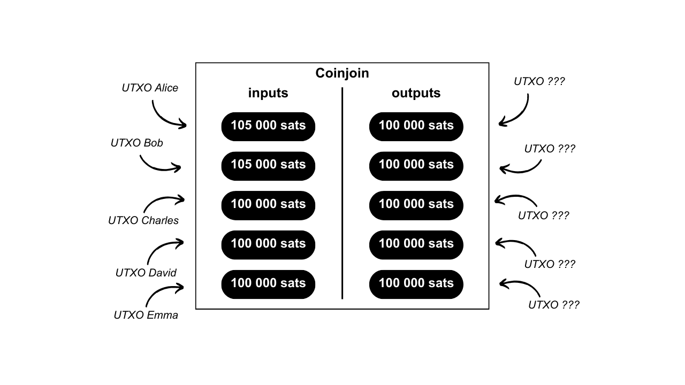

## COINJOIN

Le Coinjoin est une technique permettant de casser le traçage des bitcoins. Il repose sur une transaction collaborative à la structure spécifique de même nom : la transaction Coinjoin. Les transactions Coinjoin permettent d'améliorer la protection de la vie privée des utilisateurs de Bitcoin en rendant l'analyse des transactions plus difficile pour les observateurs extérieurs. Cette structure permet la combinaison de plusieurs transactions indépendantes en une seule transaction, rendant difficile la détermination des liens entre les adresses d'entrée et de sortie. Le fonctionnement général du Coinjoin est le suivant : différents utilisateurs souhaitant mixer déposent un montant en input d'une transaction. Ces inputs ressortiront en différents outputs de même montant. À la sortie de la transaction, il est donc impossible de déterminer quel output appartient à quel utilisateur. Il n'y a techniquement aucun lien entre les entrées et les sorties de la transaction Coinjoin. Le lien entre chaque utilisateur et chaque UTXO est cassé, de la même manière que l'historique de chaque pièce.

Pour permettre le Coinjoin sans qu'aucun utilisateur ne perde la main sur ses fonds à aucun moment, la transaction est d'abord construite par un coordinateur puis transmise à chaque utilisateur. Chacun d'eux signe alors la transaction de son côté en vérifiant qu'elle lui convient, puis toutes les signatures sont ajoutées à la transaction. Si un utilisateur ou le coordinateur tente de voler les fonds des autres en modifiant les outputs de la transaction Coinjoin, alors les signatures seront invalides et la transaction sera refusée par les nœuds. Ce protocole spécifique avec un coordinateur central s'appelle « *Chaumian Coinjoin* ».

Ce mécanisme augmente la confidentialité des transactions sans nécessiter de modifications du protocole Bitcoin. Des implémentations spécifiques de Coinjoin, telles que Whirlpool, JoinMarket ou Wabisabi, proposent des solutions pour faciliter le processus de coordination entre les participants et renforcer l'efficacité de la transaction Coinjoin. Exemple de transaction Coinjoin : [323df21f0b0756f98336437aa3d2fb87e02b59f1946b714a7b09df04d429dec2](https://mempool.space/fr/tx/323df21f0b0756f98336437aa3d2fb87e02b59f1946b714a7b09df04d429dec2)

> *Le terme de « Coinjoin » ne dispose pas de traduction française. Certains bitcoiners utilisent également les termes de « mix », de « mixing » ou encore de « mixage » pour évoquer la transaction Coinjoin. Le mixage est plutôt le processus utilisé au cœur du Coinjoin. Aussi, il ne faut pas confondre le mixage par Coinjoins et le mixage par un acteur central qui prend possession des bitcoins durant le processus. Cela n'a rien à voir avec le Coinjoin où l'utilisateur ne perd à aucun moment la main sur ses bitcoins durant le processus. Pour plus d'informations, voir la définition de **[CHAUMIAN COINJOIN](/dictionnaire/C.md#chaumian-coinjoin)**.*

