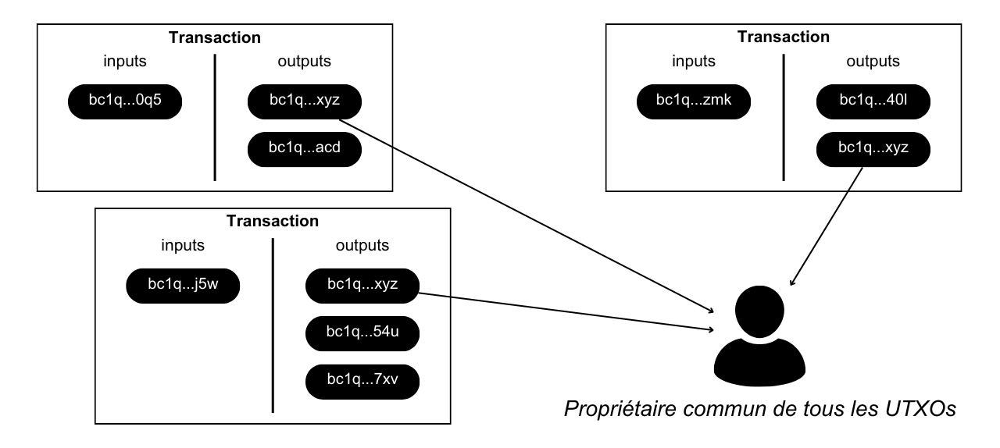

On dit d'une réutilisation d'adresse qu'elle est « externe » lorsqu'elle survient sur plusieurs transactions différentes. Dans cette configuration, la réutilisation d'adresse externe est une heuristique d'analyse de chaîne qui permet d'émettre une hypothèse vraisemblable selon laquelle toutes ces adresses appartiennent à une même entité.

