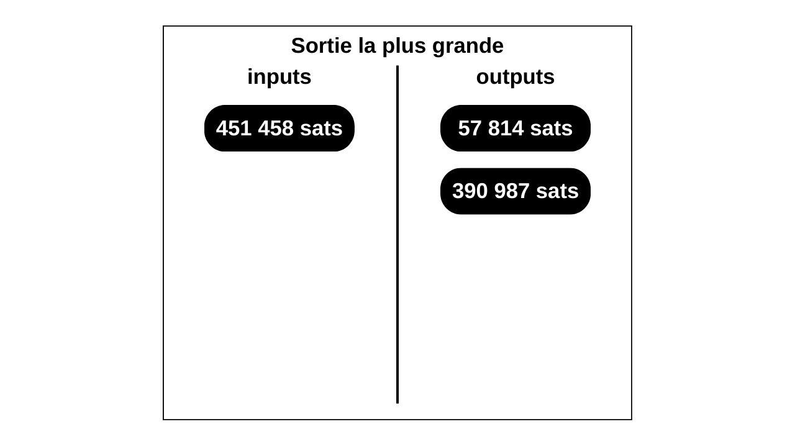

## SAMOURAI WALLET

Logiciel de portefeuille Bitcoin pour appareils mobiles Android axé sur la confidentialité. Il offre des fonctionnalités avancées telles que les coinjoins Whirlpool, Stonewall, StonewallX2, Ricochet ou encore Stowaway (payjoin). Samourai implémente également de nombreuses protections pour aider l'utilisateur à protéger sa vie privée face à l'analyse de chaîne.


> ► *Le 24 avril 2024, les 2 cofondateurs de Samourai Wallet ont été injustement arrêtés pour avoir simplement écrit du code. Je tiens à leur exprimer mon soutien indéfectible. Leur engagement pour la protection de la vie privée et la liberté incarne les valeurs fondamentales de Bitcoin. Ces développeurs n'ont commis aucun crime ; ils ont seulement œuvré pour offrir des outils permettant à chacun de faire valoir ses droits naturels. Leur procès est d'une importance capitale à la fois pour Bitcoin et son écosystème, mais plus largement pour la liberté dans nos démocraties. Afin de les soutenir dans cette épreuve, j'invite chacun à contribuer à leur défense juridique. Vos dons permettront d'assurer la meilleure défense possible à ces développeurs qui œuvrent au quotidien pour nos libertés. Ils permettront également de créer un précédent qui dissuadera de futures intimidations à l'encontre des développeurs, et ainsi de ne pas freiner l'innovation technologique sur Bitcoin et son écosystème. **Pour donner : https://p2prights.org/**.*

## SATOSHI (SAT)

Le satoshi, souvent abrégé en « sat », est la plus petite subdivision du bitcoin qui peut être enregistrée sur la blockchain. Il est nommé en l'honneur de l'inventeur de Bitcoin, Satoshi Nakamoto. Un seul Bitcoin se divise en 100 000 000 sats, ce qui signifie qu'un satoshi équivaut à 0,00000001 bitcoin. En raison de sa petite valeur unitaire, le sat est souvent utilisé pour établir des prix, en particulier dans les petites transactions. Son utilisation est souvent préférée au BTC sur le Lightning Network.

## SCALA

Langage de programmation conçu pour être concis, combinant programmation fonctionnelle et orientée objet. Scala est souvent utilisé pour les applications d'entreprise, le développement de systèmes complexes et le traitement de données. Ce langage est notamment celui utilisé pour l'implémentation Eclair du Lightning Network.

## SCALABILITÉ

Fait référence à la capacité de Bitcoin à gérer une augmentation du volume de transactions tout en maintenant des performances acceptables. Bitcoin est confronté à des limitations techniques inhérentes, telles que la taille des blocs, l'intervalle de temps entre chaque bloc, et le fait qu'une transaction ne soit considérée comme immuable qu'après plusieurs confirmations. Ces contraintes empêchent Bitcoin de traiter un nombre illimité de transactions de manière efficace. Lorsque la demande pour l'espace dans les blocs s'intensifie, les utilisateurs sont contraints d'augmenter les frais proposés pour que leurs transactions soient traitées. La scalabilité, c'est-à-dire la capacité de Bitcoin à gérer l'augmentation du volume de transactions, peut être améliorée soit par des modifications directes du protocole, soit par des solutions externes comme le Lightning Network. La question de la scalabilité a toujours été au cœur de vifs débats au sein de la communauté. On retrouve la première tentative d'augmentation de la taille des blocs en octobre 2010 avec [un patch proposé par Jeff Garzik](https://bitcointalk.org/index.php?topic=1347.0). C'est ce sujet de la scalabilité qui a notamment mené à la guerre des blocs entre 2015 et 2017.

> ► *Le terme de « scalabilité » est un anglicisme. La bonne traduction du terme anglais « scalabilty » est « évolutivité » ou bien « passage à l'échelle ». Toutefois, il est généralement admis au sein de la communauté d'utiliser directement le terme de « scalabilité ». Pour plus d'informations, voir la définition de **[BLOCKSIZE WAR](./B.md#blocksize-war)**.*

## SCHNORR (PROTOCOLE)

Le protocole de Schnorr est un algorithme de signatures électroniques établi sur la cryptographie sur les courbes elliptiques (ECC). Il est utilisé sur Bitcoin pour dériver une clé publique à partir d'une clé privée et pour signer une transaction avec une clé privée. Sur Bitcoin, tout comme ECDSA, Schnorr est établi sur l'exploitation de la courbe elliptique `secp256k1`, caractérisée par l'équation : $y^2 = x^3 + 7$. Le protocole de signature de Schnorr est implémenté dans le protocole Bitcoin depuis novembre 2021 avec l'activation de la mise à jour Taproot.

## SCORE (SCORE BASED METHOD)

Méthode de calcul de la rémunération des mineurs dans le contexte des pools de minage. Ce système de récompense est proportionnel, mais pondéré par le moment auquel la share est soumise. La méthode SCORE valorise les parts en fonction du temps écoulé depuis le début du cycle de minage. Plus une part est soumise tardivement dans le cycle, plus sa valeur est élevée. Cette méthode permet d'inciter les mineurs à rester, car à chaque arrêt du minage, le mineur voit son score stagner alors que celui des autres augmente de plus en plus rapidement.

> ► *Cette méthode est parfois également nommée « Bitcoin Pooled Mining » (BPM).*

## SCRIPT

Langage de programmation à piles utilisé pour établir des conditions de dépense, et donc, indirectement, sécuriser des bitcoins. Script est essentiellement une liste d'instructions, composée d'opérateurs logiques et de commandes pour manipuler les piles (*stacks*). Il se matérialise par l'utilisation d'opcodes qui donnent des instructions spécifiques qui sont exécutées par les nœuds pour vérifier la validité d'une transaction. Script est un langage non-Turing complet. Il peut être catégorisé comme un langage de niveau intermédiaire (presque bas niveau) inspiré du Forth.

> ► *Pour plus d'informations, voir les définitions de **[PILE (STACK)](./P.md#pile-stack)** et **[OPCODES](./O.md#opcodes)**.*

## SCRIPTLESS SCRIPTS

Concept initialement développé par Andrew Poelstra qui permet l'exécution de contrats intelligents sans exposer explicitement la logique du contrat sur la blockchain Bitcoin. Comme le suggère l'appellation « script sans script », l'idée repose sur l'exécution de scripts (ou de contrats) sans recourir explicitement à des scripts. Ces contrats exploitent les propriétés des signatures de Schnorr qui permettent l'usage des *Adaptors Signatures*, notamment pour réaliser des *Atomic Swaps*. Les conditions du contrat sont appliquées et exécutées off-chain par les parties impliquées, qui sont les seules à en connaître les termes. Contrairement aux contrats intelligents classiques, les *Scriptless Scripts* minimisent leur empreinte sur la blockchain, réduisant ainsi le coût de l'opération. Ces contrats sont aussi plus discrets que les contrats intelligents classiques, qui laissent des traces sur la blockchain. Ils ressemblent donc à des transactions ordinaires, ce qui accroît leur anonset.

## SCRIPTPUBKEY

Script situé dans la partie sortie (output) d'une transaction Bitcoin qui définit les conditions sous lesquelles l'UTXO associé peut être dépensé. Ce script permet donc de sécuriser des bitcoins. Dans sa forme la plus courante, le `scriptPubKey` contient une condition qui exige que la prochaine transaction fournisse une preuve de possession de la clé privée correspondant à une adresse Bitcoin spécifiée. C'est souvent réalisé par un script qui demande une signature correspondant à la clé publique associée à l'adresse utilisée pour sécuriser ces fonds. Lorsqu'une transaction tente d'utiliser cet UTXO en entrée (input), elle doit fournir un `scriptSig` qui, une fois associé avec le `scriptPubKey`, satisfait les conditions posées et produit un script valide. 

Par exemple, voici un `scriptPubKey` P2PKH classique :

```text
OP_DUP OP_HASH160 OP_PUSHBYTES_20 <adresse> OP_EQUALVERIFY OP_CHECKSIG
```

Le `scriptSig` correspondant serait :

```text
<signature> <clé publique>
```


> ► *Pour nommé ce script, on parle également parfois d'un « locking script » ou « script de verrouillage » en français.*

## SCRIPTSIG

Élément dans une transaction Bitcoin situé dans les inputs. Le `scriptSig` fournit les données nécessaires pour satisfaire les conditions posées par le `scriptPubKey` de la transaction précédente dont les fonds sont dépensés. Il joue donc un rôle complémentaire au `scriptPubKey`. Typiquement, le `scriptSig` contient une signature numérique et une clé publique. La signature est générée par le propriétaire des bitcoins à l'aide de sa clé privée et prouve qu'il a l'autorisation de dépenser l'UTXO. Dans ce cas, le `scriptSig` démontre que le détenteur de l'input possède la clé privée correspondant à la clé publique associée à l'adresse spécifiée dans le `scriptPubKey` de la transaction sortante précédente.

Lorsque la transaction est vérifiée, les données du `scriptSig` sont exécutées dans le `scriptPubKey` correspondant. Si le résultat est valide, cela signifie que les conditions de dépense des fonds ont été remplies. Si toutes les entrées de la transaction fournissent un `scriptSig` qui valide leur `scriptPubKey`, la transaction est valide et pourra être ajoutée à un bloc pour son exécution.

Par exemple, voici un `scriptSig` P2PKH classique :

```text
<signature> <clé publique>
```

Le `scriptPubKey` correspondant serait :

```text
OP_DUP OP_HASH160 OP_PUSHBYTES_20 <adresse> OP_EQUALVERIFY OP_CHECKSIG
```


> ► *Le `scriptSig` est également parfois nommé « unlocking script » ou « script de déverrouillage » en français.*

## SCRIPTWITNESS

Élément dans les entrées de transactions SegWit qui contient les signatures et les clés publiques nécessaires pour déverrouiller les bitcoins envoyés dans la transaction. Semblable au `scriptSig` des transactions Legacy, le `scriptWitness` n'est toutefois pas placé au même endroit. En effet, c'est cette partie, que l'on appelle le « témoin » (« *witness* » en anglais), qui est déplacée dans une base de données séparée afin de résoudre le problème de la malléabilité des transactions. Chaque input SegWit possède son propre `scriptWitness`, et tous les `scriptWitness` forment ensemble le champ `Witness` de la transaction.

> ► *Attention de ne pas confondre le `scriptWitness` avec le `witnessScript`. Tandis que le `scriptWitness` contient les données de témoin de tout input SegWit, le `witnessScript` définit les conditions de dépense d'un UTXO P2WSH ou P2SH-P2WSH et constitue un script à part entière, à la manière du `redeemScript` pour une sortie P2SH.*

## SDK (SOFTWARE DEVELOPMENT KIT)

Ensemble d'outils logiciels fournissant les ressources nécessaires aux développeurs pour créer des applications sur une plateforme spécifique. Un SDK inclut des bibliothèques, des guides de développement, des exemples de code ou encore des processus de compilation. Les SDK facilitent et accélèrent le développement en offrant des modules réutilisables. Sur Bitcoin, il existe le BDK (*Bitcoin Dev Kit*) et le LDK (*Lightning Dev Kit*).

> ► *En anglais, les SDK sont également parfois appelés « devkit ». Pour plus d'informations, voir les définitions de [**BDK**](./B.md#bdk-bitcoin-dev-kit) et de [**LDK**](./L.md#ldk-lightning-dev-kit).*

## SECP256K1

Nom donné à une courbe elliptique spécifique utilisée dans le cadre du protocole Bitcoin pour l'implémentation des algorithmes de signatures numériques ECDSA (*Elliptic Curve Digital Signature Algorithm*) et Schnorr. La courbe `secp256k1` a été choisie par l’inventeur de Bitcoin, Satoshi Nakamoto. Elle présente certaines propriétés intéressantes, notamment des avantages en termes de performance.

L'utilisation de `secp256k1` sur Bitcoin implique que chaque clé privée (un nombre aléatoire de 256 bits) est mappée à une clé publique correspondante par addition et doublement de point de la clé privée par le point générateur de la courbe `secp256k1`. Cette opération est facile à réaliser dans un sens, mais pratiquement impossible à inverser, ce qui constitue la base de la sécurité des signatures numériques sur Bitcoin.

La courbe `secp256k1` est spécifiée par l'équation de la courbe elliptique $y^2 = x^3 + 7$, ce qui signifie qu'elle a des coefficients $a$ égal à $0$ et $b$ égal à $7$ dans la forme générale de l'équation d'une courbe elliptique $y^2 = x^3 + ax + b$. `secp256k1` est définie sur un corps fini dont l'ordre est un nombre premier très grand, spécifiquement $p = 2^{256} - 2^{32} - 977$. La courbe a également un ordre de groupe, qui est le nombre de points distincts sur la courbe, un point générateur (ou point $G$) prédéfini, qui est utilisé dans les opérations de cryptographie pour générer des paires de clés, et un cofacteur qui est égal à $1$.

> ► *« SEC » désigne « Standards for Efficient Cryptography ». « P256 » désigne le fait que la courbe est définie sur un corps $\mathbb{Z}_p$ où $p$ est un nombre premier de 256 bits. « K » désigne le nom de son inventeur, Neal Koblitz. Enfin, « 1 » désigne que c’est la première version de cette courbe.*

## SECP256R1

Nom donné à une courbe elliptique définie par le standard NIST pour la cryptographie à clé publique. Elle utilise un champ premier de 256 bits et une équation de courbe elliptique $y^2 = x^3 + ax + b$ avec les constantes :

```text
a = -3
```

et 

```text
b = 410583637251521421293261297800472684091144410159937255548542755610749322
77127
```

La courbe `secp256r1` est largement utilisée dans de nombreux protocoles, mais elle n'est pas utilisée dans Bitcoin. En effet, Satoshi Nakamoto a opté pour la courbe `secp256k1`, qui était alors peu connue en 2009. La raison précise de ce choix est inconnue, mais il est possible que ce soit dans le but de minimiser le risque de présence de backdoors. Les paramètres de la courbe $k1$ sont, en effet, nettement plus simples que ceux de la courbe $r1$, en particulier la constante $b$.

> ► *Cette courbe est parfois également nommée « P-256 ».*

## SEED (BITCOIN)

Dans le cadre de Bitcoin, une seed (graine) est une valeur de 512 bits utilisée pour dériver toutes les clés privées et publiques associées à un portefeuille HD (déterministe et hiérarchique). Techniquement, la seed est une valeur différente de la phrase de récupération (ou mnémonique). La phrase, qui est généralement composée de 12 ou 24 mots, est générée de manière pseudo-aléatoire à partir d'une source d'entropie et complétée par une somme de contrôle (checksum). Cette phrase permet de faciliter la sauvegarde par des humains en donnant une représentation textuelle à la valeur à la base du portefeuille.

Pour obtenir la seed réelle, la phrase de récupération, éventuellement accompagnée d'une passphrase optionnelle, est passée dans l'algorithme PBKDF2 (*Password-Based Key Derivation Function 2*). Le résultat de ce calcul est une graine de 512 bits. C'est cette graine qui est utilisée pour générer déterministiquement la clé maîtresse, puis l'ensemble des clés du portefeuille HD, conformément au BIP32.


> ► *Cependant, dans le langage courant, la majorité des bitcoiners se réfèrent à la phrase mnémonique quand ils parlent de la « seed », et non à l'état intermédiaire de dérivation qui se situe entre la phrase mnémonique et la clé maîtresse.*

## SEED (CRYPTOGRAPHIE)

Hors du contexte de Bitcoin, dans le domaine de la cryptographie en général, une seed est une valeur initiale utilisée pour générer des clés cryptographiques, ou plus largement, n'importe quel type de données produites par un générateur de nombres pseudo-aléatoires. Cette valeur initiale doit être aléatoire et imprévisible pour garantir la sécurité du système cryptographique. En effet, la seed introduit de l'entropie dans le système, mais le processus de génération qui suit est lui déterministe.

> ► *La traduction française de « seed » est « graine ».*

## SEED NODES

Liste statique de nœuds Bitcoin publics, intégrée directement dans le code source de Bitcoin Core (`bitcoin/src/chainparamsseeds.h`). Cette liste sert de points de connexion pour les nouveaux nœuds Bitcoin qui rejoignent le réseau, mais elle n'est utilisée que si les DNS seeds ne fournissent pas de réponse dans les 60 secondes suivant leur sollicitation. Dans ce cas, le nouveau nœud Bitcoin se connectera à ces seed nodes pour établir une première connexion au réseau et demander des adresses IP d'autres nœuds. L'objectif final est d'acquérir les informations nécessaires pour effectuer l'IBD et se synchroniser avec la chaîne qui a le plus de travail accumulé. La liste des seed nodes comprend près de 1000 nœuds, identifiés conformément à la norme établie par le BIP155. Ainsi, les seed nodes représentent la troisième méthode de connexion au réseau pour un nœud Bitcoin, après l'éventuelle utilisation du fichier `peers.dat`, créé par le nœud lui-même, et la sollicitation des DNS seeds.

> ► *Attention, les seed nodes ne doivent pas être confondus avec les « DNS seeds », qui sont eux la deuxième manière d'établir des connexions. Pour plus d'informations, voir la définition de **[DNS SEEDS](./D.md#dns-seeds)**.*

## SEGWIT

SegWit, acronyme de « *Segregated Witness* » (Témoin Séparé), est une mise à jour du protocole Bitcoin introduite en août 2017. Elle vise à résoudre plusieurs problèmes techniques, dont la question de la capacité transactionnelle du réseau, le problème de malléabilité des transactions et la facilitation des modifications futures du protocole.

Ce soft fork modifie la structure des transactions en déplaçant les données de signature vers un répertoire séparé. Concrètement, avec SegWit, les signatures sont retirées du bloc principal et insérées dans une structure de données distincte à la fin du bloc, ce sont les témoins (*witness*). Cette séparation permet d'augmenter la capacité de chaque bloc sans modifier la taille maximale des blocs elle-même, qui est de 1 Mo sur Bitcoin. Cette modification résout également le problème de la malléabilité des transactions. Avant SegWit, les signatures pouvaient être modifiées avant qu'une transaction ne soit confirmée, ce qui changeait l'identifiant de la transaction. Cela rendait difficile la construction de transactions complexes, car une transaction non confirmée pouvait voir son identifiant changer. En séparant les signatures, SegWit rend les transactions non malléables, car tout changement dans les signatures n'affecte plus l'identifiant de la transaction (TXID), mais uniquement l'identifiant du témoin (WTXID). En résolvant le problème de la malléabilité, SegWit a ouvert la voie à d'autres développements en surcouche du système Bitcoin, notamment le réseau Lightning Network, qui permet des transactions rapides et à faible coût.

## SEGWIT2X

Tentative controversée de hard fork visant à doubler la limite de taille des blocs sur Bitcoin, tout en intégrant SegWit. SegWit2x a été introduit lors du New York Agreement en 2017, une réunion confidentielle entre plus de 50 entreprises de l'écosystème qui visait à trouver une solution pour le passage à l'échelle du système. SegWit2x a cherché à augmenter la capacité transactionnelle de Bitcoin en portant la taille maximale d'un bloc à 2 Mo, contre 1 Mo initialement. Le hard fork était prévu au bloc 494 784, soit durant le mois de novembre 2017.

Malgré la mise en place de SegWit en août 2017, le projet 2X de doublement de la taille n'a pas réussi à obtenir un consensus, notamment à cause de la campagne d'opposition « NO2X », ce qui a mené à son annulation au début du mois de novembre. Cet épisode a été perçu par beaucoup d'utilisateurs et de développeurs comme une attaque contre Bitcoin, dans le cadre de la Blocksize War.

> ► *SegWit2x est parfois également nommé « B2X » ou « S2X ». Initialement, son nom était « SegWit2Mb ». Pour plus d'informations, voir la définition de **[BLOCKSIZE WAR](./B.md#blocksize-war)**.*

## SEGWIT V0

Version de script post-SegWit 0. Les scripts SegWit V0 représentent la première famille de scripts introduite après la mise à jour SegWit de 2017. Les scripts P2WPKH et P2WSH incarnent la version SegWit V0. Les adresses correspondantes commencent toujours par `bc1q` et sont encodées en format `Bech32`.

## SEGWIT V1

Version de script post-SegWit 1. Les scripts SegWit V1 représentent la seconde famille de scripts introduite après la mise à jour SegWit de 2017. En l'occurrence, les scripts SegWit V1 ont été présentés avec la mise à jour Taproot en 2021. Le script P2TR est de la version SegWit V1. Les adresses correspondantes commencent toujours par `bc1p` et sont encodées en format `Bech32m`.

## SÉLECTION DES PIÈCES

Processus par lequel un logiciel de portefeuille Bitcoin choisit quels UTXOs utiliser comme entrées pour satisfaire les sorties d'une transaction. La méthode de sélection des pièces est importante, car elle a des conséquences sur le coût d'une transaction et la confidentialité de l'utilisateur. Elle vise souvent à minimiser le nombre d'entrées utilisées, afin de réduire la taille de la transaction et les frais associés, tout en tentant de préserver la confidentialité en évitant de fusionner des pièces provenant de sources différentes (CIOH). Plusieurs méthodes existent pour la sélections de pièce, comme le *Knapsack Solver* ou le *Branch-and-Bound*. Lorsque la sélection des pièces est réalisée manuellement par l'utilisateur, on parle alors de « *Coin Control* ».

> ► *En anglais, on parle de « Coin Selection ».*

## SELF-CUSTODY

Désigne la pratique par laquelle un utilisateur garde le contrôle direct de ses clés privées, et donc de ses bitcoins, sans dépendre d'une entité externe pour la gestion de ses actifs.

## SELFISH MINING

Stratégie (ou attaque) dans le minage, où un mineur ou un groupe de mineurs conserve intentionnellement des blocs avec une preuve de travail valide sans les diffuser immédiatement sur le réseau. L'objectif est de conserver une avance sur les autres mineurs en termes de preuve de travail, ce qui leur permet potentiellement de miner plusieurs blocs d'affilée et de les publier en une seule fois, maximisant ainsi leurs gains. Autrement dit, le groupe de mineurs attaquants ne minent pas sur le dernier bloc validé par l'ensemble du réseau, mais plutôt sur un bloc qu'ils ont eux-mêmes créé, qui diffère de celui validé par le réseau.

Ce procédé génère une sorte d'embranchement secret de la blockchain, qui reste inconnu de l'ensemble du réseau jusqu'à ce que cette chaîne alternative dépasse potentiellement la blockchain honnête. Une fois que la chaîne secrète des mineurs attaquants devient plus longue (c'est-à-dire qu'elle contient plus de travail accumulé) que la chaîne honnête et publique, elle est alors diffusée sur l'ensemble du réseau. À ce moment-là, les nœuds du réseau, qui suivent la chaîne la plus longue (avec le plus de travail accumulé), vont se synchroniser sur cette nouvelle chaîne. Il y a donc une réorganisation.

Le selfish mining est embêtant pour les utilisateurs, car il diminue la sécurité du système en gaspillant une partie de la puissance de calcul du réseau. En cas de réussite, il conduit également à des réorganisations de la blockchain, affectant ainsi la fiabilité des confirmations de transaction pour les utilisateurs. Cette pratique reste tout de même risquée pour le groupe de mineurs attaquants, car il est souvent plus rentable de miner normalement au-dessus du dernier bloc connu publiquement plutôt que d'allouer de la puissance de calcul à un embranchement secret qui ne dépassera probablement jamais la blockchain honnête. Au plus le nombre de blocs dans la réorganisation est grand, au plus la probabilité de réussite de l'attaque est basse.

> ► *La traduction française de « selfish mining » est « minage égoïste ». Attention, une attaque par selfish mining ne doit pas être confondue avec une attaque de block withholding (bloc retenu). Pour plus d'informations, voir la définition de **[BLOCK WITHHOLDING](./B.md#block-withholding)**.*

## SETTINGS.JSON

Fichier utilisé dans Bitcoin Core pour stocker les paramètres de l'interface graphique (GUI). Il conserve des informations sur les configurations de l'utilisateur, telles que les portefeuilles ouverts par exemple. Lorsque Bitcoin Core est redémarré, ce fichier permet de rouvrir automatiquement les portefeuilles qui étaient actifs avant la fermeture de l'application. En cas de fermeture d'un portefeuille via l'interface GUI, il est également supprimé de ce fichier, et il ne sera donc pas rouvert automatiquement au prochain démarrage.

## SHA256

Sigle pour « *Secure Hash Algorithm 256 bits* ». C'est une fonction de hachage cryptographique produisant un condensat de 256 bits. Conçue par la *National Security Agency* (NSA) au début des années 2000, elle est devenue une norme fédérale pour le traitement des données sensibles. Dans le protocole Bitcoin, la fonction `SHA256` est omniprésente. Elle est employée pour hacher les entêtes des blocs dans le cadre de la preuve de travail. `SHA256` est également utilisée dans le processus de dérivation d'une adresse de réception à partir d'une clé publique. On l'utilise également pour l'agrégation des transactions et des témoins au sein des arbres de Merkle dans les blocs. On retrouve aussi `SHA256` dans le calcul d'empreinte de clés, le calcul de certaines sommes de contrôle et dans de nombreux autres processus autour de Bitcoin. Lorsqu'elle est appliquée deux fois de suite, on parle d'un `HASH256`. Cette double application est celle utilisée majoritairement sur Bitcoin. Lorsque `SHA256` est utilisé conjointement à la fonction `RIPEMD160`, on parle d'un `HASH160`. Ce double hachage est utilisé pour les empreintes de clés et pour le hachage de clés publiques. La fonction `SHA256` fait partie de la famille des SHA 2.

> ► *Pour plus d'informations, voir la définition de [**FONCTION DE HACHAGE**](./F.md#fonction-de-hachage).*

## SHA512

Sigle pour « *Secure Hash Algorithm 512 bits* ». C'est une fonction de hachage cryptographique produisant un condensat de 512 bits. Elle a été conçue par la *National Security Agency* (NSA) au début des années 2000. Pour Bitcoin, la fonction `SHA512` n'est pas utilisée directement dans le cadre du protocole, mais elle est utilisée dans le cadre des dérivations de clés enfants au niveau applicatif, selon le BIP32 et le BIP39. Dans ces processus, elle est utilisée plusieurs fois dans l'algorithme `HMAC`, ainsi que dans la fonction de dérivation de clés `PBKDF2`. La fonction `SHA512` fait partie de la famille des SHA 2, comme `SHA256`. Son fonctionnement est d'ailleurs très similaire à cette dernière.

> ► *Pour plus d'informations, voir la définition de [**FONCTION DE HACHAGE**](./F.md#fonction-de-hachage).*

## SHAREDCOIN

Service de mixage de pièces Bitcoin lancé en 2013 par Blockchain.info, mais qui n'est plus en service aujourd'hui. Ce service proposait aux utilisateurs d'améliorer leur confidentialité sur Bitcoin en combinant leurs transactions avec celles d'autres personnes, grâce à une technique de mixage similaire aux coinjoins. SharedCoin apportait une forme de confidentialité sans nécessiter de faire confiance au coordinateur, car les pièces des utilisateurs restaient sous leur contrôle tout au long du processus. Contrairement aux services de mixage centralisés de l'époque, les bitcoins ne pouvaient pas être volés par l'intermédiaire. SharedCoin a par la suite fait face à des problèmes menant à la désanonymisassions de certains de leurs mixages au début de l'été 2014. 

> ► *Pour plus d'informations, voir la définition de [**COINJOIN**](./C.md#coinjoin).*

## SHARES

Dans le cadre des pools de minage, une share est un indicateur utilisé pour quantifier la contribution d'un mineur individuel au sein de la pool. Cette mesure sert de base pour le calcul de la récompense que la pool redistribue à chaque mineur. Chaque share correspond à un hash qui satisfait une cible de difficulté moins élevée que celle du réseau Bitcoin.

Pour expliquer avec une analogie, considérons un dé à 20 faces. Sur Bitcoin, supposons que la preuve de travail exige de faire un lancé inférieur à 3 pour valider un bloc (c'est-à-dire, obtenir un résultat de 1 ou 2). Maintenant, imaginons qu'au sein d'une pool de minage, la cible de difficulté pour une share est fixée à 10. Ainsi, pour un mineur individuel dans la pool, chaque lancer de dés qui donne un résultat inférieur à 10 compte comme une share valide. Ces shares sont ensuite transmises à la pool par le mineur, afin de réclamer sa rémunération, même si elles ne correspondent pas à un résultat valide pour un bloc sur Bitcoin.

Pour chaque hash calculé, un mineur individuel dans une pool peut rencontrer trois scénarios différents :
* Si la valeur du hash est supérieure ou égale à la cible de difficulté fixée par la pool pour une share, alors ce hash n'est d'aucune utilité. Le mineur modifie alors son nonce pour tenter un nouveau hash : `hash > share > bloc`.
* Si le hash est inférieur à la cible de difficulté de la share, mais supérieur ou égal à la cible de difficulté de Bitcoin, alors ce hash constitue une share valide qui n'est cependant pas suffisante pour valider un bloc. Le mineur peut envoyer ce hash à sa pool pour réclamer la récompense associée à la share : `share > hash > bloc`.
* Si le hash est inférieur à la cible de difficulté du réseau Bitcoin, il est considéré à la fois comme une share valide et comme un bloc valide. Le mineur transmet ce hash à sa pool, qui s'empresse de le diffuser sur le réseau Bitcoin. Ce hash est également comptabilisé comme une share valide pour le mineur : `share > bloc > hash`.


Ce système de shares est utilisé pour estimer le travail réalisé par chaque mineur individuel au sein d'une pool, sans devoir recalculer individuellement tous les hash générés par un mineur, ce qui serait complètement inefficace pour la pool.

Les pools de minage ajustent la difficulté des shares pour équilibrer la charge de vérification et s'assurer que chaque mineur, qu'il soit petit ou grand, soumet des shares environ toutes les quelques secondes. Cela permet de calculer avec précision le hashrate de chaque mineur et de distribuer les récompenses selon la méthode de calcul de la rémunération choisie (PPS, PPLNS, TIDES...).

> ► *En français, on peut traduire « shares » par « part ».*

## SHARES DIFFICULTY

Cible de difficulté supérieure à celle de Bitcoin (donc moins difficile), définie par une pool de minage pour qualifier un hash de share et évaluer la contribution de chaque mineur individuel dans la pool. Pour gérer efficacement la charge de vérification et garantir que chaque mineur, quelle que soit sa puissance de calcul, soumette des shares régulièrement, les pools ajustent la difficulté des shares. La difficulté attribuée à chaque mineur détermine le nombre de shares qu'il accumule : par exemple, si un mineur a une difficulté assignée de 10 et qu'il soumet 5 preuves de travail valides à cette difficulté, il obtient 50 shares. Un mineur plus puissant avec une difficulté de 100 qui soumet 7 preuves de travail valides recevra 700 shares. Ce système permet de quantifier précisément le hashrate de chaque mineur et de distribuer les récompenses selon la méthode de calcul de la rémunération choisie (PPS, PPLNS, TIDES...).

> ► *Pour plus d'informations, voir la définition de **[SHARES](./S.md#shares)**.*

## SHITCOIN

Expression péjorative fréquemment employée dans le monde des cryptomonnaies pour qualifier des altcoins jugés sans valeur ou sans avenir. Ce terme est utilisé dans deux contextes distincts : dans le milieu général des cryptomonnaies, il désigne un projet qui manque d'innovation technologique, qui ne présente pas de cas d'usage concret, ou qui est principalement le fruit d'une spéculation excessive. Pour les bitcoiners maximalistes, le terme englobe toutes les cryptomonnaies autres que le bitcoin (BTC), faisant ainsi de « shitcoin » un synonyme d'« altcoin ». Le mot est un assemblage de « shit », qui signifie « merde » en anglais, et de « coin » qui signifie « pièce ». L'utilisation initiale du terme remonte à un message posté par l'utilisateur Ribuck le 8 novembre 2010 sur le forum Bitcoin Talk.

## SHOR (ALGORITHME)

Algorithme quantique inventé en 1994 par Peter Shor permettant de factoriser de grands entiers en produit de nombres premiers en temps polynomial. En réduisant le nombre d'opérations nécessaires pour factoriser des entiers, Shor pourrait rendre impraticable les algorithmes de cryptographie établis sur ce problème mathématique comme RSA. Shor peut être légèrement modifié pour agir sur presque tous les algorithmes qui utilisent une structure de groupe. Il dispose notamment déjà d'une variante efficace sur la cryptographie sur les courbes elliptiques (ECDSA, Schnorr...). Shor et ses proches variantes sont donc efficaces sur les algorithmes de cryptographie asymétrique. À l'heure actuelle, nous ne disposons pas encore d'un ordinateur quantique suffisamment puissant et stable pour exécuter avec succès l'algorithme de Shor.

## SIDECHAIN

Blockchain conçue pour fonctionner en parallèle avec la blockchain principale de Bitcoin. Les deux chaînes sont connectées à l'aide d'un ancrage bilatéral qui permet de faire en sorte que l'actif qui circule sur la sidechain conserve la même valeur que le bitcoin sur la chaîne principale. La sidechain dispose de son propre mécanisme de consensus qui peut être indépendant ou qui peut reposer en partie sur celui de la chaîne principale. Elle permet généralement d'utiliser des fonctionnalités qui ne sont pas disponibles directement sur la chaîne principale, ou bien de bénéficier de fonctionnalités améliorées, comme par exemple : plus de flexibilité dans le développement, des transactions plus rapides et/ou plus confidentielles, ou encore, une capacité transactionnelle plus élevée. Pour ce faire, la sidechain fait des compromis par rapport à la chaîne principale.

Le concept de sidechain a initialement été présenté en 2014 par Adam Back, Matt Corallo, Luke Dashjr, Mark Friedenbach, Gregory Maxwell, Andrew Miller, Andrew Poelstra, Jorge Timon et Pieter Wuille. Actuellement, les sidechains les plus connues sur Bitcoin sont Liquid et RSK (Rootstock). Ces dernières demeurent toutefois très peu utilisées par rapport à d'autres solutions de surcouche avec un modèle différent comme le Lightning Network.

> ► *En français, on parle d'une « chaîne latérale » ou d'une « chaîne parallèle ».*

## SIGHASH_ALL (0X01)

Type de SigHash Flag utilisé dans les signatures des transactions Bitcoin pour indiquer que la signature s'applique à tous les composants de la transaction. En utilisant `SIGHASH_ALL`, le signataire couvre tous les inputs et tous les outputs. Cela signifie que ni les inputs ni les outputs ne peuvent être modifiés après la signature sans invalider celle-ci. Ce type de SigHash Flag est le plus courant dans les transactions Bitcoin, car il assure une finalité et une intégrité complètes de la transaction.

## SIGHASH_ALL/SIGHASH_ACP

Type de SigHash Flag (`0x81`) combiné avec le modificateur `SIGHASH_ANYONECANPAY` (`SIGHASH_ACP`) utilisé dans les signatures des transactions Bitcoin. Cette combinaison spécifie que la signature s'applique à tous les outputs et uniquement à un input spécifique de la transaction. `SIGHASH_ALL | SIGHASH_ANYONECANPAY` permet à d'autres participants d'ajouter des inputs supplémentaires à la transaction après sa signature initiale. Elle est particulièrement utile dans des scénarios collaboratifs, comme les transactions de financement participatif, où différents contributeurs peuvent ajouter leurs propres inputs tout en préservant l'intégrité des outputs engagés par le signataire initial.

## SIGHASH_ANYPREVOUT

Proposition d'implémentation d'un nouveau SigHash Flag modificateur dans Bitcoin, introduite avec le BIP118. `SIGHASH_ANYPREVOUT` permet une plus grande flexibilité dans la gestion des transactions, en particulier pour des applications avancées comme les canaux de paiement sur le Lightning Network et la mise à jour Eltoo. Le `SIGHASH_ANYPREVOUT` permet de ne lier la signature à aucun UTXO spécifique antérieur (*Any Previous Output*). Utilisé en combinaison avec `SIGHASH_ALL`, il permettrait de signer tous les outputs d'une transaction, mais aucun input. Cela permettrait de réutiliser la signature pour différentes transactions, tant que certaines conditions spécifiées sont remplies.

> ► *Ce SigHash modificateur SIGHASH_ANYPREVOUT est hérité de l'idée du SIGHASH_NOINPUT initialement proposée par Joseph Poon en 2016 pour améliorer son idée du Lightning Network.*

## SIGHASH_ANYPREVOUTANYSCRIPT

Variante du SigHash Flag modificateur `SIGHASH_ANYPREVOUT` dans Bitcoin. Ce SigHash fonctionne comme `SIGHASH_ANYPREVOUT`, mais il permet en plus de changer le script de sortie associé à un UTXO donné.

## SIGHASH FLAG

Paramètre dans une transaction Bitcoin permettant de déterminer les composants d'une transaction (inputs et outputs) couvertes par la signature associée, qui deviennent donc immuables. Le SigHash Flag est un octet ajouté à la signature numérique de chaque entrée. Le choix du SigHash Flag affecte donc directement les parties de la transaction qui sont figées par la signature et celles qui peuvent encore être encore modifiées par la suite. Ce mécanisme assure que les signatures engagent les données de transaction de manière précise et sécurisée, selon l'intention du signataire. Trois principaux SigHash Flags existent :

-`SIGHASH_ALL` (`0x01`) : La signature s'applique à tous les inputs et outputs de la transaction, les verrouillant ainsi intégralement ;

-`SIGHASH_NONE` (`0x02`) : La signature s'applique à tous les inputs, mais à aucun output, permettant la modification des outputs après la signature ;

-`SIGHASH_SINGLE` (`0x03`) : La signature couvre tous les inputs et seulement un output correspondant à l'index de l'input signé.

En complément de ces trois SigHash Flags, le modificateur `SIGHASH_ANYONECANPAY` (`0x80`) peut être combiné avec chacun des types précédents. Quand ce modificateur est utilisé, seule une partie des inputs est signée, laissant les autres ouverts à modification. Voici les combinaisons existantes avec le modificateur :

-`SIGHASH_ALL | SIGHASH_ANYONECANPAY` (`0x81`) : La signature s'applique à un seul input tout en couvrant tous les outputs de la transaction ;

-`SIGHASH_NONE | SIGHASH_ANYONECANPAY` (`0x82`) : La signature couvre un seul input, sans engager aucun output ;

-`SIGHASH_SINGLE | SIGHASH_ANYONECANPAY` (`0x83`) : La signature s'applique à un seul input et uniquement à l'output ayant le même index que cet input.

> ► *Un synonyme parfois utilisé de « SigHash » est « Signature Hash Types ».*

## SIGHASH_NONE (0X02)

Type de SigHash Flag utilisé dans les signatures des transactions Bitcoin pour indiquer que la signature s'applique à tous les inputs de la transaction, mais à aucun de ses outputs. L'utilisation de `SIGHASH_NONE` implique que le signataire s'engage uniquement sur les entrées, mais permet que les sorties restent indéterminées ou modifiables après la signature. Ce type de signature est utile dans les cas où le signataire souhaite autoriser d'autres parties à décider de la manière dont les bitcoins seront distribués dans cette transaction.

## SIGHASH_NONE/SIGHASH_ACP

Type de SigHash Flag (`0x82`) combiné avec le modificateur `SIGHASH_ANYONECANPAY` (`SIGHASH_ACP`) utilisé dans les signatures des transactions Bitcoin. Cette combinaison indique que la signature s'applique seulement à un input spécifique, sans engager aucun output. Cela permet aux autres participants de rajouter librement des inputs supplémentaires et de modifier tous les outputs de la transaction.

## SIGHASH_SINGLE (0X03)

Type de SigHash Flag utilisé dans les signatures des transactions Bitcoin pour indiquer que la signature s'applique à tous les inputs de la transaction et à un seul output, correspondant à l'index du même input signé. Ainsi, chaque input signé avec `SIGHASH_SINGLE` est lié spécifiquement à un output particulier. Les autres outputs ne sont pas engagés par la signature et peuvent donc être modifiés ultérieurement. Ce type de signature est utile dans des transactions complexes, où les participants veulent lier certains inputs à des outputs spécifiques, tout en laissant de la flexibilité pour les autres outputs de la transaction.

## SIGHASH_SINGLE/SIGHASH_ACP

Type de SigHash Flag (`0x83`) combiné avec le modificateur `SIGHASH_ANYONECANPAY` (`SIGHASH_ACP`) utilisé dans les signatures des transactions Bitcoin. Cette combinaison spécifie que la signature s'applique à un seul input spécifique et uniquement à l'output ayant le même index que cet input. Les autres inputs et outputs peuvent être ajoutés ou modifiés par d'autres parties. Cette configuration est utile pour des transactions collaboratives où les participants peuvent ajouter leurs propres inputs pour financer un output spécifique.

## SIGNATURE AVEUGLE

Les signatures aveugles de Chaum sont une forme de signature numérique où l'émetteur d'une signature ne connaît pas le contenu du message qu'il signe. Mais la signature peut ensuite être vérifiée avec le message original. Cette technique a été développée par le cryptographe David Chaum en 1983.

Prenons l'exemple d'une entreprise désirant faire authentifier un document confidentiel, comme un contrat, sans en révéler le contenu. L'entreprise applique un processus de masquage qui transforme cryptographiquement le document original de manière réversible. Ce document modifié est envoyé à une autorité de certification qui appose une signature aveugle sans connaître le contenu sous-jacent. Après avoir reçu le document masqué signé, l'entreprise démasque la signature. Le résultat est un document original authentifié par la signature de l'autorité, sans que cette dernière ait jamais vu le contenu original.

Les signatures aveugles de Chaum permettent donc de certifier l'authenticité d'un document sans en connaître le contenu, ce qui garantit à la fois la confidentialité des données de l'utilisateur et l'intégrité du document signé.

Sur Bitcoin, on retrouve l'utilisation de ce protocole sur les systèmes de banques chaumiennes en surcouche (Cashu, Fedimint...), mais surtout dans les protocoles de coinjoins chaumiens, afin de s'assurer que le coordinateur ne soit pas en capacité de faire un lien entre un input et un output.

> ► *Pour plus d'informations, voir la définition de **[CHAUMIAN COINJOIN](./C.md#chaumian-coinjoin)**.*

## SIGNATURE NUMÉRIQUE

Preuve cryptographique qui démontre la possession d'une clé privée spécifique, associée à une clé publique unique, sans avoir à la divulguer. Sur Bitcoin, on la construit à l'aide de la clé privée et du hash d'une transaction. Elle atteste la propriété des bitcoins concernés et permet de satisfaire un script qui déverrouille un UTXO. Elle est générée grâce à un algorithme de signature numérique sur courbe elliptique tel qu'ECDSA ou le protocole de Schnorr.

## SIGNET

Versions spécifiques du réseau Bitcoin conçues pour le développement et les tests. Les signets simulent le comportement du réseau principal (mainnet) mais avec la possibilité de contrôler divers paramètres. Ils offrent ainsi un environnement pour tester de nouvelles fonctionnalités ou modifications sans risquer de perturber le réseau principal et sans en subir les frais. Par rapport au testnet, les signets offrent un contrôle plus structuré sur la génération de blocs, souvent gérée par une ou plusieurs entités de confiance ou par un mécanisme de consensus personnalisé. Cela permet de créer des scénarios de test plus prévisibles, par rapport au testnet qui subit les aléas du minage, de la même manière que le mainnet.

## SIGOPS (SIGNATURE OPERATIONS)

Désigne les opérations de signature numérique nécessaires pour valider les transactions. Chaque transaction Bitcoin peut contenir plusieurs inputs, chacun pouvant nécessiter une ou plusieurs signatures pour être considéré comme valide. La vérification de ces signatures se fait grâce à l'utilisation d'opcodes spécifiques que l'on nomme les « sigops ». Concrètement, cela inclut `OP_CHECKSIG`, `OP_CHECKSIGVERIFY`, `OP_CHECKMULTISIG` et `OP_CHECKMULTISIGVERIFY`. Ces opérations font peser une certaine charge de travail sur les nœuds du réseau qui doivent les vérifier. Pour éviter des attaques DoS par inflation artificielle du nombre de sigops, le protocole impose donc une limite sur le nombre de sigops autorisées par bloc, afin de garantir que la charge de validation reste gérable pour les nœuds. Cette limite est actuellement de 80 000 sigops maximum par bloc. Pour compter, les nœuds suivent les règles suivantes :

Dans le `scriptPubKey`, `OP_CHECKSIG` et `OP_CHECKSIGVERIFY` comptent pour 4 sigops. Les opcodes `OP_CHECKMULTISIG` et `OP_CHECKMULTISIGVERIFY` comptent pour 80 sigops. En effet, lors du comptage, ces opérations sont multipliées par 4 lorsqu'elles ne font pas partie d'un input SegWit (pour un P2WPKH, le nombre de sigops sera donc de 1) ;

Dans le `redeemScript`, les opcodes `OP_CHECKSIG` et `OP_CHECKSIGVERIFY` valent également 4 sigops, `OP_CHECKMULTISIG` et `OP_CHECKMULTISIGVERIFY` sont comptabilisés pour `4n` s'ils précèdent `OP_n`, ou 80 sigops dans le cas contraire ;

Pour le `witnessScript`, `OP_CHECKSIG` et `OP_CHECKSIGVERIFY` valent 1 sigop, `OP_CHECKMULTISIG` et `OP_CHECKMULTISIGVERIFY` sont comptés pour `n` s'ils sont introduits par `OP_n`, ou 20 sigops autrement ;

Dans les scripts Taproot, les sigops sont traitées de manière différente par rapport aux scripts traditionnels. Au lieu de compter directement chaque opération de signature, Taproot introduit un budget de sigops pour chaque entrée de transaction, qui est proportionnel à la taille de cette entrée. Ce budget est de 50 sigops plus la taille en octets du témoin de l'input. Chaque opération de signature réduit ce budget de 50. Si l'exécution d'une opération de signature fait chuter le budget en dessous de zéro, le script est invalide. Cette méthode permet plus de flexibilité dans les scripts Taproot, tout en maintenant une protection contre les abus potentiels liés aux sigops, en les liant directement au poids de l'entrée. Ainsi, les scripts Taproot ne sont pas pris en compte dans la limite des 80 000 sigops par bloc.

## SILENT PAYMENT

Méthode pour utiliser des adresses Bitcoin statiques afin de recevoir des paiements sans pour autant produire de réutilisation d'adresse, sans interaction et sans lien visible on-chain entre les différents paiements et l'adresse statique. Cette technique élimine le besoin de générer de nouvelles adresses de réception vierges pour chaque transaction, ce qui permet d'éviter les interactions habituelles dans Bitcoin où le destinataire doit fournir une nouvelle adresse au payeur.

Avec les Silent Payments, le payeur utilise les clés publiques du destinataire (clé publique de dépense et clé publique de scan) et la somme de ses clés privées personnelles en input pour générer une adresse vierge pour chaque paiement. Seul le destinataire, grâce à ses clés privées, peut calculer la clé privée correspondant à cette adresse de paiement. On utilise ECDH (*Elliptic-Curve Diffie-Hellman*), un algorithme cryptographique d'échange de clés, pour établir un secret partagé qui sert ensuite à dériver l'adresse de réception et la clé privée (uniquement du côté du destinataire). Pour identifier les Silent Payments qui leur sont destinés, les destinataires doivent scanner la blockchain et examiner chaque transaction correspondant aux critères du protocole. Contrairement au BIP47, qui utilise une transaction de notification pour établir le canal de paiement, les Silent Payments suppriment cette étape, ce qui permet d'économiser une transaction. Toutefois, le compromis est que le destinataire doit scanner l'ensemble des transactions potentielles pour déterminer, en appliquant ECDH, si elles lui sont adressées.

Par exemple, l'adresse statique de Bob $B$ représente la concaténation de sa clé publique de scan et de sa clé publique de dépense :

$$ B = B_{\text{scan}} \text{ ‖ } B_{\text{spend}} $$

Ces clés sont simplement dérivées à partir du chemin suivant :

```text
scan : m / 352' / 0' / 0' / 1' / 0
spend : m / 352' / 0' / 0' / 0' / 0
```

Cette adresse statique est publiée par Bob. Alice la récupère pour faire un Silent Payment vers Bob. Elle calcule l'adresse de paiement $P_0$ appartenant à Bob de cette façon :

$$  P_0 = B_{\text{spend}} + \text{hash}(\text{inputHash} \cdot a \cdot B_{\text{scan}} \text{ ‖ } 0) \cdot G  $$

Où :

$$  \text{inputHash} = \text{hash}(\text{outpoint}_L \text{ ‖ } A)  $$

Avec :
* $B_{\text{scan}}$ : La clé publique de scan de Bob (adresse statique) ;
* $B_{\text{spend}}$ : La clé publique de dépense de Bob (adresse statique) ;
* $A$ : La somme des clés publiques en input (tweak) ;
* $a$ : La clé privée du tweak, c'est-à-dire la somme de toutes les paires de clés utilisées dans les `scriptPubKey` des UTXOs consommés en inputs de la transaction d'Alice ;
* $\text{outpoint}_L$ : Le plus petit UTXO (lexicographiquement) utilisé en input de la transaction d'Alice ;
* $\text{ ‖ }$ : La concaténation (opération qui consiste à mettre bout-à-bout les opérandes) ;
* $G$ : Le point générateur de la courbe elliptique `secp256k1` ;
* $\text{hash}$ : La fonction de hachage SHA256 taguée avec `BIP0352/SharedSecret` ;
* $P_0$ : La première clé publique / adresse unique pour le paiement vers Bob ;
* $0$ : Un entier permettant de générer plusieurs adresses de paiement uniques.

Bob scan la blockchain pour trouver son Silent Payment de cette manière : 

$$  P_0 = B_{\text{spend}} + \text{hash}(\text{inputHash} \cdot b_{\text{scan}} \cdot A \text{ ‖ } 0) \cdot G  $$

Avec :
* $b_{\text{scan}}$ : La clé privée de scan de Bob.

S'il trouve $P_0$ comme une adresse qui contient un Silent Payment lui étant adressé, il calcule $p_0$, la clé privée permettant de dépenser les fonds envoyés par Alice sur $P_0$ :

$$ p_0 = (b_{\text{spend}} + \text{hash}(\text{inputHash} \cdot b_{\text{scan}} \cdot A \text{ ‖ } 0)) \mod n $$

Avec :
* $b_{\text{spend}}$ : La clé privée de dépense de Bob ;
* $n$ : l'ordre de la courbe elliptique `secp256k1`.

En plus de cette version de base, on peut également utiliser des labels qui permettent de générer plusieurs adresses statiques différentes à partir d'une même adresse statique de base, dans le but de ségréguer plusieurs utilisations, sans pour autant multiplier irraisonnablement le travail requis lors du scanning.

> ► *Pour plus d'informations, voir la définition de **[LABEL (SILENT PAYMENTS)](./L.md#label-silent-payments)**.*

## SILK ROAD

Silk Road était une plateforme du dark web fondée par Ross Ulbricht, également connu sous le pseudonyme de Dread Pirate Roberts. Lancé en 2011, cette place de marché en ligne permettait aux utilisateurs d'acheter et de vendre des produits et services, tant licites qu'illicites, tout en préservant leur anonymat grâce à l'utilisation de Tor et des paiements en bitcoins. Silk Road proposait une gamme variée d'articles, principalement des drogues et des médicaments normalement sur ordonnance, mais excluait des activités jugées contraires aux principes jusnaturalistes, telles que la vente de services de tueurs à gages ou de contenus pédopornographiques.

La plateforme reflétait les convictions agoristes de Ross Ulbricht, en promouvant un marché libre et non régulé, échappant ainsi au contrôle des gouvernements et à la taxation. Silk Road a joué un rôle significatif dans l'adoption initiale de Bitcoin au début des années 2010, en contribuant à sa notoriété et à son utilisation au-delà des cercles cypherpunks.

Silk Road a été fermé en 2013. Ross Ulbricht a été arrêté la même année et condamné à deux peines de réclusion à perpétuité plus 40 ans, sans possibilité de libération conditionnelle, assortie d'une amende de 183 millions de dollars. Cette condamnation soulève des questions sur la proportionnalité des peines attribuées pour des crimes en ligne non violents. Ross est encore aujourd'hui emprisonné.


## SIMPLIFIED PAYMENT VERIFICATION

Méthode permettant aux clients légers de vérifier les transactions Bitcoin sans télécharger l'intégralité de la blockchain. Un nœud qui utilise SPV télécharge uniquement les entêtes de blocs qui sont beaucoup plus légers que les blocs complets. Lorsqu'il doit vérifier une transaction, le nœud SPV demande une preuve de Merkle aux nœuds complets pour confirmer que la transaction est incluse dans un bloc spécifique. Cette approche est efficace pour les appareils avec des ressources limitées, comme les smartphones, mais implique une dépendance vis-à-vis des nœuds complets, ce qui peut réduire la sécurité et augmenter la confiance requise.

> ► *On utilise souvent le sigle « SPV » pour évoquer cette méthode. Pour plus d'informations, voir la définition de [**NOEUD SPV**](./N.md#noeud-spv-noeud-léger).*

## SLIP

Sigle de « *Satoshi Labs Improvement Proposals* ». C'est un ensemble de propositions visant à améliorer ou à standardiser l'utilisation de Bitcoin, émanant de SatoshiLabs, la société à l'origine des portefeuilles matériels Trezor. Ces propositions s'articulent souvent comme des extensions de BIP (*Bitcoin Improvement Proposals*), dans le but d'enrichir les standards existants. Elles exposent les décisions techniques prises par SatoshiLabs qui ne trouvent pas leur place dans les BIP, mais qui restent pertinentes pour d'autres développeurs de logiciels de portefeuilles ou de portefeuilles matériels, notamment pour contribuer à l'uniformisation des processus.

## SMALL BLOCKERS

Nom donné aux partisans du maintien ou de l'augmentation modérée de la taille des blocs de Bitcoin durant la Blocksize War entre 2015 et 2017, afin de préserver la décentralisation et la sécurité du système. Ils soutiennent des solutions comme SegWit, pensent que le passage à l'échelle doit se faire sur des couches supérieures comme le Lightning Network, et soutiennent la mise en place des évolutions via des soft forks plutôt que des hard forks.

> ► *Pour plus d'informations, voir la définition de **[BLOCKSIZE WAR](./B.md#blocksize-war)**.*

## SMPPS

Sigle de « *Shared Maximum Pay Per Share* ». C'est une méthode de calcul de la rémunération des mineurs dans le contexte des pools de minage. C'est une variante de la méthode PPS. Elle limite les paiements de sorte que la pool ne paie jamais plus que ce qu'elle a gagné en récompenses de blocs. Ainsi, même si les mineurs soumettent des shares valides, la récompense totale distribuée ne peut excéder les revenus de la pool. Cette méthode vise à maintenir l'équilibre financier de la pool tout en utilisant un système de paiement à la tâche, qui permet de réduire la variance des mineurs individuels.

> ► *Pour plus d'informations, voir la définition de **[SHARES](./S.md#shares)**.*

## SOFT FORK

Modification des règles du protocole de manière rétrocompatible. Contrairement au hard fork, le soft fork ne donne pas lieu à une séparation du réseau de nœuds Bitcoin en deux groupes distincts, à condition qu'une majorité de la puissance de calcul se trouve sur la chaîne à jour. Si tout se passe bien, les nœuds avec la mise à jour et les nœuds sans la mise à jour restent donc sur la même blockchain. Une modification est rétrocompatible lorsqu'elle ajoute ou rend plus restrictives certaines règles du protocole.

## SOMME DE CONTRÔLE (CHECKSUM)

La somme de contrôle est une valeur calculée à partir d'un ensemble de données, utilisée pour vérifier l'intégrité et la validité de ces données lors de leur transmission ou de leur stockage. Les algorithmes de somme de contrôle sont conçus pour détecter des erreurs accidentelles ou des altérations involontaires des données, comme les erreurs de transmission ou les corruptions de fichiers. Différents types d'algorithmes de somme de contrôle existent, tels que le contrôle de parité, les sommes de contrôle modulaires, les fonctions de hachage cryptographiques, ou encore les codes BCH (*Bose, Ray-Chaudhuri et Hocquenghem*).

Sur Bitcoin, les sommes de contrôle sont utilisées au niveau applicatif pour assurer l'intégrité des adresses de réception. Une somme de contrôle est calculée à partir de la charge utile d'une adresse d'un utilisateur, puis ajoutée à cette adresse afin de détecter d'éventuelles erreurs lors de sa saisie. Une somme de contrôle est également présente dans les phrases de récupération (mnémonique).

> ► *La traduction anglaise de « somme de contrôle » est « checksum ». Il est généralement admis d'utiliser directement le terme de « checksum » en français.*

## SOROBAN

Protocole de communication chiffré établi sur Tor permettant de collaborer avec d'autres utilisateurs dans le cadre d'une transaction Cahoots. Soroban a été développé par les équipes de Samourai Wallet, afin de faciliter l'échange de transactions partiellement signées (PSBT) entre les utilisateurs qui souhaitent réaliser des transactions collaboratives (*Stowaway*, *Stonewall*, *StonewallX2*...). Ce protocole est utilisé sur l'application Samourai Wallet et sur le logiciel Sparrow Wallet.

## SORTIE (OUTPUT)

Dans le contexte de Bitcoin, une sortie (output) au sein d’une transaction fait référence aux UTXOs (*Unspent Transaction Outputs*) qui sont créés comme fonds de destination pour le paiement. Plus précisément, il s'agit d'un mécanisme par lequel une transaction distribue des fonds.

Une transaction prend des UTXOs, c’est-à-dire des morceaux de bitcoins, comme entrées (inputs) et crée de nouveaux UTXOs comme sorties (outputs). Ces outputs stipulent une certaine quantité de bitcoins, souvent attribuée à une adresse spécifique, ainsi que les conditions sous lesquelles ces fonds peuvent être dépensés ultérieurement. Le rôle de la transaction Bitcoin est donc de consommer des UTXOs en entrées, et de créer des nouveaux UTXOs en sorties. La différence entre les deux correspond aux frais de transactions qui peuvent être récupérés par le mineur gagnant du bloc. Un UTXO est, en essence, la sortie d'une transaction précédente qui n'a pas encore été dépensée. Les outputs de transaction sont donc les créations de nouveaux UTXOs qui seront, à leur tour, potentiellement utilisés comme inputs dans les transactions futures.

D'un point de vue plus large, en informatique, le terme « output » ou « sortie » désigne généralement les données en résultat d’une fonction, d’un algorithme, ou d’un système. Par exemple, lorsque l’on passe une donnée dans une fonction de hachage cryptographique, cette information est nommée « entrée » ou « input », et le résultat est nommé « sortie » ou « output ».

## SORTIE LA PLUS GRANDE

Heuristique d'analyse de chaine interne. Lorsque l’on repère un écart suffisamment large entre 2 sorties de transaction sur un modèle de paiement simple, on peut estimer que la sortie la plus grande est vraisemblablement le change. Cette heuristique du plus gros output est sûrement la plus imprécise de toutes. Si on l’identifie seule, elle est assez faible. Toutefois, cette caractéristique peut être additionnée avec d’autres heuristiques, afin de réduire l’incertitude de notre interprétation.



## SORTIE NON RENTABLE

Fait référence à des montants de pièces bitcoin extrêmement petits qui sont trop minimes pour être envoyés dans une transaction, car les frais nécessaires pour les inclure dans un bloc seraient proportionnellement plus élevés que leur valeur. La définition précise de « dust » peut varier selon le contexte, mais il s'agit généralement de toute sortie de transaction qui nécessite plus de frais pour être dépensée qu'elle n'incarne de valeur. Pour l'utilisateur de Bitcoin, il est important de gérer ses UTXOs, et de pratiquer la consolidation de ceux-ci, afin qu'ils ne deviennent pas du dust.

> ► *En anglais, on croise parfois ce terme de « uneconomical outputs » pour désigner du dust.*

## SPEEDY TRIAL

Méthode d'activation de soft fork initialement conceptualisée pour Taproot début 2021 par David A. Harding sur une idée de Russell O'Connor. Son principe est d'utiliser la méthode du BIP8 avec un paramètre `LOT` réglé sur `faux`, tout en réduisant le délai d'activation à seulement 3 mois. Cette réduction du délai de vote permet une vérification rapide de l'approbation des mineurs. Si le seuil d'approbation requis est atteint pendant l'une des périodes, le soft fork est alors verrouillé. Il sera activé plusieurs mois plus tard, donnant ainsi aux mineurs le temps nécessaire pour mettre à jour leurs logiciels.

Le succès de cette méthode pour Taproot, qui bénéficiait d'un large consensus au sein de la communauté Bitcoin, ne garantit cependant pas son efficacité pour toutes les mises à jour. Bien que la méthode Speedy Trial permette une activation plus rapide, certains développeurs expriment des inquiétudes quant à son utilisation future. Ils craignent qu'elle ne conduise à une succession trop rapide de soft forks, ce qui pourrait potentiellement menacer la stabilité et la sécurité du protocole Bitcoin. Par rapport au BIP8 avec le paramètre `LOT=true`, la méthode Speedy Trial est beaucoup moins menaçante pour les mineurs. Aucun UASF n'est prévu automatiquement. Cette méthode d'activation n'a pas encore été formalisée au sein d'un BIP.

> ► *« Speedy Trial » est emprunté d'une terminologie juridique qui indique un « procès expéditif ». Cela invoque le fait que la proposition d'amélioration est envoyée rapidement devant le tribunal des mineurs, afin que l'on soit fixés sur leurs intensions. Il est généralement admis d'utiliser directement le terme anglais en français.*

## SPOF

Un point de défaillance unique (SPOF, de l'anglais « *Single Point of Failure* ») désigne dans le domaine informatique un composant ou un élément d’un système dont la défaillance entraînerait l’arrêt complet ou une perte significative de fonctionnalités de l'ensemble du système. Il peut s'agir d'une pièce matérielle, d'une information, d'un logiciel, ou d'une partie d’un réseau. Par exemple, dans le contexte spécifique des portefeuilles HD Bitcoin, la phrase de récupération de 12 ou de 24 mots constitue souvent un SPOF pour le portefeuille. Si son secret n’est pas assuré, l’intégralité du portefeuille pourrait être subtilisé. De la même manière, sa simple perte pourrait entrainer la perte de l'intégralité des bitcoins du portefeuille.

## SPREAD (WST)

Dans le logiciel Whirlpool Stat Tool, le spread est un indicateur permettant de mesurer l'homogénéité du processus de mixage du point de vue d'une pièce donnée. On différenciera 2 spreads : le prospectif et le rétrospectif.

Le spread prospectif est calculé en tant que ratio entre l'anonset prospectif de votre pièce et le nombre total de pièces créées après votre Tx0. Par exemple, si dans votre pool il y a 100 pièces et que votre pièce a un anonset de 70, le spread prospectif de votre pièce est alors de 70 %. 

Le spread rétrospectif, quant à lui, est le ratio entre l'anonset rétrospectif de votre pièce et le nombre total de Tx0 créées avant le dernier mix de votre pièce. Ainsi, si l'anonset rétrospectif de votre pièce est de 95 et qu'il y a eu 100 Tx0 avant votre dernier mix, alors le spread rétrospectif de votre pièce est de 95 %.

Ces deux indicateurs permettent d'évaluer l'efficacité du mixage de votre pièce par rapport au potentiel offert par la pool. Un spread prospectif faible, comme 5 % par exemple, indique une importante marge d'amélioration possible par des mixages supplémentaires. Inversement, un spread prospectif élevé, comme par exemple 97 %, signifie que peu d'anonset supplémentaire peut être gagné avec des coinjoins supplémentaires.

> ► *En français, on pourrait traduire « spread » par « taux de diffusion » ou « taux de propagation ».*

## STABLECOIN

Catégorie de cryptomonnaie conçue pour maintenir une valeur stable par rapport à un actif référence, souvent une monnaie étatique comme le dollar américain.

## STALE BLOCK

Fait référence à un bloc sans enfant (bloc obsolète) : un bloc valide, mais exclu de la chaîne principale de Bitcoin.

> ► *Pour plus d'informations, voir la définition de **[OBSOLÈTE](./O.md#obsolète)**.*

## STAMPS

Protocole qui permet d'intégrer des données d'image formatées directement sur la blockchain Bitcoin via des transactions multisignatures brutes (P2MS). Stamps encode le contenu binaire d'une image en base 64 et l'ajoute dans les clés d’un P2MS 1/3. Une clé est réelle et sert à dépenser les fonds, tandis que les deux autres sont des fausses clés (on ne connait pas la clé privée associée) qui stockent les données. En encodant les données directement sous forme de clés publiques plutôt qu'en utilisant des sorties `OP_RETURN`, les images stockées avec le protocole Stamps sont particulièrement intensives en termes de charge de travail pour les nœuds. Cette méthode crée notamment de multiples UTXOs, ce qui augmente la taille de l'UTXO set et pose des problèmes pour les nœuds complets.

> ► *Pour plus d'informations, voir les définitions d'**[UTREEXO](./U.md#utreexo)** et d'**[UTXO SET](./U.md#utxo-set)**.*

## STONEWALL

Forme spécifique de transaction Bitcoin visant à accroître la confidentialité des utilisateurs lors d'une dépense en imitant un coinjoin entre deux personnes, sans pour autant en être un. En effet, cette transaction n'est pas collaborative. Un utilisateur peut la construire tout seul, en faisant uniquement intervenir les UTXOs lui appartenant en inputs. Vous pouvez donc créer une transaction Stonewall pour n'importe quelle occasion, sans avoir besoin de vous synchroniser avec un autre utilisateur.

Le fonctionnement de la transaction Stonewall est le suivant : en entrée de la transaction, l'émetteur utilise 2 UTXOs qui lui appartiennent. En sortie, la transaction produit 4 outputs, dont 2 qui seront exactement de même montant. Les 2 autres constitueront du change. Parmi les 2 outputs de même montant, un seul ira effectivement au destinataire du paiement.

Il y a donc seulement 2 rôles dans une transaction Stonewall :
* L'émetteur, qui réalise le paiement effectif ;
* Le destinataire, qui peut ignorer la nature spécifique de la transaction et attend simplement un paiement de la part de l'émetteur.


Les transactions Stonewall sont disponibles à la fois sur l'application Samourai Wallet et sur le logiciel Sparrow Wallet.

La structure Stonewall ajoute énormément d'entropie à la transaction et vient brouiller les pistes de l'analyse de chaîne. Vue de l'extérieur, une telle transaction peut être interprétée comme un petit coinjoin entre deux personnes. Mais en réalité, tout comme la transaction Stonewall x2, il s'agit d'un paiement. Cette méthode génère donc des incertitudes dans l'analyse de chaîne, voire oriente vers de fausses pistes. Même si l'observateur extérieur parvient à identifier le pattern de la transaction Stonewall, il ne disposera pas de toutes les informations. Il ne pourra pas déterminer lequel des deux UTXOs de mêmes montants correspond au paiement. De plus, il ne pourra pas déterminer si les deux UTXOs en entrée proviennent de deux personnes différentes ou s'ils appartiennent à une seule personne qui les a fusionnés. Ce dernier point est dû au fait que les transactions Stonewall x2 suivent exactement le même pattern que les transactions Stonewall. Vu de l'extérieur et sans informations supplémentaires sur le contexte, il est impossible de différencier une transaction Stonewall d'une transaction Stonewall x2. Or, les premières ne sont pas des transactions collaboratives, alors que les secondes le sont. Cela permet d'ajouter encore plus de doutes sur cette dépense.

## STONEWALL X2

Forme spécifique de transaction Bitcoin visant à accroître la confidentialité des utilisateurs lors d'une dépense, par la collaboration avec une tierce personne non impliquée dans cette dépense. Cette méthode simule un mini-coinjoin entre deux participants, tout en effectuant un paiement à une troisième partie. Les transactions Stonewall x2 sont disponibles à la fois sur l'application Samourai Wallet et sur le logiciel Sparrow Wallet (les deux sont interopérables).

Son fonctionnement est relativement simple : on utilise un UTXO en notre possession pour effectuer le paiement et on sollicite l'aide d'une tierce personne qui contribue également avec un UTXO lui appartenant. La transaction se solde avec quatre outputs : deux d'entre eux de montants égaux, l'un destiné à l'adresse du bénéficiaire du paiement, l'autre à une adresse appartenant au collaborateur. Un troisième UTXO est renvoyé à une autre adresse du collaborateur, lui permettant de récupérer le montant initial (une action neutre pour lui, modulo les frais de minage), et un dernier UTXO revient à une adresse nous appartenant, qui constitue le change du paiement. On définit ainsi trois rôles différents dans les transactions Stonewall x2 :
* L'émetteur, qui réalise le paiement effectif ;
* Le collaborateur, qui met des bitcoins à disposition afin d'améliorer l'ensemble d'anonymat de la transaction, tout en récupérant intégralement ses fonds à la fin ;
* Le destinataire, qui peut ignorer la nature spécifique de la transaction et attend simplement un paiement de la part de l'émetteur.


La structure Stonewall x2 ajoute énormément d'entropie à la transaction et vient brouiller les pistes de l'analyse de chaîne. Vue de l'extérieur, une telle transaction peut être interprétée comme un petit coinjoin entre deux personnes. Mais en réalité, il s'agit d'un paiement. Cette méthode génère donc des incertitudes dans l'analyse de chaîne, voire oriente vers de fausses pistes. Même si l'observateur extérieur parvient à identifier le pattern de la transaction Stonewall x2, il ne disposera pas de toutes les informations. Il ne pourra pas déterminer lequel des deux UTXOs de mêmes montants correspond au paiement. De plus, il ne sera pas en mesure de savoir qui a effectué le paiement. Enfin, il ne pourra pas déterminer si les deux UTXOs en entrée proviennent de deux personnes différentes ou s'ils appartiennent à une seule personne qui les a fusionnés. Ce dernier point est dû au fait que les transactions Stonewall classiques suivent exactement le même pattern que les transactions Stonewall x2. Vu de l'extérieur et sans informations supplémentaires sur le contexte, il est impossible de différencier une transaction Stonewall d'une transaction Stonewall x2. Or, les premières ne sont pas des transactions collaboratives, alors que les secondes le sont. Cela permet d'ajouter encore plus de doutes sur la dépense.

## STRATUM

Protocole réseau superposé à Bitcoin spécifiquement conçu pour optimiser la communication entre les mineurs individuels et les serveurs des pools de minage afin d'augmenter leur rentabilité. Stratum a été annoncé fin 2011 par Marek Palatinus, plus connu sous le pseudonyme de « Slush » et fondateur de la toute première pool de minage, Slush Pool, aujourd'hui rebaptisée Braiins. Stratum est venu remplacer l'ancien protocole Getwork, alors devenu obsolète.

Il est important de comprendre que Stratum n'est pas intégré en tant que règle dans Bitcoin, mais est plutôt un logiciel spécifique utilisé par les pools. Bien que les pools de minage aient la liberté de ne pas l'utiliser, Stratum s'est imposé comme la référence pour le minage sur Bitcoin depuis plus de dix ans. Sa seconde version, Stratum V2, est actuellement en développement. Il vise à perfectionner Stratum et à réduire les inquiétudes de centralisation associées aux pools de minage que ce dernier a engendrées.

## STRATUM V2

Évolution de Stratum, le célèbre protocole réseau superposé à Bitcoin conçu pour le minage. Ce type de protocole est conçu pour optimiser la communication entre les mineurs individuels et les serveurs des pools de minage afin d'augmenter leur rentabilité. Développé par la pool Braiins (anciennement « Slush Pool »), Stratum V2 introduit plusieurs améliorations, notamment une communication plus efficace entre les mineurs et les pools de minage, réduisant ainsi la bande passante nécessaire. Il réduit également les besoins d'infrastructures pour les pools. En termes de sécurité, il ajoute une authentification cryptographique afin d'empêcher différentes attaques de l'homme du milieu, notamment les écoutes clandestines et la redirection malveillante du hashrate. Un aspect important de Stratum V2 est qu'il inclut des sous-protocoles permettant aux mineurs individuels de choisir leurs propres ensembles de transactions à inclure dans les blocs sur lesquels ils travaillent. Cette fonctionnalité donne plus de pouvoir aux mineurs individuels, contrairement au protocole original où les pools avaient un contrôle total sur le bloc template. Cette méthode permettrait ainsi de renforcer la décentralisation du processus de minage par les pools.

## SUBVENTION DE BLOC

Quantité de nouvelles unités pouvant être créées par le mineur qui résout un bloc. Cette subvention fait partie de la récompense de bloc avec les frais de transaction. Elle est distribuée au sein d'une transaction spécifique que l'on appelle « coinbase ». Initialement fixée à 50 bitcoins par bloc en 2009, cette subvention est réduite de moitié tous les 210 000 blocs (soit environ tous les quatre ans) grâce à un processus connu sous le nom de « halving ». Lorsque la subvention passera en dessous du montant de 1 sat, elle ne pourra plus être collectée, et la récompense de bloc reposera uniquement sur les frais de transaction. Sauf s'il y a une modification du protocole, la masse monétaire en circulation ne pourra alors plus être augmentée.

> ► *La traduction anglaise est « Block Subsidy ».*

## SURCOUCHE (LAYER)

Une « surcouche » (ou « layer » en anglais) est un protocole ou un réseau construit en supplément, en s'empilant sur le réseau Bitcoin principal. Elle utilise le réseau Bitcoin comme une fondation et est donc dépendante de son protocole. Cependant, le réseau Bitcoin n'est pas dépendant de ses surcouches. Un exemple d'une telle surcouche est le Lightning Network.

Ces surcouches sont conçues pour étendre les capacités du réseau Bitcoin en ajoutant des fonctionnalités ou des capacités supplémentaires, telles que des transactions plus rapides, des jetons ou des micropaiements. Elles sont souvent créées pour résoudre certaines limitations du réseau Bitcoin, tout en bénéficiant de sa sécurité et de sa décentralisation. Il est important de noter que bien que ces surcouches soient construites sur le réseau Bitcoin, elles ont leurs propres protocoles et mécanismes distincts de ceux du réseau Bitcoin lui-même.

## SURFACE D'ATTAQUE

Désigne l'ensemble des points d'entrée potentiels qu'un attaquant peut exploiter pour accéder à un système. La surface d'attaque inclut toutes les interfaces, les services, les ports, les protocoles, et les autres vecteurs de communication qui pourraient être exposés. Une surface d'attaque étendue augmente les vulnérabilités et rend donc le système plus susceptible d'être attaqué. Réduire la surface d'attaque est une bonne pratique de sécurité qui implique la désactivation des services non nécessaires. Par exemple, dans le cadre de Bitcoin, les hardware wallets ont une surface d'attaque beaucoup plus réduite que les software wallets. En effet, ils isolent les clés sur un dispositif non connecté à Internet, disposant de très peu d'interfaces et de services. À l'opposé, les software wallets sont installés sur des PC polyvalents, qui ont une surface d'attaque bien plus vaste en raison des nombreuses fonctionnalités et des connexions réseau qu'ils supportent.

## SWEEP TRANSACTION

Pattern ou modèle de transaction utilisé en analyse de chaîne pour déterminer la nature de la transaction. Ce modèle se caractérise par la consommation d’un seul UTXO en entrée et la production d’un seul UTXO en sortie. L’interprétation de ce modèle est que nous sommes en présence d’un auto-transfert. L’utilisateur s’est transféré ses bitcoins à lui-même, sur une autre adresse lui appartenant. Puisqu’aucun change n'existe sur la transaction, il est très peu probable que l’on soit en présence d’un paiement. En effet, lorsqu'un paiement est effectué, il est presque impossible que le payeur dispose d'un UTXO correspondant exactement au montant requis par le vendeur, en plus des frais de transaction. En général, le payeur est donc obligé de produire un output de change. Nous savons alors que l’utilisateur observé est vraisemblablement encore en possession de cet UTXO. Dans le cadre d'une analyse de chaîne, si nous savons que l'UTXO utilisé en input de la transaction appartient à Alice, on peut supposer que l'UTXO en output lui appartient également.


> ► *En français, on pourrait traduire « sweep transaction » par « transaction de balayage ».*

## SYBIL (ATTAQUE)

Attaque informatique dans laquelle un individu ou une entité crée de multiples fausses identités dans un système pour exercer une influence indue ou gagner un avantage non autorisé. Dans le cadre de Bitcoin, une telle attaque vise à obtenir une influence indue sur le système, permettant ainsi de manipuler les mécanismes de consensus. Pour contrer les attaques Sybil, Satoshi Nakamoto a imaginé un système de preuve de travail qui impose un coût marginal non négligeable à la création de multiples votes.

## SYNCHRONISATION INITIALE (IBD)

Traduction française de « *Initial Block Download* ». Fait référence au processus par lequel un nœud télécharge et vérifie la blockchain depuis le bloc de Genèse, et se synchronise aux autres nœuds du réseau Bitcoin. L'IBD doit être réalisée au lancement d'un nouveau nœud complet. Au début de cette synchronisation initiale, le nœud ne dispose d'aucune information sur les transactions précédentes. Il télécharge donc chaque bloc depuis les autres nœuds du réseau, vérifie sa validité, puis l'ajoute à sa version locale de la blockchain. Il convient de noter que l'IBD peut être longue et exigeante en ressources en raison de la taille croissante de la blockchain et de l'UTXO set. La rapidité de son exécution dépend des capacités de calcul de l'ordinateur qui héberge le nœud, de ses capacités en RAM, de la vitesse du dispositif de stockage et de la bande passante. Pour vous donner une idée, si vous disposez d'une connexion internet puissante, et que le nœud est hébergé sur le dernier MacBook avec beaucoup de RAM, l'IBD ne prendra que quelques heures. En revanche, si vous utilisez un micro-ordinateur comme un Raspberry Pi, l'IBD pourra prendre une semaine ou plus.

> ► *En français, il est globalement admis de parler directement d'un(e) IBD.
