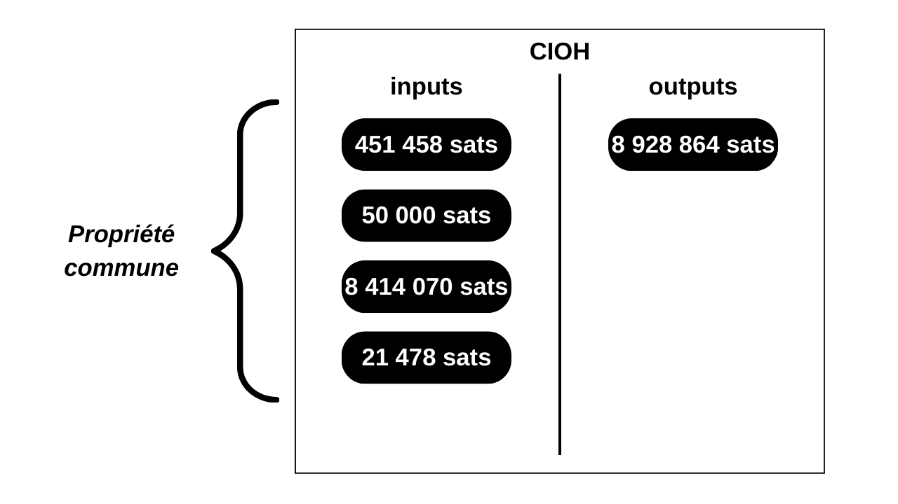
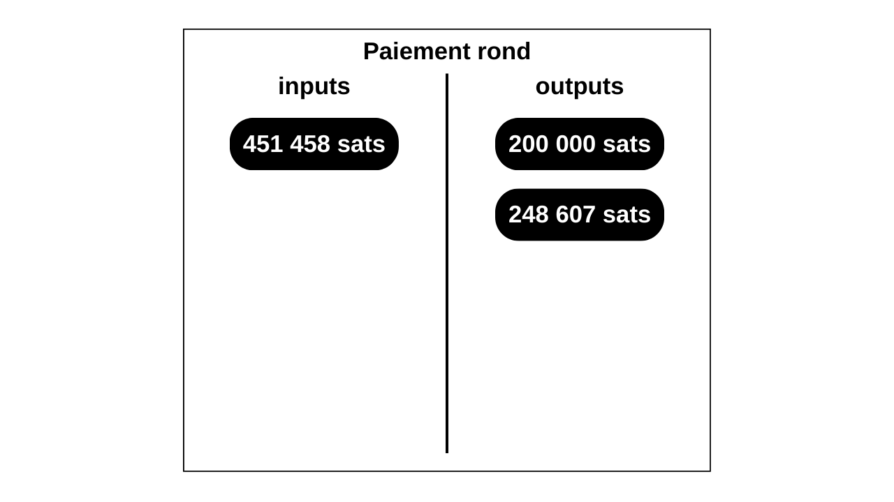
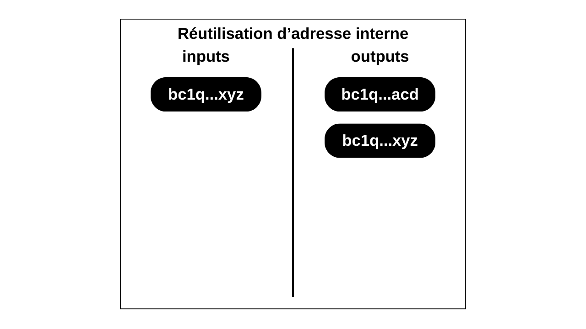

---
header-includes:
  - \usepackage{fancyhdr}
  - \usepackage{colortbl}
  - \usepackage{pdfpages}
  - \usepackage{listings}
  - \usepackage{tcolorbox}
  - \usepackage{fontspec}
  - \definecolor{customgray}{RGB}{246, 248, 250}
  - \lstdefinelanguage{text}{
      basicstyle=\ttfamily\small,
      morekeywords={}
    }
  - \lstdefinelanguage{plaintext}{
      basicstyle=\ttfamily\small,
      morekeywords={}
    }
  - \lstset{
      backgroundcolor=\color{customgray}, 
      frame=none, 
      basicstyle=\ttfamily\small,
      aboveskip=0.5em,
      belowskip=0.5em
    }
  - \tcbuselibrary{listingsutf8}
  - \tcbset{listing engine=listings}
  - \newtcblisting{codeblock}{
      colback=customgray,
      colframe=white,
      listing only,
      listing options={basicstyle=\ttfamily\small},
      left=1em,
      right=1em
    }
  - \pagestyle{fancy}
  - \fancyfoot[C]{\thepage}
  - \renewcommand{\headrulewidth}{0pt}
  - \renewcommand{\footrulewidth}{0pt}
  - \arrayrulecolor{white}
---
\clearpage
\pagecolor{black}
\includepdf{cover_front.png}
\nopagecolor
\newpage
\thispagestyle{empty}
\begin{minipage}[b][\textheight][b]{\textwidth}
\textbf{© 2024 Loïc Morel}\newline
\textbf{\textit{Dictionnaire de Bitcoin : Tout le vocabulaire technique de Bitcoin}}\newline
\newline
Version du 15 septembre 2024\newline
https://github.com/LoicPandul/Dictionnaire-de-Bitcoin\newline
\newline
Cet ouvrage est sous licence CC BY-NC-SA 4.0\newline
https://creativecommons.org/licenses/by-nc-sa/4.0/\newline
\newline
Lightning : pandul@sats.rs\newline
Email : loic@pandul.fr\newline
Site web : https://www.pandul.fr/\newline
GitHub : https://github.com/LoicPandul/\newline
\end{minipage}
\newpage

\newpage
\thispagestyle{empty}
\begin{minipage}[c][\textheight]{\textwidth}
\vspace*{\fill}
\centering
{\fontsize{40}{50} \selectfont \textbf{Dictionnaire de Bitcoin}}\newline
\newline
\newline
\newline
{\fontsize{15}{25} \selectfont{TOUT LE VOCABULAIRE TECHNIQUE DE BITCOIN}}\newline
\newline
\newline
\newline
\newline
\newline
\newline
\newline
\newline
\newline
\newline
\newline
\newline
\newline
\newline
\newline
\newline
\newline
\newline
\newline
\newline
\newline
\newline
\newline
\newline
\newline
\newline
\newline
\newline
\newline
{\Large \textbf{\textit{Loïc Morel}}}
\vspace*{\fill}
\end{minipage}
\newpage

\newpage
\thispagestyle{empty}
\begin{center}
\Huge \textbf{CONTRIBUTEURS}
\end{center}
\vspace*{1cm}
*Dictionnaire de Bitcoin* est un projet participatif ouvert à tous. Vous êtes libre de proposer des modifications, des corrections ou de soumettre de nouvelles définitions manquantes. Pour ce faire, rendez-vous sur le dépôt GitHub du projet : https://github.com/LoicPandul/Dictionnaire-de-Bitcoin/.\
\
Je tiens à remercier tous les contributeurs pour leur précieuse aide, leurs conseils d'experts, leurs contributions à la rédaction de nouvelles définitions ou à la correction de celles déjà existantes, ainsi que tous ceux qui ont participé à la relecture de cet ouvrage :
\begin{itemize}
  \item Psyduck07 (https://github.com/Psyduck07) ;
  \item Adrien Lacombe (https://github.com/adrienlacombe) ;
  \item Ludovic Lars (https://github.com/lugaxker) ;
  \item Beemo (https://github.com/nflatrea).
\end{itemize}
\
Je tiens également à remercier toutes les personnes qui m'ont aidé dans la rédaction de mes autres contenus, qui ont servi de fondement au _Dictionnaire de Bitcoin_ :
\begin{itemize}
  \item Grittoshi (https://twitter.com/Grittoshi) ;
  \item 200KEKS (https://twitter.com/200KEKS) ;
  \item Fanis Michalakis (https://twitter.com/FanisMichalakis) ;
  \item AcidBunny (https://twitter.com/acidbunny21) ;
  \item Sosthène (https://twitter.com/Sosthene\_\_\_) ;
  \item Théo Pantamis (https://twitter.com/TheoPantamis) ;
  \item Louferlou (https://twitter.com/Louferlou) ;
  \item JohnOnChain (https://twitter.com/JohnOnChain) ;
  \item Pythcoiner (https://twitter.com/pythcoiner) ;
  \item Rogzy (https://twitter.com/DecouvreBitcoin) ;
  \item Théo Mogenet (https://twitter.com/theomogenet) ;
  \item Gilles Cadignan (https://twitter.com/gillesCadignan) ;
  \item Ludovic Lars (https://twitter.com/lugaxker) ;
  \item Lounès Ksouri (https://twitter.com/louneskmt) ;
  \item WillKEKS (https://twitter.com/Satsmokers) ;
  \item Paul ADW (https://twitter.com/PaulADW) ;
  \item TDevD (https://twitter.com/SamouraiDev) ;
  \item Trigger (https://twitter.com/Trigger\_jw) ;
  \item Bitcoiner Nomad (https://twitter.com/BitcoinerNomad) ;
  \item LaurentMT (https://twitter.com/LaurentMT) ;
  \item Guillaume Goualard (https://twitter.com/\_INITIO\_) ;
  \item Science Genial (https://twitter.com/science\_genial) ;
  \item Marc VALLEE (https://twitter.com/marcvallee13) ;
  \item Meyga Vox (https://twitter.com/meygavox) ;
  \item Jean-Luc et Marco de Bitcoin.fr (https://bitcoin.fr/) ;
  \item L'équipe de Découvre Bitcoin (https://decouvrebitcoin.fr/) ;
  \item L'équipe de PlanB Network (https://planb.network/) ;
  \item L'équipe de Bitstack (https://www.bitstack-app.com/) ;
  \item L'équipe de Parlons Bitcoin (https://twitter.com/parlonsbitcoin).
\end{itemize}
\
Un grand merci aussi à tous ceux qui ont contribué à mes différents projets et qui ont choisi de rester anonymes.\
\
Merci également à toutes les personnes qui créent des contenus instructifs sur Bitcoin et son écosystème. Je n'ai pas cité de sources directement, mais les nombreux contenus que j'ai consultés au fil des années ont enrichi mes connaissances et ont forcément inspiré la rédaction de ce dictionnaire. Un remerciement spécial à ceux que je lis ou écoute régulièrement :
\begin{itemize}
  \item Andreas Antonopoulos (https://twitter.com/aantonop) ;
  \item Sjors Provoost (https://twitter.com/provoost) ;
  \item Eric Voskuil (https://twitter.com/evoskuil) ;
  \item Fanis Michalakis (https://twitter.com/FanisMichalakis) ;
  \item Ludovic Lars (https://twitter.com/lugaxker) ;
  \item JohnOnChain (https://twitter.com/JohnOnChain) ;
  \item Théo Pantamis (https://twitter.com/TheoPantamis) ;
  \item LaurentMT (https://twitter.com/LaurentMT) ;
  \item Théo Mogenet (https://twitter.com/theomogenet) ;
  \item Sosthène (https://twitter.com/Sosthene\_\_\_) ;
  \item Lounès Ksouri (https://twitter.com/louneskmt) ;
  \item Satoshi Nakamoto ;
  \item Et pleins d'autres que j'oublie sûrement.
\end{itemize}
\
Plus largement, merci à tous ceux qui contribuent au développement de Bitcoin, qu'ils soient développeurs ou chercheurs.\
\
Je suis aussi profondément reconnaissant envers tous ceux qui suivent mes travaux, les lisent et les partagent sur les réseaux sociaux ou dans d'autres publications. Vos partages spontanés sont une source de motivation inestimable pour moi. Ils renforcent mon désir de continuer d'écrire et de partager des informations sur Bitcoin. Ils rendent mes créations de contenus non seulement possibles, mais également plus agréables.\
\
Et évidemment, un immense merci à ma femme, Chloé, qui est à l'origine de l'idée de ce dictionnaire et qui m'a conseillé tout au long de sa rédaction.\
\
Si vous souhaitez soutenir le projet, vous pouvez acheter la version physique sur Amazon (disponible fin 2024), ou bien me faire un don sur mon adresse Lightning : pandul@sats.rs. Merci !\
\
Le 24 avril 2024, les deux cofondateurs de Samourai Wallet ont été injustement arrêtés pour avoir simplement écrit du code. Je tiens à leur exprimer mon soutien indéfectible. Leur engagement pour la protection de la vie privée et la liberté incarne les valeurs fondamentales de Bitcoin. Ces développeurs n'ont commis aucun crime ; ils ont seulement œuvré pour offrir des outils permettant à chacun de faire valoir ses droits naturels. Leur procès est d'une importance capitale à la fois pour Bitcoin et son écosystème, mais plus largement pour la liberté dans nos démocraties. Afin de les soutenir dans cette épreuve, j'invite chacun à contribuer à leur défense juridique. Vos dons permettront d'assurer la meilleure défense possible à ces développeurs qui œuvrent au quotidien pour nos libertés. Ils permettront également de créer un précédent qui dissuadera de futures intimidations à l'encontre des développeurs, et ainsi de ne pas freiner l'innovation technologique sur Bitcoin et son écosystème. **Pour donner :** https://p2prights.org/\newline
\newpage
\thispagestyle{empty}
\begin{center}
\Huge \textbf{TABLE DES MATIÈRES}
\end{center}
\vspace*{0.5cm}

\section*{A}
| | | | |
|:---------------------------|--:|:---------------------------|--:|
| | | | |
| [ADAPTOR SIGNATURE](#adaptor-signature) |    20 | [ANYPREVOUT (APO)](#anyprevout-apo) |    28 |
| [ADDR](#addr)                  |    21 | [AOPP](#aopp)                  |    28 |
| [ADDR.DAT](#addr.dat)          |    21 | [API](#api)                    |    28 |
| [ADDRESS SPOOFING](#address-spoofing) |    21 | [ARBITRAGE](#arbitrage)        |    28 |
| [ADDRV2](#addrv2)              |    22 | [ARBRE DE MERKLE](#arbre-de-merkle) |    29 |
| [ADRESSE DE RÉCEPTION](#adresse-de-réception) |    22 | [ARK](#ark)                    |    30 |
| [ADRESSE STATIQUE](#adresse-statique) |    23 | [ASCII](#ascii)                |    30 |
| [AGORISME](#agorisme)          |    23 | [ASIC](#asic)                  |    30 |
| [AJUSTEMENT DE LA DIFFICULTE](#ajustement-de-la-difficulte) |    24 | [ASICBOOST](#asicboost)        |    30 |
| [ALGORITHME](#algorithme)      |    24 | [ASMAP](#asmap)                |    31 |
| [ALTCOIN](#altcoin)            |    25 | [ASSUME UTXO](#assume-utxo)    |    31 |
| [ANALYSE DE CHAINE](#analyse-de-chaine) |    25 | [ASSUME VALID](#assume-valid)  |    31 |
| [ANCESTOR MINING](#ancestor-mining) |    25 | [ATH (ALL-TIME HIGH)](#ath-all-time-high) |    32 |
| [ANCHOR OUTPUTS](#anchor-outputs) |    26 | [ATLC](#atlc)                  |    32 |
| [ANCHORS.DAT](#anchors.dat)    |    26 | [ATOMIC MULTI-PATH PAYMENTS](#atomic-multi-path-payments) |    32 |
| [ANCRAGE BILATÉRAL](#ancrage-bilatéral) |    26 | [ATOMIC SWAP](#atomic-swap)    |    33 |
| [ANONSETS (ANONYMITY SETS)](#anonsets-anonymity-sets) |    27 | [ATTAQUE DES 51 POUR CENT](#attaque-des-51-pour-cent) |    33 |
| [ANTI MONEY LAUNDERING (AML)](#anti-money-laundering-aml) |    28 | [AVG. ROUND DURATION](#avg.-round-duration) |    34 |
| | | | |

\section*{B}
| | | | |
|:---------------------------|--:|:---------------------------|--:|
| | | | |
| [BANLIST.DAT](#banlist.dat)    |    36 | [BIP145](#bip145)              |    56 |
| [BANLIST.JSON](#banlist.json)  |    36 | [BIP147](#bip147)              |    56 |
| [BARE-MULTISIG](#bare-multisig) |    36 | [BIP148](#bip148)              |    57 |
| [BASE (ARITHMÉTIQUE)](#base-arithmétique) |    36 | [BIP149](#bip149)              |    57 |
| [BASE58CHECK](#base58check)    |    36 | [BIP150](#bip150)              |    58 |
| [BATCHED SPENDING](#batched-spending) |    37 | [BIP151](#bip151)              |    58 |
| [BCH CODE](#bch-code)          |    37 | [BIP152](#bip152)              |    58 |
| [BCOIN](#bcoin)                |    38 | [BIP155](#bip155)              |    58 |
| [BDK (BITCOIN DEV KIT)](#bdk-bitcoin-dev-kit) |    38 | [BIP156](#bip156)              |    58 |
| [BEAR MARKET](#bear-market)    |    38 | [BIP173](#bip173)              |    59 |
| [BECH32 ET BECH32M](#bech32-et-bech32m) |    38 | [BIP322](#bip322)              |    59 |
| [BEHIND-THE-METER](#behind-the-meter) |    39 | [BIP324](#bip324)              |    60 |
| [BERKELEYDB](#berkeleydb)      |    39 | [BIP326](#bip326)              |    60 |
| [BGP HIJACKING](#bgp-hijacking) |    39 | [BIP352](#bip352)              |    60 |
| [BIG BLOCKERS](#big-blockers)  |    40 | [BIP380](#bip380)              |    61 |
| [BIG-ENDIAN](#big-endian)      |    40 | [BIP381](#bip381)              |    61 |
| [BINAIRE](#binaire)            |    40 | [BIP382](#bip382)              |    61 |
| [BIP](#bip)                    |    41 | [BIP383](#bip383)              |    61 |
| [BIP1](#bip1)                  |    42 | [BIP384](#bip384)              |    61 |
| [BIP2](#bip2)                  |    42 | [BIP385](#bip385)              |    62 |
| [BIP8](#bip8)                  |    43 | [BIP386](#bip386)              |    62 |
| [BIP9](#bip9)                  |    54 | [BIRTH DATE (WALLET)](#birth-date-wallet) |    62 |
| [BIP10](#bip10)                |    43 | [BIT](#bit)                    |    62 |
| [BIP11](#bip11)                |    44 | [BIT (UNITÉ)](#bit-unité)      |    62 |
| [BIP12](#bip12)                |    44 | [BITCOIN (B MAJUSCULE)](#bitcoin-b-majuscule) |    63 |
| [BIP13](#bip13)                |    44 | [BITCOIN (B MINUSCULE)](#bitcoin-b-minuscule) |    63 |
| [BIP14](#bip14)                |    44 | [BITCOIN CASH (BCH)](#bitcoin-cash-bch) |    63 |
| [BIP16](#bip16)                |    44 | [BITCOIN CLASSIC](#bitcoin-classic) |    63 |
| [BIP17](#bip17)                |    45 | [BITCOIN-CLI](#bitcoin-cli)    |    64 |
| [BIP21](#bip21)                |    45 | [BITCOIN.CONF](#bitcoin.conf)  |    64 |
| [BIP22](#bip22)                |    45 | [BITCOIN CORE](#bitcoin-core)  |    64 |
| [BIP23](#bip23)                |    45 | [BITCOIN CORE GUI-QML](#bitcoin-core-gui-qml) |    64 |
| [BIP30](#bip30)                |    46 | [BITCOIND](#bitcoind)          |    65 |
| [BIP31](#bip31)                |    46 | [BITCOIN-DEV](#bitcoin-dev)    |    65 |
| [BIP32](#bip32)                |    46 | [BITCOIND.PID](#bitcoind.pid)  |    65 |
| [BIP34](#bip34)                |    46 | [BITCOIN FOG](#bitcoin-fog)    |    65 |
| [BIP35](#bip35)                |    46 | [BITCOIN GOLD (BTG)](#bitcoin-gold-btg) |    66 |
| [BIP37](#bip37)                |    72 | [BITCOIN INQUISITION](#bitcoin-inquisition) |    66 |
| [BIP38](#bip38)                |    47 | [BITCOIN JESUS](#bitcoin-jesus) |    66 |
| [BIP39](#bip39)                |    47 | [BITCOIN KNOTS](#bitcoin-knots) |    66 |
| [BIP42](#bip42)                |    47 | [BITCOIN OPTECH](#bitcoin-optech) |    66 |
| [BIP43](#bip43)                |    48 | [BITCOIN POOLED MINING (BPM)](#bitcoin-pooled-mining-bpm) |    67 |
| [BIP44](#bip44)                |    48 | [BITCOIN QT](#bitcoin-qt)      |    67 |
| [BIP47](#bip47)                |    49 | [BITCOIN SATOSHI VISION (BSV)](#bitcoin-satoshi-vision-bsv) |    67 |
| [BIP49](#bip49)                |    50 | [BITCOINTALK](#bitcointalk)    |    68 |
| [BIP50](#bip50)                |    50 | [BITCOIN UNLIMITED](#bitcoin-unlimited) |    68 |
| [BIP61](#bip61)                |    50 | [BITCOIN XT](#bitcoin-xt)      |    68 |
| [BIP65](#bip65)                |    50 | [BIT GOLD](#bit-gold)          |    68 |
| [BIP66](#bip66)                |    51 | [BITVM](#bitvm)                |    69 |
| [BIP68](#bip68)                |    51 | [BLK*.DAT](#blk.dat)           |    69 |
| [BIP70](#bip70)                |    51 | [BLKINDEX.DAT](#blkindex.dat)  |    69 |
| [BIP71](#bip71)                |    51 | [BLKTREE/](#blktree)           |    69 |
| [BIP72](#bip72)                |    52 | [BLOC](#bloc)                  |    69 |
| [BIP75](#bip75)                |    52 | [BLOCKCHAIN](#blockchain)      |    70 |
| [BIP78](#bip78)                |    52 | [BLOCKSIGNERS](#blocksigners)  |    70 |
| [BIP84](#bip84)                |    52 | [BLOCKS INDEX](#blocks-index)  |    70 |
| [BIP85](#bip85)                |    52 | [BLOCKSIZE WAR](#blocksize-war) |    70 |
| [BIP86](#bip86)                |    53 | [BLOCKS/REV*.DAT](#blocksrev.dat) |    71 |
| [BIP90](#bip90)                |    53 | [BLOCKSTREAM](#blockstream)    |    71 |
| [BIP91](#bip91)                |    53 | [BLOCK TEMPLATE](#block-template) |    72 |
| [BIP101](#bip101)              |    53 | [BLOOM FILTER](#bloom-filter)  |    72 |
| [BIP102](#bip102)              |    53 | [B-MONEY](#b-money)            |    72 |
| [BIP109](#bip109)              |    54 | [BOLT](#bolt)                  |    72 |
| [BIP111](#bip111)              |    54 | [BOUNTY](#bounty)              |    72 |
| [BIP112](#bip112)              |    54 | [BRANCH-AND-BOUND](#branch-and-bound) |    73 |
| [BIP113](#bip113)              |    54 | [BRANCHE (BITCOIN)](#branche-bitcoin) |    73 |
| [BIP118](#bip118)              |    54 | [BRANCHE (GIT)](#branche-git)  |    73 |
| [BIP119](#bip119)              |    55 | [BRC-20](#brc-20)              |    73 |
| [BIP123](#bip123)              |    55 | [BTC](#btc)                    |    74 |
| [BIP125](#bip125)              |    55 | [BTCD (BTC SUITE)](#btcd-btc-suite) |    74 |
| [BIP137](#bip137)              |    55 | [BTCPAY SERVER](#btcpay-server) |    74 |
| [BIP141](#bip141)              |    56 | [BULL MARKET](#bull-market)    |    74 |
| [BIP143](#bip143)              |    56 | [BYZANTINE FAULT TOLERANCE (BFT)](#byzantine-fault-tolerance-bft) |    75 |
| [BIP144](#bip144)              |    56 |                                |       |
| | | | |

\section*{C}
| | | | |
|:---------------------------|--:|:---------------------------|--:|
| | | | |
| [C++ (PLUS PLUS)](#c-plus-plus) |    77 | [COINJUMBLE](#coinjumble)      |    95 |
| [CAHOOTS](#cahoots)            |    77 | [COINMUX](#coinmux)            |    95 |
| [CANAL DE PAIMENT](#canal-de-paiment) |    77 | [COINS/](#coins)               |    96 |
| [CANDIDAT (BLOC)](#candidat-bloc) |    77 | [COINSHUFFLE](#coinshuffle)    |    96 |
| [CAPACITÉ DE CANAL LIGHTNING](#capacité-de-canal-lightning) |    78 | [COINSWAP](#coinswap)          |    96 |
| [CASHU](#cashu)                |    78 | [COLD WALLET](#cold-wallet)    |    97 |
| [CET](#cet)                    |    78 | [COLORED COINS](#colored-coins) |    97 |
| [CHAINE EXTERNE](#chaine-externe) |    78 | [COMMERÇANT](#commerçant)      |    97 |
| [CHAINE INTERNE](#chaine-interne) |    79 | [COMMIT](#commit)              |    98 |
| [CHAINSPLIT](#chainsplit)      |    80 | [COMPACT BLOCK RELAY](#compact-block-relay) |    98 |
| [CHAINSTATE/](#chainstate)     |    80 | [COMPATIBILITÉ RÉTROSPECTIVE](#compatibilité-rétrospective) |    98 |
| [CHAMPION (BIP)](#champion-bip) |    80 | [COMPTE](#compte)              |    98 |
| [CHANGE](#change)              |    81 | [CONCATÉNATION](#concaténation) |    99 |
| [CHANNEL FACTORIES](#channel-factories) |    81 | [CONDENSAT](#condensat)        |    99 |
| [CHARGE UTILE](#charge-utile)  |    81 | [CONFIRMATION](#confirmation)  |    99 |
| [CHAUMIAN COINJOIN](#chaumian-coinjoin) |    82 | [CONSENSUS](#consensus)        |   100 |
| [CHEMIN DE DÉRIVATION](#chemin-de-dérivation) |    83 | [CONSOLIDATION](#consolidation) |   100 |
| [CHEMIN DE RÉCUPÉRATION](#chemin-de-récupération) |    84 | [CONTRAT INTELLIGENT](#contrat-intelligent) |   101 |
| [CHEMIN PRIMAIRE](#chemin-primaire) |    84 | [CONTRIBUTEUR (CORE)](#contributeur-core) |   101 |
| [CHIFFRER (CHIFFREMENT)](#chiffrer-chiffrement) |    85 | [COOKIE (.COOKIE)](#cookie-.cookie) |   101 |
| [CIBLE DE DIFFICULTÉ](#cible-de-difficulté) |    85 | [COORDINATEUR DE COINJOIN](#coordinateur-de-coinjoin) |   102 |
| [CIOH](#cioh)                  |    86 | [CORE-LIGHTNING (CLN)](#core-lightning-cln) |   102 |
| [CISA](#cisa)                  |    87 | [COURBE ELLIPTIQUE](#courbe-elliptique) |   102 |
| [CLÉ ÉTENDUE](#clé-étendue)    |    87 | [COVENANT](#covenant)          |   102 |
| [CLÉ MAITRESSE](#clé-maitresse) |    88 | [COVERT ASICBOOST](#covert-asicboost) |   103 |
| [CLÉ PRIVÉE](#clé-privée)      |    89 | [CPFP (CHILD PAY FOR PARENT)](#cpfp-child-pay-for-parent) |   103 |
| [CLÉ PUBLIQUE](#clé-publique)  |    89 | [CPPSRB](#cppsrb)              |   103 |
| [CLÉ PUBLIQUE COMPRESSÉE](#clé-publique-compressée) |    90 | [CPU (CENTRAL PROCESSING UNIT)](#cpu-central-processing-unit) |   104 |
| [CLI](#cli)                    |    91 | [CRYPTANALYSE](#cryptanalyse)  |   104 |
| [C-LIGHTNING (CLN)](#c-lightning-cln) |    91 | [CRYPTER](#crypter)            |   104 |
| [CLONE](#clone)                |    91 | [CRYPTO-ACTIF](#crypto-actif)  |   104 |
| [CLUSTER](#cluster)            |    91 | [CRYPTOGRAPHIE](#cryptographie) |   104 |
| [CODE DE CHAINE](#code-de-chaine) |    92 | [CRYPTOLOGIE](#cryptologie)    |   104 |
| [CODE DE CHAINE MAITRE](#code-de-chaine-maitre) |    92 | [CRYPTOMONNAIE](#cryptomonnaie) |   105 |
| [CODE DE PAIMENT RÉUTILISABLE](#code-de-paiment-réutilisable) |    92 | [CURTAILMENT (MINING)](#curtailment-mining) |   105 |
| [COINBASE (TRANSACTION)](#coinbase-transaction) |    93 | [CUSTODY](#custody)            |   105 |
| [COIN CONTROL](#coin-control)  |    93 | [CYPHERPUNKS](#cypherpunks)    |   105 |
| [COINJOIN](#coinjoin)          |    94 |                                |       |
| | | | |

\section*{D}
| | | | |
|:---------------------------|--:|:---------------------------|--:|
| | | | |
| [DAEMON](#daemon)              |   107 | [DIFFUSION](#diffusion)        |   111 |
| [DANDELION](#dandelion)        |   107 | [DIGITAL ARTIFACTS](#digital-artifacts) |   112 |
| [DARKWALLET](#darkwallet)      |   107 | [DISTRIBUÉ](#distribué)        |   112 |
| [DATABASE/](#database)         |   108 | [DLC (DISCREET LOG CONTRACT)](#dlc-discreet-log-contract) |   112 |
| [DB.LOG](#db.log)              |   108 | [DLP (DISCREET LOG PROBLEME)](#dlp-discreet-log-probleme) |   112 |
| [DDOS](#ddos)                  |   108 | [DNS SEEDS](#dns-seeds)        |   113 |
| [DEBUG.LOG](#debug.log)        |   108 | [DOLLAR COST AVERAGING (DCA)](#dollar-cost-averaging-dca) |   113 |
| [DEMEURAGE](#demeurage)        |   108 | [DOS (DENIAL OF SERVICE)](#dos-denial-of-service) |   114 |
| [DEPEG](#depeg)                |   109 | [DOUBLE DÉPENSE (ATTAQUE)](#double-dépense-attaque) |   114 |
| [DÉPÔT](#dépôt)                |   109 | [DRIVECHAIN](#drivechain)      |   114 |
| [DER](#der)                    |   109 | [DUAL FUNDING](#dual-funding)  |   114 |
| [DÉRIVATION](#dérivation)      |   110 | [DUMMY ELEMENT](#dummy-element) |   115 |
| [DÉRIVATION ENDURCIE](#dérivation-endurcie) |   110 | [DUST](#dust)                  |   115 |
| [DÉRIVATION NORMALE](#dérivation-normale) |   110 | [DUSTING ATTACK](#dusting-attack) |   115 |
| [DGM](#dgm)                    |   111 | [DUST LIMIT](#dust-limit)      |   116 |
| [DIFFICULTÉ](#difficulté)      |   111 | [DUSTRELAYFEE](#dustrelayfee)  |   116 |
| [DIFFIE-HELLMAN](#diffie-hellman) |   111 |                                |       |
| | | | |

\section*{E}
| | | | |
|:---------------------------|--:|:---------------------------|--:|
| | | | |
| [ECASH (DAVID CHAUM)](#ecash-david-chaum) |   118 | [ELTOO](#eltoo)                |   120 |
| [ECASH (XEC)](#ecash-xec)      |   118 | [EMBRANCHEMENT NATUREL](#embranchement-naturel) |   120 |
| [ECDH](#ecdh)                  |   118 | [EMPREINTE DE PORTEFEUILLE](#empreinte-de-portefeuille) |   120 |
| [ECDSA](#ecdsa)                |   118 | [ENDIANNESS](#endianness)      |   121 |
| [ECLAIR](#eclair)              |   118 | [ENTÊTE DE BLOC](#entête-de-bloc) |   121 |
| [ECLIPSE (ATTAQUE)](#eclipse-attaque) |   119 | [ENTROPIE](#entropie)          |   122 |
| [ÉCOLE AUTRICHIENNE](#école-autrichienne) |   119 | [ENTROPIE (ANALYSE)](#entropie-analyse) |   123 |
| [ELECTRS](#electrs)            |   119 | [EREBUS (ATTAQUE)](#erebus-attaque) |   123 |
| [ELECTRUM](#electrum)          |   119 | [ESMPPS](#esmpps)              |   123 |
| [ELECTRUM LIGHTNING](#electrum-lightning) |   119 | [ÉTIQUETAGE](#étiquetage)      |   124 |
| [ELECTRUM SERVER](#electrum-server) |   120 | [EXPLORATEUR DE BLOC](#explorateur-de-bloc) |   124 |
| | | | |

\section*{F}
| | | | |
|:---------------------------|--:|:---------------------------|--:|
| | | | |
| [FARADAY](#faraday)            |   126 | [FONCTIONNAIRE](#fonctionnaire) |   129 |
| [FEDIMINT](#fedimint)          |   126 | [FONGIBILITÉ](#fongibilité)    |   129 |
| [FEE_ESTIMATES.DAT](#fee_estimates.dat) |   126 | [FORCE BRUTE (ATTAQUE)](#force-brute-attaque) |   129 |
| [FEE SNIPING](#fee-sniping)    |   126 | [FORCE CLOSE](#force-close)    |   130 |
| [FERME DE MINAGE](#ferme-de-minage) |   127 | [FORCED ADDRESS REUSE](#forced-address-reuse) |   130 |
| [FIAT](#fiat)                  |   127 | [FORK](#fork)                  |   130 |
| [FIBRE](#fibre)                |   127 | [FORK (GIT)](#fork-git)        |   131 |
| [FINNEY HAL](#finney-hal)      |   128 | [FOSS](#foss)                  |   131 |
| [FLAG DAY](#flag-day)          |   128 | [FPPS (FULL PAY PER SHARE)](#fpps-full-pay-per-share) |   131 |
| [FONCTION DE HACHAGE](#fonction-de-hachage) |   128 | [FRAIS DE TRANSACTION](#frais-de-transaction) |   132 |
| | | | |

\section*{G}
| | | | |
|:---------------------------|--:|:---------------------------|--:|
| | | | |
| [GAP LIMIT](#gap-limit)        |   134 | [GOSSIP](#gossip)              |   136 |
| [GENÈSE (BLOC)](#genèse-bloc)  |   134 | [GPL](#gpl)                    |   137 |
| [GETWORK](#getwork)            |   135 | [GRAINE](#graine)              |   137 |
| [GIT](#git)                    |   135 | [GREEN ADDRESS](#green-address) |   138 |
| [GITHUB](#github)              |   135 | [GREEN ADDRESSES](#green-addresses) |   138 |
| [GITLAB](#gitlab)              |   135 | [GREEN WALLET](#green-wallet)  |   138 |
| [GNPA](#gnpa)                  |   136 | [GUI](#gui)                    |   138 |
| [GNU](#gnu)                    |   136 | [GUISETTINGS.INI.BAK](#guisettings.ini.bak) |   138 |
| [GOLDFINGER (ATTAQUE)](#goldfinger-attaque) |   136 |                                |       |
| | | | |

\section*{H}
| | | | |
|:---------------------------|--:|:---------------------------|--:|
| | | | |
| [HACHEUR](#hacheur)            |   140 | [HEURISTIQUE D'ANALYSE](#heuristique-danalyse) |   143 |
| [HALVING](#halving)            |   140 | [HEXADÉCIMAL](#hexadécimal)    |   143 |
| [HARD FORK](#hard-fork)        |   140 | [HMAC-SHA512](#hmac-sha512)    |   143 |
| [HARDWARE WALLET](#hardware-wallet) |   141 | [HODL](#hodl)                  |   144 |
| [HASH160](#hash160)            |   141 | [HONG-KONG ROUNDTABLE](#hong-kong-roundtable) |   144 |
| [HASH256](#hash256)            |   141 | [HORODATAGE](#horodatage)      |   144 |
| [HASHCASH](#hashcash)          |   141 | [HRP (HUMAN READABLE PART)](#hrp-human-readable-part) |   145 |
| [HASHRATE](#hashrate)          |   142 | [HTLC](#htlc)                  |   145 |
| [HAUTEUR DE BLOC](#hauteur-de-bloc) |   142 | [HWI](#hwi)                    |   146 |
| [HD (HIERARCHICAL-DETERMINISTIC)](#hd-hierarchical-deterministic) |   142 | [HYDRO COOLING](#hydro-cooling) |   146 |
| | | | |

\section*{I}
| | | | |
|:---------------------------|--:|:---------------------------|--:|
| | | | |
| [I2P](#i2p)                    |   148 | [INITIAL BLOCK DOWNLOAD (IBD)](#initial-block-download-ibd) |   149 |
| [IMMERSION COOLING](#immersion-cooling) |   148 | [INPUT](#input)                |   150 |
| [IMPLÉMENTATION DE BITCOIN](#implémentation-de-bitcoin) |   148 | [INSCRIPTIONS](#inscriptions)  |   150 |
| [INBOUND CAPACITY](#inbound-capacity) |   148 | [INVOICE LIGHTNING](#invoice-lightning) |   150 |
| [INDEX (KEY)](#index-key)      |   148 | [IOU](#iou)                    |   151 |
| [INDEXES/TXINDEX/](#indexestxindex) |   149 | [IP_ASN.MAP](#ip_asn.map)      |   151 |
| [INFLATION](#inflation)        |   149 | [ISSUE](#issue)                |   151 |
| | | | |

\section*{J}
| | | | |
|:---------------------------|--:|:---------------------------|--:|
| | | | |
| [JAM](#jam)                    |   153 | [JOININBOX](#joininbox)        |   153 |
| [JBOK (PORTEFEUILLE)](#jbok-portefeuille) |   153 | [JOINMARKET](#joinmarket)      |   153 |
| | | | |

\section*{K}
| | | | |
|:---------------------------|--:|:---------------------------|--:|
| | | | |
| [KNAPSACK SOLVER](#knapsack-solver) |   155 | [KYC (KNOW YOUR CUSTOMER)](#kyc-know-your-customer) |   155 |
| | | | |

\section*{L}
| | | | |
|:---------------------------|--:|:---------------------------|--:|
| | | | |
| [LABEL](#label)                |   157 | [LIMITE D'ÉMISSION](#limite-démission) |   160 |
| [LABEL (SILENT PAYMENTS)](#label-silent-payments) |   157 | [LIQUIDITÉS (LIGHTNING)](#liquidités-lightning) |   160 |
| [LATENCE](#latence)            |   158 | [LIQUID NETWORK](#liquid-network) |   161 |
| [LCB/FT](#lcbft)               |   158 | [LITTLE-ENDIAN](#little-endian) |   161 |
| [LDK (LIGHTNING DEV KIT)](#ldk-lightning-dev-kit) |   158 | [LND](#lnd)                    |   161 |
| [LEDGER](#ledger)              |   159 | [LNURL](#lnurl)                |   161 |
| [LEVELDB](#leveldb)            |   159 | [LOCK (.LOCK)](#lock-.lock)    |   161 |
| [LIBBITCOIN](#libbitcoin)      |   159 | [LOGARITHME DISCRET](#logarithme-discret) |   162 |
| [LIBSECP256K1](#libsecp256k1)  |   159 | [LOOP](#loop)                  |   162 |
| [LIGHTNING NETWORK](#lightning-network) |   160 | [LUCK](#luck)                  |   162 |
| [LIGHTNING SERVICE PROVIDER](#lightning-service-provider) |   160 | [LUD](#lud)                    |   163 |
| | | | |

\section*{M}
| | | | |
|:---------------------------|--:|:---------------------------|--:|
| | | | |
| [MACAROON](#macaroon)          |   165 | [MÉTADONNÉES](#métadonnées)    |   169 |
| [MAGICAL BITCOIN](#magical-bitcoin) |   165 | [MÉTHODE D'ACTIVATION](#méthode-dactivation) |   169 |
| [MAGIC NETWORK](#magic-network) |   165 | [MÉTHODE GÉOMÉTRIQUE](#méthode-géométrique) |   170 |
| [MAINNET](#mainnet)            |   165 | [MINAGE](#minage)              |   170 |
| [MAINTENEUR (CORE)](#mainteneur-core) |   165 | [MINAGE FUSIONNÉ](#minage-fusionné) |   171 |
| [MAINTENEUR PRINCIPAL (CORE)](#mainteneur-principal-core) |   166 | [MINAGE FUSIONNÉ AVEUGLE](#minage-fusionné-aveugle) |   171 |
| [MAJORITÉ ÉCONOMIQUE](#majorité-économique) |   166 | [MINEUR](#mineur)              |   171 |
| [MALLÉABILITÉ (TRANSACTION)](#malléabilité-transaction) |   166 | [MINISCRIPT](#miniscript)      |   172 |
| [MAN-IN-THE-MIDDLE (MITM)](#man-in-the-middle-mitm) |   167 | [MINITAPSCRIPT](#minitapscript) |   172 |
| [MAPPER](#mapper)              |   167 | [MIT X11](#mit-x11)            |   172 |
| [MARKET CAP (CAPITALIZATION)](#market-cap-capitalization) |   167 | [MIXAGE](#mixage)              |   173 |
| [MASF](#masf)                  |   167 | [MODÈLE DE SCRIPT](#modèle-de-script) |   173 |
| [MAST](#mast)                  |   167 | [MODÈLE DE TRANSACTION](#modèle-de-transaction) |   173 |
| [MASTER FINGERPRINT](#master-fingerprint) |   168 | [MODÈLE TEMPOREL](#modèle-temporel) |   173 |
| [MAX_BLOC_SIZE](#max_bloc_size) |   168 | [M-OF-N](#m-of-n)              |   174 |
| [MÉLANGEUR](#mélangeur)        |   168 | [MTP (MEDIAN TIME PAST)](#mtp-median-time-past) |   174 |
| [MEMPOOL](#mempool)            |   168 | [MULTI-PATH PAYMENTS (MPP)](#multi-path-payments-mpp) |   174 |
| [MEMPOOL.DAT](#mempool.dat)    |   169 | [MULTISIG](#multisig)          |   175 |
| [MERGE](#merge)                |   169 | [MYSTERY SHOPPER PAYMENTS](#mystery-shopper-payments) |   175 |
| [MERKLE BLOCK](#merkle-block)  |   169 |                                |       |
| | | | |

\section*{N}
| | | | |
|:---------------------------|--:|:---------------------------|--:|
| | | | |
| [NAKAMOTO SATOSHI](#nakamoto-satoshi) |   177 | [NOEUD ÉLAGUÉ](#noeud-élagué)  |   179 |
| [NESTED SEGWIT](#nested-segwit) |   177 | [NOEUD LIGHTNING](#noeud-lightning) |   179 |
| [NETWORK-ADJUSTED TIME (NAT)](#network-adjusted-time-nat) |   177 | [NOEUD SPV (NOEUD LÉGER)](#noeud-spv-noeud-léger) |   179 |
| [NEW YORK AGREEMENT (NYA)](#new-york-agreement-nya) |   177 | [NONCE](#nonce)                |   180 |
| [NFT](#nft)                    |   178 | [NSEQUENCE](#nsequence)        |   180 |
| [NLOCKTIME](#nlocktime)        |   178 | [NULL DATA](#null-data)        |   181 |
| [NO2X](#no2x)                  |   178 | [NULLDUMMY](#nulldummy)        |   181 |
| [NOEUD](#noeud)                |   178 | [NVERSION](#nversion)          |   181 |
| [NOEUD COMPLET](#noeud-complet) |   179 |                                |       |
| | | | |

\section*{O}
| | | | |
|:---------------------------|--:|:---------------------------|--:|
| | | | |
| [OBJECTIF](#objectif)          |   183 | [OP_HASH256 (0XAA)](#op_hash256-0xaa) |   193 |
| [OBOE (OFF-BY-ONE ERROR)](#oboe-off-by-one-error) |   183 | [OP_IF (0X63)](#op_if-0x63)    |   194 |
| [OBSOLÈTE (BLOC)](#obsolète-bloc) |   200 | [OP_IFDUP (0X73)](#op_ifdup-0x73) |   194 |
| [OCTET](#octet)                |   184 | [OP_LESSTHAN (0X9F)](#op_lessthan-0x9f) |   194 |
| [OFF-CHAIN](#off-chain)        |   184 | [OP_LESSTHANOREQUAL (0XA1)](#op_lessthanorequal-0xa1) |   194 |
| [OFFER](#offer)                |   185 | [OP_MAX (0XA4)](#op_max-0xa4)  |   194 |
| [ON-CHAIN](#on-chain)          |   185 | [OP_MIN (0XA3)](#op_min-0xa3)  |   194 |
| [ONION_PRIVATE_KEY](#onion_private_key) |   185 | [OP_NEGATE (0X8F)](#op_negate-0x8f) |   194 |
| [ONION_V3_PRIVATE_KEY](#onion_v3_private_key) |   185 | [OP_NIP (0X77)](#op_nip-0x77)  |   195 |
| [OP_0 (0X00)](#op_0-0x00)      |   185 | [OP_NOP (0X61)](#op_nop-0x61)  |   195 |
| [OP_0NOTEQUAL (0X92)](#op_0notequal-0x92) |   185 | [OP_NOT (0X91)](#op_not-0x91)  |   195 |
| [OP_1 (0X51)](#op_1-0x51)      |   186 | [OP_NOTIF (0X64)](#op_notif-0x64) |   195 |
| [OP_1ADD (0X8B)](#op_1add-0x8b) |   186 | [OP_NUMEQUAL (0X9C)](#op_numequal-0x9c) |   195 |
| [OP_1NEGATE (0X4F)](#op_1negate-0x4f) |   186 | [OP_NUMEQUALVERIFY (0X9D)](#op_numequalverify-0x9d) |   195 |
| [OP_1SUB (0X8C)](#op_1sub-0x8c) |   186 | [OP_NUMNOTEQUAL (0X9E)](#op_numnotequal-0x9e) |   195 |
| [OP_2 À OP_16 (0X52 À 0X60)](#op_2-à-op_16-0x52-à-0x60) |   186 | [OP_OVER (0X78)](#op_over-0x78) |   196 |
| [OP_2DROP (0XD6)](#op_2drop-0xd6) |   186 | [OP_PICK (0X79)](#op_pick-0x79) |   196 |
| [OP_2DUP (0X6E)](#op_2dup-0x6e) |   186 | [OP_PUSHDATA1 (0X4C)](#op_pushdata1-0x4c) |   196 |
| [OP_2OVER (0X70)](#op_2over-0x70) |   187 | [OP_PUSHDATA2 (0X4D)](#op_pushdata2-0x4d) |   196 |
| [OP_2ROT (0X71)](#op_2rot-0x71) |   187 | [OP_PUSHDATA4 (0X4E)](#op_pushdata4-0x4e) |   196 |
| [OP_2SWAP (0X72)](#op_2swap-0x72) |   188 | [OP_RETURN (0X6A)](#op_return-0x6a) |   196 |
| [OP_3DUP (0X6F)](#op_3dup-0x6f) |   188 | [OP_RIPEMD160 (0XA6)](#op_ripemd160-0xa6) |   196 |
| [OP_ABS (0X90)](#op_abs-0x90)  |   189 | [OP_ROLL (0X7A)](#op_roll-0x7a) |   196 |
| [OP_ADD (0X93)](#op_add-0x93)  |   189 | [OP_ROT (0X7B)](#op_rot-0x7b)  |   197 |
| [OP_BOOLAND (0X9A)](#op_booland-0x9a) |   189 | [OP_SHA1 (0XA7)](#op_sha1-0xa7) |   197 |
| [OP_BOOLOR (0X9B)](#op_boolor-0x9b) |   189 | [OP_SHA256 (0XA8)](#op_sha256-0xa8) |   197 |
| [OP_CAT (0X7E)](#op_cat-0x7e)  |   189 | [OP_SIZE (0X82)](#op_size-0x82) |   197 |
| [OP_CHECKHASHVERIFY (CHV)](#op_checkhashverify-chv) |   189 | [OP_SUB (0X94)](#op_sub-0x94)  |   197 |
| [OP_CHECKLOCKTIMEVERIFY (0XB1)](#op_checklocktimeverify-0xb1) |   190 | [OP_SUCCESS](#op_success)      |   198 |
| [OP_CHECKMULTISIG (0XAE)](#op_checkmultisig-0xae) |   190 | [OP_SWAP (0X7C)](#op_swap-0x7c) |   197 |
| [OP_CHECKMULTISIGVERIFY (0XAF)](#op_checkmultisigverify-0xaf) |   190 | [OP_TOALTSTACK (0X6B)](#op_toaltstack-0x6b) |   198 |
| [OP_CHECKSEQUENCEVERIFY (0XB2)](#op_checksequenceverify-0xb2) |   190 | [OP_TRUE (0X51)](#op_true-0x51) |   198 |
| [OP_CHECKSIG (0XAC)](#op_checksig-0xac) |   191 | [OP_TUCK (0X7D)](#op_tuck-0x7d) |   198 |
| [OP_CHECKSIGADD (0XBA)](#op_checksigadd-0xba) |   191 | [OP_VER (0X62)](#op_ver-0x62)  |   198 |
| [OP_CHECKSIGVERIFY (0XAD)](#op_checksigverify-0xad) |   191 | [OP_VERIFY (0X69)](#op_verify-0x69) |   198 |
| [OP_CODESEPARATOR (0XAB)](#op_codeseparator-0xab) |   192 | [OP_WITHIN (0XA5)](#op_within-0xa5) |   198 |
| [OP_DEPTH (0X74)](#op_depth-0x74) |   192 | [OPCODES](#opcodes)            |   199 |
| [OP_DROP (0X75)](#op_drop-0x75) |   192 | [OPEN ASSETS PROTOCOL (OAP)](#open-assets-protocol-oap) |   199 |
| [OP_DUP (0X76)](#op_dup-0x76)  |   192 | [ORACLE](#oracle)              |   199 |
| [OP_ELSE (0X67)](#op_else-0x67) |   192 | [ORDINAL NUMBER](#ordinal-number) |   199 |
| [OP_ENDIF (0X68)](#op_endif-0x68) |   192 | [ORDINALS THEORY](#ordinals-theory) |   199 |
| [OP_EQUAL (0X87)](#op_equal-0x87) |   192 | [ORPHELIN](#orphelin)          |   200 |
| [OP_EQUALVERIFY (0X88)](#op_equalverify-0x88) |   193 | [OSINT](#osint)                |   200 |
| [OP_EVAL](#op_eval)            |   193 | [OUTBOUND CAPACITY](#outbound-capacity) |   201 |
| [OP_FALSE (0X00)](#op_false-0x00) |   193 | [OUTPOINT](#outpoint)          |   201 |
| [OP_FROMALTSTACK (0X6C)](#op_fromaltstack-0x6c) |   193 | [OUTPUT](#output)              |   201 |
| [OP_GREATERTHAN (0XA0)](#op_greaterthan-0xa0) |   193 | [OUTPUT LINKING](#output-linking) |   202 |
| [OP_GREATERTHANOREQUAL (0XA2)](#op_greaterthanorequal-0xa2) |   193 | [OUTPUT SCRIPT DESCRIPTORS](#output-script-descriptors) |   202 |
| [OP_HASH160 (0XA9)](#op_hash160-0xa9) |   193 | [OVERT ASICBOOST](#overt-asicboost) |   204 |
| | | | |

\section*{P}
| | | | |
|:---------------------------|--:|:---------------------------|--:|
| | | | |
| [P2MS](#p2ms)                  |   206 | [PHOENIXD](#phoenixd)          |   217 |
| [P2PK](#p2pk)                  |   206 | [PHRASE DE RÉCUPÉRATION](#phrase-de-récupération) |   217 |
| [P2PKH](#p2pkh)                |   206 | [PILE](#pile)                  |   217 |
| [P2P TRANSPORT V2](#p2p-transport-v2) |   207 | [PIZZA DAY](#pizza-day)        |   218 |
| [P2SH](#p2sh)                  |   208 | [POINT D'ENTRÉE](#point-dentrée) |   218 |
| [P2SH-P2WPKH](#p2sh-p2wpkh)    |   207 | [POLICY (MINISCRIPT)](#policy-miniscript) |   219 |
| [P2SH-P2WSH](#p2sh-p2wsh)      |   208 | [POOL](#pool)                  |   220 |
| [P2TR](#p2tr)                  |   208 | [POOL (COINJOIN)](#pool-coinjoin) |   220 |
| [P2WPKH](#p2wpkh)              |   209 | [POOL (MINING)](#pool-mining)  |   220 |
| [P2WSH](#p2wsh)                |   209 | [POOL HOPPING](#pool-hopping)  |   221 |
| [PAIEMENT ROND](#paiement-rond) |   209 | [PORTE DÉROBÉE](#porte-dérobée) |   221 |
| [PAIEMENT SIMPLE](#paiement-simple) |   210 | [PORTEFEUILLE](#portefeuille)  |   221 |
| [PAIR-À-PAIR (P2P)](#pair-à-pair-p2p) |   210 | [PORTEFEUILLE CHAUD (LOGICIEL)](#portefeuille-chaud-logiciel) |   221 |
| [PAIR ENTRANT](#pair-entrant)  |   211 | [POT (PAY ON TARGET)](#pot-pay-on-target) |   222 |
| [PAIR SORTANT](#pair-sortant)  |   211 | [PPLNS (PAY PER LAST N SHARES)](#pplns-pay-per-last-n-shares) |   222 |
| [PANNE BYZANTINE](#panne-byzantine) |   211 | [PPLNSG](#pplnsg)              |   222 |
| [PAPER WALLET](#paper-wallet)  |   212 | [PPS (PAY PER SHARE)](#pps-pay-per-share) |   222 |
| [PASSPHRASE (BIP39)](#passphrase-bip39) |   212 | [PRÉFIXES BINAIRES](#préfixes-binaires) |   222 |
| [PATHFINDING](#pathfinding)    |   212 | [PREMIUM](#premium)            |   223 |
| [PATOSHI](#patoshi)            |   213 | [PREUVE DE RÉSERVES](#preuve-de-réserves) |   223 |
| [PAYJOIN](#payjoin)            |   213 | [PREUVE DE TRAVAIL](#preuve-de-travail) |   224 |
| [PAYNYM](#paynym)              |   214 | [PRIME DE PROXIMITÉ](#prime-de-proximité) |   224 |
| [PBKDF2](#pbkdf2)              |   214 | [PROB. DES GÉNÉRAUX BYZANTINS](#prob.-des-généraux-byzantins) |   225 |
| [PEER DISCOVERY](#peer-discovery) |   215 | [PROFONDEUR](#profondeur)      |   225 |
| [PEERS.DAT](#peers.dat)        |   215 | [PROOF-OF-KEY DAY](#proof-of-key-day) |   226 |
| [PERCOLATION](#percolation)    |   215 | [PROP (PROPORTIONAL)](#prop-proportional) |   226 |
| [PÉRIMÉ (BLOC)](#périmé-bloc)  |   216 | [PSBT](#psbt)                  |   226 |
| [PÉRIODE DE MATURITÉ](#période-de-maturité) |   216 | [PSEUDO-ALÉATOIRE](#pseudo-aléatoire) |   227 |
| [PHOENIX](#phoenix)            |   216 | [PULL REQUEST](#pull-request)  |   227 |
| | | | |

\section*{Q}
| | | | |
|:---------------------------|--:|:---------------------------|--:|
| | | | |
| [QR CODE](#qr-code)            |   229 | [QUBIT](#qubit)                |   229 |
| | | | |

\section*{R}
| | | | |
|:---------------------------|--:|:---------------------------|--:|
| | | | |
| [RACINE DE MERKLE](#racine-de-merkle) |   231 | [RÉSISTANCE AU PARTITIONNEMENT](#résistance-au-partitionnement) |   235 |
| [RAW TRANSACTION](#raw-transaction) |   231 | [RESYNCHRONISATION](#resynchronisation) |   235 |
| [RBF (REPLACE-BY-FEE)](#rbf-replace-by-fee) |   231 | [RÉTENTION (DE BLOC)](#rétention-de-bloc) |   236 |
| [RÉCOMPENSE DE BLOC](#récompense-de-bloc) |   232 | [RÉUTILISATION D'ADRESSE](#réutilisation-dadresse) |   236 |
| [RÉCURSIF (COVENANT)](#récursif-covenant) |   232 | [RÉUTILISATION D'ADRESSE (EXT)](#réutilisation-dadresse-ext) |   237 |
| [REDEEMSCRIPT](#redeemscript)  |   232 | [RÉUTILISATION D'ADRESSE (INT)](#réutilisation-dadresse-int) |   237 |
| [RÈGLES DE CONSENSUS](#règles-de-consensus) |   233 | [RICOCHET](#ricochet)          |   237 |
| [RÈGLES DE STANDARDISATION](#règles-de-standardisation) |   233 | [RIPEMD160](#ripemd160)        |   238 |
| [REGTEST](#regtest)            |   233 | [RPC (REMOTE PROCEDURE CALL)](#rpc-remote-procedure-call) |   238 |
| [RELAIS](#relais)              |   234 | [RPOW](#rpow)                  |   238 |
| [REPLAY ATTACK](#replay-attack) |   234 | [RSMPPS](#rsmpps)              |   239 |
| [RÉSEAU BITCOIN](#réseau-bitcoin) |   234 | [RUNES](#runes)                |   239 |
| [RÉSERVES FRACTIONNAIRES](#réserves-fractionnaires) |   234 | [RUST-LIGHTNING](#rust-lightning) |   239 |
| | | | |

\section*{S}
| | | | |
|:---------------------------|--:|:---------------------------|--:|
| | | | |
| [SAMOURAI WALLET](#samourai-wallet) |   241 | [SIGHASH FLAG](#sighash-flag)  |   252 |
| [SATOSHI (SAT)](#satoshi-sat)  |   241 | [SIGHASH_NONE (0X02)](#sighash_none-0x02) |   253 |
| [SCALABILITÉ](#scalabilité)    |   241 | [SIGHASH_NONE/SIGHASH_ACP](#sighash_nonesighash_acp) |   253 |
| [SCHNORR (PROTOCOLE)](#schnorr-protocole) |   242 | [SIGHASH_SINGLE (0X03)](#sighash_single-0x03) |   253 |
| [SCORE (SCORE BASED METHOD)](#score-score-based-method) |   242 | [SIGHASH_SINGLE/SIGHASH_ACP](#sighash_singlesighash_acp) |   253 |
| [SCRIPT](#script)              |   242 | [SIGNATURE AVEUGLE](#signature-aveugle) |   253 |
| [SCRIPTLESS SCRIPTS](#scriptless-scripts) |   242 | [SIGNATURE NUMÉRIQUE](#signature-numérique) |   254 |
| [SCRIPTPUBKEY](#scriptpubkey)  |   243 | [SIGNER À L'AVEUGLE](#signer-à-laveugle) |   254 |
| [SCRIPTSIG](#scriptsig)        |   243 | [SIGNET](#signet)              |   254 |
| [SCRIPTWITNESS](#scriptwitness) |   244 | [SIGOPS (SIGNATURE OPERATIONS)](#sigops-signature-operations) |   254 |
| [SDK (SOFTWARE DEVELOPMENT KIT)](#sdk-software-development-kit) |   244 | [SILENT PAYMENTS](#silent-payments) |   256 |
| [SECP256K1](#secp256k1)        |   244 | [SILK ROAD](#silk-road)        |   257 |
| [SECP256R1](#secp256r1)        |   245 | [SIMPLIFIED PAYMENT VERIFICATION](#simplified-payment-verification) |   257 |
| [SEED NODES](#seed-nodes)      |   245 | [SLIP](#slip)                  |   258 |
| [SEGWIT](#segwit)              |   246 | [SMALL BLOCKERS](#small-blockers) |   258 |
| [SEGWIT2X](#segwit2x)          |   246 | [SMPPS](#smpps)                |   258 |
| [SEGWIT V0](#segwit-v0)        |   247 | [SOFT FORK](#soft-fork)        |   258 |
| [SEGWIT V1](#segwit-v1)        |   247 | [SOMME DE CONTRÔLE](#somme-de-contrôle) |   258 |
| [SÉLECTION DES PIÈCES](#sélection-des-pièces) |   247 | [SOROBAN](#soroban)            |   259 |
| [SELF-CUSTODY](#self-custody)  |   247 | [SORTIE LA PLUS GRANDE](#sortie-la-plus-grande) |   259 |
| [SELFISH MINING](#selfish-mining) |   247 | [SORTIE NON RENTABLE](#sortie-non-rentable) |   259 |
| [SETTINGS.JSON](#settings.json) |   248 | [SPEEDY TRIAL](#speedy-trial)  |   260 |
| [SHA256](#sha256)              |   248 | [SPOF](#spof)                  |   260 |
| [SHA512](#sha512)              |   248 | [SPREAD (WST)](#spread-wst)    |   260 |
| [SHARDS](#shards)              |   249 | [STABLECOIN](#stablecoin)      |   261 |
| [SHAREDCOIN](#sharedcoin)      |   249 | [STAMPS](#stamps)              |   261 |
| [SHARES](#shares)              |   249 | [STONEWALL](#stonewall)        |   261 |
| [SHARES DIFFICULTY](#shares-difficulty) |   250 | [STONEWALL X2](#stonewall-x2)  |   262 |
| [SHITCOIN](#shitcoin)          |   250 | [STRATUM](#stratum)            |   263 |
| [SHOR (ALGORITHME)](#shor-algorithme) |   251 | [STRATUM V2](#stratum-v2)      |   263 |
| [SIDECHAIN](#sidechain)        |   251 | [SUBVENTION DE BLOC](#subvention-de-bloc) |   264 |
| [SIGHASH_ALL (0X01)](#sighash_all-0x01) |   251 | [SURCOUCHE](#surcouche)        |   264 |
| [SIGHASH_ALL/SIGHASH_ACP](#sighash_allsighash_acp) |   251 | [SURFACE D'ATTAQUE](#surface-dattaque) |   264 |
| [SIGHASH_ANYPREVOUT](#sighash_anyprevout) |   252 | [SWEEP TRANSACTION](#sweep-transaction) |   265 |
| [SIGHASH_ANYPREVOUTANYSCRIPT](#sighash_anyprevoutanyscript) |   252 | [SYBIL (ATTAQUE)](#sybil-attaque) |   265 |
| | | | |

\section*{T}
| | | | |
|:---------------------------|--:|:---------------------------|--:|
| | | | |
| [TAPROOT](#taproot)            |   267 | [TPRV](#tprv)                  |   269 |
| [TAPROOT ASSETS PROTOCOL](#taproot-assets-protocol) |   267 | [TPUB](#tpub)                  |   269 |
| [TAPSCRIPT](#tapscript)        |   267 | [TRANSACTION (TX)](#transaction-tx) |   270 |
| [TARO](#taro)                  |   267 | [TRANSACTION COLLABORATIVE](#transaction-collaborative) |   270 |
| [TCP](#tcp)                    |   268 | [TRANSACTION D'ENGAGEMENT](#transaction-dengagement) |   270 |
| [TÉMOIN DE TRANSACTION](#témoin-de-transaction) |   268 | [TRANSACTION NON CONFIRMÉE](#transaction-non-confirmée) |   270 |
| [TESTNET](#testnet)            |   268 | [TRANSACTION STANDARD](#transaction-standard) |   271 |
| [THE DAO](#the-dao)            |   268 | [TUMBLEBIT](#tumblebit)        |   271 |
| [TIDES](#tides)                |   268 | [TWEAK](#tweak)                |   271 |
| [TIMELOCK](#timelock)          |   269 | [TXID (TRANSACTION IDENTIFIER)](#txid-transaction-identifier) |   272 |
| [TOR (THE ONION ROUTER)](#tor-the-onion-router) |   269 | [TYPE DE DEVISE](#type-de-devise) |   273 |
| | | | |

\section*{U}
| | | | |
|:---------------------------|--:|:---------------------------|--:|
| | | | |
| [UASF](#uasf)                  |   275 | [UPUB](#upub)                  |   276 |
| [UDP (USER DATAGRAM PROTOCOL)](#udp-user-datagram-protocol) |   275 | [URI](#uri)                    |   276 |
| [UNIX](#unix)                  |   275 | [UTREEXO](#utreexo)            |   276 |
| [UNIX (HEURE)](#unix-heure)    |   275 | [UTXO](#utxo)                  |   277 |
| [UPRV](#uprv)                  |   276 | [UTXO SET](#utxo-set)          |   278 |
| | | | |

\section*{V}
| | | | |
|:---------------------------|--:|:---------------------------|--:|
| | | | |
| [VANITY (ADDRESS)](#vanity-address) |   280 | [VIN](#vin)                    |   280 |
| [VANITYGEN](#vanitygen)        |   280 | [VOUT](#vout)                  |   281 |
| [VARIANCE](#variance)          |   280 | [VPRV](#vprv)                  |   281 |
| [VERSIONNAGE](#versionnage)    |   280 | [VPUB](#vpub)                  |   281 |
| | | | |

\section*{W}
| | | | |
|:---------------------------|--:|:---------------------------|--:|
| | | | |
| [WABISABI](#wabisabi)          |   283 | [WHALE](#whale)                |   284 |
| [WALLET.DAT](#wallet.dat)      |   283 | [WHIRLPOOL](#whirlpool)        |   284 |
| [WALLET IMPORT FORMAT (WIF)](#wallet-import-format-wif) |   283 | [WHIRLPOOL STAT TOOL](#whirlpool-stat-tool) |   284 |
| [WALLETS/DB.LOG](#walletsdb.log) |   283 | [WHITE PAPER](#white-paper)    |   284 |
| [WASABI WALLET](#wasabi-wallet) |   283 | [WITNESSSCRIPT](#witnessscript) |   284 |
| [WATCHMEN](#watchmen)          |   283 | [WTXID](#wtxid)                |   285 |
| [WATCH-ONLY WALLET](#watch-only-wallet) |   284 |                                |       |
| | | | |

\section*{X}
| | | | |
|:---------------------------|--:|:---------------------------|--:|
| | | | |
| [XBT](#xbt)                    |   287 | [XPRV](#xprv)                  |   288 |
| [XOR](#xor)                    |   287 | [XPUB](#xpub)                  |   288 |
| | | | |

\section*{Y}
| | | | |
|:---------------------------|--:|:---------------------------|--:|
| | | | |
| [YPRV](#yprv)                  |   290 | [YPUB](#ypub)                  |   290 |
| | | | |

\section*{Z}
| | | | |
|:---------------------------|--:|:---------------------------|--:|
| | | | |
| [ZEROCONF](#zeroconf)          |   292 | [ZKP (ZERO-KNOWLEDGE PROOF)](#zkp-zero-knowledge-proof) |   292 |
| [ZEROLINK](#zerolink)          |   292 | [ZPRV](#zprv)                  |   292 |
| [ZEROSYNC](#zerosync)          |   292 | [ZPUB](#zpub)                  |   293 |
| | | | |

\arrayrulecolor{black}

\newpage
\thispagestyle{empty}
\fancyhead[C]{\textbf{\textit{A}}}
\vspace*{\fill}
\begin{center}
\fontsize{80}{95}\selectfont\textbf{A}
\end{center}
\vspace*{\fill}
\newpage
## ADAPTOR SIGNATURE

Méthode cryptographique permettant de combiner une vraie signature avec une signature supplémentaire (appelée « adaptor signature ») pour révéler une donnée secrète. Cette méthode fonctionne telle que la connaissance de deux éléments parmi la signature valide, l'adaptor signature et le secret permet de déduire le troisième manquant. Une des propriétés intéressantes de cette méthode est que si nous connaissons l'adaptor signature de notre pair et le point spécifique sur la courbe elliptique lié au secret utilisé pour calculer cette adaptor signature, nous pouvons alors dériver notre propre adaptor signature qui correspondra avec le même secret, et ce, sans jamais avoir accédé directement au secret lui-même. Dans un échange entre deux parties prenantes ne se faisant pas confiance, cette technique permet un dévoilement simultané de deux informations sensibles entre les participants. Ce processus élimine la nécessité de confiance lors de transactions instantanées telles qu'un coinswap ou un Atomic Swap. Prenons un exemple pour bien comprendre. Alice et Bob souhaitent s'envoyer 1 BTC chacun, mais ils ne se font pas confiance. Ils vont donc utiliser des adaptors signatures pour annihiler le besoin de confiance envers l'autre partie dans cet échange (c'est donc un échange « atomique »). Ils procèdent comme ceci :
\begin{itemize}
  \item Alice lance cet échange atomique. Elle crée une transaction $m_A$ qui envoie 1 BTC vers Bob. Elle crée une signature $s_A$ qui permet de valider cette transaction grâce à sa clé privée $p_A$ ($P_A = p_A \cdot G$), et en utilisant un nonce $n_A$ et un secret $t$ ($N_A = n_A \cdot G$ et $T = t \cdot G$) :
\end{itemize}
$$s_A = n_A + t + H(N_A + T \parallel P_A \parallel m_A) \cdot p_A$$
&nbsp;
\begin{itemize}
  \item Alice calcule l'adaptor signature $s_A'$ à partir du secret $t$ et de sa vraie signature $s_A$ :
\end{itemize}
$$s_A' = s_A - t$$
&nbsp;
\begin{itemize}
  \item Alice envoie à Bob son adaptor signature $sA'$, sa transaction non signée $m_A$, le point correspondant au secret $T$ et le point correspondant au nonce $N_A$. Nous appelons ces informations un « adaptor ». Notons qu'avec simplement ces informations, Bob n'est pas en capacité de récupérer le BTC d'Alice.
  \item En revanche, Bob peut vérifier qu'Alice n'est pas en train de l'entourlouper. Pour ce faire, il vérifie que l'adaptor signature d'Alice $s_A'$ correspond bien à la transaction promise $m_A$. Si l'équation suivante est juste, alors il est persuadé que l'adaptor signature d'Alice est valide :
\end{itemize}
$$s_A' \cdot G = N_A + H(N_A + T \parallel P_A \parallel m_A) \cdot P_A$$
&nbsp;
\begin{itemize}
  \item Cette vérification donne à Bob des garanties de la part d'Alice, de telle sorte qu'il peut continuer le processus d'échange atomique sereinement. Il va alors créer à son tour sa propre transaction $m_B$ envoyant 1 BTC à Alice et sa propre adaptor signature $s_B'$ qui sera liée avec le même secret $t$ que seule Alice connait pour le moment (Bob n'a pas connaissance de cette valeur $t$, mais uniquement de son point correspondant $T$ qu'Alice lui a fourni) :
\end{itemize}
$$s_B' = n_B + H(N_B + T \parallel P_B \parallel m_B) \cdot p_B$$
&nbsp;
\begin{itemize}
  \item Bob envoie à Alice son adaptor signature $s_B'$, sa transaction non signée $m_B$, le point correspondant au secret $T$ et le point correspondant au nonce $N_B$. Alice peut désormais combiner l'adaptor signature de Bob $s_B'$ avec le secret $t$, dont elle seule a connaissance, afin de calculer une signature valide $s_B$ pour la transaction $m_B$ qui lui envoie le BTC de Bob :
\end{itemize}
$$s_B = s_B' + t$$
&nbsp;
$$(s_B' + t) \cdot G = N_B + T + H(N_B + T \parallel P_B \parallel m_B) \cdot P_B$$
&nbsp;
\begin{itemize}
  \item Alice diffuse cette transaction $m_B$ signée sur la blockchain Bitcoin afin de récupérer le BTC que Bob lui a promis. Bob prend connaissance de cette transaction sur la blockchain. Il est donc en capacité d'en extraire la signature $s_B = s_B' + t$. À partir de cette information, Bob peut isoler le fameux secret $t$ dont il avait besoin :
\end{itemize}
$$t = (s_B' + t) - s_B' = s_B - s_B'$$
&nbsp;
\begin{itemize}
  \item Or, ce secret $t$ était la seule information manquante à Bob pour produire la signature valide $s_A$, à partir de l'adaptor signature d'Alice $s_A'$, qui lui permettra de valider la transaction $m_A$ qui envoie un BTC depuis Alice vers Bob. Il calcule alors $s_A$ et diffuse à son tour la transaction $m_A$ : $$s_A = s_A' + t$$
\end{itemize}
&nbsp;
$$(s_A' + t) \cdot G = N_A + T + H(N_A + T \parallel P_A \parallel m_A) \cdot P_A$$
&nbsp;

## ADDR

Message réseau anciennement utilisé sur Bitcoin pour communiquer les adresses des nœuds qui acceptent des connexions entrantes. Cet ancien format, se limitant à 128 bits par adresse, était seulement adapté aux adresses IPv6, IPv4 et aux adresses Tor de version 2. Face à l'arrivée de nouveaux protocoles comme Tor V3 et la nécessité de disposer d'une meilleure évolutivité pour de futurs protocoles réseau, le format `addr` a été supplanté par `addrv2`, introduit dans le BIP155.

## ADDR.DAT

Nom de l'ancien fichier utilisé dans Bitcoin Core pour stocker des informations sur les pairs (c'est-à-dire, les nœuds) du réseau avec lesquels le nœud de l'utilisateur a interagi ou peut potentiellement interagir. Ce fichier a été remplacé par le fichier peers.dat depuis la version 0.7.0.

## ADDRESS SPOOFING

► ***FR : USURPATION D'ADRESSE***

Attaque où un acteur malveillant crée une adresse (ou tout autre identifiant de paiement) ressemblant fortement à celle de la victime. Le but est de tromper l'utilisateur en l'amenant à copier cette mauvaise adresse lors d'une transaction, ce qui conduit à l'envoi des bitcoins à l'attaquant au lieu de la destination prévue. 

L'attaquant exploite la précipitation de l'utilisateur qui peut copier la mauvaise adresse s'il réalise sa transaction sans vérifier avec précision son exactitude. En général, pour mettre en place cette attaque, l'attaquant effectue des paiements avec de petites sommes vers le portefeuille de la victime pour intégrer la fausse adresse dans son historique de transactions. Cette attaque est plutôt utilisée avec les altcoins, où il est courant de réutiliser les mêmes adresses de réception, contrairement à Bitcoin où l'utilisation d'adresses vierges pour chaque transaction est une pratique plus répandue. Cependant, les utilisateurs de Bitcoin ne sont pas à l'abri de cette attaque.

Une autre méthode pour mettre la mauvaise adresse devant la victime est l'utilisation de logiciels de gestion de portefeuille frauduleux qui imitent des logiciels légitimes, ou la modification de l'adresse lorsqu'une machine est compromise, entre le moment où elle est copiée et celui où la transaction est construite. On parle alors parfois d'« *address swapping* ».

Pour se protéger contre ces différentes méthodes d'attaque, il est important de vérifier plusieurs caractères de l'adresse, surtout au niveau de sa checksum (à la fin), sur l'écran du périphérique de signature avant de signer la transaction.

> ► *On parle également parfois d'Address Poisoning pour désigner cette attaque.*

## ADDRV2

Évolution proposée avec le BIP155 du message `addr` sur le réseau Bitcoin. Le message `addr` servait à diffuser les adresses de nœuds qui acceptent des connexions entrantes, mais il était limité à des adresses de 128 bits. Cette taille était adéquate pour les adresses IPv6, IPv4, et Tor V2, mais insuffisante pour d'autres protocoles. La version mise à jour `addrv2` est conçue pour supporter des adresses plus longues, notamment les services cachés Tor v3 de 256 bits, ainsi que d'autres protocoles réseau tels que I2P ou de futurs protocoles.

## ADRESSE DE RÉCEPTION

► ***EN : BITCOIN ADDRESS***

Information utilisée pour recevoir des bitcoins. Une adresse est généralement construite en hachant une clé publique, à l'aide de `SHA256` et de `RIMPEMD160`, et en ajoutant des métadonnées à ce condensat. Les clés publiques utilisées pour construire une adresse de réception font partie du portefeuille de l'utilisateur et sont donc dérivées depuis sa graine. Par exemple, les adresses SegWit sont composées des informations suivantes : 
\begin{itemize}
  \item Un HRP pour désigner « bitcoin » :
\texttt{bc}
;
  \item Un séparateur :
\texttt{1}
;
  \item La version de SegWit utilisée :
\texttt{q}
ou
\texttt{p}
;
  \item La charge utile : le condensat de la clé publique (ou directement la clé publique dans le cas de Taproot) ;
  \item La somme de contrôle : un code BCH.
\end{itemize}

Mais une adresse de réception peut également représenter autre chose en fonction du modèle de script utilisé. Par exemple, les adresses P2SH sont construites à l'aide du hachage du script. Les adresses Taproot, elles, contiennent directement la clé publique tordue (*tweaked*) sans qu'elle soit hachée.

Une adresse de réception peut être représentée sous la forme d'une chaîne de caractères alphanumériques ou sous la forme d'un QR code. Chaque adresse peut être utilisée plusieurs fois, mais c'est une pratique très déconseillée. En effet, dans le but de maintenir un certain niveau de confidentialité, il est conseillé de n'utiliser chaque adresse Bitcoin qu'une seule fois. Il faut en générer une nouvelle pour tout paiement entrant vers son portefeuille. Une adresse est encodée en `Bech32` pour les adresses SegWit V0, en `Bech32m` pour les adresses SegWit V1, et en `Base58check` pour les adresses Legacy. D'un point de vue technique, recevoir du bitcoin se traduit par le fait de posséder la clef privée associée à une clef publique (et donc à une adresse). Lorsque que quelqu'un reçoit des bitcoins, l'émetteur met à jour la contrainte existante sur leur dépense afin que seul le récipiendaire puisse désormais avoir ce pouvoir.

## ADRESSE STATIQUE

► ***EN : STATIC ADDRESS***

Dans le cadre des Silent Payments, désigne un identifiant unique qui permet de recevoir des paiements sans pour autant produire de réutilisation d'adresse, sans interaction et sans lien visible on-chain entre les différents paiements et l'adresse statique. Cette technique élimine le besoin de générer de nouvelles adresses de réception vierges pour chaque transaction, ce qui permet d'éviter les interactions habituelles dans Bitcoin où le destinataire doit fournir une nouvelle adresse au payeur. C'est un peu l'équivalent du code de paiement réutilisable dans le cadre du BIP47.

Cette adresse est composée de deux clés publiques : $B_{\text{scan}}$ pour le scan et $B_{\text{spend}}$ pour la dépense, concaténées pour former l'adresse statique $B = B_{\text{scan}} \text{ ‖ } B_{\text{spend}}$. Le destinataire publie cette adresse, permettant aux expéditeurs de dériver des adresses de paiement uniques sans interaction supplémentaire avec le destinataire. Pour gérer plusieurs sources de paiements distinctes, on peut ajouter un label à $B_{\text{spend}}$, créant ainsi plusieurs adresses statiques labellisées à partir de $B_1$, $B_2$, etc.). Cela permet de ségréguer les paiements tout en utilisant une seule adresse de base, réduisant ainsi la charge de travail pour le scan de la blockchain. Toutefois, toutes les adresses statiques d'une entité peuvent être facilement associées en raison de l'utilisation commune de $B_{\text{scan}}$.

> ► *Pour plus d'informations, voir la définition de **[SILENT PAYMENTS](#silent-payments)**.*

## AGORISME

► ***EN : AGORISM***

Philosophie politique fondée par Samuel Edward Konkin III dans les années 1980. Elle est une extension du libertarianisme, mettant en avant une action directe pour s'extraire des jougs de l'autorité étatique par le biais de la contre-économie, une pratique économique qui se déroule en dehors des cadres régulés par le gouvernement. L'idéologie agoriste repose sur le jusnaturalisme, qui affirme que les droits naturels des individus sont supérieurs aux lois imposées par l'État. Cela inclut la primauté de la propriété privée, le respect de l'intégrité physique, et la liberté de contracter. Les agoristes rejettent toute forme de participation politique traditionnelle comme le vote, qu'ils considèrent comme une validation de l'autorité coercitive de l'État. Ils aspirent à une société où les échanges économiques et sociaux se déroulent librement dans un marché ouvert, appelé l'Agora, visant ainsi à une révolution pacifique pour éroder progressivement le pouvoir de l'État. Leur emblème est d’ailleurs « A3 », pour « Agora, Anarchie, Action ». Le principe de l'agorisme est décrit dans le *Manifeste néo-Libertarien* paru en 1980. Ce papier est établi sur le *Manifeste Libertarien* de Murray Rothbard, mais il va encore plus loin. Beaucoup de bitcoiners se réclament de l'agorisme et pensent que Bitcoin en est l'outil parfait.

## AJUSTEMENT DE LA DIFFICULTE

► ***EN : DIFFICULTY ADJUSTMENT***

L'ajustement de la difficulté est un processus périodique qui redéfinit la cible de difficulté pour le mécanisme de la preuve de travail (le minage) sur Bitcoin. Cet évènement intervient tous les 2016 blocs (environ toutes les deux semaines). Il vient augmenter ou baisser le facteur de difficulté (également nommé la cible de difficulté), en fonction de la rapidité à laquelle les 2016 derniers blocs ont été trouvés. L’ajustement vise à conserver un taux de production de blocs stable et prévisible, à une fréquence d’un bloc toutes les 10 minutes, malgré les variations de la puissance de calcul déployée par les mineurs. La modification de la difficulté lors de l'ajustement est limitée à un facteur 4. La formule exécutée par les nœuds pour calculer la nouvelle cible est la suivante :

$$N = A \cdot \left(T \div 1,209,600\right)$$

&nbsp;
Où :
\begin{itemize}
  \item $N$ : La nouvelle cible ;
  \item $A$ : L'ancienne cible des 2016 derniers blocs ;
  \item $T$ : Le temps total réel des 2016 derniers blocs en secondes ;
  \item $1,209,600$ : Le temps cible en secondes pour produire 2016 blocs avec un intervalle de 10 minutes entre chacun.
\end{itemize}

> ► *En français, on parle également parfois de « reciblage » pour évoquer l'ajustement. En anglais, on parle de « Difficulty Adjustment ».*

## ALGORITHME

► ***EN : ALGORITHM***

Suite finie et non ambiguë d'instructions permettant de réaliser une tâche. Dans le cadre de l'informatique, il s'agit d'un processus écrit dans un langage de programmation qui indique à un ordinateur comment effectuer une mission.

## ALTCOIN

Désigne toute cryptomonnaie autre que le bitcoin (BTC). Le terme « altcoin » est la contraction de « alternative » et de « coin » (pièce alternative). Certains bitcoiners maximalistes parlent également de « shitcoins » pour désigner les altcoins.

## ANALYSE DE CHAINE

► ***EN : CHAIN ANALYSIS***

Pratique qui regroupe toutes les méthodes permettant de tracer les flux de bitcoins sur la blockchain. De façon générale, l’analyse de chaîne s’appuie sur l’observation de caractéristiques sur des échantillons de transactions antérieures. Elle consiste ensuite à repérer ces mêmes caractéristiques sur une transaction que l’on souhaite analyser, et à en déduire des interprétations vraisemblables. Cette méthode de résolution de problème à partir d’une approche pratique, pour trouver une solution suffisamment bonne, c’est ce que l’on appelle une heuristique. Pour vulgariser, l’analyse de chaîne se fait en deux grandes étapes : 
\begin{itemize}
  \item Le repérage de caractéristiques connues ;
  \item La déduction d’hypothèses.
\end{itemize}

Un des objectifs de l’analyse de chaîne consiste à regrouper diverses activités sur Bitcoin en vue de déterminer l'unicité de l'utilisateur les ayant effectuées. Par la suite, il sera possible de tenter de rattacher ce faisceau d'activités à une identité réelle grâce à un point d'entrée. Il est important de comprendre que l'analyse de chaîne n'est pas une science exacte. Elle repose sur des heuristiques dérivées d'observations antérieures ou d’interprétations logiques. Ces règles permettent d'obtenir des résultats assez fiables, mais jamais d'une précision absolue. En d'autres termes, l'analyse de chaîne implique toujours une dimension de vraisemblabilité dans les conclusions émises. Par exemple, on pourra estimer avec plus ou moins de certitude que deux adresses appartiennent à une même entité, mais une certitude totale sera toujours hors de portée. Tout l’objectif de l'analyse de chaîne réside précisément dans l'agrégation de diverses heuristiques en vue de minimiser le risque d'erreur. Il s'agit en quelque sorte d'une accumulation de preuves qui nous permet de nous approcher davantage de la réalité. Ces fameuses heuristiques peuvent être regroupées en différentes catégories : 
\begin{itemize}
  \item Les patterns de transaction (ou modèles de transaction) ;
  \item Les heuristiques internes à la transaction ;
  \item Les heuristiques externes à la transaction.
\end{itemize}

Notons que les deux premières heuristiques sur Bitcoin ont été formulées par Satoshi Nakamoto lui-même. Il les expose dans la partie 10 du White Paper (livre blanc). Il est intéressant d’observer que ces deux heuristiques conservent toujours une prééminence dans l’analyse de chaîne aujourd’hui. Ce sont la CIOH (*Common Input Ownership Heuristic*) et la réutilisation d’adresse.

## ANCESTOR MINING

► ***FR : MINAGE DES ANCÊTRES***

Autre nom parfois donné à CPFP (*Child-Pay-For-Parent*). Le minage des ancêtres est le principe selon lequel un mineur ne choisit pas une transaction uniquement sur la base de ses propres frais de transaction, mais prend aussi en compte les frais des transactions ascendantes.

> ► *Pour plus d'informations, voir la définition de [**CPFP (CHILD PAY FOR PARENT)**](#cpfp-child-pay-for-parent).*

## ANCHOR OUTPUTS

► ***FR : SORTIES D'ANCRAGE***

Proposition qui vise à améliorer la gestion des frais de transaction dans le cadre des canaux Lightning. À chaque changement d'état dans un canal Lightning, les parties prenantes créent et signent une nouvelle transaction d'engagement qui reflète la nouvelle répartition des fonds au sein du canal. Le problème de ce mécanisme réside dans la détermination des frais de transaction au moment de sa création. En effet, les frais de transaction sur le réseau Bitcoin sont sujets à de fortes fluctuations, tant à la hausse qu'à la baisse. Si les frais fixés pour la dernière transaction d'engagement sont insuffisants au moment de la fermeture unilatérale du canal, non seulement la transaction prendra un temps considérable à se confirmer, mais les mécanismes de verrouillage temporel (timelocks) pourraient également permettre un vol des fonds. Les anchor outputs permettent de réserver une petite partie des fonds dans une transaction d'engagement pour couvrir les frais futurs. En cas de congestion du réseau et d'augmentation des frais, les anchor outputs permettent de modifier les frais de transaction après la création de la transaction d'engagement, garantissant ainsi une fermeture suffisamment rapide du canal Lightning.

## ANCHORS.DAT

Fichier utilisé dans le client Bitcoin Core pour stocker les adresses IP des nœuds sortants auxquels un client était connecté avant d'être éteint. Anchors.dat est donc créé à chaque fois que le nœud est arrêté et supprimé lorsqu'il est relancé. Les nœuds dont les adresses IP sont contenues dans ce fichier sont utilisés pour aider à établir rapidement des connexions lors du redémarrage du nœud.

## ANCRAGE BILATÉRAL

► ***EN : TWO-WAY PEG (2WP)***

Mécanisme qui permet d'établir une connexion entre le système principal de Bitcoin et une sidechain (ou une drivechain), c'est-à-dire une chaîne latérale. L'ancrage bilatéral assure une corrélation de valeur fixe entre les bitcoins sur la blockchain principale et les actifs correspondants sur la sidechain, permettant ainsi de déplacer des bitcoins entre les deux chaînes. Pour ce faire, les bitcoins sont temporairement verrouillés sur la blockchain principale et un montant équivalent d'actifs est émis sur la sidechain. Cela permet de profiter des avantages spécifiques de la sidechain, comme des transactions plus rapides ou des fonctionnalités de confidentialité améliorées, tout en maintenant la valeur des bitcoins utilisés. Lorsque les utilisateurs souhaitent revenir à la blockchain Bitcoin, le processus s'inverse : les actifs sur la sidechain sont détruits et les bitcoins correspondants sont déverrouillés. Il existe de nombreux mécanismes d'ancrages bilatéraux différents qui peuvent reposer sur :
\begin{itemize}
  \item Un tiers de confiance unique ;
  \item Une fédération d'entités ;
  \item Les mineurs de la chaîne principale (drivechain).
\end{itemize}

## ANONSETS (ANONYMITY SETS)

► ***FR : ENSEMBLES D'ANONYMAT***

Les anonsets servent d'indicateurs pour évaluer le degré de confidentialité d'un UTXO particulier. Plus spécifiquement, ils mesurent le nombre d'UTXOs indistinguables au sein de l'ensemble qui inclut la pièce en étudiée. Puisqu'il faut disposer d'un groupe d'UTXOs identiques, les anonsets sont généralement calculés au sein d'un cycle de coinjoins. Ils permettent, le cas échéant, de juger de la qualité des coinjoins. Un anonset de grande taille signifie un niveau d'anonymat accru, car il devient difficile de distinguer un UTXO spécifique au sein de l'ensemble. Deux types d'anonsets existent :
\begin{itemize}
  \item L'ensemble d'anonymat prospectif ;
  \item L'ensemble d'anonymat rétrospectif.
\end{itemize}

Le premier indique la taille du groupe parmi lequel se cache l'UTXO étudié en sortie, sachant l'UTXO en entrée. Cet indicateur permet de mesurer la résistance de la confidentialité de la pièce face à une analyse passé vers présent (entrée vers sortie). En anglais, le nom de cet indicateur est « *forward anonset* », ou « *forward-looking metrics* ».

Le second indique le nombre de sources possibles pour une pièce donnée, sachant l'UTXO en sortie. Cet indicateur permet de mesurer la résistance de la confidentialité de la pièce face à une analyse présent vers passé (sortie vers entrée). En anglais, le nom de cet indicateur est « *backward anonset* », ou « *backward-looking metrics* ».

> ► *En français, il est globalement admis d'utiliser le terme « anonset ». On pourrait toutefois le traduire par « ensemble d'anonymat » ou « potentiel d'anonymat ». En anglais et en français, on parle également parfois de « score » pour évoquer les anonsets (score prospectif et score rétrospectif). Pour plus d'informations, voir la définition [**COINJOIN**](#coinjoin).*

## ANTI MONEY LAUNDERING (AML)

► ***FR : LUTTE CONTRE LE BLANCHIMENT D'ARGENT***

Désigne l'ensemble des procédures, lois et régulations destinées à prévenir le blanchiment d'argent. Ces règles obligent les institutions financières comme les plateformes d'échange de bitcoins à surveiller activement les transactions de leurs clients, à effectuer des vérifications d'identité, à tenir des registres et à signaler les activités suspectes aux autorités.

## ANYPREVOUT (APO)

Nom donné au BIP118 qui propose d'ajouter deux nouveaux SigHash Flag modificateurs, nommés `SIGHASH_ANYPREVOUT` et `SIGHASH_ANYPREVOUTANYSCRIPT`. Le terme « *AnyPrevOut* » provient de la contraction de « *Any Previous Output* » que l'on pourrait traduire en français par « toute sortie précédente ».

> ► *Pour plus d'informations, voir la définition de **[SIGHASH_ANYPREVOUT](#sighash_anyprevout)**.*

## AOPP

Sigle de « *Address Ownership Proof Protocol* ». C'est un protocole controversé, conçu pour prouver automatiquement la propriété d'adresses Bitcoin. Ce mécanisme permet aux utilisateurs de démontrer qu'ils contrôlent une adresse spécifique, directement à travers leur logiciel de portefeuille compatible. Initialement, l'AOPP a été créé pour simplifier la vérification de possession d'adresses, une exigence légale pour les clients désirant transférer leurs bitcoins hors des plateformes d'échange dans certaines juridictions, telles que la Suisse.

Néanmoins, ce protocole a été l'objet de critiques importantes au sein de la communauté Bitcoin, car il pourrait établir un précédent où les utilisateurs devraient demander l'autorisation pour exercer leur droit de possession sur leurs propres fonds (self-custody). Face à ces critiques, de nombreux logiciels de portefeuille ont choisi de ne pas adopter ce protocole.

## API

Sigle de « *Application Programming Interface* ». Dans le contexte général de l'informatique, une API est un ensemble de règles et de spécifications que les logiciels peuvent suivre pour communiquer entre eux. Elles permettent aux développeurs d'accéder à des fonctionnalités ou à des données d'une application, d'un système d'exploitation ou d'un autre service pour leur propre logiciel.

> ► *En français, on peut le traduire par « interface de programmation d'applications » ou directement « interface de programmation ».*

## ARBITRAGE

Pratique consistant à exploiter les différences de prix du BTC (ou de tout autre actif) entre différentes plateformes d'échange pour réaliser un profit. L'arbitrage implique d'acheter du bitcoin sur une plateforme où le prix est relativement bas et de le vendre simultanément sur une autre plateforme où le prix est plus élevé. Les écarts de prix peuvent survenir en raison de différences dans la liquidité, la demande, les volumes de transaction et les délais de transfert entre les plateformes d'échange. L'arbitrage contribue à équilibrer les prix sur différentes plateformes.

## ARBRE DE MERKLE

► ***EN : MERKLE TREE***

Un Arbre de Merkle est un accumulateur cryptographique. C’est une méthode pour justifier l’appartenance d’une information donnée à un ensemble plus grand. C'est une structure de données qui facilite la vérification d’informations dans un format compact. Dans le système Bitcoin, les arbres de Merkle sont utilisés pour regrouper et condenser les transactions d'un bloc en un unique hachage, appelé la racine de Merkle (ou « *Root Hash* »). Chaque transaction est hachée, puis les hachages adjacents sont hachés ensemble de façon hiérarchique jusqu'à ce que la racine de Merkle soit obtenue.

Cette structure permet de vérifier rapidement si une transaction spécifique est incluse dans un bloc donné sans avoir à analyser l'ensemble des transactions. Par exemple, si je dispose seulement de la racine de Merkle et que je souhaite vérifier que la `TX 7` fait bien partie de l'arbre, j'aurai uniquement besoin des preuves suivantes :
\begin{itemize}
  \item 
\texttt{TX 7}
;
  \item 
\texttt{HASH 8}
;
  \item 
\texttt{HASH 5-6}
;
  \item 
\texttt{HASH 1-2-3-4}
.
\end{itemize}
Grâce à ces quelques informations, je suis en capacité de calculer les nœuds intermédiaires jusqu'à la racine de Merkle.

Les arbres de Merkle sont notamment utilisés pour les nœuds légers (dits « SPV ») qui ne conservent que les entêtes de blocs, mais pas les transactions. On retrouve également cette structure dans le protocole UTREEXO, un protocole permettant de condenser l'UTXO set des nœuds, et dans le MAST Taproot.

> ► *L'arbre de Merkle porte le nom de Ralph Merkle, un cryptographe qui a conçu cette structure en 1979. Un arbre de Merkle peut également être nommé « arbre de hachage ». En anglais, on dit « Merkle Tree » ou « Hash Tree ».*

## ARK

Nouveau protocole de seconde couche dévoilé par Burak en mai 2023. Comme le Lightning Network, Ark est un système se déployant par-dessus la chaîne principale de Bitcoin. Il permettrait de faire des paiements en bitcoins en dehors de la chaîne de manière rapide, anonyme et à bas frais. Par rapport à Lightning, Ark ne nécessite pas d’avoir des liquidités entrantes pour recevoir des paiements, ce qui permet d’améliorer considérablement l’expérience utilisateur. De plus, il procure une confidentialité se rapprochant des transactions coinjoins, alors que Lightning est un assez mauvais modèle pour protéger sa vie privée. Enfin, Ark pourrait également être non interactif si des covenants sont ajoutés à Bitcoin. Burak critique souvent la capacité de Lightning à passer à l’échelle en raison de sa dépendance à la chaîne principale et suggère qu'Ark pourrait théoriquement intégrer toute la population mondiale en self-custody. Même si Ark peut être vu comme un protocole concurrent au Lightning Network, les deux peuvent en réalité coexister. Ils pourraient même être plutôt complémentaires. Notons toutefois que pour le moment, Ark n’est qu’une simple idée. Burak n’a pas encore dévoilé le code de son invention.

## ASCII

Sigle de « *American Standard Code for Information Interchange* ». C'est un système de codage de caractères pour les ordinateurs. Le standard ASCII utilise 7 bits pour représenter 128 caractères différents : des lettres majuscules et minuscules de l'alphabet latin, des chiffres, des symboles de ponctuation, et des commandes de contrôle, comme le saut de ligne ou la tabulation.

## ASIC

Un ASIC est un composant électronique conçu pour exécuter une fonction spécifique avec une efficacité optimale. Dans le contexte du minage de Bitcoin, les ASIC sont des circuits intégrés spécialisés qui effectuent des opérations de hachage à haute vitesse et faible consommation d'énergie. Ils sont spécialisés dans l'exécution de la fonction de hachage `SHA256` utilisée dans le mécanisme de la preuve de travail. L'ASIC est initialement le nom de la puce. Par extension, l'acronyme « ASIC » vise souvent à désigner également la machine qui héberge cette puce. Ainsi, les ordinateurs spécialisés dans le minage de Bitcoin sont parfois appelés des « ASIC », ou bien des « mineurs ». Les ASIC ont progressivement remplacé les autres méthodes de minage, telles que l'utilisation de processeurs (CPU) et de cartes graphiques (GPU), en raison de leur efficacité énergétique supérieure et de leur taux de hachage bien plus élevé.

> ► *L'acronyme « ASIC » désigne en anglais « Application-Specific Integrated Circuit ». En français, ce terme peut être traduit par « Circuit intégré spécifique à une application ».*

## ASICBOOST

Méthode d'optimisation algorithmique inventée en 2016, conçue pour augmenter l'efficacité du minage de Bitcoin d'environ 20 % en réduisant la quantité de calculs nécessaires pour chaque tentative de hachage de l'entête. Cette technique exploite une particularité de la fonction de hachage SHA256, utilisée pour le minage, qui divise les données en blocs avant de les traiter. AsicBoost conserve l'un de ces blocs inchangé à travers plusieurs tentatives de hachage, ce qui permet au mineur de ne réaliser qu'une partie du travail pour ce bloc sur plusieurs tentatives. Ce partage de données permet une réutilisation des résultats de calculs précédents, ce qui diminue ainsi le nombre total de calculs nécessaires pour trouver un hachage valide.

AsicBoost peut être utilisé sous deux formes : Overt ASICBoost et Covert ASICBoost. La forme Overt AsicBoost est visible par tous, car elle implique d'utiliser le champ `nVersion` du bloc comme un nonce, et de ne pas modifier le vrai `Nonce`. La forme Covert cherche à masquer ces modifications en utilisant les arbres de Merkle. En revanche, cette seconde méthode n'est plus efficace depuis SegWit à cause du second arbre de Merkle qui multiplie le nombre de calculs nécessaires pour l'utiliser.

Pour résumer, AsicBoost permet de ne pas avoir à effectuer un vrai SHA256 complet pour toutes les tentatives de hachage, car une partie du résultat reste inchangée, ce qui permet d'accélérer le travail des mineurs.

## ASMAP

Outil inventé par Gleb Naumenko et utilisé par Bitcoin Core pour améliorer la sécurité et la topologie du réseau Bitcoin en diversifiant les connexions entre les nœuds. Il s'agit d'une carte d'adressage IP vers les numéros de systèmes autonomes (ASN), permettant une meilleure répartition des connexions sortantes en fonction de l'ASN plutôt que des préfixes IP. Cela aide à prévenir les attaques Eclipse (notamment l'attaque Erebus) en rendant plus difficile pour un attaquant de simuler plusieurs nœuds.

## ASSUME UTXO

Paramètre de configuration dans le client majoritaire Bitcoin Core qui permet à un nœud qui vient d'être initialisé (mais qui n'a pas encore fait l'IBD) de reporter la vérification des transactions et de l'UTXO set avant un snapshot donné. Le concept repose sur l'utilisation d'un UTXO set (liste de tous les UTXOs existants à un moment donné) fourni par Core et présumé exact, ce qui permet au nœud d'être synchronisé très rapidement sur la chaîne avec le plus de travail accumulé. Puisque le nœud saute la longue étape de l'IBD, il est très rapidement fonctionnel pour son utilisateur. Assume UTXO divise la synchronisation (IBD) en deux parties : 
\begin{itemize}
  \item Tout d'abord, le nœud réalise le Header First Sync (vérification des en-têtes seulement) et il considère comme valide l'UTXO set qui lui est fourni par Core ;
  \item Puis, une fois qu'il est fonctionnel, le nœud va vérifier l'historique complet des blocs en arrière-plan, en actualisant un nouvel UTXO set qu'il aura vérifié lui-même. Si ce dernier ne correspond pas à l'UTXO set fourni par Core, il fournira un message d'erreur.
\end{itemize}

Assume UTXO permet donc d'accélérer la préparation d'un nouveau nœud Bitcoin en reportant le processus de vérification des transactions et de l'UTXO set grâce à un snapshot actualisé fourni dans Core.

## ASSUME VALID

Paramètre de configuration dans le client majoritaire Bitcoin Core qui permet à un nœud qui vient d'être initialisé (mais qui n'a pas encore fait l'IBD) de sauter la vérification des signatures pour toutes les transactions incluses dans les blocs antérieurs à un certain bloc donné. Ce fameux bloc est défini par l'empreinte de son en-tête, c'est-à-dire son hash. Le bloc choisi est renouvelé lors de chaque nouvelle version de Bitcoin Core. À son initialisation, si le nœud a activé ce paramètre, il va donc vérifier la chaîne d'en-têtes de blocs pour trouver la branche avec le plus de travail accumulé. Si le nœud détecte le hash fourni par Core dans la branche qu'il a retenue, il omettra la vérification des signatures pour les blocs antérieurs. Dans le cas contraire, le nœud procédera à une synchronisation traditionnelle (IBD) pour tout vérifier par lui-même.

L'objectif d'Assume Valid est d'accélérer le processus de synchronisation initiale d'un nœud sans compromettre la sécurité, en supposant que la majorité du réseau ait déjà validé ces transactions dans le passé. Le seul vrai compromis pour le nœud est qu'en cas de vol antérieur de bitcoins, il ne sera pas averti. Cependant, il peut toujours s'assurer de l'exactitude de la quantité de bitcoins émis. Les nœuds poursuivent la vérification des signatures de transactions postérieures au bloc Assume Valid. Cette approche repose sur l'hypothèse que si une transaction est acceptée par le réseau depuis assez longtemps sans contestation, il est improbable qu'elle soit frauduleuse.

## ATH (ALL-TIME HIGH)

► ***FR : PLUS HAUT HISTORIQUE***

Désigne le niveau le plus élevé jamais atteint par l'élément étudié. Souvent, l'ATH désigne le plus haut niveau de prix du bitcoin en comparaison avec une monnaie étatique sur une période donnée.

## ATLC

Sigle de « *Anchor Timelock Contracts* ». C'est un paiement conditionnel utilisé dans le cadre du protocole Ark pour fournir un calendrier de paiement atomique à un hub, grâce à des connecteurs permettant de former ce que l'on appelle un « txlock ». L'objectif d'un ATLC est sensiblement le même que celui d'un HTLC sur Lightning.

> ► *Pour plus d'informations, voir la définition de [**ARK**](#ark).*

## ATOMIC MULTI-PATH PAYMENTS

► ***FR : PAIEMENTS MULTICHEMINS ATOMIQUES***

Version améliorée des MPP (*Multi-Path Payments*) où chaque fragment de paiement possède un secret partiel distinct, ce qui garantie que la transaction est réglée de manière atomique, c’est-à-dire en entière ou pas du tout. 

Les MPP sont des techniques de paiement sur Lightning qui permettent de fractionner une transaction en plusieurs petites parties pour les acheminer via différentes routes. Autrement dit, chaque fraction de paiement emprunte un chemin de nœuds différent. Cela permet de contourner les limitations de liquidité sur un canal unique dans la route. Dans les MPP de base, chaque fraction de paiement partage le même secret, et donc le même hash dans les HTLCs. Cela peut rendre la transaction traçable si un observateur est présent sur plusieurs routes, car il peut faire un lien entre tous ces secrets identiques. De plus, du fait que le secret est unique pour toutes les fractions du paiement, celui-ci n'est pas atomique. Cela signifie que certaines parties du paiement peuvent être exécutées avec succès, tandis que d'autres peuvent échouer.

Dans les AMP, on utilise des secrets partiels uniques pour chaque fraction. Une fois tous les fragments reçus, ils permettent au destinataire de reconstituer le secret général d'origine et de réclamer l’intégralité du paiement. Cette méthode rend le règlement partiel du paiement impossible, car la possession de tous les secrets partiels est nécessaire pour débloquer le paiement complet. Cela garantit que le paiement est entièrement réussi ou entièrement échoué (c'est-à-dire, atomique). Les AMP améliorent aussi la confidentialité, car il n'y a plus de liens visibles entre les différentes routes.

Un avantage des AMP est qu'ils fonctionnent même si seuls le receveur et l'envoyeur ont implémenté cette méthode. Les nœuds intermédiaires traitent ces paiements comme des transactions classiques en utilisant des HTLCs, sans être conscients qu'ils traitent des fractions d'un paiement plus important.

> ► *On parle également parfois de « Atomic Multi-Part Payment » pour désigner cette même méthode. Pour plus d'informations, voir la définition de [**MULTI-PATH PAYMENT (MPP)**](#multi-path-payments-mpp).*

## ATOMIC SWAP

► ***FR : ÉCHANGE ATOMIQUE***

Technologie permettant un échange de cryptomonnaies directement entre deux parties, sans besoin de confiance et sans nécessiter d'intermédiaire. Ces échanges sont dits « atomiques » car ils ne peuvent donner que deux résultats :
\begin{itemize}
  \item Soit l'échange réussi et les deux participants se sont effectivement échangé leurs cryptomonnaies ;
  \item Soit l'échange échoue et les deux participants repartent avec leurs cryptomonnaies de départ.
\end{itemize}

Les Atomic Swaps peuvent s'effectuer soit avec une même cryptomonnaie, dans ce cas, on parle également de « *coinswap* », soit entre des cryptomonnaies différentes. Historiquement, ils s'appuyaient sur des « *Hash Time-Locked Contracts* » (HTLC), un système de verrouillage temporel qui garantit la complétude ou l'annulation totale de l'échange, préservant ainsi l'intégrité des fonds des parties impliquées. Cette méthode exigeait des protocoles capables de gérer à la fois les scripts et les timelocks. Toutefois, ces dernières années, la tendance s'est orientée vers l'utilisation des *Adaptor Signatures*. Cette seconde approche présente l'avantage de se passer de scripts, ce qui réduit ainsi les coûts opérationnels. Son autre atout majeur réside dans le fait qu'elle n'exige pas l'emploi d'un hachage identique pour les deux volets de la transaction, ce qui permet d'éviter de révéler un lien entre elles.

## ATTAQUE DES 51 POUR CENT

► ***EN : 51% ATTACK***

Scénario hypothétique sur le système Bitcoin où un acteur malveillant contrôle plus de 50 % de la puissance de calcul totale du minage (hashrate). Avec une telle dominance, l'attaquant peut manipuler le processus de consensus, permettant des actions malveillantes telles que la double dépense, où les mêmes bitcoins sont dépensés une première fois sur une chaîne finalement rendue désuète, puis une seconde fois sur la chaîne valide. Une autre finalité d'une attaque des 51 % est la censure des transactions. Cependant, réaliser une attaque des 51 % nécessite des ressources financières, humaines, énergétiques et techniques considérables, et rend l'acteur malveillant susceptible d'être découvert avant que l'attaque n'ait lieu. Bien que théoriquement possible, une attaque des 51 % sur Bitcoin est considérée comme très peu probable en raison de la décentralisation du minage et de la grande puissance de calcul actuellement déployée.

> ► *Cette attaque est également nommée « Attaque Goldfinger ».*

## AVG. ROUND DURATION

La durée moyenne de tour est un indicateur utilisé pour estimer le temps nécessaire à une pool de minage pour trouver un bloc, en fonction de la difficulté du réseau et du hashrate de la pool. Il est calculé en prenant le nombre de shares attendues pour trouver un bloc et en le divisant par le hashrate de la pool. Par exemple, si une pool de minage compte 200 mineurs, et que chacun génère en moyenne 4 shares par seconde, la puissance totale de calcul de la pool est de 800 shares par seconde :

\begin{codeblock}
200 * 4 = 800
\end{codeblock}

En supposant qu'il faille, en moyenne, produire 1 million de shares pour trouver un bloc valide, l'*Avg. Round Duration* de la pool sera de 1 250 secondes, soit environ 21 minutes :

\begin{codeblock}
1 000 000 / 800 = 1 250
\end{codeblock}

Concrètement, cela signifie qu'en moyenne, la pool de minage devrait trouver un bloc toutes les 21 minutes environ. Cet indicateur fluctue avec les variations du hashrate de la pool : une augmentation du hashrate réduit l'*Avg. Round Duration*, tandis qu'une diminution l'allonge. Il va également fluctuer à chaque évolution périodique de la cible de difficulté sur Bitcoin (tous les 2016 blocs). Cette mesure ne prend pas en compte les blocs trouvés par d'autres pools et se concentre uniquement sur la performance interne de la pool étudiée.

> ► *Pour plus d'informations, voir les définitions de **[SHARES](#shares)** et de **[LUCK](#luck)**.*

\newpage
\thispagestyle{empty}
\fancyhead[C]{\textbf{\textit{B}}}
\vspace*{\fill}
\begin{center}
\fontsize{80}{95}\selectfont\textbf{B}
\end{center}
\vspace*{\fill}
\newpage
## BANLIST.DAT

Nom de l'ancien fichier utilisé par le logiciel Bitcoin Core pour enregistrer les adresses IP des nœuds qui ont été bannis par l'utilisateur. Depuis la version 22.0, on utilise le fichier banlist.json à la place.

## BANLIST.JSON

Nom du fichier utilisé par le logiciel Bitcoin Core pour enregistrer les adresses IP des nœuds qui ont été bannis par l'utilisateur. Ce fichier contient donc une liste des nœuds bannis avec lesquels le nœud ne se connectera pas. Cette fonctionnalité permet d'empêcher les interactions avec des nœuds potentiellement nuisibles ou malveillants.

## BARE-MULTISIG

► ***FR : MULTISIG BRUT***

Modèle de script standard P2MS utilisé pour établir des conditions de dépenses sur un UTXO. Il permet de bloquer des bitcoins à l’aide de plusieurs clés publiques. Pour dépenser ces bitcoins, il faut fournir une signature avec un nombre prédéfini de clés privées associées. Par exemple, un P2MS `2/3` dispose de `3` clés publiques avec `3` clés privées secrètes associées. Pour dépenser les bitcoins bloqués avec ce script P2MS, il faut réaliser une signature avec au moins `2` parmi les `3` clés privées. C’est un système de sécurisation à seuil (*threshold*). Ce script a été inventé en 2011 par Gavin Andresen alors qu’il venait de récupérer la maintenance du client principal de Bitcoin. Aujourd’hui, le P2MS n’est utilisé qu’à la marge par certaines applications. L’extrême majorité des multisignatures modernes emploient d’autres modèles de scripts comme le P2SH ou le P2WSH. Par rapport à ceux-ci, le P2MS est extrêmement trivial. Les clés publiques le constituant sont dévoilées dès la réception de la transaction. L’utilisation d’un P2MS est également plus chère que les autres scripts multisignatures.

## BASE (ARITHMÉTIQUE)

Une base est un système de numération qui utilise un nombre fixe de caractères pour représenter tous les nombres possibles. La base détermine le nombre de symboles distincts disponibles pour représenter les chiffres dans ce système. Par exemple, le système le plus connu dans nos vies quotidiennes est la base 10, également appelée système décimal. Elle utilise dix symboles distincts `(0, 1, 2, 3, 4, 5, 6, 7, 8, 9)` pour représenter tous les nombres. D'autres systèmes de numération couramment utilisés dans les domaines de l'informatique et des mathématiques incluent le système binaire (base 2), avec deux symboles `(0, 1)`, et le système hexadécimal (base 16), avec seize symboles `(0, 1, 2, 3, 4, 5, 6, 7, 8, 9, A, B, C, D, E, F)`. Dans le cadre de Bitcoin, vous rencontrerez parfois des encodages en base 58 ou en base 32 adaptée (nommée `Bech32`).

## BASE58CHECK

La `Base58Check` est un encodage utilisé dans le système Bitcoin pour représenter les adresses de réception Legacy et certaines autres données, telles que les clés étendues, sous forme de chaînes de caractères lisibles par l'homme. C’est une variante du système `Base58`, une représentation positionnelle de base 58 conçue pour minimiser les erreurs de transcription humaine. Elle utilise un ensemble de 58 caractères alphanumériques, composé des chiffres de `1` à `9`, des lettres majuscules de `A` à `Z` (à l'exception des lettres `I` et `O` pour éviter la confusion avec les chiffres `1` et `0`) et des lettres minuscules de `a` à `z` (à l'exception de la lettre `l` pour éviter la confusion avec le chiffre `1`). La `Base58Check` se distingue de la `Base58` par l'ajout d'une somme de contrôle (checksum). Elle est représentée par une version réduite d'un double hachage `SHA256` des données originales (`SHA256d` ou `HASH256`), à la fin des données encodées en `Base58`. Lors de la vérification, la somme de contrôle est recalculée et comparée à celle qui a été ajoutée lors de l'encodage. Si les deux empreintes correspondent, les données sont considérées comme valides, sinon une erreur de corruption ou de transcription est signalée. 

L'utilisation de la `Base58Check` dans les adresses Bitcoin et les clés procure plusieurs avantages. Premièrement, elle permet de réduire les erreurs humaines lors de la transcription et de la lecture en évitant les caractères ambigus. Deuxièmement, elle protège contre les erreurs de saisie en détectant et signalant les erreurs grâce à la checksum. Troisièmement, la représentation compacte des données en `Base58Check` permet de réduire l'espace requis pour stocker et partager les adresses et les clés. Les adresses de réception les plus récentes (post-SegWit) ont abandonné cet encodage `Base58check` pour des encodages `Bech32` et `Bech32m`, disposant d'une somme de contrôle plus évoluée (avec des codes BCH).

## BATCHED SPENDING

► ***FR : DÉPENSES GROUPÉES***

Technique de dépense employée principalement par les entités ayant un volume élevé de transactions, comme les plateformes d'échange par exemple, pour optimiser et réduire les coûts de transaction. En regroupant plusieurs paiements destinés à différents destinataires en une seule transaction Bitcoin, la dépense groupée permet de consommer moins d'espace dans les blocs, ce qui permet de réduire les frais associés. Le batched spending se distingue par un modèle facilement reconnaissable lors d'une analyse de chaîne. Ce modèle se manifeste par l'utilisation de quelques UTXO en entrée (souvent un seul) et la création de multiples UTXO en sortie. L’interprétation de ce modèle est que nous sommes en présence d’une dépense groupée. Face à ce modèle en analyse de chaîne, on peut en déduire que l’UTXO en entrée provient d’une société avec une grosse activité économique et que les UTXO en sorties vont se disperser. Certains appartiendront à des clients de la société. D’autres iront peut-être vers des sociétés partenaires. Enfin, il y aura certainement un change qui reviendra à la société émettrice.

> ► *En français, on peut traduire « batched spending » par « dépense groupée ».*

## BCH CODE

► ***FR : CODE BCH***

Classe de codes de correction d'erreurs utilisés pour détecter et corriger des erreurs dans une séquence de données. Autrement dit, les codes de correction d'erreur BCH permettent de trouver et de corriger des erreurs aléatoires dans des informations transmises, afin de garantir qu'elles arrivent intactes à leur destination. Le sigle « BCH » représente les initiales des noms des inventeurs de ces codes : Bose, Ray-Chaudhuri, et Hocquenghem.

On utilise cet outil dans de nombreux domaines de l'informatique, notamment dans les SSD, les DVD ou encore les QR codes. Par exemple, grâce à ces codes de correction d'erreurs, même si un QR code est partiellement recouvert, il est toujours possible de récupérer les informations qu'il encode.

Dans le cadre de Bitcoin, les codes BCH sont utilisés pour la somme de contrôle dans les formats d'adresses Bech32 et Bech32m (post-SegWit). Ils représentent un meilleur compromis entre la taille et la capacité de détection d'erreurs de la checksum par rapport aux simples fonctions de hachage utilisées précédemment sur les adresses Legacy. Dans le contexte de Bitcoin, les codes BCH sont utilisés uniquement pour la détection d'erreurs, et non pour la correction d'erreur. Ainsi, les logiciels de portefeuille Bitcoin identifieront et signaleront à l'utilisateur toute erreur dans une adresse de réception, mais ne modifieront pas l'adresse incorrecte automatiquement. Ce choix est motivé par le fait que l'intégration de la correction d'erreur affecte inévitablement les capacités de détection d'erreur de l'algorithme.

## BCOIN

Implémentation alternative du protocole Bitcoin développée en JavaScript pour Node.js. Contrairement à Bitcoin Core, qui est l'implémentation majoritaire de nœuds Bitcoin (environ 99 % du réseau), Bcoin est plutôt orienté vers les besoins des entreprises et des développeurs qui cherchent à intégrer certaines fonctionnalités liées à Bitcoin dans leurs systèmes. Bcoin inclut un ensemble de bibliothèques complètes pour intégrer un nœud complet, un nœud SPV, un portefeuille HD, un indexeur, et d'autres fonctionnalités.

## BDK (BITCOIN DEV KIT)

Kit de développement (SDK) pour les portefeuilles sur Bitcoin. BDK est une collection de bibliothèques et d'outils destinés aux développeurs, permettant de simplifier la création d'applications de portefeuilles Bitcoin. BDK fournit des modules de fonctionnalités essentielles telles que la gestion de portefeuilles, la construction de transactions, la signature de transactions ou encore la gestion des clés. Les développeurs peuvent ensuite s'appuyer sur ces modules pour concevoir leurs propres logiciels. Les composants de BDK sont élaborés dans un souci de légèreté et de modularité, afin de les rendre ajustables à la plupart des possibilités d'utilisation. L'objectif de cet outil est de centraliser le développement de portefeuilles Bitcoin afin de concentrer les efforts.

> ► *BDK était auparavant appelé « Magical Bitcoin ».*

## BEAR MARKET

► ***FR : MARCHÉ BAISSIER***

Période prolongée durant laquelle le prix d'un actif, tel que le bitcoin, diminue par rapport à une monnaie fiat, typiquement le dollar américain. Depuis son introduction en 2009, le cycle des bear markets du BTC semble influencé par les halvings, des événements programmés qui réduisent de moitié la récompense des mineurs et qui interviennent approximativement tous les quatre ans.

## BECH32 ET BECH32M

`Bech32` et `Bech32m` sont deux formats d'encodage d'adresse pour recevoir des bitcoins. Ils sont établis sur une base 32 légèrement modifiée. Ils embarquent une somme de contrôle établie sur un algorithme de correction d'erreurs appelé BCH (*Bose-Chaudhuri-Hocquenghem*). Par rapport aux adresses Legacy, encodées en `Base58check`, les adresses `Bech32` et `Bech32m` disposent d'une somme de contrôle plus performante, permettant de détecter et potentiellement de modifier automatiquement les fautes de frappe. Leur format dispose également d'une meilleure lisibilité, avec uniquement des caractères minuscules. Voici la matrice d'addition de ce format depuis la base 10 : 

&nbsp;

| +   | 0   | 1   | 2   | 3   | 4   | 5   | 6   | 7   |
| --- | --- | --- | --- | --- | --- | --- | --- | --- |
| 0   | q   | p   | z   | r   | y   | 9   | x   | 8   |
| 8   | g   | f   | 2   | t   | v   | d   | w   | 0   |
| 16  | s   | 3   | j   | n   | 5   | 4   | k   | h   |
| 24  | c   | e   | 6   | m   | u   | a   | 7   | l   |

&nbsp;

`Bech32` et `Bech32m` sont des formats d'encodage utilisés pour représenter les adresses SegWit. `Bech32` est un format d'encodage d'adresse introduit par la BIP173 en 2017. Il utilise un ensemble de caractères spécifiques, composé de chiffres et de lettres minuscules, pour minimiser les erreurs de frappe et faciliter la lecture. Les adresses `Bech32` commencent généralement par `bc1` pour indiquer qu'elles sont natives de SegWit. Ce format est uniquement utilisé sur les adresses SegWit V0, avec les scripts P2WPKH (*Pay to Witness Public Key Hash*) et P2WSH (*Pay to Witness Script Hash*). Toutefois, il existe une petite faille inattendue propre au format `Bech32`. Chaque fois que le dernier caractère de l'adresse est un `p`, l'ajout ou la suppression d'un nombre quelconque de caractères `q` le précédant immédiatement n'invalide pas la somme de contrôle. Cela n'affecte pas les utilisations existantes des adresses SegWit V0 (BIP173) en raison de leur restriction à deux longueurs définies. Cependant, cela pourrait affecter des utilisations futures de l'encodage `Bech32`. Le format `Bech32m` est simplement un format `Bech32` avec cette erreur rectifiée. Il a été introduit avec le BIP350 en 2020. Les adresses `Bech32m` commencent également par `bc1`, mais elles sont spécifiquement conçues pour être compatibles avec la version SegWit V1 (Taproot) et les versions ultérieures, avec le script P2TR (*Pay to TapRoot*).

## BEHIND-THE-METER

► ***FR : DERRIÈRE LE COMPTEUR***

Dans le cadre du minage de Bitcoin, désigne l'électricité produite et directement distribuée à une ferme, sans passer par le réseau public.

## BERKELEYDB

Système de gestion de base de données intégrable avec une architecture de stockage clé-valeur. Il a été utilisé dans les premières versions de Bitcoin et a été remplacé par LevelDB en 2012.

## BGP HIJACKING

► ***FR : DÉTOURNEMENT BGP***

Attaque où un acteur malveillant manipule les annonces BGP pour rediriger le trafic Internet vers son propre réseau. En prétendant être l'origine légitime de certaines plages d'adresses IP, l'attaquant peut intercepter, surveiller ou bloquer le trafic destiné à ces adresses.

BGP (*Border Gateway Protocol*) est le protocole qui détermine comment le trafic est routé entre les différents réseaux autonomes (AS) qui composent l'Internet mondial. Il décide des chemins que les données prennent pour aller d'un point à un autre.

Dans le contexte de Bitcoin, le BGP Hijacking peut être utilisé pour détourner le trafic entre les nœuds du réseau Bitcoin pour en isoler certains. Cette attaque peut également être réalisée sur des serveurs Stratum utilisés par les pools de minage, afin de rediriger la puissance de calcul des hacheurs vers sa propre pool. Étant donné que les hacheurs ne redémarrent pas souvent leurs machines, cette redirection peut persister longtemps. Cette attaque peut non seulement viser un gain financier direct en usurpant les récompenses de bloc, mais également chercher à prendre temporairement plus de pouvoir sur le système.

## BIG BLOCKERS

Nom donné aux partisans de l'augmentation de la taille des blocs durant la Blocksize War entre 2015 et 2017. Les big blockers pensent qu'il est nécessaire d'augmenter cette limite pour permettre le passage à l'échelle de Bitcoin. Ils soutiennent des propositions comme Bitcoin XT, Bitcoin Classic et Bitcoin Unlimited. Ils n'ont pas de problème avec le fait d'implémenter des changements via des hard forks, contrairement aux small blockers qui préfèrent les soft forks.

> ► *Pour plus d'informations, voir la définition de **[BLOCKSIZE WAR](#blocksize-war)**.*

## BIG-ENDIAN

► ***FR : GROS-BOUTISTE***

Format de stockage de données dans les systèmes informatiques où les octets les plus significatifs (les « gros bouts ») sont placés en premier dans l'ordre des adresses. Cela signifie que dans une séquence avec plusieurs octets, l'octet ayant le plus grand poids (par exemple, les chiffres les plus à gauche en hexadécimale) est stocké en premier.

## BINAIRE

► ***EN : BINARY***

Système de numération en base 2, qui utilise le `0` et le `1` pour représenter l'information. Chaque chiffre dans ce système est appelé un bit, qui est l'abréviation de « binary digit ». Dans le contexte informatique, le binaire est la forme de représentation des données en mémoire. Les ordinateurs utilisent le binaire pour traiter toutes sortes d'informations, car il correspond aux deux états possibles d'un circuit électronique : éteint ou allumé.

## BIP

Acronyme de « *Bitcoin Improvement Proposal* ». Une proposition d'amélioration de Bitcoin (BIP) est un processus formel de proposition et de documentation des améliorations et des modifications apportées au protocole Bitcoin et à ses normes. Étant donné que Bitcoin ne possède pas d'entité centrale pour décider des mises à jour, les BIPs permettent à la communauté de suggérer, discuter et mettre en œuvre des améliorations de manière structurée et transparente. Chaque BIP détaille les objectifs de l'amélioration proposée, les justifications, les impacts potentiels sur la compatibilité, ainsi que les avantages et inconvénients. Les BIPs peuvent être rédigés par n'importe quel membre de la communauté, mais doivent être approuvés par d'autres développeurs et les éditeurs qui maintiennent la base de donnée sur le GitHub de Bitcoin Core : Bryan Bishop, Jon Atack, Luke Dashjr, Mark Erhardt (Murch), Olaoluwa Osuntokun et Ruben Somsen. Cependant, il est important de comprendre que le rôle de ces individus dans l'édition des BIPs ne signifie pas pour autant qu'ils contrôlent Bitcoin. Si quelqu'un propose une amélioration qui n'est pas acceptée dans le cadre formel des BIPs, il peut toujours la présenter directement à la communauté Bitcoin, voire créer un fork incluant sa modification. L'avantage du processus des BIPs réside dans sa formalité et sa centralisation, qui facilitent le débat pour éviter la division parmi les utilisateurs de Bitcoin, en cherchant à implémenter des mises à jour de manière consensuelle. À la fin, c'est bien le principe de majorité économique qui détermine les jeux de pouvoir au sein du protocole.

Les BIPs sont classés en trois catégories principales :
\begin{itemize}
  \item Standards Track BIPs* : Concernent les modifications qui affectent directement les implémentations de Bitcoin, comme les règles de validation des transactions et des blocs ;
  \item Informational BIPs* : Fournissent des informations ou des recommandations sans proposer de changements directs au protocole ;
  \item Process BIPs* : Décrivent les changements dans les procédures entourant Bitcoin, comme les processus de gouvernance.
\end{itemize}

Les BIPs Standards Track et informationnels sont également classifiés par « Layer » ou couche :
\begin{itemize}
  \item Consensus Layer* : Les BIPs de cette couche concernent les règles de consensus de Bitcoin, telles que les modifications des règles de validation des blocs ou des transactions. Ces propositions peuvent être soit des soft forks (modifications rétrocompatibles) soit des hard forks (modifications non rétrocompatibles). Par exemple, les BIPs de SegWit et Taproot appartiennent à cette catégorie ;
  \item Peer Services* : Cette couche concerne le fonctionnement du réseau de nœuds Bitcoin, c’est-à-dire comment les nœuds se trouvent et communiquent entre eux sur Internet ;
  \item API/RPC* : Les BIPs de cette couche concernent les interfaces de programmation applicative (API) et les appels de procédure à distance (RPC) qui permettent aux logiciels Bitcoin d'interagir avec les nœuds ;
  \item Applications Layer* : Cette couche concerne les applications construites par-dessus Bitcoin. Les BIPs de cette catégorie vont typiquement traiter les modifications au niveau des standards des portefeuilles Bitcoin.
\end{itemize}

Le processus de soumission d'un BIP commence par la conceptualisation et la discussion de l'idée sur la liste de diffusion *Bitcoin-dev*. Si l'idée est prometteuse, l'auteur rédige un BIP en respectant un format spécifique et le soumet via une Pull Request sur le dépôt GitHub de Core. Les éditeurs examinent cette proposition pour vérifier si elle respecte bien tous les critères. Le BIP doit être techniquement réalisable, bénéfique pour le protocole, conforme au formatage requis, et en accord avec la philosophie de Bitcoin. Si le BIP répond à ces conditions, il est officiellement intégré au dépôt GitHub des BIPs. Il se verra ensuite attribuer un numéro. Ce numéro est généralement décidé par l'éditeur, souvent Luke Dashjr, et est attribué de manière logique : les BIPs traitant de sujets similaires reçoivent souvent des numéros consécutifs.

Les BIPs passent ensuite par différents statuts au cours de leur cycle de vie. Le statut actuel est précisé dans l’entête de chaque BIP :
\begin{itemize}
  \item Brouillon (*Draft*) : La proposition est encore en phase de rédaction et de débat ;
  \item Proposé (*Proposed*) : Le BIP est considéré comme complet et prêt pour être examiné par la communauté ;
  \item Différé (*Deferred*) : Le BIP est mis en attente pour plus tard par le champion ou par un éditeur ;
  \item Rejeté (*Rejected*) : Un BIP est classé comme rejeté s'il n'a montré aucune activité pendant 3 ans. Son auteur peut choisir de le reprendre ultérieurement, ce qui lui permettrait de retourner au statut de brouillon ;
  \item Retiré (*Withdrawn*) : Le BIP a été retiré par son auteur ;
  \item Final (*Final*) : Le BIP est accepté et largement implémenté sur Bitcoin ;
  \item Actif (*Active*) : Pour les BIPs de processus uniquement, ce statut est attribué une fois qu'un certain consensus est atteint ;
  \item Remplacé / Obsolète (*Replaced* / *Obsolete*) : Le BIP n’est plus applicable ou a été remplacé par une proposition plus récente qui le rend inutile.
\end{itemize}

> ► *BIP est l'acronyme anglais pour « Bitcoin Improvement Proposal ». En français, on peut le traduire par « Proposition d'amélioration de Bitcoin ». Toutefois, la plupart des textes français utilisent directement l'acronyme « BIP » comme un nom commun, parfois au féminin, parfois au masculin.*

## BIP1

Document qui définit le processus d'élaboration et de mise en œuvre des améliorations proposées au protocole Bitcoin. Rédigé par Amir Taaki en août 2011, il établit une méthodologie standard pour proposer et documenter des modifications potentielles. Les propositions de BIP sont alors classées en trois catégories : 
\begin{itemize}
  \item Standards Track* : ceux qui concernent les modifications directes du protocole Bitcoin et son interopérabilité ;
  \item Informational* : ceux qui offrent des informations générales, mais n'affectent pas directement le protocole ;
  \item Process* : ceux qui introduisent des changements non techniques, comme les procédures et lignes directrices.
\end{itemize}

Ce cadre systématise le développement de Bitcoin, afin d'assurer une approche coordonnée et transparente de ses évolutions. La méthodologie du BIP1 sera par la suite remplacée par celle du BIP2.

## BIP2

Document rédigé par Luke Dashjr en juin 2012 qui établit des critères précis pour l'acceptation des futurs BIP *(Bitcoin Improvement Proposals*). BIP2 introduit le concept de BIP « accepté », « rejeté » ou « retiré », et précise les conditions nécessaires à chaque statut. Un BIP est considéré comme « accepté » s'il reçoit un soutien significatif de la communauté Bitcoin, notamment des développeurs et des utilisateurs. Un BIP est « rejeté » lorsqu'il n'obtient pas suffisamment de soutien ou présente des problèmes insurmontables. Enfin, un BIP peut être « retiré » par son auteur à tout moment. BIP2 redéfinie aussi plus précisément la méthodologie et le format introduits avec le BIP1.

## BIP8

Élaboré suite aux débats sur SegWit, qui utilisait le BIP9 pour son activation, le BIP8 est une méthode d'activation de soft forks qui incorpore nativement un mécanisme d'UASF (*User-Activated Soft Fork*) automatique. Comme le BIP9, le BIP8 utilise la signalisation des mineurs, mais ajoute le paramètre `LOT` (*Lock-in On Time out*). Si `LOT` est réglé sur `vrai`, à l'expiration de la période de signalisation sans atteindre le seuil requis, un UASF est automatiquement déclenché, forçant l'activation du soft fork. Cette approche contraint les mineurs à être coopératifs ou risquer un UASF imposé par les utilisateurs. De plus, contrairement au BIP9, le BIP8 définit la période de signalisation établie sur la hauteur des blocs, éliminant les manipulations potentielles via le taux de hachage par les mineurs. Le BIP8 permet également de fixer un seuil de vote variable et introduit un paramètre pour une hauteur de bloc minimale pour l'activation, donnant aux mineurs le temps de se préparer et de signaler leur accord en avance sans forcément être prêts. Lorsqu'un soft fork est activé via le BIP8 avec le paramètre `LOT=vrai`, on utilise ici une méthode très agressive contre les mineurs qui sont immédiatement mis sous la pression d'un éventuel UASF. En effet, ça leur laisse seulement 2 choix :
\begin{itemize}
  \item Être coopératifs, et ainsi faciliter le processus d'activation ;
  \item Être non coopératifs, auquel cas les utilisateurs font un UASF automatiquement pour imposer le soft fork.
\end{itemize}

## BIP9

Méthode d'activation de soft forks sur Bitcoin proposée en 2015. Elle introduit un système où les mineurs signalent leur soutien à un soft fork en utilisant un bit spécifique dans le champ de version des blocs. Un soft fork proposé sous BIP9 est activé si 95 % des blocs sur une période de 2016 blocs (environ deux semaines, coïncidant avec chaque ajustement de difficulté) signalent leur approbation. Après ce verrouillage, un délai est accordé pour que les mineurs se préparent à la mise à jour avant son activation. En cas d'échec à atteindre le seuil de 95 % dans la durée maximale prévue, le soft fork est abandonné. Le BIP9 permet la signalisation de plusieurs soft forks simultanément, mais donne un pouvoir considérable aux mineurs, car si le seuil requis n'est pas atteint, le soft fork est simplement abandonné. Cette méthode était celle initialement utilisée pour SegWit, avant que le BIP148 qui suggère l'utilisation d'un UASF ne vienne rebattre les cartes et forcer le verrouillage via le BIP91.

## BIP10

Le BIP10, proposé par Gavin Andresen en 2011, visait à introduire le concept de transactions multisignatures. L'idée principale du BIP10 était de standardiser la façon de conditionner un paiement à plusieurs signatures (multisig) en introduisant un nouveau type de script. Cette proposition suggérait de permettre aux émetteurs de transactions de spécifier plusieurs clés publiques et une condition selon laquelle un certain nombre de ces clés devraient signer pour valider la transaction. Cependant, le BIP10 a été retiré et n'a jamais été intégré dans le protocole. Les fonctionnalités qu'il envisageait ont été traitées par d'autres BIPs ultérieurs, tels que le BIP11 et le BIP16, qui ont introduit des mécanismes plus sophistiqués et flexibles pour les multisig sur Bitcoin.

## BIP11

BIP introduit par Gavin Andresen en mars 2012 qui propose une méthode standard pour créer des transactions multisignatures sur Bitcoin. Cette proposition permet d'améliorer la sécurité des bitcoins en exigeant plusieurs signatures pour valider une transaction. Le BIP11 introduit un nouveau type de script, nommé « M-of-N multisig », où `M` représente le nombre minimum de signatures requises parmi `N` clés publiques potentielles. Ce standard exploite l'opcode `OP_CHECKMULTISIG`, déjà existant dans Bitcoin, mais qui n'était pas conforme aux règles de standardisation des nœuds auparavant. Bien que ce type de script ne soit plus couramment utilisé pour des portefeuilles multisig réels, au profit du P2SH ou du P2WSH, son utilisation reste possible. Il est notamment utilisé dans des méta-protocoles tels que les Stamps. Les nœuds peuvent toutefois choisir de ne pas relayer ces transactions P2MS avec le paramètre `permitbaremultisig=0`.

> ► *De nos jours, on connait ce standard sous le nom de « bare-multisig » ou « P2MS ».*

## BIP12

Proposition de Gavin Andresen pour améliorer la flexibilité et la confidentialité des scripts de transaction Bitcoin. Ce BIP propose d'implémenter un nouvel opcode de script, nommé `OP_EVAL`, qui permet d'évaluer un script contenu dans les données d'un `scriptSig` lors du processus de validation de la transaction. La principale modification du BIP12 est de permettre l'inclusion d'un script à l'intérieur d'un autre script. Cette technique permet la création de conditions plus complexes pouvant être vérifiées lors de la dépense, sans avoir besoin de les révéler aux utilisateurs qui envoient des bitcoins vers l'adresse utilisée. Le BIP12 a été ultérieurement remplacé par d'autres propositions plus sûres, notamment le BIP16 (P2SH), qui offre une méthode différente pour atteindre les mêmes objectifs que `OP_EVAL`.

## BIP13

Présente une méthode standardisée pour créer les adresses P2SH. Le BIP13 spécifie le format d'adresse P2SH, qui commence par le préfixe `3`, et qui inclut le hachage d'un script plutôt que le hachage d'une clé publique. Ce type d'adresse restera longtemps le standard préféré pour les portefeuilles multisig.

## BIP14

BIP proposé par Patrick Strateman et Amir Taaki en 2011 qui vise à distinguer les numéros de version des clients et du protocole. Le BIP14 précise la façon dont les implémentations du protocole Bitcoin doivent se présenter sur le réseau. Il suggère l'utilisation d'un format d'agent-utilisateur pour identifier la version et le type du client Bitcoin utilisé. L'objectif principal du BIP14 est de faciliter la gestion des modifications et la détection des incompatibilités entre les différents clients existants. Alors qu'il était auparavant logique de considérer le client de Satoshi comme de fait le protocole Bitcoin, la multiplication des logiciels à cette période amène le BIP14 à bien différencier les clients du protocole lui-même.

## BIP16

Le BIP16 a introduit le concept de *Pay-to-Script-Hash* P2SH (en français « payer au hachage du script »). Proposé initialement en 2012 puis activé en 2013, le BIP16 visait à simplifier l'utilisation de transactions nécessitant des scripts complexes, tels que les transactions multisignatures, en permettant aux utilisateurs de payer vers un hash du script requis pour dépenser ces bitcoins plutôt que le script lui-même. Cette innovation a permis de réduire la quantité de données nécessaires dans la transaction initiale, déplaçant la charge de fournir le script complet vers la partie qui dépense les bitcoins. Il a également permis de ne révéler le script qu'à la dépense des bitcoins engagés sur le script, plutôt que dès la réception. Le BIP16 revêt une importance historique puisqu'il symbolise l'une des premières modifications majeures du protocole Bitcoin après le retrait de Nakamoto en 2011. Ce BIP a été le centre de débats très tendus qui ont même poussé Gavin Andresen, successeur de Satoshi en tant que mainteneur principal, à s'octroyer une période de retrait. De nombreuses autres propositions existaient et certaines ont même faillit être activées à la place du BIP16.

## BIP17

Proposition de Luke Dashjr concurrente au BIP12 et au BIP16. Le BIP17 introduisait un nouvel opcode, `OP_CHECKHASHVERIFY`, conçu pour permettre la vérification d'un script présent dans le `scriptSig` face à son hachage présent dans le `scriptPubKey` avant de débloquer les fonds. Le BIP16 (P2SH) a finalement été préféré au BIP17 (CHV) suite à une période de débats intenses.

## BIP21

Proposition rédigée par Nils Schneider et Matt Corallo, sur la base du BIP20 rédigé par Luke Dashjr, qui venait lui-même d'un autre document rédigé par Nils Schneider. Le BIP21 définit comment les adresses de réception doivent être encodées dans les URI (*Uniform Resource Identifier*) pour faciliter les paiements. Par exemple, une URI Bitcoin suivant le BIP21 dans laquelle je demanderais sous le label « *Pandul* » que l'on m'envoie 0.1 BTC ressemblerait à cela :

\begin{codeblock}
bitcoin:bc1qmp7emyf7un49eaz0nrxk9mdfrtn67v5y866fvs?amount=0.1&label=Pandul
\end{codeblock} 

Cette standardisation améliore l'expérience utilisateur des transactions Bitcoin en permettant de cliquer sur un lien ou de scanner un QR code pour lancer les paramètres de celles-ci. La norme BIP21 est aujourd'hui largement adoptée dans les logiciels de portefeuilles Bitcoin.

## BIP22

BIP proposé en 2012 par Luke Dashjr qui introduit une méthode standardisée JSON-RPC pour les interfaces de minage externes, appelée « getblocktemplate ». Avec l'augmentation de la difficulté de minage, l'utilisation de logiciels externes spécialisés dans la production de preuves de travail s'est développée. Ce BIP propose une norme commune de communication pour le block template entre les nœuds complets et les logiciels spécialisés dans le minage. Cette méthode implique d'envoyer la structure entière du bloc, plutôt que simplement l'entête, afin de laisser la possibilité au mineur de la personnaliser.

## BIP23

Ce BIP est une extension du BIP22, visant à encourager son adoption par les logiciels utilisés par les pools de minage, en particulier par le protocole Getwork, ancêtre de Stratum. Proposée par Luke Dashjr, cette extension vise à intégrer par défaut la norme du BIP22 dans Getwork, afin de faciliter son adoption par les pools de minage. L'objectif principal du BIP23 est de transmettre l'intégralité du block template aux mineurs, leur permettant ainsi d'auditer et éventuellement de modifier la structure du bloc proposé par la pool. Cette démarche vise à atténuer les préoccupations liées à la centralisation du minage, en donnant aux mineurs individuels un plus grand contrôle et une meilleure transparence sur le processus de création des blocs.

## BIP30

Proposition d'amélioration impliquant un soft fork mis en œuvre le 15 mars 2012 afin de résoudre le problème des identifiants de transaction dupliqués. Avant le BIP30, il était techniquement possible d'avoir deux transactions différentes avec le même identifiant de transaction (TXID) dans la blockchain. C'est notamment arrivé deux fois pour des transactions coinbase : celle dans le bloc 91 880 dispose du même TXID que la coinbase du bloc 91 722, et celle dans le bloc 91 842 dispose du même TXID que la coinbase du bloc 91 812. Le BIP30 a résolu cette faille en imposant une nouvelle règle simple : aucune nouvelle transaction ne peut avoir le même TXID qu'une transaction précédemment enregistrée, à moins que la transaction originale n'ait été complètement dépensée (c'est-à-dire que tous ses outputs ont été utilisés). Ce soft fork a été activé grâce à la méthode du flag day. C'est donc un des premiers UASF.

## BIP31

Proposition visant à améliorer les mécanismes de gestion du réseau par les nœuds Bitcoin. Avant le BIP31, les nœuds Bitcoin n'avaient pas de moyen direct de savoir si leurs pairs étaient toujours connectés, fonctionnels et non surchargés. Le BIP31 a introduit l'utilisation d'un message `pong`, en réponse au message `ping`, qui permet une vérification active de la connectivité entre les nœuds.

## BIP32

Le BIP32 a introduit le concept de portefeuille hiérarchique et déterministe (HD wallet). Cette proposition permet de générer une hiérarchie de paires de clés à partir d'une graine commune, la `master seed`, en utilisant des fonctions de dérivation à sens unique. Chaque paire de clés générée peut elle-même être le parent d'autres clés enfants, formant ainsi une structure arborescente (hiérarchique). L'avantage du BIP32 est qu'il permet de gérer de multiples paires de clés différentes avec la nécessité de ne conserver qu'une seule graine pour les régénérer. Cette innovation a notamment permis de lutter contre le phénomène de réutilisation d'adresse qui est grave pour la confidentialité des utilisateurs. Le BIP32 permet aussi la création de sous-branches au sein d'un même portefeuille afin de faciliter sa gestion.

## BIP34

Soft fork appliqué en mars 2013, à partir du bloc 227 930, qui a introduit la version 2 pour les blocs Bitcoin. Cette nouvelle version exige que chaque bloc inclue dans le `scriptSig` de la transaction coinbase la hauteur du bloc en cours de création. Cette modification permet d'une part de clarifier la manière dont le réseau consent à modifier la structure des blocs et les règles de consensus. D'autre part, cela permet de forcer l'unicité de chaque bloc et de chaque transaction coinbase.

## BIP35

Proposition permettant à un nœud Bitcoin d'ouvrir les informations relatives à sa mempool, c'est-à-dire les transactions en attente de confirmation. Grâce à cela, d'autres acteurs peuvent recevoir des données en temps réel sur les transactions non confirmées en adressant un message spécifique à un nœud. Avant l'adoption du BIP35, les nœuds ne pouvaient accéder qu'aux informations concernant les transactions déjà confirmées. Cette amélioration offre aux portefeuilles SPV la possibilité de recevoir des informations sur les transactions non confirmées, permet à un mineur de ne pas omettre des transactions avec des frais élevés lors d'un redémarrage, et facilite l'analyse des informations de la mempool par des services externes.

## BIP37

Proposition introduite pour permettre aux portefeuilles légers (*Simplified Payment Verification*) de filtrer les transactions sans avoir à télécharger la blockchain complète. Cette méthode repose sur le concept de Bloom Filters, des structures de données probabilistes qui sont utilisées pour tester l'appartenance à un ensemble. Ces filtres permettent aux clients SPV de recevoir uniquement les transactions pertinentes pour leur portefeuille, afin de réduire la bande passante et la mémoire vive requise pour la synchronisation, notamment sur les téléphones portables. Les Bloom Filters sont transmis à un nœud complet, lequel renvoie en réponse des « Merkle blocks », contenant uniquement les transactions filtrées, l'en-tête avec la racine de Merkle, et les branches nécessaires pour associer ces transactions à la racine de l'arbre de Merkle. Le BIP37 a été critiqué pour ses lacunes en matière de confidentialité, car il expose notamment les adresses et les transactions des utilisateurs aux nœuds complets utilisés. Pour tenter de remédier à cette faille, il est possible d'intégrer des transactions supplémentaires, les « faux positifs », afin de créer du déni plausible. Néanmoins, le volume de faux positifs nécessaire pour atteindre un niveau de déni plausible satisfaisant reste considérablement élevé. Par ailleurs, le BIP37 a aussi été critiqué pour la charge de calcul imposée aux nœuds complets et pour l'introduction d'un nouveau vecteur d'attaque de type DoS. Cette option est donc par défaut désactivée dans Bitcoin Core. Pour l'activer, il faut entrer le paramètre `peerbloomfilters=1` dans le fichier de configuration.

> ► *Pour plus d'informations, voir la définition de [**BLOOM FILTER**](#bloom-filter).*

## BIP38

Proposition d'amélioration de Bitcoin qui introduit un mécanisme de chiffrement pour ajouter une protection supplémentaire sur les clés privées grâce à une passphrase. Le BIP38 permet de garantir que même si un tiers obtient physiquement la clé privée chiffrée, il ne pourra pas l'utiliser sans connaître sa passphrase. Cela ajoute une couche de sécurité supplémentaire pour protéger des bitcoins contre le vol, notamment pour la sécurité des vieux paper wallets.

> ► *Bien que l'on désigne cette proposition sous le terme de « passphrase », il est important de ne pas la confondre avec la passphrase présentée dans le BIP39, cette dernière étant d'ailleurs bien plus couramment utilisée. Le concept sous-jacent reste cependant similaire : alors que le BIP38 vise à sécuriser une clé privée individuelle, le BIP39, lui, offre une protection à l'ensemble d'un portefeuille HD.*

## BIP39

Le BIP39 introduit une méthode pour convertir la graine aléatoire d'un portefeuille en une suite de mots mémorisables et lisibles par l'Homme, connue sous le nom de phrase mnémonique. Cette phrase, généralement composée de 12 ou de 24 mots, permet de régénérer l'ensemble des clés privées d'un portefeuille de manière déterministe. Ainsi, au lieu de devoir mémoriser ou stocker une graine cryptographique complexe, les utilisateurs peuvent sauvegarder leurs bitcoins via une phrase de quelques mots. Le BIP39 a ainsi contribué à simplifier la gestion d'un portefeuille Bitcoin.

> ► *Pour plus d'informations, voir la définition de [**PHRASE DE RÉCUPÉRATION (MNÉMONIQUE)**](#phrase-de-récupération).*

## BIP42

Proposition d'amélioration de Bitcoin Core qui adresse un bug mineur dans le calendrier de réduction de la récompense de bloc. Cette anomalie, si elle n'était pas corrigée, aurait conduit à une création totale de bitcoins supérieure à la limite prévue des 21 millions. Plus précisément, après la fin des halvings, un nouveau cycle de création de bitcoins aurait pu théoriquement se déclencher vers l'an 2214. Le code de Core en question utilisait une opération de décalage binaire à droite sur la valeur de la récompense du mineur. Le bug provenait de l'utilisation de cette opération de décalage dans un contexte où le comportement était non défini selon les normes du langage C++. Le décalage d'un entier de 64 bits (`int64_t`) de plus de 63 bits à droite entre dans cette catégorie de comportement non défini. Dans le code de Bitcoin Core, cela aurait pu se produire après 64 halvings, à la hauteur de bloc n° 13 440 000. Au-delà de cette limite, le comportement du décalage de bits n'était pas défini, ce qui signifie que différentes compilations pourraient interpréter le code différemment. Cela aurait pu entraîner des résultats imprévisibles, y compris la possibilité de créer une inflation infinie de bitcoins. Le BIP42 a corrigé ce problème en imposant que la récompense du bloc soit mise à zéro après 64 halvings, évitant ainsi l'utilisation d'une opération de décalage à droite dans un contexte de comportement non défini. Cette modification, qui était un soft fork, a ainsi permis de clarifier le comportement du code de Bitcoin Core. Bien que tout à fait sérieux, ce bug corrigé par le BIP42 n'était pas immédiatement critique, puisqu'il ne se serait manifesté qu'aux environs de l'an 2214. Publié le 1er avril 2014 par Pieter Wuille, le BIP42 se distingue ainsi par son ton humoristique.

## BIP43

Proposition d'amélioration qui introduit l'utilisation d'un étage de dérivation pour décrire l'objectif (« *purpose field* ») dans la structure des portefeuilles HD, précédemment introduits dans le BIP32. Selon le BIP43, le premier niveau de dérivation d'un portefeuille HD, juste après la clé maîtresse notée `m/`, est réservé au numéro de l'objectif qui indique le standard de dérivation utilisé pour le reste du chemin. Ce numéro est enregistré comme un index (endurci). Par exemple, si le portefeuille suit le standard SegWit (BIP84), le début de son chemin de dérivation sera : `m/84'/`. Le BIP43 permet ainsi de clarifier les standards respectés par chaque logiciel de portefeuille pour avoir une meilleure interopérabilité entre eux. La standardisation de la suite du chemin de dérivation est décrite dans le BIP44.

## BIP44

Proposition d'amélioration qui introduit une structure de dérivation hiérarchique standard pour les portefeuilles HD. Le BIP44 s'appuie sur les principes établis par le BIP32 pour la dérivation des clés et sur le BIP43 pour l'utilisation du champ « *purpose* ». Il introduit une structure de cinq niveaux de dérivation : `m / purpose' / coin_type' / account' / change / address_index`. Voici le détail de chaque profondeur :
\begin{itemize}
  \item 
\texttt{m /}
indique la clé privée maîtresse. Elle est unique pour un portefeuille et ne peut pas avoir de sœurs à la même profondeur. La clé maîtresse est directement dérivée depuis la graine du portefeuille ;
  \item 
\texttt{m / purpose' /}
indique l'objectif de dérivation qui permet d'identifier le standard suivi. Ce champ est décrit dans le BIP43. Par exemple, si le portefeuille respecte le standard BIP84 (SegWit V0), l'index sera alors
\texttt{84'}
;
  \item 
\texttt{m / purpose' / coin-type' /}
indique le type de cryptomonnaie. Cela permet de bien différencier les branches dédiées à une cryptomonnaie, des branches dédiées à une autre cryptomonnaie sur un portefeuille multi-coins. L'index dédié au Bitcoin est le
\texttt{0'}
;
  \item 
\texttt{m / purpose' / coin-type' / account' /}
indique le numéro de compte. Cette profondeur permet de différencier et d’organiser facilement un portefeuille en différents comptes. Ces comptes sont numérotés à partir de
\texttt{0'}
. Les clés étendues (
\texttt{xpub}
,
\texttt{xprv}
...) se trouvent à ce niveau de profondeur ;
  \item 
\texttt{m / purpose' / coin-type' / account' / change /}
indique la chaîne. Chaque compte tel que défini en profondeur 3 dispose de deux chaînes en profondeur 4 : une chaîne externe et une chaîne interne (également appelée « *change* »). La chaîne externe dérive des adresses destinées à être communiquées publiquement, c’est-à-dire les adresses que l’on nous propose lorsque l’on clique sur « recevoir » dans notre logiciel de portefeuille. La chaîne interne dérive les adresses destinées à ne pas être échangées publiquement, c’est-à-dire principalement les adresses de change. La chaîne externe est identifiée avec l'index
\texttt{0}
et la chaîne interne est identifiée avec l'index
\texttt{1}
. Vous remarquerez qu'à partir de cette profondeur, on ne réalise plus une dérivation endurcie, mais une dérivation normale (il n'y a pas d'apostrophe). C'est grâce à ce mécanisme que l'on est capable de dériver l'ensemble des clés publiques enfants à partir de leur
\texttt{xpub}
;
  \item 
\texttt{m / purpose' / coin-type' / account' / change / address-index}
indique simplement le numéro de l’adresse de réception et de sa paire de clés, afin de la différencier de ses sœurs à la même profondeur sur la même branche. Par exemple, la première adresse dérivée dispose de l’index
\texttt{0}
, la deuxième adresse dispose de l’index
\texttt{1}
, etc...
\end{itemize}

Par exemple, si mon adresse de réception dispose du chemin de dérivation `m / 86' / 0' / 0' / 0 / 5`, on peut en déduire les informations suivantes :
\begin{itemize}
  \item 
\texttt{86'}
indique que nous suivons le standard de dérivation du BIP86 (Taproot ou SegWitV1) ;
  \item 
\texttt{0'}
indique que c'est une adresse Bitcoin ;
  \item 
\texttt{0'}
indique que l'on est sur le premier compte du portefeuille ;
  \item 
\texttt{0}
indique que c'est une adresse externe ;
  \item 
\texttt{5}
indique que c'est la sixième adresse externe de ce compte.
\end{itemize}

## BIP47

Proposé par Justus Ranvier en 2015, ce protocole vise à résoudre le problème critique de la réutilisation des adresses Bitcoin, une pratique qui compromet gravement la confidentialité des utilisateurs sur le système. Satoshi Nakamoto, dans le White Paper de Bitcoin, avait déjà souligné l'importance d'utiliser des paires de clés distinctes pour chaque transaction afin de maintenir une ségrégation dans les différentes actions des utilisateurs. Le BIP47 introduit le concept de codes de paiement réutilisables, permettant à un utilisateur de recevoir de multiples paiements sans avoir à générer une nouvelle adresse Bitcoin manuellement pour chaque transaction. Ces codes agissent comme des identifiants virtuels, dérivés de la graine du portefeuille de l'utilisateur et situés au niveau des comptes dans la structure de dérivation d'un portefeuille HD. À partir de la combinaison des codes de paiements des 2 parties, chacune peut dériver un grand nombre d'adresses uniques appartenant à l'autre partie, sans avoir besoin de communiquer de nouveau avec elle. Le cœur de ce protocole repose sur l'algorithme ECDH (*Elliptic-Curve Diffie-Hellman*), une variante de l'échange de clés Diffie-Hellman établi sur les courbes elliptiques, qui permet aux deux parties d'établir un secret partagé pour la génération d'adresses de réception uniques. Bien que le BIP47 n'ait pas été ajouté à Bitcoin Core et ait reçu un accueil mitigé de la part de la communauté, des implémentations telles que PayNym sur Samourai Wallet et Sparrow Wallet l'ont adopté et l'ont pleinement intégré à leur écosystème d'outils de confidentialité.

## BIP49

BIP informatif qui introduit la méthode de dérivation utilisée pour générer des adresses Nested SegWit dans un portefeuille HD. Le chemin de dérivation proposé suit les standards du BIP43 et du BIP44, avec l'index `49'` (dérivation renforcée) à la profondeur de l'objectif. Par exemple, la première adresse d'un compte P2SH-P2WPKH serait issue du chemin : `m/49'/0'/0'/0/0`. Les scripts Nested SegWit ont été inventés au lancement de SegWit pour faciliter son adoption. Ils permettent d'utiliser ce nouveau standard, même sur des wallets pas encore compatibles nativement avec SegWit.

> ► *Pour plus d'informations, voir la définition de [**P2SH-P2WPKH**](#p2sh-p2wpkh).*

## BIP50

BIP informatif faisant état d'un bug lié au passage de Berkeley DB à Level DB provoquant une division de la blockchain Bitcoin puis une réorganisation majeure de 24 blocs le 12 mars 2013. Ce BIP détaille l'incident et les actions correctives implémentées.

> ► *Pour plus d'informations, voir la définition de [**LEVELDB**](#leveldb) et [**BERKELEYDB**](#berkeleydb).*

## BIP61

Introduit un message de rejet dans le protocole de communication entre les nœuds. L'objectif du BIP61 est d'ajouter un mécanisme de retour d'information lorsqu'un nœud reçoit, de la part d'un autre nœud, une transaction ou un bloc qu'il considère comme invalide. Ce message de rejet permettrait à un nœud de signaler à l'expéditeur la raison pour laquelle cela a été rejeté. Ce type de communication devait contribuer à améliorer l'interopérabilité entre les différents clients et les communications entre les nœuds complets et les clients SPV. Les fonctionnalités amenées par le BIP61 ont finalement été abandonnées à partir de la version 0.20.0 de Bitcoin Core, car elles étaient considérées comme inutiles alors qu'elles impliquaient des besoins accrus en bande passante.

## BIP65

Introduit un nouvel opcode nommé `OP_CHECKLOCKTIMEVERIFY` qui permet de rendre un UTXO inutilisable jusqu'à un moment donné dans le futur. L'application de ce BIP a nécessité un soft fork, qui est intervenu le 14 décembre 2015. Il a également introduit la version 4 des blocs.

> ► *Pour plus d'informations, voir la définition de [**OP_CHECKLOCKTIMEVERIFY**](#op_checklocktimeverify-0xb1).*

## BIP66

Introduit une standardisation du format des signatures dans les transactions. Ce BIP a été proposé en réaction à une divergence dans la manière dont OpenSSL gérait l'encodage des signatures sur différents systèmes. Cette hétérogénéité posait un risque de scission de la blockchain. Le BIP66 a permis d'uniformiser le format des signatures pour toutes les transactions en utilisant l'encodage DER stricte (*Distinguished Encoding Rules*). Cette modification nécessitait un soft fork. Pour son activation, le BIP66 a alors utilisé le même mécanisme que le BIP34, nécessitant l'augmentation du champ `nVersion` à sa version 3, et rejetant tous les blocs de version 2 ou inférieure une fois que le seuil de 95 % des mineurs était atteint. Ce seuil a été franchi au bloc n° 363 725 le 4 juillet 2015.

> ► *Pour plus d'informations, voir la définition de [**DER**](#der).*

## BIP68

Introduit la possibilité d'utiliser des blocages temporels relatifs (*relative lock-time*) grâce au champ `nSequence`. Cela permet à une transaction de spécifier un délai relatif avant qu'elle soit incluse dans un bloc. Ce délai peut être défini en termes de nombre de blocs, ou bien comme un multiple de 512 secondes (c'est-à-dire, du temps réel). Notons que cette nouvelle interprétation du champ `nSequence` est uniquement valide si le champ `nVersion` est supérieur ou égal à `2`. Cette interprétation du champ `nSequence` se fait au niveau des règles de consensus de Bitcoin. Le timelock relatif définit un délai à partir de l'acceptation d'une transaction antérieure alors que le timelock absolu spécifie un moment précis avant lequel la transaction ne peut être incluse dans un bloc. Le BIP68 a été introduit via un soft fork le 4 juillet 2016 en même temps que le BIP112 et le BIP113, activé pour la première fois grâce à la méthode du BIP9.

> ► *Pour plus d'informations, voir la définition de [**NSEQUENCE**](#nsequence).*

## BIP70

Protocole de paiement interactif pour Bitcoin. Il permet l'envoi de demandes de paiement et la réception de paiements de manière sécurisée et standardisée. Dans ce protocole, le client clique sur une URI Bitcoin (BIP21) étendue avec un paramètre supplémentaire (décrit dans le BIP72). La demande de paiement est signée avec le certificat SSL du commerçant. Lors de la réception et de la validation de cette demande, les détails du paiement sont automatiquement remplis dans l'interface de la transaction du portefeuille du client. Ce protocole fournit une confirmation de paiement et améliore la sécurité et l'expérience utilisateur en clarifiant l'entité bénéficiaire du paiement. Cette méthode proposée dans le BIP70 n'a jamais été largement adoptée par les commerçants.

## BIP71

Définit un type de média MIME (*Multipurpose Internet Mail Extensions*), conformément à la norme RFC 2046, pour les messages de demande de paiement en bitcoins dans le BIP70. MIME est un standard Internet qui étend le format des messages électroniques pour permettre l'envoi de divers types de données de manière structurée. Dans le BIP71, l'adoption d'un type MIME spécifique pour les messages de paiement assure que les logiciels de portefeuille, lorsqu'ils envoient des messages de protocole de paiement par e-mail ou HTTP, respectent les standards Internet pour une encapsulation appropriée des messages. Cette amélioration étant groupée avec le BIP70, elle n'a jamais été largement adoptée.

## BIP72

Complète le BIP70 et le BIP71 en définissant l'extension des URI Bitcoin (BIP21) avec un paramètre supplémentaire `r`. Ce paramètre permet d'inclure un lien vers une demande de paiement sécurisée et signée par le certificat SSL du commerçant. Lorsqu'un client clique sur cette URI étendue, son portefeuille contacte le serveur du commerçant pour demander les détails de paiement. Ces détails sont automatiquement remplis dans l'interface de transaction du portefeuille et le client peut être informé qu'il paie le propriétaire du domaine correspondant au certificat de signature (par exemple, « pandul.fr »). Cette amélioration étant groupée avec le BIP70, elle n'a jamais été largement adoptée.

## BIP75

Extension qui améliore le protocole de paiement BIP70 en introduisant deux innovations majeures. Premièrement, il permet à l'expéditeur d'une demande de paiement de signer volontairement cette requête et de fournir un certificat qui permet au destinataire de connaître l'identité de son interlocuteur. Secondement, il chiffre la demande de paiement retournée pour prévenir toute interception et visualisation par des tiers. Cela permet de renforcer la sécurité et la confidentialité des transactions en assurant que les détails du paiement ne sont visibles que par les participants. Le BIP75 offre aussi de nouvelles fonctionnalités pour améliorer l'expérience utilisateur. Cette amélioration étant établie sur le BIP70, elle n'a jamais été largement adoptée.

## BIP78

Introduit un protocole pour utiliser des Payjoin sur Bitcoin, une structure de transaction qui améliore la confidentialité des paiements en faisant intervenir le destinataire auprès du payeur dans les inputs. Ce BIP s'inspire du BIP79, qui avait déjà présenté un concept semblable. Toutefois, ces deux BIP ne marquent pas l'origine du concept de Payjoin. En effet, l'implémentation Stowaway de Samourai Wallet existait déjà auparavant et cette structure de transaction avait été mentionnée pour la première fois par LaurentMT en 2015, sous le nom de « *steganographic transaction* ».

> ► *Pour plus d'informations, voir la définition de [**PAYJOIN**](#payjoin).*

## BIP84

Définit le standard de dérivation des adresses SegWit V0 (`bc1q...`) au sein d'un portefeuille déterministe et hiérarchique. Il définit l'index `84'` qui doit désormais être utilisé à la profondeur `purpose` du portefeuille HD pour les modèles de script P2WPHK.

> ► *Pour plus d'informations, voir la définition de [**BIP32**](#bip32), [**BIP43**](#bip43) et [**P2WPKH**](#p2wpkh).*

## BIP85

Solution pour unifier la dérivation de différents portefeuilles Bitcoin en utilisant une graine maîtresse unique pour tous. Cette proposition permet de dériver de l'entropie à partir d'une information racine pour générer plusieurs phrases mnémoniques pour plusieurs portefeuilles, sans compromettre la sécurité. L'objectif du BIP85 est de faciliter la gestion et la sauvegarde de plusieurs portefeuilles Bitcoin. Au lieu de devoir sécuriser plusieurs phrases, une seule information suffit pour toutes les autres.

## BIP86

Définit le standard de dérivation des adresses SegWit V1 ou Taproot (`bc1p...`) au sein d'un portefeuille déterministe et hiérarchique. Il définit l'index `86'` qui doit désormais être utilisé à la profondeur `purpose` du portefeuille HD pour les modèles de script P2TR.

> ► *Pour plus d'informations, voir la définition de [**BIP32**](#bip32), [**BIP43**](#bip43) et [**P2TR**](#p2tr).*

## BIP90

Proposition pour simplifier le traitement de l'activation des soft forks antérieurs en remplaçant le mécanisme de signalisation par les mineurs via les numéros de version des blocs par de simples vérifications de la hauteur de bloc. Cette modification éliminerait la nécessité de vérifier les 1000 blocs précédents pour l'activation des règles de consensus, ce qui permettrait de réduire la dette technique associée à l'implémentation de ces soft fork.

## BIP91

Proposition de James Hilliard (ingénieur chez Bitmain) pour faciliter l'activation du soft fork SegWit, défini dans les BIP141, BIP143 et BIP147, via un MASF sans atteindre directement le seuil requis de 95 % de la puissance de calcul signalant le soutien via le bit 1. Le BIP91 permet aux mineurs de signaler indirectement leur soutien à SegWit en utilisant le bit 4 dans les blocs minés. Une fois que 269 blocs sur une fenêtre de 336 blocs ont inclus le bit 4 (soit 80 % de la puissance de calcul), le BIP91 se verrouille, obligeant ensuite tous les nœuds compatibles à rejeter les blocs n'incluant pas le bit 1. Cette méthode visait à rendre le BIP148 (UASF) obsolète et à éviter une scission potentielle de la blockchain le 1er août 2017. Le BIP91 a finalement été activé le 23 juillet 2017 (au bloc 477 120), juste avant la date fatidique du 1er août imposée dans le BIP148. Cela a permis de forcer le signalement de SegWit par les mineurs, qui sera finalement verrouillé le 9 août au bloc 479 808, puis activé le 24 août au bloc 481 824. Pour résumer, le BIP148 (UASF) a été créé en réaction au fait que les mineurs ne signalaient pas suffisamment SegWit, mais n'a finalement jamais été mis en œuvre. Le BIP91 (MASF) a été créé en réaction au BIP148 afin de forcer la main aux mineurs, sans pour autant risquer l'UASF du BIP148. Le BIP91 représente lui-même un soft fork, qui forcera finalement les mineurs à verrouiller le soft fork SegWit via la méthode de base (MASF BIP9).

> ► *Pour plus d'informations, voir la définition de [**MASF**](#masf) et [**BIP148**](#bip148).*

## BIP101

Proposition présentée par Gavin Andresen en 2015 qui visait à augmenter la taille maximale des blocs de 1 Mo à 8 Mo et à doubler cette limite tous les deux ans jusqu'à atteindre un peu plus de 8 Go en 2036. Cette proposition a été intégrée à l'implémentation Bitcoin XT en août 2015, qui est devenu de fait un fork de Bitcoin, mais n'a pas été suivie. Cette proposition n'a donc jamais été adoptée. Certains considèrent l'implémentation du BIP101 sur Bitcoin XT comme le casus belli de la Blocksize War.

> ► *Pour plus d'informations, voir la définition de **[BITCOIN XT](#bitcoin-xt)**.*

## BIP102

Proposition présentée par Jeff Garzik en novembre 2015 dans le cadre de la Blocksize War. Elle visait à augmenter la taille maximale des blocs de 1 Mo à 2 Mo par un hard fork. C'est cette proposition qui a par la suite inspiré le BIP109 et la mise en place de Bitcoin Classic. Cette proposition n'a jamais été adoptée.

> ► *Pour plus d'informations, voir la définition de **[BITCOIN CLASSIC](#bitcoin-classic)**.*

## BIP109

Proposition présentée par Gavin Andresen en janvier 2016 dans le cadre de la Blocksize War. Elle visait à augmenter la taille maximale des blocs de 1 Mo à 2 Mo par un hard fork, tout en ajoutant certains limites sur le nombre de sigops et de sighashs (contrairement au BIP102). L'activation du BIP109 nécessitait un soutien de 75 % de la puissance de hachage sur une fenêtre de 28 jours. Cette proposition faisait partie intégrante du fork Bitcoin Classic, qui cherchait à offrir une solution pour le passage à l'échelle de Bitcoin. Cette proposition n'a jamais été adoptée.

> ► *Pour plus d'informations, voir la définition de **[BITCOIN CLASSIC](#bitcoin-classic)**.*

## BIP111

Propose l'ajout d'un bit de service nommé `NODE_BLOOM` pour permettre aux nœuds de signaler explicitement leur prise en charge des Bloom Filters tels que décris dans le BIP37. L'introduction de `NODE_BLOOM` permet aux opérateurs de nœuds de désactiver ce service afin de réduire les risques de DoS. L'option du BIP37 est par défaut désactivée dans Bitcoin Core. Pour l'activer, il faut entrer le paramètre `peerbloomfilters=1` dans le fichier de configuration.

> ► *Pour plus d'informations, voir la définition de [**DOS**](#dos-denial-of-service).*

## BIP112

Introduit l'opcode `OP_CHECKSEQUENCEVERIFY` (CSV) dans le langage Script de Bitcoin. Cette opération permet de créer des transactions dont la validité ne devient effective qu'après un certain délai relatif à une transaction antérieure, défini soit en nombre de blocs, soit en durée de temps. `OP_CHECKSEQUENCEVERIFY` compare la valeur en haut de la pile avec la valeur du champ `nSequence` de l'input. Si elle est supérieure et que toutes les autres conditions sont respectées, le script est valide. Ainsi, `OP_CHECKSEQUENCEVERIFY` restreint les valeurs possibles pour le champ `nSequence` de l'input qui le dépense, et ce champ `nSequence` restreint lui-même le moment où la transaction qui comprend cet input peut être incluse dans un bloc. Le BIP112 a été introduit via un soft fork le 4 juillet 2016 en même temps que le BIP68 et le BIP113, activé pour la première fois grâce à la méthode du BIP9.

> ► *Pour plus d'informations, voir la définition de [**OP_CHECKSEQUENCEVERIFY**](#op_checksequenceverify-0xb2).*

## BIP113

A introduit une modification dans le calcul de toutes les opérations de timelock (`nLockTime`, `OP_CHECKLOCKTIMEVERIFY`, `nSequence` et `OP_CHECKSEQUENCEVERIFY`). Il spécifie que pour évaluer la validité des timelocks, il faut désormais les comparer au MTP (*Median Time Past*), c'est-à-dire la médiane des horodatages des 11 derniers blocs. Auparavant, on utilisait seulement l'horodatage du bloc précédent. Cette méthode rend le système plus prévisible et évite la manipulation du référentiel de temps par les mineurs. Le BIP113 a été introduit via un soft fork le 4 juillet 2016 en même temps que le BIP68 et le BIP112, activé pour la première fois grâce à la méthode du BIP9.

## BIP118

Proposition d'amélioration de Bitcoin visant à introduire deux nouveaux SigHash Flag modificateurs : `SIGHASH_ANYPREVOUT` et `SIGHASH_ANYPREVOUTANYSCRIPT`. Ces fonctionnalités étendent les capacités des transactions Bitcoin, en particulier en ce qui concerne les contrats intelligents et les solutions de surcouches comme le Lightning Network. Le BIP118 permettrait notamment l'utilisation d'Eltoo. Le principal avantage du `SIGHASH_ANYPREVOUT` est de permettre la réutilisation des signatures dans plusieurs transactions, ce qui offre plus de flexibilité. Concrètement, ces SigHash permettent d'obtenir une signature qui ne couvre aucun input de la transaction.

> ► *Pour plus d'informations, voir la définition de [**SIGHASH FLAG**](#sighash-flag).*

## BIP119

Introduit un nouvel opcode nommé `OP_CHECKTEMPLATEVERIFY` (CTV). CTV permettrait de créer des covenants non récursifs dans les transactions, afin d'imposer des conditions spécifiques sur la manière dont une pièce donnée peut être dépensée, y compris dans des transactions futures. Plus concrètement, il permettrait de définir des conditions sur le `scriptPubKey` des sorties d'une transaction à partir du `scriptPubKey` de l'UTXO dépensé en entrée. CheckTemplateVerify est conçu pour être simple et sans état dynamique. Sa mise en œuvre vise à étendre les capacités de script de Bitcoin pour faciliter diverses applications telles que le contrôle de congestion des transactions, la création de canaux de paiement non interactifs, les DLC, les pools de paiement... Ce nouvel opcode serait introduit en remplacement de l'`OP_NOP4`. Cette modification impliquerait un soft fork.

> ► *Pour plus d'informations, voir la définition de [**COVENANT**](#covenant).*

## BIP123

Établit un nouveau processus standardisé pour la classification des propositions d'amélioration de Bitcoin. Les BIP doivent dorénavant être classifiés selon 4 catégories :
\begin{itemize}
  \item Consensus* : concerne les propositions qui nécessitent un changement de consensus et affectent la compatibilité entre les versions antérieures et futures du protocole Bitcoin. Ce sont les soft forks et les hard forks ;
  \item Peer Services* : concerne les modifications des services et des protocoles de communication entre les nœuds du réseau, sans affecter le consensus ;
  \item API/RPC* : englobe les propositions visant à modifier les API et les RPC utilisés pour interagir avec les nœuds Bitcoin ;
  \item Applications* : comprend les propositions d'améliorations pour les applications qui s'exécutent au-dessus du réseau Bitcoin, comme typiquement les standards liés aux logiciels de portefeuilles.
\end{itemize}

## BIP125

Définit le concept de *Replace-by-Fee* (RBF), permettant à l'émetteur de remplacer une transaction non confirmée par une autre version qui inclut des frais de transaction plus élevés. Le BIP125 offre un cadre pour le signalement de RBF dans une transaction et pour son acceptation par les nœuds du réseau.

> ► *Pour plus d'informations, voir la définition de [**RBF (REPLACE-BY-FEE)**](#rbf-replace-by-fee).*

## BIP137

Propose un format standardisé pour signer des messages avec des clés privées Bitcoin et leurs adresses associées, afin de prouver la possession d'une adresse. Ce BIP vise à résoudre l'ambiguïté liée aux différents types d'adresses Bitcoin (P2PKH, P2SH, P2WPKH...) lors de la signature d'un message. Il introduit une méthode permettant de distinguer explicitement ces formats d'adresses à travers les signatures. Ces signatures sont utiles pour diverses applications comme la preuve de fonds, l'audit, et d'autres utilisations nécessitant une authentification d'une adresse via sa clé privée. Le BIP322 a depuis introduit un nouveau format de signature qui permet d'étendre ce standard et de le généraliser pour n'importe quel type de script.

## BIP141

Introduit le concept de témoin séparé (*Segregated Witness*) qui donnera son nom au soft fork SegWit. Le BIP141 introduit dans le protocole Bitcoin une modification majeure visant à résoudre le problème de malléabilité des transactions. SegWit sépare les témoins (données de signatures) du reste des données de transaction. Cette séparation est réalisée en insérant les témoins dans une structure de données distincte, engagée dans un nouvel arbre de Merkle, qui est lui-même référencé dans le bloc via la transaction coinbase, ce qui rend SegWit compatible avec les anciennes versions du protocole.

> ► *Pour plus d'informations, voir la définition de [**SEGWIT**](#segwit).*

## BIP143

Introduit une nouvelle manière de hacher la transaction pour la vérification des signatures dans les scripts post-SegWit. L'objectif est de minimiser les opérations redondantes lors de la vérification et d'inclure la valeur des UTXO en entrée dans la signature. Cela résout deux problèmes majeurs de l'algorithme de hachage de transaction original : 
\begin{itemize}
  \item La croissance quadratique du hachage des données avec le nombre de signatures ;
  \item L'absence d'inclusion de la valeur de l'input dans la signature, ce qui posait un risque pour les hardware wallet, notamment sur le fait de connaitre les frais engagés dans la transaction.
\end{itemize}
Puisque la mise à jour SegWit, expliquée dans le BIP141, introduit une nouvelle forme de transactions dont le script ne sera pas vérifié par les vieux nœuds, le BIP143 en profite pour résoudre ce problème sans nécessiter de hard fork. Le BIP143 fait donc partie du soft fork SegWit.

## BIP144

Définit de nouveaux formats de messages réseaux et de sérialisations pour la diffusion des transactions et des blocs qui intègrent des structures de témoin séparés (SegWit). Le BIP144 établit notamment des mécanismes permettant aux pairs de signaler leur support pour SegWit et de relayer les structures de témoins sans compromettre la compatibilité avec les nœuds pas à jour.

## BIP145

Met à jour l'appel JSON-RPC `getblocktemplate` pour intégrer le support de SegWit, conformément au BIP141. Cette mise à jour permet aux mineurs de construire des blocs en tenant compte de la nouvelle mesure de « poids » des transactions et des blocs introduite par SegWit, et d'autres paramètres comme le calcul de la limite des sigops.

## BIP147

Proposition incluse dans le soft fork SegWit visant à résoudre un vecteur de malléabilité lié à l'élément fictif (« *dummy element* ») consommé par les opérations `OP_CHECKMULTISIG` et `OP_CHECKMULTISIGVERIFY`. En raison d'un bug off-by-one historique (erreur de décalage unitaire), ces 2 opcodes suppriment un élément supplémentaire sur la pile en plus de leur fonction de base. Pour éviter une erreur, il est donc obligatoire d'inclure une valeur factice au début du `scriptSig` afin de satisfaire la suppression et outrepasser le bug. Cette valeur est inutile, mais elle doit forcément être là pour que le script soit valide. Le BIP11, qui a introduit le standard P2MS, conseillait de mettre un `OP_0` comme valeur inutile. Mais ce standard n'était pas imposé au niveau des règles de consensus, ce qui veut dire que n'importe quelle valeur pouvait y être placée, sans invalider la transaction. C'est en ça que `OP_CHECKMULTISIG` et `OP_CHECKMULTISIGVERIFY` contenaient un vecteur de malléabilité. Le BIP147 introduit une nouvelle règle de consensus, désignée sous le nom de `NULLDUMMY`, exigeant que cet élément fictif soit un tableau d'octets vide (`OP_0`). Toute autre valeur entraîne l'échec immédiat de l'évaluation du script. Cette modification s'applique aux scripts pré-SegWit ainsi qu'aux scripts P2WSH et nécessitait un soft fork.

> ► *Pour plus d'informations, voir la définition de [**OP_CHECKMULTISIG**](#op_checkmultisig-0xae).*

## BIP148

Proposition introduite en mars 2017 par un développeur sous le pseudonyme de Shaolin Fry. L'objectif du BIP148 était de forcer l'activation de la mise à jour SegWit sur le protocole Bitcoin, face à la stagnation de la signalisation de ce soft fork par les mineurs via la méthode du BIP9. Le BIP148 suggérait la mise en œuvre d'un UASF (*User-Activated Soft Fork*) pour activer SegWit de force par les nœuds le 15 novembre 2017, si les mineurs n'avaient pas verrouillé SegWit d'ici au 1er août 2017. Si l'adoption de l'UASF du BIP148 avait eu lieu, les nœuds du réseau Bitcoin auraient refusé les blocs ne signalant pas le support à SegWit, exerçant ainsi une pression sur les mineurs pour qu'ils adoptent la mise à jour. Bien que ce BIP historique n'ait finalement pas été activé, il a joué un rôle déterminant dans la réussite de l'adoption de SegWit, en contraignant les mineurs à verrouiller le soft fork via le BIP91. À plus long terme, le BIP148 a établi un précédent important, démontrant l'influence que peuvent exercer les utilisateurs via leurs nœuds complets sur les décisions de gouvernance du protocole Bitcoin.

> ► *Pour plus d'informations, voir la définition de [**UASF (USER-ACTIVATED SOFT FORK)**](#uasf).*

## BIP149

Proposition de Shaolin Fry pour un nouveau déploiement de SegWit (BIP141, BIP143 et BIP147) en utilisant la méthode d'activation du BIP8 avec `LOT=true`, si le déploiement initial de SegWit via le BIP9 échouait à s'activer avant le 15 novembre 2017. Contrairement à la méthode du BIP9, où un échec de signalisation entraîne l'abandon de l'activation, le BIP149 visait à activer SegWit le 4 juillet 2018, que les mineurs aient atteint le seuil de signalisation de 95 % ou non. Pendant la période de huit mois entre novembre et juillet, les nœuds auraient eu la possibilité d'implémenter le BIP149, afin d'assurer une activation de SegWit par la majorité économique du réseau si l'activation par les mineurs ne se produisait pas (UASF). Une fois le premier ajustement de difficulté atteint après le 4 juillet 2018, l'activation serait passée en `LOCKED_IN`, et SegWit aurait été activé au cycle d'ajustement suivant. Contrairement au BIP148, qui prévoyait une activation de SegWit imposée par les utilisateurs ou une majorité de mineurs, le BIP149 suggérait une méthode d'activation plus progressive et mesurée, bien qu'elle demeurât résolument offensive, selon les principes du BIP8. Alors que le BIP148 laissait présager un conflit avec une séparation de la blockchain, le BIP149 écartait cette éventualité, en acceptant les blocs ne signalant pas SegWit, sauf action délibérée d'un mineur (sans incitation). Le BIP149 était donc un mécanisme d'activation de SegWit moins conflictuel que le BIP148, favorisant une adoption plus progressive et moins risquée pour le système. Ni le BIP148 ni le BIP149 n'ont finalement été mis en œuvre, SegWit ayant été activé grâce à un MASF, notamment sous l'impulsion du BIP91.

> ► *Pour plus d'informations, voir la définition de [**BIP8**](#bip8), [**BIP9**](#bip9), [**BIP91**](#bip91), [**BIP148**](#bip148), [**UASF**](#uasf), [**MASF**](#masf) et [**MÉTHODE D'ACTIVATION**](#méthode-dactivation).*

## BIP150

Propose un mécanisme d'authentification entre les pairs sur le réseau Bitcoin pour renforcer la sécurité et garantir la propriété des nœuds. Il permet aux opérateurs de nœuds de restreindre l'accès à certains services ou d'accorder des priorités de flux de données uniquement à des pairs spécifiques, en s'authentifiant mutuellement pour éviter les attaques de type MITM. Ce BIP restera à l'état de brouillon, mais il servira d'enseignement pour le BIP324 (*P2P transport V2*) qui est aujourd'hui implémenté en option dans Bitcoin Core.

> ► *Pour plus d'informations, voir la définition de [**P2P TRANSPORT V2**](#p2p-transport-v2).*

## BIP151

Propose un protocole pour chiffrer les communications P2P entre pairs sur le réseau Bitcoin, afin de renforcer la sécurité et la confidentialité. Son objectif est notamment de prévenir les manipulations du trafic et les attaques de surveillance de masse. Finalement, le BIP151 a été remplacé par le BIP324 (*P2P transport V2*) qui est aujourd'hui implémenté en option dans Bitcoin Core.

> ► *Pour plus d'informations, voir la définition de [**P2P TRANSPORT V2**](#p2p-transport-v2).*

## BIP152

Proposition « *Compact Block Relay* » visant à réduire la bande passante nécessaire pour la transmission des blocs sur le réseau Bitcoin. Adopté en novembre 2016 dans la version 0.13.0 de Bitcoin Core, ce protocole permet de communiquer les informations des blocs de manière compacte, en se basant sur l'hypothèse que les nœuds ont déjà une grande partie des transactions d'un bloc récent dans leur mempool. Plutôt que de transmettre chaque transaction intégralement, ce qui constituerait un doublon, le BIP152 propose d'envoyer uniquement de courts identifiants pour les transactions déjà connues des pairs, accompagnés de quelques transactions sélectionnées (notamment la transaction coinbase et celles que le nœud est susceptible de ne pas connaître). Le nœud peut ensuite demander à ses pairs les éventuelles transactions manquantes. Compact Block Relay permet ainsi de diminuer la quantité de données échangées lors de la propagation des blocs, ce qui réduit ainsi les pics de bande passante et améliore l'efficacité globale du réseau.

## BIP155

Proposition d'amélioration de Bitcoin introduisant un nouveau format pour les messages qui transmettent des adresses de nœuds qui acceptent des connexions entrantes. Cette proposition permet de supporter des adresses de plus grande taille, notamment pour faciliter l'intégration de protocoles réseau futurs et d'adresses IP plus complexes comme TorV3 ou I2P. Cette amélioration est également connue sous le nom de `addrv2`.

## BIP156

Proposition, connue sous le nom de Dandelion, qui vise à améliorer la confidentialité du routage des transactions dans le réseau Bitcoin pour contrer la désanonymisation. Dans le fonctionnement classique de Bitcoin, les transactions sont immédiatement diffusées à de multiples nœuds. Si un observateur est en capacité de voir chaque transaction relayée par chaque nœud sur le réseau, il peut supposer que le premier nœud à envoyer une transaction est également le nœud d'origine de cette transaction, et donc que celle-ci provient de l'opérateur du nœud. Ce phénomène peut potentiellement permettre à des observateurs de lier des transactions, normalement anonymes, avec des adresses IP. 

L'objectif du BIP156 est de traiter ce problème. Pour ce faire, il introduit une phase supplémentaire dans la diffusion permettant de préserver l'anonymat avant la propagation publique. Ainsi, Dandelion utilise d'abord une phase de « tige » où la transaction est envoyée à travers un chemin aléatoire de nœuds, avant d'être diffusée à l'ensemble du réseau dans la phase de « capitule ». La tige et le capitule sont des références au comportement de la propagation de la transaction à travers le réseau, qui ressemble à la forme d'un pissenlit (« *a dandelion* » en anglais).

Cette méthode de routage brouille la piste menant au nœud source, rendant difficile de retracer une transaction via le réseau jusqu'à son origine. Dandelion améliore donc la confidentialité en limitant la capacité des adversaires à désanonymiser le réseau. Cette méthode est d'autant plus efficace lorsque la transaction croise durant la phase de « tige » un nœud qui chiffre ses communications réseau, comme avec Tor ou *P2P Transport V2*. Le BIP156 n'a pour le moment pas été ajouté à Bitcoin Core.

> ► *Pour plus d'informations, voir la définition de [**P2P TRANSPORT V2**](#p2p-transport-v2).*

## BIP173

Introduit le format d'adresse bech32 pour les adresses SegWit V0. Ce format d'adresse est caractérisé par le préfixe `bc1q`. Le format bech32 offre plusieurs avantages : 
\begin{itemize}
  \item Il demande moins d'espace dans les codes QR ;
  \item Il est plus facilement interprétable par les humains ;
  \item Il dispose d'un mécanisme innovant pour la somme de contrôle qui est plus performant et permet de détecter et potentiellement de modifier automatiquement les fautes de frappe.
\end{itemize}
Ces caractéristiques facilitent l'utilisation des adresses de réception tout en minimisant les risques d'erreurs.

> ► *Pour plus d'informations, voir la définition de [**BECH32 ET BECH32M**](#bech32-et-bech32m).*

## BIP322

Propose un nouveau standard en remplacement du BIP137 pour la signature de messages avec des clés privées Bitcoin et leurs adresses associées, afin de prouver la possession d'une adresse. Ces signatures sont utiles pour diverses applications comme la preuve de fonds, l'audit, et d'autres utilisations nécessitant une authentification d'une adresse via sa clé privée. Par rapport au BIP137, le BIP322 étend le standard de signature de messages au-delà des adresses classiques, en utilisant une approche établie sur les scripts. Il permet aux logiciels de portefeuille de signer un message pour n'importe quel script qu'ils pourraient débloquer pour dépenser des bitcoins. Pour ce faire, la méthode consiste à signer un texte en produisant une signature pour une transaction Bitcoin virtuelle. Pour les adresses P2PKH traditionnelles, le BIP322 reste compatible avec le format de signature traditionnel.

## BIP324

Introduit une nouvelle version du protocole de transport Bitcoin P2P intégrant le chiffrement opportuniste pour améliorer la confidentialité et la sécurité des communications entre les nœuds. Le transport P2P V2 du BIP324 a été inclus en option (désactivé par défaut) dans la version 26.0 de Bitcoin Core, déployée en décembre 2023. Il peut être activé avec l'option `v2transport=1` dans le fichier de configuration. Cette amélioration est inspirée du BIP150 et du BIP151.

> ► *Pour plus d'informations, voir la définition de [**P2P TRANSPORT V2**](#p2p-transport-v2).*

## BIP326

Proposition d'amélioration destinée aux développeurs de logiciels de portefeuille Bitcoin prenant en charge les transactions Taproot. Son but principal est de renforcer la confidentialité des protocoles de seconde couche qui pourraient utiliser des PTLC (*Point Time Locked Contracts*), comme les CoinSwap, le Lightning Network ou les DLC (*Discreet Log Contracts*). Pour ce faire, cette proposition vise à créer du déni plausible en configurant automatiquement le champ `nSequence` des transactions Taproot de la même manière que le champ `nLocktime` était configuré dans les autres types de transactions afin de décourager les attaques de fee sniping. Autrement dit, le BIP326 demande aux logiciels de portefeuille d'utiliser le champ `nSequence` plutôt que le champ `nLocktime` pour prévenir les attaques de fee sniping, afin d'offrir une confidentialité accrue pour tous les protocoles off-chain utilisant ce champ de manière similaire. Ainsi, une transaction Taproot avec une valeur spécifique dans le champ `nSequence` pourrait être soit une dépense somme toute classique d'un portefeuille, soit une transaction de règlement d'un protocole de seconde couche avec un verrouillage temporel, rendant ces deux cas indiscernables. Si cette proposition d'amélioration est appliquée massivement par les développeurs de logiciels de portefeuille Bitcoin, cela améliorerait grandement la confidentialité et la fongibilité de Bitcoin au global.

> ► *Pour plus d'informations, voir la définition de [**FEE SNIPING**](#fee-sniping).*

## BIP352

Proposition d'amélioration de Josibake et Ruben Somsen qui introduit les Silent Payments, une méthode pour utiliser des adresses Bitcoin statiques afin de recevoir des paiements sans pour autant produire de réutilisation d'adresse, sans interaction et sans lien visible on-chain entre les différents paiements. Cette technique élimine le besoin de générer de nouvelles adresses de réception vierges pour chaque transaction, ce qui permet d'éviter les interactions habituelles dans Bitcoin où le destinataire doit fournir une nouvelle adresse au payeur.

Dans ce système, le payeur utilise la clé publique du destinataire et sa clé privée personnelle pour générer une adresse vierge pour chaque paiement. Seul le destinataire, grâce à sa clé privée, peut calculer la clé privée correspondant à cette adresse. On utilise ECDH (*Elliptic-Curve Diffie-Hellman*), un algorithme cryptographique d'échange de clés, pour établir un secret partagé qui sert ensuite à dériver l'adresse de réception et la clé privée (uniquement du côté du destinataire). Pour identifier les Silent Payments qui leur sont destinés, les destinataires doivent scanner la blockchain et examiner chaque transaction correspondant aux critères des Silent Payments. Contrairement au BIP47, qui utilise une transaction de notification pour établir le canal de paiement, les Silent Payments suppriment cette étape, ce qui permet d'économiser une transaction. Toutefois, le compromis est que le destinataire doit scanner l'ensemble des transactions potentielles pour déterminer, en appliquant ECDH, si elles lui sont adressées.

## BIP380

Proposition d'amélioration qui introduit un langage standard pour décrire les collections de scripts de sortie (output scripts) des portefeuilles HD Bitcoin. Ce langage est appelé « *Output Script Descriptors* ». Il vise à standardiser la manière de représenter et de gérer les scripts de sortie, afin de faciliter la sauvegarde, l'exportation et l'importation de portefeuilles. En plus des données privées comme la phrase de récupération, les descriptors fournissent toutes les informations nécessaires pour retrouver les paires de clés utilisées dans un portefeuille HD. Le BIP380 décrit le fonctionnement général des descriptors, tandis que les BIP381, BIP382, BIP383, BIP384, BIP385 et BIP386 spécifient les expressions utilisées. Le BIP380 a été implémenté avec tous les autres BIP liés aux descriptors (sauf le BIP386) dans la version 0.17 de Bitcoin Core.

> ► *Pour plus d'informations, voir la définition de [**OUTPUT SCRIPT DESCRIPTORS**](#output-script-descriptors).*

## BIP381

Introduit des fonctions pour les descriptors, notamment `pk(KEY)` (Pay-to-PubKey), `pkh(KEY)` (Pay-to-PubKey-Hash), et `sh(SCRIPT)` (Pay-to-Script-Hash). Ces fonctions standardisent la manière de décrire les types de scripts Legacy dans les descriptors. Le BIP381 a été implémenté avec tous les autres BIP liés aux descriptors (sauf le BIP386) dans la version 0.17 de Bitcoin Core.

> ► *Pour plus d'informations, voir la définition de [**OUTPUT SCRIPT DESCRIPTORS**](#output-script-descriptors).*

## BIP382

Introduit les fonctions `wpkh(KEY)` (Pay-to-Witness-PubKey-Hash) et `wsh(SCRIPT)` (Pay-to-Witness-Script-Hash) pour les descriptors. Ces fonctions standardisent la manière de décrire les types de scripts SegWit dans les descriptors. Le BIP382 a été implémenté avec tous les autres BIP liés aux descriptors (sauf le BIP386) dans la version 0.17 de Bitcoin Core.

> ► *Pour plus d'informations, voir la définition de [**OUTPUT SCRIPT DESCRIPTORS**](#output-script-descriptors).*

## BIP383

Introduit les fonctions `multi(NUM, KEY, ..., KEY)` et `sortedmulti(NUM, KEY, ..., KEY)` pour les descriptors. Ces fonctions permettent de décrire les scripts multisignatures dans les descriptors, avec `sortedmulti` qui trie les clés publiques par ordre lexicographique pour assurer la compatibilité lors de l'import. Le BIP383 a été implémenté avec tous les autres BIP liés aux descriptors (sauf le BIP386) dans la version 0.17 de Bitcoin Core.

> ► *Pour plus d'informations, voir la définition de [**OUTPUT SCRIPT DESCRIPTORS**](#output-script-descriptors).*

## BIP384

Introduit la fonction `combo(KEY)` pour les descriptors. Cette fonction décrit un ensemble de scripts de sortie possibles pour une clé publique donnée. Il permet donc de couvrir plusieurs types de scripts en même temps, notamment P2PK, P2PKH, P2WPKH et P2SH-P2WPKH. Si la clé donnée est compressée, les 4 types de scripts sont testés, et si elle ne l'est pas, seuls les 2 types de scripts Legacy sont testés. L'objectif est de simplifier la représentation des clés dans les descriptors en fournissant une méthode unique pour générer différentes variantes de scripts de sortie établies sur une même clé publique. Le BIP384 a été implémenté avec tous les autres BIP liés aux descriptors (sauf le BIP386) dans la version 0.17 de Bitcoin Core.

> ► *Pour plus d'informations, voir la définition de [**OUTPUT SCRIPT DESCRIPTORS**](#output-script-descriptors).*

## BIP385

Introduit les fonctions de descriptors `addr(ADDR)` et `raw(HEX)`. La fonction `addr(ADDR)` permet de décrire un script de sortie en utilisant une adresse de réception, tandis que la fonction `raw(HEX)` permet de spécifier un script de sortie en utilisant une représentation hexadécimale brute de ce script. Le BIP385 a été implémenté avec tous les autres BIP liés aux descriptors (sauf le BIP386) dans la version 0.17 de Bitcoin Core.

> ► *Pour plus d'informations, voir la définition de [**OUTPUT SCRIPT DESCRIPTORS**](#output-script-descriptors).*

## BIP386

Introduit les fonctions de descriptors pour Taproot. Il définit les fonctions `tr(KEY)` et `tr(KEY, TREE)` pour trouver des sorties Taproot, où `KEY` est la clé interne et `TREE` est une arborescence optionnelle de chemins de script. Le BIP386 a été implémenté dans la version 22.0 de Bitcoin Core.

> ► *Pour plus d'informations, voir la définition de [**OUTPUT SCRIPT DESCRIPTORS**](#output-script-descriptors).*

## BIRTH DATE (WALLET)

Fait référence à la date à laquelle un portefeuille a été créé. Cette information est importante lors de la restauration d'un portefeuille, car elle permet au logiciel de savoir à partir de quel bloc il doit commencer à chercher les transactions associées à ce portefeuille. En connaissant la date de naissance, le logiciel peut efficacement synchroniser et récupérer l'historique des transactions sans avoir à analyser l'ensemble de la blockchain depuis le bloc de Genèse.

## BIT

Le mot « bit » est la contraction des termes « binary » et « digit » en anglais. Dans le contexte de l'informatique et de la cryptologie, un bit est l'unité fondamentale d'information numérique et représente la plus petite quantité d'informations possible. Un bit ne peut prendre que deux valeurs distinctes : `0` ou `1`. Ces valeurs sont également appelées états binaires et peuvent représenter diverses choses, telles que les réponses `oui` ou `non`, `vrai` ou `faux` et `on` ou `off`. Les bits sont la base des systèmes numériques et sont utilisés pour stocker et transmettre de l'information dans les ordinateurs et les réseaux. Le nom de « Bitcoin » provient sûrement de la concaténation du terme « Bit », pour évoquer la nature électronique du système de paiement, et du terme « Coin », pour évoquer son objectif monétaire.

> ► *En français, on utilise souvent directement le mot « bit ». La traduction de ce terme anglais pourrait être « chiffre binaire ».*

## BIT (UNITÉ)

Dans le contexte de Bitcoin, le terme « bit » est aussi utilisé pour désigner une subdivision monétaire du bitcoin. Un bit est égal à 100 satoshis, qui représentent la plus petite unité indivisible de bitcoin. Ainsi, un bitcoin est égal à 1 000 000 de bits ou 100 000 000 de satoshis. Cependant, l'utilisation de ce terme comme subdivision monétaire est sujet à controverse. La majorité des bitcoiners emploient soit le « sats », soit le « btc », mais pas le « bit ».

## BITCOIN (B MAJUSCULE)

Bitcoin est le nom du système de cash électronique pair-à-pair créé par Satoshi Nakamoto en 2009. L'utilisation du terme Bitcoin avec un « B » majuscule peut vouloir évoquer trois choses différentes :
\begin{itemize}
  \item Le système Bitcoin ;
  \item Le protocole Bitcoin ;
  \item Le réseau Bitcoin.
\end{itemize}

Le terme de bitcoin avec un « b » minuscule est généralement réservé pour évoquer l'unité monétaire échangée sur ce système.

## BITCOIN (B MINUSCULE)

Le bitcoin (écrit avec un « b » minuscule) fait référence à l'unité monétaire utilisée pour les échanges sur le système de cash électronique Bitcoin (avec un "B" majuscule). Le bitcoin est souvent abrégé en « BTC » ou « XBT » et sert de moyen d'échange, de réserve de valeur et d'unité de compte au sein du réseau. Chaque bitcoin est divisible en 100 millions d'unités plus petites, appelées « satoshis » ou « sats », en l'honneur de son créateur, Satoshi Nakamoto. Les bitcoins sont émis par le processus de la preuve de travail (minage). Le nombre total de bitcoins est limité à environ 21 millions.

## BITCOIN CASH (BCH)

Système de cryptomonnaie issu d'un hard fork de Bitcoin (BTC) réalisé le 1er août 2017 au bloc 478 558. Ce fork est survenu à la suite de désaccords au sein de la communauté Bitcoin concernant les solutions à adopter pour résoudre les problèmes de passage à l'échelle du protocole (Blocksize War). Alors que Bitcoin a implémenté SegWit (soft fork) qui comprend une légère augmentation détournée de la capacité des blocs, Bitcoin Cash a opté pour une augmentation directe de la taille des blocs (hard fork), passant de 1 Mo à 8 Mo, avec l'objectif de réduire les frais de transaction et d'améliorer les temps de confirmation.

## BITCOIN CLASSIC

Proposition de fork du protocole lancée en janvier 2016 à la suite de l'abandon de Bitcoin XT. Elle visait à augmenter la limite de taille des blocs de 1 Mo à 2 Mo avec le BIP109, une approche jugée plus modérée par rapport à Bitcoin XT qui proposait une augmentation beaucoup plus élevée (8 Mo + doublement tous les 2 ans). Cette initiative était menée par les développeurs Gavin Andresen et Jeff Garzik, et bénéficiait de l'appui de grandes entreprises de l'écosystème comme Coinbase. Bitcoin Classic est apparu dans un contexte de forte intensification de la Blocksize War et était classé parmi le camp des big blockers. Bien que Bitcoin Classic ait attiré l'attention et le soutien de nombreux acteurs du secteur, son mécanisme d'activation, qui nécessitait un soutien de 75 % des mineurs, était controversé et a finalement contribué à son échec.

> ► *Pour plus d'informations, voir la définition de **[BLOCKSIZE WAR](#blocksize-war)**.*

## BITCOIN-CLI

`Bitcoin-cli`, acronyme pour « *Bitcoin Command Line Interface* », est une interface de ligne de commande conçue pour interagir avec une instance de Bitcoin Core en exécution, en particulier le daemon, `bitcoind`. Il s’agit d’un programme indépendant qui offre à l’utilisateur un moyen de communiquer et d’exécuter des commandes pour contrôler et interroger l'état de l'instance de `bitcoind`. En plus des capacités de gestion du réseau, telles que la surveillance des transactions et des blocs, `bitcoin-cli` offre également des fonctionnalités de portefeuille, permettant aux utilisateurs d’effectuer des transactions Bitcoin en envoyant et recevant des fonds.

## BITCOIN.CONF

Fichier de configuration utilisé pour personnaliser le fonctionnement d'un nœud Bitcoin exécutant le client Bitcoin Core. Situé dans le répertoire de données de Bitcoin Core, ce fichier texte permet aux opérateurs de nœuds de spécifier divers paramètres et options qui influencent le comportement du nœud. Parmi les paramètres que l'on peut définir dans `bitcoin.conf`, on trouve des éléments tels que la taille de la Mempool, les restrictions sur les connexions réseau, les frais de transaction minimum de relai, ainsi que d'autres options de sécurité et de performances.

## BITCOIN CORE

Bitcoin Core est le logiciel open-source de référence pour le système Bitcoin, et constitue la principale implémentation du protocole Bitcoin à ce jour. Il est développé et maintenu par un large groupe de contributeurs bénévoles. Initialement nommé « Bitcoin Qt », c'est le troisième client de l'histoire de Bitcoin après Bitcoin, de Satoshi Nakamoto, et Bitcoind. Il a été développé à partir du code original de Satoshi et a introduit une interface graphique pour l'utilisateur. Par ailleurs, encore aujourd'hui, l'interface graphique de Bitcoin Core s'appelle `bitcoin-qt`. Il est fourni avec `bitcoind` depuis la version 0.5. Le logiciel Bitcoin Core sert à plusieurs fins. Tout d'abord, il agit comme un client nœud complet. Bitcoin Core inclut également un portefeuille (wallet) pour les utilisateurs qui souhaitent stocker, gérer et effectuer des transactions directement avec Bitcoin Core.

## BITCOIN CORE GUI-QML

Projet en cours de création d'une application de portefeuille et de nœud Bitcoin établie sur Bitcoin Core, mais avec une interface graphique intuitive développée à l'aide de QML (*Qt Modeling Language*). L'objectif de Bitcoin Core GUI-QML est de moderniser l'interface utilisateur de Bitcoin Core pour offrir une expérience plus simple, plus fluide et plus dynamique. 

L'interface traditionnelle de Bitcoin Core est principalement développée en C++ avec Qt Widgets, qui est un système qui produit des interfaces utilisateur très classiques. Ce nouveau projet s'appuie dorénavant sur QML, qui est un langage déclaratif utilisé pour concevoir des GUI avec des animations, des transitions et une interface plus réactive et stylisée. Cela permettra à Core de se rapprocher des interfaces d'applications modernes avec des interactions riches. L'objectif est que ce logiciel soit disponible à la fois sur PC et sur mobiles.

## BITCOIND

Acronyme de « *Bitcoin Daemon* ». C’est un logiciel qui implémente le protocole Bitcoin et permet aux utilisateurs d'exécuter un nœud pour des appels de procédure à distance dits RPC ( « *Remote Procedure Call* »). Il s'agit d'un programme en ligne de commande (sans GUI) qui sert d'interface de communication avec Bitcoin. Autrement dit, c’est un programme qui tourne en fond avec lequel l’utilisateur peut interagir (daemon). `Bitcoind` faisait partie du client original de Satoshi Nakamoto. Certains le considèrent comme le deuxième client de l’histoire de Bitcoin, après le premier de Satoshi, puisque la version 0.2.6 du logiciel permet cette exécution comme daemon sans interface graphique. Il fut par la suite regroupé avec Bitcoin QT en 2011, client renommé par la suite « Bitcoin Core », en 2014. Aujourd’hui, `bitcoind` est donc pleinement intégré au client Bitcoin Core.

## BITCOIN-DEV

Liste de diffusion d'e-mail dédiée au développement du protocole Bitcoin. Bitcoin-dev a été créée par Jeff Garzik en 2011 et initialement hébergée sur Sourceforge.net. La liste de diffusion a ensuite été déplacée sur Linux Foundation, puis sur Open Source Lab, et enfin, depuis février 2024, elle est hébergée sur Google Groups : https://groups.google.com/g/bitcoindev

Cette liste de diffusion représente un point d'échange pour les développeurs et les chercheurs impliqués dans l'évolution du Bitcoin. Les discussions y sont strictement techniques ou académiques. C'est notamment ici que doivent être envoyés les brouillons de BIPs (proposition d'amélioration de Bitcoin), avant d'être éventuellement intégrés au dépôt GitHub maintenu par Bitcoin Core. Ses modérateurs sont actuellement Ruben Somsen, Bryan Bishop et Warren Togami.

La participation à cette liste est ouverte à tous les contributeurs, mais elle s'adresse principalement à ceux qui ont une expertise technique dans le domaine de Bitcoin. Si vous souhaitez recevoir ces échanges par e-mail, vous pouvez vous abonner à cette liste de diffusion. Si vous souhaitez plutôt avoir un résumé de ces discussions, vous pouvez également vous abonner à la newsletter de Bitcoin Optech : https://bitcoinops.org/en/newsletters/

## BITCOIND.PID

Fichier généré par le logiciel bitcoind (Bitcoin Daemon) lors de son exécution. Ce fichier contient l'identifiant de processus (PID) de l'instance bitcoind en cours d'exécution. Il est utilisé pour suivre et gérer le processus du logiciel, permettant à d'autres applications ou scripts de l'identifier facilement et d'interagir avec lui si nécessaire.

## BITCOIN FOG

Service de mixage centralisé qui a opéré durant le début de la décennie 2010. Bitcoin Fog offrait aux utilisateurs la possibilité d'accroître leur confidentialité en regroupant leurs bitcoins dans une transaction unique, dans le but de dissocier les pièces de leur historique de transactions. Étant donné sa nature centralisée, les utilisateurs devaient faire confiance à l'opérateur du service pour ne pas détourner les fonds et pour ne pas conserver de trace des opérations de mixage.

## BITCOIN GOLD (BTG)

Système de cryptomonnaie créé à partir d'un hard fork de Bitcoin (BTC), qui a eu lieu le 24 octobre 2017 au bloc 491 407. Le fork a été initié par un groupe de développeurs et d'investisseurs mécontents de la direction prise par Bitcoin, en particulier en ce qui concerne la concentration croissante de la puissance de minage entre les mains de quelques grandes fermes utilisant des ASIC. Bitcoin Gold voulait démocratiser le processus de minage en utilisant un nouvel algorithme de preuve de travail, nommé Equihash, qui est résistant aux ASIC et favorise donc le minage par des cartes graphiques (GPU). Le but était de rendre la participation au minage accessible à un plus grand nombre de personnes afin de le décentraliser et de réduire les risques liés à la centralisation. BTG utilisait initialement le même algorithme de minage que Zcash (ZEC). Ils l'ont ensuite légèrement modifié pour créer Equihash.

> ► *Attention, l'altcoin Bitcoin Gold (BTG) ne doit pas être confondu avec bit gold, le concept de Nick Szabo.*

## BITCOIN INQUISITION

Fork logiciel de Bitcoin Core qui vise à tester l'intégration de nouvelles propositions d'amélioration de Bitcoin dans un environnement contrôlé sur des réseaux de test comme un Signet. Il inclut, par exemple, le support pour le BIP118 (ANYPREVOUT) et le BIP119 (CHECKTEMPLATEVERIFY). Le but de Bitcoin Inquisition est d'expérimenter, afin d'avoir une meilleure compréhension des applications, des avantages, des risques et des compromis liés à ces modifications. Bitcoin Inquisition est maintenu par Anthony Towns.

## BITCOIN JESUS

Surnom donné à l'entrepreneur et investisseur Roger Ver, qui a été un promoteur de Bitcoin dès le début des années 2010. Ce surnom lui a été donné en raison de son rôle influent dans la popularisation de Bitcoin à son lancement. Il est également connu pour son soutien au hard fork Bitcoin Cash (BCH), qu'il considère comme plus fidèle à la vision originale de Bitcoin.

## BITCOIN KNOTS

Implémentation minoritaire du protocole Bitcoin. Bitcoin Knots est une alternative au logiciel de référence Bitcoin Core, proposant quelques règles et fonctionnalités différentes, tout en étant compatible avec les autres nœuds. Knots est développé et maintenu par Luke Dashjr.

## BITCOIN OPTECH

Organisation à but non lucratif qui se concentre sur le partage d'informations techniques pour les entreprises utilisant Bitcoin. Bitcoin Optech offre une grande variété de ressources techniques sur Bitcoin, notamment une excellente newsletter hebdomadaire. Cette newsletter résume les discussions les plus importantes et les dernières nouvelles concernant le développement de Bitcoin et du Lightning Network. Pour vous abonner à la newsletter, rendez-vous sur : [https://bitcoinops.org/en/newsletters/](https://bitcoinops.org/en/newsletters/).

## BITCOIN POOLED MINING (BPM)

Autre nom donné à la méthode « SCORE BASED METHOD » pour le calcul de la rémunération des mineurs dans le contexte des pools de minage. C'est une méthode de récompense proportionnelle, mais pondérée par le moment auquel la share est soumise. Le BPM valorise les shares en fonction du temps écoulé depuis le début du cycle de minage. Plus une share est soumise tardivement dans le cycle, plus sa valeur est élevée. Cette méthode permet d'inciter les mineurs à rester, car à chaque arrêt du minage, le mineur voit son score stagner alors que celui des autres augmente de plus en plus rapidement.

« *Bitcoin Pooled Mining* » était également le nom de la pool de minage de Slush en 2011, qui est à l'origine de la méthode de calcul des rémunération de même nom.

> ► *Pour plus d'informations, voir la définition de **[SHARES](#shares)**.*

## BITCOIN QT

Bitcoin QT est un client Bitcoin intégrant une interface graphique publié en mai 2011. Il s’inscrit dans la lignée du client de Satoshi lui-même. En 2014, Bitcoin QT est renommé « Bitcoin Core ». C’est aujourd’hui l’implémentation de référence du protocole Bitcoin. Il est fourni avec `bitcoind` depuis la version 0.5. Par ailleurs, encore aujourd'hui, l'interface graphique de Bitcoin Core s'appelle `bitcoin-qt` en référence aux origines du logiciel.

> ► *« QT » provient du nom de la bibliothèque utilisée pour l’interface graphique. Le nom « QT » est parfois interprété comme un jeu de mots sur la sonorité du terme « cute » (« mignon » en anglais).*

## BITCOIN SATOSHI VISION (BSV)

Système de cryptomonnaie issu d'un hard fork de Bitcoin Cash (BCH), lui-même un fork de Bitcoin (BTC). Le fork de Bitcoin SV s'est produit le 15 novembre 2018 au bloc 556 766 en raison de désaccords au sein de la communauté Bitcoin Cash, notamment concernant la taille des blocs et la supposée vision de Satoshi Nakamoto, le créateur de Bitcoin. Deux camps se sont affrontés : 
\begin{itemize}
  \item Les partisans du fork « Bitcoin Cash ABC », qui est devenu Bitcoin Cash (BCH). Ce groupe était notamment soutenu par le célèbre entrepreneur Roger Ver ;
  \item Les promoteurs du fork « Bitcoin Cash Satoshi Vision », qui a abouti à la création de Bitcoin Satoshi Vision (BSV). Ce camp était entre autres soutenu par Craig Wright.
\end{itemize}

Bitcoin SV se distingue de Bitcoin Cash, et encore plus de Bitcoin, par sa limite de taille de bloc considérablement élevée. Cette spécificité vise à s'aligner sur ce que ses partisans considèrent être la vision initiale de Satoshi Nakamoto pour Bitcoin.

## BITCOINTALK

Forum en ligne dédié aux discussions sur Bitcoin. Ouvert en novembre 2009 par Satoshi Nakamoto, ce forum prend la suite de l'espace de discussion dédié à Bitcoin sur sourceforge.net. Il acquiert son nom lors de la migration de bitcoin.org vers bitcointalk.org en août 2011. BitcoinTalk sert de plateforme pour l'échange d'informations, de nouvelles, de débats techniques et d'analyses.

## BITCOIN UNLIMITED

Proposition de mise à jour du protocole Bitcoin apparue à la fin de l'été 2016, visant à augmenter la taille des blocs de manière flexible via un hard fork. Ce fork était soutenu par les big blockers durant la Blocksize War, avant notamment Roger Ver. Contrairement à Bitcoin Classic, Bitcoin Unlimited ne fixait pas de limite supérieure à la taille des blocs, mais permettait aux utilisateurs de définir leurs propres paramètres. Ces paramètres comprenaient la taille maximale de génération, la taille additionnelle des blocs et la profondeur d'acceptation. Cependant, Bitcoin Unlimited a été critiqué pour sa complexité technique et ses failles de sécurité. Cette mise à jour ne sera finalement jamais adoptée.

> ► *Pour plus d'informations, voir la définition de **[BLOCKSIZE WAR](#blocksize-war)**.*

## BITCOIN XT

Fork de Bitcoin lancé en 2015 par le célèbre développeur Mike Hearn et soutenu par Gavin Andresen (ancien mainteneur principal de Bitcoin suite au départ de Satoshi). Bitcoin XT était à l'origine une implémentation du protocole Bitcoin compatible avec Bitcoin Core. Cependant, en août 2015, la version 0.11A de Bitcoin XT a adopté le BIP101 : un hard fork proposé pour augmenter la limite de la taille des blocs de 1 Mo à 8 Mo, avec une augmentation prévue pour doubler cette taille tous les deux ans jusqu'à atteindre un peu plus de 8 Go par bloc en 2036. Cette proposition a été l'un des casus belli de la Blocksize War qui a eu lieu entre 2015 et 2017. Elle était soutenue par une large partie des mineurs, et par des sociétés influentes comme BitPay, Blockchain.info ou encore Circle. Finalement, Bitcoin XT ne parviendra pas à obtenir suffisamment de soutien de la part de la communauté, et Mike Hearn finira par annoncer son départ de la communauté et la vente de ses bitcoins. Il exprimera sa déception dans un article de blog où il déclarera notamment que Bitcoin a échoué.

> ► *Pour plus d'informations, voir la définition de **[BLOCKSIZE WAR](#blocksize-war)**.*

## BIT GOLD

Système de monnaie numérique décentralisée conceptualisé par Nick Szabo en 1998 et décrit publiquement en 2005. Bit gold été conçu pour générer et échanger une ressource virtuelle appelée le bit gold. Ce système ne reposait sur aucun bien physique, mais visait à créer une forme de rareté infalsifiable. Le protocole bit gold reposait sur la création monétaire par preuve de travail, où les morceaux de bit gold étaient créés via la puissance de calcul des ordinateurs, formant ainsi une chaîne de preuve de travail. Chaque preuve de travail était horodatée puis ajoutée à un registre de propriété. La vérification et le transfert de la propriété de bit gold étaient effectués via un registre public, où les utilisateurs étaient identifiés par des clés publiques. Bit gold est resté à l'état de concept et n'a jamais été implémenté. Ce système est un des précurseurs de Bitcoin avec b-money et RPoW, mais Satoshi semblait ne pas connaître son existence avant la création de Bitcoin. Il y a fait mention plus tard sur le site et sur le forum de Bitcoin.

## BITVM

Protocole introduit par Robin Linus en 2023, qui vise à étendre les capacités de développement applicatif de Bitcoin. BitVM permet de réaliser n'importe quelle opération de calcul de manière arbitraire et d'utiliser ce calcul pour diriger les bitcoins engagés. Le protocole consiste à déplacer tous les calculs en dehors de la chaîne tout en permettant de contester le calcul sur la chaîne si l'autre partie prétend à un résultat frauduleux. BitVM procure ainsi à Bitcoin une capacité de calcul quasi Turing-complet, et ce, sans requérir aucune modification au niveau du consensus. BitVM reproduit le comportement d'une porte logique `NAND` grâce à une utilisation conjointe des opcodes `OP_BOOLAND` (qui reproduit lui-même le comportement d'une porte logique `AND`) et `OP_NOT` (qui reproduit le comportement d'une porte logique `NOT`). Justement, cette porte logique `NAND` peut être utilisée à la chaîne pour reproduire le comportement de toutes les autres portes logiques existantes. C'est ce que l'on appelle une « porte universelle ». Par extension, une suite de porte logique `NAND` peut donc reproduire n'importe quel circuit de calcul. L'idée avec BitVM est de stocker ces suites de calculs `NAND` comme des feuilles dans le MAST d'une transaction Taproot.

## BLK*.DAT

Nom des fichiers dans Bitcoin Core qui stockent les données brutes des blocs de la blockchain. Chaque fichier est identifié par un numéro unique dans son nom. Ainsi, les blocs sont enregistrés dans l'ordre chronologique, en commençant par le fichier blk00000.dat. Lorsque ce fichier atteint sa capacité maximale, les blocs suivants sont enregistrés dans blk00001.dat, puis blk00002.dat, et ainsi de suite. Chaque fichier blk a une capacité maximale de 128 mébioctets (MiB), ce qui équivaut à un peu plus de 134 mégaoctets (Mo). Ces fichiers ont été déplacés dans le dossier `/blocks` depuis la version 0.8.0.

## BLKINDEX.DAT

Nom de l'ancien fichier utilisé dans Bitcoin Core pour stocker diverses informations sur la blockchain, remplacé depuis la version 0.8.0 par les fichiers dans chainstate/, blocks/index/ et blocks/rev*.dat.

## BLKTREE/

Nom de l'ancien dossier utilisé dans Bitcoin Core pour cataloguer les métadonnées sur tous les blocs. Ce fichier a été remplacé par le dossier blocks/index/ dans la version 0.8.0.

## BLOC

► ***EN : BLOCK***

Structure de données dans le système Bitcoin. Un bloc contient un ensemble de transactions valides et des métadonnées contenues dans son entête. Chaque bloc est lié au suivant par le hachage de son entête, formant ainsi la blockchain (chaîne de blocs). La blockchain agit comme un serveur d'horodatage qui permet à chaque utilisateur de connaître l'ensemble des transactions passées, afin de vérifier la non-existence d'une transaction et éviter la double dépense. Les transactions sont organisées dans un arbre de Merkle. Cet accumulateur cryptographique permet de produire un condensat de toutes les transactions d'un bloc, appelé « Racine de Merkle » (*Merkle root*). L'entête d'un bloc contient 6 éléments :
\begin{itemize}
  \item La version du bloc ;
  \item L'empreinte du bloc précédent ;
  \item La racine de l'arbre de Merkle des transactions ;
  \item L'horodatage du bloc ;
  \item La cible de difficulté ;
  \item Le nonce.
\end{itemize}

Pour être valide, un bloc doit disposer d'un entête qui, une fois haché avec `SHA256d`, produit un condensat inférieur ou égal à la cible de difficulté.

## BLOCKCHAIN

► ***FR : CHAÎNE DE BLOCS***

La blockchain est le nom communément donné au serveur d'horodatage distribué du système Bitcoin. C'est une chaîne de blocs. Chaque bloc est lié au suivant par son empreinte cryptographique. Pour éviter la double dépense sur Bitcoin sans recourir à une autorité centrale, il faut que chaque utilisateur vérifie la non-existence d'une transaction dans le système. Le seul moyen de s'assurer de l'absence d'une transaction est d'être au courant de toutes les transactions Bitcoin passées. Dans cet objectif, les transactions sont horodatées au sein de blocs, et chaque utilisateur dispose de l'entièreté de la blockchain.

> ► *Suite aux nombreuses utilisations marketing abusives du terme de « Blockchain », notamment à la fin des années 2010, beaucoup de bitcoiners refusent l'emploi de ce mot. Certains préfèrent parler de « TimeChain » pour évoquer ce concept. D'autres, se référant au White Paper de Satoshi Nakamoto, évoquent une « Proof-of-Work Chain ». En français, le terme anglais de « Blockchain » est globalement admis. On peut également utiliser la traduction « chaîne de blocs ».*

## BLOCKSIGNERS

► ***FR : SIGNATAIRES DE BLOCS***

Dans le contexte de Liquid (sidechain de Bitcoin), ce sont les entités responsables de la construction et de la validation des blocs au sein de cette chaîne. Liquid utilise un modèle de fédération où les blocksigners, sélectionnés parmi les membres de la fédération, opèrent conjointement pour confirmer les transactions et créer de nouveaux blocs afin de former le consensus de la sidechain. Le rôle de blocksigner fait partie des fonctionnaires dans Liquid. Ces derniers assurent à la fois ce rôle, et celui de watchmen (gardien).

> ► *En français, on peut traduire « blocksigners » par « signataires de blocs ».*

## BLOCKS INDEX

Structure de données LevelDB dans Bitcoin Core qui catalogue des métadonnées sur tous les blocs. Chaque entrée dans cet index renseigne des détails tels que l'identifiant du bloc, sa hauteur dans la blockchain, le pointeur vers le bloc dans la base de données, et d'autres métadonnées. Cette indexation permet de trouver rapidement un bloc stocké en mémoire.

## BLOCKSIZE WAR

► ***FR : GUERRE DE LA TAILLE DES BLOCS***

Désigne une période de débat intense et de conflit au sein de la communauté Bitcoin entre 2015 et 2017. Ce conflit portait sur la question de savoir si la taille des blocs, limitée à 1 mégaoctet depuis 2010 par Satoshi Nakamoto, devait être augmentée pour permettre à Bitcoin de traiter plus de transactions par bloc, et ainsi passer à l'échelle (scalabilité).

Les partisans de l'augmentation de la taille des blocs (que l'on appelle les « *big blockers* »), menés par des développeurs de la première heure comme Jeff Garzik, Gavin Andresen et Mike Hearn, des figures influentes de l'écosystème comme Roger Ver, ainsi qu'une bonne part des grandes entreprises de minage, soutenaient que cette augmentation était nécessaire pour réduire les frais de transaction et améliorer la scalabilité de Bitcoin. Ils pensaient que cette modification pourrait se faire sans engendrer de conséquences sur la sécurité du système. D'autre part, les opposants à l'augmentation de la taille des blocs (que l'on appelle les « *small blockers* »), principalement des développeurs de Bitcoin Core (Pieter Wuille, Peter Todd, Gregory Maxwell, Wladimir van der Laan, Luke Dashjr...) et une partie de la communauté technique, avançaient que cette modification centraliserait le système à cause de l'augmentation de la charge opérationnelle sur les nœuds. Ils mettaient en avant des solutions d'évolutivité dites de seconde couche, comme le Lightning Network, qui permettraient de prendre en charge une grande quantité de transactions, sans pour autant devoir modifier le protocole de base.

Le débat sur l'approche de Bitcoin en termes de scalabilité dure au moins depuis 2010, avec la première tentative d'augmentation de la taille des blocs en octobre de cette année via [un patch proposé par Jeff Garzik](https://bitcointalk.org/index.php?topic=1347.0). Mais c'est bien durant la période de la Blocksize War entre 2015 et 2017 que les conflits ont été les plus virulents avec la mise en place de plusieurs tentatives de forks (Bitcoin XT, Bitcoin Classic, Bitcoin Unlimited, SegWit, SegWit2X et Bitcoin Cash), avec des stratégies de propagande et d'influence, ainsi qu'avec des attaques personnelles. L'abandon du hard fork SegWit2X le 8 novembre 2017 faisant suite à l'opposition massive de la communauté (« NO2X ») est souvent vu comme l'évènement marquant la fin de la Blocksize War, tandis que le casus belli est parfois considéré comme étant la mise à jour 0.11A du client Bitcoin XT, qui a implémenté le BIP101 le 15 août 2015. On pourrait également estimer que la fin de la Blocksize War a eu lieu le 24 août 2017, date à laquelle le soft fork SegWit a été activé suite à la campagne en faveur de l'« UASF ».

> ► *En français, on parle généralement de la « Blocksize War » comme un nom propre. Certains traduisent parfois ce terme par « guerre des blocs » ou « guerre de la taille des blocs ».*

## BLOCKS/REV*.DAT

Nom des fichiers dans Bitcoin Core qui stockent les informations nécessaires pour éventuellement annuler les modifications apportées à l'UTXO set par les blocs précédemment ajoutés. Chaque fichier est identifié par un numéro unique qui est le même que le fichier blk*.dat auquel il correspond. Les fichiers rev*.dat contiennent les données d'annulation correspondant aux blocs stockés dans les fichiers blk*.dat. Ces données sont essentiellement une liste de tous les UTXO dépensés en input dans un bloc. Ces fichiers d'annulation permettent au nœud de revenir à un état antérieur en cas de réorganisation de la blockchain provoquant l'abandon de blocs préalablement valides.

## BLOCKSTREAM

Entreprise spécialisée dans le développement de solutions autour de Bitcoin. Blockstream est à l'initiative de la sidechain Liquid, de l'implémentation du Lightning Network Core Lightning ou encore des portefeuilles Jade et Green. Elle est également connue pour employer des développeurs Bitcoin Core. La société Blockstream est actuellement dirigée par le cypherpunk et cryptographe Adam Back, l'inventeur de Hashcash, le protocole qui a inspiré la preuve de travail sur Bitcoin.

## BLOCK TEMPLATE

► ***FR : MODÈLE DE BLOC***

Ensemble d'informations fournies par un nœud Bitcoin à un logiciel de minage ou une pool, contenant les données nécessaires pour construire un nouveau bloc candidat. Cette structure inclut les transactions sélectionnées pour être incluses et l'entête du bloc. Une fois que le mineur reçoit ces informations, il est en capacité de commencer à chercher une preuve de travail valide pour le bloc candidat.

## BLOOM FILTER

Structure de données probabiliste utilisée pour tester si un élément fait partie d'un ensemble. Les Bloom Filters permettent de vérifier rapidement l'appartenance sans tester l'ensemble des données. Ils sont particulièrement utiles dans les contextes où l'espace et la vitesse sont critiques, mais où un taux d'erreur faible et contrôlé est acceptable. En effet, les Bloom Filters ne produisent pas de faux négatifs, mais ils produisent une certaine quantité de faux positifs. Lorsqu'un élément est ajouté au filtre, plusieurs fonctions de hachage génèrent des positions dans un tableau de bits. Pour vérifier l'appartenance, les mêmes fonctions de hachage sont utilisées. Si tous les bits correspondants sont définis, l'élément est probablement dans l'ensemble, mais avec un risque de faux positifs. Les filtres de Bloom sont largement utilisés dans le domaine des bases de données et des réseaux. On sait notamment que Google les utilise pour son système de gestion de base de données compressées *BigTable*. Dans le protocole Bitcoin, on les utilise notamment pour les portefeuilles SPV selon le BIP37.

> ► *Lorsque l'on parle spécifiquement de l'utilisation des Bloom Filters dans le cadre des transactions Bitcoin, on retrouve parfois le terme de « Transaction Bloom Filtering ». Pour plus d'informations, voir la définition de [**BIP37**](#bip37).*

## B-MONEY

Prototype de cryptomonnaie décentralisée conçue par Wei Dai en 1998. Ce système imaginait un réseau où les participants seraient identifiés uniquement par des clés publiques, et où chaque transaction serait signée par l'expéditeur. B-money était établi sur un modèle de comptes plutôt que d'UTXO, comme pour Bitcoin actuellement. Il permettait la création de monnaie par une sorte de preuve de travail liée à un panier de marchandises. C'était donc un précurseur au principe actuel de stablecoin. Ce concept n'a jamais été mis en œuvre.

## BOLT

Acronyme de « *Basis Of Lightning Technology* ». C'est une série de spécifications destinées à permettre l'interopérabilité de Lightning entre les différentes implémentations de ce protocole de seconde couche (*LND*, *Core Lightning*, *Eclair*...). Ces spécifications détaillent les règles et les normes à respecter afin que les nœuds Lightning forment un seul et même réseau.

## BOUNTY

Récompense offerte pour la réalisation d'une tâche spécifique, souvent liée à l'amélioration ou à la sécurité d'un projet de logiciel. Les bounties sont souvent utilisés pour encourager la découverte et la correction de vulnérabilités dans les logiciels, pour développer de nouvelles fonctionnalités, ou pour résoudre des problèmes complexes. Les participants, généralement des développeurs ou des chercheurs, reçoivent une récompense une fois que leurs contributions ont été vérifiées et acceptées. Ce système incitatif permet d'accélérer le développement et de renforcer la sécurité des logiciels en mobilisant une communauté plus large. Les bounties sont parfois utilisés par des logiciels dans le cadre de Bitcoin.

## BRANCH-AND-BOUND

Méthode utilisée pour la sélection de pièces dans le portefeuille de Bitcoin Core depuis la version 0.17 et inventée par Murch. Le BnB est une recherche pour trouver un ensemble d'UTXO qui correspond au montant exact des sorties à satisfaire dans une transaction, afin de minimiser le change et les frais associés. Son but est de réduire un critère de gaspillage qui prend en compte à la fois le coût immédiat et les coûts futurs prévus pour le change. Cette méthode est plus précise en termes de frais par rapport aux heuristiques antérieures comme le *Knapsack Solver*. Le *Branch-and-Bound* est inspiré de la méthode de résolution de problème de même nom, inventée en 1960 par Ailsa Land et Alison Harcourt.

> ► *Cette méthode est également parfois nommée « Algorithme de Murch » en référence à son inventeur.*

## BRANCHE (BITCOIN)

► ***EN : BRANCH (BITCOIN)***

Dans le cadre de Bitcoin, une branche est une suite de blocs valides dans laquelle chaque nouveau bloc est lié au précédent. La blockchain représente la branche qui contient le plus de travail accumulé, mais il peut exister des branches concurrentes résultant d'embranchements. Chaque branche partage au moins un bloc commun avec la branche principale, à savoir le bloc de Genèse. La partie des blocs propres à la branche est parfois appelée le « segment ». Lorsque deux branches concurrentes sont présentes, les nœuds honnêtes se synchronisent sur celle qui dispose du plus de travail accumulé. Une branche est parfois qualifiée de « forte » si elle a plus de travail accumulé qu'une autre, et de « faible » dans le cas contraire.

## BRANCHE (GIT)

► ***EN : BRANCH (GIT)***

Dans le cadre de Git, représente une séparation du flux de travail principal, permettant le développement en parallèle, sans affecter la branche principale (généralement nommée `master` ou `main`). Les branches permettent les modifications, les tests et les expérimentations dans un environnement isolé, avant leur éventuelle intégration dans le projet principal via un merge (fusion).

## BRC-20

Standard permettant l'interaction avec des jetons non natifs sur Bitcoin, basé sur les inscriptions du protocole Ordinals. Créé par Domo en mars 2023, ce standard expérimental a suscité un fort engouement spéculatif, entraînant une hausse historique des frais de transaction en avril et mai 2023. Les jetons BRC-20 utilisent Bitcoin pour stocker et horodater des fonctions JSON gérant ces actifs. Les fonctions sont `deploy` (création de jetons), `mint` (émission de jetons) et `transfer` (transfert de jetons). Pour exécuter ce protocole, il faut que des personnes maintiennent des serveurs qui recensent l'intégralité des fonctions. Le standard BRC-20 est alors une utilisation très peu optimisée de Bitcoin par rapport à d'autres protocoles de création de jetons tels que RGB.

## BTC

Symbole boursier ou monétaire (*ticker*) utilisé pour représenter une unité de bitcoin sur les plateformes d'échange. Il sert à identifier rapidement le bitcoin parmi d'autres actifs et monnaies. Une unité de bitcoin (1 BTC) est égale à 100 000 000 de satoshis (ou « sats »).

> ► *« BTC » est le symbole historique du bitcoin, mais il ne respecte pas la norme ISO 4217, qui régit les codes monétaires. Selon cette norme, « BT » est assigné au Bhoutan et les monnaies non adossées à un État, telles que le bitcoin, devraient débuter par un « X ». C'est pourquoi certaines organisations utilisent le symbole « XBT » pour le bitcoin. Bien que « XBT » ne soit pas encore officiellement reconnu par la norme ISO 4217, il en respecte néanmoins les critères.*

## BTCD (BTC SUITE)

Implémentation minoritaire du protocole Bitcoin. BTCD est une alternative au logiciel majoritaire Bitcoin Core (notamment Bitcoind). Contrairement à Bitcoin Core, qui est développé en C++, BTCD est codé en Go (golang). Son objectif est de respecter les règles de consensus établies par Bitcoin Core pour assurer une compatibilité avec les autres nœuds du réseau. BTCD est développé dans le cadre du projet BTC Suite.

## BTCPAY SERVER

Processeur de paiement open-source qui permet aux commerçants et aux utilisateurs d'accepter des paiements en bitcoins sans dépendre d'un tiers pour le traitement des transactions. Lancé en 2017, BTCPay Server offre une solution d'intégration de paiements en bitcoins pour les sites e-commerce, avec des fonctionnalités avancées comme le support de hardware wallets, des outils de facturation et de comptabilité, ainsi que la compatibilité avec le Lightning Network. Son développement a été initié par Nicolas Dorier, en réaction aux actions de Bitpay qui, selon lui, avaient induit en erreur ses utilisateurs en les poussant vers l'adoption de SegWit2x, que la société considérait à tort comme le « vrai » Bitcoin. Cette opposition s'est cristallisée dans un tweet désormais célèbre de Nicolas Dorier en août 2017 :

> « _This is lies, my trust in you is broken, I will make you obsolete_ ».

## BULL MARKET

► ***FR : MARCHÉ HAUSSIER***

Période prolongée durant laquelle le prix d'un actif, tel que le bitcoin, monte par rapport à une monnaie fiat, typiquement le dollar américain. Depuis son introduction en 2009, le cycle des bull markets du BTC semble influencé par les halvings, des événements programmés qui réduisent de moitié la récompense des mineurs et qui interviennent approximativement tous les quatre ans.

## BYZANTINE FAULT TOLERANCE (BFT)

► ***FR : TOLÉRANCE AUX DÉFAUTS BYZANTINS***

Concept utilisé dans les systèmes distribués pour assurer un consensus fiable et sécurisé, même en présence de nœuds défectueux ou malveillants. 

Ce concept est lié au [problème des généraux byzantins](#prob.-des-généraux-byzantins), une métaphore utilisée pour illustrer les défis de la coordination et de la prise de décision dans un système distribué où les acteurs peuvent ne pas se faire confiance.

> ► *L'algorithme de preuve de travail (Proof-of-Work ou PoW) utilisé par Bitcoin est un mécanisme de consensus dit « Tolérant aux pannes byzantines » ou « Byzantine Fault Tolerant (BFT) ». Pour plus d'informations, voir la définition de **[PROBLÈME DES GÉNÉRAUX BYZANTINS](#prob.-des-généraux-byzantins)**.*

\newpage
\thispagestyle{empty}
\fancyhead[C]{\textbf{\textit{C}}}
\vspace*{\fill}
\begin{center}
\fontsize{80}{95}\selectfont\textbf{C}
\end{center}
\vspace*{\fill}
\newpage
## C++ (PLUS PLUS)

Langage de programmation polyvalent, évoluant du C, connu pour sa puissance et sa flexibilité. Utilisé pour le développement logiciel complexe, il prend en charge la programmation orientée objet et offre de riches fonctionnalités pour la gestion de la mémoire et des ressources système. 

Bitcoin Core, l'implémentation majoritaire du protocole Bitcoin, est écrite en C++. C'est un héritage du tout premier client de Satoshi qui était aussi dans ce langage de programmation. Pour garantir une cohérence stricte du comportement des nœuds sur le réseau, notamment pour éviter les forks, il a été choisi de ne pas changer de langage depuis 2009.

## CAHOOTS

Dans le cadre du portefeuille Samourai Wallet et d'autres logiciels de portefeuilles qui l'implémente, un Cahoot désigne tous les types de transactions réalisées en collaboration entre plusieurs utilisateurs. Procéder à un Cahoot signifie donc participer conjointement à une transaction. Cette collaboration s'articule autour de l'échange de transactions partiellement signées. Ces échanges peuvent se faire soit manuellement, via des codes QR, soit de manière automatisée, via le réseau de communication Soroban. Parmi les cahoots, on retrouve :
\begin{itemize}
  \item Les transactions Stowaway (Payjoin) ;
  \item Les transactions Stonewall x2 ;
  \item Les transactions Joinbot.
\end{itemize}

## CANAL DE PAIMENT

► ***EN : PAYMENT CHANNEL***

Dans le cadre du Lightning Network, un canal de paiement est une connexion bidirectionnelle entre deux nœuds Lightning qui permet de faire des échanges de bitcoins off-chain. On-chain, un canal de paiement est représenté par une adresse multisignatures 2/2 détenue par les deux participants. Le canal de paiement nécessite une transaction on-chain pour son ouverture et une autre pour sa fermeture. Entre ces deux évènements, les utilisateurs du canal peuvent réaliser un très grand nombre d'échanges de bitcoins off-chain, sur le Lightning Network, sans nécessiter une activité on-chain. Sur Lightning, il est possible de router un paiement à travers plusieurs canaux et plusieurs nœuds, afin d'envoyer des bitcoins sans forcément ouvrir un canal direct avec le receveur.

## CANDIDAT (BLOC)

► ***EN : CANDIDATE BLOCK***

Un bloc candidat est un bloc en cours de création par un mineur participant au processus de minage du système Bitcoin. Le bloc candidat est une structure de données temporaire qui contient des transactions en attente d'être confirmées, mais ne dispose pas encore d'une preuve de travail valide (proof-of-work) pour être ajouté à la blockchain. Le mineur sélectionne les transactions à inclure dans le bloc candidat en fonction de divers facteurs, tels que les frais de transaction associés et les contraintes de taille de bloc. Une fois les transactions sélectionnées, le mineur génère l'entête du bloc, qui comprend la version, un condensat des transactions (racine de Merkle), un horodatage, le hash du bloc précédent, la cible de difficulté et un nonce. Le mineur tente ensuite de trouver un hash de son entête satisfaisant la difficulté cible du moment. Pour ce faire, il modifie le nonce présent dans l'entête. Il peut également modifier d'autres informations présentes dans son bloc candidat. C'est le mécanisme de la preuve de travail. Si le mineur réussit à trouver un hash valide, le bloc candidat devient un bloc valide et est diffusé au réseau pour être ajouté à la blockchain.

## CAPACITÉ DE CANAL LIGHTNING

► ***EN : LIGHTNING CHANNEL CAPACITY***

Quantité de bitcoins bloqués sur une adresse multisignatures qui représente un canal de paiement sur le Lightning Network. La capacité d'un canal est donc la quantité maximale de sats qui peut être transmise via ce canal spécifique. Elle est définie au moment de la création du canal par la somme des fonds qu'une partie engage dans le canal. L'« *inbound capacity* », ou « capacité entrante », désigne la quantité maximale de bitcoins qu'un nœud peut recevoir via un canal. L'« *outbound capacity* », ou « capacité sortante » représente la quantité maximale de bitcoins qu'un nœud peut envoyer à travers un canal spécifique.

## CASHU

Protocole open-source de monnaie électronique chaumienne, similaire au système eCash de David Chaum, mais qui fonctionne sur Bitcoin et le Lightning Network. Plus précisément, Cashu est inspiré d'une variante d'eCash proposée en 1996 par David Wagner nommée « *Chaumian ecash without RSA* ». Cashu peut être utilisé sur des portefeuilles custodiaux afin que le serveur ne puisse identifier ni les propriétaires des fonds, ni les détails des transactions, offrant ainsi une amélioration de la confidentialité. Les utilisateurs peuvent générer des jetons Cashu en échange de bitcoins, qui sont signés par le serveur sans connaitre l'utilisateur. Les jetons peuvent ensuite être transférés entre utilisateurs de manière instantanée, privée et sans frais.

> ► *Pour plus d'informations, voir la définition de [**ECASH**](#ecash-david-chaum).*

## CET

Sigle de « *Contract Execution Transaction* ». C'est une transaction spécifique au sein d'un DLC qui permet le règlement final entre les parties en fonction de l'issue d'un événement futur. Lorsque l'oracle publie une signature correspondant au résultat de l'événement, les parties utilisent cette signature pour compléter et déverrouiller la CET qui envoie les fonds à la partie gagnante. La CET signée est ensuite minée, et le gagnant reçoit les bitcoins qui lui sont dus selon les conditions du contrat intelligent. Toutes les autres CET potentielles, qui auraient été exécutées en cas de résultats différents, deviennent obsolètes et sont abandonnées.

> ► *Pour plus d'informations, voir la définition de [**DLC (DISCREET LOG CONTRACT)**](#dlc-discreet-log-contract).*

## CHAINE EXTERNE

► ***EN : EXTERNAL KEYCHAIN***

Dans la dérivation des portefeuilles déterministes et hiérarchiques, la chaîne externe est une branche de dérivation utilisée pour générer des adresses de réception destinées à recevoir des paiements venus de l'extérieur, c'est-à-dire d'un autre portefeuille. Chaque compte tel que défini en profondeur 3 dispose de deux chaînes en profondeur 4 : une chaîne externe et une chaîne interne (également appelée « change »). La chaine externe est dérivée avec un index de `/0/`.  La chaîne externe dérive des adresses destinées à être communiquées publiquement, c’est-à-dire les adresses que l’on nous propose lorsque l’on clique sur le bouton « recevoir » dans notre logiciel de portefeuille.

> ► *Pour plus d'informations, voir la définition de [**CHEMIN DE DÉRIVATION**](#chemin-de-dérivation).*

## CHAINE INTERNE

► ***EN : INTERNAL KEYCHAIN***

Dans la dérivation des portefeuilles déterministes et hiérarchiques, la chaîne interne est une branche de dérivation utilisée pour générer des adresses de réception destinées à recevoir des paiements venus du même portefeuille, c'est-à-dire uniquement des adresses de change. Chaque compte tel que défini en profondeur 3 dispose de deux chaînes en profondeur 4 : une chaîne externe et une chaîne interne (également appelée « chaîne de change »). La chaine interne est dérivée avec un index de `/1/`.

> ► *Pour plus d'informations, voir la définition de [**CHEMIN DE DÉRIVATION**](#chemin-de-dérivation).*

## CHAINSPLIT

Nom parfois donné à un embranchement naturel, c'est-à-dire une séparation temporaire de la blockchain résultant de la diffusion quasi simultanée de plusieurs blocs par différents mineurs à une même hauteur.

> ► *Pour plus d'informations, voir les définitions de [**EMBRANCHEMENT NATUREL**](#embranchement-naturel) et de **[FORK](#fork)**.*

## CHAINSTATE/

Nom technique donné au dossier utilisé pour stocker l'UTXO set sur Bitcoin Core. C'est donc en réalité un synonyme d'« UTXO set ».

> ► *Pour plus d'informations, voir la définition de [**UTXO SET**](#utxo-set).*

## CHAMPION (BIP)

► ***EN : CHAMPION (BIP)***

Dans le contexte du développement de Bitcoin Core (l'implémentation majoritaire de Bitcoin) le champion est la personne qui rédige et prend en charge la gestion d'un BIP (proposition d'amélioration de Bitcoin). Le champion est responsable de rédiger le BIP en suivant le processus formel, de le défendre auprès de la communauté, de répondre aux questions et de guider les discussions pour affiner la proposition. Il travaille également à obtenir le consensus nécessaire pour que le BIP soit accepté et implémenté. Il peut

> ► *Le champion est également parfois nommé « auteur ». On retrouve d'ailleurs son nom noté derrière l'entête « Author » dans les BIPs. Il peut parfois y avoir plusieurs champions pour un même BIP. Pour plus d'informations, voir la définition de [**BIP**](#bip).*

## CHANGE

Dans le cadre des transactions Bitcoin, fait référence à l'UTXO créé avec les fonds restants après que le paiement effectif a été satisfait. Lorsque l'on utilise en entrées des UTXOs avec une quantité de bitcoins supérieure au montant nécessaire pour le paiement effectif et les frais de transaction, le surplus est un UTXO renvoyé à une adresse interne du portefeuille, appelée adresse de change. Le change représente cet UTXO. Par exemple, si vous souhaitez payer une baguette qui coute `4 000 sats` avec un UTXO de `10 000 sats`, vous allez créer dans votre transaction un change de `6 000 sats` (si l'on néglige les frais de transaction).

> ► *Même si c'est très peu utilisé, on pourrait également parler de « monnaie » (rendu de monnaie) pour évoquer le change.*

## CHANNEL FACTORIES

Mécanisme avancé en cours de travail sur Lightning, permettant la création et la gestion de plusieurs canaux de paiement à partir d'un seul UTXO. Les channel factories utilisent des adresses multisig `n-of-n` pour qu'un groupe d'utilisateurs puisse détenir collectivement un seul UTXO. De là, ils peuvent ouvrir et fermer des canaux de paiement entre eux sans transactions supplémentaires on-chain, sauf lorsqu'ils souhaitent retirer leurs fonds de la factory. Cette méthode permettrait de réduire considérablement les coûts et l'espace occupé sur Bitcoin pour des transactions Lightning. En pratique, cela signifie que des opérations qui nécessiteraient normalement des transactions on-chain pour chaque ouverture ou fermeture de canal peuvent être effectuées hors chaîne, avec la sécurité garantie par la capacité de publier les transactions non publiées si nécessaire. Pour reprendre les mots de David A. Harding, les channel factories peuvent être décrites comme des canaux Lightning utilisés pour générer d'autres canaux Lightning.

## CHARGE UTILE

► ***EN : PAYLOAD***

Dans le contexte général de l'informatique, une charge utile désigne les données essentielles transportées dans un paquet de données plus large. Par exemple, dans une adresse SegWit V0 sur Bitcoin, la charge utile correspond au hachage de la clé publique, sans les diverses métadonnées (le HRP, le séparateur, la version de SegWit et la somme de contrôle). Par exemple, sur l'adresse `bc1qc2eukw7reasfcmrafevp5dhv8635yuqays50gj`, nous avons : 
\begin{itemize}
  \item 
\texttt{bc}
: la partie lisible par l'homme (HRP) ;
  \item 
\texttt{1}
: le séparateur ;
  \item 
\texttt{q}
: la version de SegWit. Ici, c'est la version 0 ;
  \item 
\texttt{c2eukw7reasfcmrafevp5dhv8635yuqa}
: la charge utile, ici, le hachage de la clé publique ;
  \item 
\texttt{ys50gj}
: la somme de contrôle.
\end{itemize}

## CHAUMIAN COINJOIN

► ***FR : COINJOIN CHAUMIEN***

Protocole de coinjoin qui utilise les signatures aveugles de David Chaum et Tor pour les communications entre les participants et le serveur du coordinateur. L'objectif d'un coinjoin chaumien est de garantir aux participants que le coordinateur ne peut ni voler les bitcoins, ni faire de liens entre les inputs et les outputs. 

Pour ce faire, les utilisateurs soumettent leur input et une adresse de réception cryptographiquement aveuglées au coordinateur. Cette adresse, une fois démasquée, sera destinée à recevoir les bitcoins en output de coinjoin. Le coordinateur signe ces tokens et les renvoie aux utilisateurs. Les utilisateurs se reconnectent ensuite de manière anonyme au serveur du coordinateur avec une nouvelle identité Tor et révèlent ensuite leurs adresses de sortie en clair pour la construction de la transaction. Le coordinateur peut vérifier que toutes ces adresses de réception proviennent bien d'utilisateurs légitimes, puisqu'il a signé leur version aveuglée auparavant avec sa clé privée. En revanche, il ne peut pas associer une adresse de sortie spécifique à un utilisateur donné en entrée. Il n'y a donc aucun lien entre les entrées et les sorties, même du point de vue du coordinateur. Une fois la transaction construite par le coordinateur, il la renvoie aux participants qui la signent afin de déverrouiller leur input, après avoir vérifier que leur output se trouve bien dans cette transaction. Les participants envoient la signature au coordinateur. Une fois toutes les signatures collectées, le coordinateur peut diffuser la transaction coinjoin sur le réseau Bitcoin.

Cette méthode garantit que le coordinateur ne peut ni compromettre l'anonymat des participants, ni voler les bitcoins durant tout le processus de coinjoin.

Il est difficile de déterminer avec certitude qui a introduit en premier l'idée du coinjoin sur Bitcoin, et qui a eu l'idée d'utiliser les signatures aveugles de David Chaum dans ce contexte. On pense souvent que c'est Gregory Maxwell qui en a parlé en premier dans [un message sur BitcoinTalk en 2013](https://bitcointalk.org/index.php?topic=279249.0) :

> *"En utilisant les signatures aveugles de Chaum : Les utilisateurs se connectent et fournissent des inputs (et des adresses de change) ainsi qu'une version cryptographiquement aveuglée de l'adresse vers laquelle ils souhaitent envoyer leurs pièces privées ; le serveur signe les jetons et les leur renvoie. Les utilisateurs se reconnectent anonymement, démasquent leurs adresses de sortie et les renvoient au serveur. Le serveur peut voir que toutes les sorties ont été signées par lui et que, par conséquent, toutes les sorties proviennent de participants valides. Plus tard, les personnes se reconnectent et signent."*

Maxwell, G. (2013, 22 août). *CoinJoin: Bitcoin privacy for the real world*. BitcoinTalk Forum. https://bitcointalk.org/index.php?topic=279249.0

Toutefois, il existe d'autres mentions antérieures, à la fois pour les signatures de Chaum dans le cadre du mixage, mais également pour les coinjoins. [En juin 2011, Duncan Townsend présente sur BitcoinTalk](https://bitcointalk.org/index.php?topic=12751.0) un mélangeur qui utilise les signatures de Chaum d'une manière assez similaire aux coinjoins chaumiens modernes. Dans le même thread, on peut retrouver [un message de hashcoin en réponse à Duncan Townsend](https://bitcointalk.org/index.php?topic=12751.msg315793#msg315793) pour améliorer son mélangeur. Ce message présente justement ce qui ressemble le plus aux coinjoins. On retrouve également une mention d'un système similaire dans [un message d'Alex Mizrahi en 2012](https://gist.github.com/killerstorm/6f843e1d3ffc38191aebca67d483bd88#file-laundry), alors qu'il conseillait les créateurs de Tenebrix. Le terme en lui-même de « coinjoin » n'aurait pas été inventé par Greg Maxwell, mais il viendrait d'une idée de Peter Todd.

> ► *Pour plus d'informations, voir la définition de **[COINJOIN](#coinjoin)**.*

## CHEMIN DE DÉRIVATION

► ***EN : DERIVATION PATH***

Dans le cadre des portefeuilles déterministes et hiérarchiques (HD), un chemin de dérivation désigne la séquence d'index utilisée pour dériver des clés enfants à partir d'une clé maîtresse. Décrit dans le BIP32, ce chemin permet d'identifier la structure arborescente de dérivation des clés enfants. Un chemin de dérivation est représenté par une série d'index séparés par des barres obliques, et commence toujours par la clé maîtresse (notée `m/`). Par exemple, un chemin typique pourrait être `m/84'/0'/0'/0/0`. Chaque niveau de dérivation est associé à une profondeur spécifique :
\begin{itemize}
  \item 
\texttt{m /}
indique la clé privée maîtresse. Elle est unique pour un portefeuille et ne peut pas avoir de sœurs à la même profondeur. La clé maîtresse est dérivée directement depuis la graine ;
  \item 
\texttt{m / purpose' /}
indique l'objectif de dérivation qui permet d'identifier le standard suivi. Ce champ est décrit dans le BIP43. Par exemple, si le portefeuille respecte le standard BIP84 (SegWit V0), l'index sera alors
\texttt{84'}
;
  \item 
\texttt{m / purpose' / coin-type' /}
indique le type de cryptomonnaie. Cela permet de bien différencier les branches dédiées à une cryptomonnaie, des branches dédiées à une autre cryptomonnaie sur un portefeuille multi-coin. L'index dédié au bitcoin est le
\texttt{0'}
;
  \item 
\texttt{m / purpose' / coin-type' / account' /}
indique le numéro de compte. Cette profondeur permet de différencier et d’organiser facilement un portefeuille en différents comptes. Ces comptes sont numérotés à partir de
\texttt{0'}
. Les clés étendues (
\texttt{xpub}
,
\texttt{xprv}
...) se trouvent à ce niveau de profondeur ;
  \item 
\texttt{m / purpose' / coin-type' / account' / change /}
indique la chaîne. Chaque compte tel que défini en profondeur 3 dispose de deux chaînes en profondeur 4 : une chaîne externe et une chaîne interne (également appelée « change »). La chaîne externe dérive des adresses destinées à être communiquées publiquement, c’est-à-dire les adresses que l’on nous propose lorsque l’on clique sur « recevoir » dans notre logiciel de portefeuille. La chaîne interne dérive les adresses destinées à ne pas être échangées publiquement, c’est-à-dire principalement les adresses de change. La chaîne externe est identifiée avec l'index
\texttt{0}
et la chaîne interne est identifiée avec l'index
\texttt{1}
. Vous remarquerez qu'à partir de cette profondeur, on ne réalise plus une dérivation endurcie, mais une dérivation normale (il n'y a pas d'apostrophe). C'est grâce à ce mécanisme que l'on est capable de dériver l'ensemble des clés publiques enfants à partir de leur
\texttt{xpub}
;
  \item 
\texttt{m / purpose' / coin-type' / account' / change / address-index}
indique simplement le numéro de l’adresse de réception et de sa paire de clés, afin de la différencier de ses sœurs à la même profondeur sur la même branche. Par exemple, la première adresse dérivée dispose de l’index
\texttt{0}
, la deuxième adresse dispose de l’index
\texttt{1}
, etc...
\end{itemize}

Par exemple, si mon adresse de réception dispose du chemin de dérivation `m / 86' / 0' / 0' / 0 / 5`, on peut en déduire les informations suivantes :
\begin{itemize}
  \item 
\texttt{86'}
indique que nous suivons le standard de dérivation du BIP86 (Taproot / SegWit V1) ;
  \item 
\texttt{0'}
indique que c'est une adresse Bitcoin ;
  \item 
\texttt{0'}
indique que l'on est sur le premier compte du portefeuille ;
  \item 
\texttt{0}
indique que c'est une adresse externe ;
  \item 
\texttt{5}
indique que c'est la sixième adresse externe de ce compte.
\end{itemize}

## CHEMIN DE RÉCUPÉRATION

► ***EN : RECOVERY PATH***

Dans un logiciel de portefeuille utilisant Miniscript, comme Liana par exemple, le ou les chemins de récupération désignent des ensembles de clés qui ne deviennent opérationnels qu'après une période d'inactivité définie dans le script qui bloque les bitcoins (timelock). Les chemins de récupération sont utilisables seulement une fois que les timelocks sont passés, et offrent ainsi une méthode de récupération des fonds lorsque le chemin primaire n'est pas disponible. Prenons l'exemple d'un script qui intègre 2 clés distinctes : la clé A, qui autorise la dépense immédiate des bitcoins, et la clé B, qui permet de les dépenser après un délai défini par un timelock de 52 560 blocs. Dans cet exemple, la clé A provient du chemin primaire, tandis que la clé B provient du chemin de récupération.

> ► *Pour plus d'informations, voir la définition de [**MINISCRIPT**](#miniscript).*

## CHEMIN PRIMAIRE

► ***EN : PRIMARY PATH***

Dans un logiciel de portefeuille utilisant Miniscript, comme Liana par exemple, le chemin primaire fait référence à l'ensemble de clés permettant des dépenses immédiates des fonds, sans aucune condition temporelle. Ce chemin est toujours accessible et est utilisé pour la gestion quotidienne des bitcoins, sans nécessiter d'attente (timelock) contrairement aux chemins de récupérations. Prenons l'exemple d'un script qui intègre 2 clés distinctes : la clé A, qui autorise la dépense immédiate des bitcoins, et la clé B, qui permet de les dépenser après un délai défini par un timelock de 52 560 blocs. Dans cet exemple, la clé A provient du chemin primaire, tandis que la clé B provient du chemin de récupération.

> ► *Pour plus d'informations, voir la définition de [**MINISCRIPT**](#miniscript).*

## CHIFFRER (CHIFFREMENT)

► ***EN : ENCRYPT (ENCRYPTION)***

Méthode cryptographique permettant de convertir une information brute en information chiffrée. Une information chiffrée masque la signification originale des données pour empêcher qu'elles ne soient connues. Le chiffrement consiste en une série de transformations effectuées sur l'information originale à l'aide d'une clé. Si ces transformations sont réversibles, le processus d'inversion correspondant est appelé « déchiffrement », et il permet de restaurer les informations à leur état brut.

## CIBLE DE DIFFICULTÉ

► ***EN : DIFFICULTY TARGET***

Le facteur de difficulté, aussi connu sous le nom de cible de difficulté, est un paramètre utilisé dans le mécanisme de consensus par preuve de travail (Proof of Work, PoW) sur Bitcoin. La cible représente une valeur numérique qui détermine la difficulté pour les mineurs de résoudre un problème cryptographique spécifique, appelé preuve de travail, lors de la création d'un nouveau bloc sur la blockchain. 

La cible de difficulté est un nombre ajustable de 256 bits (64 octets) déterminant une limite d’acceptabilité pour le hachage de l’entête des blocs. Autrement dit, pour qu’un bloc soit valide, le hachage de son entête avec `SHA256d` (double `SHA256`) doit être numériquement inférieur ou égal à la cible de difficulté. La preuve de travail consiste à modifier le champ `nonce` de l'entête du bloc ou de la transaction coinbase jusqu'à ce que le hachage résultant soit inférieur à la valeur cible. 

Cette cible est ajustée tous les 2016 blocs (environ toutes les deux semaines), lors d'un évènement que l'on appelle « ajustement ». Le facteur de difficulté est recalculé en fonction du temps qu'il a fallu pour miner les 2016 blocs précédents. Si le temps total est inférieur à deux semaines, la difficulté augmente en ajustant la cible à la baisse. Si le temps total est supérieur à deux semaines, la difficulté diminue en ajustant la cible à la hausse. L’objectif est de conserver un temps de minage par bloc moyen à 10 minutes. Ce temps entre chaque bloc permet d'éviter les divisions du réseau Bitcoin, résultant en un gaspillage de la puissance de calcul. La cible de difficulté se trouve dans chaque entête de bloc, au sein du champ `nBits`. Puisque ce champ est réduit à 32 bits et que la cible fait en réalité 256 bits, la cible est compactée dans un format scientifique moins précis.

> ► *La cible de difficulté est parfois également nommée « facteur de difficulté ». Par extension, on peut l'évoquer avec son encodage dans les entêtes de bloc avec le terme « nBits ».*

## CIOH

Sigle de « *Common Input Ownership Heuristic* ». C'est une heuristique utilisée dans le domaine de l'analyse de chaîne sur Bitcoin qui suppose que toutes les entrées d'une transaction appartiennent à une même entité ou à un même utilisateur. Lorsque l'on observe les données publiques d'une transaction Bitcoin, et que l'on y repère plusieurs entrées (inputs), alors, s'il n'y a pas de paternes où d'autres informations qui viendraient infirmer cela, on peut estimer que toutes les entrées de cette transaction appartenaient à une seule et même personne (ou entité).

Cette heuristique d'analyse a été découverte par Satoshi Nakamoto lui-même, qui en parle dans la partie 10 du White Paper :

> « *Toutefois, la liaison est inévitable avec les transactions multi-entrées, qui révèlent nécessairement que leurs entrées étaient détenues par un même propriétaire. Le risque est que si le propriétaire d'une clef est révélé, les liaisons peuvent révéler d'autres transactions qui ont appartenu au même propriétaire.* » - Nakamoto, S. (2008). "Bitcoin: A Peer-to-Peer Electronic Cash System". Consulté à l'adresse https://bitcoin.org/bitcoin.pdf.

Encore aujourd'hui, le CIOH demeure la principale heuristique employée par les sociétés d'analyse de chaîne, avec la réutilisation d'adresse.

> ► *En français, on pourrait traduire « CIOH » par « Heuristique de propriété commune des entrée ».*

## CISA

Acronyme de « *Cross-Input Signature Aggregation* ». C'est une proposition technique qui a pour objectif d'optimiser la taille des transactions Bitcoin en réduisant le nombre de signatures requises pour les valider.

Actuellement, sur Bitcoin, chaque input d'une transaction doit avoir une signature individuelle pour pouvoir être consommé. Cela permet de prouver que le propriétaire de l'UTXO en question autorise la transaction. Avec CISA, l'objectif est de combiner les signatures de tous les inputs d'une même transaction en une seule signature qui couvre l'ensemble des inputs. Cela permettrait de réduire la taille des transactions qui disposent de nombreux inputs, et donc d'en réduire également les frais. Ce serait notamment très utile pour les personnes qui réalisent des coinjoins ou des consolidations, tout en permettant de confirmer plus de transactions sur Bitcoin sans pour autant modifier la taille ou l'intervalle des blocs. CISA repose sur le protocole de Schnorr qui permet l'agrégation linéaire des signatures. Cela signifie qu'une seule signature peut prouver la possession de plusieurs clés indépendantes.

Cependant, l'implémentation de CISA sur Bitcoin est très complexe, car elle nécessite des modifications profondes dans la manière de fonctionner des scripts. Actuellement, la vérification des scripts sur Bitcoin se fait input par input. Passer à un modèle où une transaction entière est vérifiée d'un coup, comme le propose CISA, est loin d'être une modification anodine.

## CLÉ ÉTENDUE

► ***EN : EXTENDED KEY***

Suite de caractères qui combine une clé (publique ou privée), son code de chaîne associé et une série de métadonnées. Une clé étendue rassemble en un seul identifiant tous les éléments nécessaires à la dérivation de clés enfants. Elles sont utilisées dans les portefeuilles déterministes et hiérarchiques, et peuvent être de deux types : une clé publique étendue (utilisée pour dériver des clés publiques enfants) ou une clé privée étendue (utilisée pour dériver à la fois des clés privées et des clés publiques enfants). Une clé étendue inclut donc plusieurs données différentes, décrites au sein du BIP32, dans l'ordre :
\begin{itemize}
  \item Le préfixe :
\texttt{prv}
et
\texttt{pub}
sont des HRP permettant d'indiquer si l'on a affaire à une clé privée étendue (
\texttt{prv}
) ou à une clé publique étendue (
\texttt{pub}
). La première lettre du préfixe permet, elle, de désigner la version de la clé étendue :
\texttt{x}
pour Legacy ou SegWit V1 sur Bitcoin,
\texttt{t}
pour Legacy ou SegWit V1 sur Bitcoin Testnet,
\texttt{y}
pour Nested SegWit sur Bitcoin,
\texttt{u}
pour Nested SegWit sur Bitcoin Testnet,
\texttt{z}
pour SegWit V0 sur Bitcoin,
\texttt{v}
pour SegWit V0 sur Bitcoin Testnet.
  \item La profondeur, qui indique le nombre de dérivations intervenues depuis la clé maîtresse pour arriver jusqu'à la clé étendue ;
  \item L'empreinte du parent. Cela représente les 4 premiers octets du
\texttt{HASH160}
de la clé publique parent ;
  \item L'index. C'est le numéro de la paire parmi ses sœurs dont est issue la clé étendue ;
  \item Le code de chaîne ;
  \item Un octet de rembourrage si c'est une clé privée
\texttt{0x00}
;
  \item La clé privée ou la clé publique ;
  \item Une somme de contrôle. Elle représente les 4 premiers octets du
\texttt{HASH256}
de tout le reste de la clé étendue.
\end{itemize}

Dans la pratique, la clé publique étendue est utilisée pour générer des adresses de réception et pour observer les transactions d'un compte, sans exposer les clés privées associées. Cela peut permettre, par exemple, la création d'un portefeuille dit « watch-only ». Il est toutefois important de noter que la clé publique étendue est une information sensible pour la confidentialité de l'utilisateur, car sa divulgation peut permettre à des tiers de tracer les transactions et de voir le solde du compte associé.

## CLÉ MAITRESSE

► ***EN : MASTER KEY***

Dans le cadre des portefeuilles HD (déterministes et hiérarchiques) la clé privée maîtresse est une clé privée unique dérivée depuis la graine (seed) du portefeuille. Pour obtenir la clé maîtresse, on applique la fonction `HMAC-SHA512` à la graine, en utilisant littéralement les mots « *Bitcoin seed* » comme clé. Le résultat de cette opération donne un output de 512 bits, dont les 256 premiers bits constituent la clé maîtresse, et les 256 bits restants forment le code de chaîne maître. La clé maîtresse et le code de chaîne maître servent de point de départ pour dériver toutes les clés privées et publiques enfants dans l'arborescence du portefeuille HD. La clé privée maîtresse est donc en profondeur 0 de dérivation.

## CLÉ PRIVÉE

► ***EN : PRIVATE KEY***

Une clé privée est un élément fondamental de la cryptographie asymétrique. Il s'agit d'un nombre (de 256 bits dans le cadre de Bitcoin) qui représente un secret cryptographique. Cette clé est utilisée pour signer numériquement des transactions et prouver la possession d'une clé publique Bitcoin (et par extension, d'une adresse de réception) en satisfaisant un `scriptPubKey`. Les clés privées permettent donc de dépenser des bitcoins en débloquant les UTXO associés à la clé publique correspondante. Les clés privées doivent être conservées strictement confidentielles, car leur divulgation pourrait permettre à des tiers malveillants de prendre le contrôle des fonds associés. 

Dans le système Bitcoin, la clé privée est liée à une clé publique par le biais d'un algorithme de signature numérique à courbes elliptiques (ECDSA ou Schnorr). La clé publique est dérivée de la clé privée, mais l'inverse est pratiquement impossible à réaliser en raison de la difficulté computationnelle inhérente à la résolution du problème mathématique sous-jacent (problème du logarithme discret). La clé publique est généralement utilisée pour générer une adresse Bitcoin, qui sert à bloquer des bitcoins à l'aide d'un script. En cryptographie, les clés privées sont souvent des nombres aléatoires ou pseudo-aléatoires. Dans le contexte spécifique des portefeuilles déterministes et hiérarchiques Bitcoin, les clés privées sont dérivées de manière déterministe depuis la graine (seed). Les clés privées sont fréquemment confondues avec la graine (seed) ou avec la phrase de récupération (mnémonique). Pourtant, ces éléments sont bien différents.

> ► *En anglais, une clé privée se dit « private key ». Ce terme est parfois abrégé avec « privkey », ou « PV ».*

## CLÉ PUBLIQUE

► ***EN : PUBLIC KEY***

La clé publique est un élément utilisé dans la cryptographie asymétrique. Elle est générée à partir d'une clé privée en utilisant une fonction mathématique irréversible. Sur Bitcoin, les clés publiques sont dérivées depuis leur clé privée associée grâce aux algorithmes de signature numérique à courbes elliptiques ECDSA ou Schnorr. La clé publique, contrairement à la clé privée, peut être partagée librement sans compromettre la sécurité des fonds. Dans le cadre du protocole Bitcoin, la clé publique sert de base pour créer une adresse Bitcoin, qui est ensuite utilisée pour créer des conditions de dépense sur un UTXO à l'aide d'un `scriptPubKey`. Les clés publiques sont fréquemment confondues avec la clé maîtresse ou avec les clés étendues (xpub...). Pourtant, ces éléments sont bien différents.

> ► *En anglais, une clé publique se dit « public key ». Ce terme est parfois abrégé avec « pubkey », ou « PK ».*

## CLÉ PUBLIQUE COMPRESSÉE

► ***EN : COMPRESSED PUBLIC KEY***

Une clé publique est utilisée dans les scripts (soit directement sous la forme d'une clé publique, soit sous la forme d'une adresse) pour recevoir et sécuriser des bitcoins. Une clé publique brute est représentée par un point sur une courbe elliptique, composé de deux coordonnées (`x, y`) chacune de 256 bits. En format brut, une clé publique mesure donc 512 bits, sans compter l'octet supplémentaire pour identifier le format. Une clé publique compressée, en revanche, est une forme plus compacte de représentation d'une clé publique. Elle utilise seulement la coordonnée `x` et un préfixe (`02` ou `03`) qui indique la parité de la coordonnée `y` (pair ou impair). 

Si l'on simplifie cela au corps des réels, la courbe elliptique étant symétrique par rapport à l’axe des abscisses, pour tout point $P$ (`x, y`) sur la courbe, il existe un point $P'$ (`x, -y`) qui sera également sur cette même courbe. Cela signifie qu'à chaque `x` correspondent seulement deux valeurs possibles de `y`, positive et négative. Par exemple, pour une abscisse `x` donnée, il y aurait deux points $P1$ et $P2$ sur la courbe elliptique, qui partagent la même abscisse, mais avec des ordonnées opposées :

Pour choisir entre les deux points potentiels sur la courbe, on ajoute à `x` un préfixe spécifiant quel `y` choisir. Cette méthode permet de réduire la taille d'une clé publique de 520 bits à seulement 264 bits (8 bits de préfixe + 256 bits pour `x`). Cette représentation est connue sous le nom de forme compressée de la clé publique.

Cependant, dans le cadre de la cryptographie sur les courbes elliptiques, nous utilisons non pas les réels, mais un corps fini d'ordre `p` (un nombre premier). Dans ce contexte, le « signe » de `y` est déterminé par sa parité, c'est-à-dire si `y` est pair ou impair. Le préfixe `0x02` indique alors un `y` pair, tandis que `0x03` indique un `y` impair.

Considérons l'exemple suivant d'une clé publique brute (un point sur la courbe elliptique) en hexadécimal :
\begin{codeblock}
K = 04678afdb0fe5548271967f1a67130b7105cd6a828e03909a67962e0ea1f61deb649f
6bc3f4cef38c4f35504e51ec112de5c384df7ba0b8d578a4c702b6bf11d5f
\end{codeblock}

On peut isoler le préfixe, `x`, et `y` :
\begin{codeblock}
Préfixe = 04
x = 678afdb0fe5548271967f1a67130b7105cd6a828e03909a67962e0ea1f61deb6
y = 49f6bc3f4cef38c4f35504e51ec112de5c384df7ba0b8d578a4c702b6bf11d5f
\end{codeblock}

Pour déterminer la parité de `y`, on examine le dernier caractère hexadécimal de `y` :
\begin{codeblock}
Base 16 (hexadécimal) : f
Base 10 (décimal) : 15
y est impair
\end{codeblock}

Le préfixe pour la clé publique compressée sera `03`. La clé publique compressée en hexadécimal devient :
\begin{codeblock}
K = 03678afdb0fe5548271967f1a67130b7105cd6a828e03909a67962e0ea1f61deb6
\end{codeblock}

## CLI

Acronyme de « *Command Line Interface* », ou « interface en ligne de commande » en français. C'est une méthode d'interaction avec des logiciels qui repose sur la saisie de commandes textuelles dans un terminal ou une console. La CLI se différencie de la GUI (interface graphique utilisateur) qui dispose de méthodes d'interactions de pointage (avec la souris) et d'éléments visuels interactifs.

## C-LIGHTNING (CLN)

Ancien nom de l'implémentation Core-Lightning. 

> ► *Pour plus d'informations, voir la définition de [**CORE-LIGHTNING**](#core-lightning-cln).*

## CLONE

Dans le cadre de Git, consiste à créer une copie locale d'un dépôt distant. Cette opération télécharge l'ensemble du dépôt, y compris toutes les branches et l'historique des commits. En tant qu'utilisateur de Bitcoin, il est possible d'avoir à utiliser cette commande lorsque l'on télécharge un logiciel.

## CLUSTER

Dans le cadre de l'analyse de chaîne, un cluster est un ensemble d'adresses de réception qui sont associées à une même entité par un analyste. En utilisant diverses heuristiques, il est possible de détecter des activités on-chain qui semblent émaner d'une unique personne ou organisation. Ce regroupement d'activités forme ce que l'on appelle un cluster. L'objectif de l'analyse de chaîne est souvent d'identifier un point d'entrée dans ce cluster, permettant ainsi de lier toutes ces activités à une forme d'identité dans le monde réel.

## CODE DE CHAINE

► ***EN : CHAIN CODE***

Dans le contexte de la dérivation hiérarchique et déterministe (HD) des portefeuilles Bitcoin, le code de chaîne est une valeur de sel cryptographique de 256 bits utilisée pour générer des clés enfants à partir d'une clé parent, selon le standard BIP32. Le code de chaîne est utilisé en combinaison avec la clé parent et l’index de l’enfant pour générer de manière déterministe une nouvelle paire de clés (clé privée et clé publique) sans révéler la clé parent ou les autres clés enfants dérivées. 

Il existe donc un code de chaîne unique pour chaque paire de clés. Le code de chaîne est obtenu soit en hachant la graine du portefeuille, et en prenant la moitié des bits à droite. Dans ce cas, on parle d'un code de chaîne maître, associé à la clé privée maîtresse. Ou bien, il peut être obtenu en hachant une clé parent avec son code de chaîne parent et un index, puis en conservant les bits de droite. On parle alors de code de chaîne enfant. 

Il est impossible de dériver des clés sans avoir la connaissance du code de chaîne associé à chaque paire parent. Il permet d'introduire des données pseudo-aléatoires dans le processus de dérivation pour garantir que la génération des clés cryptographiques reste imprévisible pour les attaquants tout en étant déterministe pour le détenteur du portefeuille.

## CODE DE CHAINE MAITRE

► ***EN : MASTER CHAIN CODE***

Désigne le code de chaîne associé à la clé maîtresse du portefeuille, à la base de l'arbre de dérivation de toutes les clés.

> ► *Pour plus d'informations, voir la définition de **[CODE DE CHAINE](#code-de-chaine)**.*

## CODE DE PAIMENT RÉUTILISABLE

► ***EN : REUSABLE PAYMENT CODE***

Dans le BIP47, un code de paiement réutilisable est un identifiant statique généré à partir d'un portefeuille Bitcoin permettant d'engager une transaction de notification et de dériver des adresses uniques. Cela permet de ne pas faire de réutilisation d'adresses, qui mènent à une perte de la confidentialité, sans pour autant devoir dériver et transmettre manuellement de nouvelles adresses vierges à chaque paiement. Dans le BIP47, les codes de paiement réutilisables sont construits de la manière suivante :
\begin{itemize}
  \item L'octet 0 correspond à la version ;
  \item L'octet 1 est un champ de bits permettant d'ajouter des informations en cas d'utilisation spécifique ;
  \item L'octet 2 permet d'indiquer la parité du
\texttt{y}
de la clé publique ;
  \item De l'octet 3 à l'octet 34, on retrouvera la valeur
\texttt{x}
de la clé publique ;
  \item De l'octet 35 à l'octet 66, il y a le code de chaîne associé à la clé publique ;
  \item De l'octet 67 à l'octet 79, il y a du rembourrage de zéros.
\end{itemize}

On ajoute généralement un HRP au départ du code de paiement et une somme de contrôle à la fin, puis on l'encode en base58. La construction d'un code de paiement est donc assez proche de celle d'une clé étendue. Voici mon propre code de paiement BIP47 en base58 par exemple :

\begin{codeblock}
PM8TJSBiQmNQDwTogMAbyqJe2PE2kQXjtgh88MRTxsrnHC8zpEtJ8j7Aj628oUFk8X6P5rJ7P5qD
udE4Hwq9JXSRzGcZJbdJAjM9oVQ1UKU5j2nr7VR5
\end{codeblock}

Dans l'implémentation PayNym du BIP47, les codes de paiement peuvent également être exprimés sous la forme d'identifiants associés à l'image d'un robot. Voici le mien par exemple : 

\begin{codeblock}
+throbbingpond8B1
\end{codeblock}

L'utilisation de codes de paiements avec l'implémentation PayNym est actuellement disponible sur Sparrow Wallet sur PC et sur Samourai Wallet sur mobile.

## COINBASE (TRANSACTION)

La transaction coinbase est une transaction spéciale et unique incluse dans chaque bloc de la blockchain Bitcoin. Elle représente la première transaction d'un bloc et est créée par le mineur qui a réussi à trouver un entête validant la preuve de travail (*Proof-of-Work*), c'est-à-dire inférieur ou égal à la cible.

La transaction coinbase sert principalement deux objectifs : attribuer la récompense de bloc au mineur et ajouter de nouvelles unités de bitcoins à la masse monétaire en circulation. La récompense de bloc, qui est l'incitation économique pour les mineurs à contribuer à s'adonner à la preuve de travail, comprend les frais accumulés pour les transactions incluses dans le bloc et un montant déterminé de bitcoins nouvellement créés ex-nihilo (subvention de bloc). Ce montant, initialement fixé à 50 bitcoins par bloc en 2009, est réduit de moitié tous les 210 000 blocs (environ tous les 4 ans) lors d'un événement appelé « halving ».

La transaction coinbase diffère des transactions régulières de plusieurs manières. Tout d'abord, elle n'a pas d'entrée (input), ce qui signifie qu'aucune sortie de transaction existante (UTXO) n'y est consommée. Ensuite, le script de signature (`scriptSig`) pour la transaction coinbase contient généralement un champ arbitraire permettant d'incorporer des données supplémentaires, telles que des messages personnalisés ou des informations de version de logiciel de minage. Enfin, les bitcoins générés par la transaction coinbase sont soumis à une période de maturité de 100 blocs (101 confirmations) avant de pouvoir être dépensés, afin de prévenir les dépenses potentielles de bitcoins non existants en cas de réorganisation de la chaîne.

> ► *Il n'existe aucune traduction de « Coinbase » en français. Il est donc admis d'utiliser directement ce terme. Pour plus d'informations, voir la définition de [**PÉRIODE DE MATURITÉ**](#période-de-maturité).*

## COIN CONTROL

► ***FR : CONTRÔLE DES PIÈCES***

Fonctionnalité présente dans certains logiciels de portefeuille Bitcoin, qui donne aux utilisateurs la capacité de sélectionner manuellement les UTXOs spécifiques à utiliser en tant qu'entrées pour effectuer une transaction. En d'autres termes, le coin control offre la possibilité de choisir précisément quels morceaux de bitcoins seront dépensés. Cette fonctionnalité est similaire à l'action de choisir une pièce spécifique de votre porte-monnaie pour payer votre baguette. 

Le coin control est particulièrement utile pour gérer ses frais de transaction et pour améliorer sa confidentialité. En effet, en sélectionnant spécifiquement les UTXOs à consommer, les utilisateurs peuvent éviter de fusionner des UTXOs issus de sources différentes, ce qui pourrait révéler des informations sur l'ensemble de leurs fonds (CIOH). Cette fonctionnalité va souvent de pair avec la possibilité d'étiqueter les sorties de transaction.

## COINJOIN

Le coinjoin est une technique permettant de casser le traçage des bitcoins. Il repose sur une transaction collaborative à la structure spécifique de même nom : la transaction coinjoin. Les transactions coinjoin permettent d'améliorer la protection de la vie privée des utilisateurs de Bitcoin en rendant l'analyse des transactions plus difficile pour les observateurs extérieurs. Cette structure permet mixer plusieurs pièces en une seule transaction, rendant difficile la détermination des liens entre les adresses d'entrée et de sortie.

Le fonctionnement général du coinjoin est le suivant : différents utilisateurs souhaitant mixer déposent un montant en input d'une transaction. Ces inputs ressortiront en différents outputs de même montant. À la sortie de la transaction, il est donc impossible de déterminer quel output appartient à quel utilisateur. Il n'y a techniquement aucun lien entre les entrées et les sorties de la transaction coinjoin. Le lien entre chaque utilisateur et chaque UTXO est cassé, de la même manière que l'historique de chaque pièce.

Pour permettre le coinjoin sans qu'aucun utilisateur ne perde la main sur ses fonds à aucun moment, la transaction est d'abord construite par un coordinateur puis transmise à chaque utilisateur. Chacun d'eux signe alors la transaction de son côté en vérifiant qu'elle lui convient, puis toutes les signatures sont ajoutées à la transaction. Si un utilisateur ou le coordinateur tente de voler les fonds des autres en modifiant les outputs de la transaction coinjoin, alors les signatures seront invalides et la transaction sera refusée par les nœuds. Lorsque l'enregistrement de l'output des participants se fait à l'aide de signatures aveuglées de Chaum pour éviter le lien avec l'input, on parle de « *Chaumian coinjoin* ».

Ce mécanisme augmente la confidentialité des transactions sans nécessiter de modifications du protocole Bitcoin. Des implémentations spécifiques de coinjoin, telles que Whirlpool, JoinMarket ou Wabisabi, proposent des solutions pour faciliter le processus de coordination entre les participants et renforcer l'efficacité de la transaction coinjoin. Voici une transaction coinjoin par exemple : 

\begin{codeblock}
323df21f0b0756f98336437aa3d2fb87e02b59f1946b714a7b09df04d429dec2
\end{codeblock}

Il est difficile de déterminer avec certitude qui a introduit en premier l'idée du coinjoin sur Bitcoin, et qui a eu l'idée d'utiliser les signatures aveugles de David Chaum dans ce contexte. On pense souvent que c'est Gregory Maxwell qui en a parlé en premier dans [un message sur BitcoinTalk en 2013](https://bitcointalk.org/index.php?topic=279249.0) :

> *"En utilisant les signatures aveugles de Chaum : Les utilisateurs se connectent et fournissent des inputs (et des adresses de change) ainsi qu'une version cryptographiquement aveuglée de l'adresse vers laquelle ils souhaitent envoyer leurs pièces privées ; le serveur signe les jetons et les leur renvoie. Les utilisateurs se reconnectent anonymement, démasquent leurs adresses de sortie et les renvoient au serveur. Le serveur peut voir que toutes les sorties ont été signées par lui et que, par conséquent, toutes les sorties proviennent de participants valides. Plus tard, les personnes se reconnectent et signent."*

Maxwell, G. (2013, 22 août). *CoinJoin: Bitcoin privacy for the real world*. BitcoinTalk Forum. https://bitcointalk.org/index.php?topic=279249.0

Toutefois, il existe d'autres mentions antérieures, à la fois pour les signatures de Chaum dans le cadre du mixage, mais également pour les coinjoins. [En juin 2011, Duncan Townsend présente sur BitcoinTalk](https://bitcointalk.org/index.php?topic=12751.0) un mélangeur qui utilise les signatures de Chaum d'une manière assez similaire aux coinjoins chaumiens modernes. Dans le même thread, on peut retrouver [un message de hashcoin en réponse à Duncan Townsend](https://bitcointalk.org/index.php?topic=12751.msg315793#msg315793) pour améliorer son mélangeur. Ce message présente justement ce qui ressemble le plus aux coinjoins. On retrouve également une mention d'un système similaire dans [un message d'Alex Mizrahi en 2012](https://gist.github.com/killerstorm/6f843e1d3ffc38191aebca67d483bd88#file-laundry), alors qu'il conseillait les créateurs de Tenebrix. Le terme en lui-même de « coinjoin » n'aurait pas été inventé par Greg Maxwell, mais il viendrait d'une idée de Peter Todd.

> ► *Le terme de « coinjoin » ne dispose pas de traduction française. Certains bitcoiners utilisent également les termes de « mix », de « mixing » ou encore de « mixage » pour évoquer la transaction coinjoin. Le mixage est plutôt le processus utilisé au cœur du coinjoin. Aussi, il ne faut pas confondre le mixage par coinjoins et le mixage par un acteur central qui prend possession des bitcoins durant le processus. Cela n'a rien à voir avec le coinjoin où l'utilisateur ne perd à aucun moment la main sur ses bitcoins durant le processus. Pour plus d'informations, voir la définition de **[CHAUMIAN COINJOIN](#chaumian-coinjoin)**.*

## COINJUMBLE

Logiciel développé par Chris Belcher et lancée en août 2014 conçu pour faciliter l'utilisation de coinjoins avec une GUI. À la différence d'autres implémentations de coinjoins de l'époque nécessitant que les participants souhaitent effectuer un coinjoin simultanément, CoinJumble permettait de partager les parties de transaction de manière asynchrone. Les utilisateurs pouvaient échanger via des canaux de communications externes pour partager les parties de transaction encodées. Aujourd'hui, CoinJumble n'est plus utilisé.

## COINMUX

Implémentation de coinjoin développée en 2014. Coinmux est un protocole de mixage de bitcoins qui repose sur la confiance réciproque entre les participants, sans nécessiter l'intervention d'un acteur central. Le logiciel regroupe les bitcoins de plusieurs utilisateurs dans une transaction unique, où chaque sortie dispose de montants identiques, ce qui permet de casser les liens entre les inputs et les outputs. Le protocole de Coinmux assure que les utilisateurs conservent le contrôle de leurs fonds durant tout le processus, en ne faisant signer les transactions que lorsque les entrées et les sorties correspondent exactement à ce qui a été convenu. Aujourd'hui, ce protocole n'est plus utilisé.

> ► *Pour plus d'informations, voir la définition de [**COINJOIN**](#coinjoin).*

## COINS/

Nom de l'ancien dossier utilisé dans Bitcoin Core pour stocker l'UTXO set, remplacé par le fichier `chainstate/` dans la version 0.8.0.

> ► *Pour plus d'informations, voir la définition de [**UTXO SET**](#utxo-set).*

## COINSHUFFLE

Protocole de mixage de bitcoins proposé en 2014 par Tim Ruffing, Pedro Moreno-Sanchez, and Aniket Kate, inspiré de l'idée formalisée par Gregory Maxwell. Coinshuffle permet de couper l'historique de pièces sans nécessiter de tiers de confiance. Le protocole assure que même l'intermédiaire ne peut pas relier le payeur au bénéficiaire. Ce concept n'a jamais été largement adopté, les techniques de confidentialité telles que le Chaumian coinjoin lui étant préférées.

> ► *Pour plus d'informations, voir la définition de [**COINJOIN**](#coinjoin).*

## COINSWAP

Protocole permettant un transfert secret de propriété entre des utilisateurs. Cette méthode vise à transférer la possession de bitcoins d'une personne à une autre, et inversement, sans que cet échange soit explicitement visible sur la blockchain. Le coinswap utilise des contrats intelligents pour faire le transfert sans besoin de confiance entre les parties.

Imaginons un exemple naïf (qui ne fonctionne pas) avec Alice et Bob. Alice détient 1 BTC sécurisé avec la clé privée $A$, et Bob en possède également 1, sécurisé avec la clé privée $B$. Ils pourraient théoriquement échanger leurs clés privées via un canal de communication externe pour réaliser un transfert secret. Cependant, cette méthode naïve présente un risque élevé en termes de confiance. Rien n'empêche Alice de conserver une copie de la clé privée $A$ après l'échange et de l'utiliser ultérieurement pour dérober les bitcoins, une fois que la clé est entre les mains de Bob. De plus, il n'existe aucune garantie empêchant Alice de recevoir la clé privée $B$ de Bob et de ne jamais lui transmettre sa clé privée $A$ en échange. Cet échange repose donc sur une confiance excessive entre les parties et s'avère inefficace pour assurer un transfert secret de propriété de manière sécurisée.

Pour résoudre ces problèmes et permettre un coinswap entre parties qui ne se font pas confiance, on va plutôt utiliser des systèmes de contrats intelligents qui font faire en sorte que l'échange soit « atomique ». On peut utiliser des HTLC (*Hash Time-Locked Contracts*) ou des PTLC (*Point Time-Locked Contracts*). Ces deux protocoles fonctionnent de manière similaire en utilisant un système de verrouillage temporel qui garantit que l'échange est soit complété avec succès, soit entièrement annulé, ce qui permet de protéger l'intégrité des fonds des deux parties. La principale différence entre les HTLC et les PTLC réside dans le fait que les HTLC utilisent des hachages et des préimages pour sécuriser la transaction, tandis que les PTLC utilisent des Adaptor Signatures.

Dans un scénario de coinswap utilisant un HTLC ou un PTLC entre Alice et Bob, l'échange se déroule de manière sécurisée : soit il réussit et chacun reçoit le BTC de l'autre, soit il échoue et chacun conserve son propre BTC. Il est ainsi impossible pour l'une des parties de tricher ou de voler le BTC de l'autre. 

L'utilisation des Adaptor Signatures est particulièrement intéressante dans ce contexte, car elle permet de se passer des scripts traditionnels (c'est un mécanisme parfois désigné sous le terme de « _scriptless scripts_ »). Cette caractéristique permet de réduire les frais associés à l'échange. Un autre avantage majeur des Adaptor Signatures est qu'elles ne nécessitent pas l'utilisation d'un hachage commun pour les deux parties de la transaction, ce qui évite ainsi de révéler un lien direct entre elles dans le cadre de certains types d'échanges.

> ► *Pour plus d'informations, voir la définition de [**ADAPTOR SIGNATURE**](#adaptor-signature).*

## COLD WALLET

► ***FR : PORTEFEUILLE FROID***

Synonyme de « hardware wallet ». Un hardware wallet, ou portefeuille matériel, est un dispositif électronique dédié à la sécurisation et à la gestion des clés privées d'un portefeuille Bitcoin. Ces périphériques sont conçus pour procurer une sécurité renforcée par rapport aux portefeuilles logiciels qui résident sur des machines polyvalentes et directement connectées à internet. Les hardwares wallets stockent la phrase mnémonique hors ligne, sur un matériel qui dispose d'une infime surface d'attaque, ce qui l'isole des environnements potentiellement vulnérables. 

Lorsqu'une transaction est effectuée, le portefeuille matériel signe la transaction à l'intérieur du dispositif lui-même, sans exposer la clé privée à l'extérieur. Une fois la transaction signée, elle est transmise au réseau Bitcoin pour être confirmée et incluse dans la blockchain. Parmi les modèles de hardwares wallets les plus populaires, on peut citer : Ledger, Trezor, Coldcard, Passport, BitBox, Satochip, Jade ou encore SeedSigner (liste non exhaustive).

> ► *Le hardware wallet peut être exprimé de différentes manières en français. Certains parlent de « portefeuille matériel » ou bien de « portefeuille froid ». D'autres préfèrent que l'on emploie le terme de « périphérique de signature », ou « signing device » en anglais, afin d'éviter de faire penser que les bitcoins se trouvent physiquement dans le portefeuille.*

## COLORED COINS

Méthode proposée en 2012 par Yoni Assia, Vitalik Buterin et Meni Rosenfeld permettant de représenter et gérer des actifs non natifs sur la blockchain Bitcoin. L'idée était d'attacher des métadonnées à des transactions spécifiques, afin de colorer des bitcoins pour indiquer leur association avec des actifs physiques. La première implémentation fonctionnelle, le protocole Open Assets, a été développée par Flavien Charlon en 2013. Ce protocole permettait de marquer des bitcoins en utilisant des `OP_RETURN`.

## COMMERÇANT

► ***EN : MERCHANT***

Toute personne physique ou morale qui accepte d'échanger un bien ou un service contre des bitcoins. Ce sont ces commerçants qui confèrent son utilité à la monnaie bitcoin. Plus une monnaie est acceptée par un large éventail de commerçants, plus elle devient utile pour les individus. Puisque les commerçants ont la capacité de déterminer l’utilité d’une monnaie en acceptant de l’échanger contre des biens et des services, dans le cas de Bitcoin, ils ont également un poids considérable dans le choix des règles de consensus. Chacun dispose d'un certain pouvoir proportionnel à l'activité économique qu'il est en capacité d'apporter à un fork. Parmi les commerçants, il y a évidemment les commerces, mais aussi les plateformes d'échange, les mineurs et les utilisateurs.

## COMMIT

Dans le cadre de Git, représente une capture instantanée des modifications apportées à l'ensemble de fichiers d'un dépôt. Chaque commit est identifié par un hachage unique et inclut un message descriptif, l'identité de l'auteur et la date. Il permet de suivre l'évolution du projet et de revenir à des états antérieurs si nécessaire.

## COMPACT BLOCK RELAY

Protocole introduit dans Bitcoin Core en 2016 via le BIP152 qui propose une méthode d'économie de bande passante pour les nœuds du réseau. Compact Block Relay permet de communiquer les informations des blocs de manière compacte, en se basant sur l'hypothèse que les nœuds ont déjà une grande partie des transactions d'un bloc récent dans leur mempool. Plutôt que de transmettre chaque transaction intégralement, ce qui constituerait un doublon, Compact Block Relay propose d'envoyer uniquement de courts identifiants pour les transactions déjà connues des pairs, accompagnés de quelques transactions sélectionnées (notamment la transaction coinbase et celles que le nœud est susceptible de ne pas connaître). Le nœud peut ensuite demander à ses pairs les éventuelles transactions manquantes. Compact Block Relay permet ainsi de diminuer la quantité de données échangées lors de la propagation des blocs, ce qui réduit ainsi les pics de bande passante et améliore l'efficacité globale du réseau.

## COMPATIBILITÉ RÉTROSPECTIVE

► ***EN : BACKWARD COMPATIBILITY***

Fait référence à la capacité d'une mise à jour des règles du protocole à maintenir la compatibilité avec les versions antérieures. Cela signifie que les modifications sont conçues de manière à ce que les anciens nœuds (les nœuds qui exécutent des versions antérieures au changement de règles) puissent toujours interagir avec le réseau et suivre la chaîne avec le plus de travail accumulé. Il faut donc que les anciens nœuds ne rejettent ni les nouveaux blocs, ni les nouvelles transactions.

La compatibilité rétrospective permet de réduire fortement la probabilité qu'une mise à jour fragmente le réseau, évitant ainsi la division des nœuds en sous-groupes sur des chaînes différentes. Pour assurer une compatibilité avec les versions antérieures du protocole, une mise à jour doit rendre les règles existantes plus strictes ou en introduire de nouvelles. C'est ce principe qui définit un « soft fork ». À l'inverse, si une mise à jour assouplit les règles existantes ou en élimine certaines, alors elle ne sera pas rétrocompatible. Ce sera donc un « hard fork ».

## COMPTE

► ***EN : ACCOUNT***

Dans les portefeuilles HD (déterministes hiérarchiques), un compte représente une couche de dérivation à la profondeur 3 selon le BIP32. Chaque compte est numéroté séquentiellement à partir de `/0'/` (dérivation renforcée, donc en réalité `/2^31/` ou `/2 147 483 648/`). C'est à cette profondeur de dérivation que se trouvent les fameuses `xpub`. De nos jours, on utilise généralement un seul compte au sein d'un portefeuille HD. Mais initialement, ils avaient été imaginés pour pouvoir ségréguer diverses catégories d'utilisation au sein d'un même portefeuille. Par exemple, si l'on prend un chemin de dérivation standard pour une adresse de réception Taproot externe (P2TR) : `m/86'/0'/0'/0/0`, l'index du compte est le second `/0'/`.

> ► *Pour plus d'informations, voir la définition de [**CHEMIN DE DÉRIVATION**](#chemin-de-dérivation).*

## CONCATÉNATION

► ***EN : CONCATENATION***

Dans le contexte de la cryptographie et des systèmes informatiques, désigne le processus d'assemblage de deux opérandes, en les mettant bout à bout, formant ainsi une nouvelle chaîne de caractères ou de données. Cette opération se note généralement avec un symbole de deux barres verticales $\Vert$, ou avec le symbole $\circ$. Par exemple, la concaténation de $45$ avec $87$ sera égale à $4587$. Nous noterons : $45 \Vert 87 = 4587$. On a mis bout à bout les deux opérandes.

## CONDENSAT

► ***EN : DIGEST / HASH***

En cryptographie, désigne le résultat (ou l'output) produit par l'application d'une fonction de hachage cryptographique à un ensemble de données. Le condensat est une chaîne de caractères de taille fixe, généralement représentée sous forme d'une série de chiffres et de lettres en notation hexadécimale (base 16). Ce résultat a la particularité d'être presque unique et spécifique aux données d'entrée, de sorte qu'un changement minime dans l'entrée produira un condensat complètement différent. Les fonctions de hachage cryptographiques sont conçues pour être unidirectionnelles et résistantes aux collisions, rendant très difficile de retrouver les données initiales à partir du condensat ou de trouver deux entrées distinctes produisant le même condensat.

> ► *Pour plus d'informations, voir la définition de [**FONCTION DE HACHAGE**](#fonction-de-hachage).*

## CONFIRMATION

Correspond au nombre de blocs pour lesquels une transaction bénéficie de leur sécurité. Lorsque l'on diffuse une transaction au réseau Bitcoin, celle-ci est d'abord en attente dans les mempools des nœuds. Elle est ensuite incluse dans un bloc valide par un mineur. À ce stade, la transaction vient d'être ajoutée à la blockchain, elle bénéficie donc d'une première confirmation. Lorsqu'un nouveau bloc sera trouvé par-dessus le bloc où se trouve la transaction en question, elle bénéficiera d'une seconde confirmation, et ainsi de suite. Chaque nouveau bloc miné par dessus le bloc contenant la transaction constitue une nouvelle confirmation. Grâce au comptage du nombre de confirmations pour une transaction, on peut estimer le risque qu'elle puisse être finalement annulée à cause d'une réorganisation. Le nombre de confirmations nous permet de juger du niveau d'immuabilité d'une transaction sur la blockchain.

## CONSENSUS

Mécanisme par lequel tous les nœuds du réseau Bitcoin parviennent à s'accorder sur l'état partagé de la blockchain. Le consensus permet que tous les utilisateurs s'alignent sur un même historique des transactions Bitcoin, afin notamment d'éviter la double dépense. Le mécanisme de consensus de Bitcoin est parfois appelé « Consensus de Nakamoto ». Il s'appuie sur la preuve de travail et spécifie que tous les nœuds du réseau acceptent la chaîne disposant de la plus grande quantité de travail accumulé.

> ► *Par extension, certaines personnes appellent par « Consensus » les règles tacites du protocole Bitcoin.*

## CONSOLIDATION

Transaction spécifique dans laquelle plusieurs petits UTXOs sont fusionnés en entrée pour former un seul et plus gros UTXO en sortie. Cette opération est une transaction effectuée vers son propre portefeuille. L'objectif de la consolidation est de tirer profit des périodes où les frais sur le réseau Bitcoin sont bas pour fusionner plusieurs petits UTXOs en un seul plus grand en valeur. Ainsi, on anticipe les dépenses obligatoires en cas de hausse des frais, permettant d'économiser sur les frais de transaction futurs. 

En effet, les transactions comportant de nombreuses entrées sont plus lourdes et, par conséquent, plus coûteuses. Outre l'économie réalisable sur les frais de transaction, la consolidation est aussi une forme de planification à long terme. Si votre portefeuille contient de très petits UTXOs, ceux-ci peuvent devenir inutilisables si le réseau Bitcoin entre dans une période prolongée de frais élevés. Par exemple, si vous devez dépenser un UTXO de 10 000 sats mais que les frais de minage minimums s'élèvent à 15 000 sats, la dépense excéderait la valeur de l'UTXO lui-même. Ces petits UTXOs deviennent alors économiquement non rationnels à utiliser et restent inutilisables tant que les frais ne baissent pas. Ces UTXOs sont communément appelés « dust » (poussière). En consolidant régulièrement vos petits UTXOs, vous réduisez ce risque associé aux augmentations de frais.

Cependant, il est important de noter que les transactions de consolidation sont reconnaissables lors d'une analyse de chaîne. Une telle transaction indique une CIOH (*Common Input Ownership Heuristic*), c'est-à-dire que les entrées de la transaction de consolidation sont possédées par une seule entité. Cela peut avoir des implications en termes de confidentialité pour l'utilisateur.

## CONTRAT INTELLIGENT

► ***EN : SMART CONTRACT***

Programme qui s'exécute automatiquement lorsque certaines conditions prédéfinies sont remplies. Un contrat intelligent est donc un ensemble de clauses entre plusieurs parties qui peuvent se réaliser sans nécessiter l'intervention d'un tiers de confiance. Ces contrats déclenchent généralement des actions spécifiques comme un transfert de bitcoins.

> ► *En français, on parle également parfois de « contrat autonome ».*

## CONTRIBUTEUR (CORE)

► ***EN : CONTRIBUTOR***

Un contributeur dans le contexte de Bitcoin Core (l'implémentation majoritaire de nœuds sur le réseau Bitcoin) est une personne qui participe activement au développement du logiciel en écrivant du code, en examinant et en testant les modifications proposées par d'autres. Contrairement aux mainteneurs, les contributeurs n'ont pas le pouvoir de fusionner les modifications dans le code principal ; leur rôle est plutôt de soumettre des pull requests (PR) et de participer à la discussion et à la validation de ces propositions. Tout individu intéressé peut devenir contributeur sans nécessité d'une nomination ou d'une approbation formelle, ce qui diffère des mainteneurs qui sont chargés de responsabilités administratives et de décision plus élevées dans le projet.

## COOKIE (.COOKIE)

Fichier utilisé pour l'authentification RPC (*Remote Procedure Call*) dans Bitcoin Core. Lorsque bitcoind démarre, il génère un cookie d'authentification unique et le stocke dans ce fichier. Les clients ou les scripts qui souhaitent interagir avec bitcoind via l'interface RPC peuvent utiliser ce cookie pour s'authentifier de manière sécurisée. Ce mécanisme permet une communication sûre entre le bitcoind et les applications externes (comme les logiciels de portefeuille par exemple), sans nécessiter une gestion manuelle des noms d'utilisateur et des mots de passe. Le fichier `.cookie` est régénéré à chaque redémarrage de bitcoind et supprimé à l'arrêt.

## COORDINATEUR DE COINJOIN

Serveur central qui met relation les utilisateur souhaitant faire des coinjoins et qui coordonne la construction des transactions collaboratives, sans pour autant pouvoir associer les inputs aux outputs spécifiques de chaque utilisateur. Cela est possible grâce à l'utilisation des signatures aveugles de Chaum et du réseau Tor. Contrairement à un mélangeur de bitcoins traditionnel, le coordinateur de coinjoin ne prend jamais possession des bitcoins des participants et n'est pas capable d'associer les inputs et les outputs.

> ► *Pour plus d'informations, voir la définition de **[CHAUMIAN COINJOIN](#chaumian-coinjoin)**.*

## CORE-LIGHTNING (CLN)

Implémentation majeure du protocole Lightning Network écrite en langage C et Rust. Développée par Blockstream, Core-Lightning est conçue pour être légère et performante. Elle se distingue par son architecture modulaire, permettant aux développeurs d'ajouter facilement des fonctionnalités personnalisées. Cette implémentation a été renommée en 2022. Son nom original était auparavant « C-Lightning ».

## COURBE ELLIPTIQUE

► ***EN : ELLIPTIC CURVE***

Dans le contexte de la cryptographie, une courbe elliptique est une courbe algébrique définie par une équation de la forme $y^2 = x^3 + ax + b$. Ces courbes sont utilisées dans la cryptographie à courbes elliptiques (ECC), qui est une méthode de cryptographie à clé publique permettant de créer des algorithmes de chiffrement, de signature numérique et d'échange de clés. Dans le contexte de Bitcoin, l'algorithme ECDSA (*Elliptic Curve Digital Signature Algorithm*) ou le protocole de Schnorr sont utilisés avec la courbe `secp256k1`. Cette courbe a été choisie pour ses propriétés de performance et de sécurité. Ces algorithmes sont utilisés pour générer des clés publiques à partir de clés privées, ainsi que pour signer des transactions, et donc débloquer des bitcoins.

## COVENANT

Mécanisme qui permet d'imposer des conditions spécifiques sur la manière dont une pièce donnée peut être dépensée, y compris dans des transactions futures. Au-delà des conditions usuellement autorisées par le langage script sur un UTXO, le covenant force des contraintes supplémentaires sur la manière de dépenser cette pièce Bitcoin dans des transactions ultérieures. Techniquement, l'instauration d'un covenant intervient lorsque le `scriptPubKey` d'un UTXO définit des restrictions sur le `scriptPubKey` des sorties d'une transaction qui dépense ledit UTXO. En élargissant la portée de script, les covenants permettraient de nombreuses évolutions sur Bitcoin comme l'ancrage bilatéral des drivechains, la mise en place de vaults ou encore l'amélioration des systèmes de surcouche comme Lightning. On différencie les propositions de covenants en fonction de trois critères :
\begin{itemize}
  \item Leur portée ;
  \item Leur implémentation ;
  \item Leur récursivité.
\end{itemize}

Il existe de très nombreuses propositions qui permettraient l'utilisation de covenants sur Bitcoin. Les plus avancées dans le processus d'implémentation sont : `OP_CHECKTEMPLATEVERIFY` (CTV), `SIGHASH_ANYPREVOUT` (APO) et `OP_VAULT`. Parmi les autres propositions, il y a : `OP_TX`, `OP_TAPLEAFUPDATEVERIFY` (TLUV), `OP_EVICT`, `OP_CHECKSIGFROMSTACKVERIFY` (CSFSV), `OP_CAT`, etc.

Pour bien comprendre le concept de covenant, je vous propose une analogie : imaginez un coffre-fort contenant 500 € en petites coupures. Si vous parvenez à déverrouiller ce coffre avec la clé adéquate, alors vous êtes libre d'utiliser cet argent comme bon vous semble. Ça, c’est la situation normale de Bitcoin. Maintenant, imaginez que ce même coffre-fort ne contient pas 500 € en billets de banque, mais plutôt des tickets restaurants d'une valeur équivalente. Si vous réussissez à ouvrir ce coffre, vous pouvez disposer de cette somme. Cependant, votre liberté de dépense est restreinte, car vous ne pouvez utiliser ces tickets pour payer que dans certains restaurants. Ainsi, il y a une première condition pour dépenser cet argent, qui est de parvenir à ouvrir le coffre avec la clé appropriée. Mais il y a aussi une condition supplémentaire quant à l'usage futur de cette somme : elle doit être dépensée exclusivement dans des restaurants partenaires, et non pas en toute liberté. Ce système de contraintes sur les transactions futures, c’est ce que l’on appelle un covenant.

> ► *En français, il n'existe aucun terme pour capturer précisément la signification du mot « covenant ». On pourrait parler de « clause », de « pacte » ou d' « engagement », mais cela ne correspondrait pas exactement au terme « covenant ». Ce dernier est d'ailleurs emprunté d'une terminologie juridique qui permet de décrire une clause contractuelle imposant des obligations persistantes sur un bien.*

## COVERT ASICBOOST

Version secrète d'AsicBoost. AsicBoost est une méthode d'optimisation algorithmique pour le minage de Bitcoin. Dans sa version Covert, les mineurs manipulent l'arbre de Merkle plutôt que le Nonce, ce qui réduit ainsi les calculs nécessaires pour chaque hachage SHA256 en conservant certaines données inchangées entre les tentatives de hachage. Contrairement à la version Overt d'AsicBoost, la version Covert dissimule l'utilisation d'AsicBoost durant le processus de minage. Cependant, depuis l'introduction de SegWit et son second arbre de Merkle, cette méthode n'est plus efficace, car le nombre de calculs requis pour son utilisation est devenu trop important par rapport à un processus de minage classique.

> ► *Pour plus d'informations, voir les définitions de **[ASICBOOST](#asicboost)** et **[OVERT ASICBOOST](#overt-asicboost)**.*

## CPFP (CHILD PAY FOR PARENT)

Mécanisme transactionnel visant à accélérer la confirmation d'une transaction Bitcoin, tout comme le fait Replace-by-Fee (RBF), mais du côté du destinataire. Lorsqu'une transaction avec des frais trop faibles par rapport au marché reste bloquée dans les mempools des nœuds et ne se confirme pas assez rapidement, le destinataire peut faire une nouvelle transaction, en dépensant les bitcoins reçus dans la transaction bloquée, bien qu'elle ne soit pas encore confirmée. Cette seconde transaction nécessite forcément que la première soit minée pour être confirmée. Les mineurs sont donc obligés d'inclure les deux transactions ensemble. La seconde va allouer beaucoup plus de frais de transaction que la première, de telle sorte que la moyenne de frais incite les mineurs à inclure les deux transactions. La transaction enfant (la seconde) paie pour la transaction parent qui est bloquée (la première). C'est pour cela que l'on parle d'un « CPFP ».

Ainsi, CPFP permet au destinataire d'obtenir plus rapidement ses fonds malgré les faibles frais initiaux engagés par l'expéditeur, contrairement à RBF (*Replace-By-Fee*) qui permet à l'envoyeur de prendre l'initiative d'accélérer sa propre transaction en augmentant les frais.

## CPPSRB

Sigle de « *Capped Pay Per Share Recent Backpay* ». C'est une méthode de calcul de la rémunération des mineurs dans le contexte des pools de minage. Dans ce système, la pool paie autant de shares qu'elle le peut à chaque fois qu'un bloc est trouvé, en donnant la priorité aux shares les plus récentes. Cette méthode permet de garantir la stabilité financière de la pool de minage, tout en offrant une rémunération à la tâche et en incitant les mineurs à rester connectés à la pool pour éviter le pool hopping.

> ► *Pour plus d'informations, voir la définition de **[SHARES](#shares)**.*

## CPU (CENTRAL PROCESSING UNIT)

Composant principal d'un ordinateur responsable de l'exécution des instructions machines des logiciels. Dans le contexte de Bitcoin, le CPU était initialement utilisé pour le minage par les nœuds avant d'être surpassé par le minage par GPU (cartes graphiques), puis par l'utilisation de puces spécialisées que l'on appelle des « ASIC ».

> ► *En français, on peut parler d'une « unité centrale de calcul » ou bien simplement d'un « processeur ».*

## CRYPTANALYSE

► ***EN : CRYPTANALYSIS***

Étude des techniques mathématiques pour tenter de casser les techniques cryptographiques. Cela inclut les processus de recherche d'erreurs ou de faiblesses dans l'implémentation d'une méthode cryptographique ou dans la méthode cryptographique elle-même.

## CRYPTER

Ce terme n'existe pas. On dit « chiffrer ».

## CRYPTO-ACTIF

Terme utilisé dans un contexte juridique et réglementaire pour désigner les divers types de cryptomonnaies, dont le bitcoin.

## CRYPTOGRAPHIE

► ***EN : CRYPTOGRAPHY***

Discipline qui incarne les principes, les moyens et les méthodes de transformation des informations, notamment avec des techniques mathématiques, afin de masquer leur contenu sémantique, d'empêcher leur utilisation non autorisée, d'assurer leur authenticité ou d'empêcher leur modification non détectée. La cryptographie regroupe l'utilisation de fonctions de hachage, de signatures numériques et d'algorithmes de chiffrement.

## CRYPTOLOGIE

► ***EN : CRYPTOLOGY***

Science mathématique qui traite de la cryptanalyse et de la cryptographie.

## CRYPTOMONNAIE

► ***EN : CRYPTOCURRENCY***

Qualificatif générique donné à toute forme de monnaie, d'actif, de crédit ou d'unité numérique au sein d'un système informatique dans lequel on utilise de la cryptographie pour les échanges et les transactions entre les utilisateurs.

## CURTAILMENT (MINING)

► ***FR : RÉDUCTION (MINAGE)***

Désigne la réduction volontaire de la consommation d'électricité d'une ferme de minage en éteignant des machines. Cette réduction fait partie de certains contrats passés avec des producteurs d'électricité. Lorsqu'il y a une surproduction d'énergie par rapport à la demande du marché, les mineurs utilisent ce surplus. Lorsqu'il y a des pics de demande par rapport à la production, les mineurs peuvent réduire leur consommation afin de stabiliser le réseau.

## CUSTODY

Dans le contexte de Bitcoin, se réfère à la détention et à la gestion des clés privées qui permettent le contrôle de bitcoins. La custody de BTC peut être assurée de deux manières : soit personnellement par l'utilisateur, qui garde lui-même les clés privées nécessaires pour accéder à ses bitcoins (ce que l'on appelle « self-custody »), soit par un tiers, comme une plateforme d'échange, où l'entreprise détient les clés privées et gère les bitcoins au nom de l'utilisateur. Cette seconde option est plus risquée que la self-custody, car cela expose les fonds de l'utilisateur aux risques de piratage, de faillite ou de comportements frauduleux de la part du gestionnaire.

> ► *En français, on utilise généralement le terme anglais de « custody ». On pourrait également le traduire par « garde ».*

## CYPHERPUNKS

Communauté informelle et internationale de personnes promouvant l'utilisation de la cryptographie comme moyen d'assurer les libertés individuelles sur Internet. Les cypherpunks défendent le droit fondamental pour l'individu de protéger sa vie privée, en particulier dans un contexte d'augmentation de la surveillance étatique et d'exploitation des données par des entités privées. Leur nom est issu des mots anglais *cypher*, « chiffre » (dans le sens de code secret), et *punk*. Il s'agit d'un calque du terme *cyberpunk*, qui désigne un genre littéraire décrivant un futur dystopique où la technologie de pointe se marie au vice et au crime d'une société déliquescente.

Le mouvement des cypherpunks remonte au début des années 1990, lorsque des groupes de cryptographes, de programmeurs et de libertariens ont commencé à discuter des implications politiques de la cryptographie au cours de leurs premières réunions dans la Silicon Valley. La personnalité principale au sein de la communauté était Tim May, qui avait écrit le *Crypto Anarchist Manifesto* en 1988, texte fondateur du mouvement. Parmi les moments clés de l'histoire des cypherpunks, il y a la fondation, en 1992, de la « Cypherpunks mailing list », une liste de diffusion de courrier électronique qui a servi pour ces discussions. La publication par Eric Hughes en 1993 du *Cypherpunk's Manifesto*, document exposant les objectifs et les actions des cypherpunks, a également été un moment important.

L'idée d'une monnaie électronique qui ne s'établit pas sur une entité centrale, comme Bitcoin, est enracinée dans la philosophie des cypherpunks. La création de Bitcoin est souvent considérée comme une réalisation majeure de cette vision, aux côtés de PGP, Tor et WikiLeaks.

\newpage
\thispagestyle{empty}
\fancyhead[C]{\textbf{\textit{D}}}
\vspace*{\fill}
\begin{center}
\fontsize{80}{95}\selectfont\textbf{D}
\end{center}
\vspace*{\fill}
\newpage
## DAEMON

Type de programme informatique qui fonctionne en arrière-plan, indépendamment du contrôle de l'utilisateur. Ces programmes effectuent des tâches telles que la gestion de services réseau, la surveillance de systèmes, et la réponse à des requêtes sans nécessiter d'intervention directe. Dans le contexte de Bitcoin Core, le daemon s'appelle « bitcoind ». Il représente la version de Bitcoin Core sans interface utilisateur, qui fonctionne exclusivement en ligne de commande.

## DANDELION

Proposition qui vise à améliorer la confidentialité du routage des transactions dans le réseau Bitcoin pour contrer la désanonymisation. Dans le fonctionnement classique de Bitcoin, les transactions sont immédiatement diffusées à de multiples nœuds. Ce phénomène peut potentiellement permettre à des observateurs de lier des transactions, normalement anonymes, avec des adresses IP. L'objectif du BIP156 est de traiter ce problème. Pour ce faire, il introduit une phase supplémentaire dans la diffusion permettant de préserver l'anonymat avant la propagation publique. Ainsi, Dandelion utilise d'abord une phase de « tige » où la transaction est envoyée à travers un chemin aléatoire de nœuds, avant d'être diffusée à l'ensemble du réseau dans la phase de « capitule ». La tige et le capitule sont des références au comportement de la propagation de la transaction à travers le réseau, qui ressemble à la forme d'un pissenlit (« *a dandelion* » en anglais). Cette méthode de routage brouille la piste menant au nœud source, rendant difficile de retracer une transaction via le réseau jusqu'à son origine.

> ► *Pour plus d'informations, voir la définition de [**BIP156**](#bip156).*

## DARKWALLET

Logiciel de portefeuille Bitcoin axé sur la confidentialité, lancé par Amir Taaki et Cody Wilson en 2014, fonctionnant comme une extension pour le navigateur Google Chrome. DarkWallet disposait de fonctionnalités pour améliorer la confidentialité de l'utilisateur de Bitcoin, telles que les paiements furtifs et les coinjoins. Son développement a été abandonné depuis janvier 2015.

## DATABASE/

Ancien dossier contenant des bases de données pour le portefeuille Bitcoin Core. Depuis la version 0.16, cette base de données a été déplacée dans le dossier wallet/.

## DB.LOG

Ancien fichier log (historique des événements) du portefeuille Bitcoin Core déplacé dans le dossier wallet/ depuis la version 0.16.

## DDOS

Forme de DOS où l'attaque provient de multiples sources simultanément, rendant la défense plus complexe. Les attaquants utilisent souvent des réseaux d'ordinateurs infectés par des virus (botnets) pour lancer des requêtes massives vers une seule cible. Cette stratégie multiplie l'efficacité de l'attaque en surchargeant les capacités du système ciblé afin de provoquer des interruptions de service.

> ► *En français, on peut le traduire par « attaque par déni de service distribué ».*

## DEBUG.LOG

Fichier contenant l'historique des événements de Bitcoin Core. Il contient des données de journalisation, telles que les messages d'erreur, les avertissements et d'autres informations de débogage. Ce fichier est utilisé pour résoudre d'éventuels problèmes techniques.

## DEMEURAGE

► ***EN : DEMURRAGE***

Coût associé à la détention d'une monnaie. Par extension, le demeurage désigne parfois un mécanisme monétaire dans lequel la détention prolongée d'une monnaie entraîne une pénalité pour son propriétaire, par exemple, en faisant diminuer progressivement sa valeur. Le but recherché est souvent d'améliorer la vitesse de circulation de la monnaie en décourageant l'épargne de long terme.

Ce mécanisme est parfois proposé pour être implémenté sur Bitcoin dans le but de soutenir le marché des frais de transaction et de répartir plus équitablement les coûts du système. En effet, le coût de fonctionnement de Bitcoin reposera à terme uniquement sur ceux qui réalisent des transactions, et pas sur les épargnants qui profitent pourtant de la sécurité du système. Cependant, le demeurage est très largement rejeté par la communauté Bitcoin, car il pénalise les détenteurs à long terme et n'est pas en adéquation avec la caractéristique de réserve de valeur du BTC. Puisqu'il impose une perte de valeur progressive, il peut être perçu comme une atteinte au droit de posséder.

On pourrait argumenter contre le demeurage en expliquant que le coût du système actuel repose déjà inévitablement sur les épargnants, étant donné qu'ils ont dû réaliser une transaction à un moment donné pour obtenir leurs bitcoins. De plus, la sécurité d'un UTXO donné augmente beaucoup avec les premiers blocs après sa création, mais avec le temps, la sécurité additionnelle obtenue à chaque bloc devient de plus en plus marginale. Ainsi, il n'est pas nécessairement injuste de ne pas faire reposer le coût du minage sur les détenteurs à long terme.

Le demeurage a notamment été appliqué sur l'altcoin Freicoin, un fork de Bitcoin qui a implémenté un système de taux d'intérêt négatifs.

## DEPEG

Fait référence à la situation où la valeur d'un actif numérique, typiquement une reconnaissance de dette, se désolidarise de l'actif sous-jacent auquel il est normalement indexé, entraînant ainsi des fluctuations de prix par rapport à cet actif. Ce phénomène est particulièrement observé avec les stablecoins, conçus pour maintenir une parité stricte avec des monnaies fiduciaires ou d'autres actifs de référence. Le depeg peut aussi survenir dans le cas de représentations de bitcoins sur des sidechains ou des ETF, où en cas de problème, la valeur nominale peut diverger de celle du bitcoin.

## DÉPÔT

► ***EN : REPOSITORY / REPO***

Structure de données centrale utilisée dans Git où sont stockées les informations de versionnage d'un projet. Un dépôt contient l'historique complet de toutes les modifications, les branches et les tags. Chaque dépôt est une collection indépendante de fichiers et de dossiers, accompagnée d'un historique des commits, permettant la collaboration et le suivi des changements au fil du temps. Par exemple, le dépôt de Bitcoin Core est stocké sur GitHub ici : https://github.com/bitcoin/bitcoin.

## DER

Acronyme de *Distinguished Encoding Rules*. C'est un sous-ensemble stricte des règles d'encodage ASN.1 définies dans la spécification [ITU-T X.690, 2002.](https://www.itu.int/ITU-T/studygroups/com17/languages/X.690-0207.pdf) et utilisée pour encoder n'importe quel type de données dans une séquence binaire. DER est surtout utilisé dans des domaines spécifiques, comme en cryptographie, ou les données doivent êtes encodées de manière standard et prédictible.

Sur Bitcoin, les signatures ECDSA sont encodées au format DER. Elles se composent de deux nombres de 32 octets (`r`,`s`) encodés. Le format de signature se compose des éléments suivants (71 octets) :

\begin{codeblock}
0x30 | length |  0x02 | r-length | r | 0x02 | s-length | s
\end{codeblock}

Avec :
\begin{itemize}
  \item 
\texttt{0x30}
(1 octet) : identifiant d'une structure composée ;
  \item 
\texttt{length}
(1 octet) : longueur des données suivantes ;
  \item 
\texttt{0x02}
(1 octet) : identifiant de donnée type
\texttt{INTEGER}
(nombre entier) ;
  \item 
\texttt{r-length}
(1 octet) : longueur de la valeur
\texttt{r}
suivante (32 octets) ;
  \item 
\texttt{r}
(32 octets) : valeur
\texttt{r}
entant qu'entier gros-boutiste (big-endian) ;
  \item 
\texttt{0x02}
(1 octet) : identifiant de donnée type
\texttt{INTEGER}
(nombre entier) ;
  \item 
\texttt{s-length}
(1 octet) : longueur de la valeur
\texttt{s}
suivante (32 octets) ;
  \item 
\texttt{s}
(32 octets) : valeur
\texttt{s}
entant qu'entier gros-boutiste (big-endian).
\end{itemize}

Dans une transaction Bitcoin, un octet est ajouté à la fin d'une signature DER pour indiquer le type de SigHash utilisé.

> ► *Pour plus d'informations, voir les définitions de [**BIP66**](#bip66) et **[SIGHASH FLAG](#sighash-flag)**.*

## DÉRIVATION

► ***EN : DERIVATION***

Désigne le processus de génération de paires de clés enfants à partir d'une paire de clés parent (clé privée et clé publique) et d'un code de chaîne au sein d'un portefeuille déterministe et hiérarchique (HD). Ce processus permet de segmenter des branches et d’organiser un portefeuille en différents niveaux avec de nombreuses paires de clés enfants, qui peuvent toutes être récupérées en connaissant uniquement les informations de récupération de base (la phrase mnémonique et l'éventuelle passphrase). Pour dériver une clé enfant, on utilise la fonction `HMAC-SHA512` avec le code de chaîne parent et la concaténation de la clé parent et d’un index de 32 bits. Il existe deux types de dérivations :
\begin{itemize}
  \item La dérivation normale, qui utilise la clé publique parent à la base de la fonction
\texttt{HMAC-SHA512}
;
  \item La dérivation endurcie, qui utilise la clé privée parent à la base de la fonction
\texttt{HMAC-SHA512}
;
\end{itemize}

Le résultat de HMAC-SHA512 est divisé en deux : les premiers 256 bits deviennent la clé enfant (privée ou publique après un passage dans ECDSA), et les 256 bits restants deviennent le code de chaîne enfant.

> ► *Pour plus d'informations, voir la définition de [**INDEX**](#index-key).*

## DÉRIVATION ENDURCIE

► ***EN : HARDENED DERIVATION***

Processus de génération de clés enfants dans les portefeuilles HD. La dérivation endurcie utilise la clé privée parent comme entrée pour la fonction `HMAC-SHA512`, ce qui rend impossible la génération de clés publiques enfants à partir de la clé publique parent et du code de chaîne parent. Le processus implique la concaténation de la clé privée parent et d’un index supérieur ou égal à $2^{31}$, suivi de l'application de `HMAC-SHA512` avec le code de chaîne parent. Le résultat est divisé en deux parties : les premiers 256 bits sont additionnés à la clé privée parent pour obtenir la clé privée enfant, tandis que les 256 bits restants forment le code de chaîne enfant. Cette méthode garantit que même si une clé publique étendue est compromise, elle ne peut pas être utilisée pour dériver les clés publiques enfants. Dans une dérivation standard, on utilise la dérivation endurcie à tous les niveaux de dérivation jusqu'à la profondeur des comptes. Dans les notations de chemins de dérivation, on identifie une dérivation endurcie avec une apostrophe `'` ou plus rarement avec un `h`.

> ► *Pour plus d'informations, voir la définition de [**CHEMIN DE DÉRIVATION**](#chemin-de-dérivation).*

## DÉRIVATION NORMALE

► ***EN : NORMAL DERIVATION***

Processus de génération de clés enfants dans les portefeuilles HD. La dérivation normale utilise la clé publique parent comme entrée pour la fonction `HMAC-SHA512`, ce qui rend possible la génération de clés publiques enfants à partir de la clé publique parent et du code de chaîne parent. Le processus implique la concaténation de la clé publique parent et d’un index inférieur à $2^{31}$, suivi de l'application de `HMAC-SHA512` avec le code de chaîne parent. Le résultat est divisé en deux parties : les premiers 256 bits sont additionnés à la clé privée parent pour obtenir la clé privée enfant, tandis que les 256 bits restants forment le code de chaîne enfant. Cette méthode garantit que la clé publique étendue peut être utilisée pour dériver les clés publiques enfants. Dans une dérivation standard, on utilise la dérivation normale à tous les niveaux de dérivation à partir de la profondeur des comptes. Dans les notations de chemins de dérivation, on identifie une dérivation normale lorsqu'il y a juste l'index sans aucune apostrophe `'`.

> ► *Pour plus d'informations, voir la définition de [**CHEMIN DE DÉRIVATION**](#chemin-de-dérivation).*

## DGM

Sigle de « *Double Geometric Method* ». C'est une méthode de calcul de la rémunération des mineurs dans le contexte des pools de minage. DGM est une méthode hybride, censée combiner les avantages de PPLNS et de la méthode dite « géométrique ». Elle dispose d'une faible variance sur les parts, à la manière de PPLNS, puis permet au mineur d'absorber de la variance pour réduire celle de la pool dans un second temps. DGM est résistant au pool hopping en garantissant que le paiement attendu par share reste constant. La méthode est établie sur des scores, rendant les paiements indépendants de l'historique de la pool et presque totalement indépendants des changements futurs de difficulté.

> ► *Pour plus d'informations, voir la définition de **[SHARES](#shares)**.*

## DIFFICULTÉ

► ***EN : DIFFICULTY***

Paramètre ajustable qui détermine la complexité de la preuve de travail nécessaire pour ajouter un nouveau bloc à la blockchain et gagner la récompense associée. Cette difficulté est représentée par la cible de difficulté, une valeur de 256 bits qui fixe la limite supérieure que doit respecter le hachage de l'entête d'un bloc pour être considéré comme valide. Le but est que le hachage, réalisé via une double exécution de SHA256 (SHA256d), soit inférieur ou égal à cette cible. Pour atteindre ce hachage, les mineurs manipulent le `nonce` dans l'entête du bloc. La difficulté s'ajuste tous les 2016 blocs, soit environ toutes les deux semaines, pour maintenir le temps de création de bloc moyen à environ 10 minutes.

## DIFFIE-HELLMAN

Méthode cryptographique permettant à deux parties de générer un secret partagé sur un canal de communication non sécurisé. Ce secret peut ensuite servir à chiffrer la communication entre les deux parties. Diffie-Hellman utilise l'arithmétique modulaire pour que, même si un attaquant puisse observer les échanges, il ne puisse pas déduire le secret partagé sans résoudre un problème mathématique difficile : le logarithme discret. Sur Bitcoin, on utilise parfois une variante de DH utilisant une courbe elliptique nommée ECDH, notamment pour les protocoles d'adresse statiques comme les Silent Payments ou le BIP47.

## DIFFUSION

► ***EN : PROPAGATION / BROADCAST***

Processus par lequel les informations, comme les transactions et les blocs, sont transmises de nœud en nœud à travers le réseau Bitcoin. Lorsqu'un utilisateur effectue une transaction, celle-ci est d'abord vérifiée par le nœud auquel il est connecté. Après validation, cette transaction est relayée aux autres nœuds connectés à celui-ci, qui à leur tour la vérifient puis la propagent. Rapidement, une grande partie des nœuds du réseau seront en connaissance de la transaction. Si elle offre suffisamment de frais, les mineurs l'incluront dans leur bloc candidat. Lorsqu'un bloc contenant cette transaction est validé, celle-ci est alors confirmée.

## DIGITAL ARTIFACTS

Dans le contexte du protocole Ordinals, c'est un sat qui a été inscrit avec des données spécifiques via le mécanisme d'inscriptions. Ces artefacts peuvent inclure des images, des textes, ou tout autre type de contenu numérique et sont liés indissociablement au satoshi correspondant.

> ► *En français, on peut traduire ce terme par « artefact numérique ». Pour plus d'informations, voir les définitions de **[INSCRIPTIONS](#inscriptions)** et de **[ORDINALS THEORY](#ordinals-theory)**.*

## DISTRIBUÉ

► ***EN : DISTRIBUTED***

Attribut d'un réseau informatique dans lequel le pouvoir de décision et le contrôle sont répartis de manière équitable entre tous les participants du réseau. Cette répartition garantit la résilience du système. On parle également de réseau pair-à-pair. Contrairement à un réseau décentralisé, où le pouvoir est fragmenté et dispersé parmi plusieurs entités, mais où certaines autorités centrales demeurent dotées d'un pouvoir supérieur à celui des utilisateurs, un réseau distribué élimine l'autorité centrale en confiant la gestion et le contrôle aux utilisateurs eux-mêmes. Bitcoin est un exemple de système distribué. Bitcoin ne dispose pas de hiérarchie ou d'autorité centrale. La tenue du consensus, la vérification des transactions et l'émission de nouvelles unités monétaires sont réalisées par les utilisateurs. Cette structure distribuée assure la résilience et la résistance à la censure du système, rendant très difficile pour une entité unique de le contrôler ou de le manipuler.

> ► *Certaines personnes parlent de Bitcoin comme d'un système décentralisé. En effet, il n'est pas rare d'observer une interchangeabilité de ces deux termes. Un synonyme plus évocateur de l'adjectif « distribué » pourrait être « pair-à-pair », parfois abrégé « P2P », le sigle de la traduction anglaise « Peer-to-Peer ».*

## DLC (DISCREET LOG CONTRACT)

Type de contrat intelligent sur Bitcoin qui permet l'exécution de conditions contractuelles à partir du résultat d'événements externes, validés par un ou plusieurs oracles, sans que ces derniers connaissent les détails du contrat. Les DLC ont été inventés par Tadge Dryja en 2018. Ces contrats intelligents sont principalement utiles dans des applications financières, permettant, par exemple, de créer des instruments financiers ou des paris conditionnels, tout en réduisant les risques de contrepartie. Pour construire un DLC, plusieurs parties bloquent des bitcoins sur une adresse multisig. Ces bitcoins ne peuvent être débloqués que lorsque l'oracle publie les informations spécifiées à un moment donné.

## DLP (DISCREET LOG PROBLEME)

► ***FR : PROBLÈME DU LOGARITHME DISCRET***

Le problème du logarithme discret (DLP) est un problème mathématique sur lequel s'appuie la sécurité des algorithmes cryptographiques à clé publique, notamment ceux utilisés sur Bitcoin. Dans un groupe cyclique d’ordre $q$, avec un générateur $g$, si l'on a une équation de la forme $g^x = h$, alors $x$ est appelé le logarithme discret de $h$ par rapport à la base $g$, modulo $q$. En termes simples, il s’agit de déterminer l’exposant $x$ lorsqu’on connaît $g$, $h$, et $q$. Le logarithme discret est donc la réciproque de l'exponentielle dans un groupe cyclique fini. Cependant, pour de grandes valeurs de $q$, résoudre le problème du logarithme discret est considéré comme algorithmiquement difficile. Cette propriété est exploitée pour assurer la sécurité de nombreux protocoles cryptographiques, tels que le protocole de Diffie-Hellman pour l'échange de clés. Le logarithme discret est aussi utilisé dans la cryptographie à courbes elliptiques (ECC), entre autres dans l'algorithme ECDSA (*Elliptic Curve Digital Signature Algorithm*). Dans le contexte des courbes elliptiques, le problème du logarithme discret s'étend à la recherche d'un scalaire $k$ tel que $k \cdot G = K$, où $G$ et $K$ sont des points sur la courbe, et $\cdot$ représente l'opération de multiplication de points. Dans le contexte de Bitcoin, les transactions standards utilisent soit ECDSA, soit le protocole de Schnorr, afin de bloquer des UTXOs. Ils reposent tous deux sur l’impossibilité de calculer le logarithme discret.

## DNS SEEDS

Points de connexion initiaux pour les nouveaux nœuds Bitcoin qui rejoignent le réseau. Ces seeds, qui sont en fait des serveurs DNS spécifiques, ont leur adresse intégrée de façon permanente dans le code de Bitcoin Core. Lorsqu'un nouveau nœud se lance, il contacte ces serveurs pour obtenir une liste aléatoire d'adresses IP de nœuds Bitcoin à priori actifs. Le nouveau nœud pourra ainsi établir des connexions avec les nœuds de cette liste afin d'obtenir les informations pour faire son IBD et se synchroniser sur la chaîne avec le plus de travail accumulé. En 2024, voici la liste des DNS seeds de Bitcoin Core et les personnes responsables de leur maintenance (https://github.com/bitcoin/bitcoin/blob/master/src/kernel/chainparams.cpp) :
\begin{itemize}
  \item seed.bitcoin.sipa.be : Pieter Wuille ;
  \item dnsseed.bluematt.me : Matt Corallo ;
  \item dnsseed.bitcoin.dashjr-list-of-p2p-nodes.us : Luke Dashjr ;
  \item seed.bitcoinstats.com : Christian Decker ;
  \item seed.bitcoin.jonasschnelli.ch : Jonas Schnelli ;
  \item seed.btc.petertodd.net : Peter Todd ;
  \item seed.bitcoin.sprovoost.nl : Sjors Provoost ;
  \item dnsseed.emzy.de : Stephan Oeste ;
  \item seed.bitcoin.wiz.biz : Jason Maurice ;
  \item seed.mainnet.achownodes.xyz : Ava Chow.
\end{itemize}

Les DNS seeds représentent le second moyen, par ordre de priorité, pour un nœud Bitcoin d'établir des connexions. Le premier moyen consiste à utiliser le fichier peers.dat que le nœud a lui-même créé. Ce fichier est naturellement vide dans le cas d'un nouveau nœud, à moins que l'utilisateur l'ait modifié manuellement.

> ► *Attention, les DNS seeds ne doivent pas être confondus avec les « seed nodes », qui sont eux la troisième manière d'établir des connexions. Pour plus d'informations, voir la définition de [**SEED NODES**](#seed-nodes).*

## DOLLAR COST AVERAGING (DCA)

Stratégie d'investissement qui consiste à investir un montant fixe de monnaie fiat dans un actif spécifique à intervalles réguliers, indépendamment du prix de l'actif. Cette méthode permet de réduire l'impact de la volatilité sur l'investissement global en achetant plus d'unités quand les prix sont bas et moins quand ils sont élevés. Le DCA vise généralement à construire une position sur un actif sur le long terme en minimisant les risques. C'est une stratégie très populaire pour l'investissement dans le bitcoin.

## DOS (DENIAL OF SERVICE)

Attaque informatique qui vise à rendre une ressource (site web, nœud, service en ligne...) indisponible pour ses utilisateurs légitimes. Les attaquants surchargent la cible avec un volume de données ou de requêtes excessivement élevé, ce qui épuise les ressources système et réseau de la victime, entraînant des ralentissements ou un arrêt complet. Les méthodes de DoS peuvent varier, mais l'objectif reste le même : empêcher l'accès à des services ou des données. Dans le contexte spécifique de Bitcoin, une attaque DoS peut viser à saturer le réseau ou les nœuds avec un volume excessif de requêtes afin d'entraver leur fonctionnement normal. L'objectif est souvent de nuire à un opérateur de nœud ou à la disponibilité du réseau pour les utilisateurs honnêtes.

> ► *En français, on peut le traduire par « attaque par déni de service ».*

## DOUBLE DÉPENSE (ATTAQUE)

► ***EN : DOUBLE SPENDING ATTACK***

Attaque où un utilisateur malveillant tente d'utiliser le même UTXO (*Unspent Transaction Output*) plus d'une fois afin de s'enrichir sur les contreparties des transactions impliquées. En principe, une fois qu'une transaction est confirmée dans un bloc et ajoutée à la blockchain, l'utilisation de ces bitcoins est enregistrée de manière permanente, empêchant toute dépense ultérieure de ces mêmes bitcoins. Prévenir la double dépense est même l'utilité première de la blockchain. 

Dans le cadre d'une attaque de double dépense, l'attaquant effectue d'abord une transaction légitime auprès d'un commerçant, puis crée une seconde transaction concurrente qui dépense les mêmes pièces, soit en les renvoyant vers lui-même pour récupérer la somme, soit en les utilisant pour acheter un autre bien ou service auprès d'un autre commerçant. 

Deux scénarios principaux peuvent permettre cette attaque. Le premier, et le plus simple pour l'attaquant, consiste à exécuter la transaction frauduleuse avant que la transaction légitime ne soit incluse dans un bloc. Pour permettre la confirmation de sa transaction frauduleuse en première, l'attaquant y associe des frais de transaction nettement plus élevés que la transaction légitime. C'est une sorte de RBF frauduleux. Ce scénario n'est possible que si le commerçant accepte de finaliser la vente en « zeroconf », c'est-à-dire sans aucune confirmation pour la transaction de paiement. C'est pourquoi il est fortement recommandé d'attendre plusieurs confirmations avant de considérer une transaction comme immuable. Le second scénario, beaucoup plus complexe, est celui d'une attaque à 51 %. Si l'attaquant contrôle une part importante de la puissance de calcul du réseau, il peut miner une chaîne concurrente à celle contenant la transaction légitime, mais incluant sa transaction frauduleuse. Lorsque le commerçant a accepté la vente et que l'attaquant a réussi à créer une chaîne plus longue (avec plus de travail accumulé) que la chaîne légitime, il peut alors diffuser sa chaîne frauduleuse qui sera reconnue par les nœuds du réseau comme étant celle valide.

## DRIVECHAIN

Forme spécifique de sidechain où les mineurs de la blockchain principale (Bitcoin) ont un rôle direct dans la gouvernance de l'ancrage bilatéral et éventuellement dans le mécanisme de consensus de la sidechain. Ce protocole a été inventé par Paul Sztorc et pourrait être mis en place grâce aux controversés BIP300, qui permettrait le two-way peg auprès des mineurs, et BIP301, qui permettrait d'utiliser le minage fusionné (merged mining) de manière optimale.

## DUAL FUNDING

► ***FR : FINANCEMENT DOUBLE***

Lors de l'ouverture d'un canal Lightning, le dual funding permet aux deux participants d'y bloquer des bitcoins. Contrairement au modèle traditionnel où un seul nœud finance le canal, cette méthode permet aux deux parties de le financer, ce qui permet d'équilibrer ses liquidités immédiatement.

Le dual funding est inclus dans la version 2 du protocole de construction des canaux, qui utilise une phase de négociation. Les deux parties collaborent pour créer la transaction de financement en échangeant des messages pour ajouter ou retirer des bitcoins jusqu'à ce que la transaction soit finalisée.

## DUMMY ELEMENT

Fait référence à un élément supplémentaire et inutile consommé par les opcodes `OP_CHECKMULTISIG` et `OP_CHECKMULTISIGVERIFY` lors de la vérification des signatures dans une transaction. En raison d'un bug off-by-one historique (erreur de décalage unitaire), ces 2 opcodes suppriment un élément supplémentaire sur la pile en plus de leur fonction de base. Pour éviter une erreur, il est donc obligatoire d'inclure une valeur factice au début du `scriptSig` afin de satisfaire la suppression et outrepasser le bug. Cette valeur inutile, c'est ce que l'on appelle le « *dummy element* ». Le BIP11, qui a introduit le standard P2MS, conseillait de mettre un `OP_0` comme valeur inutile. Mais ce standard n'était pas imposé au niveau des règles de consensus, ce qui veut dire que n'importe quelle valeur pouvait y être placée, sans invalider la transaction. Le dummy element était donc un vecteur de malléabilité des transactions. Le BIP147, introduit avec le soft fork SegWit, a imposé que cet élément factice soit strictement un tableau d'octets vide (`OP_0`), éliminant ainsi la malléabilité associée à cet élément en rendant toute transaction non conforme invalide selon les règles de consensus. Cette règle, nommée `NULLDUMMY`, s'applique à la fois aux transactions SegWit et pré-SegWit.

> ► *Pour plus d'informations, voir la définition de [**BIP147**](#bip147) et [**OP_CHECKMULTISIG**](#op_checkmultisig-0xae).*

## DUST

► ***FR : POUSSIÈRE***

Fait référence à des montants de pièces bitcoin extrêmement petits qui sont trop minimes pour être envoyés dans une transaction, car les frais de transaction nécessaires pour les inclure dans un bloc seraient proportionnellement plus élevés que leur valeur. La définition précise de « dust » peut varier selon le contexte, mais il s'agit généralement de toute sortie de transaction qui nécessite plus de frais pour être dépensée qu'elle n'incarne de valeur. Pour l'utilisateur de Bitcoin, il est important de gérer ses UTXOs et de pratiquer la consolidation de ceux-ci afin qu'ils ne deviennent pas du dust.

## DUSTING ATTACK

► ***FR : ATTAQUE DE POUSSIÈRE***

Attaque qui consiste à envoyer de minuscules quantités de bitcoins à un grand nombre d'adresses de réception. L'objectif de l'attaquant est de pousser les destinataires à regrouper ces sommes avec d'autres UTXOs. L'attaquant suit ensuite les déplacements futurs de ces faibles quantités de bitcoins, dans le but de former des clusters d'adresses, c'est-à-dire de déterminer si plusieurs adresses appartiennent à une même entité. En croisant les informations recueillies lors d'une dusting attack avec d'autres données et heuristiques utilisées dans l'analyse de chaîne, il est possible pour l'attaquant d'identifier certaines entités et les adresses associées. Cette méthode représente une menace uniquement pour la confidentialité des utilisateurs, mais n'affecte pas la sécurité de leurs fonds.

> ► *Certains bitcoiners suggèrent de ne plus utiliser le terme de « dusting attack » car celui-ci induirait en erreur. En effet, le terme de « dust » décrit quelque chose de bien précis dans Bitcoin Core. Si la dusting attack utilisait réellement du dust comme décris dans Core, l'attaque serait inefficace. Certains suggèrent ainsi d'utiliser le terme de « forced address reuse » (réutilisation d'adresse forcée) pour décrire plus précisément cette attaque.*

## DUST LIMIT

► ***FR : LIMITE DE POUSSIÈRE***

Désigne le seuil en sats en deçà duquel un UTXO est considéré comme de la « poussière » (dust) par un nœud du réseau. Ce seuil fait partie des règles de standardisation qui peuvent être modifiées indépendamment par chaque nœud. Dans Bitcoin Core, cette limite est déterminée par un taux de frais spécifique, fixé par défaut à 3 000 sats par kilo-octet virtuel (sats/kvB). Cette limite vise à restreindre la propagation de transactions comprenant de très petits montants en bitcoins. En effet, un UTXO qualifié de poussière implique que son utilisation n'est économiquement pas rationnelle : dépenser cet UTXO coûterait plus cher que de simplement l'abandonner. Si dépenser de la poussière n'est pas rationnel, cela suggère que de telles dépenses ne puissent être motivées que par des incitations externes, souvent malveillantes. Cela peut notamment poser un problème si un acteur malintentionné cherche à saturer le réseau avec des transactions contenant des montants infimes, dans le but d'accroître la charge opérationnelle des nœuds et potentiellement les empêcher de traiter d'autres transactions légitimes. Pour donner une analogie (un peu bancale, je vous l'accorde), c'est un peu comme si quelqu'un tentait de payer un panier de courses de 100 € uniquement en pièces de 1 centime afin de bloquer les autres clients de la caisse.

> ► *Pour plus d'informations, voir les définitions de [**DUST**](#dust), [**DUSTING ATTACK**](#dusting-attack) et de [**DUSTRELAYFEE**](#dustrelayfee).*

## DUSTRELAYFEE

Règle de standardisation utilisée par les nœuds du réseau pour déterminer ce qu'ils considèrent comme la « limite de poussière » (dust limit). Ce paramètre fixe un taux de frais en sats par kilo-octet virtuel (sats/kvB) qui sert de référence pour calculer si la valeur d'un UTXO est inférieure aux frais nécessaires pour l'inclure dans une transaction. En effet, un UTXO est considéré comme « dust » (poussière) sur Bitcoin s'il requiert plus de frais pour être transféré que la valeur qu'il représente lui-même. Le calcul de cette limite est le suivant :

\begin{codeblock}
limite = (taille de l'entrée + taille de la sortie) * taux de frais
\end{codeblock}

Comme le taux de frais requis pour qu'une transaction soit incluse dans un bloc Bitcoin varie constamment, le paramètre `DustRelayFee` permet de définir le taux de frais utilisé dans ce calcul par chaque nœud. Par défaut, sur Bitcoin Core, cette valeur est fixée à 3 000 sats/kvB. Par exemple, pour calculer la limite de poussière d'une entrée et d'une sortie P2PKH, qui mesurent respectivement 148 et 34 octets, le calcul serait : 

\begin{codeblock}
limite (sats) = (148 + 34) * 3000 / 1000 = 546 sats
\end{codeblock}

Cela signifie que le nœud en question ne relayera pas les transactions incluant un UTXO sécurisé en P2PKH dont la valeur est inférieure à 546 sats.

\newpage
\thispagestyle{empty}
\fancyhead[C]{\textbf{\textit{E}}}
\vspace*{\fill}
\begin{center}
\fontsize{80}{95}\selectfont\textbf{E}
\end{center}
\vspace*{\fill}
\newpage
## ECASH (DAVID CHAUM)

Protocole proposé par David Chaum en 1982, qui est un des premiers systèmes de monnaie numérique conçu pour préserver l'anonymat des utilisateurs. Il repose sur des principes de cryptographie à clé publique pour créer une monnaie numérique qui peut être échangée de manière sécurisée et anonyme. eCash fonctionne par la création de jetons numériques signés par une banque. C'est donc une évolution des banques de dépôt, sans pour autant être décentralisée. Lors des transactions, ces jetons sont transférés entre les parties sans révéler l'identité des utilisateurs, préservant ainsi leur vie privée. eCash est considéré comme un précurseur des cryptomonnaies. Il revient d'ailleurs souvent dans les discussions autour de Bitcoin, certains voulant utiliser des systèmes similaires à eCash en surcouche. Aujourd'hui, la tendance est plutôt aux systèmes dits « chaumiens fédérés » comme Fedimint.

## ECASH (XEC)

Système de cryptomonnaie, précédemment connu sous le nom de Bitcoin Cash ABC (BCHA), issu d'un hard fork de Bitcoin Cash (BCH). Le fork d'eCash est survenu le 15 novembre 2020 au bloc 661 647, résultant d'un conflit au sein de la communauté Bitcoin Cash.

## ECDH

Méthode d'échange de clés cryptographiques établie sur les principes de l'échange de clés Diffie-Hellman, mais qui utilise des courbes elliptiques pour fournir un niveau de sécurité élevé avec des tailles de clés plus petites. Ce protocole permet à deux parties de générer un secret partagé en utilisant leurs paires de clés publiques et privées, sans jamais avoir à échanger les clés privées elles-mêmes. Le secret partagé peut ensuite être utilisé pour chiffrer une communication ultérieure. On retrouve parfois l'utilisation de cet algorithme dans des propositions d'amélioration de Bitcoin, notamment le BIP47 ou le BIP352 pour la dérivation d'adresses de réception vierges à partir d'un identifiant statique.

## ECDSA

Sigle de « *Elliptic Curve Digital Signature Algorithm* ». C'est un algorithme de signature numérique établi sur la cryptographie à courbes elliptiques (ECC). Il s'agit d'une variante de l'algorithme DSA (*Digital Signature Algorithm*). ECDSA utilise les propriétés des courbes elliptiques pour procurer des niveaux de sécurité comparables à ceux des algorithmes à clé publique traditionnels, tels que RSA, tout en utilisant des clés de taille nettement inférieure. ECDSA permet la génération de paires de clés (clé publique et clé privée) ainsi que la création et la vérification de signatures numériques.

Dans le contexte de Bitcoin, ECDSA est utilisé pour dériver des clés publiques, à partir de clés privées. Il est également utilisé pour signer les transactions, afin de satisfaire un script pour déverrouiller des bitcoins et les dépenser. La courbe elliptique utilisée sur Bitcoin au sein d'ECDSA est `secp256k1`, définie par l'équation $y^2 = x^3 + 7$. Cet algorithme est celui utilisé dès les débuts de Bitcoin en 2009. Aujourd'hui, il partage sa place avec le protocole de Schnorr, un autre algorithme de signature électronique introduit avec Taproot en 2021.

## ECLAIR

Implémentation majeure du protocole Lightning Network écrite en langage Scala. Eclair est développé par la société française Acinq.

> ► *Attention, « Eclair » était également le nom d'un portefeuille Lightning pour les appareils mobiles, développé par la même société. Aujourd'hui, ce portefeuille n'est plus maintenu.*

## ECLIPSE (ATTAQUE)

Attaque qui consiste à isoler et à contrôler les communications d'un nœud dans un réseau en créant un environnement artificiel autour de lui. L'objectif est de filtrer ou de manipuler les informations reçues et envoyées par ce nœud, le coupant ainsi de ses pairs légitimes. Dans le cadre de Bitcoin, cette technique peut être utilisée pour induire en erreur un nœud, censurer ou altérer les données qu'il reçoit ou envoie, ou pour mener des attaques de doubles dépenses.

## ÉCOLE AUTRICHIENNE

► ***EN : AUSTRIAN SCHOOL OF ECONOMICS***

École de pensée économique qui théorise le marché comme un ensemble d'interactions individuelles volontaires, souligne la spontanéité de l'ordre économique et critique les interventions étatiques. L'École Autrichienne défend le rôle de la propriété privée, de la liberté contractuelle, et du libre-échange, tout en critiquant les effets perturbateurs de la création monétaire sur l'économie. Ses contributeurs, tels que Carl Menger, Ludwig von Mises ou Friedrich Hayek, ont travaillé des concepts tels que la formation des prix, la fonction de la monnaie, les dynamiques du capital ou encore la théorie subjective de la valeur. L'École Autrichienne critique le socialisme pour son incapacité à réaliser des calculs économiques efficaces, et favorise une approche libérale. Elle valorise le marché libre et voit dans l'interventionnisme étatique une source de déséquilibres économiques. De nombreux bitcoiners adhèrent à ces idées et estiment que Bitcoin représente un outil en harmonie avec cette philosophie en raison de sa nature distribuée, de la limitation de sa création monétaire et de sa capacité à fonctionner indépendamment de l'intervention étatique.

## ELECTRS

Implémentation open-source d'Electrum Server écrite en Rust. Le rôle d'un electrs est donc de maintenir un index complet des adresses et des transactions Bitcoin depuis la blockchain fournie par un nœud complet, afin de faire facilement et rapidement des requêtes depuis un logiciel de portefeuille (comme Electrum par exemple).

> ► *Pour plus d'informations, voir la définition de [**ELECTRUM SERVER**](#electrum-server).*

## ELECTRUM

Portefeuille Bitcoin fondé en novembre 2011 par Thomas Voegtlin, qui permet aux utilisateurs de gérer leurs fonds sans télécharger l'intégralité de la blockchain grâce à un système SPV (*Simplified Payment Verification*). Du fait de son existence depuis le tout début des années 2010 et de son implication dans le développement de Bitcoin, Electrum occupe une place historique en tant que logiciel de portefeuille.

## ELECTRUM LIGHTNING

Implémentation du Lightning Network écrite en python spécifiquement pour le logiciel Electrum.

## ELECTRUM SERVER

Indexeur implémenté sur un nœud complet Bitcoin qui permet aux logiciels de portefeuilles Electrum (ou tout autre portefeuille les prenant en charge) de fonctionner sans télécharger l'intégralité de la blockchain de Bitcoin. Un Electrum Server maintient un index complet des adresses et des transactions Bitcoin, ce qui permet de faire des requêtes rapides depuis un autre logiciel. Pour vulgariser, un Electrum Server fait une sorte de pont entre un logiciel de portefeuille et un nœud Bitcoin qui dispose de la blockchain.

## ELTOO

Protocole généraliste pour les secondes couches de Bitcoin qui permet de définir la manière de gérer conjointement la propriété d'un UTXO. Eltoo a été conçu par Christian Decker, Rusty Russell et Olaoluwa Osuntokun, notamment pour résoudre les problèmes associés aux mécanismes de négociation de l'état des canaux Lightning, c'est-à-dire entre l'ouverture et la fermeture. L'architecture Eltoo simplifie le processus de négociation en introduisant un système de gestion des états linéaire, remplaçant l'approche établie sur la pénalité par une méthode de mise à jour plus flexible et moins punitive. Ce protocole nécessite l'utilisation d'un nouveau type de SigHash qui permette de ne prendre en compte aucune entrée dans la signature d'une transaction. Ce SigHash a d'abord été appelé `SIGHASH_NOINPUT`, puis `SIGHASH_ANYPREVOUT` (*Any Previous Output*). Son implémentation est prévue dans le BIP118.

> ► *Eltoo est parfois également appelé « LN-Symmetry ».*

## EMBRANCHEMENT NATUREL

► ***EN : NATURAL BRANCHING / CHAINSPLIT***

Séparation temporaire de la blockchain résultant de la diffusion quasi simultanée de plusieurs blocs par différents mineurs à une même hauteur. Cette situation se produit lorsque deux blocs, désignés comme $A$ et $B$, sont trouvés presque simultanément, entraînant une division temporaire du réseau. Puisque chaque nœud considère comme valide le premier bloc qu'il a reçu, mais que tout le monde n'a pas reçu le même bloc en premier, une partie des nœuds suit la chaîne contenant le bloc $A$, tandis que l'autre suit celle avec le bloc $B$. Cet embranchement est résolu lorsqu'une des deux chaînes concurrentes dépasse l'autre en termes de travail accumulé. À ce moment-là, tous les nœuds du réseau s'accordent automatiquement sur la chaîne la plus longue (avec le plus de travail accumulé), un processus que l'on appelle la réorganisation ou la resynchronisation. Ces embranchements naturels sont inhérents au fonctionnement distribué de Bitcoin. Ils sont parfaitement normaux et se résolvent spontanément au bout de quelques blocs (généralement un seul). S'ils sont trop nombreux, ces embranchements peuvent tout de même être délétères, car ils entrainent un gaspillage de la puissance de calcul sur une branche qui deviendra finalement obsolète.

## EMPREINTE DE PORTEFEUILLE

► ***EN : WALLET FINGERPRINT***

Ensemble de caractéristiques distinctives observables dans les transactions effectuées par un même portefeuille Bitcoin. Ces caractéristiques peuvent inclure des similitudes dans l'utilisation des types de scripts, la réutilisation d'adresses, l'ordre des UTXOs, la place des outputs de change, la signalisation de RBF (*Replace-by-Fee*), le numéro de version, le champ `nSequence` et le champ `nLockTime`. 

Les empreintes de portefeuille sont utilisées par les analystes pour tracer les activités d'une entité particulière sur la blockchain en identifiant des patterns récurrents dans ses transactions. Par exemple, un utilisateur qui envoie systématiquement son change vers des adresses P2TR (`bc1p…`) crée une empreinte caractéristique qui peut être utilisée pour suivre ses transactions futures. 

Comme le précise LaurentMT dans le Space Kek #19 (un podcast francophone), l'utilité des empreintes de portefeuille dans l'analyse de chaîne s'accroît de manière significative avec le temps. En effet, le nombre croissant de types de scripts et le déploiement de plus en plus progressif de ces nouvelles fonctionnalités par les logiciels de portefeuille accentuent les différences. Il arrive même que l'on puisse identifier avec exactitude le logiciel employé par l'entité tracée. Il faut donc comprendre que l’étude de l’empreinte d'un portefeuille s'avère particulièrement pertinente pour les transactions récentes, davantage que pour celles initiées au début des années 2010.

## ENDIANNESS

► ***FR : BOUTISME***

Désigne l'ordre dans lequel une séquence d'octets est arrangée et interprétée en informatique. On distingue deux types : « big-endian », où l'octet de poids le plus fort (le plus significatif) est stocké en premier, et « little-endian », où l'octet de poids le plus faible (le moins significatif) est stocké en premier.

## ENTÊTE DE BLOC

► ***EN : BLOCK HEADER***

L'entête de bloc est une structure de données servant de composant principal dans la construction d'un bloc Bitcoin. Chaque bloc est composé d'un entête et d'une liste de transactions. L'entête de bloc contient les informations cruciales qui permettent d'assurer l'intégrité et la validité d'un bloc au sein de la blockchain. L'entête de bloc contient 80 octets de métadonnées et se compose des éléments suivants :
\begin{itemize}
  \item La version du bloc ;
  \item L'empreinte du bloc précédent ;
  \item La racine de l'arbre de Merkle des transactions ;
  \item L'horodatage du bloc ;
  \item La cible de difficulté ;
  \item Le nonce.
\end{itemize}

Par exemple, voici l'entête du bloc n° 785 530 au format hexadécimal, miné par Foundry USA le 15 avril 2023 :

\begin{codeblock}
00e0ff3f5ffe3b0d9247dc437e18edc19252e4517cee941752d501000000000000000000206b
de3a10826e2acb2f28fba70463601c789293d0c9c4348d7a0d06711e97c0bcb13a64b2e00517
43f09a40
\end{codeblock}

Si l'on décompose cet entête, on peut reconnaitre :
\begin{itemize}
  \item La version :
\end{itemize}

\begin{codeblock}
00e0ff3f
\end{codeblock}

\begin{itemize}
  \item L'empreinte précédente :
\end{itemize}

\begin{codeblock}
5ffe3b0d9247dc437e18edc19252e4517cee941752d501000000000000000000
\end{codeblock}

\begin{itemize}
  \item La racine de Merkle :
\end{itemize}

\begin{codeblock}
206bde3a10826e2acb2f28fba70463601c789293d0c9c4348d7a0d06711e97c0
\end{codeblock}

\begin{itemize}
  \item L'horodatage :
\end{itemize}

\begin{codeblock}
bcb13a64
\end{codeblock}

\begin{itemize}
  \item La cible :
\end{itemize}

\begin{codeblock}
b2e00517
\end{codeblock}

\begin{itemize}
  \item Le nonce :
\end{itemize}

\begin{codeblock}
43f09a40
\end{codeblock}

Pour être valide, un bloc doit disposer d'un entête qui, une fois haché avec `SHA256d`, produit une empreinte inférieure ou égale à la cible de difficulté.

## ENTROPIE

► ***EN : ENTROPY***

L'entropie, dans le contexte de la cryptographie et de l'information, est une mesure quantitative de l'incertitude ou de l'imprévisibilité associée à une source de données ou à un processus aléatoire. L'entropie joue un rôle crucial dans la sécurité des systèmes cryptographiques, notamment dans la génération de clés et de nombres aléatoires. Une entropie élevée garantit que les clés générées sont suffisamment imprévisibles et résistantes aux attaques par force brute, où un attaquant essaie toutes les combinaisons possibles pour deviner la clé. 

Dans le contexte de Bitcoin, l'entropie est utilisée pour générer des clés privées ou des graines. Lors de la création d'un portefeuille déterministe et hiérarchique, la construction de la phrase mnémonique se fait à partir d'un nombre aléatoire, lui-même issu d'une source d'entropie. La phrase est ensuite utilisée pour générer plusieurs clés privées, de manière déterministe et hiérarchique, afin de créer des conditions de dépense sur des UTXOs. 

Il est essentiel de disposer d'une source d'entropie de qualité pour garantir la sécurité des systèmes cryptographiques. Les sources d'entropie peuvent être des processus physiques, tels que le bruit électronique ou les variations thermiques, ou des processus logiciels, tels que les générateurs de nombres pseudo-aléatoires.

## ENTROPIE (ANALYSE)

► ***EN : ENTROPY (CHAIN ANALYSIS)***

Dans le contexte spécifique de l'analyse de chaîne, l'entropie est également le nom d'un indicateur, dérivé de l'entropie de Shannon, inventé par LaurentMT. Cet indicateur permet de mesurer le manque de connaissance des analystes sur la configuration exacte d'une transaction Bitcoin. Autrement dit, plus l'entropie d'une transaction est élevée, plus la tâche d'identification des mouvements de bitcoins entre les entrées et les sorties devient difficile pour les analystes.

En pratique, l'entropie révèle si, du regard d'un observateur externe, une transaction présente de multiples interprétations possibles, basées uniquement sur les montants des entrées et sorties, sans prendre en compte d'autres paternes et heuristiques externes ou internes. Une grande entropie est alors synonyme d'une meilleure confidentialité pour la transaction.

L'entropie est définie comme le logarithme binaire du nombre de combinaisons possibles. Voici la formule utilisée avec $E$ l'entropie de la transaction et $C$ le nombre d'interprétations possibles :

$$
E = \log_2(C)
$$

En prenant en compte les valeurs des UTXOs impliqués dans la transaction, le nombre d'interprétations $C$ représente le nombre de manières dont les entrées peuvent être associées aux sorties. Autrement dit, il détermine le nombre d'interprétations qu'une transaction peut susciter du point de vue d'un observateur extérieur qui l'analyse.

## EREBUS (ATTAQUE)

Forme très sophistiquée d'attaque contre le réseau Bitcoin qui permet à un fournisseur de services Internet malveillant d'isoler des nœuds Bitcoin spécifiques. C'est donc une forme d'attaque Eclipse. L'attaque Erebus exploite la structure du réseau Internet, en particulier les points de passage obligés (ou « bottlenecks ») dans le routage entre les systèmes autonomes (AS). Un attaquant, en contrôlant un système autonome, peut manipuler le trafic réseau pour isoler un nœud Bitcoin du reste du réseau, et ainsi lui faire croire à un faux état de la blockchain (blocs ou transactions non connues par le nœud). Cette isolation peut conduire à des doubles dépenses ou de la censure à l'encontre du nœud isolé. Cette attaque est rendue beaucoup plus difficile depuis la version 0.20.0 de Bitcoin Core et l'introduction d'Asmap.

> ► *Pour plus d'informations, voir la définition de **[ASMAP](#asmap)**.*

## ESMPPS

Sigle de « *Equalized Shared Maximum Pay Per Share* ». C'est une méthode de calcul de la rémunération des mineurs dans le contexte des pools de minage. ESMPPS vise à répartir la récompense de manière équitable entre toutes les shares soumises, indépendamment du moment de leur soumission ou de la luck de la pool. Cela fonctionne essentiellement comme SMPPS, mais avec une notion d'égalité pour les parts soumises en plus.

> ► *Pour plus d'informations, voir la définition de **[SHARES](#shares)**.*

## ÉTIQUETAGE

► ***EN : LABELING***

Pratique qui consiste à attribuer une annotation ou une étiquette à un UTXO spécifique dans un portefeuille Bitcoin. Par exemple, si je possède un UTXO provenant d'un achat P2P sur Bisq avec Charles, je pourrais lui attribuer l'étiquette « `Non-KYC Bisq Charles` ».

L'étiquetage est une bonne pratique qui aide à se rappeler l'origine ou la destination prévue d'un UTXO, ce qui facilite ainsi la gestion des fonds et l'optimisation de la confidentialité. L'étiquetage est d'autant plus important lorsqu'il est utilisé avec le coin control. En effet, en permettant aux utilisateurs de différencier et de sélectionner précisément les UTXOs pour leurs transactions, cette pratique aide à éviter la fusion d'UTXOs provenant de sources différentes. Cela limite les risques associés à l'heuristique d'analyse de chaîne CIOH (*Common Input Ownership Heuristic*), qui peut révéler la propriété commune des entrées d'une transaction.

> ► *Pour plus d'informations, voir la définition de [**COIN CONTROL**](#coin-control).*

## EXPLORATEUR DE BLOC

► ***EN : BLOCK EXPLORER***

Outil en ligne ou en local qui permet de transformer les données brutes de la blockchain Bitcoin en un format structuré et facilement lisible par l'Homme. L'explorateur inclut généralement un moteur de recherche afin de localiser facilement un bloc, une transaction ou une adresse spécifique.

\newpage
\thispagestyle{empty}
\fancyhead[C]{\textbf{\textit{F}}}
\vspace*{\fill}
\begin{center}
\fontsize{80}{95}\selectfont\textbf{F}
\end{center}
\vspace*{\fill}
\newpage
## FARADAY

Outil développé par Lightning Labs conçu pour extraire des données d'un nœud LND et les analyser afin d'assister son opérateur. Il offre des recommandations pour la fermeture des canaux non performants et fournit des informations détaillées sur le comportement de routage du nœud. Faraday aide à identifier les canaux à faible volume et ceux ayant des problèmes de disponibilité (uptime). Cet outil vise à assister les opérateurs de nœuds dans l'allocation de leur capital dans leurs canaux.

## FEDIMINT

Protocole de paiement et de gestion de bitcoins conçu pour améliorer la confidentialité et réduire les besoins envers la chaîne principale par la mutualisation de la garde des fonds. Fedimint a été créé par Eric Sirion en 2021. Il s'appuie sur un système de banque chaumienne, qui, au lieu d'être centralisée sur un seul acteur de confiance, s'appuie sur des fédérations. Ces fédérations sont des groupes de gardiens de confiance qui détiennent collectivement et gèrent les bitcoins des utilisateurs de leur groupe. Au sein du groupe, les utilisateurs peuvent réaliser des paiements avec des billets émis en échange de leur dépôt de bitcoins. L'idée de Fedimint est de déployer ce concept au niveau de communautés locales. C'est donc une sorte d'évolution de la banque de dépôt reposant sur le bitcoin, avec le système eCash de David Chaum, et l'utilisation d'une fédération de personnes de confiance en charge du dépôt et de l'émission du sus-jacent.

## FEE_ESTIMATES.DAT

Fichier dans Bitcoin Core qui stocke des données estimées sur les frais de transaction, compilées par le logiciel à partir des transactions récentes et de l'état actuel de la mempool. Ces statistiques aident l'utilisateur à déterminer des frais appropriés à inclure dans ses transactions pour qu'elles soient confirmées en fonction de ses attentes. Ce fichier existe depuis la version 0.10.

## FEE SNIPING

► ***FR : CHASSE AUX FRAIS***

Scénario d'attaque dans lequel des mineurs cherchent à réécrire un bloc récemment confirmé dans le but de récupérer les frais de transaction qu'il contient, tout en y ajoutant des transactions à frais élevés arrivées entre-temps dans la mempool. L'objectif final de cette attaque pour le mineur est d'augmenter sa rentabilité. Le fee sniping peut devenir de plus en plus profitable à mesure que la récompense de bloc diminue et que les frais de transaction représentent une part plus importante dans les revenus des mineurs. Elle peut également être avantageuse lorsque les frais contenus dans le bloc précédent sont nettement supérieurs à ceux du meilleur bloc candidat suivant. Pour simplifier, le mineur est face à ce choix en termes d'incitations :
\begin{itemize}
  \item Miner de manière normale à la suite du dernier bloc, avec une forte probabilité de remporter une récompense faible ;
  \item Tenter de miner un bloc antérieur (fee sniping), avec une faible probabilité de remporter une récompense élevée.
\end{itemize}

Cette attaque constitue un risque pour le système Bitcoin, car plus les mineurs l'adoptent, plus les autres mineurs, initialement honnêtes, sont incités à en faire autant. En effet, chaque fois qu'un nouveau mineur s'ajoute à ceux qui tentent un fee sniping, la probabilité qu'un des mineurs attaquants réussisse augmente, et la probabilité qu'un des mineurs honnêtes étende la chaîne diminue en contrepartie. Si cette attaque est menée de manière massive et maintenue dans le temps, les confirmations de bloc ne seraient plus un indicateur fiable de l'immuabilité d'une transaction Bitcoin. Cela rendrait potentiellement le système inutilisable. 

Pour contrer ce risque, la plupart des logiciels de portefeuille remplissent automatiquement le champ `nLocktime` afin qu'il conditionne la validation de la transaction à l'inclusion dans la prochaine hauteur de bloc. Ainsi, il devient impossible d'inclure la transaction dans une réécriture du bloc précédent. Si l'utilisation massive du `nLocktime` est adoptée par les utilisateurs de Bitcoin, cela réduit considérablement les incitations au fee sniping. En effet, cela encourage la progression de la blockchain plutôt que sa réécriture en réduisant les potentiels bénéfices de celle-ci. Pour les transactions Taproot, le BIP326 propose d'utiliser le champ `nSequence` de manière similaire pour obtenir l'effet équivalent à celui du champ `nLocktime` pour les autres types de transactions. Cette utilisation permettrait de faire d'une pierre deux coups en améliorant également la confidentialité des protocoles de seconde couche qui utilisent ce même champ.

## FERME DE MINAGE

► ***EN : MINING FARM***

Installation où de nombreuses machines de minage (souvent, des ASICs) sont regroupées pour miner du bitcoin en participant au processus de la preuve de travail. Le but de ce regroupement est de faciliter la gestion du parc de machines et de faire des économies d'échelles, notamment pour la mise en place, l'entretien, le refroidissement, la fourniture en électricité et la connexion au réseau. La ferme de minage permet également d'améliorer la proximité des mineurs, et donc de réduire la latence qui pourrait affecter leur rentabilité.

> ► *Attention, la ferme de minage ne doit pas être confondue avec la pool de minage.*

## FIAT

Monnaie, souvent étatique, dont le cours est imposé par la force publique.

> ► *Le terme de « fiat » est parfois traduit par « fiduciaire » bien que ce dernier terme ne prenne pas en compte la dimension de violence légitime qu'incarne le terme « fiat ». En français, il est souvent admis d'utiliser directement le terme anglais de « fiat ».*

## FIBRE

Sigle de « *Fast Internet Bitcoin Relay Engine* ». C'est un protocole conçu par Matt Corallo en 2016 pour accélérer la diffusion des blocs Bitcoin à travers le monde. Son objectif était de réduire les délais de propagation au plus près des limites physiques. FIBRE visait à garantir une distribution plus équitable des opportunités de minage, en s'assurant que la proportion de blocs minés par un participant reflète fidèlement sa contribution en termes de puissance de calcul, peu importe sa situation sur le réseau.

En effet, la latence dans la transmission des blocs peut favoriser les grands groupes de mineurs, bien connectés et souvent à proximité, au détriment des plus modestes. Ce phénomène pourrait, à terme, augmenter la centralisation du minage et réduire la sécurité globale du système. Pour pallier ce problème, FIBRE introduisait des codes de correction d'erreur et l'envoi de données supplémentaires pour contrebalancer les pertes de paquets, ainsi que l'utilisation de blocs compactés similaires à ceux décrits dans le BIP152, le tout opérant via UDP pour contourner certaines limitations de TCP. Néanmoins, FIBRE fut délaissé en 2020, principalement en raison de sa dépendance à l'égard d'un unique mainteneur et du fait que l'adoption du BIP152 a rendu un tel système moins indispensable.

> ► *Pour plus d'informations, voir la définition de [**BIP152**](#bip152).*

## FINNEY HAL

Harold T. Finney II, dit Hal Finney, est un cryptographe et développeur célèbre pour son rôle crucial dans les débuts de Bitcoin et ses contributions à la cryptographie. Dès la publication du White Paper de Bitcoin en 2008, il fut l'un des premiers à interagir avec Satoshi Nakamoto. Il a apporté des retours, signalé des bugs et proposé des améliorations après le lancement du logiciel en janvier 2009. Il a été le destinataire de la première transaction Bitcoin (en dehors des coinbases), en recevant 10 BTC de la part de Satoshi dans le bloc n° 170 :

\begin{codeblock}
f4184fc596403b9d638783cf57adfe4c75c605f6356fbc91338530e9831e9e16
\end{codeblock}

Hal Finney est aussi probablement la première personne, après Satoshi, à avoir miné un bloc : le bloc n° 78. Plus que cela, Hal Finney a été le premier promoteur de Bitcoin durant une période où le projet était encore méconnu.

En dehors de Bitcoin, il est également reconnu pour son invention de RPoW (*Reusable Proofs of Work*), un système de monnaie électronique lancé en 2004. Bien que RPoW n'ait pas rencontré le succès attendu, il demeure l'un des précurseurs les plus aboutis de Bitcoin. En tant que cypherpunk engagé, Hal Finney a également joué un rôle déterminant dans l'élaboration et l'amélioration de PGP (*Pretty Good Privacy*). Hal Finney nous a quittés le 28 août 2014, emporté par la sclérose latérale amyotrophique (maladie de Charcot). Il a été cryogénisé par la fondation Alcor. Il restera une figure majeure de l'histoire de la cryptographie et de Bitcoin.

## FLAG DAY

Méthode d'activation de soft fork utilisée dans les premières années de Bitcoin. Ce processus définit simplement une date butoir, connue sous le nom de « Flag Day », avant laquelle la mise à jour du protocole doit être adoptée par l'ensemble du réseau. Cette approche est simple et directe : après cette date, les nœuds et les mineurs doivent avoir mis à jour leur logiciel pour se conformer aux nouvelles règles, sans quoi ils risquent de se retrouver sur une chaîne incompatible.

Cependant, cette méthode est très risquée de nos jours, car elle nécessite une coordination et un consensus important au sein de la communauté, faute de quoi le réseau peut subir une scission, et la chaîne à jour peut ne pas être la plus longue (avec le plus de travail accumulé). La méthode du Flag Day peut toutefois être utilisée pour des changements non controversés ou des rectifications techniques urgentes.

## FONCTION DE HACHAGE

► ***EN : HASH FUNCTION***

Fonction mathématique qui prend une entrée de taille variable (appelée message) et produit une sortie de taille fixe (appelée hash, hachage, condensat ou empreinte). Les fonctions de hachage sont des primitives largement utilisées en cryptographie. Elles présentent des propriétés spécifiques qui les rendent appropriées pour une utilisation dans des contextes sécurisés :
\begin{itemize}
  \item Résistance aux préimages : il doit être très difficile de trouver un message donnant un hachage spécifique, c'est-à-dire de trouver une préimage $m$ pour un hash $h$ tel que $h = H(m)$, où $H$ est la fonction de hachage ;
  \item Résistance aux secondes préimages : étant donné un message $m_1$, il doit être très difficile de trouver un autre message $m_2$ (différent de $m_1$) tel que $H(m_1) = H(m_2)$ ;
  \item Résistance aux collisions : il doit être très difficile de trouver deux messages distincts $m_1$ et $m_2$ tels que $H(m_1) = H(m_2)$ ;
  \item Résistance à la falsification : de petites modifications dans l'entrée doivent provoquer des changements significatifs et imprévisibles dans la sortie.
\end{itemize}

Dans le contexte de Bitcoin, les fonctions de hachage sont utilisées à plusieurs fins, notamment pour le mécanisme de preuve de travail (*Proof-of-Work*), les identifiants de transaction, la génération d'adresses, le calcul de sommes de contrôle et la création de structures de données telles que les arbres de Merkle. Sur la partie protocolaire, Bitcoin utilise exclusivement la fonction `SHA256d`, également nommée `HASH256`, qui consiste en un double hachage `SHA256`. On utilise aussi `HASH256` dans le calcul de certaines sommes de contrôle, notamment pour les clés étendues (`xpub`, `xprv`...). Sur la partie portefeuille, on utilise également :
\begin{itemize}
  \item 
\texttt{SHA256}
simple pour les sommes de contrôle des phrases mnémoniques ;
  \item 
\texttt{SHA512}
au sein des algorithmes
\texttt{HMAC}
et
\texttt{PBKDF2}
utilisés dans le processus de dérivation des portefeuilles déterministes et hiérarchiques ;
  \item 
\texttt{HASH160}
, qui décrit une utilisation successive d'un
\texttt{SHA256}
et d'un
\texttt{RIPEMD160}
.
\texttt{HASH160}
est utilisé dans le processus de génération des adresses de réception (sauf P2PK et P2TR) et dans le calcul des empreintes de clés parents pour les clés étendues.
\end{itemize}

## FONCTIONNAIRE

► ***EN : FUNCTIONARIES***

Dans le cadre de la sidechain Liquid, les fonctionnaires sont des nœuds pilotés par des entités chargées de gérer le système. Ils ont principalement deux rôles : établir le consensus et exécuter des transactions en tant que signataire de bloc (*blocksigners*), ainsi que sécuriser les bitcoins détenus par le réseau afin d'assurer l'ancrage bilatéral (*watchmen*).

## FONGIBILITÉ

► ***EN : FUNGIBILITY***

Propriété d'une monnaie qui assure que chaque unité est interchangeable et indistinguable d'une autre unité similaire. Le bitcoin, en tant qu'unité de compte, est en principe fongible, car un bitcoin vaut toujours un autre bitcoin : 1 BTC = 1 BTC. Cependant, la traçabilité des UTXOs (le support des unités) sur la blockchain peut parfois compromettre cette fongibilité. En effet, chaque satoshi peut être distingué par son historique, ce qui lui confère ainsi une identité spécifique. La perception de l'historique de chaque UTXO peut influencer le jugement des parties sur la fongibilité des bitcoins utilisés. Ainsi, bien que la fongibilité soit une caractéristique intrinsèque des unités monétaires, elle peut être altérée par les spécificités du support utilisé pour ces unités, comme c'est le cas avec Bitcoin.

## FORCE BRUTE (ATTAQUE)

► ***EN : BRUTE FORCE ATTACK***

Méthode de cryptanalyse pour trouver un mot de passe ou une clé qui consiste à essayer par tâtonnement toutes les combinaisons possibles de clés ou de mots de passe jusqu'à trouver celle qui permet d'accéder à un privilège ou une information protégée. Cette technique repose sur du calcul intensif et peut être extrêmement longue, surtout face à des clés de grande taille. Pour faire face à ce type attaque, il faut utiliser des séquences de mot de passe et de clés plus longues afin de multiplier le nombre d'opérations nécessaires pour l'attaquant. En théorie, la complexité d'une telle attaque est exponentielle en la longueur de la cible.

## FORCE CLOSE

► ***FR : FERMETURE FORCÉE***

Mécanisme de fermeture non coopérative d’un canal Lightning. Lorsque deux utilisateurs ouvrent un canal avec un multisig 2/2, chacun peut unilatéralement fermer le canal en diffusant la dernière transaction d’engagement qui est déjà signée, afin de récupérer ses bitcoins onchain. Dans ce cas, on parle d'un « force close ».

Cette méthode est généralement utilisée si l'un des participants ne répond plus ou si la fermeture coopérative du canal est impossible. Si l'on peut éviter le force close, c'est mieux, car il nécessite plus de temps pour récupérer ses fonds onchain et peut couter beaucoup plus cher en frais.

Lors d'un force close, un des deux utilisateurs diffuse la transaction d'engagement qui reflète le dernier état connu du canal Lightning. Il y a ensuite un délai de sécurité (timelock) avant que les bitcoins puissent être récupérés onchain, ce qui laisse le temps à l'autre partie de vérifier que la transaction correspond bien au dernier état du canal. Si un utilisateur tente de tricher en publiant une transaction d'engagement désuète, l'autre partie peut utiliser le secret de révocation pour punir le tricheur et récupérer la totalité des fonds du canal.

## FORCED ADDRESS REUSE

► ***FR : RÉUTILISATION D'ADRESSE FORCÉE***

Attaque qui consiste à envoyer de minuscules quantités de bitcoins à un grand nombre d'adresses de réception. L'objectif de l'attaquant est de pousser les destinataires à regrouper ces sommes avec d'autres UTXOs. L'attaquant suit ensuite les déplacements futurs de ces faibles quantités de bitcoins, dans le but de former des clusters d'adresses, c'est-à-dire de déterminer si plusieurs adresses appartiennent à une même entité. En croisant les informations recueillies lors de l'attaque avec d'autres données et heuristiques utilisées dans l'analyse de chaîne, il est possible pour l'attaquant d'identifier certaines entités et les adresses associées. Cette méthode représente une menace uniquement pour la confidentialité des utilisateurs, mais n'affecte pas la sécurité de leurs fonds.

> ► *Le terme original pour décrire cette attaque est « Dusting Attack », mais certains bitcoiners suggèrent plutôt d'utiliser le terme de « forced address reuse », car ils trouvent que le terme de « dust » est ici inapproprié. Pour plus d'informations, voir la définition de [**DUST**](#dust) et [**DUST LIMIT**](#dust-limit).*

## FORK

Le terme de « fork » revêt plusieurs significations dans le cadre de Bitcoin. Il désigne soit une scission du réseau de nœuds en plusieurs groupes séparés, entraînant la création de plusieurs blockchains différentes, soit une modification des règles du protocole, voire les deux simultanément. Pour simplifier, on distingue 4 grandes catégories de forks :
\begin{itemize}
  \item L'embranchement naturel : se produit lorsqu'il y a une concurrence temporaire entre deux blocs découverts en même temps à une même hauteur. Cet embranchement peut s'étendre sur plusieurs blocs. Ce type de fork se résout naturellement quand une des chaînes devient plus longue que l'autre (avec plus de travail accumulé), menant à une réorganisation. Cette réorganisation se manifeste avec l'intégralité des nœuds qui s'accordent de nouveau sur une blockchain unique ;
  \item Le fork de code : consiste à créer une toute nouvelle cryptomonnaie à partir du code source de Bitcoin, en lançant une nouvelle blockchain depuis le bloc de Genèse ;
  \item Le hard fork : représente une modification du protocole Bitcoin, incompatible avec les versions antérieures, en retirant des règles ou en allégeant celles existantes. Cela résulte en la création de deux chaînes distinctes et incompatibles si tous les nœuds ne sont pas mis à jour. Le réseau se scinde alors en deux : ceux qui adoptent les nouvelles règles et ceux qui conservent les anciennes ;
  \item Le soft fork : implique des modifications rétrocompatibles qui ajoutent des règles ou rendent plus restrictives celles existantes, sans provoquer de division du réseau. Les nœuds qui n'adoptent pas les nouvelles règles peuvent continuer à suivre la même chaîne que les autres, à condition que la majorité de la puissance de calcul du réseau soutienne la chaîne mise à jour.
\end{itemize}

> ► *Pour plus d'informations, voir la définition de [**HARD FORK**](#hard-fork) et [**SOFT FORK**](#soft-fork).*

## FORK (GIT)

Dans le cadre de Git, représente la création d'une copie d'un dépôt existant sur un nouveau compte, permettant ainsi à l'utilisateur de modifier, tester ou développer le projet indépendamment du dépôt original. Les forks permettent la collaboration open source et la contribution à des projets sans affecter le dépôt source.

## FOSS

Acronyme de « *Free and Open Source Software* ». Cela désigne un logiciel sous licence autorisant quiconque à l'exécuter pour tout usage, à l'étudier, à le modifier pour l'adapter à ses besoins, et à le redistribuer librement, modifié ou non. Cette définition implique que le code source du logiciel soit accessible publiquement.

## FPPS (FULL PAY PER SHARE)

Méthode de calcul de la rémunération des mineurs dans le contexte des pools de minage. C'est une évolution de la méthode PPS (*Pay Per Share*). Elle rémunère les mineurs non seulement pour chaque share valide qu'ils soumettent, mais inclut également une part des récompenses de bloc. La rémunération est calculée sur la base des transactions moyennes précédentes et du hashrate de la pool. Ainsi, les mineurs reçoivent une rétribution pour les shares soumises, qu'un bloc soit trouvé ou non, mais cette méthode rémunère aussi la valeur attendue. Elle offre une rémunération stable et prévisible pour les mineurs, car elle élimine la variance liée à la probabilité de trouver un bloc, tout en les exposant aux fluctuations du marché de frais. Toutefois, elle est plus risquée pour les opérateurs de pool, car ils doivent payer les mineurs même lorsque aucun bloc n'est trouvé, absorbant ainsi le risque de variance.

> ► *Pour plus d'informations, voir la définition de **[SHARES](#shares)**.*

## FRAIS DE TRANSACTION

► ***EN : TRANSACTION FEES***

Les frais de transaction représentent une somme qui vise à rémunérer les mineurs pour leur participation au mécanisme de la preuve de travail. Ces frais incitent les mineurs à inclure les transactions dans les blocs qu'ils créent. Ils sont le résultat de la différence entre le montant total des inputs et le montant total des outputs d’une transaction :

\begin{codeblock}
frais = inputs - outputs
\end{codeblock}

Ils sont exprimés en `sats/vBytes`, ce qui veut dire que les frais ne dépendent pas du montant des bitcoins envoyés, mais du poids de la transaction. Ils sont choisis librement par l'émetteur d’une transaction et déterminent sa vitesse d’inclusion dans un bloc par un mécanisme d'enchère. Par exemple, imaginons que je réalise une transaction avec un input de `100 000 sats`, un output de `40 000 sats` et un output de `58 500 sats`. Le total des outputs est de `98 500 sats`. Les frais alloués à cette transaction sont de `1 500 sats`. Le mineur qui inclut ma transaction pourra créer `1 500 sats` dans sa transaction coinbase en contrepartie des `1 500 sats` que je n'ai pas récupérés dans mes outputs. 

Les transactions avec des frais plus élevés, en fonction de leur taille, sont traitées en priorité par les mineurs, ce qui peut accélérer le processus de confirmation. Inversement, les transactions avec des frais plus faibles peuvent être retardées lors des périodes de forte congestion. Il convient de noter que les frais de transaction Bitcoin sont distincts de la subvention de bloc, qui est une incitation supplémentaire pour les mineurs. La récompense de bloc est composée de nouveaux bitcoins créés à chaque bloc miné (subvention de bloc), ainsi que des frais de transaction collectés. Tandis que la subvention de bloc diminue au fil du temps en raison de la limitation de l'offre totale de bitcoins, les frais de transaction, eux, continueront de jouer un rôle crucial pour encourager les mineurs à participer. 

Au niveau protocolaire, rien n'empêche les utilisateurs d’inclure des transactions sans aucuns frais dans un bloc. En réalité, ce type de transaction sans frais fait exception. Par défaut, les nœuds Bitcoin ne relaient pas les transactions disposant de frais inférieurs à `1 sat/vBytes`. Si certaines transactions sans frais ont pu passer, c'est parce qu'elles ont été intégrées directement par le mineur gagnant, sans parcourir le réseau de nœuds. Par exemple, la transaction suivante n'inclut aucuns frais :

\begin{codeblock}
fd456524104a6674693c29946543f8a0befccce5a352bda55ec8559fc630f5f3
\end{codeblock}

Dans cet exemple précis, c’était une transaction initiée par le directeur de la pool de minage F2Pool. En tant qu’utilisateur normal, la limite inférieure est donc actuellement de `1 sat/vBytes`.

Il convient également de tenir compte les limites de purge. En période de forte congestion, les mempools des nœuds purgent leurs transactions en attente en dessous d'un certain seuil, afin de respecter leur limite de RAM attribuée. Cette limite est librement choisie par l'utilisateur, mais beaucoup laissent la valeur de Bitcoin Core par défaut à 300 Go. Elle peut être modifiée dans le fichier `bitcoin.conf` avec le paramètre `maxmempool`.

\newpage
\thispagestyle{empty}
\fancyhead[C]{\textbf{\textit{G}}}
\vspace*{\fill}
\begin{center}
\fontsize{80}{95}\selectfont\textbf{G}
\end{center}
\vspace*{\fill}
\newpage
## GAP LIMIT

► ***FR : LIMITE DE CREUX***

Paramètre utilisé dans les logiciels de portefeuille Bitcoin pour déterminer le nombre maximal d'adresses consécutives non utilisées à générer avant de cesser la recherche de transactions supplémentaires. L'ajustement de ce paramètre est souvent nécessaire lors de la récupération d'un portefeuille pour garantir que toutes les transactions soient bien trouvées. Un Gap Limit insuffisant pourrait entraîner l'oubli de certaines transactions si des adresses étaient ignorées lors des phases de dérivation. Augmenter le Gap Limit permet au portefeuille de rechercher plus loin dans la séquence d'adresses, afin de récupérer toutes les transactions associées. 

En effet, une seule `xpub` peut théoriquement dériver plus de 4 milliards d'adresses de réception (adresses internes et externes). Toutefois, les logiciels de portefeuille ne peuvent pas toutes les dériver et vérifier leur utilisation sans engendrer un coût opérationnel énorme. Ainsi, ils procèdent par ordre d'index, car c'est normalement dans cet ordre que tous les logiciels de portefeuille génèrent les adresses. Le logiciel enregistre chaque adresse utilisée avant de passer à la suivante, et il cesse sa recherche lorsqu'il rencontre un nombre d'adresses consécutivement vides. Ce nombre, c'est ce que l'on appelle le Gap Limit. 

Si, par exemple, le Gap Limit est fixé à `20`, et que l'adresse `m/84'/0'/0'/0/15/` est vide, le portefeuille dérivera les adresses jusqu'à `m/84'/0'/0'/0/34/`. Si cette plage d'adresses reste inutilisée, la recherche s'arrête là. Par conséquent, une transaction utilisant l'adresse `m/84'/0'/0'/0/40/` ne serait pas détectée dans cet exemple.

## GENÈSE (BLOC)

► ***EN : GENESIS BLOCK***

Le bloc de Genèse est le premier bloc du système Bitcoin. Il incarne le lancement concret de Bitcoin. Le bloc de Genèse a été créé par le fondateur anonyme de Bitcoin, Satoshi Nakamoto, le 3 janvier 2009. Son hachage est :

\begin{codeblock}
000000000019d6689c085ae165831e934ff763ae46a2a6c172b3f1b60a8ce26f
\end{codeblock}

Ce bloc contient seulement une transaction coinbase qui génère 50 bitcoins en récompense pour le mineur (dans ce cas, Satoshi Nakamoto lui-même). Ce bloc inclut un message incorporé dans la transaction coinbase :

\begin{codeblock}
The Times 03/Jan/2009 Chancellor on brink of second bailout for banks
\end{codeblock}

Cette citation est une référence à un article du journal *The Times*. Le message est interprété comme une critique du système financier traditionnel et de ses dérives, ce qui a en partie motivé la création de Bitcoin en tant qu'alternative monétaire.

Puisqu’il incarne le tout premier bloc de la blockchain Bitcoin, le bloc de Genèse ne possède évidemment pas de champ contenant le hachage du bloc antérieur (car il n'y en pas). Par ailleurs, les 50 bitcoins générés en récompense dans ce bloc ne sont pas dépensables au niveau protocolaire.

## GETWORK

Ancien protocole de minage pour Bitcoin créé en 2010 par m0mchil. Getwork permettait aux mineurs de recevoir des données de travail de la part d'un nœud complet. Il était établi sur des requêtes RPC permettant d'obtenir des entêtes de blocs sur lesquels travailler pour trouver une preuve de travail valide. Getwork était optimisé pour le minage par GPU. Ce fut le premier logiciel open source conçu pour optimiser la communication entre les nœuds et les mineurs à une époque où quelques acteurs gardaient ces logiciels privés. Getwork a été progressivement remplacé par Stratum, plus efficace, notamment pour les ASICs, et moins gourmand en bande passante.

## GIT

Système de contrôle de version distribué conçu pour gérer tout type de projet logiciel avec efficacité. Il permet aux développeurs de suivre les modifications apportées au code source d'un projet au fil du temps, de revenir à des états antérieurs, de gérer des branches et de fusionner des modifications. Git facilite la collaboration entre les développeurs en permettant à plusieurs personnes de travailler sur le même projet simultanément, sans risque de conflit dans les fichiers. Chaque développeur travaille localement et peut ensuite synchroniser ses modifications avec le dépôt central. Créé en 2005 par Linus Torvalds, Git est devenu de fait le standard pour le contrôle de version dans l'industrie du logiciel. Les développements des implémentations de nœud Bitcoin, dont Bitcoin Core, sont gérées avec Git.

## GITHUB

Plateforme de gestion et d'hébergement de code source qui facilite la collaboration entre développeurs. Comme son nom l'indique, GitHub est établi sur le système de contrôle de version Git. Cette plateforme permet donc de suivre les changements de code, de gérer les versions et d'encourager la collaboration grâce à des outils comme les pull requests et les issues. GitHub est devenu un outil incontournable pour les développeurs, notamment dans la communauté Bitcoin où la majorité des projets, y compris Bitcoin Core, l'implémentation principale du protocole, y sont hébergés. En 2018, Microsoft a acquis GitHub pour 7,5 milliards de dollars.

## GITLAB

Plateforme de gestion et d'hébergement de code source qui facilite la collaboration entre développeurs. GitLab est la principale alternative à GitHub. La plateforme est assez similaire, mais elle offre également la possibilité d'être autohébergée. Comme son nom l'indique, GitLab est établi sur le système de contrôle de version Git. Cette plateforme permet donc de suivre les changements de code, de gérer les versions et d'encourager la collaboration grâce à des outils comme les pull requests et les issues. Certains projets liés à Bitcoin comme Samourai Wallet, Whirlpool ou encore RoninDojo utilisent GitLab.

## GNPA

► ***EN : PRNG***

Sigle de « Générateur de nombre pseudo-aléatoire ». Les GNPA sont une catégorie d'algorithmes utilisés pour générer des séquences de nombres approximativement aléatoires, à partir d'un état initial appelé graine (seed). En cryptographie, le GNPA est utilisé pour produire des clés, des vecteurs d'initialisation et d'autres éléments nécessitants de l'aléatoire. Un bon GNPA doit avoir des propriétés telles que l'uniformité des sorties, l'imprévisibilité et la résistance aux attaques prédictives. Contrairement aux générateurs de nombres véritablement aléatoires, les GNPA sont déterministes et reproduisibles. Sur Bitcoin, les GNPA peuvent être utilisés sur les logiciels de gestion de portefeuille ou les hardware wallets, afin de générer la phrase de récupération qui est à la base des portefeuilles déterministes et hiérarchiques.

## GNU

Projet initié en 1983 par Richard Stallman pour créer un système d'exploitation libre, compatible avec Unix. Le projet a développé de nombreux logiciels libres qui peuvent être utilisés comme un système d'exploitation ou en complément d'un autre système d'exploitation. GNU est à la base du mouvement du logiciel libre, largement repris dans la communauté Bitcoin. Combiné avec le noyau Linux, il forme les systèmes d'exploitation GNU/Linux.

> ► *Le nom de « GNU » est un acronyme récursif signifiant « GNU's Not Unix », que l'on peut traduire en français « GNU n'est pas Unix ».*

## GOLDFINGER (ATTAQUE)

Scénario hypothétique sur le système Bitcoin où un acteur malveillant contrôle plus de 50 % de la puissance de calcul totale du minage (*hashrate*). Avec une telle dominance, l'attaquant peut manipuler le processus de consensus, permettant des actions malveillantes telles que la double dépense, où les mêmes bitcoins sont dépensés une première fois sur une chaîne finalement rendue désuète, puis une seconde fois sur la chaîne valide. Une autre finalité d'une attaque Goldfinger est la censure des transactions. Cependant, réaliser une attaque de ce type nécessite des ressources financières, humaines, énergétiques et techniques considérables, et rend l'acteur malveillant susceptible d'être découvert avant que l'attaque n'ait lieu. Bien que théoriquement possible, une attaque Goldfinger sur Bitcoin est considérée comme très peu probable en raison de la décentralisation du minage et de la grande puissance de calcul actuellement déployée.

> ► *Cette attaque est également nommée « Attaque des 51 % ».*

## GOSSIP

► ***FR : BAVARDAGE***

Gossip désigne un algorithme distribué pair-à-pair (P2P) pour diffuser l'information de manière épidémique à tous les agents du réseau. Pour Bitcoin, Lightning et d'autres systèmes distribués, ce protocole permet d'échanger et de synchroniser l'état global des nœuds en peu de cycles. Chaque nœud propage une information à un ou plusieurs voisins choisis aléatoirement ou non, ces derniers, à leur tour, propagent l'information à d'autres voisins et ainsi de suite jusqu'à arriver à un état synchronisé globalement.

Dans le cadre de Lightning, le gossip est un protocole de communication entre les nœuds pour partager les informations sur l'état actuel et la topologie du réseau. Le protocole de gossip permet aux nœuds de connaître l'état dynamique des canaux de paiement et des autres nœuds, afin de faciliter le routage des transactions à travers le réseau sans nécessiter de connexions directes entre tous les nœuds.

> ► *En français, on pourrait traduire « gossip protocol » par « protocole de bavardage ». Source : https://dl.acm.org/doi/pdf/10.1145/41840.41841.*

## GPL

Sigle de « *GNU General Public License* ». C'est une série de licences de logiciel libre initialement créée par la Free Software Foundation. Elle garantit aux utilisateurs la liberté d'utiliser, de modifier et de distribuer le logiciel. La GPL exige toutefois que tout logiciel dérivé ou modifié soit également distribué sous la même licence, ce qui permet d'assurer que les libertés initiales sont préservées dans toutes les versions du logiciel. La GPL est souvent utilisée pour les projets open source et on la retrouve parfois sur certains projets liés à Bitcoin. Toutefois, la licence initiale du client Bitcoin de Satoshi Nakamoto était une MIT X11. C'est d'ailleurs toujours le cas pour Bitcoin Core.

## GRAINE

► ***EN : SEED***

Dans le cadre spécifique d'un portefeuille déterministe hiérarchique Bitcoin, une graine est une information de 512 bits issue d'un aléa. Elle permet de générer de manière déterministe et hiérarchique un ensemble de clés privées, et leurs clés publiques correspondantes, pour un portefeuille Bitcoin. La graine est souvent confondue avec la phrase de récupération en elle-même. Pourtant, c'est une information différente. La graine est obtenue en appliquant la fonction `PBKDF2` sur la phrase mnémonique et sur l’éventuelle passphrase.

La graine a été inventée avec le BIP32 qui définit les bases du portefeuille déterministe hiérarchique. Dans ce standard, la graine mesurait 128 bits. Cela permet de dériver toutes les clés d'un portefeuille depuis une information unique, contrairement aux portefeuilles JBOK (*Just a Bunch Of Keys*) qui nécessitent de réaliser de nouvelles sauvegardes pour toute clé générée. Le BIP39 est par la suite venu proposer un encodage de cette graine, afin de simplifier sa lecture par l'humain. Cet encodage se fait sous la forme d'une phrase, que l'on nomme généralement phrase mnémonique ou phrase de récupération. Ce standard permet d'éviter les erreurs au niveau de la sauvegarde de la graine, notamment grâce à l'utilisation d'une somme de contrôle.

Hors du contexte de Bitcoin, dans le domaine de la cryptographie en général, une seed est une valeur initiale utilisée pour générer des clés cryptographiques, ou plus largement, n'importe quel type de données produites par un générateur de nombres pseudo-aléatoires. Cette valeur initiale doit être aléatoire et imprévisible pour garantir la sécurité du système cryptographique. En effet, la seed introduit de l'entropie dans le système, mais le processus de génération qui suit est lui déterministe.

> ► *Dans le langage courant, la majorité des bitcoiners se réfèrent à la phrase mnémonique quand ils parlent de la « seed », et non à l'état intermédiaire de dérivation qui se situe entre la phrase mnémonique et la clé maîtresse.*

## GREEN ADDRESS

Ancien logiciel de portefeuille Bitcoin racheté en juillet 2016 par Blockstream pour créer le logiciel actuel Green Wallet.

## GREEN ADDRESSES

Vieille proposition d'adresse Bitcoin dont les transactions qui y sont envoyées sont pré-approuvées par un tiers de confiance. Ce concept permet aux parties recevant des fonds via cette adresse de les considérer comme immédiatement fiables, sans attendre qu'elle soit incluse dans un bloc. Cela repose sur la confiance accordée au service qui contrôle la green address, car il garantit que les fonds envoyés n'ont pas été et ne seront pas double dépensés. Ce type de service était autrefois utilisé pour accélérer les transactions (zero-conf), mais il n'est plus utilisé de nos jours.

## GREEN WALLET

Logiciel de portefeuille Bitcoin disponible sur PC, Android et IOS développé par Blockstream depuis l'acquisition du logiciel Green Address en 2016. Il intègre plusieurs fonctionnalités comme une protection multisignatures avec une authentification à deux facteurs. Il est également compatible avec la plupart des hardware wallets. C'est un logiciel simple à prendre en main qui peut être utilisé par des débutants.

## GUI

Acronyme de « *Graphical User Interface* », ou « interface graphique utilisateur » en français. C'est une forme d'interface utilisateur qui permet d'interagir avec des logiciels à travers des éléments visuels interactifs (boutons, icônes, images, fenêtres...) et qui privilégie l'utilisation de dispositifs de pointage (la souris) plutôt que de commandes textuelles comme avec la CLI.

## GUISETTINGS.INI.BAK

Fichier dans Bitcoin Core utilisé pour stocker une sauvegarde des paramètres de l'interface graphique (GUI). Cette sauvegarde est créée lors de l'utilisation de l'option `-resetguisettings`, qui réinitialise les paramètres de la GUI à leurs valeurs par défaut. Ce fichier permet à l'utilisateur de restaurer ses configurations précédentes si nécessaire.

\newpage
\thispagestyle{empty}
\fancyhead[C]{\textbf{\textit{H}}}
\vspace*{\fill}
\begin{center}
\fontsize{80}{95}\selectfont\textbf{H}
\end{center}
\vspace*{\fill}
\newpage
## HACHEUR

► ***EN : HASHER***

Dans le contexte des pools de minage, les participants sont souvent désignés sous le terme de « hacheurs ». Ces mineurs individuels ont pour tâche principale de hacher des blocs templates fournis par le serveur de la pool, en recherchant des hachages qui satisfont la cible de difficulté définie pour les shares, et non celle de Bitcoin. Le reste du processus de minage, qui inclut la construction effective des blocs, la sélection des transactions ou la recherche de la preuve de travail selon la difficulté propre à Bitcoin, ainsi que la diffusion, est effectué directement par les pools.

> ► *Pour plus d'informations, voir la définition de **[POOL (MINING)](#pool-mining)**.*

## HALVING

Le terme « halving » (division par deux) fait référence à un événement programmé qui réduit de moitié la récompense attribuée aux mineurs pour chaque bloc miné via la subvention de bloc. Cette réduction s'applique spécifiquement à la partie de la subvention de bloc constituée de nouveaux bitcoins créés ex-nihilo. Le halving a été conçu par Satoshi Nakamoto, le créateur de Bitcoin, comme un mécanisme permettant de contrôler l'inflation et d'assurer un approvisionnement limité en bitcoins.

La récompense de bloc initiale était de 50 bitcoins, et le halving se produit tous les 210 000 blocs minés, ce qui prend environ quatre ans. Les halvings ont eu lieu :
\begin{itemize}
  \item Au bloc 210 000 le 28 novembre 2012 pour réduire la subvention à 25 BTC ;
  \item Au bloc 420 000 le 9 juillet 2016 pour réduire la subvention à 12,5 BTC ;
  \item Au bloc 630 000 le 11 mai 2020 pour réduire la subvention à 6,25 BTC ;
  \item Au bloc 840 000 le 20 avril 2024 pour réduire la subvention à 3,125 BTC.
\end{itemize}

Les halvings continueront à se produire jusqu'à ce que la récompense de bloc atteigne zéro, moment auquel l'offre maximale d'environ 21 millions de bitcoins aura été atteinte. Le prochain halving de Bitcoin devrait avoir lieu aux alentours du printemps 2028, bien que la date exacte puisse légèrement varier en fonction du temps de minage des blocs. À ce moment-là, la récompense de bloc sera réduite de 3,125 à 1,5625 bitcoins. Ce sera le cinquième halving de l'histoire de Bitcoin. À mesure que les subventions de bloc baissent, les frais de transaction deviennent une source de revenus de plus en plus importante pour les mineurs, ce qui garantit leur motivation à continuer à participer à la preuve de travail.

## HARD FORK

Modification des règles du protocole de manière non rétrocompatible. Cette modification donne lieu à une séparation définitive du réseau de nœuds Bitcoin en deux groupes distincts : les nœuds avec la mise à jour et les nœuds sans la mise à jour. Cette scission se matérialise par la division de la blockchain originale en deux blockchains distinctes, partageant toutefois un historique commun, d'où l'usage du terme « fork », traduisible en français par « embranchement, bifurcation ».

Une modification est dite non rétrocompatible lorsqu'elle est soit extensive, c'est-à-dire qu'elle supprime ou rend moins restrictives certaines règles du protocole, soit bilatérale, c'est-à-dire qu'elle ajoute des règles incompatibles avec les anciennes. En d'autres termes, un hard fork s'observe lorsque certains nœuds font en sorte qu'un bloc invalide devienne valide. En résulte alors la formation d'une nouvelle version du protocole, qui peut soit remplacer le Bitcoin original si une majorité est trouvée, soit devenir un altcoin indépendant s'il n'est qu'utilisé en marge. Par exemple, Bitcoin Cash (BCH) est un hard fork de Bitcoin. L'embranchement a eu lieu au bloc n° 478 559, le 1er août 2017.

## HARDWARE WALLET

Un hardware wallet, ou portefeuille matériel, est un dispositif électronique dédié à la sécurisation et à la gestion des clés privées d'un portefeuille Bitcoin. Ces périphériques sont conçus pour procurer une sécurité renforcée par rapport aux portefeuilles logiciels qui sont sur des machines polyvalentes et directement connectées à internet. Les hardwares wallets stockent la phrase mnémonique hors ligne, sur un matériel qui dispose d'une infime surface d'attaque, ce qui l'isole des environnements potentiellement vulnérables. Lorsqu'une transaction est effectuée, le portefeuille matériel signe la transaction à l'intérieur du dispositif lui-même, sans exposer la clé privée à l'extérieur. Une fois la transaction signée, elle est transmise au réseau Bitcoin pour être confirmée et incluse dans la blockchain Bitcoin. Parmi les modèles de hardwares wallets les plus populaires, on peut citer : Ledger, Trezor, Coldcard, Passport, BitBox, Satochip, Jade ou encore SeedSigner (liste non exhaustive).

> ► *Le hardware wallet peut être exprimé de différentes manières en français. Certains parlent de « portefeuille matériel » ou bien de « portefeuille froid ». Certains bitcoiners préfèrent que l'on emploie le terme de « périphérique de signature », ou « signing device » en anglais, afin d'éviter de faire penser que les bitcoins se trouvent physiquement dans le portefeuille.*

## HASH160

Fonction cryptographique utilisée sur Bitcoin notamment pour générer des adresses de réception Legacy et SegWit v0. Elle combine deux fonctions de hachage qui s'exécute successivement sur l'input : d'abord SHA256, puis RIPEMD160. La sortie de cette fonction est donc de 160 bits.

$$\text{HASH160}(x) = \text{RIPEMD160}(\text{SHA256}(x))$$

## HASH256

Fonction cryptographique utilisée pour diverses applications sur Bitcoin. Elle consiste en l'application double de la fonction SHA256 sur les données en entrée. Le message est passé une première fois dans SHA256, et le résultat de cette opération est utilisé comme entrée pour passer une seconde fois dans SHA256. La sortie de cette fonction est donc de 256 bits.

$$\text{HASH256}(x) = \text{SHA256}(\text{SHA256}(x))$$

## HASHCASH

Système de preuve de travail conçu par Adam Back en 1997 pour lutter contre le spam et les attaques DoS. Il repose sur le principe qu'un expéditeur doit effectuer un travail de calcul (spécifiquement, la recherche d'une collision partielle sur une fonction de hachage cryptographique) pour prouver son travail. Cette tâche est coûteuse en temps et en énergie pour l'expéditeur, mais la vérification du résultat par le destinataire est rapide et simple. Ce protocole s'est révélé particulièrement adapté à la lutte contre le spam dans les messageries électroniques, car il est peu contraignant pour les utilisateurs légitimes, tout en constituant un obstacle majeur pour les spammeurs. En effet, l'envoi d'un seul courriel requiert quelques secondes de calcul, mais reproduire cette opération des millions de fois rend l'opération extrêmement coûteuse en termes d'énergie et de temps, ce qui vient souvent annuler l'intérêt économique des campagnes de spam, qu'elles soient à but marketing ou malveillant. De plus, il permet de préserver l'anonymat de l'expéditeur. 

HashCash a rapidement été adopté par des cypherpunks qui cherchaient à développer un système de monnaie électronique anonyme sans intermédiaire. En effet, l'innovation d'Adam Back a introduit pour la première fois la notion de rareté dans le monde numérique. On retrouve alors le concept de preuve de travail dans plusieurs systèmes de monnaies électroniques antérieurs à Bitcoin, dont :
\begin{itemize}
  \item b-money de Wei Dai publié en 1998 ;
  \item R-POW de Hal Finney publié en 2004 ;
  \item BitGold de Nick Szabo publié en 2005.
\end{itemize}

Le principe de HashCash se retrouve également au sein du protocole Bitcoin, où il est utilisé comme mécanisme de protection face aux attaques Sybil.

## HASHRATE

► ***FR : TAUX DE HACHAGE***

Indicateur de la puissance de calcul du réseau, mesurée en hachages par seconde (H/s). Il indique la capacité des mineurs à exécuter des opérations de hachage dans le cadre de la preuve de travail. Un hashrate élevé signifie une plus grande sécurité de l'historique économique de Bitcoin et une plus grande résistance aux attaques, car il faudrait une importante quantité de puissance de calcul pour compromettre le réseau. 

Le hashrate est également indicatif de la concurrence entre les mineurs : plus le hashrate est élevé, plus la difficulté de minage est grande, ce qui influence la répartition des récompenses, et donc la rentabilité des mineurs. C'est donc un indicateur clé de la santé et de la sécurité du système Bitcoin. De la même manière que le hashrate sert à mesurer la puissance de calcul globale du réseau Bitcoin, il peut également être utilisé pour mesurer la puissance de calcul d'une machine, d'une ferme de minage ou encore d'une pool de minage.

## HAUTEUR DE BLOC

► ***EN : BLOCK HEIGHT***

Désigne le numéro de séquence d'un bloc particulier par rapport au premier bloc, connu sous le nom de « bloc de Genèse », qui est indexé à la hauteur zéro. Cet indicateur nous donne le nombre de blocs qui précèdent le bloc étudié. Par exemple, si un bloc est à la hauteur 650 000, cela signifie qu'il y a 650 000 blocs qui le précèdent. La hauteur de bloc est utilisée pour identifier un bloc spécifique au sein de la blockchain. Contrairement à une croyance répandue, la hauteur de bloc ne détermine pas quelle est la chaine valide, car les nœuds se synchronisent sur la chaîne ayant accumulé le plus de travail, et non sur la chaîne la plus longue.

## HD (HIERARCHICAL-DETERMINISTIC)

► ***FR : DÉTERMINISTE ET HIÉRARCHIQUE***

Se dit d'un portefeuille Bitcoin qui utilise une information unique (la graine ou « seed » en anglais) pour générer une multitude de paires de clés publiques et privées de manière séquentielle et reproductible. Cette manière de gérer des clés est définie par le standard BIP32. L'avantage principal des portefeuilles HD est qu'ils permettent aux utilisateurs de disposer d'une multitude de paires de clés différentes, notamment afin d'éviter la réutilisation d'adresse, tout en pouvant toutes les régénérer depuis une information unique. On dit de cette structure qu'elle est hiérarchique, car elle permet de créer une organisation en arborescence de multiples clés et adresses à partir d'une seule graine. Et elle est déterministe dans le sens où chaque graine génère toujours la même séquence de clés dans n'importe quel portefeuille conforme à ce système.

> ► *Pour plus d'informations, voir les définitions de **[BIP32](#bip32)** et [**BIP44**](#bip44).*

## HEURISTIQUE D'ANALYSE

► ***EN : ANALYSIS HEURISTIC***

Une heuristique d'analyse de chaîne sur Bitcoin est une famille de méthodes empiriques utilisées pour tracer les flux de bitcoins sur la blockchain en se basant sur des caractéristiques observées dans les transactions. Une heuristique est une approche pratique qui permet de résoudre des problèmes, souvent par des méthodes approximatives, mais qui représente une solution suffisamment bonne pour atteindre un objectif donné. Ces heuristiques permettent d'obtenir des résultats assez fiables, mais jamais d'une précision absolue. En d'autres termes, l'analyse de chaîne implique toujours une dimension de vraisemblabilité dans les conclusions émises. Par exemple, on pourra estimer avec plus ou moins de certitude que deux adresses appartiennent à une même entité, mais une certitude totale sera toujours hors de portée. Tout l’objectif de l'analyse de chaîne réside précisément dans l'agrégation de diverses heuristiques en vue de minimiser le risque d'erreur. Il s'agit en quelque sorte d'une accumulation de preuves qui nous permet de nous approcher davantage de la réalité. Dans ce cadre, on différencie les heuristiques internes et les heuristiques externes.

Les heuristiques internes se concentrent sur les caractéristiques spécifiques à l'intérieur d'une transaction individuelle. Elles incluent dans leur analyse des éléments tels que les montants des UTXOs, les scripts utilisés, les versions ou encore les locktimes. Par exemple, l'heuristique du paiement rond permet d'identifier une sortie de transaction comme étant vraisemblablement un paiement si son montant est un nombre rond. Ces heuristiques permettent souvent d'identifier le change (rendu de monnaie qui revient vers le même utilisateur) et donc de continuer le traçage.

Les heuristiques externes, quant à elles, analysent les similitudes et les caractéristiques au-delà de la transaction en elle-même. Elles englobent tout l'environnement de la transaction. Par exemple, la réutilisation d'adresse sur plusieurs transactions est une heuristique externe. La CIOH en est également une.

## HEXADÉCIMAL

Système de numération en base 16, qui utilise donc 16 symboles distincts pour représenter les nombres. Les 10 premiers symboles sont les chiffres de 0 à 9, identiques à ceux du système décimal (base 10), et les six symboles suivants sont représentés par les lettres A à F. Ainsi, A représente le nombre 10, B représente 11, jusqu'à F qui représente 15. Ce système est particulièrement utilisé en informatique, car il offre une représentation plus concise des nombres binaires (base 2), et chaque chiffre hexadécimal représente exactement 4 bits, ce qui simplifie les conversions. On retrouve très souvent ce système de numération pour représenter les informations sur Bitcoin.

## HMAC-SHA512

`HMAC-SHA512` est l’acronyme de « *Hash-based Message Authentication Code - Secure Hash Algorithm 512* ». C’est un algorithme cryptographique utilisé pour vérifier l'intégrité et l'authenticité des messages échangés entre deux parties. Il combine la fonction de hachage cryptographique `SHA512` avec une clé secrète partagée pour générer un code d'authentification de message (MAC) unique pour chaque message.

Dans le contexte de Bitcoin, l'utilisation naturelle de `HMAC-SHA512` est légèrement dérivée. On utilise cet algorithme dans le processus de dérivation déterministe et hiérarchique de l'arbre de clés cryptographiques d'un portefeuille. `HMAC-SHA512` est notamment utilisé pour passer de la graine (seed) à la clé maîtresse, puis pour chaque dérivation d’une paire parent vers des paires enfants. On retrouve également cet algorithme au sein d'un autre algorithme de dérivation, nommé `PBKDF2`, utilisé pour passer de la phrase de récupération et de la passphrase à la graine.

## HODL

Terme populaire dans la communauté Bitcoin qui désigne le fait de conserver ses bitcoins sur le long terme, malgré la volatilité des marchés, et de ne pas les vendre. Le terme est né d'une faute de frappe dans [un message posté en 2013 sur le forum Bitcoin Talk](https://bitcointalk.org/index.php?topic=375643.msg4022997#msg4022997) par l'utilisateur *GameKyuubi* qui semblait être en état d'ébriété, dans lequel il écrit « I AM HODLING » au lieu de « I AM HOLDING », ce qui signifie « garder » en anglais. Ce mot est rapidement devenu un mème et un slogan.

## HONG-KONG ROUNDTABLE

Évènement historique de la Blocksize War qui s'est tenu le 20 février 2016 à Hong-Kong. C'était une réunion importante entre les développeurs de Bitcoin Core et les mineurs pour discuter de l'évolutivité du système et de la stratégie à adopter pour le faire passer à l'échelle. Les tensions étaient élevées avant la réunion, notamment à cause de la montée en puissance de Bitcoin Classic, une proposition de hard fork soutenue par Gavin Andressen qui visait à augmenter la taille des blocs à 2 Mo. Lors de cette réunion, des personnalités influentes dans l'écosystème ont pris part aux débats, notamment Jihan Wu et Micree Zhan, les co-fondateurs de Bitmain, Adam Back, le président de Blockstream, ou encore Luke Dashjr, Matt Corallo et Peter Todd.

Les mineurs, frustrés par le manque de progrès, ont menacé de soutenir Bitcoin Classic si un hard fork à 2 Mo n'était pas implémenté. Les développeurs ont défendu SegWit comme une solution viable. Après des heures de négociations tendues, un accord a été trouvé, stipulant que les développeurs de Bitcoin Core travailleraient sur un hard fork après l'implémentation de SegWit. Cet accord était censé apaiser les tensions, mais il a finalement créé davantage de méfiance et de confusion. Chaque camp a interprété l'accord différemment, ce qui a exacerbé les divisions au sein de la communauté. Bien que cet accord ait temporairement freiné l'élan de Bitcoin Classic, il a été perçu par beaucoup comme une solution insatisfaisante et maladroite.

> ► *Pour plus d'informations, voir la définition de **[BLOCKSIZE WAR](#blocksize-war)**.*

## HORODATAGE

► ***EN : TIMESTAMP***

L'horodatage, ou « timestamp » en anglais, est un mécanisme qui consiste à associer un repère temporel précis à un événement, une donnée ou un message. Dans le contexte généraliste des systèmes informatiques, l'horodatage sert à déterminer l'ordre chronologique des opérations et à vérifier l'intégrité des données en fonction du temps.

Dans le cas spécifique de Bitcoin, les horodatages permettent d'établir la chronologie des transactions et des blocs. Chaque bloc dans la blockchain contient un horodatage indiquant le moment approximatif de sa création. Satoshi Nakamoto parle même d'un « serveur d'horodatage », dans son White Paper, pour décrire ce que l'on appellerait aujourd'hui la « blockchain ». Le rôle de l'horodatage sur Bitcoin est de déterminer la chronologie des transactions, afin de pouvoir déterminer, sans l'intervention d'une autorité centrale, quelle transaction est arrivée en première. Ce mécanisme permet à chaque utilisateur de vérifier la non-existence d'une transaction par le passé, et donc d'éviter qu'un utilisateur malintentionné opère une double dépense. Ce mécanisme est justifié par Satoshi Nakamoto dans son White Paper par la célèbre phrase : « *Le seul moyen pour confirmer l’absence d’une transaction est d’être au courant de toutes les transactions.* » Cette norme est établie sur l'heure Unix, qui représente le total de secondes passées depuis le premier janvier 1970.

> ► *L'horodatage des blocs est relativement flexible sur Bitcoin, car pour qu'un horodatage soit considéré comme valide, il est simplement nécessaire qu'il soit plus grand que le temps médian des 11 blocs qui le précèdent (MTP) et plus petit que la médiane des temps retournés par les nœuds (network-adjusted time) plus 2 heures.*

## HRP (HUMAN READABLE PART)

Le HRP, pour « *Human Readable Part* » (partie lisible par l'homme), est un composant des adresses de réception bech32 et bech32m (SegWit v0 et SegWit v1). Le HRP fait référence à la portion de l'adresse qui est spécifiquement formatée pour être facilement lue et interprétée par les humains. Prenons l'exemple d'une adresse Bitcoin bech32 :

\begin{codeblock}
bc1qar0srrr7xfkvy5l643lydnw9re59gtzzwfqx5
\end{codeblock}

Dans cette adresse, le `bc` initial représente le HRP. Ce préfixe permet d'identifier en un coup d'œil que cette suite de caractères que l'on nous présente est une adresse Bitcoin et pas autre chose.

## HTLC

Sigle de « *Hashed Timelock Contract* ». C'est un mécanisme de contrat intelligent principalement utilisé sur Lightning. On le retrouve aussi parfois dans des atomic swaps. Fondamentalement, le HTLC permet de conditionner un transfert de fonds à la révélation d'un secret, et inclut également une condition temporelle pour protéger l'argent de l'envoyeur en cas d'échec de la transaction.

Sur Lightning, les HTLC permettent d’envoyer des bitcoins à un nœud avec lequel on ne dispose pas de canal direct, en passant à travers plusieurs canaux, sans besoin de confiance tout au long de la route. Le paiement entre chaque nœud est conditionné par la fourniture d’une préimage (le secret qui, lorsqu'il est haché, correspond à une valeur convenue). Si le destinataire final fournit cette préimage, il peut réclamer les fonds, et permet forcément à chaque nœud intermédiaire de réclamer, eux aussi, les fonds en cascade. 

Par exemple, si Alice veut envoyer 1 BTC à David, mais qu'elle n'a pas de canal direct avec lui, elle doit passer par Bob et Carol, qui ont des canaux de paiement entre eux. Voici comment la transaction se déroule :
\begin{itemize}
  \item David présente une invoice Lightning à Alice. Celle-ci contient le hachage $h$ d'un secret $s$ (la préimage) que seul David connait. On a donc : $h = \text{hachage}(s)$ ;
  \item Alice crée un HTLC avec Bob, qui propose de lui envoyer 1 BTC à condition que Bob lui fournisse un secret $s$ (la préimage) qui correspond au hachage $h$ ;
  \item Bob crée un HTLC avec Carol, qui propose de lui envoyer 1 BTC à condition qu'elle fournisse le même secret $s$ ;
  \item Carol crée un HTLC avec David, qui propose encore 1 BTC s'il révèle la préimage $s$ ;
  \item David révèle $s$ (qu'il était le seul à connaître) à Carol pour recevoir 1 BTC. Carol peut désormais utiliser $s$ pour récupérer le BTC auprès de Bob. Et Bob, qui connait maintenant $s$, fait de même avec Alice.
\end{itemize}

Finalement, Alice a envoyé 1 BTC à David en passant par Bob et Carol (une action neutre pour ces derniers), sans que personne ait à se faire confiance, car tout est sécurisé en cascade par les conditions des HTLCs.

Les HTLCs permettent ainsi de faire des échanges dits « atomiques » : soit le transfert est entièrement réussi, soit il échoue, et les fonds sont restitués. Cela garantit la sécurité des transactions même entre plusieurs participants sans besoin de confiance.

## HWI

Sigle de « *Hardware Wallet Interface* ». C'est une interface standardisée permettant l'intégration et l'interaction entre des logiciels de gestion de portefeuilles Bitcoin et des portefeuilles matériels (hardware wallets). Plus précisément, HWI est à la fois une bibliothèque en Python et un outil en ligne de commande. Il facilite la communication entre ces composants en utilisant des PSBTs (transactions Bitcoin partiellement signées) et éventuellement des Descriptors (output script descriptors). Cette interface a d'abord été développée pour Bitcoin Core, puis, elle est devenue un standard utilisé par la plupart des logiciels de portefeuilles.

## HYDRO COOLING

► ***FR : REFROIDISSEMENT À L'EAU***

Système de refroidissement pour les ASICs qui utilise un circuit fermé où de l'eau circule à travers des blocs de refroidissement, des tuyaux, puis un radiateur. L'objectif est d'extraire la chaleur des composants et de maintenir une bonne température pour leur fonctionnement.

\newpage
\thispagestyle{empty}
\fancyhead[C]{\textbf{\textit{I}}}
\vspace*{\fill}
\begin{center}
\fontsize{80}{95}\selectfont\textbf{I}
\end{center}
\vspace*{\fill}
\newpage
## I2P

Réseau de communication anonyme conçu pour assurer la confidentialité des échanges sur Internet. Comme TOR, I2P chiffre les données du réseau et utilise un système de routage appelé « mix network ». Cette méthode garantit l'anonymat des communications en les faisant passer par des serveurs intermédiaires qui redirigent les informations sans connaître l'identité de l'émetteur ni celle du destinataire. Tout comme TOR, I2P peut être utilisé sur un nœud Bitcoin, afin de sécuriser ses communications réseau.

> ► *Le sigle « I2P » signifie « Invisible Internet Project ».*

## IMMERSION COOLING

► ***FR : REFROIDISSEMENT PAR IMMERSION***

Technique de refroidissement utilisée dans le cadre du minage, où les ASICs sont immergés dans un liquide non-conducteur pour dissiper la chaleur qu'ils produisent. L'immersion présente plusieurs avantages par rapport au refroidissement à l'air. Tout d'abord il n'y a pas besoin d'utiliser des ventilateurs, ce qui réduit ainsi la consommation énergétique. Aussi, les machines sont protégées de la poussière, ce qui améliore leur performance et leur longévité. L'immersion permet également une meilleure dissipation de la chaleur, car les composants sont directement en contact avec le fluide de refroidissement.

## IMPLÉMENTATION DE BITCOIN

► ***EN : BITCOIN IMPLEMENTATION***

Fait référence à un logiciel qui applique et suit les règles définies par le protocole Bitcoin. Ce que l’on appelle « Bitcoin », c’est généralement le système d’argent électronique. C’est un protocole qui spécifie des règles. Il est représenté, concrètement, par des nœuds qui forment un réseau. Ce système ne dispose pas spécifiquement de code. C’est simplement un ensemble de grandes règles tacites imposées par le consensus des utilisateurs via leurs nœuds. En revanche, ceux qui disposent de code informatique, et qui peuvent donc être développés, maintenus et modifiés, ce sont plutôt les logiciels de nœuds Bitcoin. Ce sont des implémentations indépendantes du protocole Bitcoin, qui peuvent se connecter au reste du réseau.

Parmi les implémentations de Bitcoin, Bitcoin Core est de loin la plus répandue, puisqu'elle représente environ 99 % du réseau de nœuds. Cependant, il existe aussi des implémentations minoritaires telles que BTCsuite, Bcoin, et Bitcoin Knots. Malgré la diversité des clients logiciels disponibles, la prédominance de Bitcoin Core sur le réseau lui confère une influence presque exclusive sur l'application du protocole Bitcoin. On dit donc que Bitcoin Core représente dans les faits le protocole Bitcoin lui-même.

## INBOUND CAPACITY

► ***FR : CAPACITÉ ENTRANTE***

Désigne la quantité maximale de bitcoins qu'un nœud peut recevoir à travers un canal spécifique sur le Lightning Network. Elle dépend des fonds que le nœud pair a engagés dans le canal lors de son ouverture, ou que l'on a envoyé lors d'un paiement Lightning sortant.

## INDEX (KEY)

► ***FR : NUMÉRO DE CLÉ***

Dans le contexte d'un portefeuille HD, fait référence au numéro séquentiel attribué à une clé enfant générée à partir d'une clé parent. Cet index est utilisé en combinaison avec la clé parent et le code chaîne parent pour dériver de manière déterministe des clés enfants uniques. Il permet une organisation structurée et la génération reproductible de multiples paires de clés enfants sœurs depuis une même clé parent. C’est un entier de 32 bits utilisé dans la fonction de dérivation `HMAC-SHA512`. Ce nombre permet donc de différencier les clés enfants sœurs au sein d’un portefeuille HD.

## INDEXES/TXINDEX/

Fichiers dans Bitcoin Core qui sont dédiés à l'indexation de toutes les transactions présentes dans la blockchain. Cette indexation permet de rechercher rapidement des informations détaillées sur une transaction en utilisant son identifiant (TXID), sans avoir à parcourir l'intégralité de la blockchain. La création de ces fichiers d'indexation est une option non activée par défaut dans Bitcoin Core. Si cette fonctionnalité n'est pas activée, votre nœud indexera uniquement les transactions associées aux portefeuilles rattachés à votre nœud. Pour activer l'indexation de toutes les transactions, il faut régler le paramètre `-txindex=1` dans le fichier `bitcoin.conf`. Cette option est particulièrement utile pour les applications et les services qui font des recherches fréquentes dans l'historique des transactions de Bitcoin.

## INFLATION

Désigne l'augmentation de la masse monétaire en circulation, entraînant une baisse de la valeur de chaque unité de monnaie et une hausse des prix des biens et services. Pour les monnaies étatiques, ce phénomène survient lorsque les banques centrales émettent de nouvelles unités monétaires.

Dans le contexte de Bitcoin, l'inflation est contrôlée par le protocole. De nouveaux bitcoins sont générés à chaque validation de bloc via la subvention attribuée au mineur victorieux. Cette subvention était initialement de 50 BTC par bloc et elle est réduite de moitié tous les 210 000 blocs lors d'un événement connu sous le nom de « halving ». L'émission totale de bitcoins est plafonnée à environ 21 millions d'unités, ce qui signifie que l'inflation monétaire du BTC est décroissante et s'arrêtera une fois que le nombre maximal d'unités sera atteint.

## INITIAL BLOCK DOWNLOAD (IBD)

► ***FR : SYNCHRONISATION INITIALE***

Fait référence au processus par lequel un nœud télécharge et vérifie la blockchain depuis le bloc de Genèse, et se synchronise aux autres nœuds du réseau Bitcoin. L'IBD doit être réalisée au lancement d'un nouveau nœud complet. Au début de cette synchronisation initiale, le nœud ne dispose d'aucune information sur les transactions précédentes. Il télécharge donc chaque bloc depuis les autres nœuds du réseau, vérifie sa validité, puis l'ajoute à sa version locale de la blockchain. Il convient de noter que l'IBD peut être longue et exigeante en ressources en raison de la taille croissante de la blockchain et de l'UTXO set. La rapidité de son exécution dépend des capacités de calcul de l'ordinateur qui héberge le nœud, de ses capacités en RAM, de la vitesse du dispositif de stockage et de la bande passante. Pour vous donner une idée, si vous disposez d'une connexion internet puissante, et que le nœud est hébergé sur le dernier MacBook avec beaucoup de RAM, l'IBD ne prendra que quelques heures. En revanche, si vous utilisez un micro-ordinateur comme un Raspberry Pi, l'IBD pourra prendre une semaine ou plus.

> ► *En français, il est globalement admis de parler directement d'un(e) IBD. La traduction parfois employée est « synchronisation initiale », ou « téléchargement initial des blocs ».*

## INPUT

► ***FR : ENTRÉE***

Dans le contexte de Bitcoin, un input (entrée) au sein d’une transaction fait référence aux UTXOs (*Unspent Transaction Outputs*) utilisés comme fonds d'origine pour satisfaire les sorties (outputs). Chaque input contient des références aux UTXOs précédents, qui seront alors consommés par la transaction. Ces inputs sont utilisés pour alimenter de nouveaux UTXOs qui seront créés comme outputs de la transaction, et qui peuvent ensuite être dépensés dans des transactions futures. 

Le rôle de la transaction Bitcoin est donc de consommer des UTXOs en entrées, et de créer des nouveaux UTXO en sorties. La différence entre les deux correspond aux frais de transactions qui peuvent être récupérés par le mineur qui valide le bloc. 

D'un point de vue plus large, en informatique, le terme « input » ou « entrée » désigne généralement les données fournies à une fonction, un algorithme, ou un système en tant qu'opérandes ou informations requises pour effectuer une opération ou un calcul. Dans ce sens, le terme est utilisé de manière plus générique pour décrire tout ce qui est fourni à un processus en vue d'obtenir un résultat ou une sortie (output). Par exemple, lorsque l’on passe une donnée dans une fonction de hachage cryptographique, cette information est nommée « entrée » ou « input ».

## INSCRIPTIONS

Dans le cadre de la théorie des Ordinals, les inscriptions sont des contenus arbitraires gravés sur des sats, transformant ces derniers en artefacts numériques natifs de Bitcoin. Les inscriptions sont effectuées via des transactions qui exposent le contenu de l'information dans le script d'un input Taproot de cette manière :

\begin{codeblock}
OP_0
OP_IF
<la data ici>
OP_ENDIF
\end{codeblock}

Ces artefacts numériques, comme des NFTs, peuvent être échangés et conservés.

> ► *Pour plus d'informations, voir les définitions de **[ORDINALS THEORY](#ordinals-theory)** et de **[DIGITAL ARTIFACTS](#digital-artifacts)**.*

## INVOICE LIGHTNING

Requête de paiement Lightning générée par le destinataire, qui contient toutes les informations nécessaires pour réaliser la transaction. 

Une invoice Lightning contient la destination du paiement sous la forme de la clé publique du nœud destinataire, mais également un préfixe `ln`, le montant, un temps avant expiration, le hachage du secret utilisé dans le cadre des HTLCs, ainsi que d'autres métadonnées, pour certaines optionnelles, comme des options relatives au routage. Ces invoices sont définies par la norme BOLT11. Une fois payée, une invoice Lightning ne peut plus être réutilisée.

> ► *En français, on pourrait traduire « invoice » par « facture », mais on utilise généralement le terme anglais même en français.*

## IOU

Sigle de l'anglais _I Owe You_ (« Je te dois ») utilisé dans le contexte de Bitcoin pour désigner des actifs numériques qui sont adossés à des actifs sous-jacents auxquels ils devraient normalement être indexés. Ce terme s'applique notamment aux stablecoins ou aux représentations de BTC sur des systèmes externes à Bitcoin, tels que les sidechains, les drivechains, les plateformes d'échange, ou encore les ETFs. Ces actifs numériques représentent une promesse de valeur équivalente à celle de l'actif sous-jacent.

## IP_ASN.MAP

Fichier utilisé dans Bitcoin Core pour stocker l'ASMAP qui permet d'améliorer le bucketing (c'est-à-dire, le regroupement) des adresses IP, en se basant sur les numéros de systèmes autonomes (ASN). Plutôt que de regrouper les connexions sortantes par préfixes de réseau IP (/16), ce fichier permet de diversifier les connexions en établissant une carte d'adressage IP vers les ASN, qui sont des identifiants uniques pour chaque réseau sur Internet. L'idée est d'améliorer la sécurité et la topologie du réseau Bitcoin en diversifiant les connexions pour se prémunir contre certaines attaques (notamment l'attaque Erebus).

## ISSUE

Dans le cadre de Github et d'autres plateformes d'hébergement de code, une issue est un rapport qui signale un bug, propose une amélioration ou suggère une nouvelle fonctionnalité. Elle sert de point de discussion pour les contributeurs et permet de suivre les tâches à accomplir ou les problèmes à résoudre dans le projet. En tant qu'utilisateur de Bitcoin, vous pouvez aider les logiciels open source que vous utilisez en signalant d'éventuels bugs via des issues sur le dépôt du projet.

\newpage
\thispagestyle{empty}
\fancyhead[C]{\textbf{\textit{J}}}
\vspace*{\fill}
\begin{center}
\fontsize{80}{95}\selectfont\textbf{J}
\end{center}
\vspace*{\fill}
\newpage
## JAM

JAM est une interface web pour JoinMarket axée sur la facilité d'utilisation. JoinMarket est une implémentation de coinjoin chaumien, mais son utilisation en ligne de commandes peut effrayer les utilisateurs débutants. JAM a justement été créé pour rendre les fonctionnalités avancées de JoinMarket accessibles aux débutants.

## JBOK (PORTEFEUILLE)

Les portefeuilles JBOK, acronyme pour « *Just a Bunch Of Keys* » (en français « juste un trousseau de clés »), font référence aux vieux portefeuilles Bitcoin qui stockaient un ensemble de paires de clés générées de manière indépendante et pseudo-aléatoire. Contrairement aux portefeuilles HD modernes, qui génèrent des clés de manière déterministe et hiérarchique à partir d'une graine unique, les portefeuilles JBOK ne présentaient aucune relation hiérarchique ou déterministe entre les clés. Elles étaient toutes indépendantes les unes des autres. En raison de leur gestion moins efficace et de la difficulté de sauvegarde, ces portefeuilles sont devenus obsolètes et ont été spontanément remplacés par des solutions HD plus avancées, comme standardisées dans le BIP32.

## JOININBOX

Environnement Linux minimaliste conçu pour utiliser JoinMarket. JoinInBox dispose d'un menu établi sur le terminal, et dispose de toutes les commandes de base de JoinMarket. Il permet d'utiliser l'implémentation de coinjoin JoinMarket sur une machine dédiée à cette tâche, comme un Raspberry Pi par exemple. 

## JOINMARKET

Implémentation de coinjoin chaumien créée en 2015 par Adam Gibson et Chris Belcher. JoinMarket se distingue des autres implémentations de coinjoin par son modèle unique de mise en relation des utilisateurs. Il fonctionne comme un marché P2P où les « *makers* » mettent leurs bitcoins à disposition pour le mixage et reçoivent des frais, tandis que les « *takers* » utilisent ces liquidité moyennant une rémunération pour réaliser des coinjoins avec.

> ► *Pour plus d'informations, voir la définition de **[CHAUMIAN COINJOIN](#chaumian-coinjoin)**.*

\newpage
\thispagestyle{empty}
\fancyhead[C]{\textbf{\textit{K}}}
\vspace*{\fill}
\begin{center}
\fontsize{80}{95}\selectfont\textbf{K}
\end{center}
\vspace*{\fill}
\newpage
## KNAPSACK SOLVER

Ancienne méthode utilisée pour la sélection de pièces dans le portefeuille de Bitcoin Core avant la version 0.17. Le Knapsack Solver tente de résoudre le problème de sélection de pièces en choisissant de manière itérative et aléatoire des UTXOs, et en les additionnant par sous-ensembles, dans l'objectif de minimiser les frais et la taille de la transaction. Cette méthode a depuis été remplacée par le *Branch-and-Bound*.

> ► *Pour plus d'informations, voir la définition de **[BRANCH-AND-BOUND](#branch-and-bound)**.*

## KYC (KNOW YOUR CUSTOMER)

Procédure réglementaire utilisée par certaines entreprises opérant sur Bitcoin pour vérifier l'identité de leurs clients dans le cadre de la lutte contre le blanchiment d'argent et le financement du terrorisme. Le KYC implique la collecte et la vérification de données personnelles. Dans le cadre de l'achat de bitcoins, le KYC engendre plusieurs risques pour l'utilisateur, notamment :
\begin{itemize}
  \item Le risque de fuite de données personnelles en lien avec une activité sur Bitcoin. Le stockage d'informations sur les serveurs d'entreprises peut entraîner des fuites, exposant les données des utilisateurs à des tentatives d'hameçonnage, des attaques physiques ou une usurpation d'identité, notamment en raison de leur association avec l'environnement de Bitcoin ;
  \item L'exposition à la surveillance étatique. L'achat de BTC via des acteurs régulés peut révéler à l'État que l'utilisateur a possédé du bitcoin à un moment donné, ce qui pourrait avoir des conséquences futures en cas de bouleversement politiques ou économiques ;
  \item La facilitation du traçage on-chain. La réalisation d'un KYC crée un lien direct entre l'identité de l'utilisateur et ses transactions sur la blockchain, permettant d'établir un point d'entrée pour une analyse de chaîne.
\end{itemize}

\newpage
\thispagestyle{empty}
\fancyhead[C]{\textbf{\textit{L}}}
\vspace*{\fill}
\begin{center}
\fontsize{80}{95}\selectfont\textbf{L}
\end{center}
\vspace*{\fill}
\newpage
## LABEL

► ***FR : ÉTIQUETTE***

Étiquette ou annotation attribuée à un UTXO dans un portefeuille Bitcoin pour se souvenir de sa provenance. Par exemple, si je possède un UTXO provenant d'un achat P2P sur Bisq avec Charles, je pourrais lui attribuer le label `Non-KYC Bisq Charles`. C'est une bonne pratique qui aide à se rappeler l'origine ou la destination prévue de cet UTXO, ce qui facilite la gestion des fonds et l'optimisation de la confidentialité. Le labelling est d'autant plus important lorsqu'il est utilisé avec le coin control. En effet, en permettant aux utilisateurs de différencier et de sélectionner précisément les UTXOs pour leurs transactions, cette pratique aide à éviter la fusion d'UTXOs provenant de sources différentes. Cela limite les risques associés à l'heuristique d'analyse de chaîne CIOH (*Common Input Ownership Heuristic*), qui peut révéler la propriété commune des entrées d'une transaction.

> ► *Pour plus d'informations, voir la définition de [**COIN CONTROL**](#coin-control).*

## LABEL (SILENT PAYMENTS)

► ***FR : ÉTIQUETTE (SILENT PAYMENTS)***

Dans le cadre du protocole Silent Payments, les labels sont des entiers utilisés pour modifier l'adresse statique initiale, afin de créer de nombreuses autres adresses statiques. L'utilisation de ces labels permet de ségréguer les paiements envoyés via Silent Payments, en employant des adresses statiques différentes pour chaque usage, sans augmenter excessivement la charge opérationnelle pour la détection de ces paiements (scanning). Bob utilise une adresse statique $B$, composée de deux clés publiques : $B_{\text{scan}}$ pour le scan et $B_{\text{spend}}$ pour la dépense. On ajoute le hachage de $b_{\text{scan}}$ et d'un entier $m$, multipliés scalairement par le point générateur $G$, à la clé publique de dépense $B_{\text{spend}}$ pour créer une sorte de nouvelle clé publique de dépense $B_m$ :

$$  B_m = B_{\text{spend}} + \text{hash}(b_{\text{scan}} \text{ ‖ } m) \cdot G  $$

Par exemple, la première clé $B_1$ est obtenue de cette manière :

$$  B_1 = B_{\text{spend}} + \text{hash}(b_{\text{scan}} \text{ ‖ } 1) \cdot G  $$

L'adresse statique publiée par Bob sera dorénavant composée de $B_{\text{scan}}$ et de $B_m$. Par exemple, la première adresse statique avec le label $1$ sera :

$$ B = B_{\text{scan}} \text{ ‖ } B_1 $$

On commence seulement à partir du label $1$, car le label $0$ est réservé pour le change. Alice, qui souhaite envoyer des bitcoins sur l'adresse statique labellisée transmise par Bob, va dériver l'adresse de paiement unique $P_0$ en utilisant la nouvelle $B_1$ à la place de $B_{\text{spend}}$ :

$$  P_0 = B_1 + \text{hash}(\text{inputHash} \cdot a \cdot B_{\text{scan}} \text{ ‖ } 0) \cdot G  $$

En réalité, Alice ne sait même pas forcément que Bob dispose d'une adresse labelisée, car elle utilise simplement la seconde partie de l'adresse statique qu'il lui a fourni, et en l'occurrence, c'est la valeur $B_1$ plutôt que $B_{\text{spend}}$. Pour scanner les paiements, Bob va toujours utiliser la valeur de son adresse statique initiale avec $B_{\text{spend}}$ de cette manière :

$$   P_0 = B_{\text{spend}} + \text{hash}(\text{inputHash} \cdot b_{\text{scan}} \cdot A \text{ ‖ } 0) \cdot G  $$

Puis, il va simplement soustraire la valeur qu'il trouve pour $P_0$ de chaque output un à un. Il vérifie ensuite si un des résultats de ces soustractions correspond à la valeur d'un des labels qu'il utilise sur son portefeuille. Si ça matche, par exemple, pour l'output #4 avec le label $1$, cela veut dire que cet output est un Silent Payment associé à son adresse statique labelisée $B_1$ :

$$ Out_4 - P_0 = \text{hash}(b_{\text{scan}} \text{ ‖ } 1) \cdot G $$

Cela fonctionne, car :

$$  B_1 = B_{\text{spend}} + \text{hash}(b_{\text{scan}} \text{ ‖ } 1) \cdot G  $$

Grâce à cette méthode, Bob peut utiliser une multitude d'adresses statiques (avec $B_1$, $B_2$, $B_3$...), toutes dérivées depuis son adresse statique de base ($B = B_{\text{scan}} \text{ ‖ } B_{\text{spend}}$), afin de bien séparer les usages. 

Attention toutefois, cette séparation des adresses statiques vaut uniquement d'un point de vue de gestion personnelle du portefeuille, mais ne permet pas de séparer les identités. Puisqu'elles disposent toutes du même $B_{\text{scan}}$, il est très facile d'associer toutes les adresses statiques ensemble et de déduire qu'elles appartiennent à une unique entité.

> ► *Pour plus d'informations, voir la définition de **[SILENT PAYMENTS](#silent-payments)**.*

## LATENCE

Délai entre l'émission et la réception d'une information. En informatique, elle représente le temps nécessaire pour que des données voyagent entre deux ordinateurs. Dans le contexte de Bitcoin, la latence peut être étudiée au niveau du délai de diffusion des blocs à travers le réseau. Une latence élevée peut entraîner des désavantages pour les mineurs isolés, car ceux-ci continuent de travailler sur des blocs déjà invalidés par de nouveaux blocs tant qu'ils n'ont pas reçu ces nouveaux blocs. La latence pousse donc naturellement au regroupement des mineurs. Elle réduit également la sécurité globale du système par le gaspillage de la recherche d'une preuve de travail valide. Le but de mettre une période de 10 minutes entre chaque bloc est une mesure pour réduire l'impact de la latence sur le système.

## LCB/FT

La lutte contre le blanchiment des capitaux et le financement du terrorisme (LCB/FT) fait référence aux mesures réglementaires adoptées pour prévenir l'utilisation de Bitcoin dans des activités illégales. Ces mesures incluent l'identification et la vérification de l'identité des clients (KYC), la surveillance des transactions pour détecter des schémas « suspects », et la collaboration avec les autorités pour signaler des activités considérées comme illégales. Les plateformes d'échange régulées sont tenues de s'y conformer pour opérer dans de nombreuses juridictions, notamment en France.

## LDK (LIGHTNING DEV KIT)

Kit de développement (SDK) pour Lightning. LDK est une collection de bibliothèques et d'outils destinés aux développeurs pour intégrer facilement Lightning à leurs logiciels ou pour créer des applications Lightning en réduisant la complexité. LDK gère les aspects complexes de l'intégration de fonctionnalités liées à Lightning. Ce projet a été lancé par Spiral, une entreprise créée par Jack Dorsey, et s'est établie sur Rust-Lightning (RL).

## LEDGER

► ***FR : GRAND LIVRE / REGISTRE***

Nom parfois utilisé pour désigner le registre public et distribué qui enregistre toutes les transactions effectuées sur Bitcoin, c'est-à-dire, la blockchain. La publication et l'enregistrement des transactions sur le ledger permet de prévenir la double dépense sur Bitcoin, en s'assurant que chaque pièce qu'une transaction tente de dépenser n'a pas déjà été utilisée auparavant dans une autre transaction.

## LEVELDB

Bibliothèque de stockage de clés-valeurs légère, rapide et open-source, conçue par Google. On l'utilise sur Bitcoin pour stocker l'UTXO set, l'index des transactions et l'index des blocs. Ce système de base de données a été introduit en 2012 dans le cadre de la Pull Request « *Ultraprune* » visant à remplacer BerkeleyDB. Ce changement a eu des répercussions significatives, notamment la création d'une première division de la blockchain avec une réorganisation majeure de 24 blocs le 12 mars 2013. Cet incident a été détaillé dans le BIP50. Plus tard, ce changement de système a même conduit à un hard fork non intentionnel le 15 mai 2013.

## LIBBITCOIN

Ensemble de bibliothèques écrites en C++ conçues pour créer des applications en lien avec Bitcoin. Libbitcoin offre des bases indépendantes pour développer des applications mobiles, des logiciels et d'autres systèmes autour de Bitcoin. Libbitcoin dispose donc d'une architecture modulaire. L'intégralité des bibliothèques du projet sont distribuées sous licence libre AGPL.

Lancé en 2011 par une équipe de développeurs menée par Amir Taaki, Libbitcoin représente alors la deuxième implémentation complète de Bitcoin, après client originel de Satoshi. Aujourd'hui, Eric Voskuil est le mainteneur principal et le contributeur le plus actif du projet.

## LIBSECP256K1

Bibliothèque C de haute performance et de haute sécurité pour les signatures numériques et d'autres primitives cryptographiques sur la courbe elliptique `secp256k1`. Puisque cette courbe n'a jamais été largement utilisée en dehors de Bitcoin (contrairement à la courbe `secp256r1` souvent préférée), cette bibliothèque vise à être la référence la plus complète pour son utilisation. Le développement de libsecp256k1 a été principalement orienté vers les besoins de Bitcoin, et les fonctionnalités destinées à d'autres applications peuvent être moins testées ou vérifiées. Une utilisation appropriée de cette bibliothèque nécessite une attention particulière, afin de s'assurer qu'elle convienne aux objectifs spécifiques des autres applications que Bitcoin.

La bibliothèque libsecp256k1 offre une variété de fonctionnalités, notamment :
\begin{itemize}
  \item La signature ECDSA-secp256k1 et la vérification, ainsi que la génération de clés cryptographiques ;
  \item Des opérations additives et multiplicatives sur les clés secrètes et publiques ;
  \item La sérialisation et l'analyse des clés secrètes, des clés publiques et des signatures ;
  \item La signature et la génération de clés publiques à temps constant et à accès mémoire constant ;
  \item Et une multitude d'autres primitives cryptographiques.
\end{itemize}

> ► *Pour plus d'informations, voir la définition de [**SECP256K1**](#secp256k1). Source : https://github.com/bitcoin-core/secp256k1.*

## LIGHTNING NETWORK

Protocole de couche supérieure, construit au-dessus du protocole Bitcoin, visant à permettre des transactions rapides et à faible coût. Il permet la création de canaux de paiement entre les participants, au sein desquels les transactions peuvent être effectuées presque instantanément et avec des frais minimes, sans avoir à enregistrer chaque transaction individuellement sur la blockchain. Les canaux peuvent rester ouverts quasi indéfiniment, et ne nécessitent des transactions sur la blockchain que lors de leur ouverture et de leur clôture. Le Lightning Network vise à améliorer la scalabilité de Bitcoin et à rendre possible son utilisation pour des paiements de faible valeur.

## LIGHTNING SERVICE PROVIDER

► ***FR : FOURNISSEUR DE SERVICE LIGHTNING***

Entreprise qui opère sur Lightning dont l'activité est de fournir des services de liquidité aux utilisateurs. 

Sur Lightning, les paiements sont réalisés off-chain via des canaux bidirectionnels, dont la capacité est limitée par les fonds bloqués dans le multisig 2/2 on-chain. Le rôle principal d'un LSP est de faciliter la gestion de cette liquidité, soit en aidant à convertir les fonds on-chain vers Lightning, soit en ouvrant de nouveaux canaux pour augmenter la capacité entrante des utilisateurs.

Ces services sont souvent utilisés par des portefeuilles non-custodiaux, afin que l'utilisateur puisse recevoir immédiatement des paiements Lightning sans devoir gérer lui-même l'ouverture et la gestion des canaux. En échange, le LSP facture des frais.

## LIMITE D'ÉMISSION

Plafond fixé pour la masse monétaire totale de BTC, établie à environ 21 millions d'unités. Cette limite est définie par la politique d'inflation dans le protocole Bitcoin. De nouveaux BTC sont créés et distribués aux mineurs via la subvention pour la validation de chaque bloc. Cette subvention est réduite de moitié tous les 210 000 blocs, un processus connu sous le nom de « halving ». Cette méthode garantit que la création monétaire décroîtra progressivement jusqu'à atteindre zéro.

## LIQUIDITÉS (LIGHTNING)

► ***EN : LIQUIDITY (LIGHTNING)***

Désigne la capacité d’un canal de paiement Lightning à faire passer des transactions entre deux nœuds en fonction des bitcoins disponibles de chaque côté du canal. Il existe deux types de liquidités : entrante et sortante. La liquidité sortante représente les fonds que le nœud peut envoyer ou transférer via le canal. La liquidité entrante représente les fonds qu’il peut recevoir ou transférer dans le sens inverse. La liquidité peut aussi désigner la somme des liquidités disponibles dans tous les canaux d'un nœud.

## LIQUID NETWORK

Sidechain de Bitcoin conçue par Blockstream pour fournir des transactions rapides et confidentielles. Contrairement à la blockchain principale de Bitcoin, Liquid utilise un mécanisme de consensus établi sur une fédération (un groupe sélectionné d'opérateurs de nœuds, généralement des entreprises liées à Bitcoin), remplaçant ainsi le mécanisme de consensus de Nakamoto. Cette approche accélère considérablement les transactions et réduit les coûts, tout en offrant des fonctionnalités plus avancées. Liquid permet aussi l'émission d'actifs numériques, y compris des jetons représentant d'autres cryptomonnaies. Les bitcoins sur Liquid, appelés L-BTC, sont liés au BTC grâce à un système d'ancrage bilatéral reposant sur une partie de la fédération. Les participants à cette fédération sont appelés des « fonctionnaires », et ils peuvent endosser à la fois le rôle de « gardien » (*watchmen*) et de « signataire de bloc » (*blocksigner*).

## LITTLE-ENDIAN

► ***FR : PETIT-BOUTISTE***

Format de stockage de données dans les systèmes informatiques où les octets les moins significatifs (les « petits bouts ») sont placés en premier dans l'ordre des adresses. Dans une séquence comportant plusieurs octets, l'octet ayant le plus petit poids (par exemple, les chiffres les plus à droite en hexadécimale) est stocké en premier.

## LND

Sigle de « *Lightning Network Daemon* ». C'est une implémentation majeure du protocole Lightning Network écrite en langage Go. Développée par Lightning Labs, LND permet la création et la gestion de canaux de paiement et de nœuds sur le réseau Lightning.

## LNURL

Protocole de communication qui spécifie un ensemble de fonctionnalités conçues pour simplifier les interactions entre les nœuds et les clients Lightning, ainsi que les applications tierces. Ce protocole repose sur HTTP et permet de créer des liens pour diverses opérations, comme une demande de paiement, une demande de retrait, ou d'autres fonctionnalités qui permettent d'améliorer l'expérience utilisateur. Chaque LNURL est une URL encodée en bech32 avec le préfixe `lnurl`, qui, une fois scannée, déclenche une série d’actions automatiques sur le portefeuille Lightning.

Par exemple, la fonctionnalité LNURL-withdraw (LUD-03) permet de retirer des fonds depuis un service en scannant un QR code, sans avoir besoin de générer manuellement une invoice. Ou encore, LNURL-auth (LUD-04) permet de se connecter à des services en ligne en utilisant une clé privée sur son portefeuille Lightning à la place du mot de passe.

## LOCK (.LOCK)

Fichier utilisé dans Bitcoin Core pour le verrouillage du répertoire de données. Il est créé lorsque bitcoind ou Bitcoin-qt démarre pour éviter que plusieurs instances du logiciel accèdent simultanément au même répertoire de données. Le but est de prévenir les conflits et les corruptions de données. Si le logiciel s'arrête de manière inattendue, le fichier .lock peut éventuellement rester et doit être supprimé manuellement avant de redémarrer Bitcoin Core.

## LOGARITHME DISCRET

► ***EN : DISCRETE LOGARITHM***

Le logarithme discret est un problème mathématique qui est utilisé dans certains algorithmes cryptographiques à clé publique. Dans un groupe cyclique d’ordre $q$, avec un générateur $g$, si l'on a une équation de la forme $g^x = h$, alors $x$ est appelé le logarithme discret de $h$ par rapport à la base $g$, modulo $q$. En termes simples, il s’agit de déterminer l’exposant $x$ lorsqu’on connaît $g$, $h$, et $q$. Le logarithme discret est donc la réciproque de l'exponentielle dans un groupe cyclique fini. Cependant, pour de grandes valeurs de $q$, résoudre le problème du logarithme discret est considéré comme algorithmiquement difficile. Cette propriété est exploitée pour assurer la sécurité de nombreux protocoles cryptographiques, tels que le protocole de Diffie-Hellman pour l'échange de clés. 

Le logarithme discret est aussi utilisé dans la cryptographie à courbes elliptiques (ECC), entre autres dans l'algorithme ECDSA (*Elliptic Curve Digital Signature Algorithm*). Dans le contexte des courbes elliptiques, le problème du logarithme discret s'étend à la recherche d'un scalaire $k$ tel que $k \cdot G = K$, où $G$ et $K$ sont des points sur la courbe, et $\cdot$ représente l'opération de multiplication de points. Dans le contexte de Bitcoin, les scripts peuvent utiliser soit ECDSA, soit le protocole de Schnorr, afin de bloquer des UTXOs. Ils reposent tous deux sur l’impossibilité de calculer le logarithme discret.

## LOOP

Service développé par Lightning Labs conçu pour faciliter l'équilibrage de liquidités dans les canaux Lightning. Loop permet aux utilisateurs de transférer des fonds entre Bitcoin et le Lightning Network, sans avoir à fermer ou ouvrir un canal. Loop aide ainsi à optimiser sa liquidité et à réduire les frais de gestion de ses canaux.

## LUCK

► ***FR : CHANCE***

Indicateur utilisé dans les pools de minage pour mesurer la performance d'une pool par rapport à ses attentes théoriques. Comme son nom l'indique, il évalue la chance qu'a la pool de trouver un bloc. La luck est calculée en comparant le nombre de shares théoriquement nécessaire pour trouver un bloc valide, établi sur la difficulté actuelle de Bitcoin, au nombre réel de shares produites pour trouver ce bloc. Un nombre de shares inférieur à celui attendu indique une bonne chance, tandis qu'un nombre supérieur indique une mauvaise chance.

En mettant en rapport la difficulté sur Bitcoin avec son nombre de shares produites chaque seconde et la difficulté de chaque shares, la pool peut calculer le nombre de shares qui sont théoriquement nécessaires pour trouver un bloc valide. Par exemple, supposons que théoriquement, il faut 100 000 shares pour qu'une pool trouve un bloc. Si la pool en réalité en produit 200 000 avant de trouver un bloc, sa luck est de 50 % :

\begin{codeblock}
100 000 / 200 000 = 0.5 = 50 %
\end{codeblock}

À l'inverse, si cette pool a trouvé un bloc valide après avoir seulement produit 50 000 shares, alors sa luck est de 200 % :

\begin{codeblock}
100 000 / 50 000 = 2 = 200 %
\end{codeblock}

La luck est un indicateur qui ne peut être actualisé qu'après la découverte d'un bloc par la pool, ce qui en fait un indicateur statique mis à jour périodiquement.

> ► *Pour plus d'informations, voir la définition de **[SHARES](#shares)**.*

## LUD

Acronyme de « *LNURL Document* ». Les LUD sont des documents qui définissent des protocoles standardisés utilisés dans le cadre de LNURL. Chaque LUD spécifie une fonctionnalité, comme les paiements (LUD-06), les retraits (LUD-03) ou l'authentification (LUD-04). Ils permettent donc d'avoir une bonne interopérabilité entre les différents services et clients Lightning utilisant LNURL.

> ► *Pour plus d'informations, voir la définition de **[LNURL](#lnurl)**.*

\newpage
\thispagestyle{empty}
\fancyhead[C]{\textbf{\textit{M}}}
\vspace*{\fill}
\begin{center}
\fontsize{80}{95}\selectfont\textbf{M}
\end{center}
\vspace*{\fill}
\newpage
## MACAROON

Mécanisme d'authentification conçu pour sécuriser l'accès à des services sur des systèmes distribués. Les macaroons sont notamment utilisés sur Lightning pour authentifier les utilisateurs lorsqu'ils accèdent à des services délégués. Par exemple, avec un nœud Lightning, il est possible de générer un macaroon qui autorise la réalisation de transactions à partir de votre smartphone via votre nœud distant. À la différence des cookies, les macaroons offrent l'avantage de pouvoir être validés cryptographiquement par l'émetteur ou d'être délégués pour vérification.

## MAGICAL BITCOIN

Ancien nom de la collection d'outils et de bibliothèques pour développeurs BDK.

> ► *Pour plus d'informations, voir la définition de [**BDK (BITCOIN DEV KIT)**](#bdk-bitcoin-dev-kit).*

## MAGIC NETWORK

Constantes utilisées dans le protocole Bitcoin pour identifier le réseau spécifique (mainnet, testnet, regtest...) d'un message échangé entre des nœuds. Ces valeurs sont inscrites au début de chaque message pour faciliter leur identification dans le flux de données. Les Magic Network sont conçus pour être rarement présents dans des données de communication ordinaires. En effet, ces 4 octets sont peu fréquents dans l'ASCII, sont invalides en UTF-8 et génèrent un très grand entier de 32 bits, peu importe le format de stockage des données. Les Magic Network sont (en format little-endian) :
\begin{itemize}
  \item Mainnet :
\end{itemize}

\begin{codeblock}
f9beb4d9
\end{codeblock}

\begin{itemize}
  \item Testnet :
\end{itemize}

\begin{codeblock}
0b110907
\end{codeblock}

\begin{itemize}
  \item Regtest :
\end{itemize}

\begin{codeblock}
fabfb5da
\end{codeblock}

> ► *C'est 4 octets sont parfois également nommés « Magic Number », « Magic Bytes » ou encore « Start String ».*

## MAINNET

Désigne le réseau principal où les transactions réelles de Bitcoin sont enregistrées et exécutées. Le mainnet est tout simplement le réseau Bitcoin. Contrairement aux testnets, regtests et signets, le mainnet implique l'utilisation de bitcoins ayant une valeur économique réelle.

## MAINTENEUR (CORE)

► ***EN : MAINTAINER***

Dans le contexte du projet Bitcoin Core, l'implémentation majoritaire de nœuds sur le réseau Bitcoin, les mainteneurs sont des individus chargés de la gestion du projet. Ils portent la responsabilité de l'implémentation. Ils sont chargés de la modération sur le dépôt GitHub Bitcoin Core et de l'établissement du calendrier pour la publication des nouvelles versions. Ils sont surtout chargés de conduire la fusion des pull requests (PR) proposées par les contributeurs. 

Autrement dit, lorsqu'une proposition de modification du code a passé les divers stades de validation, ce sont ces mainteneurs qui assument la grande responsabilité de fusionner le nouveau code avec le logiciel Bitcoin Core. Avant de procéder à cette fusion, les mainteneurs vérifient si le code respecte bien les principes fondamentaux du projet, s'il a atteint les standards minimums requis pour être inclus, et ils jugent également le consensus général des contributeurs à propos de cette modification. Lorsque j'écris cette définition, seuls cinq mainteneurs subsistent sur Bitcoin Core : Hennadii Stepanov, Michael Ford, Ava Chow, Gloria Zhao et Ryan Ofsky.

## MAINTENEUR PRINCIPAL (CORE)

► ***EN : LEAD MAINTAINER***

Le mainteneur principal était un rôle au sein de la hiérarchie sur Bitcoin Core. Ce rôle n'existe plus depuis février 2023. Cette personne était chargée de diriger le projet et avait donc plus de pouvoir que les mainteneurs. Le rôle de mainteneur principal fut naturellement endossé par Satoshi Nakamoto jusqu'à son départ au début de l'année 2011. Par la suite, Gavin Andresen, ayant déjà contribué aux côtés de Satoshi, prit la relève à la tête du logiciel jusqu'au début de l'année 2014. À partir de cette date, Wladimir J. van der Laan a pris ce rôle jusqu'en février 2023. Depuis, il n'y a plus aucun mainteneur principal pour le projet.

## MAJORITÉ ÉCONOMIQUE

► ***EN : ECONOMIC MAJORITY***

Désigne la plus grande proportion de l'activité économique liée à la monnaie bitcoin, générée par les commerçants. Un commerçant désigne toute entité physique ou morale acceptant d'échanger un bien ou un service contre du BTC. Ces commerçants, qui incluent les commerces, les utilisateurs, les plateformes d'échange, et les mineurs, varient en taille et en influence économique. Certains sont des acteurs majeurs, générant une activité économique substantielle, tandis que d'autres sont plus modestes. La majorité économique est donc définie par ceux dont l'activité économique combinée représente la part prépondérante sur cette monnaie. Cette majorité a une influence sur les règles de consensus, notamment en cas de fork.

## MALLÉABILITÉ (TRANSACTION)

► ***EN : TRANSACTION MALLEABILITY***

Se réfère à la possibilité de modifier légèrement la structure d'une transaction Bitcoin, sans en altérer l'effet, mais tout en changeant l'identifiant de transaction (*TXID*). Cette propriété peut être exploitée de manière malveillante pour induire en erreur les parties prenantes sur le statut d'une transaction, causant ainsi des problèmes comme la double dépense. La malléabilité était rendue possible par la flexibilité de la signature numérique utilisée. Le soft fork SegWit a notamment été introduit pour empêcher cette malléabilité des transactions Bitcoin, rendant compliquée une implémentation du Lightning Network. Il y parvient en écartant les données malléables de la transaction du calcul du TXID.

> ► *Bien que ce soit rare, on retrouve parfois le terme de « mutabilité » pour évoquer le même concept.*

## MAN-IN-THE-MIDDLE (MITM)

► ***FR : ATTAQUE DE L'HOMME DU MILIEU (HDM)***

Attaque dans laquelle un acteur malveillant se place clandestinement entre deux parties qui communiquent, afin d'intercepter et potentiellement de modifier les messages échangés, sans que les deux parties remarquent sa présence.

## MAPPER

► ***EN : TO MAP***

Dans le contexte de l'informatique, mapper désigne le processus d'associer des éléments d'un ensemble de données à des éléments d'un autre ensemble de données de manière systématique. Cette association permet aux données du premier ensemble de se substituer à celles du second ensemble ou de transitionner de l'un à l'autre. Cette technique est souvent utilisée dans les opérations de transformation de données.

## MARKET CAP (CAPITALIZATION)

► ***FR : CAPITALISATION BOURSIÈRE***

Représente la valeur totale d'un actif en circulation, comme le bitcoin. Elle est calculée en multipliant le nombre total de pièces en circulation par le prix actuel de chaque unité. Ce chiffre donne une indication de la taille globale et de la valeur du marché de Bitcoin.

## MASF

Sigle de « *Miner-Activated Soft Fork* ». Qualifie un soft fork dans Bitcoin lorsque son activation provient d'une action des mineurs. Les MASF sont une famille de méthodes d'activation de soft fork sur Bitcoin. Dans ces approches, les mineurs signalent leur accord et leur préparation pour une mise à jour du protocole en minant des blocs qui soutiennent le verrouillage du soft fork. Si une majorité significative de mineurs se prononce en faveur du soft fork, la mise à jour est considérée comme acceptée et est activée ultérieurement. Ce processus permet d'éviter la division de la blockchain et de maintenir l'unité du réseau. Le MASF est préféré pour son approche plus douce et consensuelle, réduisant le risque de scission de la blockchain tout en assurant que la majorité de la puissance de calcul soutient la nouvelle mise à jour. Les méthodes d'activation BIP34, BIP9, BIP8 (si `LOT=false` ou si le seuil de vote est atteint) ou encore Speedy Trial sont des MASF.

## MAST

Sigle de « *Merkelised Alternative Script Tree* ». Technique employant un arbre de Merkle pour résumer un nombre arbitraire de conditions de dépenses sélectionnées par l'utilisateur dans une adresse de réception, dont une doit être remplie pour dépenser les bitcoins concernés. L'arbre de Merkle permet à l'utilisateur de choisir quelle condition il souhaite remplir sans révéler les détails des autres conditions sur la blockchain. Cela permet de réduire les frais liés à ces scripts, de créer des conditions beaucoup plus lourdes et, sur un temps plus long, d'améliorer la confidentialité de l'utilisateur (en plus de l'utilisation conjointe de Schnorr). Ce concept a fait l'objet de plusieurs propositions, mais il a finalement été ajouté à Bitcoin via le soft fork Taproot en 2021.

> ► *Initialement, « MAST » était l'acronyme de « Merklized Abstract Syntax Tree ». L'utilisation qui en est faite dans le cadre de Taproot n'a plus rien à voir avec un « Abstract Syntax Tree ». Toutefois, les utilisateurs continuaient d'employer ce terme de MAST. Anthony Towns a donc proposé de modifier la signification initiale tout en conservant cet acronyme largement employé avec : « Merklized Alternative Script Tree ».*

## MASTER FINGERPRINT

► ***FR : EMPREINTE MAÎTRESSE***

Empreinte de 4 octets (32 bits) de la clé privée maîtresse dans un portefeuille hiérarchique déterministe (HD). Elle est obtenue en calculant le hash `SHA256` de la clé privée maîtresse, suivi d'un hash `RIPEMD160`, procédé désigné par `HASH160` sur Bitcoin. La Master Fingerprint sert à identifier un portefeuille HD, indépendamment des chemins de dérivation, mais en prenant en compte la présence ou non d'une passphrase. C'est une information concise qui permet de faire référence à l'origine d'un ensemble de clés, sans pour autant dévoiler des informations sensibles sur le portefeuille.

## MAX_BLOC_SIZE

Constante qui spécifie la taille maximale qu'un bloc peut avoir sur Bitcoin. Historiquement, cette limite était fixée à 1 Mo, une mesure mise en place par Satoshi Nakamoto en 2010, afin de prévenir le spam et de maintenir une certaine décentralisation du réseau.

## MÉLANGEUR

► ***EN : MIXER***

Service centralisé permettant de casser l'historique de pièces Bitcoin en mélangeant les fonds de plusieurs utilisateurs. Contrairement au coinjoin, où les utilisateurs conservent le contrôle de leurs fonds tout au long du processus de mixage, un mélangeur prend temporairement possession des bitcoins des utilisateurs, les mélange avec ceux d'autres utilisateurs, puis renvoie les fonds sur de nouvelles adresses.

De nos jours, l'usage des mélangeurs de bitcoins s'estompe au profit des coinjoins chaumiens, qui offrent plus de sécurité en éliminant le besoin de confiance. Contrairement aux mélangeurs, où les utilisateurs doivent confier leurs bitcoins à un opérateur pouvant les subtiliser ou conserver des données sur le processus de mixage, les coinjoins ne présentent pas ces risques.

> ► *Pour plus d'informations, voir la définition de **[COINJOIN](#coinjoin)**.*

## MEMPOOL

Contraction des termes « memory » et « pool ». Cela désigne un espace virtuel dans lequel les transactions Bitcoin en attente d'inclusion dans un bloc sont regroupées. Lorsqu'une transaction est créée et diffusée sur le réseau Bitcoin, elle est d'abord vérifiée par les nœuds du réseau. Si elle est considérée comme valide, elle est alors placée dans la Mempool de chaque nœud, où elle reste jusqu'à ce qu'elle soit sélectionnée par un mineur pour être incluse dans un bloc.

Il est important de noter que chaque nœud du réseau Bitcoin maintient sa propre Mempool, et donc, il peut y avoir des variations dans le contenu de la Mempool entre différents nœuds à un moment donné. Notamment, le paramètre `maxmempool` dans le fichier `bitcoin.conf` de chaque nœud permet aux opérateurs de contrôler la quantité de RAM (mémoire vive) que leur nœud utilisera pour stocker les transactions en attente dans la Mempool. En limitant la taille de la Mempool, les opérateurs de nœuds peuvent éviter que celle-ci ne consomme trop de ressources sur leur système. Ce paramètre est spécifié en mégaoctets (MB). La valeur par défaut de Bitcoin Core à ce jour est de 300 Mo. 

Les transactions présentent dans les mempool sont provisoires. Elles ne doivent pas être considérées comme immuable tant qu’elles ne sont pas incluses dans un bloc, et après un certain nombre de confirmations. Celles-ci peuvent souvent être remplacées ou purgées.

## MEMPOOL.DAT

Nom du fichier de données utilisé par le logiciel Bitcoin Core pour stocker l'état actuel de la mempool, qui est l'ensemble des transactions non confirmées en attente d'être ajoutées à un bloc.

## MERGE

► ***FR : FUSIONNER***

Dans le cadre de Git, représente l'action d'intégrer les modifications d'une branche à une autre, typiquement de ramener les développements d'une branche secondaire dans la branche principale. Cette opération permet de combiner les historiques de commit des branches concernées et de résoudre les éventuels conflits pour maintenir l'intégrité du logiciel.

## MERKLE BLOCK

Structure de données utilisée dans le cadre du BIP37 (*Transaction Bloom Filtering*) pour fournir une preuve compacte de l'inclusion de transactions spécifiques dans un bloc. C'est notamment utilisé pour les portefeuilles SPV. Le Merkle Block contient les en-têtes de bloc, les transactions filtrées et un arbre de Merkle partiel, permettant aux clients légers de vérifier rapidement si une transaction appartient à un bloc sans télécharger toutes les transactions.

## MÉTADONNÉES

► ***EN : METADATA***

Dans le domaine général de l'informatique, cela désigne les données qui fournissent des informations sur d'autres données. Elles décrivent les caractéristiques, le contenu, la qualité, le format et la structure des données qu’elles accompagnent. On différencie ainsi la charge utile (payload), qui représente le cœur de l'information, et les métadonnées. Par exemple, pour un document, les métadonnées peuvent inclure l'auteur, la date de création, la taille du fichier et les mots-clés associés. Sur Bitcoin, on retrouve des métadonnées dans de nombreux éléments. On en utilise dans les adresses de réception, les clés étendues, les blocs...

## MÉTHODE D'ACTIVATION

► ***EN : ACTIVATION METHOD***

Une méthode d'activation est le processus par lequel la communauté d'utilisateurs décide de l'implémentation d'un soft fork sur le protocole Bitcoin, en cherchant à éviter une séparation de la blockchain. Ce processus consiste à solliciter l'opinion des mineurs pour approuver un soft fork avant son activation. Si une majorité importante accepte le soft fork, le risque de scission de la blockchain est minimisé. Ce consensus est crucial car si une majorité de mineurs refusent de faire la modification, le soft fork pourrait créer deux chaînes distinctes : une avec les règles modifiées et l'autre sans. Il existe 2 grandes catégories de méthodes d'activation : 
\begin{itemize}
  \item Les UASF (User-Activated Soft Fork) lorsque ce sont les nœuds qui imposent la mise à jour ;
  \item Les MASF (Miner-Activated Soft Fork) lorsque ce sont les mineurs qui déclenchent l'activation.
\end{itemize}

Il existe de nombreuses méthodes d'activation différentes qui ont été testées au fur et à mesure de l'évolution de Bitcoin. À l'époque de Satoshi, le processus d'activation n'était pas formellement établi. Les modifications étaient souvent arbitraires et parfois même réalisées sans informer la communauté. Plus tard, la méthode du *Flag Day* a été adoptée. Après le retrait de Satoshi, d'autres méthodes ont été successivement utilisées, notamment le BIP34, le BIP9, le BIP8, et enfin, le *Speedy Trial*.

## MÉTHODE GÉOMÉTRIQUE

► ***EN : GEOMETRIC METHOD***

Méthode de calcul de la rémunération des mineurs dans le contexte des pools de minage. Ce système de paiement est établi sur un score, conçu pour contrer le phénomène de pool hopping. Elle assure que le paiement par share soumise reste constant, indépendamment du moment de soumission. Les mineurs accumulent des scores, calculés avec un facteur de décroissance, et les paiements sont calculés à la fin du cycle. Ils sont proportionnels à leur score. Cette méthode implique des frais variables et fixes pour le mineur et réduit la variance des paiements par share.

> ► *Pour plus d'informations, voir la définition de **[SHARES](#shares)**.*

## MINAGE

► ***EN : MINING***

Action de participer à la preuve de travail (*Proof-of-Work*) du système Bitcoin. La preuve de travail est un mécanisme de résistance aux attaques Sybil. Elle est à la base du mécanisme de consensus de Nakamoto, qui est le principe utilisé pour établir un accord sur une version unique du registre distribué entre les différents nœuds du réseau. 

Concrètement, le minage est la recherche d’une valeur qui, une fois passée dans une fonction mathématique aléatoire, donne un résultat inférieur à un nombre cible. Cette cible de la preuve de travail est ajustée tous les 2016 blocs par les nœuds. C’est ce que l’on appelle l’ajustement de la difficulté. On abaisse le nombre cible pour augmenter la difficulté de minage, ou on l’augmente pour baisser la difficulté, en fonction de l’évolution de la puissance de calcul déployée par les mineurs durant la période précédente. 

Ce travail effectué par les mineurs est récompensé à chaque bloc valide trouvé. Le mineur gagnant empoche une récompense pécuniaire, composée de la subvention de bloc (création de nouveaux bitcoins ex-nihilo), et des frais de transaction. Aujourd’hui, la difficulté de la preuve de travail sur Bitcoin est telle que le minage nécessite une grande puissance de calcul pour parvenir à gagner des blocs. En conséquence, il faut souvent disposer de puces électroniques spécialisées dans l’exécution de `SHA256d`, que l’on appelle des ASICs, et participer dans des pools de minage.

## MINAGE FUSIONNÉ

► ***EN : MERGED MINING (MM)***

Technique de consensus de sidechain permettant aux mineurs de Bitcoin de travailler simultanément sur la chaîne principale et sur une ou plusieurs sidechains, sans pour autant devoir fournir plus de travail de calcul. Il s'agit donc de réutiliser la preuve de travail de Bitcoin pour des applications tierces. Toutefois, le minage fusionné présente un désavantage notable pour le mineur : il nécessite l'installation et l'exécution d'un logiciel de nœud spécifique à chaque sidechain pour permettre la réutilisation de ses preuves de travail. De plus, la récompense obtenue pour le minage d'une sidechain est versée sur celle-ci et non directement en BTC sur la blockchain principale.

## MINAGE FUSIONNÉ AVEUGLE

► ***EN : BLIND MERGED MINING (BMM)***

Technique de consensus de sidechain permettant aux mineurs de Bitcoin de travailler simultanément sur la chaîne principale et sur une ou plusieurs sidechains, sans pour autant devoir fournir plus de travail de calcul. Contrairement au minage fusionné classique, cette méthode ne nécessite pas de configurer un nouveau nœud pour chaque sidechain exploitée. Dans le cadre du *Blind Merged Mining* (BMM), chaque sidechain est gérée par des opérateurs de nœud indépendants, responsables de la création des blocs et de la récolte des récompenses associées sur la sidechain. En contrepartie, ces opérateurs doivent acheter des preuves de travail auprès des mineurs de la blockchain principale pour valider leurs blocs sur la sidechain. Ainsi, les mineurs de Bitcoin reçoivent leurs récompenses du minage fusionné des sidechains en BTC, directement sur la chaîne principale. Cette méthode, développée par Paul Sztorc pour les drivechains, nécessite l'implémentation du BIP301 pour être opérationnelle sur le réseau Bitcoin.

## MINEUR

► ***EN : MINER***

Dans le contexte de Bitcoin, un mineur fait référence à une personne qui gère une mine, c'est-à-dire un ordinateur engagé dans le processus de minage, qui consiste à participer à la preuve de travail (*Proof-of-Work*). Le mineur regroupe les transactions en attente dans sa mempool pour former un bloc candidat. Ensuite, il recherche un hachage valide, inférieur ou égal à la cible, pour l’entête de ce bloc en modifiant les différents nonces. S’il trouve un hachage valide, il diffuse son bloc au réseau Bitcoin et empoche la récompense pécuniaire associée, composée de la subvention de bloc (création de nouveaux bitcoins ex-nihilo), et des frais de transaction.

> ► *Dans le cadre spécifique des pools de minage, on différencie parfois le rôle de mineur du rôle de hacheur, étant donné que les hacheurs individuels qui participent à la mutualisation doivent uniquement hacher et ne participent pas au processus complet de la mine.*

## MINISCRIPT

Framework permettant de fournir un cadre pour programmer des scripts de manière sécurisée sur Bitcoin. Le langage natif de Bitcoin s'appelle script. Celui-ci est assez complexe à utiliser en pratique, notamment pour des applications sophistiquées et personnalisées. Surtout, il est très difficile de vérifier les limitations d'un script. Miniscript utilise un sous-ensemble de scripts Bitcoin pour simplifier leur création, leur analyse et leur vérification. Chaque miniscript est équivalent 1 pour 1 avec un script natif. On utilise un langage de policies facile à utiliser, qui est ensuite compilé en miniscript, pour enfin correspondre à un script natif. 

Miniscript permet ainsi aux développeurs de construire des scripts sophistiqués d'une manière plus sûre et plus fiable. Les propriétés essentielles de Miniscript sont les suivantes : 
\begin{itemize}
  \item Il permet une analyse statique du script, notamment des conditions de dépenses qu'il permet et de son coût en termes de ressources ;
  \item Il permet de réaliser des scripts qui respectent le consensus ;
  \item Il permet d'analyser si oui ou non, les différents chemins de dépense respectent les règles standards des nœuds ;
  \item Il permet de mettre en place un standard général, compréhensible et composable, pour l'ensemble des logiciels et matériels de portefeuille.
\end{itemize}

Le projet Miniscript a été lancé en 2018 par Peter Wuille, Andrew Poelstra et Sanket Kanjalkar, via l'entreprise Blockstream. Miniscript est ajouté au wallet Bitcoin Core en mode watch-only en décembre 2022 avec la version 24.0, puis complètement en mai 2023 avec la version 25.0.

## MINITAPSCRIPT

Version de Miniscript pour Tapscript. Tapscript dispose de quelques différences notables avec Script dans sa version originale. MiniTapscript fournit ainsi la prise en charge de Tapscript dans Miniscript.

> ► *Ce terme est parfois contesté. En effet, certains bitcoiners préfèrent parler de « TapMiniscript ». Pour plus d'informations, voir la définition de **[MINISCRIPT](#miniscript)** et de **[TAPSCRIPT](#tapscript)**.*

## MIT X11

Licence de logiciel libre très permissive qui autorise les utilisateurs à copier, modifier, fusionner, publier, distribuer, sous-licencier et vendre le logiciel. Elle exige uniquement que la licence originale et les notifications de droits d'auteur soient conservées dans toutes les copies ou distributions substantielles du logiciel. Contrairement à la licence GPL, la licence MIT ne requiert pas que les adaptations ou les versions dérivées du logiciel soient distribuées sous la même licence. Cette flexibilité fait de la licence MIT X11 un choix populaire pour de nombreux projets open source, y compris dans l'environnement de Bitcoin. Satoshi Nakamoto a d'ailleurs choisi cette licence pour la première version de Bitcoin publiée en 2009, et elle reste en usage pour le projet Bitcoin Core aujourd'hui.

## MIXAGE

► ***EN : MIXING***

Dans le domaine général des mathématiques, le mixage ou le mélange se réfère à la propriété d'un système dynamique où, après un certain temps, toutes les portions de l'espace initial peuvent en théorie se retrouver mêlées avec n'importe quelle autre portion. Le mixage implique que la position d'une particule ou l'état d'un système évolue de telle manière que sa distribution future soit indépendante de sa distribution initiale, atteignant ainsi un état où les caractéristiques de l'état initial sont uniformément distribuées dans tout l'espace du système. Dans le cadre de Bitcoin, on peut utiliser cette notion pour évaluer la qualité d'un processus de mélange de pièces comme un coinjoin.

> ► *En anglais, on parle de « mixing ». Certains bitcoiners différencient la notion de mixage du processus de coinjoin. En effet, ils disent que le mixage se réfère au mélange de pièces effectué par une entité possédant les fonds, contrairement aux coinjoins où l'utilisateur conserve toujours la possession des fonds. Toutefois, selon moi, cette distinction est incorrecte, car le coinjoin implique nécessairement un mixage au sens mathématique du terme. Pour plus d'informations, voir la définition de **[COINJOIN](#coinjoin)***

## MODÈLE DE SCRIPT

► ***EN : SCRIPT TEMPLATE***

Template permettant l'utilisation de scripts standards. Un modèle de script est essentiellement une petite liste d'opcodes mis ensemble pour former une norme qui spécifie une manière d'établir des conditions de dépenses sur des bitcoins. Voici quelques exemples de modèles de script : P2PK, P2PKH, P2WPKH, P2SH...

## MODÈLE DE TRANSACTION

► ***EN : TRANSACTION TEMPLATE***

Un pattern de transaction est simplement un modèle ou une structure globale de transaction typique, que l’on peut retrouver sur la blockchain, et dont on connaît l’interprétation vraisemblable qui nous sera utile dans le cadre d'une analyse de chaîne. Lorsque l’on étudie les patterns, on va s’attarder sur une seule transaction que l’on va analyser à un niveau élevé (contrairement aux heuristiques internes et externes d'analyse de chaîne). En d’autres termes, nous allons uniquement regarder le nombre d’UTXOs en inputs et le nombre d'UTXOs en outputs, sans nous attarder sur les détails plus spécifiques ou l'environnement de la transaction. À partir du modèle observé, nous pourrons interpréter la nature de la transaction. On va alors rechercher des caractéristiques sur sa structure et en déduire une interprétation vraisemblable.

> ► *En anglais, on parle de « patterns ».*

## MODÈLE TEMPOREL

► ***EN : TEMPORAL TEMPLATE***

Certains comportements humains sont reconnaissables on-chain. Celui qui est le plus utile dans une analyse de chaîne, c’est peut-être votre rythme de sommeil ! Et oui, lorsque vous dormez, à priori, vous ne diffusez pas de transactions Bitcoin. Or, vous dormez généralement à peu près aux mêmes horaires. Il est donc courant d’utiliser des analyses temporelles dans l’analyse de chaîne. Il s'agit tout simplement du recensement des heures auxquelles les transactions d'une entité donnée sont diffusées au réseau Bitcoin. L’analyse de ces modèles temporels nous permet de déduire de nombreuses informations. 

Tout d’abord, une analyse temporelle permet parfois d’identifier la nature de l’entité tracée. Si l’on observe que les transactions sont diffusées de manière constante sur 24 heures, alors cela va trahir une forte activité économique. L’entité derrière ces transactions est vraisemblablement une entreprise, potentiellement internationale et peut-être avec des procédures automatisées en interne. Au contraire, si l’on voit que le pattern temporel est plutôt réparti sur 16 heures bien spécifiques, alors on peut estimer que l’on a affaire à un utilisateur individuel, ou peut-être à une entreprise locale en fonction des volumes échangés.

Au-delà de la nature de l’entité observée, le pattern temporel peut également nous indiquer approximativement la localisation de l’utilisateur grâce aux fuseaux horaires. On pourra ainsi rapprocher d’autres transactions, et utiliser l’horodatage de celles-ci comme une heuristique supplémentaire pouvant s’ajouter dans une analyse de chaîne.

Dans un registre différent, c'est également une analyse temporelle de ce type qui a permis de formuler l'hypothèse selon laquelle Satoshi Nakamoto n’opérait pas depuis le Japon, mais bien depuis les États-Unis : [_The Time Zones of Satoshi Nakamoto_](https://medium.com/@insearchofsatoshi/the-time-zones-of-satoshi-nakamoto-aa40f035178f).

## M-OF-N

► ***FR : M-DE-N***

Désigne un portefeuille ou un script multisignatures à seuil. Pour renforcer la sécurité de bitcoins, on peut utiliser un système de sécurisation multisignatures à seuil qui exige que `m` parmi `n` signatures soient faites pour pouvoir dépenser les fonds. Dans un m-de-n, la lettre `m` désigne le seuil de signatures requis et la lettre `n` désigne le nombre total de clés existantes pouvant signer. Par exemple, dans une configuration 2-de-3, deux signatures sur trois possibles sont nécessaires pour exécuter une transaction.

## MTP (MEDIAN TIME PAST)

► ***FR : TEMPS MÉDIAN PASSÉ***

Concept utilisé dans le protocole Bitcoin pour déterminer une marge sur l'horodatage consensuel du réseau. Le MTP est défini comme la médiane des horodatages des 11 derniers blocs minés. L'utilisation de cet indicateur permet d'éviter les désaccords entre les nœuds sur l'heure exacte en cas de décalage. Le MTP était initialement utilisé pour vérifier la validité de l'horodatage des blocs par rapport au passé. Depuis le BIP113, il est également utilisé comme référentiel du temps du réseau pour vérifier la validité des opérations de verrouillages temporels (`nLockTime`, `OP_CHECKLOCKTIMEVERIFY`, `nSequence` et `OP_CHECKSEQUENCEVERIFY`).

## MULTI-PATH PAYMENTS (MPP)

► ***FR : PAIEMENTS MULTICHEMINS***

Terme générique pour désigner toutes les techniques de paiement sur Lightning qui permettent de fractionner une transaction en plusieurs petites parties pour les acheminer via différentes routes. Autrement dit, chaque fraction de paiement emprunte un chemin de nœuds différent. Cela permet de contourner les limitations de liquidité sur un canal unique dans la route.

Les paiements multi-path offrent également de légers avantages en termes de confidentialité, car il devient plus difficile pour un observateur de lier chaque fraction de paiement à l’ensemble de la transaction. Toutefois, dans sa version de base, tous les fragments partagent le même secret pour les HTLCs, ce qui peut rendre la transaction traçable si un observateur est présent sur plusieurs routes. De plus, du fait que le secret est unique pour toutes les fractions du paiement, celui-ci n'est pas atomique. Cela signifie que certaines parties du paiement peuvent être exécutées avec succès, tandis que d'autres peuvent échouer. Ces inconvénients sont corrigés avec les « *Atomic Multi-Path Payment* ».

> ► *On parle également parfois de « Multi-Part Payment » pour désigner cette même méthode. Pour plus d'informations, voir la définition de **[ATOMIC MULTI-PATH PAYMENT (AMP)](#atomic-multi-path-payments)**.*

## MULTISIG

Les portefeuilles multisignatures, souvent abrégés « multisig », sont conçus pour renforcer la sécurisation de bitcoins en exigeant plusieurs signatures provenant de différentes clés privées pour autoriser une dépense. Cette méthode répartit le risque entre plusieurs clés, ce qui permet de réduire à la fois le risque de perte et celui de vol (selon la configuration du multisig). Les portefeuilles multisig fonctionnent selon un modèle « m-de-n », où `m` désigne le nombre minimal de signatures requises pour valider une transaction, et `n` le nombre total de clés impliquées. Par exemple, une configuration 2-de-3 nécessite deux signatures sur trois possibles pour valider une transaction. Cette approche offre une sécurité supérieure par rapport aux portefeuilles à clé unique, mais elle introduit également plus de complexité en termes de gestion et de sauvegarde. De plus, les transactions utilisant les anciens standards de multisig sont moins confidentielles et plus coûteuses en frais que les transactions singlesig classiques. Cependant, des innovations récentes telles que Taproot et l'utilisation de descriptors vont permettre de minimiser, voire d'éliminer, ces inconvénients des multisigs.

> ► *Certains bitcoiners distinguent les termes « Multisig » et « Multisig à seuil ». En effet, certains affirment qu'un multisig est forcément un n-de-n, tandis qu'un multisig à seuil est un m-de-n. Toutefois, dans le langage courant, il est accepté de parler de « Multisig » même pour m-de-n.*

## MYSTERY SHOPPER PAYMENTS

► ***FR : PAIEMENTS DE CLIENT MYSTÈRE***

Attaque dans laquelle un attaquant envoie un petit paiement légitime en bitcoins à sa cible pour obtenir des informations et tenter de compromettre sa confidentialité. Cette technique est souvent utilisée contre les commerçants. Prenons l'exemple d'Alice, qui possède une boulangerie qui accepte les paiements en bitcoins. Eve, l'attaquante, pourrait acheter un croissant pour obtenir une adresse de réception d'Alice. Eve pourrait ensuite suivre les mouvements de cet UTXO pour tenter de déduire des informations supplémentaires sur Alice en utilisant des heuristiques de traçage.

\newpage
\thispagestyle{empty}
\fancyhead[C]{\textbf{\textit{N}}}
\vspace*{\fill}
\begin{center}
\fontsize{80}{95}\selectfont\textbf{N}
\end{center}
\vspace*{\fill}
\newpage

## NAKAMOTO SATOSHI

Pseudonyme de la personne ou du groupe qui a créé Bitcoin et écrit son livre blanc original en 2008 (White Paper). Nakamoto, qui a communiqué uniquement en ligne, a finalement disparu de la scène publique en 2011.

## NESTED SEGWIT

► ***FR : SEGWIT IMBRIQUÉ***

Standard de scripts utilisé pour envelopper des scripts SegWit natifs, au sein d'un script P2SH. Les scripts Nested SegWit ont été inventés au lancement de SegWit pour faciliter son adoption. Ils permettent d'utiliser ce nouveau standard, même avec des services ou des wallets pas encore compatibles nativement avec SegWit. C'est une sorte de script de transition vers la nouvelle norme. Aujourd'hui, il n'est donc plus très pertinent d'utiliser ce type de scripts SegWit wrappés, puisque la plupart des wallets ont implémenté du SegWit natif.

> ► *Pour plus d'informations, voir la définition de [**P2SH-P2WPKH**](#p2sh-p2wpkh).*

## NETWORK-ADJUSTED TIME (NAT)

► ***FR : TEMPS AJUSTÉ PAR LE RÉSEAU***

Estimation du temps universel établie sur les horloges des nœuds du réseau. Chaque nœud calcule son NAT en prenant la médiane des différences de temps entre son horloge locale (UTC) et celles des nœuds avec lesquels il est connecté, puis en additionnant son horloge locale avec la médiane de ces différences, jusqu'à un maximum de 70 minutes. Le network-adjusted time est donc une médiane du temps des nœuds calculée en local par chaque nœud. Ce référentiel est ensuite utilisé pour vérifier la validité des horodatages des blocs. En effet, pour qu'un bloc soit accepté par un nœud, son horodatage doit se situer entre le MTP (temps médian des 11 derniers blocs minés) et le NAT plus 2 heures :

\begin{codeblock}
MTP < Horodatage valide < (NAT + 2h)
\end{codeblock}

## NEW YORK AGREEMENT (NYA)

► ***FR : ACCORD DE NEW YORK***

Réunion privée qui s'est tenue en 2017, rassemblant plus de 50 entreprises de l'écosystème Bitcoin, à la suite de la conférence Consensus 2017. L'objectif de cette réunion était de finir le débat de longue date sur le passage à l'échelle de Bitcoin en parvenant à un accord. De cette rencontre est née la proposition SegWit2x, s'inspirant de la précédente proposition SegWit2Mb. Elle prévoyait deux modifications majeures du protocole Bitcoin : 
\begin{itemize}
  \item L'adoption de SegWit avec un seuil d'activation fixé à 80 pour cent de signalisations ;
  \item Un hard fork destiné à augmenter la taille maximale des blocs de 1 Mo à 2 Mo.
\end{itemize}

Malgré le signalement positif de plus de 80 % des mineurs, le projet n'a pas su rallier un consensus suffisant, aboutissant à son abandon. Cet événement a été interprété par de nombreux utilisateurs et développeurs comme une tentative d'attaque de Bitcoin.

## NFT

Acronyme de *Non Fongible Token*. Un NFT représente une unité de bitcoin qui, par des utilisateurs d'un protocole de seconde couche, est interprétée non fongible et associée à la propriété d'un actif externe à Bitcoin, tel qu'une image ou tout autre type de donnée.

Sur Bitcoin, des protocoles de seconde couche comme Ordinals et Stamps permettent la création et la gestion de ces NFTs. Ces protocoles sont souvent controversés, car leur activité encombre la blockchain avec des données non financières. Cela peut avoir des conséquences négatives sur le système, notamment induire une charge opérationnelle accrue pour les nœuds complets ou augmenter les frais de transaction par l'influence de facteurs économiques externes.

## NLOCKTIME

Champ intégré dans les transactions qui définit une condition temporelle avant laquelle la transaction ne peut être ajoutée à un bloc valide. Ce paramètre permet de spécifier un temps précis (timestamp Unix) ou un nombre de blocs spécifique comme condition pour que la transaction soit considérée comme valide. C'est donc un timelock absolu (pas relatif). Le `nLockTime` agit sur l'intégralité de la transaction et permet effectivement de vérifier le temps, alors que l'opcode `OP_CHECKLOCKTIMEVERIFY` permet uniquement de comparer la valeur en haut de la pile avec la valeur du `nLockTime`.

> ► *Pour plus d'informations, voir la définition de [**OP_CHECKLOCKTIMEVERIFY**](#op_checklocktimeverify-0xb1) et [**TIMELOCK**](#timelock).*

## NO2X

Nom de la campagne lancée en août 2017 suite au verrouillage du soft fork SegWit dont le but est de convaincre les utilisateurs de ne pas implémenter le doublement de la taille des blocs de 1 Mo à 2 Mo tel que prévu dans la mise à jour SEGWIT2X.

> ► *Pour plus d'informations, voir la définition de **[BLOCKSIZE WAR](#blocksize-war)** et [**SEGWIT2X**](#segwit2x).*

## NOEUD

► ***EN : NODE***

Dans le réseau Bitcoin, un nœud est un ordinateur qui exécute un client du protocole Bitcoin (comme Bitcoin Core par exemple). Il participe au réseau en maintenant une copie de la blockchain, en relayant et en vérifiant les transactions et les nouveaux blocs et, optionnellement, en participant au processus de minage. La somme de tous les nœuds Bitcoin représente le réseau Bitcoin en lui-même.

Il existe plusieurs types de nœuds sur Bitcoin, dont les nœuds complets et les nœuds légers. Les nœuds complets conservent une copie intégrale de la blockchain, vérifient toutes les transactions et les blocs selon les règles de consensus, et participent activement à la diffusion de transactions et de blocs sur le réseau. En revanche, les nœuds légers, ou nœuds SPV (*Simple Payment Verification*), ne conservent que les entêtes des blocs et comptent sur les nœuds complets pour obtenir des informations sur les transactions. 

> ► *Certains différencient également les nœuds dits « élagués » (« pruned node » en anglais). Ce sont des nœuds complets, qui téléchargent et vérifient tous les blocs depuis le bloc de Genèse, mais qui ne conserve que les blocs les plus récents en mémoire.*

## NOEUD COMPLET

► ***EN : FULL NODE***

Ordinateur qui exécute un client du protocole Bitcoin, et qui télécharge, vérifie et stocke la totalité de la blockchain, soit l'historique complet des transactions depuis le bloc de Genèse. Un nœud complet vérifie de manière autonome toutes les transactions et les blocs en fonction des règles de consensus de Bitcoin. C’est donc ce type de nœud qui procure le plus haut niveau de vérification pour son utilisateur, et qui permet de réduire au maximum le besoin de confiance envers une tierce partie. Le nœud complet nécessite plus de ressources de stockage, de puissance de calcul, de RAM et de bande passante qu'un nœud léger (SPV).

## NOEUD ÉLAGUÉ

► ***EN : PRUNED NODE***

Nœud complet qui exécute un élagage de la blockchain. Cela consiste à supprimer de manière progressive les blocs les plus anciens, après les avoir dûment vérifiés, pour conserver seulement les blocs les plus récents. La limite de conservation est renseignée dans le fichier `bitcoin.conf` via le paramètre `prune=n`, ou `n` est la taille maximale prise par les blocs en mégaoctets (Mo). Si `0` est noté après ce paramètre, alors l’élagage est désactivé, et le nœud conserve la blockchain dans son intégralité.

Les nœuds élagués sont parfois considérés comme des types de nœuds différents des nœuds complets. L'utilisation d'un nœud élagué peut s'avérer particulièrement intéressante pour les utilisateurs confrontés à des contraintes en termes de capacité de stockage. Actuellement, un nœud complet doit disposer de presque 600 Go rien que pour le stockage de la blockchain. Un nœud élagué peut limiter le stockage requis jusqu’à 550 Mo. Bien qu’il utilise moins d’espace disque, un nœud élagué maintient un niveau de vérification et de validation semblable à celui d'un nœud complet. Les nœuds élagués offrent donc plus de confiance à leurs utilisateurs en comparaison avec les nœuds légers (SPV).

## NOEUD LIGHTNING

► ***EN : LIGHTNING NODE***

Ordinateur qui exécute une implémentation du Lightning Network (Eclair, LND, C-Lightning...). Un nœud Lightning est établi sur un nœud Bitcoin, et permet de créer et de gérer des canaux de paiement bidirectionnels entre différents utilisateurs. Les nœuds Lightning sont connectés les uns aux autres, ce qui forme un réseau de canaux de paiement. Ces canaux permettent de réaliser un nombre presque illimité de transactions sans avoir besoin de les publier individuellement sur la blockchain Bitcoin.

## NOEUD SPV (NOEUD LÉGER)

► ***EN : SPV NODE (LIGHTWEIGHT NODE)***

Un nœud SPV (*Simple Payment Verification*), parfois nommé « nœud léger », est un client léger d'un nœud Bitcoin qui permet aux utilisateurs de valider les transactions sans avoir à stocker l'intégralité de la blockchain. Au lieu de cela, un nœud SPV stocke seulement les entêtes des blocs, et obtient des informations sur des transactions spécifiques en interrogeant des nœuds complets lorsque nécessaire. Ce principe de vérification est rendu possible par la structure des transactions dans les blocs Bitcoin, qui sont organisées au sein d’un accumulateur cryptographique (Arbre de Merkle).

Cette approche est avantageuse pour les appareils avec des ressources limitées, tels que les téléphones portables. Cependant, les nœuds SPV font confiance aux nœuds complets pour la disponibilité des informations, ce qui implique un niveau de confiance supplémentaire et, par conséquent, une moindre sécurité par rapport aux nœuds complets. Les nœuds SPV ne peuvent pas valider les transactions de manière autonome, mais ils peuvent vérifier si une transaction est incluse dans un bloc en consultant les preuves de Merkle.

## NONCE

Dans le contexte de l’informatique, le terme « nonce » désigne un nombre utilisé seulement une seule fois, puis remplacé. Il est souvent aléatoire ou pseudo-aléatoire. On l'utilise dans divers protocoles cryptographiques pour garantir la sécurité du procédé. Par exemple, les signatures ECDSA utilisées au sein du protocole Bitcoin incluent l’utilisation d’un nonce. Cela veut dire que ce nombre doit être nouveau pour chaque signature. Si ce n’est pas le cas, il est possible de calculer la clé privée utilisée en rapprochant deux signatures qui utilisent le même nonce.

On utilise également des nonces dans le processus de minage sur Bitcoin. Les mineurs incrémentent ces valeurs modifiables au sein de leurs blocs candidats. Ils modifient la valeur du nonce dans le but de trouver une empreinte cryptographique inférieure ou égale à la cible de difficulté. Ce processus nécessite une grande puissance de calcul, car il s’agit d’une recherche exhaustive parmi un grand nombre de nonces possibles. Lorsqu'un mineur trouve un nonce qui, lorsqu'il est inclus dans son bloc, produit un condensat répondant aux critères de difficulté, le bloc est diffusé au réseau, et le mineur remporte la récompense.

> ► *En 2010, des chercheurs ont découvert que la PlayStation 3 de Sony utilisait le même nonce lors de la signature de différents paquets de code. Cette réutilisation du nonce a permis aux attaquants de calculer la clé privée utilisée pour signer le logiciel. Avec la clé privée en main, les attaquants pouvaient créer des signatures valides pour n'importe quel code, ce qui leur permettait d'exécuter des logiciels non autorisés, y compris des jeux piratés ou des systèmes d'exploitation personnalisés, directement sur la PS3.*

> ► *Il existe une idée reçue sur l'origine du terme de « nonce ». Certains affirment qu'il représenterait l'abréviation de « number only used once ». En réalité, l'origine du mot remonte au 18ème siècle et provient de l'évolution sémantique de l'expression en vieil anglais « then anes » qui signifiait « pour cette occasion ».*

## NSEQUENCE

Le champ `nSequence` dans une entrée de transaction Bitcoin est utilisé pour indiquer la manière dont cette entrée est verrouillée dans le temps. À l'origine, il visait à permettre le remplacement dynamique de transactions dans les mempools afin de permettre un système de paiement en surcouche similaire à Lightning. Toutefois, son utilisation a évolué avec l'introduction du timelock relatif via le BIP68. Le champ `nSequence` peut désormais spécifier un délai relatif avant qu'une transaction soit incluse dans un bloc. Ce délai peut être défini en termes de nombre de blocs, ou bien comme un multiple de 512 secondes (c'est-à-dire, du temps réel). Notons que cette nouvelle interprétation du champ `nSequence` est uniquement valide si le champ `nVersion` est supérieur ou égal à `2`. Cette interprétation du champ `nSequence` se fait au niveau des règles de consensus de Bitcoin. Par ailleurs, au niveau des règles de standardisation, ce champ est également utilisé pour le signalement de RBF. Si une transaction inclue un `nSequence` inférieur à `0xfffffffe`, alors elle pourra être remplacée via RBF sur les nœuds qui suivent cette politique.

> ► *Pour plus d'informations, voir la définition de [**OP_CHECKSEQUENCEVERIFY**](#op_checksequenceverify-0xb2) et [**TIMELOCK**](#timelock).*

## NULL DATA

Type de transaction Bitcoin qui permet d'insérer une petite quantité de données arbitraires grâce à un `OP_RETURN`. Les bitcoins éventuellement associés à ce type d'output sont non dépensables de manière prouvée, car l'`OP_RETURN` signale un script invalide.

## NULLDUMMY

Règle de consensus introduite avec le BIP147 dans le soft fork SegWit qui exige que l'élément factice (« *dummy element* ») utilisé dans les opcodes `OP_CHECKMULTISIG` et `OP_CHECKMULTISIGVERIFY` soit un tableau d'octets vide (`OP_0`). Cette mesure a été mise en place pour éliminer un vecteur de malléabilité en interdisant toute valeur autre que `OP_0` pour cet élément.

> ► *Pour plus d'informations, voir la définition de [**DUMMY ELEMENT**](#dummy-element) et [**BIP147**](#bip147).*

## NVERSION

Le champ `nVersion` dans une transaction Bitcoin sert à indiquer la version du format de transaction utilisé. Il permet au réseau de distinguer les différentes évolutions du format de transaction au fil du temps, et d'appliquer les règles correspondantes. Ce champ n'a aucun impact au niveau des règles de consensus. Cela signifie que toute valeur attribuée à ce champ n'entraîne pas l'invalidation de la transaction. En revanche, le champ `nVersion` dispose de règles de standardisation qui n'acceptent que la valeur de `1` et de `2` actuellement. Pour le moment, ce champ est seulement utile pour l'activation du champ `nSequence`.

> ► *Pour plus d'informations, voir la définition de [**NSEQUENCE**](#nsequence).*

\newpage
\thispagestyle{empty}
\fancyhead[C]{\textbf{\textit{O}}}
\vspace*{\fill}
\begin{center}
\fontsize{80}{95}\selectfont\textbf{O}
\end{center}
\vspace*{\fill}
\newpage
## OBJECTIF

► ***EN : PURPOSE***

Dans les portefeuilles déterministes et hiérarchiques (HD), l'objectif, défini par le BIP43, représente un niveau de dérivation spécifique. Cet index, situé à la première profondeur de l'arborescence de dérivation (`m / purpose' /`), identifie le standard de dérivation adopté par le portefeuille, afin de faciliter la compatibilité entre différents logiciels de gestion de portefeuille. Par exemple, dans le cas des adresses SegWit (BIP84), l'objectif est noté `/84'/`. Cette méthode permet d'organiser efficacement les clés entre les différents types d'adresses au sein d'un même portefeuille HD. Les index standards utilisés sont :
\begin{itemize}
  \item Pour du P2PKH :
\texttt{44'}
;
  \item Pour du P2WPKH-nested-in-P2SH :
\texttt{49'}
;
  \item Pour du P2WPKH :
\texttt{84'}
;
  \item Pour du P2TR :
\texttt{86'}
.
\end{itemize}

> ► *Pour plus d'informations, voir la définition de [**CHEMIN DE DÉRIVATION**](#chemin-de-dérivation).*

## OBOE (OFF-BY-ONE ERROR)

► ***FR : ERREUR DE DÉCALAGE UNITAIRE***

Erreur de logique où une boucle itère une fois de trop ou de moins, souvent due à une mauvaise utilisation des opérateurs de comparaison ou de mauvais indices dans la gestion des structures de données. Dans le contexte de Bitcoin, on retrouve ce bug dans le cas du « *dummy element* » dans `OP_CHECKMULTISIG`, où un élément supplémentaire est consommé par erreur.

> ► Pour plus d'informations, voir les définitions de [**DUMMY ELEMENT**](#dummy-element) et [**BIP147**](#bip147).*

## OBSOLÈTE (BLOC)

► ***EN : STALE / OBSOLETE (BLOCK)***

Fait référence à un bloc sans enfant : un bloc valide, mais exclu de la chaîne principale de Bitcoin. Il se produit lorsque deux mineurs trouvent un bloc valide sur une même hauteur de chaîne durant un court laps de temps et le diffusent sur le réseau. Les nœuds finissent par choisir un seul bloc à inclure dans la chaîne, selon le principe de la chaîne avec le plus de travail accumulé, rendant l'autre « obsolète ». Le processus menant à la production d'un bloc obsolète est le suivant :
\begin{itemize}
  \item Deux mineurs trouvent un bloc valide à une même hauteur de chaîne durant un court intervalle de temps. Nommons-les
\texttt{Bloc A}
et
\texttt{Bloc B}
;
  \item Chacun diffuse son bloc au réseau de nœuds Bitcoin. Chaque nœud dispose maintenant de 2 blocs à une même hauteur. Il existe donc deux chaînes valides ;
  \item Les mineurs continuent de chercher des preuves de travail pour les blocs suivants, mais pour ce faire, ils doivent obligatoirement choisir un seul bloc entre le
\texttt{Bloc A}
et le
\texttt{Bloc B}
au-dessus duquel ils vont miner ;
  \item Un mineur trouve finalement un bloc valide au-dessus du
\texttt{Bloc B}
. Appelons le
\texttt{Bloc B+1}
;
  \item Il diffuse
\texttt{Bloc B+1}
aux nœuds du réseau ;
  \item Puisque les nœuds suivent la chaîne la plus longue (avec le plus de travail accumulé), ils vont estimer que la
\texttt{Chaîne B}
est celle qu'il faut suivre ;
  \item Ils vont abandonner le
\texttt{Bloc A}
qui ne fait plus partie de la chaîne principale. Il est donc devenu un bloc obsolète.
\end{itemize}

> ► *En français, on peut également dire « bloc périmé » ou « bloc abandonné ». Même si je ne suis pas en accord avec cet usage, certains bitcoiners utilisent le terme de « bloc orphelin » pour désigner ce qui est en réalité un bloc obsolète. Pour plus d'informations, voir la définition de **[ORPHELIN](#orphelin)**.*

## OCTET

► ***EN : BYTE***

Unité de mesure de données informatiques équivalant à 8 bits. Chaque bit est un chiffre binaire (0 ou 1), ce qui signifie qu'un octet peut représenter 256 (2^8) combinaisons uniques.

## OFF-CHAIN

► ***FR : HORS-CHAÎNE***

Fait référence aux transactions ou activités plus ou moins liées à Bitcoin qui se produisent en dehors de la blockchain principale, mais qui disposent d'un lien ou d'un ancrage avec celle-ci. Elles ne sont pas immédiatement enregistrées sur la blockchain, mais nécessitent des mécanismes supplémentaires pour assurer leur sécurité et leur finalité. Ces opérations se justifient souvent par un désir d'outrepasser les limitations techniques inhérentes à Bitcoin, afin de disposer de transactions à finalité rapide, à bas frais, avec plus de capacité ou de fonctionnalités.

## OFFER

► ***FR : OFFRE / DEMANDE DE PAIEMENT RÉUTILISABLE***

Dans le cadre de BOLT12, les « *offers* » sont des QR codes statiques pour effectuer plusieurs paiements sur le Lightning Network. Contrairement aux invoices classiques, les *offers* peuvent être réutilisées. Elles permettent de générer plusieurs demandes d'invoices. Lorsqu'un utilisateur scanne un QR code contenant une *offer*, il envoie un message pour demander une nouvelle invoice au nœud Lightning associé. Le nœud répond avec une invoice que le payeur peut utiliser. Les *offers* permettent ainsi de disposer d'un identifiant unique pour recevoir de nombreux paiement de la part de plusieurs utilisateurs différents sur Lightning.

## ON-CHAIN

► ***FR : SUR-CHAÎNE***

Désigne les transactions enregistrées directement sur la blockchain Bitcoin. Ce terme s'oppose à « off-chain » qui désigne des opérations qui sont plus ou moins liées avec la blockchain Bitcoin, mais qui se déroulent en dehors de la blockchain principale.

## ONION_PRIVATE_KEY

Fichier anciennement utilisé dans Bitcoin Core pour stocker une clé privée associée à un service caché Tor V2 pour l'option `-listenonion`. Ce fichier n'est plus utilisé depuis la version 0.21.0 au profit de la V3 de Tor.

## ONION_V3_PRIVATE_KEY

Fichier utilisé dans Bitcoin Core pour stocker une clé privée associée à un service caché Tor pour l'option `-listenonion`. Lorsque cette option est activée, bitcoind crée automatiquement un service caché Tor, permettant au nœud de communiquer sur le réseau Tor.

## OP_0 (0X00)

Pousse la valeur 0 sur la pile. Il est souvent utilisé pour représenter la valeur booléenne faux dans les scripts. `OP_0` est également utilisé pour initialiser les scripts.

> ► *OP_0 est identique à **[OP_FALSE](#op_false-0x00)** et OP_PUSHNUM_0.*

## OP_0NOTEQUAL (0X92)

Vérifie si l'élément au sommet de la pile est différent de zéro. Si l'élément est autre que zéro, il pousse `1` (vrai) sur la pile, sinon, il pousse `0` (faux).

## OP_1 (0X51)

Pousse la valeur `1` sur la pile. Il est souvent utilisé pour représenter la valeur booléenne vrai dans les scripts.

> ► *OP_1 est identique à **[OP_TRUE](#op_true-0x51)** et OP_PUSHNUM_1.*

## OP_1ADD (0X8B)

Ajoute `1` à la valeur en haut de la pile.

## OP_1NEGATE (0X4F)

Pousse la valeur `-1` sur la pile. Cet opcode est utilisé dans les scripts pour représenter la valeur négative `-1`.

## OP_1SUB (0X8C)

Soustrait `1` à la valeur en haut de la pile.

## OP_2 À OP_16 (0X52 À 0X60)

Les opcodes de `OP_2` jusqu'à `OP_16` poussent les valeurs numériques respectives de 2 à 16 sur la pile. On les utilise pour simplifier les scripts en permettant l'insertion de petites valeurs numériques. Ce type d'opcode est notamment utilisé dans les scripts multisignatures. Voici un exemple de `scriptPubKey` pour un multisig 2/3 : 

\begin{codeblock}
OP_2
<Clé publique A>
<Clé publique B>
<Clé publique C>
OP_3
OP_CHECKMULTISIG
\end{codeblock}

> ► *Tous ces opcodes sont parfois également nommés OP_PUSHNUM_N.*

## OP_2DROP (0XD6)

Supprime les deux éléments en haut de la pile. Autrement dit, `OP_2DROP` supprime le sommet de la pile et le deuxième élément de la pile. Cet opcode est l'équivalent de l'enchainement de deux `OP_DROP`.

## OP_2DUP (0X6E)

Duplique les deux éléments en haut de la pile, puis les place en haut de la pile. Par exemple, si la pile est :

\begin{codeblock}
A
B
C
D
\end{codeblock}

`OP_2DUP` produira : 

\begin{codeblock}
A
B
A
B
C
D
\end{codeblock}

## OP_2OVER (0X70)

Copie les deux éléments qui se trouvent à la quatrième et à la troisième place en partant du haut de la pile, puis les place en haut de la pile. Par exemple, si la pile est :

\begin{codeblock}
A
B
C
D
\end{codeblock}

`OP_2OVER` produira :

\begin{codeblock}
C
D
A
B
C
D
\end{codeblock}

## OP_2ROT (0X71)

Déplace les deux éléments qui se trouvent à la sixième et à la cinquième place du sommet de la pile vers le sommet. Par exemple, si la pile est :

\begin{codeblock}
A
B
C
D
E
F
\end{codeblock}

`OP_2ROT` produira :

\begin{codeblock}
E
F
A
B
C
D
\end{codeblock}

## OP_2SWAP (0X72)

Échange les deux éléments situés au sommet de la pile avec les deux éléments situés juste en dessous d'eux. Par exemple, si la pile est :

\begin{codeblock}
A
B
C
D
\end{codeblock}

`OP_2SWAP` produira :

\begin{codeblock}
C
D
A
B
\end{codeblock}

## OP_3DUP (0X6F)

Duplique les trois éléments en haut de la pile, puis les place en haut de la pile. Par exemple, si la pile est :

\begin{codeblock}
A
B
C
D
\end{codeblock}

`OP_3DUP` produira :

\begin{codeblock}
A
B
C
A
B
C
D
\end{codeblock}

## OP_ABS (0X90)

Remplace l'élément supérieur de la pile par sa valeur absolue. Cette opération supprime le signe de l'élément, transformant toute valeur négative en positive, sans changer les valeurs positives.

## OP_ADD (0X93)

Additionne les deux éléments au sommet de la pile. Il prend les deux valeurs en haut de la pile, il les additionne et il les remplace par le résultat.

## OP_BOOLAND (0X9A)

Reproduit le comportement d'une porte logique `AND`. Il prend deux valeurs au sommet de la pile et renvoie `1` seulement si les deux valeurs sont non nulles. Dans le cas contraire, il renvoie `0`.

## OP_BOOLOR (0X9B)

Reproduit le comportement d'une porte logique `OR`. Il prend deux valeurs au sommet de la pile et renvoie `1` si l'un ou l'autre des éléments ou les deux sont non nuls. Dans le cas contraire, il renvoie `0`.

## OP_CAT (0X7E)

Permet de concaténer les deux éléments en haut de la pile (c'est-à-dire de les mettre bout-à-bout). Cet opcode a été désactivé, il est donc actuellement impossible de l'utiliser. Toutefois, il est récemment revenu sur le devant de la scène. Certains souhaiteraient pouvoir l'ajouter à Tapscript afin de permettre la combinaison d'objets sur la pile, et ainsi améliorer l'expressivité de ce langage. Ce simple outil supplémentaire pourrait permettre :
\begin{itemize}
  \item L'utilisation des signatures de Lamport qui sont à priori résistantes aux attaques quantiques ;
  \item La mise en place de Vaults ;
  \item L'utilisation de covenants ;
  \item Ou encore, l'utilisation de contrats de non équivocation.
\end{itemize}

## OP_CHECKHASHVERIFY (CHV)

Nouvel opcode proposé en 2012 dans le BIP17 par Luke Dashjr qui permet de disposer des mêmes fonctionnalités que `OP_EVAL` ou P2SH. Il aurait dû permettre de hacher la fin du `scriptSig`, de comparer le résultat avec le haut de la pile et rendre la transaction invalide si les deux hachages ne correspondaient pas. Cet opcode n'a jamais été implémenté.

## OP_CHECKLOCKTIMEVERIFY (0XB1)

Rend la transaction invalide sauf si toutes ces conditions sont réunies :
\begin{itemize}
  \item La pile n'est pas vide ;
  \item La valeur du haut de la pile est supérieure ou égale à
\texttt{0}
;
  \item Le type de timelock est le même entre le champ
\texttt{nLockTime}
et la valeur du haut de la pile (temps réel ou numéro de bloc) ;
  \item Le champ
\texttt{nSequence}
de l'input n'est pas égal à
\texttt{0xffffffff}
;
  \item La valeur du haut de la pile est supérieure ou égale à la valeur du champ
\texttt{nLockTime}
de la transaction.
\end{itemize}

Si une seule de ces conditions n'est pas remplie, le script contenant l'`OP_CHECKLOCKTIMEVERIFY` ne peut être satisfait. Si toutes ces conditions sont valides, alors `OP_CHECKLOCKTIMEVERIFY` agit comme un `OP_NOP`, c'est-à-dire qu'il ne fait aucune action sur le script. C'est un peu comme s'il disparaissait. `OP_CHECKLOCKTIMEVERIFY` impose donc une contrainte de temps sur la dépense de l'UTXO sécurisé avec le script le contenant. Il peut le faire soit sous la forme d'une date exprimée en temps Unix, soit sous la forme d'un numéro de bloc. Pour ce faire, il restreint les valeurs possibles pour le champ `nLockTime` de la transaction qui le dépense, et ce champ `nLockTime` restreint lui-même le moment où la transaction peut être incluse dans un bloc.

> ► *Cet opcode est un remplaçant d'`OP_NOP`. Il a été placé sur l'`OP_NOP2`. Il est souvent appelé par son acronyme « CLTV ». Attention, `OP_CLTV` ne doit pas être confondu avec le champ `nLockTime` d'une transaction. Le premier utilise le second, mais leurs natures et leurs actions sont différentes. Pour plus d'informations, voir la définition de **[NLOCKTIME](#nlocktime)**.*

## OP_CHECKMULTISIG (0XAE)

Vérifie plusieurs signatures contre plusieurs clés publiques. Il prend en entrée une série de `N` clés publiques et `M` signatures, où `M` peut être inférieur ou égal à `N`. `OP_CHECKMULTISIG` vérifie si au moins `M` signatures correspondent à `M` des `N` clés publiques. À noter qu'en raison d'un bug off-by-one historique, un élément supplémentaire est supprimé par `OP_CHECKMULTISIG` sur la pile. Cet élément est appelé « *dummy element* ». Pour éviter une erreur dans le `scriptSig`, on inclut donc un `OP_0` qui est un élément inutile afin de satisfaire la suppression et outrepasser le bug. Depuis le BIP147 (introduit avec SegWit en 2017), l'élément inutile consommé à cause du bug doit forcément être `OP_0` pour que le script soit valide, car c'était un vecteur de malléabilité. Cet opcode a été supprimé dans Tapscript.

## OP_CHECKMULTISIGVERIFY (0XAF)

Combine un `OP_CHECKMULTISIG` et un `OP_VERIFY`. Il prend plusieurs signatures et clés publiques pour vérifier que `M` parmi `N` signatures sont valides, comme le fait `OP_CHECKMULTISIG`. Puis, à l'instar d'`OP_VERIFY`, si la vérification échoue, le script s'arrête immédiatement avec une erreur. Si la vérification est réussie, le script continue sans pousser de valeur sur la pile. Cet opcode a été supprimé dans Tapscript.

## OP_CHECKSEQUENCEVERIFY (0XB2)

Rend la transaction invalide si une seule de ces caractéristiques est observée :
\begin{itemize}
  \item La pile est vide ;
  \item La valeur du haut de la pile est inférieure à
\texttt{0}
;
  \item L'indicateur de désactivation de la valeur en haut de la pile est non défini et ; La version de la transaction est inférieure à
\texttt{2}
ou ; L'indicateur de désactivation du champ
\texttt{nSequence}
de l'input est défini ou ; Le type de timelock n'est pas le même entre le champ
\texttt{nSequence}
et la valeur du haut de la pile (temps réel ou nombre de blocs) ou ; La valeur en haut de la pile est supérieure à la valeur du champ
\texttt{nSequence}
de l'input.
\end{itemize}

Si une ou plusieurs de ces caractéristiques est observée, le script contenant l'`OP_CHECKSEQUENCEVERIFY` ne peut être satisfait. Si toutes les conditions sont valides, alors `OP_CHECKSEQUENCEVERIFY` agit comme un `OP_NOP`, c'est-à-dire qu'il ne fait aucune action sur le script. C'est un peu comme s'il disparaissait. `OP_CHECKSEQUENCEVERIFY` impose donc une contrainte de temps relative sur la dépense de l'UTXO sécurisé avec le script le contenant. Il peut le faire soit sous la forme d'un temps réel, soit sous la forme d'un nombre de blocs. Pour ce faire, il restreint les valeurs possibles pour le champ `nSequence` de l'input qui le dépense, et ce champ `nSequence` restreint lui-même le moment où la transaction qui comprend cet input peut être incluse dans un bloc.

> ► *Cet opcode est un remplaçant d'`OP_NOP`. Il a été placé sur l'`OP_NOP3`. Il est souvent appelé par con acronyme « CSV ». Attention, `OP_CSV` ne doit pas être confondu avec le champ `nSequence` d'une transaction. Le premier utilise le second, mais leurs natures et leurs actions sont différentes. Pour plus d'informations, voir la définition de **[NSEQUENCE](#nsequence)**.*

## OP_CHECKSIG (0XAC)

Vérifie la validité d'une signature par rapport à une clé publique donnée. Il prend les deux éléments du sommet de la pile : la signature et la clé publique, et évalue si la signature est correcte pour le hachage de la transaction et la clé publique spécifiée. Si la vérification est réussie, il pousse la valeur `1` (vrai) sur la pile, sinon `0` (faux). Cet opcode a été modifié dans Tapscript afin de vérifier des signatures de Schnorr.

## OP_CHECKSIGADD (0XBA)

Extrait les trois valeurs en haut de la pile : une `clé publique`, un `CScriptNum` `n` et une `signature`. Si la signature n'est pas le vecteur vide et n'est pas valide, le script se termine avec une erreur. Si la signature est valide où est le vecteur vide (`OP_0`), deux cas de figure se présentent :
\begin{itemize}
  \item Si la signature est le vecteur vide : un
\texttt{CScriptNum}
avec la valeur de
\texttt{n}
est poussé sur la pile et l'exécution continue ;
  \item Si la signature n'est pas le vecteur vide et demeure valide : un
\texttt{CScriptNum}
avec la valeur de
\texttt{n + 1}
est poussé sur la pile et l'exécution continue.
\end{itemize}
Pour vulgariser, `OP_CHECKSIGADD` effectue une opération similaire à `OP_CHECKSIG`, mais au lieu de pousser vrai ou faux sur la pile, il ajoute `1` à la deuxième valeur en haut de la pile si la signature est valide, ou laisse cette valeur inchangée si la signature représente le vecteur vide.`OP_CHECKSIGADD` permet de créer les mêmes politiques multisignatures dans Tapscript qu'avec `OP_CHECKMULTISIG` et `OP_CHECKMULTISIGVERIFY` mais de manière vérifiable par lots, c'est-à-dire qu'il supprime le processus de recherche dans la vérification d'un multisig traditionnel et accélère donc la vérification tout en réduisant la charge opérationnelle sur les CPU des nœuds. Cet opcode a été ajouté dans Tapscript uniquement pour les besoins de Taproot.

## OP_CHECKSIGVERIFY (0XAD)

Effectue la même opération que `OP_CHECKSIG`, mais si la vérification de la signature échoue, le script s'arrête immédiatement avec une erreur et la transaction est donc invalide. Si la vérification réussit, le script continue sans pousser de valeur `1` (vrai) sur la pile. Pour résumer, `OP_CHECKSIGVERIFY` réalise l'opération `OP_CHECKSIG` suivie de `OP_VERIFY`. Cet opcode a été modifié dans Tapscript afin de vérifier des signatures de Schnorr.

## OP_CODESEPARATOR (0XAB)

Modifie le script de sortie en cours, en indiquant que seules les opérations qui suivent cet opcode seront prises en compte dans la vérification des signatures des entrées correspondantes. Cela permet de segmenter un script complexe en plusieurs parties, où chaque segment peut être signé indépendamment.

## OP_DEPTH (0X74)

Pousse le nombre d'éléments dans la pile sur la pile elle-même. Si la pile contient `N` éléments, `OP_DEPTH` ajoutera le nombre `N` en tant que nouvel élément en haut de la pile.

## OP_DROP (0X75)

Supprime l'élément situé au sommet de la pile. `OP_DROP` permet d'enlever des données devenues inutiles au cours de l'exécution du script.

## OP_DUP (0X76)

Duplique le sommet de la pile. L'élément en haut de la pile est donc copié et la copie est placée en haut de la pile.

## OP_ELSE (0X67)

Modifie le flux d'exécution dans un script conditionnel : il indique que les opérations qui le suivent doivent être exécutées si la condition précédente spécifiée par un `OP_IF`, un `OP_NOTIF` ou un autre `OP_ELSE` n'est pas remplie.

> ► *Pour plus d'informations, voir la définition de [**OP_IF**](#op_if-0x63).*

## OP_ENDIF (0X68)

Marque la fin d'une structure de contrôle conditionnelle initiée par un `OP_IF` ou un `OP_NOTIF`, normalement suivis par un ou plusieurs `OP_ELSE`. Il indique que l'exécution du script doit continuer au-delà de la structure conditionnelle, quelle que soit la branche qui a été exécutée. Autrement dit, `OP_ENDIF` permet de délimiter la fin des blocs conditionnels dans les scripts.

> ► *Pour plus d'informations, voir la définition de [**OP_IF**](#op_if-0x63).*

## OP_EQUAL (0X87)

Compare les deux valeurs les plus hautes de la pile et pousse `1` sur la pile si elles sont égales, sinon pousse `0`. `OP_EQUAL` permet de vérifier l'égalité de données dans un script.

## OP_EQUALVERIFY (0X88)

Combine les fonctions de `OP_EQUAL` et `OP_VERIFY`. Il vérifie d'abord l'égalité des deux valeurs supérieures de la pile, puis exige que le résultat soit non nul, faute de quoi la transaction est invalide. `OP_EQUALVERIFY` est notamment utilisé dans les scripts de vérification d'adresse.

## OP_EVAL

Opcode proposé par Gavin Andresen en 2011. Il prend le script situé au sommet de la pile, l'exécute comme s'il faisait partie du `scriptPubKey`, et place son résultat sur la pile. `OP_EVAL` a été abandonné en raison de préoccupations liées à la complexité de cet opcode, qui sera finalement supplanté par P2SH.

## OP_FALSE (0X00)

Identique à `OP_0`.

> ► *Pour plus d'informations, voir la définition de [**OP_0**](#op_0-0x00).*

## OP_FROMALTSTACK (0X6C)

Retire le sommet de la pile alternative (*alt stack*) et le place sur le sommet de la pile principale (*main stack*). Cet opcode est utilisé pour récupérer des données stockées temporairement sur la pile alternative. Pour simplifier, c'est l'opération inverse de `OP_TOALTSTACK`.

## OP_GREATERTHAN (0XA0)

Compare les deux éléments au sommet de la pile et vérifie si le premier élément est supérieur au deuxième. Si le premier élément est supérieur au deuxième, il pousse `1` (vrai) sur la pile, sinon, il pousse `0` (faux).

## OP_GREATERTHANOREQUAL (0XA2)

Compare les deux éléments au sommet de la pile et vérifie si le premier élément est supérieur ou égal au deuxième. Si le premier élément est supérieur ou égal au deuxième, il pousse `1` (vrai) sur la pile, sinon, il pousse `0` (faux).

## OP_HASH160 (0XA9)

Prend l'élément en haut de la pile et le remplace par son hachage en utilisant simultanément les fonctions `SHA256` et `RIPEMD160`. Ce processus en deux étapes génère une empreinte de 160 bits.

> ► *Pour plus d'informations, voir la définition de [**SHA256**](#sha256) et [**RIPEMD160**](#ripemd160).*

## OP_HASH256 (0XAA)

Prend l'élément en haut de la pile et le remplace par son hachage en utilisant deux fois la fonction `SHA256`. L'entrée est hachée une première fois avec `SHA256` et le condensat est haché une seconde fois avec `SHA256`. Ce processus en deux étapes génère une empreinte de 256 bits.

> ► *Pour plus d'informations, voir la définition de [**SHA256**](#sha256).*

## OP_IF (0X63)

Exécute la portion suivante du script si la valeur au sommet de la pile est non nulle (vraie). Si la valeur est nulle (fausse), ces opérations sont sautées, passant directement à celles après `OP_ELSE`, s'il est présent. `OP_IF` permet de lancer une structure de contrôle conditionnelle dans un script. Il détermine le flux de contrôle dans un script en fonction d'une condition fournie au moment de l'exécution de la transaction. `OP_IF` s'utilise avec `OP_ELSE` et `OP_ENDIF` de la manière suivante : 

\begin{codeblock}
<condition>
OP_IF
<opérations si la condition est vraie>
OP_ELSE
<opérations si la condition est fausse>
OP_ENDIF
\end{codeblock}

## OP_IFDUP (0X73)

Duplique le sommet de la pile si celui-ci est non nul. Si la valeur en haut de la pile est vraie (c'est-à-dire non nulle), cette valeur est dupliquée sur la pile ; sinon, la pile reste inchangée.

## OP_LESSTHAN (0X9F)

Compare les deux éléments au sommet de la pile et vérifie si le premier élément est inférieur au deuxième. Si le premier élément est inférieur au deuxième, il pousse `1` (vrai) sur la pile, sinon, il pousse `0` (faux).

## OP_LESSTHANOREQUAL (0XA1)

Compare les deux éléments au sommet de la pile et vérifie si le premier élément est inférieur ou égal au deuxième. Si le premier élément est inférieur ou égal au deuxième, il pousse `1` (vrai) sur la pile, sinon, il pousse `0` (faux).

## OP_MAX (0XA4)

Sélectionne le plus grand des deux éléments en haut de la pile et le pousse sur la pile. Cette opération conserve uniquement la plus grande des deux valeurs au sommet.

## OP_MIN (0XA3)

Sélectionne le plus petit des deux éléments en haut de la pile et le pousse sur la pile. Cette opération conserve uniquement la plus petite des deux valeurs au sommet.

## OP_NEGATE (0X8F)

Inverse le signe de l'élément supérieur de la pile. Si la valeur est positive, elle devient négative, et inversement.

## OP_NIP (0X77)

Supprime l'élément situé juste en dessous du sommet de la pile (le second en partant du haut).

## OP_NOP (0X61)

Ne produit aucun effet sur la pile ou l'état du script. Il ne fait aucun déplacement, aucune vérification, ni aucune modification. Il ne fait juste rien, à moins que l'on ait décidé l'inverse via un soft fork. En effet, depuis leurs modifications par Satoshi Nakamoto en 2010, les commandes `OP_NOP` (`OP_NOP1` (`0XB0`) jusqu'à `OP_NOP10` (`0XB9`)) sont utilisées pour ajouter de nouveaux opcodes sous forme de soft fork. 

Ainsi, l'`OP_NOP2` (`0XB1`) et l'`OP_NOP3` (`0XB2`) ont déjà été utilisés pour implémenter respectivement l'`OP_CHECKLOCKTIMEVERIFY` et l'`OP_CHECKSEQUENCEVERIFY`. On les utilise en combinaison avec `OP_DROP` afin de supprimer de la pile les valeurs temporelles associées, et ainsi pouvoir continuer l'exécution du script, que le nœud soit à jour ou non. Les `OP_NOP` permettent donc d'insérer un point d'interruption dans un script pour vérifier des conditions supplémentaires déjà existantes ou pouvant être ajoutées avec de futurs soft fork. Depuis Tapscript, l'utilisation des `OP_NOP` a été remplacée par l'utilisation des `OP_SUCCESS` étant plus efficace.

> ► *Pour plus d'informations, voir la définition de [**OP_SUCCESS**](#op_success).*

## OP_NOT (0X91)

Inverse la valeur booléenne du sommet de la pile : si cette valeur est non nulle, l'opérateur la remplace par 0, sinon par 1.

## OP_NOTIF (0X64)

Fonctionne de manière opposée à `OP_IF`, exécutant la portion suivante du script si la valeur au sommet de la pile est nulle (fausse).

> ► *Pour plus d'informations, voir la définition de [**OP_IF**](#op_if-0x63).*

## OP_NUMEQUAL (0X9C)

Compare les deux éléments au sommet de la pile pour vérifier s'ils sont numériquement égaux. Si les valeurs sont égales, il pousse `1` (vrai) sur la pile, sinon, il pousse `0` (faux).

## OP_NUMEQUALVERIFY (0X9D)

Combine les opérations `OP_NUMEQUAL` et `OP_VERIFY`. Il compare numériquement les deux éléments au sommet de la pile. Si les valeurs sont égales, `OP_NUMEQUALVERIFY` supprime le résultat vrai de la pile et continue l'exécution du script. Si les valeurs ne sont pas égales, le résultat est faux et le script échoue immédiatement.

## OP_NUMNOTEQUAL (0X9E)

Compare les deux éléments au sommet de la pile pour vérifier s'ils sont numériquement non égaux. Si les valeurs ne sont pas égales, il pousse `1` (vrai) sur la pile, sinon, il pousse `0` (faux). C'est l'inverse de `OP_NUMEQUAL`.

## OP_OVER (0X78)

Duplique le deuxième élément à partir du haut de la pile et le place sur le haut de la pile.

## OP_PICK (0X79)

Duplique un élément de la pile et le place en haut de la pile, en fonction de la profondeur spécifiée par la valeur en haut de la pile avant l'opération. Par exemple, si la valeur en haut de la pile est `4`, `OP_PICK` va dupliquer le quatrième élément de la pile en partant du sommet, et il va placer cette copie au sommet.

## OP_PUSHDATA1 (0X4C)

Pousse une certaine quantité de données sur la pile. Il est suivi d'un octet qui indique la longueur des données à pousser (jusqu'à 255 octets). Cet opcode est utilisé pour inclure des données de taille variable dans les scripts.

## OP_PUSHDATA2 (0X4D)

Permet de pousser une grande quantité de données sur la pile. Il est suivi de deux octets (petit-boutistes) qui spécifient la longueur des données à pousser (jusqu'à environ 65 Ko). Il est utilisé pour insérer des données plus volumineuses dans les scripts.

## OP_PUSHDATA4 (0X4E)

Permet de pousser une très grande quantité de données sur la pile. Il est suivi de quatre octets (petit-boutistes) qui indiquent la longueur des données à pousser (jusqu'à environ 4,3 Go). Cet opcode est utilisé pour insérer de très grandes données dans les scripts, bien que son usage soit extrêmement rare en raison des limitations pratiques de la taille des transactions.

## OP_RETURN (0X6A)

Signale un script invalide, ce qui rend l'output qui le contient comme non dépensable de manière prouvée. Les nœuds du réseau peuvent donc supprimer cet output de leurs UTXO set. `OP_RETURN` est souvent utilisé pour inscrire des données arbitraires dans la blockchain.

## OP_RIPEMD160 (0XA6)

Prend l'élément en haut de la pile et le remplace par son hachage en utilisant la fonction `RIPEMD160`.

> ► *Pour plus d'informations, voir la définition de [**RIPEMD160**](#ripemd160).*

## OP_ROLL (0X7A)

Déplace un élément de la pile en haut de la pile, en fonction de la profondeur spécifiée par la valeur en haut de la pile avant l'opération. Par exemple, si la valeur en haut de la pile est `4`, `OP_ROLL` va sélectionner le quatrième élément de la pile en partant du sommet, et il va déplacer cette valeur au sommet. `OP_ROLL` joue le même rôle que `OP_PICK`, mis à part qu'il retire l'élément de sa position initiale.

## OP_ROT (0X7B)

Déplace au sommet de la pile le troisième élément à partir du sommet de la pile. Les deux éléments qui étaient au-dessus de lui sont poussés en dessous dans l'ordre inverse.

## OP_SHA1 (0XA7)

Prend l'élément en haut de la pile et le remplace par son hachage en utilisant la fonction `SHA1`. L'utilisation de cette fonction est aujourd'hui déconseillée dans un cadre sécurisé.

## OP_SHA256 (0XA8)

Prend l'élément en haut de la pile et le remplace par son hachage en utilisant la fonction `SHA256`.

> ► *Pour plus d'informations, voir la définition de [**SHA256**](#sha256).*

## OP_SIZE (0X82)

Mesure la taille en nombre d'octets de l'élément en haut de la pile et renvoie cette taille au sommet de la pile, sans pour autant modifier l'élément analysé en lui-même.

## OP_SUB (0X94)

Soustrait les deux éléments au sommet de la pile. Il prend les deux valeurs en haut de la pile, il les soustrait et il les remplace par le résultat.

## OP_SUCCESS

Les `OP_SUCCESS` représentent une série d'opcodes qui ont été désactivés par le passé et qui sont dorénavant réservés pour une utilisation future dans Tapscript. Leur but final est de faciliter des mises à jour et des extensions du langage script, en permettant l'introduction de nouvelles fonctionnalités via des soft forks. Lorsqu'un de ces opcodes est rencontré dans un script, il indique un succès automatique de cette partie du script, peu importe les données ou les conditions présentes. Cela signifie que le script continue son exécution sans échec, indépendamment des opérations précédentes. 

Ainsi, lorsque l'on ajoute un nouvel opcode sur un `OP_SUCCESS`, cela représente forcément l'ajout d'une règle plus restrictive que la règle précédente. Les nœuds à jour peuvent alors vérifier le respect de cette règle et les nœuds pas à jour ne refuseront pas les transactions associées et les blocs qui les incluent, car l'`OP_SUCCESS` valide cette partie du script. Il n'y a donc pas de hard fork. 

En comparaison, les `OP_NOP` (*No Operation*) servent également de marqueurs de place dans le script, mais ils n'ont aucun effet sur l'exécution du script. Lorsqu'un `OP_NOP` est rencontré, le script continue simplement sans modifier l'état de la pile ou le déroulement du script. La différence clé est donc dans leur impact sur l'exécution : `OP_SUCCESS` garantit un passage réussi à travers cette portion du script, tandis que `OP_NOP` est neutre, et n'affecte ni la pile ni le flux du script. Ces opcodes sont désignés par `OP_SUCCESSN` où `N` est un numéro permettant de différencier les `OP_SUCCESS`.

## OP_SWAP (0X7C)

Échange les deux éléments en haut de la pile. L'élément qui était au sommet est déplacé en deuxième position, et l'élément qui était en deuxième position est placé au sommet de la pile.

## OP_TOALTSTACK (0X6B)

Prend le sommet de la pile principale (*main stack*) et le déplace vers la pile alternative (*alt stack*). Cet opcode permet de stocker temporairement des données à part pour une utilisation ultérieure dans le script. L'élément déplacé est donc supprimé de la pile principale. On utilisera ensuite `OP_FROMALTSTACK` pour le remettre au sommet de la pile principale.

## OP_TRUE (0X51)

Identique à OP_1.

> ► *Pour plus d'informations, voir la définition de [**OP_1**](#op_1-0x51).*

## OP_TUCK (0X7D)

Copie l'élément situé au sommet de la pile et l'insère entre le deuxième élément et le troisième élément de la pile. Par exemple, si la pile est :

\begin{codeblock}
A
B
C
D
\end{codeblock}

`OP_TUCK` va dupliquer le sommet `A` et le placer en troisième position. La pile en sortie sera :

\begin{codeblock}
A
B
A
C
D
\end{codeblock}

## OP_VER (0X62)

Permettait de pousser la version du client sur la pile. Cet opcode a été désactivé, car s'il avait été utilisé, chaque mise à jour aurait conduit à un hard fork. Le BIP342 a modifié cet opcode en `OP_SUCCESS`.

## OP_VERIFY (0X69)

Exige que la valeur du sommet de la pile soit non nulle (vraie). La transaction est invalide si ce n'est pas le cas. `OP_VERIFY` est utilisé pour confirmer les conditions des scripts.

## OP_WITHIN (0XA5)

Vérifie si le premier élément en haut de la pile se trouve dans l'intervalle défini par les deuxième et troisième éléments supérieurs. Autrement dit, `OP_WITHIN` vérifie si le premier élément est supérieur ou égal au deuxième et inférieur au troisième. Si cette condition est vraie, il pousse `1` (vrai) sur la pile, sinon, il pousse `0` (faux).

## OPCODES

Ensemble des commandes utilisées dans le système script de Bitcoin. Script est un langage de programmation à pile utilisé pour établir des conditions de dépense, et donc, indirectement, sécuriser des bitcoins. Les instructions utilisées en langage script sont appelées « opcodes ». Ce sont des opérateurs logiques et des commandes pour manipuler les piles (*stacks*). Ces instructions spécifiques sont exécutées par les nœuds du réseau lors de l'ajout d'une transaction à la blockchain. Script est un langage non-Turing complet. Il peut être catégorisé comme un langage de niveau intermédiaire (presque bas niveau) inspiré du Forth.

> ► *« Opcode » peut être traduit en français par « code opératoire ». Dans la pratique, on utilise directement le terme « opcode » dans le langage courant. Pour plus d'informations, voir les définitions de **[PILE (STACK)](#pile)** et **[SCRIPT](#script)**.*

## OPEN ASSETS PROTOCOL (OAP)

Le Protocole Open Assets (OAP), conçu par Flavien Charlon en 2013, représente la première mise en œuvre fonctionnelle des Colored Coins. Ce protocole permettait de stocker et de transférer des actifs non natifs sur la blockchain Bitcoin, sous la forme de tokens dénommés « Colored Coins ». Ces derniers sont marqués spécifiquement pour symboliser une promesse, qu'elle soit formelle ou informelle, d'échange contre des biens ou des services réels.

## ORACLE

Source d'informations tierce qui fournit des données du monde réel pouvant être interprétées sur Bitcoin. Les oracles permettent aux contrats intelligents, tels que les DLC, d'exécuter des conditions contractuelles en fonction d'événements extérieurs. En général, ils fournissent une signature spécifique qui correspond au résultat d'un événement. Cette signature est ensuite utilisée pour compléter et rendre valide une transaction d'exécution qui envoie les bitcoins à la partie qui est censée les recevoir selon les conditions du contrat intelligent.

> ► *Pour plus d'informations, voir la définition de [**DLC (DISCREET LOG CONTRACT)**](#dlc-discreet-log-contract).*

## ORDINAL NUMBER

Dans le cadre du protocole Ordinals, c'est un identifiant unique attribué à chaque sat en fonction de son ordre de minage dans un bloc. Ces numéros permettent de rendre non fongibles ces sats selon le protocole Ordinals, et donc de suivre et de transférer ces sats spécifiques.

> ► *En français, on peut traduire ce terme par « Nombre Ordinal ». Pour plus d'informations, voir les définitions de **[ORDINALS THEORY](#ordinals-theory)**, **[INSCRIPTIONS](#inscriptions)** et de **[DIGITAL ARTIFACTS](#digital-artifacts)**.*

## ORDINALS THEORY

► ***FR : THÉORIE DES ORDINALS***

Protocole externe à Bitcoin qui attribue des numéros de série aux sats (la plus petite unité de bitcoin), qui permettent de les tracer de manière individuelle et de les transférer via des transactions Bitcoin. Selon la théorie des Ordinals, chaque sat est numéroté selon l'ordre dans lequel il a été miné et est transféré de manière FIFO (*First-In-First-Out*). L'objectif de cette théorie est de rendre des sats non fongibles selon leur interprétation au sein du protocole Ordinals, afin de leur associer des informations externes comme des images (NFT) que l'on appelle des « inscriptions ».

> ► *Pour plus d'informations, voir les définitions de **[INSCRIPTIONS](#inscriptions)** et de **[DIGITAL ARTIFACTS](#digital-artifacts)**.*

## ORPHELIN

► ***EN : ORPHAN BLOCK***

Théoriquement, un bloc orphelin désigne un bloc valide réceptionné par un nœud qui n'a pas encore acquis le bloc parent, c'est-à-dire le précédent dans la chaîne. Ce bloc, bien que valide, demeure isolé localement en tant qu'orphelin.

Cependant, dans l'usage courant, l'expression « bloc orphelin » fait souvent référence à un bloc sans enfant : un bloc valide, mais non retenu dans la chaîne principale de Bitcoin. Il se produit lorsque deux mineurs trouvent un bloc valide sur une même hauteur de chaîne durant un court laps de temps et le diffusent sur le réseau. Les nœuds finissent par choisir un seul bloc à inclure dans la chaîne, selon le principe de la chaîne avec le plus de travail accumulé, rendant l'autre « orphelin ».

> ► *Personnellement, je préfère employer le terme de « bloc orphelin » pour parler d'un bloc sans parent et le terme de « bloc obsolète » (stale block) pour désigner un bloc qui n'a pas d'enfant. Je trouve cela plus logique et compréhensible, bien qu'une majorité de bitcoiners ne suivent pas cet usage. Pour plus d'informations, voir la définition de [**OBSOLÈTE (BLOC)**](#obsolète-bloc).*

## OSINT

Acronyme de « *Open Source Intelligence* ». L'OSINT désigne la collecte et l'analyse d'informations disponibles publiquement à partir de sources accessibles à tous. Ces sources peuvent inclure des sites web, des forums, des réseaux sociaux, des bases de données publiques, des publications académiques, des documents gouvernementaux, etc. L'objectif principal de l'OSINT est de transformer des données brutes en informations exploitables, en identifiant des tendances, des corrélations et des pistes d'investigation.

Dans le cadre de Bitcoin, l'OSINT peut être utilisée dans le but d'appuyer une analyse de chaîne pour tracer des fonds, notamment afin d'identifier un point d'entrée, c'est-à-dire un lien entre une activité on-chain et une forme d'identité appartenant à une entité réelle. Par exemple, si vous publiez votre adresse de réception sur Twitter sous votre nom, un analyste pourrait la retrouver et l'associer à votre identité.

## OUTBOUND CAPACITY

► ***FR : CAPACITÉ SORTANTE***

Désigne la quantité maximale de bitcoins qu'un nœud peut envoyer à travers un canal spécifique sur le Lightning Network. Elle dépend des fonds que le nœud a engagés dans le canal lors de son ouverture, ou qu'il a reçus lors d'un paiement Lightning ou d'un routage.

## OUTPOINT

► ***FR : POINT DE SORTIE***

Référence unique à une sortie de transaction non dépensée (UTXO). Il est constitué de deux éléments :
\begin{itemize}
  \item 
\texttt{txid}
: l'identifiant de la transaction qui a créé l'output ;
  \item 
\texttt{vout}
: l'index de l'output dans la transaction.
\end{itemize}

La combinaison de ces deux éléments permet d'identifier précisément un UTXO. Par exemple, si une transaction a un `txid` de `abc...123` et que l'index de l'output est `0`, l'outpoint sera noté :

\begin{codeblock}
abc...123:0
\end{codeblock}

L'outpoint est utilisé dans les inputs (`vin`) d'une nouvelle transaction pour indiquer quel UTXO est dépensé.

> ► *Le terme « outpoint » est souvent utilisé comme synonyme de « UTXO ».*

## OUTPUT

► ***FR : SORTIE***

Dans le contexte de Bitcoin, un output au sein d’une transaction fait référence aux _Unspent Transaction Outputs_ (UTXOs) qui sont créés comme fonds de destination pour le paiement. Plus précisément, il s'agit d'un mécanisme par lequel une transaction distribue des fonds. Une transaction prend des UTXOs, c’est-à-dire des morceaux de bitcoins, comme « inputs » (entrées) et crée de nouveaux UTXOs comme « outputs » (sorties). Ces outputs stipulent une certaine quantité de bitcoins, souvent attribués à une adresse spécifique, ainsi que les conditions sous lesquelles ces fonds peuvent être dépensés ultérieurement.

Le rôle de la transaction Bitcoin est donc de consommer des UTXOs en entrées, et de créer des nouveaux UTXOs en sorties. La différence entre les deux correspond aux frais de transactions qui peuvent être récupérés par le mineur gagnant du bloc. Un UTXO est, en essence, la sortie d'une transaction précédente qui n'a pas encore été dépensée. Les outputs de transaction sont donc les créations de nouveaux UTXOs qui seront, à leur tour, potentiellement utilisés comme inputs dans les transactions futures.

D'un point de vue plus large, en informatique, le terme « output » désigne généralement les données en résultat d’une fonction, d’un algorithme, ou d’un système. Par exemple, lorsque l’on passe une donnée dans une fonction de hachage cryptographique, cette information est nommée « input », et le résultat est nommé « output ».

## OUTPUT LINKING

► ***FR : LIAISON DE SORTIES***

Synonyme parfois utilisé pour parler de réutilisation d'adresse. L'output linking se réfère à la pratique d'utiliser une même adresse de réception pour bloquer plusieurs UTXOs, parfois au sein de plusieurs transactions différentes. Les bitcoins sont généralement bloqués à l'aide d'une paire de clés cryptographique qui correspond à une adresse unique. Puisque la blockchain est publique, il est facile de pouvoir consulter quelles adresses sont associées à combien de bitcoins. En cas de réutilisation d'une même adresse pour plusieurs paiements, on peut imaginer que tous les UTXOs associés appartiennent à une même entité. La réutilisation d'adresse pose donc un problème pour la vie privée de l'utilisateur. Elle permet de faire des liens déterministes entre plusieurs transactions et plusieurs UTXOs, ainsi que de perpétuer un traçage de fonds on-chain.

> ► *Pour plus d'informations, voir la définition de [**RÉUTILISATION D'ADRESSE**](#réutilisation-dadresse).*

## OUTPUT SCRIPT DESCRIPTORS

Les output script descriptors, ou simplement descriptors, sont des expressions structurées qui décrivent intégralement un script de sortie (`scriptPubKey`) et fournissent toutes les informations nécessaires pour suivre les transactions vers ou depuis un script particulier. Ces descriptors facilitent la gestion des clés dans les portefeuilles HD grâce à une description standard de la structure et des types d'adresses utilisés.

L'intérêt principal des descriptors réside dans leur capacité à encapsuler toutes les informations essentielles à la restauration d'un portefeuille dans une unique chaîne de caractères (en plus de la phrase de récupération). En sauvegardant un descriptor avec les phrases mnémoniques correspondantes, il est possible de restaurer non seulement les clés privées, mais aussi la structure précise du portefeuille et les paramètres de script associés. En effet, la récupération d’un portefeuille requiert non seulement la connaissance de la graine initiale, mais aussi des index spécifiques pour la dérivation des paires de clés enfants, ainsi que des `xpub` de chaque facteur dans le cadre d'un portefeuille multisig. Autrefois, on présumait que ces informations étaient implicitement sues de tous. Cependant, avec la diversification des scripts et l'émergence de configurations plus complexes, ces informations pourraient devenir difficiles à extrapoler, transformant ainsi ces données en informations privées et difficilement bruteforçables. L'utilisation de descriptors simplifie grandement le processus : il suffit de connaître la ou les phrases de récupération et le descriptor correspondant pour tout restaurer de façon fiable et sécurisée.

Un descriptor se compose de plusieurs éléments :
\begin{itemize}
  \item Des fonctions de script comme
\texttt{pk}
(Pay-to-PubKey),
\texttt{pkh}
(Pay-to-PubKey-Hash),
\texttt{wpkh}
(Pay-to-Witness-PubKey-Hash),
\texttt{sh}
(Pay-to-Script-Hash),
\texttt{wsh}
(Pay-to-Witness-Script-Hash),
\texttt{tr}
(Pay-to-Taproot),
\texttt{multi}
(Multisignature) et
\texttt{sortedmulti}
(Multisignature avec clés triées) ;
  \item Des chemins de dérivation, par exemple
\texttt{[d34db33f/44h/0h/0h]}
qui indique un chemin dérivé et une empreinte de clé maîtresse spécifique ;
  \item Des clés en divers formats tels que des clés publiques en hexadécimal ou des clés publiques étendues (
\texttt{xpub}
) ;
  \item Une somme de contrôle, précédée d'un dièse, pour vérifier l'intégrité du descriptor.
\end{itemize}

Par exemple, un descriptor pour un portefeuille P2WPKH pourrait ressembler à :

\begin{codeblock}
wpkh([cdeab12f/84h/0h/0h]xpub6CUGRUonZSQ4TWtTMmzXdrXDtyPWKiKbERr4d5qkSmh5h17
C1TjvMt7DJ9Qve4dRxm91CDv6cNfKsq2mK1rMsJKhtRUPZz7MQtp3y6atC1U/<0;1>/*)#jy0l7n
r4
\end{codeblock}

Dans ce descriptor, la fonction de dérivation `wpkh` indique un type de script Pay-to-Witness-Public-Key-Hash. Elle est suivie par le chemin de dérivation qui contient :
\begin{itemize}
  \item 
\texttt{cdeab12f}
: l'empreinte de la clé maîtresse ;
  \item 
\texttt{84h}
: qui signifie l'utilisation d'un objectif BIP84, destiné aux adresses SegWit v0 ;
  \item 
\texttt{0h}
: qui indique qu'il s'agit d'une devise BTC sur le mainnet ;
  \item 
\texttt{0h}
: qui fait référence au numéro de compte spécifique utilisé dans le portefeuille.
\end{itemize}

Le descriptor inclut également la clé publique étendue utilisée sur ce portefeuille : 

\begin{codeblock}
xpub6CUGRUonZSQ4TWtTMmzXdrXDtyPWKiKbERr4d5qkSmh5h17C1TjvMt7DJ9Qve4dRxm91CDv6
cNfKsq2mK1rMsJKhtRUPZz7MQtp3y6atC1U
\end{codeblock}

Ensuite, la notation `/<0;1>/*` spécifie que le descriptor peut générer des adresses à partir de la chaîne externe (`0`) et interne (`1`), avec un wildcard (`*`) permettant la dérivation séquentielle de plusieurs adresses de manière paramétrable, similaire à la gestion d'un « gap limit » sur des logiciels de portefeuille classiques.

Enfin, `#jy0l7nr4` représente la somme de contrôle pour vérifier l'intégrité du descriptor.

## OVERT ASICBOOST

Version ouverte et transparente d'AsicBoost. AsicBoost est une technique d'optimisation algorithmique utilisée dans le minage de Bitcoin. Les mineurs utilisant la version Overt manipulent le champ `nVersion` du bloc candidat et utilisent cette modification comme un nonce supplémentaire. Cette méthode laisse le véritable champ `Nonce` du bloc inchangé lors de chaque tentative de hachage, ce qui réduit ainsi les calculs nécessaires pour chaque SHA256, en conservant certaines données identiques entre les tentatives. Cette version est détectable publiquement et ne dissimule pas ses modifications au reste du réseau, à l'inverse de la version Covert d'AsicBoost.

> ► *Pour plus d'informations, voir les définitions de **[ASICBOOST](#asicboost)** et **[COVERT ASICBOOST](#covert-asicboost)**.*

\newpage
\thispagestyle{empty}
\fancyhead[C]{\textbf{\textit{P}}}
\vspace*{\fill}
\begin{center}
\fontsize{80}{95}\selectfont\textbf{P}
\end{center}
\vspace*{\fill}
\newpage
## P2MS

P2MS est le sigle pour *Pay to Multisig* (en français « payer aux multiples signatures »). C’est un modèle de script standard utilisé pour établir des conditions de dépense sur un UTXO. Il permet de bloquer des bitcoins à l’aide de plusieurs clés publiques. Pour dépenser ces bitcoins, il faut fournir une signature avec un nombre prédéfini de clés privées associées. Par exemple, un `P2MS 2/3` dispose de `3` clés publiques avec `3` clés privées secrètes associées. Pour dépenser les bitcoins bloqués avec ce script P2MS, il faut réaliser une signature avec au moins `2` parmi les `3` clés privées. C’est un système de sécurisation à seuil (*threshold*).

Ce script a été inventé en 2011 par Gavin Andresen alors qu’il venait de récupérer la maintenance du client principal de Bitcoin. Aujourd’hui, le P2MS n’est utilisé qu’à la marge par certaines applications. L’extrême majorité des multisignatures modernes emploient d’autres scripts comme le P2SH ou le P2WSH. Par rapport à ceux-ci, le P2MS est extrêmement trivial. Les clés publiques le constituant sont dévoilées dès la réception de la transaction. L’utilisation d’un P2MS est également plus chère que les autres scripts multisignatures.

> ► *Les P2MS sont souvent nommés « bare-multisig », ce qui peut être traduit en français par « multisignatures nu », ou « multisignatures brut ». Au début de l'année 2023, les scripts P2MS étaient au centre d'une polémique à cause de leur utilisation détournée au sein du protocole Stamps. Leur impact sur l'UTXO set était notamment pointé du doigt.*

## P2PK

P2PK est le sigle pour *Pay to Public Key* (en français « payer à une clé publique »). C’est un modèle de script standard utilisé sur Bitcoin pour établir des conditions de dépense sur un UTXO. Il permet de bloquer des bitcoins directement sur une clé publique, plutôt que sur une adresse.
Techniquement, le script P2PK contient une clé publique et une instruction qui exige une signature numérique correspondante pour débloquer les fonds. Lorsque le propriétaire souhaite dépenser les bitcoins, il doit fournir une signature produite avec la clé privée associée. Cette signature est vérifiée avec l'algorithme ECDSA (*Elliptic Curve Digital Signature Algorithm*). P2PK était souvent utilisé dans les premières versions de Bitcoin, notamment par Satoshi Nakamoto. Il n’est presque plus utilisé à ce jour.

## P2PKH

P2PKH est le sigle pour *Pay to Public Key Hash* (en français « payer au hachage d’une clé publique »). C’est un modèle de script standard utilisé pour établir des conditions de dépense sur un UTXO. Il permet de bloquer des bitcoins sur un hachage d’une clé publique, c’est-à-dire sur une adresse de réception. Ce script est associé au standard Legacy, et a été introduit dès les premières versions de Bitcoin par Satoshi Nakamoto.

À la différence du P2PK, où la clé publique est explicitement incluse dans le script, le P2PKH fait appel à une empreinte cryptographique de la clé publique. Ce script inclut le hachage `RIPEMD160` du `SHA256` de la clé publique et stipule que, pour accéder aux fonds, le destinataire doit fournir une clé publique correspondant à ce hachage, ainsi qu'une signature numérique valide générée à partir de la clé privée associée. Les adresses P2PKH sont encodées en utilisant le format `Base58Check`, ce qui leur confère une robustesse contre les erreurs typographiques grâce à l'utilisation d'une somme de contrôle. Ces adresses débutent systématiquement par le chiffre `1`.

## P2P TRANSPORT V2

Nouvelle version du protocole de transport Bitcoin P2P intégrant le chiffrement opportuniste pour améliorer la confidentialité et la sécurité des communications entre les nœuds. Cette amélioration vise à résoudre plusieurs problématiques de la version de base du protocole P2P, notamment en rendant les données échangées indiscernables pour un observateur passif (tel qu'un fournisseur d'accès à internet), réduisant ainsi les risques de censure et d'attaques par détection de motifs spécifiques dans les paquets de données.

Le chiffrement mis en place n'inclut pas d'authentification afin de ne pas ajouter de complexité inutile, et de ne pas compromettre le fait que la connexion au réseau reste sans permission. Ce nouveau protocole de transport P2P offre néanmoins une meilleure sécurité contre les attaques passives et rend les attaques actives nettement plus coûteuses et détectables (notamment les attaques MITM). L'introduction d'un flux de données pseudo-aléatoire complique la tâche des attaquants souhaitant censurer ou manipuler les communications.

Le transport P2P V2 a été inclus en option (désactivé par défaut) dans la version 26.0 de Bitcoin Core, déployée en décembre 2023. Il peut être activé avec l'option `v2transport=1` dans le fichier de configuration.

## P2SH

P2SH est le sigle pour *Pay to Script Hash* (en français « payer au hachage du script »). C’est un modèle de script standard utilisé pour établir des conditions de dépense sur un UTXO. Contrairement aux scripts P2PK et P2PKH, où les conditions de dépense sont prédéfinies, P2SH permet l'intégration de conditions de dépense arbitraires et de fonctionnalités additionnelles au sein d'un script de transaction.

Techniquement, dans une transaction P2SH, le `scriptPubKey` contient l'empreinte cryptographique d'un `redeemScript`, plutôt que de conditions de dépense explicites. Cette empreinte est obtenue en utilisant un hachage `SHA256`. Lors de l'envoi de bitcoins à une adresse P2SH, le `redeemScript` sous-jacent n'est pas révélé. Seule son empreinte est incluse dans la transaction. Les adresses P2SH sont encodées en `Base58Check` et commencent par le chiffre `3`. Lorsque le destinataire souhaite dépenser les bitcoins reçus, il doit fournir un `redeemScript` correspondant à l'empreinte présente dans le `scriptPubKey`, ainsi que les données nécessaires pour satisfaire les conditions de ce `redeemScript`. Par exemple, dans un P2SH multisignatures, le script pourrait exiger des signatures de plusieurs clés privées.

L'utilisation de P2SH donne plus de flexibilité, car il permet la construction de scripts arbitraires sans que l'expéditeur en connaisse les détails. P2SH est introduit en 2012 avec le BIP16.

## P2SH-P2WPKH

P2SH-P2WPKH est le sigle pour *Pay to Script Hash - Pay to Witness Public Key Hash* (en français « payer au hachage du script - payer au témoin du hachage de la clé publique »). C’est un modèle de script standard utilisé pour établir des conditions de dépense sur un UTXO, également connu sous le nom de « Nested SegWit ».

P2SH-P2WPKH a été introduit avec l'implémentation de SegWit en août 2017. Ce script est un P2WPKH enveloppé au sein d'un P2SH. Il verrouille des bitcoins sur la base du hachage d'une clé publique. La différence avec le P2WPKH classique est que le script est ici enveloppé dans le `redeemScript` d'un P2SH classique.

Ce script a été créé au lancement de SegWit pour faciliter son adoption. Il permet d'utiliser ce nouveau standard, même avec des services ou des wallets pas encore compatibles nativement avec SegWit. C'est une sorte de script de transition vers la nouvelle norme. Aujourd'hui, il n'est donc plus très pertinent d'utiliser ce type de scripts SegWit wrappés, puisque la plupart des wallets ont implémenté du SegWit natif. Les adresses P2SH-P2WPKH sont écrites en utilisant l'encodage `Base58Check` et commencent toujours par `3`, comme n'importe quelle adresse P2SH.

> ► *`P2SH-P2WPKH` est également parfois appelé `P2WPKH-nested-in-P2SH`.*

## P2SH-P2WSH

P2SH-P2WSH est le sigle pour *Pay to Script Hash - Pay to Witness Script Hash* (en français « payer au hachage du script - payer au témoin du hachage du script »). C’est un modèle de script standard utilisé pour établir des conditions de dépense sur un UTXO, également connu sous le nom de « Nested SegWit ».

P2SH-P2WSH a été introduit avec l'implémentation de SegWit en août 2017. Ce script décrit un P2WSH enveloppé au sein d'un P2SH. Il verrouille des bitcoins sur la base du hachage d'un script. La différence avec P2WSH classique est que le script est enveloppé dans le `redeemScript` d'un P2SH classique.

Ce script a été créé au lancement de SegWit pour faciliter son adoption. Il permet d'utiliser ce nouveau standard, même avec des services ou des wallets pas encore compatibles nativement avec SegWit. Aujourd'hui, il n'est donc plus très pertinent d'utiliser ce type de scripts SegWit wrappés, puisque la plupart des wallets ont implémenté du SegWit natif. Les adresses P2SH-P2WSH sont écrites en utilisant l'encodage `Base58Check` et commencent toujours par `3`, comme n'importe quelle adresse P2SH.

## P2TR

P2TR est le sigle pour *Pay to Taproot* (en français « payer à la racine »). C’est un modèle de script standard utilisé pour établir des conditions de dépense sur un UTXO. Il a été introduit avec l'implémentation de Taproot en novembre 2021. P2TR utilise le protocole de Schnorr pour agréger des clés cryptographiques, ainsi que des arbres de Merkle pour des scripts alternatifs, connus sous le nom de MAST (*Merkelized Alternative Script Tree*). Contrairement aux transactions traditionnelles où les conditions de dépense sont exposées publiquement (parfois à la réception, parfois à la dépense) P2TR permet de masquer des scripts complexes derrière une seule clé publique apparente.

Techniquement, un script P2TR verrouille des bitcoins sur une clé publique Schnorr unique, dénommée $K$. Cependant, cette clé $K$ est en réalité un agrégat d'une clé publique $P$ et d'une clé publique $M$, cette dernière étant calculée à partir de la racine de Merkle d'une liste de `scriptPubKey`. Les bitcoins verrouillés avec un script P2TR peuvent être dépensés de deux manières distinctes : soit en publiant une signature pour la clé publique $P$, soit en satisfaisant l'un des scripts contenus dans l'arbre de Merkle. La première option est appelée « *key path* » (chemin de clé) et la seconde « *script path* » (chemin de script).

Ainsi, P2TR permet aux utilisateurs d'envoyer des bitcoins soit à une clé publique, soit à plusieurs scripts de leur choix. Un autre avantage de ce script est que, bien qu'il y ait de multiples façons de dépenser une sortie P2TR, seule celle qui est utilisée doit être révélée à la dépense, permettant ainsi aux alternatives inutilisées de rester privées. P2TR est une sortie SegWit de version 1, ce qui signifie que les signatures pour les entrées P2TR sont stockées dans le témoin d'une transaction, et non dans le `scriptSig`. Les adresses P2TR utilisent un encodage `Bech32m` et commencent par `bc1p`.

## P2WPKH

P2WPKH est le sigle pour *Pay to Witness Public Key Hash* (en français « payer au témoin du hachage de la clé publique »). C’est un modèle de script standard utilisé pour établir des conditions de dépense sur un UTXO. P2WPKH a été introduit avec l'implémentation de SegWit en août 2017.

Ce script est similaire à P2PKH (*Pay to Public Key Hash*), puisqu'il verrouille également des bitcoins sur la base du hachage d'une clé publique, c’est-à-dire d’une adresse de réception. La différence réside dans la manière dont les signatures et les scripts sont inclus dans la transaction. Dans le cadre de P2WPKH, les informations du script de signature (`scriptSig`) sont déplacées de la structure traditionnelle de la transaction vers une section distincte appelée `Witness` (témoin). Ce déplacement est une caractéristique de la mise à jour SegWit (*Segragated Witness*) qui permet d'empêcher la malléabilité liée à la signature. Les transactions P2WPKH sont généralement moins coûteuses en termes de frais par rapport aux transactions Legacy, car la partie dans le témoin coûte moins cher.

Les adresses P2WPKH sont écrites en utilisant l'encodage `Bech32` avec une somme de contrôle sous forme de code BCH. Ces adresses commencent toujours par `bc1q`. P2WPKH est une sortie SegWit de version 0.

## P2WSH

P2WSH est le sigle pour *Pay to Witness Script Hash* (en français « payer au témoin du hachage du script »). C’est un modèle de script standard utilisé pour établir des conditions de dépense sur un UTXO. P2WSH a été introduit avec l'implémentation de SegWit en août 2017.

Ce script est similaire à P2SH (*Pay to Public Script Hash*), puisqu'il verrouille également des bitcoins sur la base du hachage d'un script. La différence réside dans la manière dont les signatures et les scripts sont inclus dans la transaction. Pour dépenser les bitcoins sur ce type de script, le bénéficiaire doit fournir le script d'origine, appelé `witnessScript` (équivalent du `redeemScript`), ainsi que les signatures requises. Ce mécanisme permet d'implémenter des conditions de dépense plus sophistiquées, telles que des multisigs.

Dans le cadre de P2WSH, les informations du script de signature (le `scriptWitness`, l'équivalent du `scriptSig`) sont déplacées de la structure traditionnelle de la transaction vers une section distincte appelée `Witness` (témoin). Ce déplacement est une caractéristique de la mise à jour SegWit (*Segragated Witness*) qui permet d'empêcher la malléabilité liée à la signature. Les transactions P2WSH sont généralement moins coûteuses en termes de frais par rapport aux transactions Legacy, car la partie dans le témoin coûte moins cher.

Les adresses P2WSH sont écrites en utilisant l'encodage `Bech32` avec une somme de contrôle sous forme de code BCH. Ces adresses commencent toujours par `bc1q`. P2WSH est une sortie SegWit de version 0.

## PAIEMENT ROND

► ***EN : ROUND PAYMENT***

Heuristique interne d'analyse de chaîne sur Bitcoin qui permet d'émettre une hypothèse sur la nature des sorties d'une transaction en se basant sur les montants ronds. De manière générale, lorsque l’on se retrouve face à un pattern de paiement simple (1 input et 2 outputs), si une des sorties dépense un montant rond, alors celle-ci représente le paiement. Par élimination, si une sortie représente le paiement, l’autre représente le change. On peut donc interpréter qu’il est vraisemblable que l’utilisateur en entrée soit toujours en possession de la sortie identifiée comme étant le change.

Il convient de souligner que cette heuristique n'est pas toujours applicable, puisque la majorité des paiements s'effectuent encore en unités de compte fiat. En effet, lorsqu'un commerçant en France accepte le bitcoin, en général, il n’affiche pas des prix stables en sats. Il optera plutôt pour une conversion entre le prix en euros et le montant en bitcoins à régler grâce à son POS (comme BTCPay Server par exemple). Il ne devrait donc pas y avoir de nombre rond en sortie de la transaction. Néanmoins, un analyste pourrait tenter de réaliser cette conversion en tenant compte du taux de change en vigueur lorsque la transaction a été diffusée sur le réseau. Si un jour, le bitcoin devient l’unité de compte préférée dans nos échanges, cette heuristique pourrait devenir encore plus utile pour les analyses.

## PAIEMENT SIMPLE

► ***EN : SIMPLE PAYMENT***

Pattern (ou modèle) de transaction utilisé en analyse de chaîne qui se caractérise par la consommation d’un ou plusieurs UTXOs en inputs et la production de 2 UTXOs en outputs. Ce modèle va donc ressembler à cela :

Ce modèle du paiement simple indique que nous sommes vraisemblablement en présence d’une transaction d’envoi ou de paiement. L’utilisateur a consommé son propre UTXO en inputs pour satisfaire en outputs un UTXO de paiement et un UTXO de change (rendu de monnaie qui revient vers le même utilisateur). Nous savons donc que l’utilisateur observé n’est vraisemblablement plus en possession d’un des deux UTXOs en outputs (celui du paiement), mais qu’il est toujours en possession de l’autre UTXO (celui de change).

## PAIR-À-PAIR (P2P)

► ***EN : PEER-TO-PEER (P2P)***

Fait référence à un modèle de communication et de distribution de données dans lequel les participants, souvent appelés nœuds ou pairs, partagent leurs ressources (comme des fichiers, de la puissance de traitement, de la bande passante, des actifs…) directement entre eux, sans nécessiter d'intermédiaire centralisé. Dans un système P2P, chaque participant agit simultanément comme client (consommateur de ressources) et serveur (fournisseur de ressources).

Le système Bitcoin fonctionne selon un modèle P2P, où les nœuds sont responsables de la validation des transactions et de la conservation de la blockchain. Cela signifie que, contrairement aux systèmes bancaires traditionnels qui dépendent d'entités centralisées, Bitcoin opère sur une structure distribuée où aucune entité unique ne détient le contrôle. Les nœuds du réseau Bitcoin communiquent entre eux pour diffuser les transactions et les blocs, et trouver un consensus sur l'état du registre.

## PAIR ENTRANT

► ***EN : INBOUND PEER / INCOMING CONNECTION***

Nœud du réseau Bitcoin qui lance une connexion vers votre nœud sans intervention de votre part. Bitcoin Core autorise au maximum 125 pairs entrants par défaut, afin de faciliter la connectivité au sein du réseau. Les pairs entrants sont considérés avec prudence, car on ne peut pas être sûr qu'ils sont honnêtes, du fait qu'ils soient initiés par des tiers. Les pairs entrants et sortants partagent le même type d'informations. La principale différence entre les pairs entrants et sortants réside non pas dans le type d'informations échangées, mais dans la manière dont ces connexions sont établies.

## PAIR SORTANT

► ***EN : OUTBOUND PEER / OUTGOING CONNECTION***

Nœud vers lequel votre propre nœud Bitcoin établit activement une connexion. Par défaut, un nœud tente de se connecter à 8 pairs sortants. Ces connexions sont privilégiées et considérées comme plus fiables que les pairs entrant, car elles sont choisies par le nœud. Les pairs entrants et sortants partagent le même type d'informations. La principale différence entre les pairs entrants et sortants réside non pas dans le type d'informations échangées, mais dans la manière dont ces connexions sont établies.

## PANNE BYZANTINE

► ***EN : BYZANTINE FAULT***

La panne byzantine, ou comportement byzantin, est tout comportement d'un système ne respectant pas ses propres spécifications, en donnant des résultats non conformes.

Les « pannes byzantines naturelles » sont couramment distinguées des « pannes byzantines volontaires » : les premières provenant généralement d'erreurs physiques non détectées (mémoire, transmissions réseaux, etc.), tandis que les secondes sont principalement issues d'attaques visant à faire échouer le système (sabotage, malveillance, porte dérobée).

L'authentification, la signature et le consensus par des moyens cryptographiques et des algorithmes « Tolérants aux pannes byzantines » ou « Byzantine Fault Tolerant (BFT) » permettent de limiter ces dernières.

> ► *La panne byzantine fait référence au problème des généraux byzantins, une métaphore traitant de la remise en cause de la fiabilité des transmissions et de l'intégrité des interlocuteurs. Pour plus d'informations, voir la définition de **[PROBLÈME DES GÉNÉRAUX BYZANTINS](#prob.-des-généraux-byzantins)**.*

## PAPER WALLET

► ***FR : PORTEFEUILLE PAPIER***

Méthode de stockage hors ligne qui consiste à imprimer ou noter une paire de clés cryptographiques donnant accès à des bitcoins sur un papier (ou éventuellement un autre support physique) uniquement. Les portefeuilles papier sont considérés comme un moyen de stockage à froid, car ils ne sont pas connectés à internet, à condition qu'ils aient été produits manuellement et pas imprimés. Leur sécurité repose alors sur la protection physique du papier contre la perte, la destruction et le vol. Ils sont aujourd'hui souvent considérés comme obsolètes, car ils offrent un moins bon modèle de sécurité que les solutions modernes. De plus, leur utilisation implique souvent la réutilisation de la même clé publique, ce qui est très problématique pour la confidentialité de l'utilisateur.

## PASSPHRASE (BIP39)

Mot de passe optionnel qui, combiné à la phrase de récupération, offre une couche de sécurité supplémentaire pour les portefeuilles Bitcoin déterministes et hiérarchiques. Les portefeuilles HD sont généralement générés à partir d’une phrase de récupération constituée de 12 ou de 24 mots. Cette phrase de récupération est très importante, car elle permet de restaurer l'ensemble des clés d'un portefeuille en cas de perte. Cependant, elle constitue un point de défaillance unique (SPOF). Si elle est compromise, les bitcoins sont en danger. C'est ici qu'intervient la passphrase. C'est un mot de passe optionnel, choisi par l'utilisateur, qui s'ajoute à la phrase de récupération pour renforcer la sécurité du portefeuille. À ne pas confondre avec un code PIN ou un mot de passe ordinaire, la passphrase joue un rôle dans la dérivation des clés cryptographiques. 

Elle fonctionne en tandem avec la phrase de récupération, modifiant la graine à partir de laquelle sont générées les clés. Ainsi, même si une personne obtient votre phrase de récupération, sans la passphrase, elle ne peut pas accéder à vos fonds. L'utilisation d'une passphrase crée essentiellement un nouveau portefeuille avec des clés distinctes. Modifier (même légèrement) la passphrase générera un portefeuille différent.

La passphrase est arbitraire et peut être n'importe quelle combinaison de caractères choisie par l'utilisateur. L'utilisation d'une passphrase offre plusieurs avantages. Tout d'abord, elle réduit les risques liés à la compromission de la phrase de récupération en nécessitant un second facteur pour accéder aux fonds. Ensuite, elle peut être utilisée stratégiquement pour créer des portefeuilles d’appât contenant de petites quantités de bitcoins, dans le cas d'une contrainte physique pour voler vos fonds. Enfin, son utilisation est intéressante lorsque l’on souhaite maitriser le caractère aléatoire de la génération de la graine du portefeuille HD. La passphrase doit être suffisamment complexe pour résister aux attaques par brute force et doit être sauvegardée de manière fiable. La perte de la passphrase peut entraîner l'incapacité d'accéder aux fonds, tout comme la perte de la phrase de récupération.

> ► *La passphrase est parfois également nommée : « two-factor seed phrase », « password », « seed extension », « extention word » ou encore « 13ème ou 25ème mot ». Notons qu’il existe deux types de passphrases sur Bitcoin. La plus connue est celle décrite ci-dessus, qui dépend du BIP-39, et qui permet de sécuriser tout un portefeuille HD entier. Toutefois, le BIP-38 avait également spécifié une manière de sécuriser une clé privée unique à l’aide d’une passphrase. Ce second type de passphrase n’est presque plus utilisé aujourd’hui.*

## PATHFINDING

► ***FR : RECHERCHE DE CHEMIN***

Processus utilisé par un nœud pour déterminer le chemin optimal afin de router un paiement à travers le réseau de canaux Lightning. Le pathfinding est réalisé par le nœud du payeur, qui doit sélectionner les nœuds intermédiaires les plus adaptés pour atteindre le destinataire. Ce choix est basé sur plusieurs critères tels que les frais, la capacité des canaux et les timelocks.

Les algorithmes de pathfinding construisent un graphe de la topologie du réseau à partir des données de gossip et évaluent les différentes routes possibles entre le nœud payeur et le receveur. Ces routes sont classées de la meilleure à la moins bonne selon divers critères. Le nœud teste ensuite ces routes jusqu'à réussir à effectuer le paiement sur l'une d'entre elles.

## PATOSHI

Fait référence à un motif distinct de nonces et d’horodatages observés dans les blocs minés au cours des premiers mois de l'existence de Bitcoin. Ce modèle est soupçonné d'être attribuable à une seule entité ou individu, très probablement Satoshi Nakamoto lui-même, l’inventeur de Bitcoin. Le terme de « Patoshi » est un mot-valise combinant « pattern » et « Satoshi ». Plusieurs analyses des premiers blocs de Bitcoin ont révélé des motifs dans la façon dont les nonces et extra-nonces étaient choisis, et comment les horodatages étaient définis. Ces motifs étaient suffisamment distincts pour suggérer qu'un mineur ou un groupe de mineurs particulier était responsable d'une grande proportion des blocs minés pendant cette période, tout en utilisant un client modifié. Sergio Demian Lerner, un chercheur en informatique, est crédité de la découverte de ce motif en 2013. Lerner a estimé que le mineur Patoshi avait miné environ 1,1 million de bitcoins. Cela a conduit à des spéculations généralisées sur les motivations, l'identité et les intentions actuelles du mineur Patoshi. Certains pensent que Patoshi était Satoshi lui-même, en train de miner des bitcoins pour soutenir et sécuriser le réseau naissant. Il est important de noter que, bien que le motif Patoshi soit largement accepté comme preuve d'une activité de minage précoce concentrée, il n'y a pas de confirmation définitive de l'identité derrière le Patoshi ou de ses intentions.

## PAYJOIN

Structure spécifique de transaction Bitcoin qui permet d'améliorer la confidentialité des utilisateurs lors d'une dépense en collaborant avec le destinataire du paiement. La particularité du Payjoin réside dans sa capacité à générer une transaction qui paraît ordinaire à première vue, mais qui est en réalité un mini coinjoin entre deux personnes. Pour cela, la structure de la transaction fait intervenir le destinataire du paiement dans les entrées aux côtés de l'expéditeur réel. Le destinataire inclut donc un paiement vers lui-même au milieu de la transaction qui permet elle-même de le payer. Par exemple, si vous achetez une baguette pour `6 000 sats` à l'aide d'un UTXO de `10 000 sats`, et que vous optez pour un Payjoin, votre boulanger ajoutera un UTXO de `15 000 sats` lui appartenant en entrée, qu'il récupèrera en intégralité en sortie, en plus de vos `6 000 sats`.

La transaction Payjoin remplit deux objectifs. Tout d'abord, elle vise à induire en erreur un observateur extérieur en créant un leurre dans l'analyse de chaîne sur l'heuristique CIOH (*Common Input Ownership Heuristic*). Habituellement, lorsqu'une transaction sur la blockchain présente plusieurs entrées, on suppose que toutes ces entrées appartiennent vraisemblablement à une même entité. Ainsi, lorsqu'un analyste examine une transaction Payjoin, il est amené à croire que toutes les entrées proviennent d'une même personne. Toutefois, cette perception est erronée, car le destinataire du paiement contribue également aux entrées aux côtés du payeur réel. Ensuite, le Payjoin permet également de tromper un observateur extérieur sur le montant réel du paiement qui a été opéré. En examinant la structure de la transaction, l'analyste pourrait croire que le paiement est équivalent au montant d'une des sorties. En réalité, le montant du paiement ne correspond à aucun des outputs. Il est en fait la différence entre l'UTXO du destinataire en sortie et l'UTXO du destinataire en entrée. En ça, la transaction Payjoin rentre dans le domaine de la stéganographie. Elle permet de cacher le montant réel d’une transaction au sein d’une fausse transaction qui agit comme un leurre.

> ► *Le Payjoin est également parfois nommé « P2EP (Pay-to-End-Point) », « Stowaway » ou « transaction stéganographique ».*

## PAYNYM

Identifiant unique lié à un portefeuille Bitcoin qui implémente cette option. Les Paynyms sont disponibles sur Samourai Wallet et sur Sparrow Wallet. À l'origine, ces identifiants sont générés à partir du code de paiement du portefeuille, conformément au BIP47. Ils offrent ainsi la possibilité de se connecter avec un autre utilisateur afin de générer des adresses de réception vierges et uniques, et ce, sans nécessiter d'interaction directe. L'usage des Paynyms a ensuite été élargi pour soutenir diverses autres fonctionnalités de l'écosystème Samourai. Ils sont notamment employés pour permettre des échanges chiffrés sur le protocole de communication Soroban, afin de mettre en œuvre facilement des transactions collaboratives. Les Paynyms peuvent aussi servir à l'authentification sur des systèmes compatibles avec le protocole AUTH47. Chaque Paynym se caractérise par un identifiant unique et est représenté par une illustration de robot.

> ► *Pour plus d'informations, voir la définition de [**BIP47**](#bip47).*

## PBKDF2

`PBKDF2` est le sigle de *Password-Based Key Derivation Function 2*. C’est une méthode pour créer des clés cryptographiques à partir d'un mot de passe en utilisant une fonction de dérivation. Elle prend en entrée un mot de passe, un sel cryptographique, et applique de manière itérative une fonction prédéterminée (souvent une fonction de hachage comme `SHA256` ou un `HMAC`) sur ces données. Ce processus est répété de nombreuses fois afin de générer une clé cryptographique. 

Dans le contexte de Bitcoin, `PBKDF2` est utilisée en conjonction avec la fonction `HMAC-SHA512` pour créer la graine d'un portefeuille déterministe et hiérarchique (seed) à partir d'une phrase de récupération de 12 ou de 24 mots. Le sel cryptographique utilisé dans ce cas est la passphrase BIP39, et le nombre d’itérations est de `2048`.

## PEER DISCOVERY

► ***FR : DÉCOUVERTE DES PAIRS***

Processus par lequel les nœuds du réseau Bitcoin se connectent à d'autres nœuds pour obtenir des informations. Lorsqu'un nœud Bitcoin est lancé pour la première fois, il ne possède aucune information sur les autres nœuds du réseau. Pourtant, il doit établir des connexions pour se synchroniser sur la blockchain avec le plus de travail accumulé. Plusieurs mécanismes sont utilisés pour découvrir ces pairs, par ordre de priorité :
\begin{itemize}
  \item Le nœud commence par consulter son fichier local
\texttt{peers.dat}
, qui stocke des informations sur les nœuds avec lesquels il a précédemment interagi. Si le nœud est nouveau, ce fichier sera vide, et le processus passera à l'étape suivante ;
  \item En l'absence d'informations dans le fichier
\texttt{peers.dat}
(ce qui est normal pour un nœud nouvellement lancé), le nœud effectue des requêtes DNS auprès des DNS seeds. Ces serveurs fournissent une liste d'adresses IP de nœuds à priori actifs pour établir des connexions. Les adresses des DNS seeds sont codées en dur dans le code de Bitcoin Core. Cette étape est généralement suffisante pour compléter la découverte des pairs ;
  \item Si les DNS seeds ne répondent pas dans les 60 secondes, le nœud peut alors se tourner vers les seed nodes. Ce sont des nœuds Bitcoin publics répertoriés dans une liste statique de près d'un millier d'entrées intégrée directement dans le code source de Bitcoin Core. Le nouveau nœud utilisera cette liste pour établir une première connexion au réseau et obtenir des adresses IP d'autres nœuds ;
  \item Dans le cas très peu probable où toutes les méthodes précédentes échouent, l'opérateur du nœud a toujours la possibilité d'ajouter manuellement des adresses IP de nœuds pour établir une première connexion.
\end{itemize}

## PEERS.DAT

Nom du fichier de données utilisé par le logiciel Bitcoin Core pour stocker des informations sur les pairs (c'est-à-dire, les nœuds) du réseau avec lesquels le nœud de l'utilisateur a interagi ou peut potentiellement interagir. Il contient des détails comme les adresses IP, les numéros de ports et diverses métadonnées. Les nœuds présents dans cette liste sont par défaut les seed nodes, puis tous les autres nœuds découverts ou ajoutés manuellement. Ce fichier contient généralement une très grande liste de pairs dans laquelle le nœud pioche au hasard pour établir ses connexions.

## PERCOLATION

► ***EN : PERCOLATION***

Fait référence à un modèle qui permet de comprendre la diffusion des informations (transactions et blocs) dans le réseau de nœuds Bitcoin. La théorie de la percolation est initialement un modèle mathématique et physique qui étudie le mouvement et la filtration de fluides à travers des matériaux poreux. Elle analyse comment, au-delà d'un certain seuil, un réseau connecté permet au fluide de s'écouler de manière continue à travers le matériau. On peut l'appliquer à des réseaux informatiques afin de voir comment les informations se diffusent en considérant les nœuds comme des sites pouvant être soit actifs, soit inactifs. Dans Bitcoin, les nœuds jouent ainsi le rôle des pores dans la théorie de la percolation. Chaque nœud actif reçoit et transmet l'information à d'autres nœuds qui vont soit continuer la transmission, soit la bloquer. La diffusion de certains types de transactions peut être analysée en termes de seuils de percolation, où un certain pourcentage de nœuds actifs est nécessaire pour atteindre un mineur qui l'inclura dans un bloc. Cette théorie permet d'avoir un cadre pour évaluer comment les changements dans le réseau, comme la modification des règles de standardisation par certains nœuds, affectent le mécanisme de propagation en cascade des transactions pour atteindre un mineur.

## PÉRIMÉ (BLOC)

► ***EN : STALE (BLOCK)***

Fait référence à un bloc sans enfant : un bloc valide, mais exclu de la chaîne principale de Bitcoin. Il se produit lorsque deux mineurs trouvent un bloc valide sur une même hauteur de chaîne durant un court laps de temps et le diffusent sur le réseau. Les nœuds finissent par choisir un seul bloc à inclure dans la chaîne, selon le principe de la chaîne avec le plus de travail accumulé, rendant l'autre « orphelin », « obsolète » ou « périmé ».

> ► *Pour plus d'informations, voir la définition de [**OBSOLÈTE (BLOC)**](#obsolète-bloc).*

## PÉRIODE DE MATURITÉ

► ***EN : MATURITY PERIOD***

Délai nécessaire avant qu'une récompense de bloc ne soit dépensable par le mineur qui l'a reçue. Cette période est fixée à 100 blocs suivant le bloc miné, soit 101 confirmations pour la transaction coinbase. Pendant ce laps de temps, les bitcoins nouvellement créés dans la récompense de bloc ne sont pas dépensables. Cette règle a pour but d'éviter les complications liées à l'utilisation de bitcoins issus d'une chaîne qui pourrait être ultérieurement rendue obsolète. En effet, il arrive que des blocs valides soient finalement invalidés si un autre bloc, à la même hauteur, est intégré dans une chaîne bénéficiant de plus de travail. Ce phénomène, appelé réorganisation, aboutit à la création d'un « bloc orphelin » ou « bloc obsolète », privant ainsi le mineur des bitcoins contenus dans la coinbase du bloc abandonné. Si les bitcoins nouvellement créés étaient immédiatement dépensables, toute transaction les impliquant pourrait être annulée a posteriori, causant des pertes pour les détenteurs de ces bitcoins. Un tel scénario pourrait entraîner des annulations en série de transactions pourtant valides, affectant ainsi tous les utilisateurs impliqués dans cette chaîne de transactions. La période de maturité est donc un mécanisme de prévention contre ce risque. En imposant un délai de 100 blocs avant que les bitcoins nouvellement émis puissent être utilisés, on évite que des pièces issues de blocs finalement invalidés ne perturbent le système en circulant et en affectant d'autres transactions. La probabilité de voir survenir une réorganisation de 101 blocs est si faible qu'elle est considérée comme nulle.

## PHOENIX

Logiciel de portefeuille mobile sefl-custodial conçu pour simplifier et rendre plus accessible les transactions sur le protocole Lightning. Il permet aux utilisateurs de gérer leurs fonds directement depuis leurs appareils mobiles sans nécessiter la connexion à un nœud Lightning séparé. Phoenix fonctionne en fait comme un véritable nœud Lightning autonome sur le téléphone (implémentation éclair). Il prend en charge les transactions Bitcoin et Lightning, et offre des fonctionnalités pour faciliter la gestion du nœud, telles que la gestion automatique des canaux avec le nœud d'Acinq. Contrairement aux autres applications de portefeuille Lightning, qui sont pour la plupart custodiales, Phoenix offre un compromis intéressant en combinant l'utilisation d'un nœud Lightning avec la commodité d'une application pour smartphone. C'est une des meilleures solutions simples à prendre en main pour un débutant qui souhaite utiliser Lightning tout en conservant la pleine possession de ses bitcoins (self-custody). Phoenix est un projet développé et maintenu par l'entreprise française Acinq.

## PHOENIXD

Implémentation spécialisée d'un nœud Lightning (éclair), conçue pour envoyer et recevoir des paiements depuis un serveur. Phoenixd utilise le même logiciel que le portefeuille/nœud mobile Phoenix, mais à la différence de ce dernier, qui est exclusivement destiné aux smartphones, phoenixd est capable de fonctionner sur un serveur sous forme de daemon. Au lieu de posséder une interface graphique utilisateur (GUI), il est équipé d'une interface API HTTP et prend en charge la gestion automatique des canaux et de la liquidité. Phoenixd est un projet développé et maintenu par l'entreprise française Acinq.

## PHRASE DE RÉCUPÉRATION

► ***EN : MNEMONIC PHRASE***

Une phrase de récupération, également parfois nommée mnémonique, seed phrase, ou phrase secrète, est une séquence composée habituellement de 12 ou de 24 mots, qui est générée de manière pseudo-aléatoire à partir d'une source d'entropie. La séquence pseudo-aléatoire est toujours complétée d'une somme de contrôle (checksum). La phrase mnémonique, conjointement avec une passphrase optionnelle, est utilisée pour dériver de façon déterministe l'intégralité des clés associées à un portefeuille HD (déterministe et hiérarchique). Cela signifie qu’à partir de cette phrase, il est possible de générer et de recréer déterministiquement l'ensemble des clés privées et publiques du portefeuille Bitcoin, et par conséquent d'accéder aux fonds qui y sont associés. La raison d'être de la phrase de récupération est de fournir un moyen de sauvegarde et de récupération des bitcoins qui est à la fois sécurisé et facile à utiliser.

Il est important de conserver cette phrase en lieu sûr et de manière sécurisée, car toute personne en possession de la mnémonique aurait accès aux fonds du portefeuille correspondant. Si elle est utilisée dans le cadre d’un portefeuille classique, et sans passphrase optionnelle, elle constitue souvent un SPOF (point de défaillance unique). La phrase de récupération est donc un encodage de la séquence pseudo-aléatoire et de la checksum dans des mots du quotidien afin de faciliter sa notation et sa lisibilité par l’Homme. Elle est construite en fonction du standard BIP39, qui défini et ordonne une liste de 2048 mots utilisés pour cet encodage.

> ► *La liste de 2048 mots du BIP39 est disponible dans plusieurs langues, toutefois, il est conseillé d'utiliser uniquement la version anglaise, car c'est la version la plus largement prise en charge par les logiciels de portefeuille.*

## PILE

► ***EN : STACK***

Dans le contexte du langage script utilisé pour apposer des conditions de dépense sur des UTXOs Bitcoin, la pile est une structure de données de type « LIFO » (*Last In, First Out*) qui sert à stocker des éléments temporaires pendant l'exécution d'un script. Chaque opération dans le script manipule ces piles, où les éléments peuvent être ajoutés (*push*) ou retirés (*pop*). Les scripts utilisent les piles pour évaluer les expressions, stocker des variables temporaires, et gérer les conditions.

Dans l'exécution d'un script Bitcoin, 2 piles peuvent être utilisées : la pile principale et la pile alt (alternative). La pile principale est utilisée pour la majorité des opérations d'un script. C'est sur cette pile que les opérations de script ajoutent, retirent ou manipulent des données. La pile alternative, quant à elle, sert à stocker temporairement des données pendant l'exécution du script. Certains opcodes spécifiques, comme `OP_TOALTSTACK` et `OP_FROMALTSTACK`, permettent de transférer des éléments de la pile principale vers la pile alternative et inversement.

Par exemple, lors de la validation d'une transaction, les signatures et les clés publiques sont poussées sur la pile principale et traitées par des opcodes successifs pour vérifier que les signatures correspondent aux clés et aux données de la transaction.

> ► *En anglais, la traduction de « pile » est « stack ». On utilise généralement le terme anglais même en français lors de discussions techniques. Pour plus d'informations, voir les définitions de **[SCRIPT](#script)** et **[OPCODES](#opcodes)**.*

## PIZZA DAY

Évènement célébré chaque 22 mai par la communauté Bitcoin qui commémore la première transaction de bitcoins contre un bien physique. En 2010, Laszlo Hanyecz, un développeur Bitcoin, [a proposé sur le forum BitcoinTalk](https://bitcointalk.org/index.php?topic=137.msg1141#msg1141) d'acheter deux grandes pizzas pour 10 000 BTC, alors équivalents à environ 40 dollars. Le 22 mai, il a confirmé que l'offre avait été acceptée par un étudiant californien de 19 ans, Jeremy Sturdivant, connu sous le pseudonyme de Jercos. Celui-ci a commandé et fait livrer les pizzas de chez Papa John's à Laszlo en Floride. Ce jour marque un moment important pour Bitcoin puisqu'il démontre son potentiel en tant que monnaie d'échange. Chaque année, la communauté célèbre cet événement en consommant des pizzas payées en bitcoins.

## POINT D'ENTRÉE

► ***EN : ENTRY POINT***

Information permettant de lier une activité on-chain (une adresse, une transaction, un cluster...) à une forme d'identité appartenant à un utilisateur ou à une entité. Par exemple, si vous publiez votre adresse de réception sur Twitter sous votre nom, un analyste pourrait la retrouver et l'associer à votre identité. Dans ce cas, le tweet constituerait un point d'entrée pour une analyse de chaîne. Pour identifier un point d'entrée, les analystes peuvent utiliser l'OSINT, mais la méthode la plus répandue pour associer une activité on-chain à une identité reste le KYC.

## POLICY (MINISCRIPT)

► ***FR : POLITIQUE (MINISCRIPT)***

Langage de haut niveau orienté utilisateur permettant de spécifier simplement des conditions sous lesquelles un UTXO peut être débloqué dans le cadre de Miniscript. La policy est une description abstraite des règles de dépense. Elle peut ensuite être compilée en miniscript, qui est équivalent un pour un avec des opérations du langage script natif de Bitcoin. 

Le langage de policies est légèrement différent du langage miniscript. Par exemple, imaginons un système de sécurisation avec en chemin primaire, la clé A, et en chemin de récupération, la clé B, mais sous un timelock d'un an (environ 52 560 blocs). En policy, cela donnerait :

\begin{codeblock}
or(pk(A),and(pk(B),older(52560)))
\end{codeblock}

Une fois compilé en miniscript, cela donnerait : 

\begin{codeblock}
andor(pk(B),older(52560),pk(A))
\end{codeblock}

Et une fois converti en script natif, cela donnerait :

\begin{codeblock}
<B>
OP_CHECKSIG
OP_NOTIF
<A>
OP_CHECKSIG
OP_ELSE
<50cd00>
OP_CHECKSEQUENCEVERIFY
OP_ENDIF
\end{codeblock}

> ► *Pour plus d'informations, voir la définition de [**MINISCRIPT**](#miniscript).*

## POOL

Service développé par Lightning Labs. C'est une sorte de marché pour les liquidités dans les canaux Lightning. Pool connecte les utilisateurs ayant besoin d'accès à la liquidité sur LN avec ceux qui ont des capitaux à déployer sur le réseau​​. Les participants peuvent gagner des satoshis en ouvrant de nouveaux canaux pour ceux qui cherchent à recevoir des fonds sur Lightning pendant une période déterminée​​. Pool permet également de louer un canal pour accepter instantanément des paiements Bitcoin.

## POOL (COINJOIN)

Dans le contexte des coinjoins, une pool est un groupe d'utilisateurs qui s'accorde à mélanger leurs UTXOs de manière homogène pour casser leurs historiques. Une pool de coinjoin impose un montant fixe pour les UTXOs participants, ce qui garantie que les inputs et les outputs des transactions coinjoins sont identiques, et empêche ainsi de faire un lien entre eux. Au plus il y a de participants dans une pool, au plus les pièces peuvent y gagner de grands anonsets en réalisant plusieurs cycles de remixage.

> ► *Pour plus d'informations, voir la définition de **[COINJOIN](#coinjoin)**.*

## POOL (MINING)

► ***FR : COOPÉRATIVE DE MINAGE***

Fait référence à un ensemble de mineurs qui collaborent en combinant leur puissance de calcul pour participer à la recherche de preuves de travail valides sur Bitcoin. Cette mutualisation en une seule organisation est une solution à la difficulté croissante de l'extraction de bitcoins, qui rend trop improbable pour un mineur individuel de rivaliser et de gagner des récompenses de manière stable. Les mineurs au sein d'une pool de minage contribuent avec leur machine à la recherche de shares valides. Lorsqu'un bloc est miné par la pool, la récompense, qui comprend les bitcoins nouvellement créés ainsi que les frais de transaction inclus dans le bloc, est distribuée parmi les membres de la pool en fonction de la méthode de rémunération choisie. Cette distribution est proportionnelle à la puissance de calcul que chaque mineur a contribué. 

En joignant leurs forces, les mineurs au sein d'une pool augmentent leurs chances de trouver des blocs et réduisent ainsi leur variance. Cela permet d’assurer une source de revenus plus régulière et prévisible par rapport au minage en solo, où un mineur peut ne pas gagner de récompense pendant de longues périodes. Ils peuvent ainsi lisser leurs gains, et donc avoir une meilleure visibilité sur leur activité, notamment pour faire face aux différentes charges qu'elle induit.

> ► *En anglais, on dit « Mining pool ». Attention, la pool de minage ne doit pas être confondue avec la ferme de minage. Pour plus d'informations, voir la définition de **[SHARES](#shares)**.*

## POOL HOPPING

► ***FR : SAUT DE COOPÉRATIVES***

Désigne la pratique de certains mineurs consistant à changer fréquemment de pool de minage pour maximiser leurs gains. Ces mineurs passent d'une pool à une autre en fonction des variations de la rentabilité. Cette stratégie exploite les différences dans les méthodes de calcul des récompenses des pools. Le pool hopping peut déséquilibrer la distribution des récompenses au sein des pools et est généralement considéré comme une pratique déloyale dans la communauté.

## PORTE DÉROBÉE

► ***EN : BACKDOOR***

Une backdoor est un mécanisme secret qui permet de disposer d'un accès privilégié à un système informatique, un logiciel, une fonction, un algorithme ou des données, sans passer par les procédures d'authentification ou de sécurité habituelles. À la différence d'une faille de sécurité, les portes dérobées sont introduites intentionnellement dans le code source par des développeurs malveillants. Elles peuvent être utilisées pour espionner, manipuler ou voler des informations sensibles.

> ► *Le terme de « porte dérobée » est assez peu utilisé en français. On préfère généralement employer directement la traduction anglaise qui est « backdoor ».*

## PORTEFEUILLE

► ***EN : WALLET***

Outil logiciel spécialement conçu pour sécuriser et gérer les clés privées d'un utilisateur. Si le portefeuille est stocké et géré sur un dispositif logiciel lui-même installé sur une machine polyvalente, on parle alors de « portefeuille chaud ». En revanche, s'il est stocké dans un logiciel, lui-même installé sur un dispositif matériel dédié uniquement à cette tâche et non connecté à internet, on parle alors de « portefeuille froid ». Le portefeuille permet notamment d'utiliser les clés privées pour signer des transactions, et ainsi remplir les conditions permettant la dépense des bitcoins.

> ► *En français, beaucoup utilisent directement la traduction anglaise « wallet » pour évoquer un portefeuille.*

## PORTEFEUILLE CHAUD (LOGICIEL)

► ***EN : HOT WALLET / SOFTWARE WALLET***

Un portefeuille chaud est un dispositif logiciel dédié à la sécurisation et à la gestion des clés privées d'un portefeuille Bitcoin. On parle de portefeuille chaud lorsque la phrase de récupération d’un portefeuille Bitcoin est conservée sur un appareil informatique, via un logiciel, qui n’est pas dédié uniquement à une utilisation de Bitcoin et qui est connecté directement à internet. Par exemple, l'application Samourai Wallet sur votre smartphone serait considérée comme un portefeuille chaud.

## POT (PAY ON TARGET)

Méthode de calcul de la rémunération des mineurs dans le contexte des pools de minage. POT est un système de rémunération variant selon la difficulté du travail envoyé à la pool plutôt que celle du travail fourni par la pool. Dans cette approche, la récompense pour chaque part soumise par un mineur est établie sur la difficulté de cette part spécifique. Cela signifie que les parts plus difficiles sont mieux récompensées que celles moins difficiles. C'est une méthode variante de PPS, mais en ajustant la récompense en fonction de la complexité réelle du travail accompli, POT implique beaucoup plus de variance pour le mineur.

> ► *Pour plus d'informations, voir la définition de **[SHARES](#shares)**.*

## PPLNS (PAY PER LAST N SHARES)

Méthode de calcul de la rémunération des mineurs dans le contexte des pools de minage. PPLNS récompense les mineurs en fonction de leur contribution en shares sur une période donnée. Dans PPLNS, les paiements sont effectués seulement lorsque la pool trouve un bloc et sont établis sur le nombre de shares soumises par le mineur par rapport au total des shares collectées pendant la période observée. Cette méthode favorise les mineurs constants et actifs sur le long terme, car elle décourage le pool hopping (changement fréquent de pool). La rémunération varie avec la probabilité de trouver un bloc, ce qui peut entraîner une baisse de la constance dans les revenus du mineur (plus de variance que le paiement à la tâche).

> ► *Pour plus d'informations, voir la définition de **[SHARES](#shares)**.*

## PPLNSG

Sigle de « *Pay Per Last N Shares Grouped* ». C'est une méthode de calcul de la rémunération des mineurs dans le contexte des pools de minage. PPLNSG fonctionne comme PPLNS, mais en regroupant les shares en équipes. Ces groupes de shares sont ensuite rémunérés ensemble.

> ► *Pour plus d'informations, voir la définition de **[SHARES](#shares)**.*

## PPS (PAY PER SHARE)

Méthode de calcul de la rémunération des mineurs dans le contexte des pools de minage. PPS est un système où les mineurs sont rémunérés pour chaque share valide soumise, indépendamment du fait que la pool trouve ou non un bloc. Ils sont donc rémunérés sur la valeur attendue. C'est une méthode de rémunération à la tâche. 

Chaque share soumise est considérée comme une contribution au processus de minage et a une valeur fixe prédéterminée. Cette méthode offre une rémunération stable et prévisible pour les mineurs, car elle élimine la variance liée à la probabilité de trouver un bloc. Toutefois, elle est plus risquée pour les opérateurs de pool, car ils doivent payer les mineurs même lorsque aucun bloc n'est trouvé, absorbant ainsi le risque de variance. Contrairement à la méthode FPPS, PPS n'inclut pas les frais de transaction dans le calcul de la rémunération.

> ► *Pour plus d'informations, voir la définition de **[SHARES](#shares)**.*

## PRÉFIXES BINAIRES

► ***EN : BINARY PREFIXES***

Unités utilisées en informatique pour quantifier les multiples de tailles de données établis sur des puissances de 2. Contrairement aux préfixes du système métrique qui utilisent une base de 10, les préfixes binaires, tels que kibi (Ki), mebi (Mi), gibi (Gi), et tebi (Ti), multiplient par des puissances de 2 ($2^{10}$, $2^{20}$, $2^{30}$, $2^{40}$ respectivement). Ces préfixes sont hérités des premières manières de mesurer la taille d'informations sur des ordinateurs. On les retrouve parfois dans Bitcoin, comme par exemple pour désigner la limite de taille des fichiers `BLOCKS/BLK*.DAT` qui permettent de stocker les données brutes de la blockchain dans le logiciel Bitcoin Core. Ces derniers disposent ainsi d'une capacité maximale de 128 mébioctets (Mio), ce qui équivaut à un peu plus de 134 mégaoctets (Mo).

## PREMIUM

► ***FR : MAJORATION***

Montant supplémentaire payé au-dessus du prix standard ou nominal d'un actif. Dans le contexte de Bitcoin, un premium peut être observé lors des achats, notamment sur les plateformes d'échange, qui peuvent parfois utiliser cette technique pour faire leurs marges sur le service de courtage.

On peut également retrouver cette notion de premium lors des achats de BTC en peer-to-peer. En effet, l'achat de bitcoins non-KYC va souvent avec un premium par rapport au prix standard du marché qui peut varier de 1 % jusqu'à parfois plus de 10 %. Plusieurs raisons expliquent cette différence de prix. D'abord, il s'agit d'une pratique courante chez les vendeurs P2P qui s'est installée au fil du temps. Ensuite, les vendeurs ont des frais associés à la transaction pour envoyer les fonds à l'acheteur. Il y a aussi un risque de vol accru lors de ventes en P2P par rapport aux transactions sur des plateformes régulées, ce qui justifie une compensation pour le risque pris. Enfin, le surcoût peut être lié à la demande et à la qualité de l'échange en termes de confidentialité. En tant qu'acheteur, le gain de confidentialité a un prix qui se reflète dans la majoration appliquée par le vendeur. Certains bitcoiners pensent également que le prix majoré du BTC acheté en P2P reflète son véritable cours, et avancent l'argument que les prix plus bas sur les plateformes régulées sont le résultat d'un compromis sur la confidentialité de vos données personnelles.

## PREUVE DE RÉSERVES

► ***EN : PROOF OF RESERVES***

Mécanisme utilisé par les plateformes d'échanges de bitcoins pour démontrer qu'elles détiennent bien les actifs de leurs clients. Le but recherché est de prouver la solvabilité de l'entreprise en vérifiant que ses bitcoins sont équivalents ou supérieurs aux soldes des utilisateurs qu'ils sont censés détenir.

Les plateformes utilisent souvent des arbres de Merkle qui incluent toutes les balances de leurs utilisateurs. Chaque utilisateur peut alors vérifier que son solde fait partie de l'ensemble total, sans révéler d'informations sur les autres comptes. En parallèle, la plateforme signe publiquement les adresses qui sécurisent les bitcoins pour prouver qu'elles en ont le contrôle.

Cependant, ces méthodes présentent des limites importantes, car la preuve de possession des fonds ne prouve pas pour autant la solvabilité de l'entreprise. L'exchange pourrait, par exemple, lever des dettes en secret en contractant des prêts lombards garantis par les mêmes bitcoins utilisés dans la preuve de réserve. Il pourrait également afficher un solde en bitcoins empruntés, tout en restant insolvable. Le problème de la preuve de réserve est qu'elle se concentre uniquement sur la vérification des actifs de la plateforme, sans prendre en compte les passifs. 

Traditionnellement sur Bitcoin, pour célébrer l'anniversaire de la publication du bloc de Genèse, chaque 3 janvier représente le « *Proof-of-Keys Day* ». Les détenteurs de bitcoins sont invités à tous retirer leurs fonds des exchanges pour les stocker dans des portefeuilles en self-custody, afin de tester la solvabilité de ces plateformes.

Mais finalement, si vous souhaitez réellement vous protéger face au risque de faillite des plateformes d'échange, la seule solution est de conserver vos bitcoins en self-custody.

## PREUVE DE TRAVAIL

► ***EN : PROOF OF WORK (POW)***

Mécanisme de protection face aux attaques Sybil, qui se caractérisent par la multiplication de fausses identités, dans le but de prendre un avantage illégitime. Ainsi, la preuve de travail permet d'établir un coût marginal non négligeable à la multiplication des votes sur Bitcoin. La preuve de travail est à la base du mécanisme de consensus de Nakamoto, qui est le principe utilisé pour établir un accord sur une version unique du registre distribué entre les différents nœuds du réseau. Concrètement, la preuve de travail est la recherche d’une valeur qui, une fois passée dans une fonction mathématique aléatoire, donne un résultat inférieur à un nombre cible. Cette cible de la preuve de travail est ajustée tous les 2016 blocs par les nœuds. C’est ce que l’on appelle l’ajustement de la difficulté. On abaisse le nombre cible pour augmenter la difficulté de minage, ou on l’augmente pour baisser la difficulté, en fonction de l’évolution de la puissance de calcul déployée par les mineurs durant la période précédente. 

Ce travail effectué par les mineurs est récompensé à chaque bloc valide trouvé. Le mineur gagnant empoche une récompense pécuniaire, composée de la subvention de bloc (création de nouveaux bitcoins ex-nihilo), et des frais de transaction. Aujourd’hui, la difficulté de la preuve de travail sur Bitcoin est telle que le minage nécessite une grande puissance de calcul pour parvenir à gagner des blocs. En conséquence, il faut souvent disposer de puces électroniques spécialisées dans l’exécution de `SHA256d`, que l’on appelle des ASICs, et participer dans des pools de minage.

## PRIME DE PROXIMITÉ

► ***EN : PROXIMITY PREMIUM***

Dans le cadre du minage de Bitcoin, fait référence à l'avantage financier que les mineurs obtiennent en réduisant la latence des communications sur le réseau. Les mineurs situés plus près les uns des autres reçoivent les nouveaux blocs valides plus rapidement, ce qui leur permet de cesser de gaspiller des ressources sur un bloc candidat qui se trouve sur une branche avec moins de travail accumulé. Cette réduction de la latence améliore les rendements des mineurs, ce qui les incite naturellement à se regrouper géographiquement pour maximiser leurs revenus.

La prime de proximité est un défaut inhérent au fonctionnement de Bitcoin, qui découle de deux mécanismes : la linéarité de l'ordre des blocs et le fait que la récompense de bloc est exclusivement attribuée au mineur qui trouve le bloc. Ce phénomène incite donc au regroupement des activités de minage.

## PROB. DES GÉNÉRAUX BYZANTINS

► ***EN : BYZANTINE GENERALS PROBLEM***

Problème formulé pour la première fois par Leslie Lamport, Robert Shostak et Marshall Pease dans le magazine spécialisé *ACM Transactions on Programming Languages and Systems, vol 4, n° 3* [« The Byzantine Generals Problem »](https://lamport.azurewebsites.net/pubs/byz.pdf) en juillet 1982. Il est utilisé aujourd'hui pour illustrer les défis en termes de prise de décision quand un système distribué ne peut faire confiance à aucun acteur.

Dans cette métaphore, un groupe de généraux byzantins et leurs armées respectives sont campés autour d'une ville qu'ils souhaitent attaquer ou assiéger. Les généraux sont géographiquement séparés les uns des autres et doivent communiquer par messager pour coordonner leur stratégie. Qu'ils attaquent ou qu'ils battent en retraite n'a pas d'importance, du moment que tous les généraux parviennent à un consensus. 

Par conséquent, nous pouvons considérer les exigences suivantes :
\begin{itemize}
  \item Chaque général doit prendre une décision : attaquer ou battre en retraite (oui ou non) ;
  \item Une fois la décision prise, elle ne peut plus être modifiée ;
  \item Tous les généraux doivent se mettre d'accord sur la même décision et l'exécuter de manière synchronisée.
\end{itemize}

De plus, un général ne peut communiquer avec un autre que par le biais de messages transmis par un coursier, pouvant être retardés, détruits, modifiés ou perdus. Et même si un message réussi à être délivré, un ou plusieurs généraux peuvent choisir (pour une raison quelconque) de trahir la confiance établie et d'envoyer un message frauduleux, et semer le chaos.

Si on applique le dilemme au contexte de la blockchain Bitcoin, chaque général représente un nœud du réseau, devant parvenir à un consensus sur l'état du système. En d'autres termes, La majorité des participants d'un réseau distribué doivent se mettre d'accord et exécuter la même action afin d'éviter une défaillance totale. Le seul moyen de parvenir à un consensus dans ce type de système distribué est d'avoir au moins 2/3 des nœuds de réseau fiables et honnêtes. Donc, si la majorité du réseau décide d'agir de manière malveillante, le système est vulnérable.

> ► *Ce dilemme est parfois également appelé « Problème de la diffusion cohérente ».*

## PROFONDEUR

► ***EN : DEPTH***

Dans le cadre des portefeuilles HD (déterministes et hiérarchiques), la profondeur désigne le niveau spécifique d'une clé (publique ou privée), d'un code de chaîne, d'une clé étendue ou d'une adresse dans la structure de dérivation du portefeuille depuis la clé maîtresse. Chaque niveau de cette structure peut être vu comme un étage dans un arbre de clés, où la clé maîtresse se trouve à la racine (profondeur 0) et les niveaux suivants définissent divers attributs tels que :
l'objectif (profondeur 1), le type de devise (profondeur 2), le compte (profondeur 3), le type de chaîne (profondeur 4), et l'index de l'adresse spécifique (profondeur 5). 

Pour passer d'une profondeur à une suivante, on utilise un processus de dérivation depuis une paire de clés parents vers une paire de clés filles.

> ► *On parle également parfois d' « étage de dérivation » plutôt que de profondeur.*

## PROOF-OF-KEY DAY

Initiative annuelle observée chaque 3 janvier (le jour de l'anniversaire du bloc de Genèse) qui encourage les détenteurs de bitcoins à retirer tous en même temps leurs actifs des plateformes d'échange pour les transférer vers des solutions en self-custody. L'objectif est de tester la solvabilité des plateformes d'échange, en les forçant à prouver qu'elles détiennent bien les bitcoins de leurs utilisateurs et qu'elles ne font pas de la réserve fractionnaire. Cependant, cette pratique est de moins en moins suivie aujourd'hui, ce qui réduit donc son efficacité. En fin de compte, la meilleure façon de se protéger contre la faillite des exchanges reste de conserver ses bitcoins en self-custody toute l'année.

## PROP (PROPORTIONAL)

Méthode de calcul de la rémunération des mineurs dans le contexte des pools de minage. PROP répartit simplement la récompense de bloc parmi les mineurs proportionnellement à leur contribution en shares. Le calcul des shares débute au dernier bloc trouvé par la pool et termine lorsqu'un nouveau bloc est trouvé. Chaque nouveau bloc remet le compteur de shares à zéro. Cette méthode de rémunération permet de refléter directement le travail de chacun.

> ► *Pour plus d'informations, voir la définition de **[SHARES](#shares)**.*

## PSBT

Sigle de « *Partially Signed Bitcoin Transaction* ». C'est une spécification introduite avec le BIP174 pour standardiser la manière dont les transactions non finalisées sont construites dans les logiciels en rapport avec Bitcoin, comme les logiciels de portefeuille. Un PSBT encapsule une transaction dans laquelle les inputs peuvent ne pas être entièrement signés. Il inclut toutes les informations nécessaires pour qu'un participant puisse signer la transaction sans nécessiter des données supplémentaires. Ainsi, un PSBT peut se présenter sous 3 formes différentes :
\begin{itemize}
  \item Une transaction entièrement construite, mais pas encore signée ;
  \item Une transaction partiellement signée, où certains inputs sont signés tandis que d'autres ne le sont pas encore ;
  \item Ou une transaction Bitcoin entièrement signée, qui pourra être convertie pour être prête pour la diffusion sur le réseau.
\end{itemize}

Le format PSBT facilite l'interopérabilité entre différents logiciels de portefeuille et périphériques de signature (hardware wallet). Actuellement, on utilise la version 0 des PSBT, telle que définie dans le BIP174, mais la version 2 est en cours de proposition via le BIP370.

> ► *La version 1 des PSBT n'existe pas. Étant donné que la version 0 était la première version, la seconde version était familièrement appelée version 2. Ava Chow, qui a rédigé le BIP370, a donc décidé de donner le numéro 2 à cette nouvelle version afin d'éviter toute confusion.*

## PSEUDO-ALÉATOIRE

► ***EN : PSEUDO-RANDOM***

Cet adjectif est employé pour décrire une séquence de nombres qui, bien qu'étant le résultat d'un processus déterministe, affiche des caractéristiques qui se rapprochent de celles idéales d'une séquence véritablement aléatoire. La notion d'aléatoire idéal implique une absence totale de prévisibilité et de corrélation entre les éléments successifs. Un nombre pseudo-aléatoire est généré par un algorithme déterministe et donc, en théorie, il est entièrement prévisible si l'on connaît l'état initial du générateur.

Un générateur de nombres pseudo-aléatoires (« *PRNG* » en anglais, ou « GNPA » en français) est un algorithme utilisé pour produire de tels nombres. Il commence généralement à partir d'une valeur initiale, ou « graine », et applique ensuite une série de transformations mathématiques pour produire la suite de nombres. Du fait de cette déterminabilité, il est important pour la sécurité cryptographique que la graine initiale reste secrète. Les suites pseudo-aléatoires sont largement utilisées dans divers domaines, notamment la cryptographie, car elles manifestent un comportement apparemment aléatoire qui suffit pour de nombreuses applications. L'évaluation de la qualité d'un PRNG repose sur la mesure dans laquelle sa sortie se rapproche d'un véritable aléa en termes de distribution, de corrélations et d'autres propriétés statistiques. Dans le cadre de Bitcoin, les nombres pseudo-aléatoires sont utilisés pour produire des clés privées, ou bien pour produire une graine pour les portefeuilles déterministes et hiérarchiques.

## PULL REQUEST

► ***FR : DEMANDE DE TIRAGE***

Dans le cadre de GitHub et d'autres plateformes d'hébergement de code, une Pull Request représente une demande faite par un contributeur pour intégrer ses modifications d'une branche de son fork à une branche du dépôt principal. Elle déclenche une révision de code et une discussion avant que les changements ne soient potentiellement fusionnés (merge). Ce processus est très utilisé dans le développement des implémentations de nœuds Bitcoin, notamment Bitcoin Core.

> ► *Le terme de « Pull Request » est souvent abrégé par le sigle « PR ».*

\newpage
\thispagestyle{empty}
\fancyhead[C]{\textbf{\textit{Q}}}
\vspace*{\fill}
\begin{center}
\fontsize{80}{95}\selectfont\textbf{Q}
\end{center}
\vspace*{\fill}
\newpage
## QR CODE

Type de code-barres en deux dimensions pouvant être scanné rapidement par des appareils mobiles. Le QR code stocke des informations sous forme de pixels noirs et blancs disposés dans un carré sur un fond blanc. Une caractéristique importante des QR codes est qu'ils embarquent des codes de correction d'erreur BCH qui permettent de restaurer les données même si le QR code est partiellement obscurci.

On utilise largement le QR code sur Bitcoin pour faciliter la transmission d'informations entre deux appareils. Il est principalement utilisé pour partager les adresses de réception, encodées au format URI conformément au BIP21. Mais son usage s'étend aussi aux clés étendues, aux PSBT, aux invoices Lightning, etc.

> ► *QR code veut dire « Quick Response Code ». Pour plus d'informations, voir la définition de [**URI**](#uri).*

## QUBIT

Unité d'information de base sur un ordinateur quantique. Ces qubits peuvent prendre la valeur de 0, la valeur de 1, ou bien une superposition du 0 et du 1. En utilisant cette superposition d'états avec d'autres phénomènes quantiques tels que l'intrication et l'interférence quantique, un ordinateur quantique peut paralléliser les processus de calculs, et donc résoudre certains problèmes spécifiques beaucoup plus rapidement.

\newpage
\thispagestyle{empty}
\fancyhead[C]{\textbf{\textit{R}}}
\vspace*{\fill}
\begin{center}
\fontsize{80}{95}\selectfont\textbf{R}
\end{center}
\vspace*{\fill}
\newpage
## RACINE DE MERKLE

► ***EN : MERKLE ROOT***

Condensat ou « top hash » d'un arbre de Merkle, qui représente un résumé de toutes les informations présentes dans l'arbre. Un arbre de Merkle est une structure d'accumulateur cryptographique, parfois également nommée « arbre de hachage ». Dans le cadre de Bitcoin, des arbres de Merkle sont utilisés pour organiser les transactions dans un bloc et pour faciliter la vérification rapide de l'inclusion d'une transaction spécifique. Ainsi, dans les blocs Bitcoin, la racine de Merkle est obtenue en hachant de manière successive les transactions par paires jusqu'à ce qu'il ne reste qu'un seul hachage (la racine de Merkle). Cette dernière est ensuite incluse dans l'entête du bloc correspondant. On retrouve également cet arbre de hachage dans UTREEXO, une structure permettant de condenser l'UTXO set des nœuds, et dans le MAST Taproot.

> ► *Pour plus d'informations, voir la définition d'**[ARBRE DE MERKLE](#arbre-de-merkle)***

## RAW TRANSACTION

► ***FR : TRANSACTION BRUTE / TRANSACTION SÉRIALISÉE***

Transaction Bitcoin construite et signée, qui se trouve dans sa forme binaire. Une transaction brute (*raw TX*) est la représentation finale d'une transaction, juste avant qu'elle ne soit diffusée sur le réseau. Cette transaction contient toutes les informations nécessaires à son inclusion dans un bloc :
\begin{itemize}
  \item La version ;
  \item Le flag ;
  \item Les inputs ;
  \item Les outputs ;
  \item Le locktime ;
  \item Le witness.
\end{itemize}

Ce que l'on appelle « *raw transaction* » représente les données brutes qui sont passées deux fois dans la fonction de hachage SHA256 pour générer le TXID de la transaction. Ces données sont ensuite utilisées dans l'arbre de Merkle du bloc pour intégrer la transaction dans la blockchain.

> ► *Ce concept est également parfois nommé « Serialized Transaction ».*

## RBF (REPLACE-BY-FEE)

Mécanisme transactionnel permettant à l'expéditeur de remplacer une transaction par une autre avec des frais plus élevés, afin d'accélérer la confirmation de celle-ci. Si une transaction avec des frais trop faibles reste bloquée, l'expéditeur peut utiliser *Replace-By-Fee* (remplacement par les frais) pour augmenter les frais et prioriser sa transaction de remplacement dans les mempools. 

RBF est applicable tant que la transaction est dans les mempools ; une fois dans un bloc, elle ne peut plus être remplacée. Lors de l'envoi initial, la transaction doit spécifier sa disponibilité à être remplacée en ajustant la valeur de `nSequence` à une valeur inférieure à `0xfffffffe`. C'est ce que l'on appelle un « flag » RBF. Ce paramètre signale la possibilité de mise à jour de la transaction après sa diffusion, ce qui permet par la suite de faire un RBF. Cependant, il est parfois possible de remplacer une transaction n'ayant pas signalé RBF. Les nœuds utilisant le paramètre de configuration `mempoolfullrbf=1` acceptent ce remplacement même si RBF n'a pas été signalé initialement.

À la différence de CPFP (*Child Pays For Parent*), où c'est le destinataire qui peut agir pour accélérer la transaction, RBF (*Replace-By-Fee*) permet à l'envoyeur de prendre l'initiative d'accélérer sa propre transaction en augmentant les frais.

## RÉCOMPENSE DE BLOC

► ***EN : BLOCK REWARD***

Total des bitcoins récupérés par un mineur lorsqu'il trouve un bloc valide sur Bitcoin. Cette récompense est composée de deux éléments : la subvention de bloc et les frais de transaction. La subvention de bloc est une quantité fixe de bitcoins que le mineur peut créer ex nihilo. Cette quantité diminue progressivement au fil des halvings. Les frais de transaction sont les frais cumulés payés par les utilisateurs pour effectuer les transactions incluses dans le bloc miné. Les frais sont également des bitcoins créés par le mineur, mais leur quantité est limitée au montant des bitcoins détruits dans les transactions. En effet, les frais d'une transaction représentent la différence entre le total des inputs et le total des outputs.

La récompense de bloc est distribuée au sein d'une transaction spécifique que l'on appelle « coinbase ». Les bitcoins qui en sont extraits sont automatiquement bloqués durant une période de 100 blocs. C'est ce que l'on appelle la période de maturité.

## RÉCURSIF (COVENANT)

► ***EN : RECURSIVE (COVENANT)***

Un covenant récursif sur Bitcoin est un type de contrat intelligent qui impose des conditions non seulement sur la transaction actuelle, mais aussi sur les transactions futures qui dépensent les sorties de cette transaction. Cela permet de créer des chaînes de transactions où chacune doit respecter certaines règles définies par la première de la chaîne. La récursivité crée une séquence de transactions où chacune hérite des restrictions de sa transaction parent. Cela permettrait d'établir un contrôle complexe et à long terme sur la manière dont les bitcoins peuvent être dépensés, mais cela introduirait également des risques au niveau de la liberté de dépense et de la fongibilité.

Pour résumer, un covenant non récursif se limitera uniquement à la transaction qui succède immédiatement à celle qui a établi les règles. Et au contraire, un covenant récursif aura la capacité d'imposer des conditions spécifiques à un bitcoin de manière indéfinie. Les transactions pourront se succéder, mais le bitcoin en question conservera toujours les conditions initiales qui lui sont attachées. Techniquement, l'instauration d'un covenant non récursif intervient lorsque le `scriptPubKey` d'un UTXO définit des restrictions sur le `scriptPubKey` des sorties d'une transaction qui dépense ledit UTXO. En revanche, l'instauration d'un covenant récursif intervient lorsque le `scriptPubKey` d'un UTXO définit des restrictions sur le `scriptPubKey` des sorties d'une transaction qui dépense ledit UTXO, et de tous les `scriptPubKey` qui suivront la dépense de cet UTXO.

De manière plus générale, en informatique, ce que l’on appelle la « récursivité » est la capacité d’une fonction à s'appeler elle-même, ce qui crée une sorte de mise en abyme.

> ► *Pour plus d'informations, voir la définition de [**COVENANT**](#covenant).*

## REDEEMSCRIPT

Script qui défini les conditions spécifiques que doivent remplir les inputs pour débloquer les fonds associés à un output P2SH. Dans un UTXO P2SH, le `scriptPubKey` contient le hachage du `redeemScript`. Lorsqu'une transaction souhaite dépenser cet UTXO en entrée, elle doit fournir le `redeemScript` en clair qui correspond au hachage contenu dans le `scriptPubKey`. Le `redeemScript` est donc donné dans le `scriptSig` de l'input, en plus des autres éléments nécessaires pour satisfaire les conditions du script, comme les signatures ou les clés publiques. Cette structure encapsulée garantit que les détails des conditions de dépense restent cachés jusqu'à ce que les bitcoins soient effectivement dépensés. On l'utilise notamment pour les portefeuilles multisignatures Legacy P2SH.

## RÈGLES DE CONSENSUS

► ***EN : CONSENSUS RULES***

Règles fondamentales dans Bitcoin, assurant l'intégrité du réseau en dictant les critères de validation des transactions et des blocs. Une transaction qui ne suit pas les règles de consensus ne peut pas être minée dans un bloc valide. Par exemple, une transaction qui comporterait une signature invalide pour une de ses entrées ne pourrait pas être incluse dans un bloc. On différencie alors les règles de consensus et les règle de standardisation.

## RÈGLES DE STANDARDISATION

► ***EN : STANDARDNESS RULES***

Règles adoptées individuellement par chaque nœud Bitcoin, en plus des règles de consensus, pour définir la structure des transactions non confirmées qu'il accepte dans sa mempool et diffuse à ses pairs. Ces règles sont donc configurées et exécutées en local par chaque nœud et peuvent varier d'un nœud à l'autre. Elles s'appliquent exclusivement sur les transactions non confirmées. Ainsi, un nœud n'acceptera une transaction qu'il jugerait non standard que si celle-ci est déjà incluse dans un bloc valide.

Notons que la majorité des nœuds laissent les configurations par défaut telles que préétablies dans Bitcoin Core, engendrant de fait une homogénéité des règles de standardisation à travers le réseau. Une transaction qui, bien que conforme aux règles de consensus, ne respecte pas ces règles de standardisation, aura des difficultés à être diffusée sur le réseau. Elle pourra toutefois être incluse dans un bloc valide si jamais elle atteint un mineur. Dans la pratique, ces transactions, qualifiées de « non standard », sont souvent transmises directement à un mineur par des voies externes au réseau pair-à-pair de Bitcoin. C'est souvent le seul moyen pour confirmer ce type de transaction.

Par exemple, une transaction qui n'alloue aucuns frais est à la fois valide selon les règles de consensus et non standard, car la politique par défaut de Bitcoin Core pour le paramètre `minRelayTxFee` est de `0.00001` (en BTC/kB).

> ► *On parle également parfois de « règles de mempool » pour désigner les règles de standardisation.*

## REGTEST

Environnement de test privé pour Bitcoin permettant aux développeurs de créer un réseau Bitcoin local avec des règles personnalisées. Contrairement au testnet, un regtest est privé, c'est-à-dire qu'il n'est pas possible de s'y connecter librement. Aussi, il offre un contrôle total sur les paramètres du réseau. Il permet notamment le minage rapide de blocs et le test de scénarios spécifiques. Il est utilisé pour le développement, le débogage et l'expérimentation avant la mise en œuvre sur le testnet ou le mainnet. Les bitcoins en circulation sur un regtest n'ont aucune valeur.

> ► *Regtest est la contraction de « Regression » et « Test ». En français, on pourrais le traduire par « Test de régression ».*

## RELAIS

► ***EN : RELAY***

Dans le contexte de la preuve de travail sur le réseau Bitcoin, désigne un outil dont la fonction principale est de relayer les nouveaux blocs valides qui ont été trouvés. On distingue parfois le rôle du mineur, qui est impliqué dans l'ensemble du processus de la preuve de travail, depuis la construction du bloc candidat jusqu'à la diffusion du bloc validé, du rôle du hacheur, qui se limite à participer au hachage d'un bloc sans intervenir dans sa sélection ou sa diffusion. Le rôle de relai, quant à lui, consiste à diffuser les nouveaux blocs trouvés par un hacheur. Dans le cadre des pools de minage, ce rôle de relai est assuré par la pool elle-même. C'est ce rôle qui lui procure d'ailleurs beaucoup de pouvoir sur les hacheurs individuels. Le terme de « relayeur » peut aussi désigner la personne ou l'entité qui opère un relai.

## REPLAY ATTACK

► ***FR : ATTAQUE PAR REJEU***

Dans le contexte de Bitcoin, une replay attack se produit lorsqu'une transaction valide sur une blockchain est malicieusement reproduite sur une autre blockchain qui dispose du même historique de transactions. Autrement dit, une transaction diffusée sur une chaîne peut être répliquée sur une autre sans le consentement de l'émetteur de la première transaction.

Prenons l'exemple d'un hard fork hypothétique de Bitcoin, nommé « *BitcoinBis* ». Si vous réalisez un paiement en bitcoins pour acheter une baguette chez un boulanger sur la vraie blockchain Bitcoin, ce même boulanger pourrait rejouer cette transaction légitime sur *BitcoinBis* pour obtenir le même montant en cryptomonnaies sur ce fork, sans aucune action de votre part.

Ce type d'attaque peut uniquement survenir en cas d'embranchement de la blockchain avec 2 chaînes indépendantes qui persistent dans le temps. Typiquement, cela peut survenir en cas de hard fork. Pour qu'une attaque par rejeu soit possible, il faut obligatoirement que les 2 blockchains aient un historique commun et que la transaction dupliquée consomme en inputs des UTXOs créés à partir de transactions précédentes qui ont eu lieu avant la scission des deux chaînes, ou à partir de transactions précédentes qui ont elle-même déjà été rejouées lors d'une précédente attaque par rejeu.

De manière générale, dans l'informatique, une replay attack consiste à intercepter et à réutiliser des données valides pour tromper un système en répétant la transmission originale. Cela peut parfois mener à des usurpations d'identité sur un réseau.

> ► *Dans le cas d'une replay attack sur une transaction Bitcoin, on parle parfois simplement d'une « transaction replay ».*

## RÉSEAU BITCOIN

► ***EN : BITCOIN NETWORK***

Désigne l'infrastructure globale du système Bitcoin. Le réseau est constitué de l'ensemble des nœuds (ordinateurs) qui exécutent un logiciel implémentant le protocole Bitcoin, et qui se connectent à leurs pairs. Chaque nœud communique en pair-à-pair avec les autres nœuds, afin de télécharger et de vérifier la blockchain, de vérifier et de diffuser les nouveaux blocs, et de vérifier et de diffuser les nouvelles transactions.

## RÉSERVES FRACTIONNAIRES

► ***EN : FRACTIONAL RESERVES***

Principe de la finance traditionnelle selon lequel les banques ne gardent qu'une fraction des dépôts de leurs clients en tant que réserve disponible, et utilisent le reste pour accorder des prêts et générer des profits. Dans le contexte de Bitcoin, bien que la monnaie elle-même ne soit pas soumise à la création de crédit bancaire, le concept de réserve fractionnaire s'applique lorsqu'une plateforme d'échange conserve seulement une partie des BTC déposés par ses utilisateurs, et utilise le reste pour d'autres fins. Cela pose un risque de liquidité et de solvabilité si tous les utilisateurs décident de retirer leurs fonds simultanément. C'est notamment pour cela qu'il est essentiel de conserver soi-même ses bitcoins en self-custody.

## RÉSISTANCE AU PARTITIONNEMENT

► ***EN : PARTITION TOLERANCE***

Capacité du réseau Bitcoin à rester unifié et à maintenir le consensus entre les utilisateurs, en maintenant des connexions et en évitant la séparation de certains nœuds du reste du réseau, malgré les tentatives de le fragmenter. Pour qu'un nœud demeure en consensus avec le réseau, il doit maintenir au moins une connexion active avec un ensemble de pairs partageant les mêmes règles de consensus.

## RESYNCHRONISATION

► ***EN : REORGANIZATION***

Se réfère à un phénomène dans lequel la blockchain subit une modification de sa structure à cause de l'existence de blocs concurrents à une même hauteur. Cela survient lorsqu'une portion de la chaîne de blocs est remplacée par une autre chaîne ayant une quantité de travail accumulé plus importante.

Ces resynchronisations font partie du fonctionnement naturel de Bitcoin, où différents mineurs peuvent trouver de nouveaux blocs presque simultanément, venant ainsi couper le réseau Bitcoin en deux. Dans de tels cas, le réseau peut se diviser temporairement en chaînes concurrentes. Finalement, lorsque l'une de ces chaînes accumule plus de travail, les autres chaînes sont abandonnées par les nœuds, et leurs blocs deviennent ce que l'on appelle des « blocs obsolètes » ou « blocs orphelins ». Ce processus de remplacement d'une chaîne par une autre est la resynchronisation.

Les resynchronisations peuvent avoir diverses conséquences. Tout d'abord, si un utilisateur avait une transaction confirmée dans un bloc qui s'avère être abandonné, mais que celle-ci ne se retrouve pas dans la chaîne finalement valide, alors sa transaction redevient non confirmée. C'est pour cette raison que l'on vous conseille de toujours attendre au moins 6 confirmations pour considérer une transaction comme réellement immuable. Passé 6 blocs de profondeur, les resynchronisations sont tellement improbables que la chance qu'il y en ait une peut être considérée comme nulle.

Ensuite, au niveau du système global, les resynchronisations impliquent un gaspillage de la puissance de calcul des mineurs. En effet, lorsqu'une division intervient, une partie des mineurs seront sur la chaîne `A`, et une autre partie sur la chaîne `B`. Si la chaîne `B` est finalement abandonnée lors d'une resynchronisation, alors toute la puissance de calcul déployée par les mineurs sur cette chaîne est par définition gaspillée. S'il y a trop de resynchronisations sur le réseau Bitcoin, la sécurité globale de celui-ci est donc réduite. C'est notamment pour cette raison, en partie, que l'augmentation de la taille des blocs ou la réduction de l'intervalle entre chaque bloc (10 minutes) peuvent être dangereuses.

> ► *Certains bitcoiners préfèrent parler de « bloc orphelin » pour désigner un bloc périmé. Aussi, même si c'est un anglicisme, on préfère parfois parler dans le langage courant d'une « réorganisation » ou d'une « réorg » plutôt que d'une « resynchronisation ».*

## RÉTENTION (DE BLOC)

► ***EN : BLOCK WITHHOLDING***

Attaque spécifique au minage dans une pool. C'est une pratique malveillante où un participant de la pool trouve un bloc avec une preuve de travail valide, mais ne le partage pas avec la pool. L'attaquant soumet des preuves de travail partielles (shares) pour maintenir l'apparence d'une participation active, mais retient la preuve de travail valide, privant ainsi la pool des récompenses du bloc concerné. Cette tactique vise à diminuer les gains de la pool sans en tirer de bénéfice direct, mais en affectant la rentabilité de celle-ci.

## RÉUTILISATION D'ADRESSE

► ***EN : ADDRESS REUSE***

La réutilisation d'adresse se réfère à la pratique d'utiliser une même adresse de réception pour bloquer plusieurs UTXOs, parfois au sein de plusieurs transactions différentes. Les bitcoins sont généralement bloqués à l'aide d'une paire de clés cryptographique qui correspond à une adresse unique. Puisque la blockchain est publique, il est facile de pouvoir consulter quelles adresses sont associées à combien de bitcoins. En cas de réutilisation d'une même adresse pour plusieurs paiements, on peut raisonnablement imaginer que tous les UTXOs associés appartiennent à une même entité. La réutilisation d'adresse pose donc un problème pour la vie privée de l'utilisateur. Elle permet de faire des liens déterministes entre plusieurs transactions et plusieurs UTXOs, ainsi que de perpétuer un traçage de fonds on-chain. Satoshi Nakamoto évoquait déjà ce problème dans son White Paper :

> « *En guise de pare-feu additionnel, une nouvelle paire de clés pourrait être utilisée pour chaque transaction afin de les garder non liées à un propriétaire commun.* » - Nakamoto, S. (2008). "Bitcoin: A Peer-to-Peer Electronic Cash System". Consulté à l'adresse https://bitcoin.org/bitcoin.pdf.

Pour préserver au minimum sa vie privée, il est vivement conseillé de n'utiliser chaque adresse de réception qu'une seule fois. À chaque nouveau paiement, il convient de générer une nouvelle adresse. Pour les outputs de change, il faut également utiliser une adresse vierge. Heureusement, grâce aux portefeuilles déterministes et hiérarchiques, il est devenu très facile d'utiliser une multitude d'adresses. Toutes les paires de clés associées à un portefeuille peuvent être facilement régénérées à partir de la graine. C'est d'ailleurs pour cette raison que les logiciels de portefeuille vous génèrent toujours une nouvelle adresse différente lorsque vous cliquez sur le bouton « Recevoir ».

## RÉUTILISATION D'ADRESSE (EXT)

► ***EN : EXTERNAL ADDRESS REUSE***

On dit d'une réutilisation d'adresse qu'elle est "externe" lorsqu'elle survient sur plusieurs transactions différentes. Dans cette configuration, la réutilisation d'adresse externe est une heuristique d'analyse de chaîne qui permet d'émettre une hypothèse vraisemblable selon laquelle toutes ces adresses appartiennent à une même entité.

## RÉUTILISATION D'ADRESSE (INT)

► ***EN : INTERNAL ADDRESS REUSE***

On dit d'une réutilisation d'adresse qu'elle est "interne" lorsqu'elle survient au sein d'une même transaction en input et en output. Dans cette configuration, la réutilisation d'adresse interne est une heuristique d'analyse de chaîne qui permet d'émettre une hypothèse vraisemblable sur le change de la transaction. En effet, s'il y a deux outputs et que l'un d'eux utilise la même adresse de réception qu'en input, alors il est vraisemblable que le second output quitte la possession de l'utilisateur initial. L'output avec l'adresse réutilisée représente vraisemblablement le change.

## RICOCHET

Technique consistant à réaliser plusieurs transactions fictives vers soi-même pour simuler un transfert de propriété des bitcoins. Le Ricochet permet d'estomper les spécificités pouvant compromettre la fongibilité d'une pièce Bitcoin. Par exemple, si vous réalisez un coinjoin, votre pièce en sortie de mix sera identifiée comme telle. Cette étiquette de « _pièce issue d'un coinjoin_ » peut affecter la fongibilité d'un UTXO. Des entités réglementées, telles que les plateformes d'échange, peuvent refuser d'accepter un UTXO ayant subi un coinjoin, voire exiger des explications de la part de son propriétaire, avec le risque de voir son compte bloqué ou ses fonds gelés. Dans certains cas, la plateforme peut même signaler votre comportement aux autorités étatiques. C'est là que la méthode du Ricochet entre en jeu. Pour estomper l'empreinte laissée par un coinjoin, Ricochet exécute quatre transactions successives où l'utilisateur transfère ses fonds à lui-même sur des adresses différentes. Après cet enchaînement de transactions, l'outil Ricochet achemine finalement les bitcoins vers leur destination finale, comme par exemple une plateforme d'échange. L'objectif est de créer de la distance entre la transaction coinjoin originale et l'acte de dépense final. De cette manière, les outils d'analyse de chaîne vont penser qu'il y a vraisemblablement eu un transfert de propriété après le coinjoin, et qu'il est donc inutile d'entamer des actions à l'encontre de l'émetteur. Le cas d'utilisation le plus courant de Ricochet se présente quand il est nécessaire de dissimuler une participation antérieure à un coinjoin sur un UTXO, notamment pour éviter d'être la cible des politiques LCB/FT des plateformes régulées ou des blacklists. L'outil Ricochet est disponible sur le portefeuille Samourai Wallet.

## RIPEMD160

Acronyme de *Research and development in Advanced Communications technologies in Europe Integrity Primitives Evaluation Message Digest 160*. C'est une fonction de hachage cryptographique qui génère un condensat de 160 bits à partir d'une entrée arbitraire. Elle est utilisée sur Bitcoin pour transformer une clé publique en une adresse de réception pour les standards Legacy et SegWit v0 (pour SegWit v1, la clé publique n'est pas hachée). Le processus implique d'abord l'application de la fonction de hachage `SHA256` sur la clé publique, suivie de l'application de `RIPEMD160` sur le résultat. Cette combinaison de deux fonctions de hachage distinctes est connue sous le nom de `HASH160` dans le contexte de Bitcoin. `RIPEMD160` est également utilisé dans les portefeuilles déterministes et hiérarchiques pour calculer des empreintes de clés. On utilise notamment `HASH160` pour calculer l'empreinte d'une clé parent, ensuite incluse dans les métadonnées d'une clé étendue (xpub, xprv...).

> ► *Pour plus d'informations, voir la définition de [**FONCTION DE HACHAGE**](#fonction-de-hachage).*

## RPC (REMOTE PROCEDURE CALL)

Protocole informatique permettant à un programme d'exécuter une procédure sur un autre ordinateur distant, comme si elle était exécutée localement. Spécifiquement dans le cadre de Bitcoin, on l'utilise pour permettre aux applications d'interagir avec bitcoind. Il peut être utilisé pour exécuter des commandes sur un nœud Bitcoin, telles que l'envoi de transactions, la gestion de portefeuilles ou encore l'accès à des informations sur la blockchain. La sécurité de cette interaction est assurée par une authentification via un fichier `.cookie` ou des identifiants, afin que seuls les clients autorisés puissent effectuer des RPC sur le nœud.

> ► *En français, on peut le traduire par « Appel de procédure à distance ».*

## RPOW

Sigle de « *Reusable Proofs Of Work* ». C'est un système de monnaie électronique par transfert de jetons établis sur des preuves de travail, développé et mis en œuvre par Hal Finney en 2004. RPoW se positionnait comme une amélioration des concepts théoriques de b-money et bit gold. Contrairement à ces derniers, RPoW a effectivement vu le jour et a été lancé. RPoW aurait pu prendre la place qu'occupe actuellement Bitcoin. C'était le projet le plus aboutit de monnaie électronique avant l'invention de Satoshi. Toutefois, Bitcoin surpasse RPoW en résolvant deux problèmes critiques. Premièrement, Bitcoin a introduit un ajustement automatique de la difficulté de minage, un mécanisme absent dans RPoW, évitant ainsi l'inflation due à l'augmentation des capacités de minage et au nombre croissant de mineurs. Deuxièmement, contrairement à la dépendance de RPoW aux serveurs centraux, Bitcoin a instauré un mécanisme de consensus distribué. Ce mécanisme repose sur le principe que les nœuds se synchronisent sur la chaîne avec le plus de travail accumulé, éliminant ainsi la nécessité de serveurs connus. RPoW n'a jamais reçu le soutient nécessaire pour émerger et être adopté par le grand public. Contrairement à b-money et bit gold, Satoshi Nakamoto n'a jamais cité RPoW, alors que ce système était sûrement ce qui ressemblait le plus à son invention.

## RSMPPS

Sigle de « *Recent Shared Maximum Pay Per Share* ». C'est une méthode de calcul de la rémunération des mineurs dans le contexte des pools de minage. RSMPPS est similaire à SMPPS, mais avec une priorité accordée aux mineurs ayant contribué récemment. Cette méthode vise à récompenser les contributions actuelles en augmentant la valeur des shares soumises dans les tours de minage les plus récents, afin de favoriser les mineurs qui restent actifs et fidèles.

> ► *Pour plus d'informations, voir la définition de **[SHARES](#shares)**.*

## RUNES

Protocole développé par la même équipe que les Ordinals qui permet l'utilisation de transactions Bitcoin pour graver, frapper et transférer des actifs numériques fongibles autres que le BTC. Contrairement aux inscriptions Ordinals, où chaque unité est unique, chaque rune est identique aux autres, et donc interchangeable, ce qui permet de créer des cryptomonnaies fongibles différentes du BTC sur Bitcoin. Les messages du protocole Rune, appelés runestones, sont stockés dans des `OP_RETURN`.

> ► *Pour plus d'informations, voir les définitions de **[ORDINALS THEORY](#ordinals-theory)**, **[INSCRIPTIONS](#inscriptions)** et de **[DIGITAL ARTIFACTS](#digital-artifacts)**.*

## RUST-LIGHTNING

Bibliothèque Lightning développée en Rust par la communauté Rust Bitcoin en collaboration avec Square. Rust-Lightning fournit une implémentation de Lightning. Elle sert de base au *Lightning Development Kit* (LDK).

> ► *Pour plus d'informations, voir la définition de **[LDK](#ldk-lightning-dev-kit)**.

\newpage
\thispagestyle{empty}
\fancyhead[C]{\textbf{\textit{S}}}
\vspace*{\fill}
\begin{center}
\fontsize{80}{95}\selectfont\textbf{S}
\end{center}
\vspace*{\fill}
\newpage
## SAMOURAI WALLET

Logiciel de portefeuille Bitcoin pour appareils mobiles Android axé sur la confidentialité. Il offre des fonctionnalités avancées telles que les coinjoins Whirlpool, Stonewall, StonewallX2, Ricochet ou encore Stowaway (payjoin). Samourai implémente également de nombreuses protections pour aider l'utilisateur à protéger sa vie privée face à l'analyse de chaîne.

> ► *Le 24 avril 2024, les 2 cofondateurs de Samourai Wallet ont été injustement arrêtés pour avoir simplement écrit du code. Je tiens à leur exprimer mon soutien indéfectible. Leur engagement pour la protection de la vie privée et la liberté incarne les valeurs fondamentales de Bitcoin. Ces développeurs n'ont commis aucun crime ; ils ont seulement œuvré pour offrir des outils permettant à chacun de faire valoir ses droits naturels. Leur procès est d'une importance capitale à la fois pour Bitcoin et son écosystème, mais plus largement pour la liberté dans nos démocraties. Afin de les soutenir dans cette épreuve, j'invite chacun à contribuer à leur défense juridique. Vos dons permettront d'assurer la meilleure défense possible à ces développeurs qui œuvrent au quotidien pour nos libertés. Ils permettront également de créer un précédent qui dissuadera de futures intimidations à l'encontre des développeurs, et ainsi de ne pas freiner l'innovation technologique sur Bitcoin et son écosystème. **Pour donner : https://p2prights.org/**.*

## SATOSHI (SAT)

Le satoshi, souvent abrégé en « sat », est la plus petite subdivision du bitcoin qui peut être enregistrée sur la blockchain. Il est nommé en l'honneur de l'inventeur de Bitcoin, Satoshi Nakamoto. Un seul Bitcoin se divise en 100 000 000 sats, ce qui signifie qu'un satoshi équivaut à 0,00000001 bitcoin. En raison de sa petite valeur unitaire, le sat est souvent utilisé pour établir des prix, en particulier dans les petites transactions. Son utilisation est souvent préférée au BTC sur le Lightning Network.

## SCALABILITÉ

► ***EN : SCALABILITY***

Fait référence à la capacité de Bitcoin à gérer une augmentation du volume de transactions tout en maintenant des performances acceptables. Bitcoin est confronté à des limitations techniques inhérentes, telles que la taille des blocs, l'intervalle de temps entre chaque bloc, et le fait qu'une transaction ne soit considérée comme immuable qu'après plusieurs confirmations. Ces contraintes empêchent Bitcoin de traiter un nombre illimité de transactions de manière efficace. Lorsque la demande pour l'espace dans les blocs s'intensifie, les utilisateurs sont contraints d'augmenter les frais proposés pour que leurs transactions soient traitées. La scalabilité, c'est-à-dire la capacité de Bitcoin à gérer l'augmentation du volume de transactions, peut être améliorée soit par des modifications directes du protocole, soit par des solutions externes comme le Lightning Network. La question de la scalabilité a toujours été au cœur de vifs débats au sein de la communauté. On retrouve la première tentative d'augmentation de la taille des blocs en octobre 2010 avec [un patch proposé par Jeff Garzik](https://bitcointalk.org/index.php?topic=1347.0). C'est ce sujet de la scalabilité qui a notamment mené à la guerre des blocs entre 2015 et 2017.

> ► *Le terme de « scalabilité » est un anglicisme. La bonne traduction du terme anglais « scalabilty » est « évolutivité » ou bien « passage à l'échelle ». Toutefois, il est généralement admis au sein de la communauté d'utiliser directement le terme de « scalabilité ». Pour plus d'informations, voir la définition de **[BLOCKSIZE WAR](#blocksize-war)**.*

## SCHNORR (PROTOCOLE)

► ***EN : SCHNORR PROTOCOL***

Le protocole de Schnorr est un algorithme de signatures électroniques établi sur la cryptographie sur les courbes elliptiques (ECC). Il est utilisé sur Bitcoin pour dériver une clé publique à partir d'une clé privée et pour signer une transaction avec une clé privée. Sur Bitcoin, tout comme ECDSA, Schnorr est établi sur l'exploitation de la courbe elliptique `secp256k1`, caractérisée par l'équation : $y^2 = x^3 + 7$. Le protocole de signature de Schnorr est implémenté dans le protocole Bitcoin depuis novembre 2021 avec l'activation de la mise à jour Taproot.

## SCORE (SCORE BASED METHOD)

Méthode de calcul de la rémunération des mineurs dans le contexte des pools de minage. Ce système de récompense est proportionnel, mais pondéré par le moment auquel la share est soumise. La méthode SCORE valorise les parts en fonction du temps écoulé depuis le début du cycle de minage. Plus une part est soumise tardivement dans le cycle, plus sa valeur est élevée. Cette méthode permet d'inciter les mineurs à rester, car à chaque arrêt du minage, le mineur voit son score stagner alors que celui des autres augmente de plus en plus rapidement.

> ► *Cette méthode est parfois également nommée « Bitcoin Pooled Mining » (BPM).*

## SCRIPT

Langage de programmation à piles utilisé pour établir des conditions de dépense, et donc, indirectement, sécuriser des bitcoins. Script est essentiellement une liste d'instructions, composée d'opérateurs logiques et de commandes pour manipuler les piles (*stacks*). Il se matérialise par l'utilisation d'opcodes qui donnent des instructions spécifiques qui sont exécutées par les nœuds pour vérifier la validité d'une transaction. Script est un langage non-Turing complet. Il peut être catégorisé comme un langage de niveau intermédiaire (presque bas niveau) inspiré du Forth.

> ► *Pour plus d'informations, voir les définitions de **[PILE (STACK)](#pile)** et **[OPCODES](#opcodes)**.*

## SCRIPTLESS SCRIPTS

► ***FR : SCRIPTS SANS SCRIPT***

Concept initialement développé par Andrew Poelstra qui permet l'exécution de contrats intelligents sans exposer explicitement la logique du contrat sur la blockchain Bitcoin. Comme le suggère l'appellation « script sans script », l'idée repose sur l'exécution de scripts (ou de contrats) sans recourir explicitement à des scripts. Ces contrats exploitent les propriétés des signatures de Schnorr qui permettent l'usage des *Adaptors Signatures*, notamment pour réaliser des *Atomic Swaps*. Les conditions du contrat sont appliquées et exécutées off-chain par les parties impliquées, qui sont les seules à en connaître les termes. Contrairement aux contrats intelligents classiques, les *Scriptless Scripts* minimisent leur empreinte sur la blockchain, réduisant ainsi le coût de l'opération. Ces contrats sont aussi plus discrets que les contrats intelligents classiques, qui laissent des traces sur la blockchain. Ils ressemblent donc à des transactions ordinaires, ce qui accroît leur anonset.

## SCRIPTPUBKEY

Script situé dans la partie sortie (output) d'une transaction Bitcoin qui définit les conditions sous lesquelles l'UTXO associé peut être dépensé. Ce script permet donc de sécuriser des bitcoins. Dans sa forme la plus courante, le `scriptPubKey` contient une condition qui exige que la prochaine transaction fournisse une preuve de possession de la clé privée correspondant à une adresse Bitcoin spécifiée. C'est souvent réalisé par un script qui demande une signature correspondant à la clé publique associée à l'adresse utilisée pour sécuriser ces fonds. Lorsqu'une transaction tente d'utiliser cet UTXO en entrée (input), elle doit fournir un `scriptSig` qui, une fois associé avec le `scriptPubKey`, satisfait les conditions posées et produit un script valide. 

Par exemple, voici un `scriptPubKey` P2PKH classique :

\begin{codeblock}
OP_DUP OP_HASH160 OP_PUSHBYTES_20 <adresse> OP_EQUALVERIFY OP_CHECKSIG
\end{codeblock}

Le `scriptSig` correspondant serait :

\begin{codeblock}
<signature> <clé publique>
\end{codeblock}

> ► *Pour nommé ce script, on parle également parfois d'un « locking script » ou « script de verrouillage » en français.*

## SCRIPTSIG

Élément dans une transaction Bitcoin situé dans les inputs. Le `scriptSig` fournit les données nécessaires pour satisfaire les conditions posées par le `scriptPubKey` de la transaction précédente dont les fonds sont dépensés. Il joue donc un rôle complémentaire au `scriptPubKey`. Typiquement, le `scriptSig` contient une signature numérique et une clé publique. La signature est générée par le propriétaire des bitcoins à l'aide de sa clé privée et prouve qu'il a l'autorisation de dépenser l'UTXO. Dans ce cas, le `scriptSig` démontre que le détenteur de l'input possède la clé privée correspondant à la clé publique associée à l'adresse spécifiée dans le `scriptPubKey` de la transaction sortante précédente.

Lorsque la transaction est vérifiée, les données du `scriptSig` sont exécutées dans le `scriptPubKey` correspondant. Si le résultat est valide, cela signifie que les conditions de dépense des fonds ont été remplies. Si toutes les entrées de la transaction fournissent un `scriptSig` qui valide leur `scriptPubKey`, la transaction est valide et pourra être ajoutée à un bloc pour son exécution.

Par exemple, voici un `scriptSig` P2PKH classique :

\begin{codeblock}
<signature> <clé publique>
\end{codeblock}

Le `scriptPubKey` correspondant serait :

\begin{codeblock}
OP_DUP OP_HASH160 OP_PUSHBYTES_20 <adresse> OP_EQUALVERIFY OP_CHECKSIG
\end{codeblock}

> ► *Le `scriptSig` est également parfois nommé « unlocking script » ou « script de déverrouillage » en français.*

## SCRIPTWITNESS

Élément dans les entrées de transactions SegWit qui contient les signatures et les clés publiques nécessaires pour déverrouiller les bitcoins envoyés dans la transaction. Semblable au `scriptSig` des transactions Legacy, le `scriptWitness` n'est toutefois pas placé au même endroit. En effet, c'est cette partie, que l'on appelle le « témoin » (« *witness* » en anglais), qui est déplacée dans une base de données séparée afin de résoudre le problème de la malléabilité des transactions. Chaque input SegWit possède son propre `scriptWitness`, et tous les `scriptWitness` forment ensemble le champ `Witness` de la transaction.

> ► *Attention de ne pas confondre le `scriptWitness` avec le `witnessScript`. Tandis que le `scriptWitness` contient les données de témoin de tout input SegWit, le `witnessScript` définit les conditions de dépense d'un UTXO P2WSH ou P2SH-P2WSH et constitue un script à part entière, à la manière du `redeemScript` pour une sortie P2SH.*

## SDK (SOFTWARE DEVELOPMENT KIT)

Ensemble d'outils logiciels fournissant les ressources nécessaires aux développeurs pour créer des applications sur une plateforme spécifique. Un SDK inclut des bibliothèques, des guides de développement, des exemples de code ou encore des processus de compilation. Les SDK facilitent et accélèrent le développement en offrant des modules réutilisables. Sur Bitcoin, il existe le BDK (*Bitcoin Dev Kit*) et le LDK (*Lightning Dev Kit*).

> ► *En anglais, les SDK sont également parfois appelés « devkit ». Pour plus d'informations, voir les définitions de [**BDK**](#bdk-bitcoin-dev-kit) et de [**LDK**](#ldk-lightning-dev-kit).*

## SECP256K1

Nom donné à une courbe elliptique spécifique utilisée dans le cadre du protocole Bitcoin pour l'implémentation des algorithmes de signatures numériques ECDSA (*Elliptic Curve Digital Signature Algorithm*) et Schnorr. La courbe `secp256k1` a été choisie par l’inventeur de Bitcoin, Satoshi Nakamoto. Elle présente certaines propriétés intéressantes, notamment des avantages en termes de performance.

L'utilisation de `secp256k1` sur Bitcoin implique que chaque clé privée (un nombre aléatoire de 256 bits) est mappée à une clé publique correspondante par addition et doublement de point de la clé privée par le point générateur de la courbe `secp256k1`. Cette opération est facile à réaliser dans un sens, mais pratiquement impossible à inverser, ce qui constitue la base de la sécurité des signatures numériques sur Bitcoin.

La courbe `secp256k1` est spécifiée par l'équation de la courbe elliptique $y^2 = x^3 + 7$, ce qui signifie qu'elle a des coefficients $a$ égal à $0$ et $b$ égal à $7$ dans la forme générale de l'équation d'une courbe elliptique $y^2 = x^3 + ax + b$. `secp256k1` est définie sur un corps fini dont l'ordre est un nombre premier très grand, spécifiquement $p = 2^{256} - 2^{32} - 977$. La courbe a également un ordre de groupe, qui est le nombre de points distincts sur la courbe, un point générateur (ou point $G$) prédéfini, qui est utilisé dans les opérations de cryptographie pour générer des paires de clés, et un cofacteur qui est égal à $1$.

> ► *« SEC » désigne « Standards for Efficient Cryptography ». « P256 » désigne le fait que la courbe est définie sur un corps $\mathbb{Z}_p$ où $p$ est un nombre premier de 256 bits. « K » désigne le nom de son inventeur, Neal Koblitz. Enfin, « 1 » désigne que c’est la première version de cette courbe.*

## SECP256R1

Nom donné à une courbe elliptique définie par le standard NIST pour la cryptographie à clé publique. Elle utilise un champ premier de 256 bits et une équation de courbe elliptique $y^2 = x^3 + ax + b$ avec les constantes :

\begin{codeblock}
a = -3
\end{codeblock}

et 

\begin{codeblock}
b = 410583637251521421293261297800472684091144410159937255548542755610749322
77127
\end{codeblock}

La courbe `secp256r1` est largement utilisée dans de nombreux protocoles, mais elle n'est pas utilisée dans Bitcoin. En effet, Satoshi Nakamoto a opté pour la courbe `secp256k1`, qui était alors peu connue en 2009. La raison précise de ce choix est inconnue, mais il est possible que ce soit dans le but de minimiser le risque de présence de backdoors. Les paramètres de la courbe $k1$ sont, en effet, nettement plus simples que ceux de la courbe $r1$, en particulier la constante $b$.

> ► *Cette courbe est parfois également nommée « P-256 ».*

## SEED NODES

Liste statique de nœuds Bitcoin publics, intégrée directement dans le code source de Bitcoin Core (`bitcoin/src/chainparamsseeds.h`). Cette liste sert de points de connexion pour les nouveaux nœuds Bitcoin qui rejoignent le réseau, mais elle n'est utilisée que si les DNS seeds ne fournissent pas de réponse dans les 60 secondes suivant leur sollicitation. Dans ce cas, le nouveau nœud Bitcoin se connectera à ces seed nodes pour établir une première connexion au réseau et demander des adresses IP d'autres nœuds. L'objectif final est d'acquérir les informations nécessaires pour effectuer l'IBD et se synchroniser avec la chaîne qui a le plus de travail accumulé. La liste des seed nodes comprend près de 1000 nœuds, identifiés conformément à la norme établie par le BIP155. Ainsi, les seed nodes représentent la troisième méthode de connexion au réseau pour un nœud Bitcoin, après l'éventuelle utilisation du fichier `peers.dat`, créé par le nœud lui-même, et la sollicitation des DNS seeds.

> ► *Attention, les seed nodes ne doivent pas être confondus avec les « DNS seeds », qui sont eux la deuxième manière d'établir des connexions. Pour plus d'informations, voir la définition de **[DNS SEEDS](#dns-seeds)**.*

## SEGWIT

SegWit, acronyme de « *Segregated Witness* » (Témoin Séparé), est une mise à jour du protocole Bitcoin introduite en août 2017. Elle vise à résoudre plusieurs problèmes techniques, dont la question de la capacité transactionnelle du réseau, le problème de malléabilité des transactions et la facilitation des modifications futures du protocole.

Ce soft fork modifie la structure des transactions en déplaçant les données de signature vers un répertoire séparé. Concrètement, avec SegWit, les signatures sont retirées du bloc principal et insérées dans une structure de données distincte à la fin du bloc, ce sont les témoins (*witness*). Cette séparation permet d'augmenter la capacité de chaque bloc sans modifier la taille maximale des blocs elle-même, qui est de 1 Mo sur Bitcoin. Cette modification résout également le problème de la malléabilité des transactions. Avant SegWit, les signatures pouvaient être modifiées avant qu'une transaction ne soit confirmée, ce qui changeait l'identifiant de la transaction. Cela rendait difficile la construction de transactions complexes, car une transaction non confirmée pouvait voir son identifiant changer. En séparant les signatures, SegWit rend les transactions non malléables, car tout changement dans les signatures n'affecte plus l'identifiant de la transaction (TXID), mais uniquement l'identifiant du témoin (WTXID). En résolvant le problème de la malléabilité, SegWit a ouvert la voie à d'autres développements en surcouche du système Bitcoin, notamment le réseau Lightning Network, qui permet des transactions rapides et à faible coût.

## SEGWIT2X

Tentative controversée de hard fork visant à doubler la limite de taille des blocs sur Bitcoin, tout en intégrant SegWit. SegWit2x a été introduit lors du New York Agreement en 2017, une réunion confidentielle entre plus de 50 entreprises de l'écosystème qui visait à trouver une solution pour le passage à l'échelle du système. SegWit2x a cherché à augmenter la capacité transactionnelle de Bitcoin en portant la taille maximale d'un bloc à 2 Mo, contre 1 Mo initialement. Le hard fork était prévu au bloc 494 784, soit durant le mois de novembre 2017.

Malgré la mise en place de SegWit en août 2017, le projet 2X de doublement de la taille n'a pas réussi à obtenir un consensus, notamment à cause de la campagne d'opposition « NO2X », ce qui a mené à son annulation au début du mois de novembre. Cet épisode a été perçu par beaucoup d'utilisateurs et de développeurs comme une attaque contre Bitcoin, dans le cadre de la Blocksize War.

> ► *SegWit2x est parfois également nommé « B2X » ou « S2X ». Initialement, son nom était « SegWit2Mb ». Pour plus d'informations, voir la définition de **[BLOCKSIZE WAR](#blocksize-war)**.*

## SEGWIT V0

Version de script post-SegWit 0. Les scripts SegWit V0 représentent la première famille de scripts introduite après la mise à jour SegWit de 2017. Les scripts P2WPKH et P2WSH incarnent la version SegWit V0. Les adresses correspondantes commencent toujours par `bc1q` et sont encodées en format `Bech32`.

## SEGWIT V1

Version de script post-SegWit 1. Les scripts SegWit V1 représentent la seconde famille de scripts introduite après la mise à jour SegWit de 2017. En l'occurrence, les scripts SegWit V1 ont été présentés avec la mise à jour Taproot en 2021. Le script P2TR est de la version SegWit V1. Les adresses correspondantes commencent toujours par `bc1p` et sont encodées en format `Bech32m`.

## SÉLECTION DES PIÈCES

► ***EN : COIN SELECTION***

Processus par lequel un logiciel de portefeuille Bitcoin choisit quels UTXOs utiliser comme entrées pour satisfaire les sorties d'une transaction. La méthode de sélection des pièces est importante, car elle a des conséquences sur le coût d'une transaction et la confidentialité de l'utilisateur. Elle vise souvent à minimiser le nombre d'entrées utilisées, afin de réduire la taille de la transaction et les frais associés, tout en tentant de préserver la confidentialité en évitant de fusionner des pièces provenant de sources différentes (CIOH). Plusieurs méthodes existent pour la sélections de pièce, comme le *Knapsack Solver* ou le *Branch-and-Bound*. Lorsque la sélection des pièces est réalisée manuellement par l'utilisateur, on parle alors de « *Coin Control* ».

## SELF-CUSTODY

► ***FR : GARDE AUTONOME***

Désigne la pratique par laquelle un utilisateur garde le contrôle direct de ses clés privées, et donc de ses bitcoins, sans dépendre d'une entité externe pour la gestion de ses actifs.

## SELFISH MINING

► ***FR : MINAGE ÉGOÏSTE***

Stratégie (ou attaque) dans le minage, où un mineur ou un groupe de mineurs conserve intentionnellement des blocs avec une preuve de travail valide sans les diffuser immédiatement sur le réseau. L'objectif est de conserver une avance sur les autres mineurs en termes de preuve de travail, ce qui leur permet potentiellement de miner plusieurs blocs d'affilée et de les publier en une seule fois, maximisant ainsi leurs gains. Autrement dit, le groupe de mineurs attaquants ne minent pas sur le dernier bloc validé par l'ensemble du réseau, mais plutôt sur un bloc qu'ils ont eux-mêmes créé, qui diffère de celui validé par le réseau.

Ce procédé génère une sorte d'embranchement secret de la blockchain, qui reste inconnu de l'ensemble du réseau jusqu'à ce que cette chaîne alternative dépasse potentiellement la blockchain honnête. Une fois que la chaîne secrète des mineurs attaquants devient plus longue (c'est-à-dire qu'elle contient plus de travail accumulé) que la chaîne honnête et publique, elle est alors diffusée sur l'ensemble du réseau. À ce moment-là, les nœuds du réseau, qui suivent la chaîne la plus longue (avec le plus de travail accumulé), vont se synchroniser sur cette nouvelle chaîne. Il y a donc une réorganisation.

Le selfish mining est embêtant pour les utilisateurs, car il diminue la sécurité du système en gaspillant une partie de la puissance de calcul du réseau. En cas de réussite, il conduit également à des réorganisations de la blockchain, affectant ainsi la fiabilité des confirmations de transaction pour les utilisateurs. Cette pratique reste tout de même risquée pour le groupe de mineurs attaquants, car il est souvent plus rentable de miner normalement au-dessus du dernier bloc connu publiquement plutôt que d'allouer de la puissance de calcul à un embranchement secret qui ne dépassera probablement jamais la blockchain honnête. Au plus le nombre de blocs dans la réorganisation est grand, au plus la probabilité de réussite de l'attaque est basse.

> ► *Attention, une attaque par selfish mining ne doit pas être confondue avec une attaque de block withholding (rétention de bloc). Pour plus d'informations, voir la définition de **[RÉTENTION](#rétention-de-bloc)**.*

## SETTINGS.JSON

Fichier utilisé dans Bitcoin Core pour stocker les paramètres de l'interface graphique (GUI). Il conserve des informations sur les configurations de l'utilisateur, telles que les portefeuilles ouverts par exemple. Lorsque Bitcoin Core est redémarré, ce fichier permet de rouvrir automatiquement les portefeuilles qui étaient actifs avant la fermeture de l'application. En cas de fermeture d'un portefeuille via l'interface GUI, il est également supprimé de ce fichier, et il ne sera donc pas rouvert automatiquement au prochain démarrage.

## SHA256

Sigle pour « *Secure Hash Algorithm 256 bits* ». C'est une fonction de hachage cryptographique produisant un condensat de 256 bits. Conçue par la *National Security Agency* (NSA) au début des années 2000, elle est devenue une norme fédérale pour le traitement des données sensibles. Dans le protocole Bitcoin, la fonction `SHA256` est omniprésente. Elle est employée pour hacher les entêtes des blocs dans le cadre de la preuve de travail. `SHA256` est également utilisée dans le processus de dérivation d'une adresse de réception à partir d'une clé publique. On l'utilise également pour l'agrégation des transactions et des témoins au sein des arbres de Merkle dans les blocs. On retrouve aussi `SHA256` dans le calcul d'empreinte de clés, le calcul de certaines sommes de contrôle et dans de nombreux autres processus autour de Bitcoin. Lorsqu'elle est appliquée deux fois de suite, on parle d'un `HASH256`. Cette double application est celle utilisée majoritairement sur Bitcoin. Lorsque `SHA256` est utilisé conjointement à la fonction `RIPEMD160`, on parle d'un `HASH160`. Ce double hachage est utilisé pour les empreintes de clés et pour le hachage de clés publiques. La fonction `SHA256` fait partie de la famille des SHA 2.

> ► *Pour plus d'informations, voir la définition de [**FONCTION DE HACHAGE**](#fonction-de-hachage).*

## SHA512

Sigle pour « *Secure Hash Algorithm 512 bits* ». C'est une fonction de hachage cryptographique produisant un condensat de 512 bits. Elle a été conçue par la *National Security Agency* (NSA) au début des années 2000. Pour Bitcoin, la fonction `SHA512` n'est pas utilisée directement dans le cadre du protocole, mais elle est utilisée dans le cadre des dérivations de clés enfants au niveau applicatif, selon le BIP32 et le BIP39. Dans ces processus, elle est utilisée plusieurs fois dans l'algorithme `HMAC`, ainsi que dans la fonction de dérivation de clés `PBKDF2`. La fonction `SHA512` fait partie de la famille des SHA 2, comme `SHA256`. Son fonctionnement est d'ailleurs très similaire à cette dernière.

> ► *Pour plus d'informations, voir la définition de [**FONCTION DE HACHAGE**](#fonction-de-hachage).*

## SHARDS

► ***FR : FRACTIONS***

Dans le cadre des *Multi-Path Payments (MPP)* ou des *Atomic Multi-Path Payments (AMP)*, un shard est une fraction d'un paiement global. Chaque shard représente une partie du paiement total qui est acheminée séparément via une route différente sur Lightning.

Dans le cadre des MPP, tous les shards partagent le même secret, alors que dans les AMP, chaque shard dispose d'un secret partiel unique. Le destinataire regroupe les shards pour reconstituer et finaliser le paiement complet. Ce mécanisme permet de contourner les limitations de liquidité sur un canal unique.

> ► *Pour plus d'informations, voir la définition de **[MULTI-PATH PAYMENT (MPP)](#multi-path-payments-mpp)**.*

## SHAREDCOIN

Service de mixage de pièces Bitcoin lancé en 2013 par Blockchain.info, mais qui n'est plus en service aujourd'hui. Ce service proposait aux utilisateurs d'améliorer leur confidentialité sur Bitcoin en combinant leurs transactions avec celles d'autres personnes, grâce à une technique de mixage similaire aux coinjoins. SharedCoin apportait une forme de confidentialité sans nécessiter de faire confiance au coordinateur, car les pièces des utilisateurs restaient sous leur contrôle tout au long du processus. Contrairement aux services de mixage centralisés de l'époque, les bitcoins ne pouvaient pas être volés par l'intermédiaire. SharedCoin a par la suite fait face à des problèmes menant à la désanonymisassions de certains de leurs mixages au début de l'été 2014. 

> ► *Pour plus d'informations, voir la définition de [**COINJOIN**](#coinjoin).*

## SHARES

► ***FR : PARTS***

Dans le cadre des pools de minage, une share est un indicateur utilisé pour quantifier la contribution d'un mineur individuel au sein de la pool. Cette mesure sert de base pour le calcul de la récompense que la pool redistribue à chaque mineur. Chaque share correspond à un hash qui satisfait une cible de difficulté moins élevée que celle du réseau Bitcoin.

Pour expliquer avec une analogie, considérons un dé à 20 faces. Sur Bitcoin, supposons que la preuve de travail exige de faire un lancé inférieur à 3 pour valider un bloc (c'est-à-dire, obtenir un résultat de 1 ou 2). Maintenant, imaginons qu'au sein d'une pool de minage, la cible de difficulté pour une share est fixée à 10. Ainsi, pour un mineur individuel dans la pool, chaque lancer de dés qui donne un résultat inférieur à 10 compte comme une share valide. Ces shares sont ensuite transmises à la pool par le mineur, afin de réclamer sa rémunération, même si elles ne correspondent pas à un résultat valide pour un bloc sur Bitcoin.

Pour chaque hash calculé, un mineur individuel dans une pool peut rencontrer trois scénarios différents :
\begin{itemize}
  \item Si la valeur du hash est supérieure ou égale à la cible de difficulté fixée par la pool pour une share, alors ce hash n'est d'aucune utilité. Le mineur modifie alors son nonce pour tenter un nouveau hash :
\texttt{hash > share > bloc}
.
  \item Si le hash est inférieur à la cible de difficulté de la share, mais supérieur ou égal à la cible de difficulté de Bitcoin, alors ce hash constitue une share valide qui n'est cependant pas suffisante pour valider un bloc. Le mineur peut envoyer ce hash à sa pool pour réclamer la récompense associée à la share :
\texttt{share > hash > bloc}
.
  \item Si le hash est inférieur à la cible de difficulté du réseau Bitcoin, il est considéré à la fois comme une share valide et comme un bloc valide. Le mineur transmet ce hash à sa pool, qui s'empresse de le diffuser sur le réseau Bitcoin. Ce hash est également comptabilisé comme une share valide pour le mineur :
\texttt{share > bloc > hash}
.
\end{itemize}

Ce système de shares est utilisé pour estimer le travail réalisé par chaque mineur individuel au sein d'une pool, sans devoir recalculer individuellement tous les hash générés par un mineur, ce qui serait complètement inefficace pour la pool.

Les pools de minage ajustent la difficulté des shares pour équilibrer la charge de vérification et s'assurer que chaque mineur, qu'il soit petit ou grand, soumet des shares environ toutes les quelques secondes. Cela permet de calculer avec précision le hashrate de chaque mineur et de distribuer les récompenses selon la méthode de calcul de la rémunération choisie (PPS, PPLNS, TIDES...).

## SHARES DIFFICULTY

► ***FR : DIFFICULTÉ DES PARTS***

Cible de difficulté supérieure à celle de Bitcoin (donc moins difficile), définie par une pool de minage pour qualifier un hash de share et évaluer la contribution de chaque mineur individuel dans la pool. Pour gérer efficacement la charge de vérification et garantir que chaque mineur, quelle que soit sa puissance de calcul, soumette des shares régulièrement, les pools ajustent la difficulté des shares. La difficulté attribuée à chaque mineur détermine le nombre de shares qu'il accumule : par exemple, si un mineur a une difficulté assignée de 10 et qu'il soumet 5 preuves de travail valides à cette difficulté, il obtient 50 shares. Un mineur plus puissant avec une difficulté de 100 qui soumet 7 preuves de travail valides recevra 700 shares. Ce système permet de quantifier précisément le hashrate de chaque mineur et de distribuer les récompenses selon la méthode de calcul de la rémunération choisie (PPS, PPLNS, TIDES...).

> ► *Pour plus d'informations, voir la définition de **[SHARES](#shares)**.*

## SHITCOIN

Expression péjorative fréquemment employée dans le monde des cryptomonnaies pour qualifier des altcoins jugés sans valeur ou sans avenir. Ce terme est utilisé dans deux contextes distincts : dans le milieu général des cryptomonnaies, il désigne un projet qui manque d'innovation technologique, qui ne présente pas de cas d'usage concret, ou qui est principalement le fruit d'une spéculation excessive. Pour les bitcoiners maximalistes, le terme englobe toutes les cryptomonnaies autres que le bitcoin (BTC), faisant ainsi de « shitcoin » un synonyme d'« altcoin ». Le mot est un assemblage de « shit », qui signifie « merde » en anglais, et de « coin » qui signifie « pièce ». L'utilisation initiale du terme remonte à un message posté par l'utilisateur Ribuck le 8 novembre 2010 sur le forum Bitcoin Talk.

## SHOR (ALGORITHME)

► ***EN : SHOR'S ALGORITHM***

Algorithme quantique inventé en 1994 par Peter Shor permettant de factoriser de grands entiers en produit de nombres premiers en temps polynomial. En réduisant le nombre d'opérations nécessaires pour factoriser des entiers, Shor pourrait rendre impraticable les algorithmes de cryptographie établis sur ce problème mathématique comme RSA. Shor peut être légèrement modifié pour agir sur presque tous les algorithmes qui utilisent une structure de groupe. Il dispose notamment déjà d'une variante efficace sur la cryptographie sur les courbes elliptiques (ECDSA, Schnorr...). Shor et ses proches variantes sont donc efficaces sur les algorithmes de cryptographie asymétrique. À l'heure actuelle, nous ne disposons pas encore d'un ordinateur quantique suffisamment puissant et stable pour exécuter avec succès l'algorithme de Shor.

## SIDECHAIN

► ***FR : CHAÎNE LATÉRALE / PARALLÈLE***

Blockchain conçue pour fonctionner en parallèle avec la blockchain principale de Bitcoin. Les deux chaînes sont connectées à l'aide d'un ancrage bilatéral qui permet de faire en sorte que l'actif qui circule sur la sidechain conserve la même valeur que le bitcoin sur la chaîne principale. La sidechain dispose de son propre mécanisme de consensus qui peut être indépendant ou qui peut reposer en partie sur celui de la chaîne principale. Elle permet généralement d'utiliser des fonctionnalités qui ne sont pas disponibles directement sur la chaîne principale, ou bien de bénéficier de fonctionnalités améliorées, comme par exemple : plus de flexibilité dans le développement, des transactions plus rapides et/ou plus confidentielles, ou encore, une capacité transactionnelle plus élevée. Pour ce faire, la sidechain fait des compromis par rapport à la chaîne principale.

Le concept de sidechain a initialement été présenté en 2014 par Adam Back, Matt Corallo, Luke Dashjr, Mark Friedenbach, Gregory Maxwell, Andrew Miller, Andrew Poelstra, Jorge Timon et Pieter Wuille. Actuellement, les sidechains les plus connues sur Bitcoin sont Liquid et RSK (Rootstock). Ces dernières demeurent toutefois très peu utilisées par rapport à d'autres solutions de surcouche avec un modèle différent comme le Lightning Network.

## SIGHASH_ALL (0X01)

Type de SigHash Flag utilisé dans les signatures des transactions Bitcoin pour indiquer que la signature s'applique à tous les composants de la transaction. En utilisant `SIGHASH_ALL`, le signataire couvre tous les inputs et tous les outputs. Cela signifie que ni les inputs ni les outputs ne peuvent être modifiés après la signature sans invalider celle-ci. Ce type de SigHash Flag est le plus courant dans les transactions Bitcoin, car il assure une finalité et une intégrité complètes de la transaction.

## SIGHASH_ALL/SIGHASH_ACP

Type de SigHash Flag (`0x81`) combiné avec le modificateur `SIGHASH_ANYONECANPAY` (`SIGHASH_ACP`) utilisé dans les signatures des transactions Bitcoin. Cette combinaison spécifie que la signature s'applique à tous les outputs et uniquement à un input spécifique de la transaction. `SIGHASH_ALL | SIGHASH_ANYONECANPAY` permet à d'autres participants d'ajouter des inputs supplémentaires à la transaction après sa signature initiale. Elle est particulièrement utile dans des scénarios collaboratifs, comme les transactions de financement participatif, où différents contributeurs peuvent ajouter leurs propres inputs tout en préservant l'intégrité des outputs engagés par le signataire initial.

## SIGHASH_ANYPREVOUT

Proposition d'implémentation d'un nouveau SigHash Flag modificateur dans Bitcoin, introduite avec le BIP118. `SIGHASH_ANYPREVOUT` permet une plus grande flexibilité dans la gestion des transactions, en particulier pour des applications avancées comme les canaux de paiement sur le Lightning Network et la mise à jour Eltoo. Le `SIGHASH_ANYPREVOUT` permet de ne lier la signature à aucun UTXO spécifique antérieur (*Any Previous Output*). Utilisé en combinaison avec `SIGHASH_ALL`, il permettrait de signer tous les outputs d'une transaction, mais aucun input. Cela permettrait de réutiliser la signature pour différentes transactions, tant que certaines conditions spécifiées sont remplies.

> ► *Ce SigHash modificateur SIGHASH_ANYPREVOUT est hérité de l'idée du SIGHASH_NOINPUT initialement proposée par Joseph Poon en 2016 pour améliorer son idée du Lightning Network.*

## SIGHASH_ANYPREVOUTANYSCRIPT

Variante du SigHash Flag modificateur `SIGHASH_ANYPREVOUT` dans Bitcoin. Ce SigHash fonctionne comme `SIGHASH_ANYPREVOUT`, mais il permet en plus de changer le script de sortie associé à un UTXO donné.

## SIGHASH FLAG

Paramètre dans une transaction Bitcoin permettant de déterminer les composants d'une transaction (inputs et outputs) couvertes par la signature associée, qui deviennent donc immuables. Le SigHash Flag est un octet ajouté à la signature numérique de chaque entrée. Le choix du SigHash Flag affecte donc directement les parties de la transaction qui sont figées par la signature et celles qui peuvent encore être encore modifiées par la suite. Ce mécanisme assure que les signatures engagent les données de transaction de manière précise et sécurisée, selon l'intention du signataire. Trois principaux SigHash Flags existent :

-`SIGHASH_ALL` (`0x01`) : La signature s'applique à tous les inputs et outputs de la transaction, les verrouillant ainsi intégralement ;

-`SIGHASH_NONE` (`0x02`) : La signature s'applique à tous les inputs, mais à aucun output, permettant la modification des outputs après la signature ;

-`SIGHASH_SINGLE` (`0x03`) : La signature couvre tous les inputs et seulement un output correspondant à l'index de l'input signé.

En complément de ces trois SigHash Flags, le modificateur `SIGHASH_ANYONECANPAY` (`0x80`) peut être combiné avec chacun des types précédents. Quand ce modificateur est utilisé, seule une partie des inputs est signée, laissant les autres ouverts à modification. Voici les combinaisons existantes avec le modificateur :

-`SIGHASH_ALL | SIGHASH_ANYONECANPAY` (`0x81`) : La signature s'applique à un seul input tout en couvrant tous les outputs de la transaction ;

-`SIGHASH_NONE | SIGHASH_ANYONECANPAY` (`0x82`) : La signature couvre un seul input, sans engager aucun output ;

-`SIGHASH_SINGLE | SIGHASH_ANYONECANPAY` (`0x83`) : La signature s'applique à un seul input et uniquement à l'output ayant le même index que cet input.

> ► *Un synonyme parfois utilisé de « SigHash » est « Signature Hash Types ».*

## SIGHASH_NONE (0X02)

Type de SigHash Flag utilisé dans les signatures des transactions Bitcoin pour indiquer que la signature s'applique à tous les inputs de la transaction, mais à aucun de ses outputs. L'utilisation de `SIGHASH_NONE` implique que le signataire s'engage uniquement sur les entrées, mais permet que les sorties restent indéterminées ou modifiables après la signature. Ce type de signature est utile dans les cas où le signataire souhaite autoriser d'autres parties à décider de la manière dont les bitcoins seront distribués dans cette transaction.

## SIGHASH_NONE/SIGHASH_ACP

Type de SigHash Flag (`0x82`) combiné avec le modificateur `SIGHASH_ANYONECANPAY` (`SIGHASH_ACP`) utilisé dans les signatures des transactions Bitcoin. Cette combinaison indique que la signature s'applique seulement à un input spécifique, sans engager aucun output. Cela permet aux autres participants de rajouter librement des inputs supplémentaires et de modifier tous les outputs de la transaction.

## SIGHASH_SINGLE (0X03)

Type de SigHash Flag utilisé dans les signatures des transactions Bitcoin pour indiquer que la signature s'applique à tous les inputs de la transaction et à un seul output, correspondant à l'index du même input signé. Ainsi, chaque input signé avec `SIGHASH_SINGLE` est lié spécifiquement à un output particulier. Les autres outputs ne sont pas engagés par la signature et peuvent donc être modifiés ultérieurement. Ce type de signature est utile dans des transactions complexes, où les participants veulent lier certains inputs à des outputs spécifiques, tout en laissant de la flexibilité pour les autres outputs de la transaction.

## SIGHASH_SINGLE/SIGHASH_ACP

Type de SigHash Flag (`0x83`) combiné avec le modificateur `SIGHASH_ANYONECANPAY` (`SIGHASH_ACP`) utilisé dans les signatures des transactions Bitcoin. Cette combinaison spécifie que la signature s'applique à un seul input spécifique et uniquement à l'output ayant le même index que cet input. Les autres inputs et outputs peuvent être ajoutés ou modifiés par d'autres parties. Cette configuration est utile pour des transactions collaboratives où les participants peuvent ajouter leurs propres inputs pour financer un output spécifique.

## SIGNATURE AVEUGLE

► ***EN : BLIND SIGNATURE***

Les signatures aveugles de Chaum sont une forme de signature numérique où l'émetteur d'une signature ne connaît pas le contenu du message qu'il signe. Mais la signature peut ensuite être vérifiée avec le message original. Cette technique a été développée par le cryptographe David Chaum en 1983.

Prenons l'exemple d'une entreprise désirant faire authentifier un document confidentiel, comme un contrat, sans en révéler le contenu. L'entreprise applique un processus de masquage qui transforme cryptographiquement le document original de manière réversible. Ce document modifié est envoyé à une autorité de certification qui appose une signature aveugle sans connaître le contenu sous-jacent. Après avoir reçu le document masqué signé, l'entreprise démasque la signature. Le résultat est un document original authentifié par la signature de l'autorité, sans que cette dernière ait jamais vu le contenu original.

Les signatures aveugles de Chaum permettent donc de certifier l'authenticité d'un document sans en connaître le contenu, ce qui garantit à la fois la confidentialité des données de l'utilisateur et l'intégrité du document signé.

Sur Bitcoin, on retrouve l'utilisation de ce protocole sur les systèmes de banques chaumiennes en surcouche (Cashu, Fedimint...), mais surtout dans les protocoles de coinjoins chaumiens, afin de s'assurer que le coordinateur ne soit pas en capacité de faire un lien entre un input et un output.

> ► *Pour plus d'informations, voir la définition de **[CHAUMIAN COINJOIN](#chaumian-coinjoin)**.*

## SIGNATURE NUMÉRIQUE

► ***EN : DIGITAL SIGNATURE***

Preuve cryptographique qui démontre la possession d'une clé privée spécifique, associée à une clé publique unique, sans avoir à la divulguer. Sur Bitcoin, on la construit à l'aide de la clé privée et du hash d'une transaction. Elle atteste la propriété des bitcoins concernés et permet de satisfaire un script qui déverrouille un UTXO. Elle est générée grâce à un algorithme de signature numérique sur courbe elliptique tel qu'ECDSA ou le protocole de Schnorr.

## SIGNER À L'AVEUGLE

► ***EN : BLIND SIGNING***

Processus où un utilisateur signe une transaction Bitcoin sans pouvoir vérifier précisément les détails de ce qu'il signe. Dans le cadre des hardware wallets, signer à l'aveugle est dangereux, car l'utilisateur doit se fier à l'ordinateur connecté pour afficher les informations (destinataires, frais, montants...). Cela l'expose à des vulnérabilités, car l'ordinateur est connecté à internet et dispose d'une surface d'attaque beaucoup plus grande que le périphérique de signature. Si l'ordinateur est compromis, il peut manipuler les détails affichés et envoyer une transaction malveillante à signer sans que l'utilisateur en ait conscience. Pour éviter ce risque, il est recommandé d'utiliser des hardware wallets avec un écran intégré, et de vérifier les informations sur celui-ci avant de signer les transactions.

## SIGNET

Versions spécifiques du réseau Bitcoin conçues pour le développement et les tests. Les signets simulent le comportement du réseau principal (mainnet) mais avec la possibilité de contrôler divers paramètres. Ils offrent ainsi un environnement pour tester de nouvelles fonctionnalités ou modifications sans risquer de perturber le réseau principal et sans en subir les frais. Par rapport au testnet, les signets offrent un contrôle plus structuré sur la génération de blocs, souvent gérée par une ou plusieurs entités de confiance ou par un mécanisme de consensus personnalisé. Cela permet de créer des scénarios de test plus prévisibles, par rapport au testnet qui subit les aléas du minage, de la même manière que le mainnet.

## SIGOPS (SIGNATURE OPERATIONS)

► ***FR : OPÉRATIONS DE SIGNATURE***

Désigne les opérations de signature numérique nécessaires pour valider les transactions. Chaque transaction Bitcoin peut contenir plusieurs inputs, chacun pouvant nécessiter une ou plusieurs signatures pour être considéré comme valide. La vérification de ces signatures se fait grâce à l'utilisation d'opcodes spécifiques que l'on nomme les « sigops ». Concrètement, cela inclut `OP_CHECKSIG`, `OP_CHECKSIGVERIFY`, `OP_CHECKMULTISIG` et `OP_CHECKMULTISIGVERIFY`. Ces opérations font peser une certaine charge de travail sur les nœuds du réseau qui doivent les vérifier. Pour éviter des attaques DoS par inflation artificielle du nombre de sigops, le protocole impose donc une limite sur le nombre de sigops autorisées par bloc, afin de garantir que la charge de validation reste gérable pour les nœuds. Cette limite est actuellement de 80 000 sigops maximum par bloc. Pour compter, les nœuds suivent les règles suivantes :

Dans le `scriptPubKey`, `OP_CHECKSIG` et `OP_CHECKSIGVERIFY` comptent pour 4 sigops. Les opcodes `OP_CHECKMULTISIG` et `OP_CHECKMULTISIGVERIFY` comptent pour 80 sigops. En effet, lors du comptage, ces opérations sont multipliées par 4 lorsqu'elles ne font pas partie d'un input SegWit (pour un P2WPKH, le nombre de sigops sera donc de 1) ;

Dans le `redeemScript`, les opcodes `OP_CHECKSIG` et `OP_CHECKSIGVERIFY` valent également 4 sigops, `OP_CHECKMULTISIG` et `OP_CHECKMULTISIGVERIFY` sont comptabilisés pour `4n` s'ils précèdent `OP_n`, ou 80 sigops dans le cas contraire ;

Pour le `witnessScript`, `OP_CHECKSIG` et `OP_CHECKSIGVERIFY` valent 1 sigop, `OP_CHECKMULTISIG` et `OP_CHECKMULTISIGVERIFY` sont comptés pour `n` s'ils sont introduits par `OP_n`, ou 20 sigops autrement ;

Dans les scripts Taproot, les sigops sont traitées de manière différente par rapport aux scripts traditionnels. Au lieu de compter directement chaque opération de signature, Taproot introduit un budget de sigops pour chaque entrée de transaction, qui est proportionnel à la taille de cette entrée. Ce budget est de 50 sigops plus la taille en octets du témoin de l'input. Chaque opération de signature réduit ce budget de 50. Si l'exécution d'une opération de signature fait chuter le budget en dessous de zéro, le script est invalide. Cette méthode permet plus de flexibilité dans les scripts Taproot, tout en maintenant une protection contre les abus potentiels liés aux sigops, en les liant directement au poids de l'entrée. Ainsi, les scripts Taproot ne sont pas pris en compte dans la limite des 80 000 sigops par bloc.

## SILENT PAYMENTS

Méthode pour utiliser des adresses Bitcoin statiques afin de recevoir des paiements sans pour autant produire de réutilisation d'adresse, sans interaction et sans lien visible on-chain entre les différents paiements et l'adresse statique. Cette technique élimine le besoin de générer de nouvelles adresses de réception vierges pour chaque transaction, ce qui permet d'éviter les interactions habituelles dans Bitcoin où le destinataire doit fournir une nouvelle adresse au payeur.

Avec les Silent Payments, le payeur utilise les clés publiques du destinataire (clé publique de dépense et clé publique de scan) et la somme de ses clés privées personnelles en input pour générer une adresse vierge pour chaque paiement. Seul le destinataire, grâce à ses clés privées, peut calculer la clé privée correspondant à cette adresse de paiement. On utilise ECDH (*Elliptic-Curve Diffie-Hellman*), un algorithme cryptographique d'échange de clés, pour établir un secret partagé qui sert ensuite à dériver l'adresse de réception et la clé privée (uniquement du côté du destinataire). Pour identifier les Silent Payments qui leur sont destinés, les destinataires doivent scanner la blockchain et examiner chaque transaction correspondant aux critères du protocole. Contrairement au BIP47, qui utilise une transaction de notification pour établir le canal de paiement, les Silent Payments suppriment cette étape, ce qui permet d'économiser une transaction. Toutefois, le compromis est que le destinataire doit scanner l'ensemble des transactions potentielles pour déterminer, en appliquant ECDH, si elles lui sont adressées.

Par exemple, l'adresse statique de Bob $B$ représente la concaténation de sa clé publique de scan et de sa clé publique de dépense :

$$ B = B_{\text{scan}} \text{ ‖ } B_{\text{spend}} $$

Ces clés sont simplement dérivées à partir du chemin suivant :

\begin{codeblock}
scan : m / 352' / 0' / 0' / 1' / 0
spend : m / 352' / 0' / 0' / 0' / 0
\end{codeblock}

Cette adresse statique est publiée par Bob. Alice la récupère pour faire un Silent Payment vers Bob. Elle calcule l'adresse de paiement $P_0$ appartenant à Bob de cette façon :

$$  P_0 = B_{\text{spend}} + \text{hash}(\text{inputHash} \cdot a \cdot B_{\text{scan}} \text{ ‖ } 0) \cdot G  $$

Où :

$$  \text{inputHash} = \text{hash}(\text{outpoint}_L \text{ ‖ } A)  $$

Avec :
\begin{itemize}
  \item $B_{\text{scan}}$ : La clé publique de scan de Bob (adresse statique) ;
  \item $B_{\text{spend}}$ : La clé publique de dépense de Bob (adresse statique) ;
  \item $A$ : La somme des clés publiques en input (tweak) ;
  \item $a$ : La clé privée du tweak, c'est-à-dire la somme de toutes les paires de clés utilisées dans les
\texttt{scriptPubKey}
des UTXOs consommés en inputs de la transaction d'Alice ;
  \item $\text{outpoint}_L$ : Le plus petit UTXO (lexicographiquement) utilisé en input de la transaction d'Alice ;
  \item $\text{ ‖ }$ : La concaténation (opération qui consiste à mettre bout-à-bout les opérandes) ;
  \item $G$ : Le point générateur de la courbe elliptique
\texttt{secp256k1}
;
  \item $\text{hash}$ : La fonction de hachage SHA256 taguée avec
\texttt{BIP0352/SharedSecret}
;
  \item $P_0$ : La première clé publique / adresse unique pour le paiement vers Bob ;
  \item $0$ : Un entier permettant de générer plusieurs adresses de paiement uniques.
\end{itemize}

Bob scanne la blockchain pour trouver son Silent Payment de cette manière :

$$  P_0 = B_{\text{spend}} + \text{hash}(\text{inputHash} \cdot b_{\text{scan}} \cdot A \text{ ‖ } 0) \cdot G  $$

Avec :
\begin{itemize}
  \item $b_{\text{scan}}$ : La clé privée de scan de Bob.
\end{itemize}

S'il trouve $P_0$ comme une adresse qui contient un Silent Payment lui étant adressé, il calcule $p_0$, la clé privée permettant de dépenser les fonds envoyés par Alice sur $P_0$ :

$$ p_0 = (b_{\text{spend}} + \text{hash}(\text{inputHash} \cdot b_{\text{scan}} \cdot A \text{ ‖ } 0)) \mod n $$

Avec :
\begin{itemize}
  \item $b_{\text{spend}}$ : La clé privée de dépense de Bob ;
  \item $n$ : l'ordre de la courbe elliptique
\texttt{secp256k1}
.
\end{itemize}

En plus de cette version de base, on peut également utiliser des labels qui permettent de générer plusieurs adresses statiques différentes à partir d'une même adresse statique de base, dans le but de séparer plusieurs utilisations, sans pour autant multiplier irraisonnablement le travail requis lors du scanning.

> ► *Pour plus d'informations, voir la définition de **[LABEL (SILENT PAYMENTS)](#label-silent-payments)**.*

## SILK ROAD

Silk Road était une plateforme du dark web fondée par Ross Ulbricht, également connu sous le pseudonyme de Dread Pirate Roberts. Lancée en 2011, cette place de marché en ligne permettait aux utilisateurs d'acheter et de vendre des produits et services, tant licites qu'illicites, tout en préservant leur anonymat grâce à l'utilisation de Tor et des paiements en bitcoins. Silk Road proposait une gamme variée d'articles, principalement des drogues et des médicaments normalement sur ordonnance, mais excluait des activités jugées contraires aux principes jusnaturalistes, telles que la vente de services de tueurs à gages ou de contenus pédopornographiques.

La plateforme reflétait les convictions agoristes de Ross Ulbricht, en promouvant un marché libre et non régulé, échappant ainsi au contrôle des gouvernements et à la taxation. Silk Road a joué un rôle significatif dans l'adoption initiale de Bitcoin au début des années 2010, en contribuant à sa notoriété et à son utilisation au-delà des cercles cypherpunks.

Silk Road a été fermé en 2013. Ross Ulbricht a été arrêté la même année et condamné à deux peines de réclusion à perpétuité plus 40 ans, sans possibilité de libération conditionnelle, assortie d'une amende de 183 millions de dollars. Cette condamnation soulève des questions sur la proportionnalité des peines attribuées pour des crimes en ligne non violents. Ross est encore aujourd'hui emprisonné.

## SIMPLIFIED PAYMENT VERIFICATION

Méthode permettant aux clients légers de vérifier les transactions Bitcoin sans télécharger l'intégralité de la blockchain. Un nœud qui utilise SPV télécharge uniquement les entêtes de blocs qui sont beaucoup plus légers que les blocs complets. Lorsqu'il doit vérifier une transaction, le nœud SPV demande une preuve de Merkle aux nœuds complets pour confirmer que la transaction est incluse dans un bloc spécifique. Cette approche est efficace pour les appareils avec des ressources limitées, comme les smartphones, mais implique une dépendance vis-à-vis des nœuds complets, ce qui peut réduire la sécurité et augmenter la confiance requise.

> ► *On utilise souvent le sigle « SPV » pour évoquer cette méthode. Pour plus d'informations, voir la définition de [**NOEUD SPV**](#noeud-spv-noeud-léger).*

## SLIP

Sigle de « *Satoshi Labs Improvement Proposals* ». C'est un ensemble de propositions visant à améliorer ou à standardiser l'utilisation de Bitcoin, émanant de SatoshiLabs, la société à l'origine des portefeuilles matériels Trezor. Ces propositions s'articulent souvent comme des extensions de BIP (*Bitcoin Improvement Proposals*), dans le but d'enrichir les standards existants. Elles exposent les décisions techniques prises par SatoshiLabs qui ne trouvent pas leur place dans les BIP, mais qui restent pertinentes pour d'autres développeurs de logiciels de portefeuilles ou de portefeuilles matériels, notamment pour contribuer à l'uniformisation des processus.

## SMALL BLOCKERS

Nom donné aux partisans du maintien ou de l'augmentation modérée de la taille des blocs de Bitcoin durant la Blocksize War entre 2015 et 2017, afin de préserver la décentralisation et la sécurité du système. Ils soutiennent des solutions comme SegWit, pensent que le passage à l'échelle doit se faire sur des couches supérieures comme le Lightning Network, et soutiennent la mise en place des évolutions via des soft forks plutôt que des hard forks.

> ► *Pour plus d'informations, voir la définition de **[BLOCKSIZE WAR](#blocksize-war)**.*

## SMPPS

Sigle de « *Shared Maximum Pay Per Share* ». C'est une méthode de calcul de la rémunération des mineurs dans le contexte des pools de minage. C'est une variante de la méthode PPS. Elle limite les paiements de sorte que la pool ne paie jamais plus que ce qu'elle a gagné en récompenses de blocs. Ainsi, même si les mineurs soumettent des shares valides, la récompense totale distribuée ne peut excéder les revenus de la pool. Cette méthode vise à maintenir l'équilibre financier de la pool tout en utilisant un système de paiement à la tâche, qui permet de réduire la variance des mineurs individuels.

> ► *Pour plus d'informations, voir la définition de **[SHARES](#shares)**.*

## SOFT FORK

Modification des règles du protocole de manière rétrocompatible. Contrairement au hard fork, le soft fork ne donne pas lieu à une séparation du réseau de nœuds Bitcoin en deux groupes distincts, à condition qu'une majorité de la puissance de calcul se trouve sur la chaîne à jour. Si tout se passe bien, les nœuds avec la mise à jour et les nœuds sans la mise à jour restent donc sur la même blockchain. Une modification est rétrocompatible lorsqu'elle ajoute ou rend plus restrictives certaines règles du protocole.

## SOMME DE CONTRÔLE

► ***EN : CHECKSUM***

La somme de contrôle est une valeur calculée à partir d'un ensemble de données, utilisée pour vérifier l'intégrité et la validité de ces données lors de leur transmission ou de leur stockage. Les algorithmes de somme de contrôle sont conçus pour détecter des erreurs accidentelles ou des altérations involontaires des données, comme les erreurs de transmission ou les corruptions de fichiers. Différents types d'algorithmes de somme de contrôle existent, tels que le contrôle de parité, les sommes de contrôle modulaires, les fonctions de hachage cryptographiques, ou encore les codes BCH (*Bose, Ray-Chaudhuri et Hocquenghem*).

Sur Bitcoin, les sommes de contrôle sont utilisées au niveau applicatif pour assurer l'intégrité des adresses de réception. Une somme de contrôle est calculée à partir de la charge utile d'une adresse d'un utilisateur, puis ajoutée à cette adresse afin de détecter d'éventuelles erreurs lors de sa saisie. Une somme de contrôle est également présente dans les phrases de récupération (mnémonique).

> ► *Il est généralement admis d'utiliser directement le terme anglais de « checksum » en français.*

## SOROBAN

Protocole de communication chiffré établi sur Tor permettant de collaborer avec d'autres utilisateurs dans le cadre d'une transaction Cahoots. Soroban a été développé par les équipes de Samourai Wallet, afin de faciliter l'échange de transactions partiellement signées (PSBT) entre les utilisateurs qui souhaitent réaliser des transactions collaboratives (*Stowaway*, *Stonewall*, *StonewallX2*...). Ce protocole est utilisé sur l'application Samourai Wallet et sur le logiciel Sparrow Wallet.

## SORTIE LA PLUS GRANDE

► ***EN : LARGEST OUTPUT***

Heuristique d'analyse de chaine interne. Lorsque l’on repère un écart suffisamment large entre 2 sorties de transaction sur un modèle de paiement simple, on peut estimer que la sortie la plus grande est vraisemblablement le change. Cette heuristique du plus gros output est sûrement la plus imprécise de toutes. Si on l’identifie seule, elle est assez faible. Toutefois, cette caractéristique peut être additionnée avec d’autres heuristiques, afin de réduire l’incertitude de notre interprétation.

## SORTIE NON RENTABLE

► ***EN : UNECONOMICAL OUTPUT***

Fait référence à des montants de pièces bitcoin extrêmement petits qui sont trop minimes pour être envoyés dans une transaction, car les frais nécessaires pour les inclure dans un bloc seraient proportionnellement plus élevés que leur valeur. La définition précise de « dust » peut varier selon le contexte, mais il s'agit généralement de toute sortie de transaction qui nécessite plus de frais pour être dépensée qu'elle n'incarne de valeur. Pour l'utilisateur de Bitcoin, il est important de gérer ses UTXOs, et de pratiquer la consolidation de ceux-ci, afin qu'ils ne deviennent pas du dust.

> ► *En anglais, on croise parfois ce terme de « uneconomical outputs » pour désigner du dust.*

## SPEEDY TRIAL

Méthode d'activation de soft fork initialement conceptualisée pour Taproot début 2021 par David A. Harding sur une idée de Russell O'Connor. Son principe est d'utiliser la méthode du BIP8 avec un paramètre `LOT` réglé sur `faux`, tout en réduisant le délai d'activation à seulement 3 mois. Cette réduction du délai de vote permet une vérification rapide de l'approbation des mineurs. Si le seuil d'approbation requis est atteint pendant l'une des périodes, le soft fork est alors verrouillé. Il sera activé plusieurs mois plus tard, donnant ainsi aux mineurs le temps nécessaire pour mettre à jour leurs logiciels.

Le succès de cette méthode pour Taproot, qui bénéficiait d'un large consensus au sein de la communauté Bitcoin, ne garantit cependant pas son efficacité pour toutes les mises à jour. Bien que la méthode Speedy Trial permette une activation plus rapide, certains développeurs expriment des inquiétudes quant à son utilisation future. Ils craignent qu'elle ne conduise à une succession trop rapide de soft forks, ce qui pourrait potentiellement menacer la stabilité et la sécurité du protocole Bitcoin. Par rapport au BIP8 avec le paramètre `LOT=true`, la méthode Speedy Trial est beaucoup moins menaçante pour les mineurs. Aucun UASF n'est prévu automatiquement. Cette méthode d'activation n'a pas encore été formalisée au sein d'un BIP.

> ► *« Speedy Trial » est emprunté d'une terminologie juridique qui indique un « procès expéditif ». Cela invoque le fait que la proposition d'amélioration est envoyée rapidement devant le tribunal des mineurs, afin que l'on soit fixés sur leurs intensions. Il est généralement admis d'utiliser directement le terme anglais en français.*

## SPOF

Un point de défaillance unique (SPOF, de l'anglais « *Single Point of Failure* ») désigne dans le domaine informatique un composant ou un élément d’un système dont la défaillance entraînerait l’arrêt complet ou une perte significative de fonctionnalités de l'ensemble du système. Il peut s'agir d'une pièce matérielle, d'une information, d'un logiciel, ou d'une partie d’un réseau. Par exemple, dans le contexte spécifique des portefeuilles HD Bitcoin, la phrase de récupération de 12 ou de 24 mots constitue souvent un SPOF pour le portefeuille. Si son secret n’est pas assuré, l’intégralité du portefeuille pourrait être subtilisé. De la même manière, sa simple perte pourrait entrainer la perte de l'intégralité des bitcoins du portefeuille.

## SPREAD (WST)

► ***FR : DIFFUSION (WST)***

Dans le logiciel Whirlpool Stat Tool, le spread est un indicateur permettant de mesurer l'homogénéité du processus de mixage du point de vue d'une pièce donnée. On différenciera 2 spreads : le prospectif et le rétrospectif.

Le spread prospectif est calculé en tant que ratio entre l'anonset prospectif de votre pièce et le nombre total de pièces créées après votre Tx0. Par exemple, si dans votre pool il y a 100 pièces et que votre pièce a un anonset de 70, le spread prospectif de votre pièce est alors de 70 %. 

Le spread rétrospectif, quant à lui, est le ratio entre l'anonset rétrospectif de votre pièce et le nombre total de Tx0 créées avant le dernier mix de votre pièce. Ainsi, si l'anonset rétrospectif de votre pièce est de 95 et qu'il y a eu 100 Tx0 avant votre dernier mix, alors le spread rétrospectif de votre pièce est de 95 %.

Ces deux indicateurs permettent d'évaluer l'efficacité du mixage de votre pièce par rapport au potentiel offert par la pool. Un spread prospectif faible, comme 5 % par exemple, indique une importante marge d'amélioration possible par des mixages supplémentaires. Inversement, un spread prospectif élevé, comme par exemple 97 %, signifie que peu d'anonset supplémentaire peut être gagné avec des coinjoins supplémentaires.

## STABLECOIN

Catégorie de cryptomonnaie conçue pour maintenir une valeur stable par rapport à un actif référence, souvent une monnaie étatique comme le dollar américain.

## STAMPS

Protocole qui permet d'intégrer des données d'image formatées directement sur la blockchain Bitcoin via des transactions multisignatures brutes (P2MS). Stamps encode le contenu binaire d'une image en base 64 et l'ajoute dans les clés d’un P2MS 1/3. Une clé est réelle et sert à dépenser les fonds, tandis que les deux autres sont des fausses clés (on ne connait pas la clé privée associée) qui stockent les données. En encodant les données directement sous forme de clés publiques plutôt qu'en utilisant des sorties `OP_RETURN`, les images stockées avec le protocole Stamps sont particulièrement intensives en termes de charge de travail pour les nœuds. Cette méthode crée notamment de multiples UTXOs, ce qui augmente la taille de l'UTXO set et pose des problèmes pour les nœuds complets.

> ► *Pour plus d'informations, voir les définitions d'**[UTREEXO](#utreexo)** et d'**[UTXO SET](#utxo-set)**.*

## STONEWALL

Forme spécifique de transaction Bitcoin visant à accroître la confidentialité des utilisateurs lors d'une dépense en imitant un coinjoin entre deux personnes, sans pour autant en être un. En effet, cette transaction n'est pas collaborative. Un utilisateur peut la construire tout seul, en faisant uniquement intervenir les UTXOs lui appartenant en inputs. Vous pouvez donc créer une transaction Stonewall pour n'importe quelle occasion, sans avoir besoin de vous synchroniser avec un autre utilisateur.

Le fonctionnement de la transaction Stonewall est le suivant : en entrée de la transaction, l'émetteur utilise 2 UTXOs qui lui appartiennent. En sortie, la transaction produit 4 outputs, dont 2 qui seront exactement de même montant. Les 2 autres constitueront du change. Parmi les 2 outputs de même montant, un seul ira effectivement au destinataire du paiement.

Il y a donc seulement 2 rôles dans une transaction Stonewall :
\begin{itemize}
  \item L'émetteur, qui réalise le paiement effectif ;
  \item Le destinataire, qui peut ignorer la nature spécifique de la transaction et attend simplement un paiement de la part de l'émetteur.
\end{itemize}

Les transactions Stonewall sont disponibles à la fois sur l'application Samourai Wallet et sur le logiciel Sparrow Wallet.

La structure Stonewall ajoute énormément d'entropie à la transaction et vient brouiller les pistes de l'analyse de chaîne. Vue de l'extérieur, une telle transaction peut être interprétée comme un petit coinjoin entre deux personnes. Mais en réalité, tout comme la transaction Stonewall x2, il s'agit d'un paiement. Cette méthode génère donc des incertitudes dans l'analyse de chaîne, voire oriente vers de fausses pistes. Même si l'observateur extérieur parvient à identifier le pattern de la transaction Stonewall, il ne disposera pas de toutes les informations. Il ne pourra pas déterminer lequel des deux UTXOs de mêmes montants correspond au paiement. De plus, il ne pourra pas déterminer si les deux UTXOs en entrée proviennent de deux personnes différentes ou s'ils appartiennent à une seule personne qui les a fusionnés. Ce dernier point est dû au fait que les transactions Stonewall x2 suivent exactement le même pattern que les transactions Stonewall. Vu de l'extérieur et sans informations supplémentaires sur le contexte, il est impossible de différencier une transaction Stonewall d'une transaction Stonewall x2. Or, les premières ne sont pas des transactions collaboratives, alors que les secondes le sont. Cela permet d'ajouter encore plus de doutes sur cette dépense.

## STONEWALL X2

Forme spécifique de transaction Bitcoin visant à accroître la confidentialité des utilisateurs lors d'une dépense, par la collaboration avec une tierce personne non impliquée dans cette dépense. Cette méthode simule un mini-coinjoin entre deux participants, tout en effectuant un paiement à une troisième partie. Les transactions Stonewall x2 sont disponibles à la fois sur l'application Samourai Wallet et sur le logiciel Sparrow Wallet (les deux sont interopérables).

Son fonctionnement est relativement simple : on utilise un UTXO en notre possession pour effectuer le paiement et on sollicite l'aide d'une tierce personne qui contribue également avec un UTXO lui appartenant. La transaction se solde avec quatre outputs : deux d'entre eux de montants égaux, l'un destiné à l'adresse du bénéficiaire du paiement, l'autre à une adresse appartenant au collaborateur. Un troisième UTXO est renvoyé à une autre adresse du collaborateur, lui permettant de récupérer le montant initial (une action neutre pour lui, modulo les frais de minage), et un dernier UTXO revient à une adresse nous appartenant, qui constitue le change du paiement. On définit ainsi trois rôles différents dans les transactions Stonewall x2 :
\begin{itemize}
  \item L'émetteur, qui réalise le paiement effectif ;
  \item Le collaborateur, qui met des bitcoins à disposition afin d'améliorer l'ensemble d'anonymat de la transaction, tout en récupérant intégralement ses fonds à la fin ;
  \item Le destinataire, qui peut ignorer la nature spécifique de la transaction et attend simplement un paiement de la part de l'émetteur.
\end{itemize}

La structure Stonewall x2 ajoute énormément d'entropie à la transaction et vient brouiller les pistes de l'analyse de chaîne. Vue de l'extérieur, une telle transaction peut être interprétée comme un petit coinjoin entre deux personnes. Mais en réalité, il s'agit d'un paiement. Cette méthode génère donc des incertitudes dans l'analyse de chaîne, voire oriente vers de fausses pistes. Même si l'observateur extérieur parvient à identifier le pattern de la transaction Stonewall x2, il ne disposera pas de toutes les informations. Il ne pourra pas déterminer lequel des deux UTXOs de mêmes montants correspond au paiement. De plus, il ne sera pas en mesure de savoir qui a effectué le paiement. Enfin, il ne pourra pas déterminer si les deux UTXOs en entrée proviennent de deux personnes différentes ou s'ils appartiennent à une seule personne qui les a fusionnés. Ce dernier point est dû au fait que les transactions Stonewall classiques suivent exactement le même pattern que les transactions Stonewall x2. Vu de l'extérieur et sans informations supplémentaires sur le contexte, il est impossible de différencier une transaction Stonewall d'une transaction Stonewall x2. Or, les premières ne sont pas des transactions collaboratives, alors que les secondes le sont. Cela permet d'ajouter encore plus de doutes sur la dépense.

## STRATUM

Protocole réseau superposé à Bitcoin spécifiquement conçu pour optimiser la communication entre les mineurs individuels et les serveurs des pools de minage afin d'augmenter leur rentabilité. Stratum a été annoncé fin 2011 par Marek Palatinus, plus connu sous le pseudonyme de « Slush » et fondateur de la toute première pool de minage, Slush Pool, aujourd'hui rebaptisée Braiins. Stratum est venu remplacer l'ancien protocole Getwork, alors devenu obsolète.

Il est important de comprendre que Stratum n'est pas intégré en tant que règle dans Bitcoin, mais est plutôt un logiciel spécifique utilisé par les pools. Bien que les pools de minage aient la liberté de ne pas l'utiliser, Stratum s'est imposé comme la référence pour le minage sur Bitcoin depuis plus de dix ans. Sa seconde version, Stratum V2, est actuellement en développement. Il vise à perfectionner Stratum et à réduire les inquiétudes de centralisation associées aux pools de minage que ce dernier a engendrées.

## STRATUM V2

Évolution de Stratum, le célèbre protocole réseau superposé à Bitcoin conçu pour le minage. Ce type de protocole est conçu pour optimiser la communication entre les mineurs individuels et les serveurs des pools de minage afin d'augmenter leur rentabilité. Développé par la pool Braiins (anciennement « Slush Pool »), Stratum V2 introduit plusieurs améliorations, notamment une communication plus efficace entre les mineurs et les pools de minage, réduisant ainsi la bande passante nécessaire. Il réduit également les besoins d'infrastructures pour les pools. En termes de sécurité, il ajoute une authentification cryptographique afin d'empêcher différentes attaques de l'homme du milieu, notamment les écoutes clandestines et la redirection malveillante du hashrate. Un aspect important de Stratum V2 est qu'il inclut des sous-protocoles permettant aux mineurs individuels de choisir leurs propres ensembles de transactions à inclure dans les blocs sur lesquels ils travaillent. Cette fonctionnalité donne plus de pouvoir aux mineurs individuels, contrairement au protocole original où les pools avaient un contrôle total sur le bloc template. Cette méthode permettrait ainsi de renforcer la décentralisation du processus de minage par les pools.

## SUBVENTION DE BLOC

► ***EN : BLOCK SUBSIDY***

Quantité de nouvelles unités pouvant être créées par le mineur qui résout un bloc. Cette subvention fait partie de la récompense de bloc avec les frais de transaction. Elle est distribuée au sein d'une transaction spécifique que l'on appelle « coinbase ». Initialement fixée à 50 bitcoins par bloc en 2009, cette subvention est réduite de moitié tous les 210 000 blocs (soit environ tous les quatre ans) grâce à un processus connu sous le nom de « halving ». Lorsque la subvention passera en dessous du montant de 1 sat, elle ne pourra plus être collectée, et la récompense de bloc reposera uniquement sur les frais de transaction. Sauf s'il y a une modification du protocole, la masse monétaire en circulation ne pourra alors plus être augmentée.

## SURCOUCHE

► ***EN : LAYER***

Protocole ou réseau construit en supplément, en s'empilant sur le réseau Bitcoin principal. Elle utilise le réseau Bitcoin comme une fondation et est donc dépendante de son protocole. Cependant, le réseau Bitcoin n'est pas dépendant de ses surcouches. Un exemple d'une telle surcouche est le Lightning Network.

Ces surcouches sont conçues pour étendre les capacités du réseau Bitcoin en ajoutant des fonctionnalités ou des capacités supplémentaires, telles que des transactions plus rapides, des jetons ou des micropaiements. Elles sont souvent créées pour résoudre certaines limitations du réseau Bitcoin, tout en bénéficiant de sa sécurité et de sa décentralisation. Il est important de noter que bien que ces surcouches soient construites sur le réseau Bitcoin, elles ont leurs propres protocoles et mécanismes distincts de ceux du réseau Bitcoin lui-même.

## SURFACE D'ATTAQUE

► ***EN : ATTACK SURFACE***

Désigne l'ensemble des points d'entrée potentiels qu'un attaquant peut exploiter pour accéder à un système. La surface d'attaque inclut toutes les interfaces, les services, les ports, les protocoles, et les autres vecteurs de communication qui pourraient être exposés. Une surface d'attaque étendue augmente les vulnérabilités et rend donc le système plus susceptible d'être attaqué. Réduire la surface d'attaque est une bonne pratique de sécurité qui implique la désactivation des services non nécessaires. Par exemple, dans le cadre de Bitcoin, les hardware wallets ont une surface d'attaque beaucoup plus réduite que les software wallets. En effet, ils isolent les clés sur un dispositif non connecté à Internet, disposant de très peu d'interfaces et de services. À l'opposé, les software wallets sont installés sur des PC polyvalents, qui ont une surface d'attaque bien plus vaste en raison des nombreuses fonctionnalités et des connexions réseau qu'ils supportent.

## SWEEP TRANSACTION

► ***FR : TRANSACTION DE BALAYAGE***

Pattern ou modèle de transaction utilisé en analyse de chaîne pour déterminer la nature de la transaction. Ce modèle se caractérise par la consommation d’un seul UTXO en entrée et la production d’un seul UTXO en sortie. L’interprétation de ce modèle est que nous sommes en présence d’un auto-transfert. L’utilisateur s’est transféré ses bitcoins à lui-même, sur une autre adresse lui appartenant. Puisqu’aucun change n'existe sur la transaction, il est très peu probable que l’on soit en présence d’un paiement. En effet, lorsqu'un paiement est effectué, il est presque impossible que le payeur dispose d'un UTXO correspondant exactement au montant requis par le vendeur, en plus des frais de transaction. En général, le payeur est donc obligé de produire un output de change. Nous savons alors que l’utilisateur observé est vraisemblablement encore en possession de cet UTXO. Dans le cadre d'une analyse de chaîne, si nous savons que l'UTXO utilisé en input de la transaction appartient à Alice, on peut supposer que l'UTXO en output lui appartient également.

## SYBIL (ATTAQUE)

► ***EN : SYBIL ATTACK***

Attaque informatique dans laquelle un individu ou une entité crée de multiples fausses identités dans un système pour exercer une influence indue ou gagner un avantage non autorisé. Dans le cadre de Bitcoin, une telle attaque vise à obtenir une influence indue sur le système, permettant ainsi de manipuler les mécanismes de consensus. Pour contrer les attaques Sybil, Satoshi Nakamoto a imaginé un système de preuve de travail qui impose un coût marginal non négligeable à la création de multiples votes.

\newpage
\thispagestyle{empty}
\fancyhead[C]{\textbf{\textit{T}}}
\vspace*{\fill}
\begin{center}
\fontsize{80}{95}\selectfont\textbf{T}
\end{center}
\vspace*{\fill}
\newpage
## TAPROOT

Mise à jour majeure du protocole Bitcoin, adoptée par le biais d'un soft fork en novembre 2021. Cette mise à jour apporte des améliorations significatives en termes de confidentialité, d'efficacité et de flexibilité, en implémentant les BIP340, BIP341 et BIP342. Cette mise à jour a été verrouillée au bloc 687 284, le 12 juin 2021, lorsque 90 % des blocs générés pendant une période ont émis un signal favorable, manifestant ainsi la préparation des mineurs à activer la mise à jour (*Speady Trial*). L’activation a finalement eu lieu au bloc 709 632, le 14 novembre 2021, soit presque quatre ans après les premières discussions à ce sujet entre Pieter Wuille, Andrew Poelstra et Gregory Maxwell. Ce fut la première tentative de mise à jour majeure depuis l'épineuse activation de SegWit en 2017.

Taproot est également le nom du BIP341, implémenté au sein du soft fork de même nom, qui introduit un nouveau modèle de script nommé P2TR. Un script P2TR verrouille des bitcoins sur une clé publique Schnorr unique, dénommée $K$. Cependant, cette clé $K$ est en réalité un agrégat d'une clé publique $P$ et d'une clé publique $M$, cette dernière étant calculée à partir de la racine de Merkle d'une liste de `scriptPubKey`. Les bitcoins verrouillés avec un script P2TR peuvent être dépensés de deux manières distinctes : soit en publiant une signature pour la clé publique $P$, soit en satisfaisant l'un des scripts contenus dans l'arbre de Merkle. La première option est appelée « *key path* » (chemin de clé) et la seconde « *script path* » (chemin de script).

> ► *Pour plus d'informations, voir la définition de [**P2TR**](#p2tr).*

## TAPROOT ASSETS PROTOCOL

Protocole développé par Lightning Labs permettant d'émettre des actifs sur la blockchain principale de Bitcoin, en tirant parti de la mise à jour Taproot. Taproot Assets permet la création d'actifs fongibles comme des stablecoins et non fongibles comme de NFT. Les Taproot Assets peuvent être transférés via des transactions Bitcoin classiques ou via le Lightning Network. Ce protocole utilise des *Merkle-Sum Sparse Merkle Trees* (MS-SMT), une sorte de combinaison des MST et des SMT, pour assurer la validité et l’audibilité des actifs.

> ► *Taproot Assets Protocol s'appelait « TARO » auparavant.*

## TAPSCRIPT

Mise à jour qui a pour objet de modifier certains opcodes du langage de script classique de Bitcoin, afin de définir le nouveau langage de script utilisé pour les dépenses P2TR. Tapscript a été introduit par le BIP342, implémenté avec le soft fork Taproot.

Afin de mettre en œuvre les diverses modifications associées à Taproot, il s'est avéré nécessaire de revisiter le langage de script. C'est là l'objet de Tapscript qui désactive ou modifie certains opcodes, et vient en ajouter de nouveaux. 

> ► *Pour plus d'informations, voir la définition de [**TAPROOT**](#taproot).*

## TARO

Ancien nom du protocole Taproot Assets Protocol. 

> ► *Pour plus d'informations, voir la définition de [**TAPROOT ASSETS PROTOCOL**](#taproot-assets-protocol).*

## TCP

Sigle de « *Transmission Control Protocol* ». C'est un protocole de communication conçu pour assurer une transmission de données fiable sur Internet. Il établit une connexion, garantit l'ordre des données envoyées, gère la retransmission en cas de perte de paquets, et contrôle la congestion.

## TÉMOIN DE TRANSACTION

► ***EN : TRANSACTION WITNESS***

Fait référence à une composante des transactions Bitcoin qui a été déplacée avec le soft fork SegWit afin de résoudre le problème de la malléabilité des transactions. Le témoin contient les signatures et les clés publiques nécessaires pour déverrouiller les bitcoins dépensés dans une transaction. Dans les transactions Legacy, le témoin représentait la somme des `scriptSig` de tous les inputs. Dans les transactions SegWit, le témoin représente la somme des `scriptWitness` de chaque input, et cette partie de la transaction est dorénavant déplacée dans un arbre de Merkle séparé au sein du bloc.

Avant SegWit, les signatures pouvaient être légèrement modifiées sans être invalidées avant qu'une transaction ne soit confirmée, ce qui changeait l'identifiant de la transaction. Cela rendait difficile la construction de divers protocoles, car une transaction non confirmée pouvait voir son identifiant changer. En séparant les témoins, SegWit rend les transactions non malléables, car tout changement dans les signatures n'affecte plus l'identifiant de la transaction (TXID), mais uniquement l'identifiant du témoin (WTXID). En plus de résoudre le problème de la malléabilité, cette séparation permet d'augmenter la capacité de chaque bloc.

> ► *Pour plus d'informations, voir la définition de **[SEGWIT](#segwit)**.*

## TESTNET

Version alternative de Bitcoin utilisée exclusivement à des fins de test et de développement. Il s'agit d'un réseau séparé du réseau principal (mainnet), avec ses propres blocs et transactions, permettant aux développeurs de tester de nouvelles fonctionnalités, applications et mises à jour sans risque pour le réseau principal. Le testnet permet également d'éviter de payer des frais de transaction lors de tests. Les bitcoins utilisés sur le testnet n'ont aucune valeur réelle.

## THE DAO

Projet lancé en 2016 sur Ethereum, qui visait à créer un fonds d'investissement autonome géré par des smart contracts. Bien que principalement lié à Ethereum, The DAO a eu un impact important sur l'évolution de Bitcoin. En juin 2016, The DAO a été victime d'un piratage massif. En réaction, la communauté Ethereum a réalisé un hardfork, qui s'est avéré être un échec retentissant. Cet incident a consolidé les positions conservatrices des small blockers durant la Blocksize War de Bitcoin. Ils ont utilisé cet événement pour argumenter contre les changements rapides dans le protocole Bitcoin, comme ceux prônés par les big blockers, et contre l'idée de réaliser des hardforks, comme cela a été le cas sur Ethereum suite au hack de The DAO.

> ► *Pour plus d'informations, voir la définition de **[BLOCKSIZE WAR](#blocksize-war)**.*

## TIDES

Sigle de « *Transparent Index Of Distinct Extended Shares* ». C'est une méthode de calcul de la rémunération des mineurs dans le contexte des pools de minage introduite par la pool Ocean en 2023. Cette méthode répartit les récompenses en fonction d'un pourcentage pondéré du travail consacré aux shares les plus récemment trouvées. Chaque preuve est rémunérée plusieurs fois, avec un calcul de récompense incluant les frais de transaction. Ce système assure une grande précision dans les paiements des mineurs, sans nécessiter un intermédiaire de garde pour le traitement des paiements, contrairement à d'autres méthodes comme FPPS. TIDES est conçu pour des rémunérations transparentes.

> ► *Pour plus d'informations, voir la définition de **[SHARES](#shares)**.*

## TIMELOCK

► ***FR : VERROUILLAGE TEMPOREL***

Primitive de contrat intelligent qui permet de définir une condition temporelle à remplir pour qu'une transaction puisse être ajoutée à un bloc. Il existe deux types de timelocks sur Bitcoin : 
\begin{itemize}
  \item Le timelock absolu, qui spécifie un moment précis avant lequel la transaction ne peut être incluse dans un bloc ;
  \item Le timelock relatif, qui définit un délai à partir de l'acceptation d'une transaction antérieure.
\end{itemize}
Le timelock peut être défini soit sous la forme d'une date exprimée en temps Unix, soit sous la forme d'un numéro de bloc. Enfin, le timelock peut s'appliquer soit à un output de transaction grâce à l'utilisation d'un opcode spécifique dans le script de verrouillage (`OP_CHECKLOCKTIMEVERIFY` ou `OP_CHECKSEQUENCEVERIFY`), soit à une transaction entière grâce à l'utilisation de champs de transaction spécifiques (`nLockTime` ou `nSequence`).

> ► *On parle également parfois d'un « locktime » pour évoquer un timelock. Pour plus d'informations, voir la définition de [**OP_CHECKLOCKTIMEVERIFY**](#op_checklocktimeverify-0xb1), [**OP_CHECKSEQUENCEVERIFY**](#op_checksequenceverify-0xb2), [**NLOCKTIME**](#nlocktime) et [**NSEQUENCE**](#nsequence).*

## TOR (THE ONION ROUTER)

Réseau de serveurs relais (nodes) qui permet d'anonymiser l'origine des connexions TCP sur internet. Il fonctionne en encapsulant les données dans plusieurs couches de chiffrement. Chaque nœud de relais enlève une couche pour révéler l'adresse du nœud suivant, jusqu'à atteindre la destination finale. Le réseau Tor assure l'anonymat en empêchant les nœuds intermédiaires de connaître à la fois l'origine et la destination des données, ce qui rend très difficile pour un observateur de retracer l'activité de l'utilisateur. Le réseau TOR peut être utilisé dans le cadre de Bitcoin pour éviter d'associer son adresse IP à un nœud Bitcoin, et donc éviter de faire fuiter certaines informations personnelles.

> ► *« TOR » signifie « The Onion Router ». Il est important de différencier TOR le réseau, et TOR Browser, un navigateur web établi sur Firefox qui est spécialement conçu pour utiliser le réseau TOR.*

## TPRV

Préfixe de clé privée étendue pour les comptes Legacy et SegWit V1 sur Bitcoin Testnet.

> ► *Pour plus d'informations, voir la définition de [**CLÉ ÉTENDUE**](#clé-étendue).*

## TPUB

Préfixe de clé publique étendue pour les comptes Legacy et SegWit V1 sur Bitcoin Testnet. 

> ► *Pour plus d'informations, voir la définition de [**CLÉ ÉTENDUE**](#clé-étendue).*

## TRANSACTION (TX)

Dans le contexte de Bitcoin, une transaction (abrégée « TX ») est une opération enregistrée sur la blockchain qui transfère la propriété de bitcoins d'une ou plusieurs entrées (inputs) vers une ou plusieurs sorties (outputs). Chaque transaction consomme des UTXOs en entrées, qui sont des outputs de transactions précédentes, et crée de nouveaux UTXOs en sorties, qui peuvent être utilisés comme entrées dans des transactions futures.

Chaque entrée comporte une référence à un output existant ainsi qu'un script de signature (`scriptSig`) qui rempli les conditions de dépense (`scriptPubKey`) établies par l'output auquel il fait référence. C'est ce qui permet de débloquer des bitcoins. Les outputs définissent de nouvelles conditions de dépense (`scriptPubKey`) pour les bitcoins transférés, souvent sous la forme d'une clé publique ou d'une adresse à laquelle les bitcoins sont maintenant associés.

## TRANSACTION COLLABORATIVE

► ***EN : COLLABORATIVE TRANSACTION***

Transaction Bitcoin qui implique plusieurs entités différentes en input de la transaction. Il s'agit donc également d'un modèle de transaction qui peut être utilisé en analyse de chaîne. L'exemple typique d'une transaction collaborative est le coinjoin, où plusieurs utilisateurs regroupent des montants équivalents en inputs pour récupérer l'intégralité de la somme (moins les frais de transaction) dans des outputs de même montant, afin d'empêcher le traçage en rompant l'historique des pièces.

> ► *Pour plus d'informations, voir la définition de **[COINJOIN](#coinjoin)**.*

## TRANSACTION D'ENGAGEMENT

► ***EN : COMMITMENT TRANSACTION***

Dans le contexte d'un canal bidirectionnel au sein de Lightning, la transaction d'engagement est une transaction que les deux parties créent et signent, sans toutefois la publier sur la chaîne principale. Elle représente l'état actuel de la répartition des fonds entre les parties d'un canal, chaque paiement Lightning résultant en une nouvelle transaction d'engagement. Ces transactions sont valides, mais ne sont diffusées que lorsque le canal est clôturé unilatéralement. Elles contiennent des sorties pour chaque partie, reflétant la répartition des fonds selon les paiements Lightning effectués depuis l'ouverture du canal. Des mécanismes de pénalité sont associés pour dissuader les parties de diffuser des états obsolètes du canal, c'est-à-dire de vieilles transactions d'engagement qui reflètent une mauvaise répartition des fonds.

## TRANSACTION NON CONFIRMÉE

► ***EN : UNCONFIRMED TRANSACTION***

Transaction Bitcoin qui a été diffusée sur le réseau, mais n'a pas encore été incluse dans un bloc par un mineur. Elle reste dans les mempools des nœuds, en attente d'avoir des confirmations. La confirmation se produit lorsque la transaction est intégrée dans un bloc valide ajouté à la blockchain. Le temps nécessaire pour qu'une transaction soit confirmée dépend des frais de transaction payés et de la congestion du système.

## TRANSACTION STANDARD

► ***EN : STANDARD TRANSACTION***

Transaction Bitcoin qui, en plus de respecter les règles de consensus, entre également dans les règles de standardisation configurées par défaut sur les nœuds Bitcoin Core. Ces règles de standardisation sont imposées individuellement par chaque nœud Bitcoin, en plus des règles de consensus, pour définir la structure des transactions non confirmées qu'il accepte dans sa mempool et diffuse à ses pairs.

Ces règles sont donc configurées et exécutées en local par chaque nœud et peuvent varier d'un nœud à l'autre. Elles s'appliquent exclusivement sur les transactions non confirmées. Ainsi, un nœud n'acceptera une transaction qu'il jugerait non standard que si celle-ci est déjà incluse dans un bloc valide. 

Notons que la majorité des nœuds laissent les configurations par défaut telles que préétablies dans Bitcoin Core, engendrant de fait une homogénéité des règles de standardisation à travers le réseau. Une transaction qui, bien que conforme aux règles de consensus, ne respecte pas ces règles de standardisation, aura des difficultés à se propager sur le réseau. Elle pourra toutefois être incluse dans un bloc valide si jamais elle atteint un mineur. Dans la pratique, ces transactions, qualifiées de non standard, sont souvent transmises directement à un mineur par des voies externes au réseau pair-à-pair de Bitcoin. C'est souvent le seul moyen pour confirmer ce type de transaction. Par exemple, une transaction qui n'alloue aucuns frais est à la fois valide selon les règles de consensus et non standard, car la politique par défaut de Bitcoin Core pour le paramètre `minRelayTxFee` est de `0.00001` (en BTC/kB).

## TUMBLEBIT

Concept de hub de paiement anonyme compatible avec Bitcoin proposé en 2016 par Ethan Heilman, Leen AlShenibr, Foteini Baldimtsi, Alessandra Scafuro et Sharon Goldberg. TumbleBit est un système de mixage de bitcoins qui ne requiert pas la confiance en un intermédiaire. Il permet à des utilisateurs de réaliser des paiements rapides, anonymes et hors-chaîne via un coordinateur appelé le Tumbler. TumbleBit garantit l'anonymat en s'assurant que même le Tumbler ne peut pas lier le paiement d'un payeur à son bénéficiaire. Le protocole TumbleBit assure que le Tumbler ne peut ni voler des bitcoins, ni imprimer de faux bitcoins en s'émettant des paiements à lui-même. L'anonymat offert par TumbleBit est comparable à celui d'un système eCash de Chaum. Cependant, ce concept n'a jamais été largement adopté, les techniques de confidentialité telles que le coinjoin chaumien lui étant préférées.

> ► *Pour plus d'informations, voir la définition de [**COINJOIN**](#coinjoin).*

## TWEAK

Dans le domaine de la cryptographie, « tweaker » une clé publique consiste à modifier cette clé en utilisant une valeur additive appelée le « tweak » de telle sorte qu'elle reste utilisable avec la connaissance de la clé privée d'origine et du tweak. Techniquement, un tweak est une valeur scalaire qui est ajoutée à la clé publique initiale. Si $P$ est la clé publique et $t$ est le tweak, la clé publique tweaked devient :

$$
P' = P + tG
$$

Où $G$ est le générateur de la courbe elliptique utilisée. Cette opération permet d'obtenir une nouvelle clé publique dérivée de la clé originale tout en conservant certaines propriétés cryptographiques permettant de l'utiliser. Par exemple, on utilise cette méthode pour les adresses Taproot (P2TR) afin de pouvoir dépenser soit en présentant une signature Schnorr de façon traditionnelle, soit en remplissant l'une des conditions énoncées dans un arbre de Merkle, également appelé « MAST ».

## TXID (TRANSACTION IDENTIFIER)

► ***FR : IDENTIFIANT DE TRANSACTION***

Identifiant unique associé à chaque transaction Bitcoin. Il est généré en calculant le hachage `SHA256d` des données de la transaction. Le TXID sert de référence pour retrouver une transaction spécifique au sein de la blockchain. Il est également utilisé pour pour faire référence à un UTXO, qui est essentiellement la concaténation du TXID d'une transaction précédente et de l'index de l'output désigné (également appelé « *vout* »). Pour les transactions post-SegWit, le TXID ne prend plus en compte le témoin de la transaction, ce qui permet de supprimer la malléabilité.

> ► *Pour plus d'informations, voir la définition de [**WTXID**](#wtxid).*

## TYPE DE DEVISE

► ***EN : COIN TYPE***

Dans le cadre des portefeuilles déterministes et hiérarchiques (HD), le type de devise (*coin type* en anglais) est un niveau de dérivation qui permet de différencier les branches du portefeuille en fonction des différentes cryptomonnaies utilisées. Cet étage de dérivation, défini par le BIP 44, se situe en profondeur 2 de la structure de dérivation, après la clé maîtresse et l'objectif (*purpose*). Par exemple, pour Bitcoin, l'index attribué est `0x80000000`, noté `/0'/` dans le chemin de dérivation. Cela signifie que toutes les adresses et comptes dérivés de ce chemin sont associés à Bitcoin. Cet étage de dérivation permet de bien séparer les différents actifs dans un portefeuille multi-devises. Voici les index utilisés pour différentes cryptomonnaies :
\begin{itemize}
  \item Bitcoin :
\texttt{0x80000000}
;
  \item Bitcoin Testnet :
\texttt{0x80000001}
;
  \item Litecoin :
\texttt{0x80000002}
;
  \item Dogecoin :
\texttt{0x80000003}
;
  \item Ethereum :
\texttt{0x8000003c}
...
\end{itemize}

> ► *Pour plus d'informations, voir la définition de [**CHEMIN DE DÉRIVATION**](#chemin-de-dérivation).*

\newpage
\thispagestyle{empty}
\fancyhead[C]{\textbf{\textit{U}}}
\vspace*{\fill}
\begin{center}
\fontsize{80}{95}\selectfont\textbf{U}
\end{center}
\vspace*{\fill}
\newpage
## UASF

Sigle de « *User-Activated Soft Fork* ». Qualifie un soft fork dans Bitcoin lorsqu'il est initié et appliqué par les utilisateurs du réseau via leurs nœuds, sans dépendre de l'approbation des mineurs. Les nœuds du réseau mettent à jour leur logiciel pour adopter les nouvelles règles du soft fork et advienne que pourra !

Typiquement utilisé en cas d'urgence, notamment lorsque les mineurs sont majoritairement opposés à l'adoption d'un soft fork, l'UASF sert de moyen de pression pour éviter une concentration excessive de pouvoir chez les mineurs. Dans les faits, l'UASF est même devenu un outil de dissuasion, agité par les opérateurs de nœuds lorsque les mineurs abusent de leur pouvoir. Toutefois, si l'UASF est réellement appliqué, il présente des risques, notamment la possibilité d'une scission de la blockchain, créant une nouvelle chaîne qui peut manquer de valeur économique et de sécurité. La première proposition formelle d'UASF provient du développeur Shaolin Fry, qui a poussé le BIP148 en mars 2017 pour faire pression sur les mineurs qui refusaient de signaler SegWit.

## UDP (USER DATAGRAM PROTOCOL)

Protocole de communication utilisé sur Internet qui permet l'envoi de messages (datagrammes) entre ordinateurs sans établir de connexion préalable (contrairement à TCP). UDP est une méthode de transfert rapide, mais sans garantie de livraison, d'ordre des paquets, ou de gestion d'erreur. On l'utilise plutôt pour des applications nécessitant une diffusion rapide et en temps réel. Ce protocole avait été utilisé au sein du projet FIBRE (*Fast Internet Bitcoin Relay Engine*) pour accélérer la propagation de blocs Bitcoin.

> ► *Pour plus d'informations, voir la définition de [**FIBRE**](#fibre).*

## UNIX

Famille de systèmes d'exploitation multitâche développé dans les années 1970 par Bell Labs. Conçu pour être simple, flexible et portable, UNIX a influencé de nombreux systèmes modernes. Ses principes fondamentaux incluent une structure de fichiers hiérarchique, l'utilisation de scripts shell et des utilitaires modulaires. UNIX est à l'origine de nombreuses variantes, dont Linux, et reste une référence en matière de stabilité et de performance.

## UNIX (HEURE)

► ***EN : UNIX TIME***

L'Heure Unix ou Temps Unix représente le nombre de secondes écoulées depuis le 1er janvier 1970 à minuit UTC (Époque Unix). Ce système est utilisé dans les systèmes d'exploitation Unix et dérivés pour marquer le temps de manière universelle et standardisée. Il permet la synchronisation des horloges et la gestion des événements dans le temps, indépendamment des fuseaux horaires.

Dans le cadre de Bitcoin, on l'utilise pour l'horloge locale des nœuds, et donc pour le calcul du NAT. Le network-adjusted time est une médiane du temps des nœuds calculée en local par chaque nœud, et ce référentiel est ensuite utilisé pour vérifier la validité des horodatages des blocs. En effet, pour qu'un bloc soit accepté par un nœud, son horodatage doit se situer entre le MTP (temps médian des 11 derniers blocs minés) et le NAT plus 2 heures :

\begin{codeblock}
MTP < Horodatage valide < (NAT + 2h)
\end{codeblock}

On utilise également l'Heure Unix pour établir des timelocks, lorsque ceux-ci se basent sur l'heure réelle, et non pas sur un nombre de blocs. 

## UPRV

Préfixe de clé privée étendue pour les comptes Nested SegWit sur Bitcoin Testnet. 

> ► *Pour plus d'informations, voir la définition de [**CLÉ ÉTENDUE**](#clé-étendue).*

## UPUB

Préfixe de clé publique étendue pour les comptes Nested SegWit sur Bitcoin Testnet. 

> ► *Pour plus d'informations, voir la définition de [**CLÉ ÉTENDUE**](#clé-étendue).*

## URI

Sigle de « *Uniform Resource Identifier* ». C'est un format de chaîne de caractères standardisé utilisé pour identifier une ressource sur Internet. Un URI peut être soit un URL (*Uniform Resource Locator*), qui fournit un moyen d'accéder à une ressource en indiquant son emplacement sur un réseau informatique, soit un URN (*Uniform Resource Name*), qui nomme la ressource sans indiquer comment la localiser. Les URI sont importants dans le fonctionnement du *World Wide Web*, car ils permettent d'accéder à des ressources comme des pages web, des documents et des services.

Dans le contexte de Bitcoin, un URI est utilisé spécifiquement pour faciliter les transactions. Il permet d'encoder une adresse de réception, ainsi que d'autres paramètres d'une transaction comme le montant, dans un format standardisé selon le BIP21. Cela simplifie le processus de paiement en permettant aux utilisateurs de cliquer sur un lien ou de scanner un code QR, qui intègre automatiquement les informations nécessaires dans leur application de portefeuille Bitcoin.

## UTREEXO

Protocole conçu par Tadge Dryja pour compacter l'UTXO set des nœuds Bitcoin à l'aide d'un accumulateur établi sur des arbres de Merkle. Contrairement à l'UTXO set classique qui nécessite un espace de stockage important, Utreexo réduit drastiquement la mémoire requise en ne stockant que la racine des arbres de Merkle. Cela permet au nœud de vérifier l'existence des UTXOs utilisés en entrées de transactions, sans avoir à conserver l'ensemble complet des UTXOs. En utilisant Utreexo, chaque nœud conserve uniquement une empreinte cryptographique appelée racine de Merkle. Lorsqu'une transaction est effectuée, l'utilisateur fournit les preuves de possession des UTXOs et les chemins de Merkle correspondants. Le nœud peut ainsi vérifier les transactions sans stocker tout l'UTXO set. Prenons un exemple avec un schéma pour comprendre ce mécanisme :

Dans cet exemple, j’ai intentionnellement réduit l’UTXO set à 4 UTXOs pour faciliter la compréhension. En réalité, il faut imaginer qu’il existe presque 140 millions d’UTXOs sur Bitcoin à l'heure où j'écris ces lignes. Sur ce schéma, le nœud Utreexo devrait uniquement conserver en RAM la Racine de Merkle. S’il reçoit une transaction dépensant l’UTXO n° 3 (en noir), la preuve consisterait en les éléments suivants :
\begin{itemize}
  \item L’UTXO 3 ;
  \item Le HASH 4 ;
  \item Le HASH 1-2.
\end{itemize}

Grâce à ces informations transmises par l’émetteur de la transaction, le nœud Utreexo effectue les vérifications suivantes :
\begin{itemize}
  \item Il calcule l’empreinte de l’UTXO 3, ce qui lui donne HASH 3 ;
  \item Il concatène HASH 3 avec HASH 4 ;
  \item Il calcule leur empreinte, ce qui lui donne HASH 3-4 ;
  \item Il concatène HASH 3-4 avec HASH 1-2 ;
  \item Il calcule leur empreinte, ce qui lui donne la racine de Merkle.
\end{itemize}

Si la racine de Merkle qu’il obtient par son processus est la même que la racine de Merkle qu’il stockait dans sa RAM, alors il est persuadé que l’UTXO n° 3 fait bien partie de l’UTXO set.

Cette méthode permet de réduire les besoins en RAM pour les opérateurs de nœuds complets. Cependant, Utreexo présente des limites, notamment l'augmentation de la taille des blocs en raison des preuves supplémentaires et la dépendance potentielle des nœuds Utreexo envers les Bridge Nodes pour obtenir les preuves manquantes. Les Bridge Nodes sont des nœuds complets traditionnels qui fournissent les preuves nécessaires aux nœuds Utreexo, permettant ainsi une vérification complète. Cette approche offre un compromis entre efficacité et décentralisation, facilitant l'accès à la validation des transactions pour des utilisateurs aux ressources limitées.

> ► *Pour plus d'informations, voir la définition de [**UTXO SET**](#utxo-set).*

## UTXO

Sigle de *Unspent Transaction Output*. Un UTXO est une sortie de transaction qui n'a pas encore été dépensée, c'est-à-dire utilisée comme entrée pour une nouvelle transaction. Les UTXOs représentent la fraction de bitcoins que possède un utilisateur et qui sont actuellement disponibles pour être dépensés. Chaque UTXO est associé à un script de sortie spécifique (`scriptPubKey`), qui définit les conditions nécessaires pour dépenser les bitcoins. Les transactions dans Bitcoin consomment ces UTXOs en entrées (inputs) et créent de nouveaux UTXOs en sorties (outputs). Le modèle d'UTXO est fondamental sur Bitcoin, car il permet de vérifier facilement que les transactions n'essaient pas de dépenser des bitcoins qui n'existent pas ou qui ont déjà été dépensés.

## UTXO SET

► ***FR : ENSEMBLE D'UTXOs***

Désigne l'ensemble de tous les UTXOs existants à un moment donné. Autrement dit, c'est une grosse liste de tous les différents morceaux de bitcoins qui attendent d'être dépensés. Si l'on additionne les montants de tous les UTXOs de l'UTXO set, cela nous donne la masse monétaire totale de bitcoins en circulation. Chaque nœud du réseau Bitcoin conserve son propre UTXO set en temps réel. Il l'actualise au fur et à mesure de la confirmation de nouveaux blocs valides, avec les transactions qu'ils incluent, qui consomment certains UTXOs de l'UTXO set, et qui en créent de nouveaux en contrepartie.

Cet UTXO set est conservé par chaque nœud afin de pouvoir vérifier rapidement si les UTXOs dépensés dans les transactions sont bien légitimes. Cela leur permet de détecter et de rejeter les tentatives de doubles dépenses. L'UTXO set est souvent au cœur d'inquiétudes sur la décentralisation de Bitcoin, car sa taille augmente naturellement très rapidement. Puisqu'il faut en conserver une partie en RAM pour pouvoir procéder à la vérification des transactions en temps raisonnable, il est possible que l'UTXO set rende progressivement l'opération d'un nœud complet trop couteuse. L'UTXO set a également un fort impact sur l'IBD (*Initial Block Download*). Au plus on peut mettre une grande part de l'UTXO set en RAM, au plus l'IBD est rapide. Sur Bitcoin Core, l'UTXO set est stocké dans le dossier nommé `/chainstate`.

> ► *Pour plus d'informations, voir la définition d'[**UTXO**](.U.md#utxo).*

\newpage
\thispagestyle{empty}
\fancyhead[C]{\textbf{\textit{V}}}
\vspace*{\fill}
\begin{center}
\fontsize{80}{95}\selectfont\textbf{V}
\end{center}
\vspace*{\fill}
\newpage
## VANITY (ADDRESS)

Adresse de réception personnalisée qui contient une séquence spécifique de caractères choisie par l'utilisateur, généralement pour des raisons esthétiques. Ces adresses sont générées en exécutant un processus de calcul, où de multiples clés privées sont créées jusqu'à ce que l'une d'entre elles corresponde à une adresse de réception contenant la séquence désirée. Ce processus ne compromet pas la sécurité de l'adresse, mais peut nécessiter un temps et des ressources de calcul considérables, surtout pour des séquences plus longues ou plus spécifiques. C'est une sorte de processus de brute force.

> ► *En français, on parle d'une « adresse personnalisée ».*

## VANITYGEN

Premier logiciel open source en ligne de commande utilisé pour créer des adresses de réception personnalisées (*vanity address*). Il fonctionne en générant et en testant par tâtonnement des paires de clés jusqu'à ce qu'une adresse de réception correspondant aux critères spécifiés par l'utilisateur (comme une certaine séquence de caractères spécifiques) soit trouvée. Vanitygen nécessite un processus de calcul intensif, particulièrement pour de longues séquences.

## VARIANCE

Dans le cadre du minage, désigne les fluctuations des revenus d'un mineur dues à la nature probabiliste de la recherche de blocs valides. Même avec une puissance de calcul constante, le temps nécessaire pour trouver un bloc peut considérablement varier. Par conséquent, les mineurs peuvent passer de longues périodes sans recevoir de récompenses, suivies de périodes de gains importants.

Les pools de minage sont conçus pour réduire cette variance. En mutualisant les puissances de calcul de nombreux hacheurs individuels, les pools augmentent la fréquence à laquelle des blocs sont trouvés, ce qui permet une distribution plus régulière et prévisible des récompenses. On dit ainsi que la variance est réduite.

La variance est un défaut inhérent au mécanisme de la preuve de travail de Bitcoin qui pousse au regroupement du minage.

## VERSIONNAGE

► ***EN : VERSIONING***

Dans le contexte de Bitcoin, désigne le processus d'assignation de versions spécifiques à divers éléments du protocole, afin de faciliter leur suivi, leur gestion et leur mise à jour. Les versions sont numérotées de manière séquentielle, permettant d'identifier les modifications apportées, les nouvelles fonctionnalités ou les corrections de bugs. Par exemple, chaque bloc de la blockchain contient un numéro de version, indiquant les règles du consensus et les structures de données appliquées lors de sa création. On retrouve des versionnages pour les types de scripts, pour les transactions, pour les blocs, pour le logiciel Bitcoin Core, pour les communications réseaux...

## VIN

Élément spécifique d'une transaction Bitcoin qui spécifie la source des fonds utilisés pour satisfaire les outputs. Chaque `vin` fait référence à un output non dépensé (UTXO) d'une transaction précédente. Une transaction peut contenir plusieurs inputs, chacun étant identifié par une combinaison du `txid` (l'identifiant de la transaction d'origine) et du `vout` (l'index de l'output dans cette transaction).

Chaque `vin` inclut les informations suivantes :
\begin{itemize}
  \item 
\texttt{txid}
: l'identifiant de la transaction précédente contenant l'output utilisé ici en input ;
  \item 
\texttt{vout}
: l'index de l'output dans la transaction précédente ;
  \item 
\texttt{scriptSig}
ou
\texttt{scriptWitness}
: un script de déverrouillage qui fournit les données nécessaires pour satisfaire les conditions posées par le
\texttt{scriptPubKey}
de la transaction précédente dont les fonds sont dépensés, généralement en fournissant une signature cryptographique ;
  \item 
\texttt{nSequence}
: un champ spécifique utilisé pour indiquer la manière dont cet input est verrouillé dans le temps, ainsi que d'autres options comme RBF.
\end{itemize}

> ► *Pour plus d'informations, voir la définition de [**NSEQUENCE**](#nsequence).*

## VOUT

Élément spécifique d'une transaction Bitcoin qui détermine la destination des fonds envoyés. Une transaction peut inclure plusieurs outputs, chacun étant distinctement identifié par la combinaison de l'identifiant de la transaction (`txid`) et d'un index appelé `vout`. Cet index, qui commence à `0`, marque la position de l'output dans la séquence des outputs de la transaction. Ainsi, le premier output sera désigné par `"vout": 0`, le second par `"vout": 1`, et ainsi de suite.

Chaque `vout` encapsule principalement deux informations :
\begin{itemize}
  \item la valeur, exprimée en bitcoins, qui représente le montant envoyé ;
  \item un script de verrouillage (
\texttt{scriptPubKey}
) qui stipule les conditions requises pour que les fonds puissent être dépensés de nouveau dans une prochaine transaction.
\end{itemize}

La combinaison du `txid` et du `vout` d'une pièce spécifique forme ce que l'on appelle un UTXO, par exemple :

\begin{codeblock}
txid: 4c160086e39a940c2459f03bb7cfe5b768fc78373c9960dc2cf2fa61b57d0adf
vout: 0
outpoint: 4c160086e39a940c2459f03bb7cfe5b768fc78373c9960dc2cf2fa61b57d0adf:0
\end{codeblock}

## VPRV

Préfixe de clé privée étendue pour les comptes SegWit V0 sur Bitcoin Testnet. 

> ► *Pour plus d'informations, voir la définition de [**CLÉ ÉTENDUE**](#clé-étendue).*

## VPUB

Préfixe de clé publique étendue pour les comptes SegWit V0 sur Bitcoin Testnet. 

> ► *Pour plus d'informations, voir la définition de [**CLÉ ÉTENDUE**](#clé-étendue).*

\newpage
\thispagestyle{empty}
\fancyhead[C]{\textbf{\textit{W}}}
\vspace*{\fill}
\begin{center}
\fontsize{80}{95}\selectfont\textbf{W}
\end{center}
\vspace*{\fill}
\newpage
## WABISABI

Protocole de coinjoins chaumiens avec un coordinateur central utilisé sur le portefeuille Wasabi 2.0. Ce modèle a été conçu Ádám Ficsór (nopara73), Yuval Kogman, Lucas Ontivero et István András Seres en 2021, et a été intégré dans le logiciel Wasabi 2.0 l'année suivante.

> ► *Pour plus d'informations, voir la définition de **[CHAUMIAN COINJOIN](#chaumian-coinjoin)**.*

## WALLET.DAT

Fichier dans Bitcoin Core qui stocke des informations sur le portefeuille de l'utilisateur, telles que les clés privées et les transactions effectuées. Le fichier `wallet.dat` est chiffré pour assurer la sécurité des fonds. Depuis la version 0.16.0, ce fichier a été déplacé dans le dossier `/wallets`.

## WALLET IMPORT FORMAT (WIF)

Méthode pour encoder une clé privée Bitcoin de manière à ce qu'elle puisse être importée ou exportée plus facilement entre différents portefeuilles. Le WIF est établi sur un encodage `Base58Check`, qui inclut des informations sur la version, la compression de la clé publique correspondante et une somme de contrôle pour la détection d'erreurs de saisie. Une clé privée WIF commence par les caractères `5` pour les clés non compressées, ou `K` et `L` pour les clés compressées, et contient tous les caractères nécessaires pour reconstituer la clé privée originale. Le format WIF fournit un moyen standardisé pour transférer une clé privée entre différents logiciels de portefeuille.

## WALLETS/DB.LOG

Fichier journal dans Bitcoin Core spécifique à la base de données des portefeuilles. Il enregistre les opérations et les événements liés à la base de données des portefeuilles pour la résolution de problèmes.

## WASABI WALLET

Portefeuille Bitcoin axé sur la confidentialité offrant des fonctionnalités telles que le coinjoin.

## WATCHMEN

► ***FR : GARDIENS***

Dans le cadre de Liquid (une sidechain de Bitcoin), ce sont des entités chargées de maintenir l'ancrage du L-BTC, le jeton natif de Liquid, en gérant et sécurisant les BTC utilisés en sous-jacent. Ils s'assurent que les actifs transférés entre la blockchain Bitcoin principale et la sidechain Liquid sont correctement verrouillés et déverrouillés. L'objectif de leurs actions est de maintenir la même valeur entre le L-BTC circulant sur Liquid et le BTC circulant sur Bitcoin. Dans Liquid, les watchmen font partie des fonctionnaires avec les blocksigners.

## WATCH-ONLY WALLET

► ***FR : PORTEFEUILLE EN LECTURE SEULE***

Un watch-only wallet est un type de logiciel qui permet à un utilisateur de voir les transactions associées à une clé ou un ensemble de clés Bitcoin spécifiques, sans posséder les clés privées correspondantes. Il offre une visibilité sur le solde et l'historique des transactions, sans pour autant permettre de dépenser les fonds du portefeuille. Par exemple, l'application Sentinel est un watch-only wallet.

## WHALE

► ***FR : BALEINE***

Désigne un individu ou une entité qui possède une quantité très importante de bitcoins.

## WHIRLPOOL

Protocole de coinjoins chaumiens ZeroLink, développée par les équipes du portefeuille Samourai Wallet. Whirlpool est actuellement disponible sur les portefeuilles Samourai Wallet (Android), Sparrow Wallet (PC) et Bitcoin Keeper (IOS et Android).

> ► *Pour plus d'informations, voir la définition de **[CHAUMIAN COINJOIN](#chaumian-coinjoin)** et de [**ZEROLINK**](#zerolink).*

## WHIRLPOOL STAT TOOL

Logiciel en ligne de commandes développé par Samourai Wallet qui permet de fournir les anonsets prospectifs et rétrospectifs d'une pièce mixée au sein de Whirlpool, ainsi que son taux de diffusion dans la pool. WST utilise l'algorithme HyperLogLogPlusPlus qui permet d'estimer le nombre de valeurs distinctes dans un très grand ensemble de données.

## WHITE PAPER

► ***FR : LIVRE BLANC***

Rapport ou guide qui informe les lecteurs de manière concise sur une question complexe. Dans le cas de Bitcoin, il s'agit du nom donné au document scientifique nommé « *Bitcoin: A Peer-to-Peer Electronic Cash System* » publié par Satoshi Nakamoto pour la première fois le 31 octobre 2008. Ce document décrit les principes fondamentaux de Bitcoin. Le White Paper que l'on présente de nos jours est une seconde version publiée le 24 mars 2009.

> ► *Pour télécharger le White Paper de Bitcoin : https://bitcoin.org/bitcoin.pdf.*

## WITNESSSCRIPT

Script qui spécifie les conditions sous lesquelles les bitcoins peuvent être dépensés dans les UTXOs P2WSH ou P2SH-P2WSH. Typiquement, les `witnessScript` déterminent les conditions d'un portefeuille multisignatures sous standard SegWit. Dans ces standards de script, le `scriptPubKey` de l'UTXO (la sortie) contient un hachage du `witnessScript`. Pour utiliser cet UTXO comme entrée dans une nouvelle transaction, le détenteur doit révéler le `witnessScript` original, afin de prouver sa correspondance avec l'empreinte dans le `scriptPubKey`. Le `witnessScript` doit alors être inclus dans le `scriptWitness` de la transaction, qui contient également les éléments nécessaires pour valider le script, comme par exemple les signatures.  Le `witnessScript` est donc l'équivalent pour SegWit du `redeemScript` dans une transaction P2SH, à la différence près qu'il est placé dans le témoin de la transaction, et non dans le `scriptSig`.

> ► *Attention, le `witnessScript` ne doit pas être confondu avec le `scriptWitness`. Tandis que le `witnessScript` définit les conditions de dépense d'un UTXO P2WSH ou P2SH-P2WSH et constitue un script à part entière, le `scriptWitness` contient les données de témoin de tout input SegWit.*

## WTXID

Extension du TXID traditionnel, incluant les données de témoin (*witness*) introduites avec SegWit. Alors que le TXID est un hachage des données de transaction hors témoin, le WTXID est le `SHA256d` de l'intégralité des données de la transaction, témoin inclus. Les WTXID sont stockés dans un second arbre de Merkle dont la racine est mise dans la transaction coinbase. Cette séparation permet de supprimer la malléabilité du TXID de la transaction.

> ► *Pour plus d'informations, voir la définition de [**TXID**](#txid-transaction-identifier) et [**SEGWIT**](#segwit).*

\newpage
\thispagestyle{empty}
\fancyhead[C]{\textbf{\textit{X}}}
\vspace*{\fill}
\begin{center}
\fontsize{80}{95}\selectfont\textbf{X}
\end{center}
\vspace*{\fill}
\newpage
## XBT

Symbole boursier et monétaire (*ticker*) utilisé pour représenter le bitcoin, conforme à la norme ISO 4217 qui régit les codes monétaires. Contrairement à « BTC », qui est le symbole historique, « XBT » respecte la convention selon laquelle les monnaies non adossées à un État commencent par un « X ». Ainsi, bien que non officiellement reconnu par l'ISO, « XBT » est utilisé par certaines organisations pour représenter les unités de bitcoin.

## XOR

► ***FR : OU EXCLUSIF***

Sigle de l'opération « Exclusive or ». C'est une fonction fondamentale de la logique booléenne. Cette opération prend deux opérandes booléens, chacun étant $vrai$ ou $faux$, et produit une sortie $vraie$ uniquement lorsque les deux opérandes diffèrent. Autrement dit, la sortie de l'opération XOR est $vraie$ si exactement un (mais pas les deux) des opérandes est $vrai$. Par exemple, l'opération XOR entre $1$ et $0$ donnera comme résultat $1$. Nous noterons :

$$
1 \oplus 0 = 1
$$

De même, l'opération XOR peut être effectuée sur des séquences plus longues de bits. Par exemple :

$$
10110 \oplus 01110 = 11000
$$

Chaque bit de la séquence est comparé à son homologue et l'opération XOR est appliquée. Voici la table de vérité de l'opération XOR :

| $A$ | $B$ | $A \oplus B$ |
|:---:|:---:|:------------:|
| $0$ | $0$ |      $0$     |
| $0$ | $1$ |      $1$     |
| $1$ | $0$ |      $1$     |
| $1$ | $1$ |      $0$     |

L'opération XOR est utilisée dans de nombreux domaines de l'informatique, notamment dans la cryptographie, pour ses attributs intéressants comme : 
\begin{itemize}
  \item Sa commutativité : l'ordre des opérandes n'affecte pas le résultat. Pour deux variables $D$ et $E$ données : $D \oplus E = E \oplus D$ ;
  \item Son associativité : le regroupement des opérandes n'affecte pas le résultat. Pour trois variables $A$, $B$ et $C$ données : $(A \oplus B) \oplus C = A \oplus (B \oplus C)$ ;
  \item Il dispose d'un élément neutre $0$ : un opérande xorée à $0$ sera toujours égale à l'opérande. Pour une variable $A$ donnée : $A \oplus 0 = A$ ;
  \item Chaque élément est son propre inverse. Pour une variable $A$ donnée : $A \oplus A = 0$.
\end{itemize}

Dans le cadre de Bitcoin, on utilise évidemment l'opération XOR à de nombreux endroits. Par exemple, le XOR est massivement utilisé dans la fonction SHA256, elle-même largement utilisée dans le protocole Bitcoin. Certains protocoles comme le *SeedXOR* de Coldcard utilisent également cette primitive pour d'autres applications. On le retrouve aussi dans le BIP47 pour chiffrer le code de paiement réutilisable lors de sa transmission.

Dans le domaine plus général de la cryptographie, le XOR peut être utilisé tel quel comme un algorithme de chiffrement symétrique. On appelle cet algorithme le « *Masque Jetable* » ou le « *Chiffre Vernam* » du nom de son inventeur. Cet algorithme, bien qu'inutile en pratique du fait de la longueur de la clé, est un des seuls algorithmes de chiffrement reconnus comme inconditionnellement sûrs.

## XPRV

Préfixe de clé privée étendue pour les comptes Legacy et SegWit V1 sur Bitcoin. 

> ► *Pour plus d'informations, voir la définition de [**CLÉ ÉTENDUE**](#clé-étendue).*

## XPUB

Préfixe de clé publique étendue pour les comptes Legacy et SegWit V1 sur Bitcoin. 

> ► *Pour plus d'informations, voir la définition de [**CLÉ ÉTENDUE**](#clé-étendue).*

\newpage
\thispagestyle{empty}
\fancyhead[C]{\textbf{\textit{Y}}}
\vspace*{\fill}
\begin{center}
\fontsize{80}{95}\selectfont\textbf{Y}
\end{center}
\vspace*{\fill}
\newpage
## YPRV

Préfixe de clé privée étendue pour les comptes Nested SegWit sur Bitcoin. 

> ► *Pour plus d'informations, voir la définition de [**CLÉ ÉTENDUE**](#clé-étendue).*

## YPUB

Préfixe de clé publique étendue pour les comptes Nested SegWit sur Bitcoin. 

> ► *Pour plus d'informations, voir la définition de [**CLÉ ÉTENDUE**](#clé-étendue).*

\newpage
\thispagestyle{empty}
\fancyhead[C]{\textbf{\textit{Z}}}
\vspace*{\fill}
\begin{center}
\fontsize{80}{95}\selectfont\textbf{Z}
\end{center}
\vspace*{\fill}
\newpage
## ZEROCONF

Pratique risquée consistant à considérer une transaction Bitcoin comme définitive, et à procéder à l'exécution de l'acte associé en contrepartie (tel que la vente d'un bien ou d'un service), avant que la transaction ne soit réellement incluse dans un bloc sur la blockchain. Les transactions non confirmées, ou en zeroconf, sont vulnérables à des attaques de double dépense, car elles ne sont pas encore irrévocablement inscrites dans le registre. Le zeroconf peut éventuellement être envisagé dans des contextes très spécifiques, où la rapidité est prioritaire, comme dans le cas de petites transactions commerciales ou dans le cas d'une transaction entre proches. Dans ces situations, le risque de double dépense est souvent considéré comme acceptable en comparaison de l'avantage d'une transaction rapide. Néanmoins, pour des transactions importantes, en particulier lorsqu'on ne connaît pas l'expéditeur, il est crucial d'attendre plusieurs confirmations avant de considérer la transaction comme immuable. La norme généralement acceptée est d'attendre 6 confirmations, ce qui signifie que 5 blocs supplémentaires doivent être minés après celui incluant la transaction, pour la considérer comme définitive.

## ZEROLINK

Protocole de Chaumian coinjoin qui vise à briser toutes les liaisons entre des ensembles de pièces séparées à travers des techniques avancées de mixage. Le protocole ZeroLink se distingue par sa capacité à protéger l’anonymat des utilisateurs contre diverses formes d'analyses de chaîne au niveau de la transaction et du réseau. ZeroLink introduit un cadre pour les portefeuilles de coinjoin, avec l'utilisation de comptes pré-mix et post-mix ségrégués, ainsi qu’une technique de mixage propre : le Chaumian coinjoin. À ce jour, la seule implémentation de coinjoins ZeroLink est Whirlpool, disponible sur Samourai Wallet et Sparrow Wallet. Ce protocole [a été introduit par nopara73 et TDevD en 2017](https://github.com/nopara73/ZeroLink/blob/master/README.md).

> ► *Pour plus d'informations, voir la définition de **[CHAUMIAN COINJOIN](#chaumian-coinjoin)**.*

## ZEROSYNC

Projet développé pour tirer parti des ZKP (preuves à divulgation nulle de connaissance) dans l'écosystème Bitcoin, afin d'améliorer le passage à l'échelle et la confidentialité du système. Leur protocole principal (également nommé *ZeroSync*) permet de compresser l'historique de la blockchain Bitcoin, afin d'accélérer la synchronisation initiale des nœuds avec le réseau via l'utilisation d'une preuve compacte, sans pour autant compromettre la vérification.

## ZKP (ZERO-KNOWLEDGE PROOF)

Méthode cryptographique permettant à une partie (le prouveur) de prouver à une autre partie (le vérificateur) qu'une information est vraie, sans révéler l'information ni aucun aspect de celle-ci. Une ZKP permet de garantir l'exactitude d'une affirmation, tout en préservant la confidentialité des données sous-jacente.

> ► *En français, on traduit Zero-Knowledge Proof par « Preuve à divulgation nulle de connaissance ».*

## ZPRV

Préfixe de clé privée étendue pour les comptes SegWit V0 sur Bitcoin.

> ► *Pour plus d'informations, voir la définition de [**CLÉ ÉTENDUE**](#clé-étendue).*

## ZPUB

Préfixe de clé publique étendue pour les comptes SegWit V0 sur Bitcoin.

> ► *Pour plus d'informations, voir la définition de [**CLÉ ÉTENDUE**](#clé-étendue).*

\clearpage
\pagecolor{black}
\includepdf{cover_back.png}
\nopagecolor
